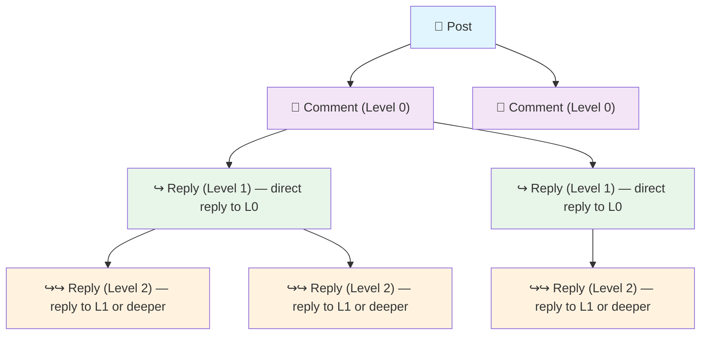

Enable rich, interactive discussions in your application with comprehensive comment functionality. social.plus SDK provides powerful commenting features including threaded discussions, real-time updates, multimedia support, and advanced moderation capabilities.

<Tip>
**Looking for a step-by-step walkthrough?** The [Comments & Reactions](/use-cases/social/comments-and-reactions) guide walks you through building threaded comments and emoji reactions end-to-end.
</Tip>

<CardGroup cols={3}>
  <Card title="Real-time Updates" icon="bolt">
    Live objects and collections for instant comment synchronization
  </Card>
  <Card title="Threaded Discussions" icon="share-nodes">
    Support for nested replies and complex conversation structures
  </Card>
  <Card title="Multimedia Comments" icon="image">
    Text, images, and rich media attachments in comments
  </Card>
</CardGroup>

<Info>
Comments support **Live Objects** and **real-time events**, providing automatic updates when comments are added, edited, or deleted across all connected clients.
</Info>

## Comment Hierarchy (Multi-Level Replies)

The social.plus comment system uses a **flat two-level display model** for replies:

```mermaid
graph TD
    P["📝 Post"] --> L0A["💬 Comment (Level 0)"]
    P --> L0B["💬 Comment (Level 0)"]
    L0A --> L1A["↪ Reply (Level 1) — direct reply to L0"]
    L0A --> L1B["↪ Reply (Level 1) — direct reply to L0"]
    L1A --> L2A["↪↪ Reply (Level 2) — reply to L1 or deeper"]
    L1A --> L2B["↪↪ Reply (Level 2) — reply to L1 or deeper"]
    L1B --> L2C["↪↪ Reply (Level 2) — reply to L1 or deeper"]

    style P fill:#e1f5fe
    style L0A fill:#f3e5f5
    style L0B fill:#f3e5f5
    style L1A fill:#e8f5e9
    style L1B fill:#e8f5e9
    style L2A fill:#fff3e0
    style L2B fill:#fff3e0
    style L2C fill:#fff3e0
```

| Level | Description | Created By |
|-------|-------------|------------|
| **Level 0 (L0)** | Top-level comments directly on a post, story, or content | Commenting on the content itself |
| **Level 1 (L1)** | Direct replies to an L0 comment | Replying to a top-level comment |
| **Level 2 (L2)** | Replies to an L1 comment | Replying to a Level 1 reply |

<Warning>
**The system officially supports up to Level 2.** Features such as `childrenCount`, reply count aggregation, notification grouping, and other system-level calculations only work up to Level 2. While the SDK technically allows creating deeper replies (L3, L4, …) by passing any comment's ID as `parentId`, those deeper levels are **not supported** — they will not be counted, aggregated, or displayed correctly.
</Warning>

<Info>
**UIKit Flattening**: In the UIKit, all replies beyond Level 1 are always rendered as Level 2. When a user replies to an L2 comment, the UIKit automatically resolves the `parentId` to the L1 ancestor so the new reply is created as an L2 comment. This keeps the display hierarchy capped at two nesting levels.
</Info>

## Comment Reference Types

Comments can be associated with different types of content, providing contextual discussions based on the content type.

| Reference Type | Description | Use Cases |
|---------------|-------------|-----------|
| **`post`** | Comments on regular user posts | Social media feeds, status updates, photo sharing |
| **`story`** | Comments on story content | Temporary content, social stories, time-limited posts |
| **`content`** | Comments on specialized content | Articles, documents, media galleries, custom content |

## Key Features

<CardGroup cols={2}>
  <Card title="Comment Creation" icon="plus">
    Create text comments, image comments, or mixed content with optimistic updates and validation.
  </Card>
  
  <Card title="Comment Retrieval" icon="magnifying-glass">
    Query and filter comments with advanced options, pagination, and real-time synchronization.
  </Card>
  
  <Card title="Threading & Replies" icon="reply">
    Build nested conversation threads with unlimited reply depth and proper organization.
  </Card>
  
  <Card title="Reactions & Engagement" icon="heart">
    Enable user engagement through reactions, mentions, and social interaction features.
  </Card>
  
  <Card title="Content Moderation" icon="shield">
    Edit, delete, flag, and moderate comments with comprehensive administrative controls.
  </Card>
  
  <Card title="Real-time Updates" icon="bolt">
    Automatic synchronization across all clients with live objects and real-time events.
  </Card>
</CardGroup>

## Comment Properties

Understanding comment data structure helps in building robust commenting systems.

| Property | Type | Description |
|----------|------|-------------|
| **`commentId`** | String | Unique identifier for the comment |
| **`userId`** | String | ID of the user who posted the comment |
| **`parentId`** | String? | ID of parent comment (for threaded replies) |
| **`referenceId`** | String | ID of the content being commented on |
| **`referenceType`** | String | Type of content (post, story, content) |
| **`dataType`** | String | Type of comment content (text, image) |
| **`data`** | Object | Main content body of the comment |
| **`metadata`** | Object | Additional custom properties and fields |
| **`childrenCount`** | Number | Number of reply comments |
| **`reactionsCount`** | Integer | Total number of reactions on the comment |
| **`myReactions`** | Array | Current user's reactions to the comment |
| **`isDeleted`** | Boolean | Whether the comment has been deleted |
| **`createdAt`** | DateTime | Comment creation timestamp |
| **`editedAt`** | DateTime | Last edit timestamp (if edited) |

## Related Topics

<CardGroup cols={2}>
  <Card title="Live Objects" href="/social-plus-sdk/core-concepts/realtime-communication/live-objects-collections/overview" icon="bolt">
    Understand real-time data synchronization and live collections
  </Card>
  <Card title="File Upload" href="/social-plus-sdk/core-concepts/content-handling/files-images-and-videos/file" icon="upload">
    Learn about file and image handling for multimedia comments
  </Card>
  <Card title="User Relationship" href="/social-plus-sdk/social/user-relationship/overview" icon="users">
    Explore user profiles, mentions, and social features
  </Card>
  <Card title="Content Moderation" href="/analytics-and-moderation/console/moderation/overview" icon="shield">
    Discover content moderation tools and administrative features
  </Card>
</CardGroup>
