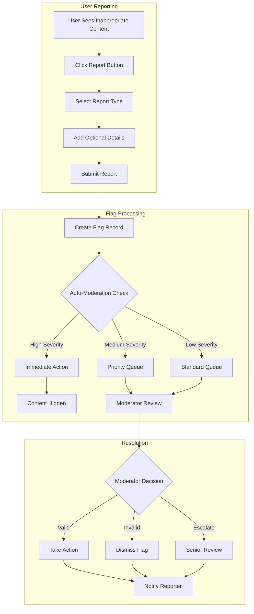

# Content Flagging System

Empower your community to maintain content quality through comprehensive flagging and reporting tools. Enable users to report inappropriate content while providing moderators with efficient tools to review and take action.

<CardGroup cols={2}>
  <Card title="Flag Posts" icon="flag" href="flag-unflag-post">
    Report and flag inappropriate posts with detailed reporting options
  </Card>
  <Card title="Flag Comments" icon="message-square" href="flag-unflag-comment">
    Report problematic comments with context-aware flagging
  </Card>
  <Card title="Flag Management" icon="cog" href="flag-management">
    Manage, review, and process content flags efficiently
  </Card>
  <Card title="Automated Detection" icon="robot" href="automated-detection">
    AI-powered content detection and automatic flagging
  </Card>
</CardGroup>

## Flagging System Architecture



## Flag Types and Categories

<AccordionGroup>
  <Accordion title="Content-Based Flags">
    - **Spam**: Promotional content, repetitive posts, irrelevant material
    - **Inappropriate Content**: Adult content, violence, disturbing material
    - **Misinformation**: False information, conspiracy theories, unverified claims
    - **Copyright Violation**: Unauthorized use of copyrighted material
  </Accordion>
  
  <Accordion title="Behavior-Based Flags">
    - **Harassment**: Bullying, personal attacks, targeted harassment
    - **Hate Speech**: Discriminatory language, slurs, hate symbols
    - **Impersonation**: Fake accounts, identity theft, misleading profiles
    - **Doxxing**: Sharing private information without consent
  </Accordion>
  
  <Accordion title="Community-Specific Flags">
    - **Off-Topic**: Content that doesn't belong in the community
    - **Rule Violation**: Breaking specific community guidelines
    - **Duplicate Content**: Repetitive or copied posts
    - **Low Quality**: Poor quality content that doesn't add value
  </Accordion>
</AccordionGroup>

## Implementation Examples

<Tabs>
  <Tab title="Basic Flagging">
    ```typescript
    // Flag a post
    const flagPost = async (postId: string, reason: string, details?: string) => {
      const flag = await AmitySDK.flagPost({
        postId,
        flagType: reason,
        description: details,
        anonymous: false
      });
      
      return flag;
    };
    
    // Flag a comment
    const flagComment = async (commentId: string, reason: string) => {
      const flag = await AmitySDK.flagComment({
        commentId,
        flagType: reason,
        context: {
          postId: 'parent-post-id',
          threadId: 'comment-thread-id'
        }
      });
      
      return flag;
    };
    
    // Unflag content (for false reports)
    const unflagContent = async (flagId: string, reason: string) => {
      await AmitySDK.unflagContent({
        flagId,
        reason,
        moderatorAction: true
      });
    };
    ```
  </Tab>
  
  <Tab title="Advanced Flagging">
    ```typescript
    // Flag with detailed context
    const flagWithContext = async (contentId: string, contentType: string) => {
      const flag = await AmitySDK.createFlag({
        contentId,
        contentType,
        flagType: 'inappropriate',
        severity: 'high',
        evidence: {
          screenshots: ['evidence-1.jpg', 'evidence-2.jpg'],
          relatedContent: ['related-post-1', 'related-comment-1'],
          witnesses: ['user-1', 'user-2']
        },
        metadata: {
          userAgent: navigator.userAgent,
          timestamp: Date.now(),
          location: 'community-general'
        }
      });
      
      return flag;
    };
    
    // Bulk flagging for coordinated abuse
    const bulkFlag = async (contentIds: string[], reason: string) => {
      const flags = await AmitySDK.bulkFlagContent({
        contentIds,
        flagType: reason,
        pattern: 'coordinated_abuse',
        evidence: {
          pattern_analysis: 'Similar content posted across multiple accounts',
          time_correlation: 'All posted within 30 minutes'
        }
      });
      
      return flags;
    };
    ```
  </Tab>
  
  <Tab title="Flag Management">
    ```typescript
    // Get flags for review
    const getModerationFlags = async () => {
      const flags = await AmitySDK.queryFlags({
        status: 'pending',
        priority: ['high', 'medium'],
        sortBy: 'created_at',
        limit: 50,
        include: ['content', 'reporter', 'context']
      });
      
      return flags;
    };
    
    // Process flag resolution
    const resolveFlag = async (flagId: string, action: string, reason: string) => {
      const resolution = await AmitySDK.resolveFlag({
        flagId,
        action, // 'approve', 'dismiss', 'escalate'
        reason,
        moderatorId: 'current-moderator',
        actions: {
          contentAction: 'remove', // 'remove', 'edit', 'hide'
          userAction: 'warn', // 'warn', 'suspend', 'ban'
          notifyReporter: true,
          notifyAuthor: true
        }
      });
      
      return resolution;
    };
    
    // Get flag statistics
    const getFlagStats = async () => {
      const stats = await AmitySDK.getFlagAnalytics({
        timeRange: 'last_30_days',
        breakdown: 'by_type',
        include: [
          'total_flags',
          'resolution_rate',
          'average_response_time',
          'accuracy_rate'
        ]
      });
      
      return stats;
    };
    ```
  </Tab>
</Tabs>

## Automated Detection

<AccordionGroup>
  <Accordion title="AI-Powered Detection">
    - **Text Analysis**: Detect toxic language, spam patterns, and inappropriate content
    - **Image Recognition**: Identify inappropriate images, memes, and visual content
    - **Pattern Recognition**: Detect coordinated abuse and suspicious behavior patterns
    - **Sentiment Analysis**: Identify negative sentiment and potential conflicts
  </Accordion>
  
  <Accordion title="Rule-Based Systems">
    - **Keyword Filters**: Customizable word lists with context awareness
    - **Behavior Patterns**: Detect spam-like posting patterns and frequency
    - **Link Analysis**: Check for malicious or inappropriate links
    - **User History**: Consider user's past behavior and reputation
  </Accordion>
  
  <Accordion title="Community-Driven Detection">
    - **Trusted Reporters**: Weight reports from reliable community members
    - **Consensus Building**: Require multiple reports for certain actions
    - **Community Voting**: Let community members vote on borderline content
    - **Expert Reviewers**: Involve subject matter experts for specialized content
  </Accordion>
</AccordionGroup>

## Best Practices

<AccordionGroup>
  <Accordion title="User Experience">
    - **Easy Reporting**: Make flagging intuitive and accessible
    - **Clear Categories**: Provide clear, understandable flag categories
    - **Feedback**: Inform users about the outcome of their reports
    - **False Flag Prevention**: Implement measures to prevent abuse of the flagging system
  </Accordion>
  
  <Accordion title="Moderation Efficiency">
    - **Priority Queues**: Prioritize flags based on severity and community impact
    - **Automated Triage**: Use AI to pre-sort and prioritize flags
    - **Batch Processing**: Enable moderators to handle similar flags efficiently
    - **Decision Support**: Provide context and history to help moderators decide
  </Accordion>
  
  <Accordion title="Community Health">
    - **Transparency**: Be transparent about moderation policies and actions
    - **Consistency**: Apply flagging policies consistently across all content
    - **Education**: Help users understand what constitutes inappropriate content
    - **Continuous Improvement**: Regularly review and update flagging policies
  </Accordion>
</AccordionGroup>

## Related Documentation

- **[Post Flagging](flag-unflag-post)** - Detailed post flagging implementation
- **[Comment Flagging](flag-unflag-comment)** - Comment-specific flagging features
- **[Review Process](../review-process)** - How flags are processed and resolved
- **[Moderation Overview](../overview)** - Complete moderation system architecture
