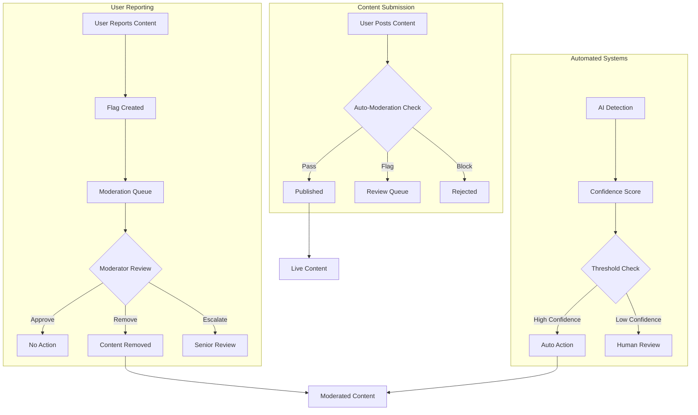

# Content Moderation

Build safe and healthy communities with comprehensive moderation tools. Implement content flagging, automated detection, review workflows, and community governance to maintain high-quality discussions.

<CardGroup cols={2}>
  <Card title="Content Flagging" icon="flag" href="content-flagging/overview">
    User-driven content reporting with automated and manual review systems
  </Card>
  <Card title="Review Process" icon="search" href="review-process">
    Structured workflows for content review, approval, and action management
  </Card>
  <Card title="Auto-Moderation" icon="robot" href="auto-moderation">
    AI-powered content detection and automated moderation actions
  </Card>
  <Card title="Community Guidelines" icon="book" href="community-guidelines">
    Establish and enforce clear community standards and policies
  </Card>
</CardGroup>

## Moderation Architecture



## Core Moderation Features

<AccordionGroup>
  <Accordion title="Content Flagging System">
    - **User Reporting**: Easy-to-use reporting interface for community members
    - **Multiple Report Types**: Spam, harassment, inappropriate content, misinformation
    - **Anonymous Reporting**: Allow users to report content without revealing identity
    - **Bulk Reporting**: Handle multiple pieces of content from the same source
  </Accordion>
  
  <Accordion title="Automated Moderation">
    - **AI Content Detection**: Machine learning models for inappropriate content detection
    - **Keyword Filtering**: Customizable word filters with context awareness
    - **Spam Detection**: Pattern recognition for spam and promotional content
    - **Image Recognition**: Visual content analysis for inappropriate images
  </Accordion>
  
  <Accordion title="Review Workflows">
    - **Moderation Queue**: Organized queue system for pending content review
    - **Priority Levels**: High, medium, low priority handling based on severity
    - **Moderator Assignment**: Route content to appropriate moderators
    - **Review History**: Complete audit trail of moderation decisions
  </Accordion>
  
  <Accordion title="Action Management">
    - **Content Actions**: Hide, remove, edit, or require approval for content
    - **User Actions**: Warnings, temporary bans, permanent bans, account restrictions
    - **Community Actions**: Community-wide policy enforcement and announcements
    - **Appeal Process**: Structured system for users to appeal moderation decisions
  </Accordion>
</AccordionGroup>

## Implementation Guide

<Tabs>
  <Tab title="Basic Moderation Setup">
    ```typescript
    // Set up basic content flagging
    const flaggingConfig = {
      reportTypes: [
        { id: 'spam', label: 'Spam or Promotional Content' },
        { id: 'harassment', label: 'Harassment or Bullying' },
        { id: 'inappropriate', label: 'Inappropriate Content' },
        { id: 'misinformation', label: 'False Information' }
      ],
      anonymousReporting: true,
      autoEscalation: {
        thresholds: {
          spam: 5,
          harassment: 3,
          inappropriate: 2
        }
      }
    };
    
    // Enable auto-moderation
    const autoModerationConfig = {
      profanityFilter: {
        enabled: true,
        severity: 'medium',
        action: 'flag_for_review'
      },
      spamDetection: {
        enabled: true,
        confidence: 0.8,
        action: 'auto_remove'
      }
    };
    ```
  </Tab>
  
  <Tab title="Advanced Moderation">
    ```typescript
    // Custom moderation rules
    const moderationRules = [
      {
        name: 'Promotional Content Filter',
        conditions: {
          contentType: ['post', 'comment'],
          contains: ['buy now', 'limited offer', 'click here'],
          userAge: { lessThan: 30 } // days since account creation
        },
        action: 'require_approval',
        priority: 'high'
      },
      {
        name: 'Repeat Offender Auto-Ban',
        conditions: {
          userFlags: { moreThan: 10 },
          timeframe: '30_days'
        },
        action: 'temporary_ban',
        duration: '7_days'
      }
    ];
    
    // Implement custom AI moderation
    const aiModerationService = {
      async analyzeContent(content) {
        const analysis = await AmitySDK.analyzeContent({
          text: content.text,
          images: content.images,
          metadata: content.metadata
        });
        
        return {
          toxicity: analysis.toxicity,
          spam: analysis.spam,
          inappropriate: analysis.inappropriate,
          confidence: analysis.confidence,
          categories: analysis.categories
        };
      }
    };
    ```
  </Tab>
  
  <Tab title="Moderation Dashboard">
    ```typescript
    // Get moderation queue
    const moderationQueue = await AmitySDK.getModerationQueue({
      status: 'pending',
      priority: ['high', 'medium'],
      assignedTo: 'current_moderator',
      limit: 50,
      sortBy: 'priority_desc'
    });
    
    // Process moderation actions
    const processModerationAction = async (itemId, action) => {
      const result = await AmitySDK.processModerationItem({
        itemId,
        action: action.type, // 'approve', 'remove', 'edit', 'escalate'
        reason: action.reason,
        notes: action.notes,
        moderatorId: 'current_moderator'
      });
      
      // Notify relevant parties
      if (action.notifyUser) {
        await AmitySDK.sendModerationNotification({
          userId: result.contentAuthor,
          action: action.type,
          reason: action.reason
        });
      }
      
      return result;
    };
    
    // Get moderation analytics
    const analytics = await AmitySDK.getModerationAnalytics({
      timeRange: 'last_30_days',
      metrics: [
        'reports_received',
        'actions_taken',
        'response_time',
        'accuracy_rate'
      ]
    });
    ```
  </Tab>
</Tabs>

## Moderation Best Practices

<AccordionGroup>
  <Accordion title="Community Guidelines">
    - **Clear Policies**: Establish clear, understandable community guidelines
    - **Consistent Enforcement**: Apply rules consistently across all users
    - **Transparency**: Communicate moderation actions and reasoning clearly
    - **Regular Updates**: Keep guidelines current with community needs
  </Accordion>
  
  <Accordion title="Moderator Training">
    - **Comprehensive Training**: Provide thorough training for all moderators
    - **Decision Guidelines**: Create clear guidelines for common moderation scenarios
    - **Escalation Procedures**: Establish when and how to escalate difficult cases
    - **Performance Monitoring**: Regular review of moderator decisions and performance
  </Accordion>
  
  <Accordion title="Technology Balance">
    - **Human + AI**: Combine automated tools with human judgment
    - **Context Awareness**: Consider context when making moderation decisions
    - **False Positive Management**: Have processes to handle incorrect automated actions
    - **Continuous Improvement**: Regularly update and improve moderation systems
  </Accordion>
  
  <Accordion title="User Experience">
    - **Quick Response**: Respond to reports and appeals promptly
    - **Fair Process**: Provide fair and transparent appeal processes
    - **Educational Approach**: Help users understand and follow community guidelines
    - **Positive Reinforcement**: Recognize and reward positive community behavior
  </Accordion>
</AccordionGroup>

## Related Features

- **[Content Flagging](content-flagging/overview)** - Detailed flagging system implementation
- **[Review Process](review-process)** - Step-by-step moderation workflows
- **[User Interactions](../../user-interactions/overview)** - Manage user relationships and blocking
- **[Communities & Spaces](../../communities-spaces/overview)** - Community-specific moderation tools
