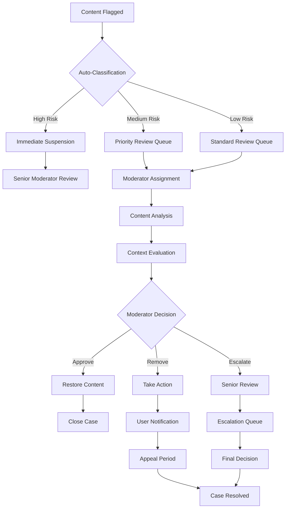

# Content Review Process

Implement efficient and fair content review workflows that balance automation with human judgment. Create structured processes for handling flagged content, appeals, and community governance.

## Review Workflow Overview



## Review Process Stages

<AccordionGroup>
  <Accordion title="Initial Triage">
    **Automated Classification**
    - AI-powered severity assessment
    - Risk scoring based on content analysis
    - Historical pattern recognition
    - Community impact evaluation
    
    **Queue Assignment**
    - High priority: Immediate attention required
    - Medium priority: Review within 2-4 hours
    - Low priority: Review within 24 hours
    - Bulk processing: Similar cases grouped together
  </Accordion>
  
  <Accordion title="Content Analysis">
    **Context Evaluation**
    - Review complete conversation thread
    - Consider community-specific guidelines
    - Assess user history and reputation
    - Evaluate potential harm or impact
    
    **Evidence Collection**
    - Screenshots and content preservation
    - Related content and patterns
    - User reports and community feedback
    - Expert opinions when needed
  </Accordion>
  
  <Accordion title="Decision Making">
    **Moderation Actions**
    - No action: Content approved
    - Edit/Redact: Remove specific portions
    - Hide: Temporarily remove from public view
    - Remove: Permanently delete content
    - Escalate: Send to senior moderator
    
    **User Actions**
    - Warning: Formal notice to user
    - Temporary suspension: Time-limited account restriction
    - Permanent ban: Complete account termination
    - Content restrictions: Limit posting abilities
  </Accordion>
  
  <Accordion title="Resolution & Appeals">
    **Case Resolution**
    - Document decision rationale
    - Notify affected parties
    - Update user records
    - Archive case for future reference
    
    **Appeal Process**
    - User appeal submission
    - Independent review
    - Decision communication
    - Final resolution
  </Accordion>
</AccordionGroup>

## Implementation Framework

<Tabs>
  <Tab title="Review Queue Management">
    ```typescript
    // Set up review queue system
    const reviewQueueConfig = {
      priorities: {
        immediate: { sla: '15_minutes', auto_escalate: true },
        high: { sla: '2_hours', reminder_interval: '30_minutes' },
        medium: { sla: '4_hours', reminder_interval: '1_hour' },
        low: { sla: '24_hours', reminder_interval: '4_hours' }
      },
      assignment: {
        method: 'round_robin', // 'round_robin', 'skill_based', 'workload_balanced'
        backup_assignment: true,
        escalation_threshold: '2_hours_overdue'
      }
    };
    
    // Get items for review
    const getReviewItems = async (moderatorId: string) => {
      const items = await AmitySDK.getReviewQueue({
        assignedTo: moderatorId,
        status: 'pending',
        sortBy: 'priority_and_age',
        include: ['content', 'context', 'flags', 'history'],
        limit: 20
      });
      
      return items.map(item => ({
        id: item.id,
        contentType: item.contentType,
        priority: item.priority,
        flagCount: item.flags.length,
        submittedAt: item.createdAt,
        slaDeadline: item.slaDeadline,
        content: item.content,
        context: item.context
      }));
    };
    ```
  </Tab>
  
  <Tab title="Decision Workflow">
    ```typescript
    // Process moderation decision
    const processModerationDecision = async (reviewId: string, decision: ModerationDecision) => {
      // Validate decision
      const validation = await validateDecision(decision);
      if (!validation.valid) {
        throw new Error(`Invalid decision: ${validation.errors.join(', ')}`);
      }
      
      // Execute decision
      const result = await AmitySDK.executeModerationDecision({
        reviewId,
        decision: decision.action,
        reason: decision.reason,
        evidence: decision.evidence,
        moderatorId: decision.moderatorId,
        actions: {
          contentAction: decision.contentAction,
          userAction: decision.userAction,
          notifications: decision.notifications,
          escalation: decision.needsEscalation
        }
      });
      
      // Handle post-decision actions
      if (decision.contentAction === 'remove') {
        await handleContentRemoval(result.contentId, decision.reason);
      }
      
      if (decision.userAction && decision.userAction !== 'none') {
        await handleUserAction(result.userId, decision.userAction, decision.reason);
      }
      
      // Send notifications
      await sendModerationNotifications(result, decision.notifications);
      
      return result;
    };
    
    // Handle escalation
    const escalateCase = async (reviewId: string, escalationReason: string) => {
      const escalation = await AmitySDK.escalateReview({
        reviewId,
        reason: escalationReason,
        escalatedBy: 'current_moderator',
        priority: 'high',
        additionalContext: {
          complexity: 'high',
          policyUncertainty: true,
          communityImpact: 'significant'
        }
      });
      
      return escalation;
    };
    ```
  </Tab>
  
  <Tab title="Appeals Management">
    ```typescript
    // Handle user appeals
    const processAppeal = async (appealData: AppealRequest) => {
      // Create appeal record
      const appeal = await AmitySDK.createAppeal({
        originalDecisionId: appealData.decisionId,
        userId: appealData.userId,
        reason: appealData.reason,
        evidence: appealData.evidence,
        requestedAction: appealData.requestedAction
      });
      
      // Assign to different moderator
      const assignment = await AmitySDK.assignAppeal({
        appealId: appeal.id,
        assignmentCriteria: {
          excludeOriginalModerator: true,
          requireSeniorLevel: true,
          specialization: appealData.contentType
        }
      });
      
      return { appeal, assignment };
    };
    
    // Process appeal decision
    const resolveAppeal = async (appealId: string, resolution: AppealResolution) => {
      const result = await AmitySDK.resolveAppeal({
        appealId,
        decision: resolution.decision, // 'upheld', 'overturned', 'modified'
        reason: resolution.reason,
        newAction: resolution.newAction,
        reviewedBy: resolution.reviewerId,
        finalDecision: true
      });
      
      // Update original case
      if (resolution.decision === 'overturned') {
        await AmitySDK.reverseOriginalDecision({
          originalDecisionId: result.originalDecisionId,
          appealId,
          restorationActions: resolution.restorationActions
        });
      }
      
      return result;
    };
    ```
  </Tab>
</Tabs>

## Quality Assurance

<AccordionGroup>
  <Accordion title="Decision Consistency">
    - **Review Guidelines**: Clear, detailed guidelines for common scenarios
    - **Case Studies**: Examples of similar cases and their resolutions
    - **Peer Review**: Sample of decisions reviewed by other moderators
    - **Calibration Sessions**: Regular training to maintain consistency
  </Accordion>
  
  <Accordion title="Performance Monitoring">
    - **Response Times**: Track adherence to SLA requirements
    - **Decision Accuracy**: Monitor appeal success rates and overturns
    - **Throughput**: Balance speed with quality of reviews
    - **User Satisfaction**: Feedback from users on moderation experiences
  </Accordion>
  
  <Accordion title="Continuous Improvement">
    - **Policy Updates**: Regular review and updating of moderation policies
    - **Process Optimization**: Streamline workflows based on performance data
    - **Training Programs**: Ongoing education for moderation team
    - **Technology Enhancement**: Improve tools and automation systems
  </Accordion>
</AccordionGroup>

## Best Practices

<AccordionGroup>
  <Accordion title="Fair Process">
    - **Due Process**: Ensure fair treatment for all users
    - **Transparency**: Clear communication about decisions and policies
    - **Proportionate Response**: Match actions to severity of violations
    - **Appeal Rights**: Provide meaningful appeal opportunities
  </Accordion>
  
  <Accordion title="Efficient Operations">
    - **Batch Processing**: Group similar cases for efficient handling
    - **Template Responses**: Standardized communications for common scenarios
    - **Automation Balance**: Use automation to enhance, not replace, human judgment
    - **Resource Planning**: Adequate staffing for expected review volumes
  </Accordion>
  
  <Accordion title="Community Trust">
    - **Consistent Application**: Apply rules equally to all users
    - **Clear Communication**: Explain decisions and reasoning clearly
    - **Responsive Support**: Address user concerns promptly
    - **Community Involvement**: Include community input in policy development
  </Accordion>
</AccordionGroup>

## Related Documentation

- **[Content Flagging](content-flagging/overview)** - How content enters the review process
- **[Moderation Overview](overview)** - Complete moderation system architecture
- **[Community Guidelines](community-guidelines)** - Establishing clear community standards
- **[User Actions](../../user-interactions/blocking-system/overview)** - User-level moderation actions
