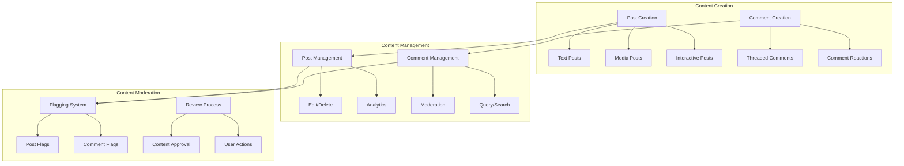

# Content Management

Build rich content experiences with comprehensive tools for creating, managing, and moderating posts and comments. This section covers the complete content lifecycle from creation to moderation.

<CardGroup cols={3}>
  <Card title="Post Creation" icon="pen-to-square">
    Create rich posts with text, images, videos, polls, and custom formats
  </Card>
  <Card title="Comment System" icon="message-circle">
    Enable threaded discussions with mentions, reactions, and real-time updates
  </Card>
  <Card title="Content Moderation" icon="shield">
    Comprehensive tools for flagging, reviewing, and managing content quality
  </Card>
</CardGroup>

## Architecture Overview

## Core Features

<Tabs>
  <Tab title="Posts">
    <CardGroup cols={2}>
      <Card title="Post Creation" icon="plus" href="posts/creation/overview">
        Create various types of posts with rich media support
        - Text, image, video, and file posts
        - Interactive polls and live streams
        - Custom post types and metadata
        - Multi-media post compositions
      </Card>
      <Card title="Post Management" icon="cog" href="posts/management/overview">
        Manage post lifecycle and operations
        - Edit and update posts
        - Delete and archive posts
        - Pin important posts
        - Post review and approval
      </Card>
      <Card title="Post Interactions" icon="users" href="posts/interactions/overview">
        Enable user interactions with posts
        - View and display posts
        - Query and search posts
        - Handle mentions in posts
        - Track user engagement
      </Card>
      <Card title="Post Analytics" icon="chart-line" href="posts/analytics/overview">
        Track post performance and engagement
        - Post impression tracking
        - Engagement metrics
        - Performance analytics
        - Content insights
      </Card>
    </CardGroup>
  </Tab>
  
  <Tab title="Comments">
    <CardGroup cols={2}>
      <Card title="Basic Operations" icon="message" href="comments/basic-operations/overview">
        Core comment functionality
        - Create and post comments
        - Edit and update comments
        - Delete comments
        - View comment threads
      </Card>
      <Card title="Advanced Features" icon="sparkles" href="comments/advanced-features/overview">
        Enhanced comment capabilities
        - Mention users in comments
        - Comment reactions and engagement
        - Get latest comments
        - Real-time comment updates
      </Card>
      <Card title="Comment Management" icon="list" href="comments/management/overview">
        Query and organize comments
        - Search and filter comments
        - Get specific comments
        - Comment pagination
        - Thread navigation
      </Card>
    </CardGroup>
  </Tab>
  
  <Tab title="Moderation">
    <CardGroup cols={2}>
      <Card title="Content Flagging" icon="flag" href="moderation/content-flagging/overview">
        Report and flag inappropriate content
        - Flag posts for review
        - Flag comments for moderation
        - User reporting system
        - Automated content detection
      </Card>
      <Card title="Review Process" icon="search" href="moderation/review-process">
        Content review and moderation workflows
        - Content approval process
        - Moderation actions
        - Review queue management
        - Community guidelines enforcement
      </Card>
    </CardGroup>
  </Tab>
</Tabs>

## Getting Started

<AccordionGroup>
  <Accordion title="Basic Content App">
    **Essential Features**: Posts + Comments + Basic Moderation
    
    1. **Setup Post Creation**: Start with [text posts](posts/creation/text-post) and [image posts](posts/creation/image-post)
    2. **Enable Comments**: Add [basic comment operations](comments/basic-operations/create-comment)
    3. **Add Moderation**: Implement [content flagging](moderation/content-flagging/flag-post)
    4. **Display Content**: Setup [post viewing](posts/interactions/viewing-post-content) and [querying](posts/interactions/query-post)
  </Accordion>
  
  <Accordion title="Advanced Content Platform">
    **Enhanced Features**: All post types + Advanced comments + Full moderation
    
    1. **Rich Post Creation**: Implement [polls](posts/creation/poll-post), [videos](posts/creation/video-post), and [custom posts](posts/creation/custom-post)
    2. **Interactive Comments**: Add [mentions](comments/advanced-features/mention-in-comment) and [reactions](comments/advanced-features/get-comment-reaction-data)
    3. **Content Analytics**: Setup [post impressions](posts/analytics/post-impression) and performance tracking
    4. **Advanced Moderation**: Implement comprehensive [review processes](moderation/review-process)
  </Accordion>
</AccordionGroup>

## Best Practices

<AccordionGroup>
  <Accordion title="Content Creation">
    - **Media Optimization**: Compress images and videos before upload
    - **Content Validation**: Validate content before submission
    - **Draft Management**: Allow users to save drafts
    - **Rich Text Support**: Enable formatting and media embedding
  </Accordion>
  
  <Accordion title="Comment Management">
    - **Real-time Updates**: Use live events for comment updates
    - **Threading**: Implement proper comment threading
    - **Pagination**: Load comments progressively
    - **Moderation**: Pre-moderate comments in sensitive contexts
  </Accordion>
  
  <Accordion title="Content Moderation">
    - **Automated Screening**: Use AI-powered content detection
    - **User Reporting**: Make reporting easy and accessible
    - **Review Workflows**: Establish clear moderation processes
    - **Community Guidelines**: Provide clear content policies
  </Accordion>
</AccordionGroup>
