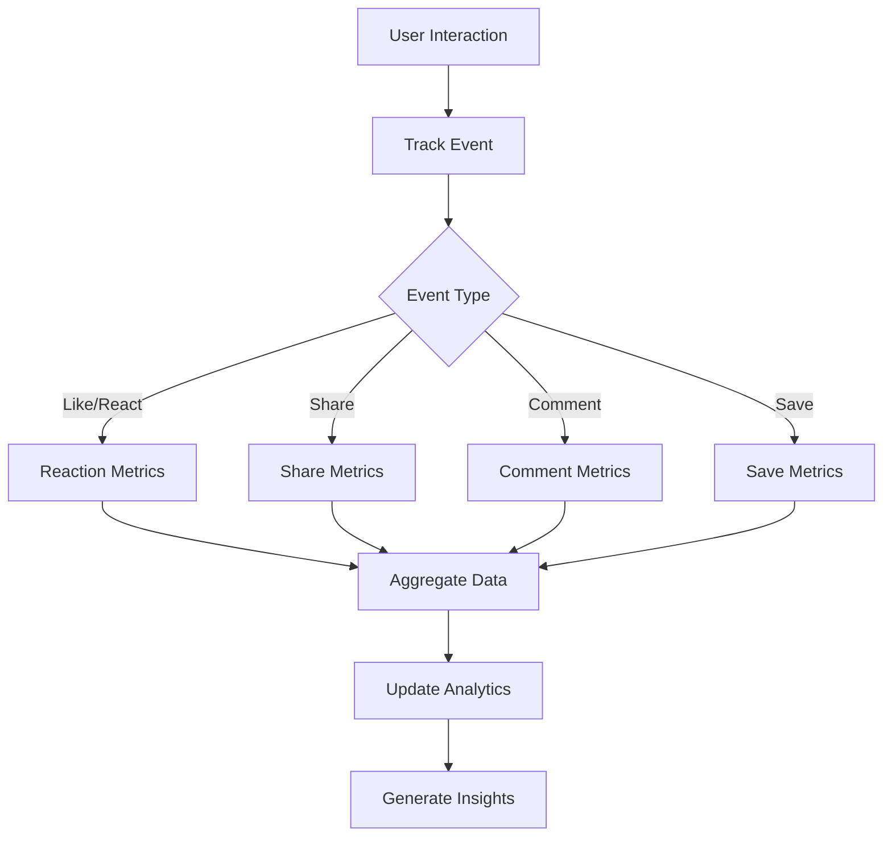

# Engagement Metrics

Monitor and analyze how users interact with posts through comprehensive engagement tracking. Understand user behavior, content performance, and community dynamics through detailed metrics.

<CardGroup cols={2}>
  <Card title="Interaction Tracking" icon="cursor-arrow-ripple">
    Track likes, reactions, shares, comments, and saves
  </Card>
  <Card title="User Behavior" icon="user-group">
    Analyze user engagement patterns and preferences
  </Card>
  <Card title="Content Performance" icon="chart-line">
    Measure post success and viral potential
  </Card>
  <Card title="Real-time Analytics" icon="bolt">
    Get live updates on engagement as it happens
  </Card>
</CardGroup>

## Engagement Flow



## Key Metrics

<AccordionGroup>
  <Accordion title="Basic Engagement">
    - **Likes**: Total likes and like rate per post
    - **Reactions**: Breakdown by reaction type and sentiment
    - **Comments**: Comment count and engagement depth
    - **Shares**: Share count and virality coefficient
    - **Saves**: Bookmark count and save rate
  </Accordion>
  
  <Accordion title="Advanced Analytics">
    - **Engagement Rate**: Interactions per view or impression
    - **Reach**: Unique users who saw the content
    - **Dwell Time**: How long users spend viewing content
    - **Click-through Rate**: Clicks on links or media
    - **Conversion Rate**: Actions taken from post engagement
  </Accordion>
  
  <Accordion title="Temporal Analysis">
    - **Peak Engagement Times**: When users are most active
    - **Engagement Decay**: How engagement changes over time
    - **Viral Velocity**: Speed of engagement growth
    - **Retention**: Repeat engagement from same users
  </Accordion>
</AccordionGroup>

## Implementation

<CodeGroup>
```swift iOS
import AmitySDK

// Get post engagement metrics
func getPostEngagement(postId: String) async throws -> AmityPostEngagement {
    let analyticsRepository = AmityAnalyticsRepository(client: client)
    
    return try await analyticsRepository.getPostEngagement(postId: postId)
}

// Track custom engagement event
func trackEngagementEvent(postId: String, eventType: String, metadata: [String: Any]) async throws {
    let analyticsRepository = AmityAnalyticsRepository(client: client)
    
    try await analyticsRepository.trackEvent(
        type: eventType,
        referenceId: postId,
        referenceType: "post",
        metadata: metadata
    )
}
```

```typescript TypeScript
import { AnalyticsRepository } from '@amityco/ts-sdk';

// Get engagement metrics for a post
async function getPostEngagement(postId: string) {
  const { data: metrics } = await AnalyticsRepository.getPostMetrics({
    postId: postId,
    timeframe: '7d',
    metrics: ['likes', 'reactions', 'comments', 'shares', 'saves']
  });
  
  return metrics;
}

// Track engagement event
async function trackEngagement(postId: string, eventType: string, metadata?: object) {
  await AnalyticsRepository.trackEvent({
    type: eventType,
    referenceId: postId,
    referenceType: 'post',
    metadata: metadata
  });
}
```

```kotlin Android
// Get post engagement data
fun getPostEngagement(postId: String): AmityEngagementMetrics {
    val analyticsRepository = AmityAnalyticsRepository(client)
    
    return analyticsRepository.getPostEngagement(postId)
        .blockingGet()
}

// Track engagement event
fun trackEngagement(postId: String, eventType: String, metadata: Map<String, Any>) {
    val analyticsRepository = AmityAnalyticsRepository(client)
    
    analyticsRepository.trackEvent(eventType, postId, "post", metadata)
        .subscribe()
}
```
</CodeGroup>

## Analytics Dashboard

<AccordionGroup>
  <Accordion title="Real-time Monitoring">
    - **Live Engagement**: Real-time engagement updates
    - **Active Users**: Currently engaged users count
    - **Trending Content**: Posts with rapid engagement growth
    - **Alerts**: Notifications for unusual engagement patterns
  </Accordion>
  
  <Accordion title="Performance Reports">
    - **Top Performing Posts**: Highest engagement by period
    - **User Engagement Leaders**: Most active community members
    - **Content Type Analysis**: Performance by post type
    - **Engagement Trends**: Historical engagement patterns
  </Accordion>
  
  <Accordion title="Behavioral Insights">
    - **User Journey**: How users discover and engage with content
    - **Content Preferences**: What types of content users prefer
    - **Engagement Patterns**: When and how users interact
    - **Community Health**: Overall engagement vitality metrics
  </Accordion>
</AccordionGroup>

## Use Cases

<CardGroup cols={3}>
  <Card title="Content Strategy" icon="strategy">
    Optimize content based on engagement patterns
  </Card>
  <Card title="Community Health" icon="heart-pulse">
    Monitor and improve community vitality
  </Card>
  <Card title="User Insights" icon="user-magnifying-glass">
    Understand user preferences and behavior
  </Card>
</CardGroup>

## Related Topics

<CardGroup cols={3}>
  <Card title="Post Impressions" href="post-impressions" icon="eye">
    Track post views and visibility metrics
  </Card>
  <Card title="Performance Tracking" href="performance-tracking" icon="chart-bar">
    Monitor overall post performance
  </Card>
  <Card title="Post Engagement" href="../engagement/overview" icon="heart">
    Learn about engagement features
  </Card>
</CardGroup>
