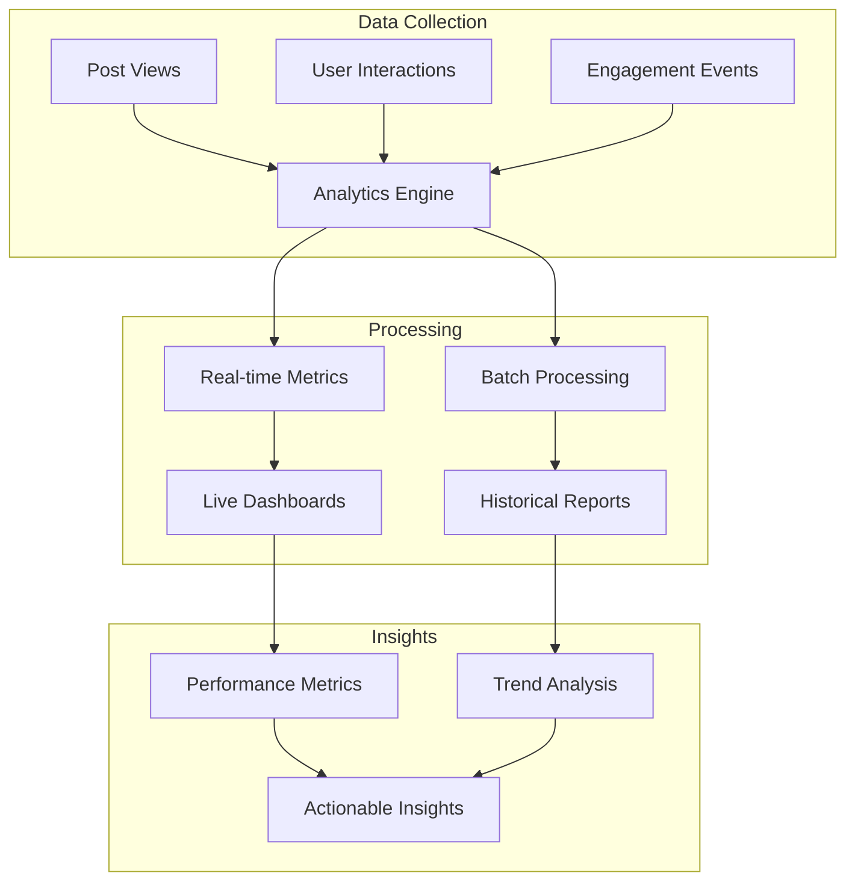

# Post Analytics

Monitor and analyze post performance with comprehensive analytics tools. Track impressions, engagement metrics, and gain insights into content effectiveness.

<CardGroup cols={2}>
  <Card title="Post Impressions" icon="eye" href="post-impression">
    Track how many times posts are viewed and displayed to users
  </Card>
  <Card title="Engagement Metrics" icon="chart-line" href="engagement-metrics">
    Analyze likes, comments, shares, and other interaction metrics
  </Card>
  <Card title="Performance Insights" icon="lightbulb" href="performance-insights">
    Get actionable insights about content performance and audience behavior
  </Card>
  <Card title="Trend Analysis" icon="trending-up" href="trend-analysis">
    Identify trending content and understand viral growth patterns
  </Card>
</CardGroup>

## Analytics Architecture



## Key Metrics

<AccordionGroup>
  <Accordion title="Impression Metrics">
    - **View Count**: Total number of times post was displayed
    - **Unique Views**: Number of unique users who viewed the post
    - **View Duration**: How long users spent viewing the content
    - **Scroll Depth**: How much of the post content was actually seen
  </Accordion>
  
  <Accordion title="Engagement Metrics">
    - **Reaction Rate**: Percentage of viewers who reacted to the post
    - **Comment Rate**: Percentage of viewers who commented
    - **Share Rate**: How often the post was shared or forwarded
    - **Click-through Rate**: For posts with links or calls-to-action
  </Accordion>
  
  <Accordion title="Performance Indicators">
    - **Viral Coefficient**: How much the post spreads organically
    - **Engagement Score**: Combined metric of all interactions
    - **Reach**: Total number of unique users who saw the post
    - **Amplification**: How much users shared and promoted the content
  </Accordion>
</AccordionGroup>

## Implementation Guide

<Tabs>
  <Tab title="Basic Tracking">
    ```typescript
    // Track post impression
    await AmitySDK.reportPostImpression({
      postId: 'post-123',
      userId: 'user-456',
      impressionType: 'view',
      source: 'feed'
    });
    
    // Get basic post metrics
    const metrics = await AmitySDK.getPostAnalytics('post-123');
    console.log('Views:', metrics.viewsCount);
    console.log('Reactions:', metrics.reactionsCount);
    console.log('Comments:', metrics.commentsCount);
    ```
  </Tab>
  
  <Tab title="Advanced Analytics">
    ```typescript
    // Get detailed analytics
    const analytics = await AmitySDK.getPostAnalytics('post-123', {
      timeRange: {
        start: '2024-01-01',
        end: '2024-01-31'
      },
      metrics: [
        'impressions',
        'uniqueViews',
        'engagement',
        'demographics'
      ],
      breakdown: 'daily'
    });
    
    // Track engagement events
    await AmitySDK.trackEngagementEvent({
      postId: 'post-123',
      userId: 'user-456',
      eventType: 'reaction_added',
      reactionType: 'like',
      timestamp: Date.now()
    });
    ```
  </Tab>
  
  <Tab title="Performance Insights">
    ```typescript
    // Get content performance insights
    const insights = await AmitySDK.getContentInsights({
      userId: 'creator-id',
      timeRange: 'last_30_days',
      contentTypes: ['text', 'image', 'video']
    });
    
    // Top performing posts
    const topPosts = insights.topPerforming.map(post => ({
      id: post.postId,
      engagementRate: post.engagementRate,
      reach: post.uniqueViews,
      viralScore: post.viralCoefficient
    }));
    
    // Content recommendations
    const recommendations = insights.recommendations;
    console.log('Best posting time:', recommendations.optimalPostingTime);
    console.log('Top content types:', recommendations.topContentTypes);
    ```
  </Tab>
</Tabs>

## Analytics Dashboard

<AccordionGroup>
  <Accordion title="Real-time Metrics">
    - **Live View Count**: Real-time view tracking with WebSocket updates
    - **Engagement Feed**: Live stream of reactions, comments, and shares
    - **Performance Alerts**: Notifications when posts perform exceptionally well
    - **Trending Indicators**: Real-time identification of viral content
  </Accordion>
  
  <Accordion title="Historical Analysis">
    - **Time Series Data**: Track metrics over time with trend analysis
    - **Comparative Analysis**: Compare posts against historical performance
    - **Seasonal Patterns**: Identify recurring patterns in engagement
    - **Cohort Analysis**: Analyze user behavior patterns over time
  </Accordion>
  
  <Accordion title="Actionable Insights">
    - **Content Optimization**: Recommendations for improving post performance
    - **Audience Insights**: Understanding what resonates with your audience
    - **Posting Strategy**: Optimal times and frequencies for content publication
    - **Content Mix**: Balance of different content types for maximum engagement
  </Accordion>
</AccordionGroup>

## Best Practices

<AccordionGroup>
  <Accordion title="Data Collection">
    - **Privacy Compliance**: Ensure analytics comply with privacy regulations
    - **User Consent**: Obtain proper consent for tracking user behavior
    - **Data Accuracy**: Implement measures to prevent analytics manipulation
    - **Real-time Processing**: Process important metrics in real-time for immediate insights
  </Accordion>
  
  <Accordion title="Performance Optimization">
    - **Efficient Tracking**: Use batching and sampling for high-volume tracking
    - **Storage Optimization**: Implement data retention policies for historical data
    - **Query Performance**: Optimize analytics queries for fast dashboard loading
    - **Caching Strategy**: Cache frequently accessed analytics data
  </Accordion>
</AccordionGroup>
