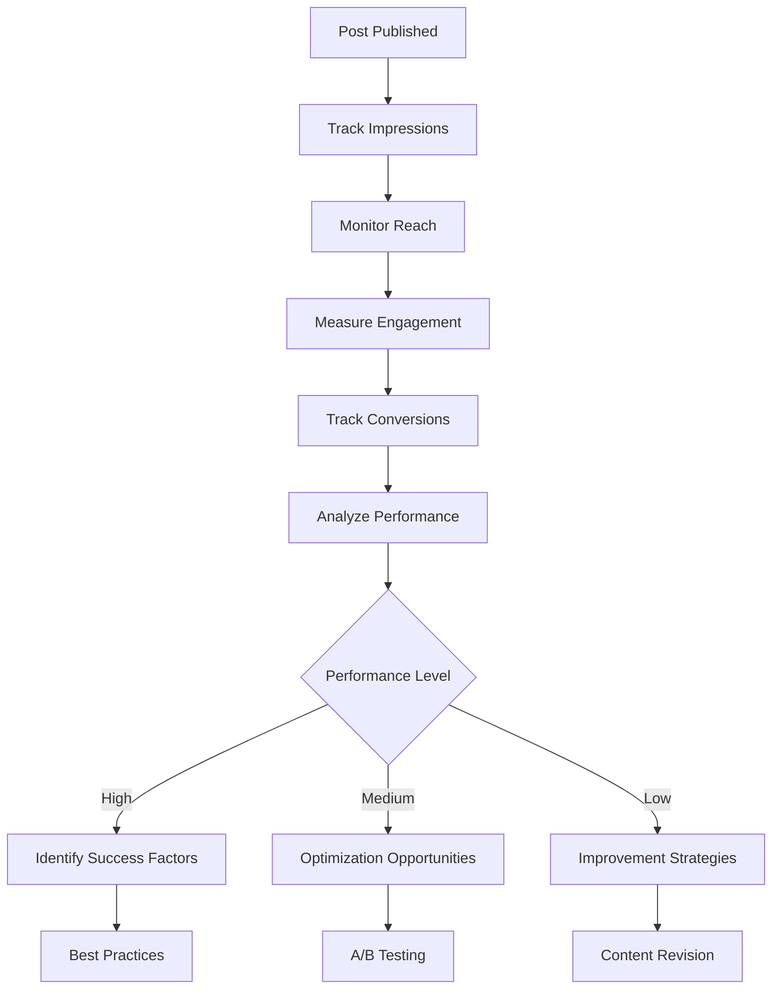

# Performance Tracking

Get comprehensive insights into post performance with detailed analytics covering reach, engagement, conversion, and user behavior. Make data-driven decisions to optimize content strategy.

<CardGroup cols={2}>
  <Card title="Reach Analytics" icon="globe">
    Track how many users see and discover your content
  </Card>
  <Card title="Conversion Tracking" icon="target">
    Measure how posts drive desired user actions
  </Card>
  <Card title="Comparative Analysis" icon="chart-mixed">
    Compare performance across posts, time periods, and communities
  </Card>
  <Card title="Performance Insights" icon="lightbulb">
    Get AI-powered recommendations for content optimization
  </Card>
</CardGroup>

## Performance Framework



## Core Metrics

<AccordionGroup>
  <Accordion title="Reach & Discovery">
    - **Impressions**: Total times post was displayed
    - **Unique Reach**: Number of unique users who saw the post
    - **Discovery Source**: How users found the content (feed, search, share)
    - **Frequency**: Average times each user saw the post
    - **Viral Coefficient**: How much content spreads beyond initial audience
  </Accordion>
  
  <Accordion title="Engagement Depth">
    - **Engagement Rate**: Interactions divided by impressions
    - **Dwell Time**: Average time spent viewing the post
    - **Scroll Depth**: How much of the post users viewed
    - **Click-through Rate**: Clicks on links, media, or calls-to-action
    - **Completion Rate**: For video/audio content consumption
  </Accordion>
  
  <Accordion title="Conversion & Actions">
    - **Goal Completions**: Specific actions users took from the post
    - **Link Clicks**: External and internal link engagement
    - **Profile Visits**: Users who viewed author's profile
    - **Follow Actions**: New followers gained from the post
    - **App Actions**: In-app actions triggered by the post
  </Accordion>
</AccordionGroup>

## Implementation

<CodeGroup>
```swift iOS
import AmitySDK

// Get comprehensive post performance
func getPostPerformance(postId: String, timeframe: String = "7d") async throws -> AmityPostPerformance {
    let analyticsRepository = AmityAnalyticsRepository(client: client)
    
    return try await analyticsRepository.getPostPerformance(
        postId: postId,
        timeframe: timeframe,
        includeMetrics: [
            .impressions,
            .reach,
            .engagement,
            .conversions,
            .demographics
        ]
    )
}

// Compare post performance
func comparePostPerformance(postIds: [String]) async throws -> AmityPerformanceComparison {
    let analyticsRepository = AmityAnalyticsRepository(client: client)
    
    return try await analyticsRepository.comparePerformance(
        postIds: postIds,
        metrics: [.engagementRate, .reach, .conversions]
    )
}
```

```typescript TypeScript
import { AnalyticsRepository } from '@amityco/ts-sdk';

// Get detailed post performance
async function getPostPerformance(postId: string, timeframe: string = '7d') {
  const { data: performance } = await AnalyticsRepository.getPostPerformance({
    postId: postId,
    timeframe: timeframe,
    metrics: [
      'impressions',
      'reach',
      'engagement_rate',
      'conversions',
      'demographics'
    ]
  });
  
  return performance;
}

// Get performance insights
async function getPerformanceInsights(postId: string) {
  const { data: insights } = await AnalyticsRepository.getInsights({
    postId: postId,
    analysisType: 'performance'
  });
  
  return insights;
}
```

```kotlin Android
// Get post performance data
fun getPostPerformance(postId: String, timeframe: String = "7d"): AmityPostPerformance {
    val analyticsRepository = AmityAnalyticsRepository(client)
    
    return analyticsRepository.getPostPerformance(postId, timeframe)
        .includeMetrics(
            AmityMetrics.IMPRESSIONS,
            AmityMetrics.REACH,
            AmityMetrics.ENGAGEMENT,
            AmityMetrics.CONVERSIONS
        )
        .blockingGet()
}
```
</CodeGroup>

## Performance Benchmarks

<AccordionGroup>
  <Accordion title="Industry Standards">
    - **Good Engagement Rate**: 3-6% for most content types
    - **Excellent Reach**: 15-25% of follower base
    - **Strong Conversion**: 1-3% depending on call-to-action
    - **Optimal Frequency**: 1-3 impressions per user
  </Accordion>
  
  <Accordion title="Content Type Benchmarks">
    - **Text Posts**: Higher engagement rate, lower reach
    - **Image Posts**: Balanced engagement and reach
    - **Video Posts**: Higher dwell time, variable engagement
    - **Interactive Posts**: Higher engagement, stronger conversions
  </Accordion>
  
  <Accordion title="Community Size Impact">
    - **Small Communities**: Higher engagement rates, lower absolute reach
    - **Medium Communities**: Balanced metrics across all areas
    - **Large Communities**: Higher absolute reach, variable engagement
    - **Viral Potential**: Increases with community size and cross-posting
  </Accordion>
</AccordionGroup>

## Optimization Strategies

<AccordionGroup>
  <Accordion title="Content Optimization">
    - **Timing**: Post when your audience is most active
    - **Format**: Use formats that perform best for your audience
    - **Length**: Optimize content length based on performance data
    - **Hashtags**: Use data-driven hashtag strategies
  </Accordion>
  
  <Accordion title="Engagement Optimization">
    - **Call-to-Action**: Include clear, compelling CTAs
    - **Interactive Elements**: Use polls, questions, and multimedia
    - **Community Engagement**: Respond to comments and reactions promptly
    - **Cross-promotion**: Share across relevant communities
  </Accordion>
  
  <Accordion title="Conversion Optimization">
    - **Landing Pages**: Optimize linked content for conversions
    - **User Journey**: Design clear paths from post to desired action
    - **A/B Testing**: Test different approaches and measure results
    - **Follow-up**: Create content series to nurture engagement
  </Accordion>
</AccordionGroup>

## Reporting & Insights

<CardGroup cols={2}>
  <Card title="Automated Reports" icon="document-chart-bar">
    Scheduled performance reports with key insights
  </Card>
  <Card title="Custom Dashboards" icon="chart-pie">
    Build personalized analytics views
  </Card>
  <Card title="Export Data" icon="arrow-down-tray">
    Export performance data for external analysis
  </Card>
  <Card title="AI Recommendations" icon="sparkles">
    Get smart suggestions for content optimization
  </Card>
</CardGroup>

## Related Topics

<CardGroup cols={3}>
  <Card title="Post Impressions" href="post-impressions" icon="eye">
    Track basic visibility and view metrics
  </Card>
  <Card title="Engagement Metrics" href="engagement-metrics" icon="heart">
    Monitor user interactions and reactions
  </Card>
  <Card title="Post Creation" href="../creation/overview" icon="plus">
    Create optimized content based on insights
  </Card>
</CardGroup>
