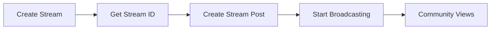

<Info>
**Quick Start:** Create a live stream first using the Stream Repository, then create a post that references the stream ID.
</Info>

## Overview

Live stream posts enable real-time video broadcasting within communities. Users can create live streams with customizable settings and share them as posts for maximum engagement.

### Architecture



## Parameters

### Stream Configuration

| Parameter | Type | Required | Description |
|-----------|------|----------|-------------|
| `title` | String | Yes | Stream title |
| `description` | String | No | Stream description |
| `thumbnailFileId` | String | No | Thumbnail image file ID |
| `resolution` | Enum | No | Stream quality (HD, SD, etc.) |
| `metadata` | Object | No | Custom stream properties |

### Post Parameters

| Parameter | Type | Required | Description |
|-----------|------|----------|-------------|
| `text` | String | Yes | Post content (max 20,000 characters) |
| `streamId` | String | Yes | ID of the created stream |
| `targetType` | Enum | Yes | Target destination (community or user feed) |
| `tags` | Array | No | Searchable tags |
| `metadata` | Object | No | Custom fields for extended functionality |

## Implementation

<Tabs>
<Tab title="iOS">
Create live streams and stream posts using the Stream and Post repositories.

```swift
// Step 1: Create live stream
let streamRepository = AmityStreamRepository(client: client)
let streamBuilder = AmityStreamBuilder()
    .title("Weekly Tech Talk")
    .description("Discussing latest tech trends")
    .resolution(.hd)
    .thumbnailFileId(thumbnailFileId)
    .metadata(["category": "tech", "language": "en"])

streamRepository.createStream(with: streamBuilder) { result in
    switch result {
    case .success(let stream):
        // Step 2: Create live stream post
        let postRepository = AmityPostRepository(client: client)
        let postBuilder = AmityLiveStreamPostBuilder()
            .setText("🔴 LIVE: Join our weekly tech discussion!")
            .setStreamId(stream.streamId)
            .setTargetType(.community)
            .setTargetId("tech_community")
            .setTags(["live", "tech", "discussion"])
            .setMetadata(["event": "weekly_talk"])
        
        postRepository.createPost(with: postBuilder) { result in
            switch result {
            case .success(let post):
                print("Live stream post created: \(post.postId)")
                // Start streaming
                stream.startStreaming()
            case .failure(let error):
                print("Post error: \(error.localizedDescription)")
            }
        }
    case .failure(let error):
        print("Stream error: \(error.localizedDescription)")
    }
}
```
</Tab>

<Tab title="Android">
Create live streams and stream posts using repository builders.

```kotlin
// Step 1: Create live stream
val streamRepository = AmityStreamRepository(client)
val streamBuilder = AmityStream.StreamBuilder()
    .title("Weekly Tech Talk")
    .description("Discussing latest tech trends")
    .resolution(AmityStreamResolution.HD)
    .thumbnailFileId(thumbnailFileId)
    .metadata(mapOf("category" to "tech", "language" to "en"))

streamRepository.createStream(streamBuilder).subscribe { stream ->
    // Step 2: Create live stream post
    val postRepository = AmityPostRepository(client)
    val postBuilder = AmityLiveStreamPostCreator.Builder()
        .text("🔴 LIVE: Join our weekly tech discussion!")
        .streamId(stream.getStreamId())
        .targetType(AmityPost.TargetType.COMMUNITY)
        .targetId("tech_community")
        .tags(listOf("live", "tech", "discussion"))
        .metadata(mapOf("event" to "weekly_talk"))
    
    postRepository.createPost(postBuilder.build()).subscribe(
        { post -> 
            println("Live stream post created: ${post.getPostId()}")
            // Start streaming
            stream.startStreaming()
        },
        { error -> println("Post error: ${error.message}") }
    )
}
```
</Tab>

<Tab title="TypeScript">
Create live streams and stream posts using async/await pattern.

```typescript
import { StreamRepository, PostRepository, StreamResolutions } from '@amityco/ts-sdk';

// Step 1: Create live stream
const streamRepository = new StreamRepository(client);
const stream = await streamRepository.createStream({
    title: 'Weekly Tech Talk',
    description: 'Discussing latest tech trends',
    resolution: StreamResolutions.HD,
    thumbnailFileId: thumbnailFileId,
    metadata: { category: 'tech', language: 'en' }
});

// Step 2: Create live stream post
const postRepository = new PostRepository(client);
const post = await postRepository.createPost({
    dataType: 'liveStream',
    data: {
        text: '🔴 LIVE: Join our weekly tech discussion!',
        streamId: stream.streamId
    },
    targetType: 'community',
    targetId: 'tech_community',
    tags: ['live', 'tech', 'discussion'],
    metadata: { event: 'weekly_talk' }
});

console.log('Live stream post created:', post.postId);

// Start streaming
await stream.startStreaming();
```
</Tab>

<Tab title="Flutter">
Create live streams and stream posts with proper error handling.

```dart
// Step 1: Create live stream
final streamRepository = AmityStreamRepository(client: client);
final streamBuilder = AmityStreamBuilder()
    ..title = 'Weekly Tech Talk'
    ..description = 'Discussing latest tech trends'
    ..resolution = AmityStreamResolution.hd
    ..thumbnailFileId = thumbnailFileId
    ..metadata = {'category': 'tech', 'language': 'en'};

try {
    final stream = await streamRepository.createStream(streamBuilder);
    
    // Step 2: Create live stream post
    final postRepository = AmityPostRepository(client: client);
    final postBuilder = AmityLiveStreamPostCreator()
        ..text = '🔴 LIVE: Join our weekly tech discussion!'
        ..streamId = stream.streamId
        ..targetType = AmityPostTargetType.COMMUNITY
        ..targetId = 'tech_community'
        ..metadata = {'event': 'weekly_talk'};
    
    final post = await postRepository.createPost(postBuilder.build());
    print('Live stream post created: ${post.postId}');
    
    // Start streaming
    await stream.startStreaming();
} catch (error) {
    print('Error: $error');
}
```
</Tab>
</Tabs>

## Error Handling

<Tabs>
<Tab title="iOS">
```swift
// Comprehensive error handling
streamRepository.createStream(with: streamBuilder) { result in
    switch result {
    case .success(let stream):
        postRepository.createPost(with: postBuilder) { postResult in
            switch postResult {
            case .success(let post):
                print("Success: \(post.postId)")
                stream.startStreaming()
            case .failure(let error):
                handlePostError(error)
            }
        }
    case .failure(let error):
        handleStreamError(error)
    }
}

func handleStreamError(_ error: Error) {
    if let amityError = error as? AmityError {
        switch amityError {
        case .insufficientPermissions:
            print("No permission to create streams")
        case .streamLimitReached:
            print("Stream limit reached")
        case .invalidStreamConfiguration:
            print("Invalid stream settings")
        default:
            print("Stream error: \(amityError.localizedDescription)")
        }
    }
}
```
</Tab>

<Tab title="Android">
```kotlin
// Comprehensive error handling
streamRepository.createStream(streamBuilder).subscribe(
    { stream ->
        postRepository.createPost(postBuilder.build()).subscribe(
            { post -> 
                println("Success: ${post.getPostId()}")
                stream.startStreaming()
            },
            { error -> handlePostError(error) }
        )
    },
    { error -> handleStreamError(error) }
)

fun handleStreamError(error: Throwable) {
    when (error) {
        is AmityException.InsufficientPermissionsException -> 
            println("No permission to create streams")
        is AmityException.StreamLimitReachedException -> 
            println("Stream limit reached")
        is AmityException.InvalidStreamConfigurationException -> 
            println("Invalid stream settings")
        else -> println("Stream error: ${error.message}")
    }
}
```
</Tab>

<Tab title="TypeScript">
```typescript
try {
    // Create stream
    const stream = await streamRepository.createStream(streamData);
    
    // Create stream post
    const post = await postRepository.createPost(postData);
    console.log('Success:', post.postId);
    
    // Start streaming
    await stream.startStreaming();
} catch (error) {
    if (error.code === 'INSUFFICIENT_PERMISSIONS') {
        console.error('No permission to create streams');
    } else if (error.code === 'STREAM_LIMIT_REACHED') {
        console.error('Stream limit reached');
    } else if (error.code === 'INVALID_STREAM_CONFIGURATION') {
        console.error('Invalid stream settings');
    } else {
        console.error('Error:', error.message);
    }
}
```
</Tab>

<Tab title="Flutter">
```dart
try {
    // Create stream
    final stream = await streamRepository.createStream(streamBuilder);
    
    // Create stream post
    final post = await postRepository.createPost(postBuilder.build());
    print('Success: ${post.postId}');
    
    // Start streaming
    await stream.startStreaming();
} catch (error) {
    if (error is AmityInsufficientPermissionsException) {
        print('No permission to create streams');
    } else if (error is AmityStreamLimitReachedException) {
        print('Stream limit reached');
    } else if (error is AmityInvalidStreamConfigurationException) {
        print('Invalid stream settings');
    } else {
        print('Error: $error');
    }
}
```
</Tab>
</Tabs>

## Stream Management

<Tabs>
<Tab title="iOS">
```swift
// Stream lifecycle management
class LiveStreamManager {
    func startStream(_ stream: AmityStream) {
        stream.startStreaming()
        
        // Monitor stream status
        stream.observeStreamStatus { status in
            switch status {
            case .live:
                print("Stream is now live")
            case .ended:
                print("Stream has ended")
            case .error(let error):
                print("Stream error: \(error)")
            }
        }
    }
    
    func endStream(_ stream: AmityStream) {
        stream.stopStreaming()
    }
}
```
</Tab>

<Tab title="Android">
```kotlin
// Stream lifecycle management
class LiveStreamManager {
    fun startStream(stream: AmityStream) {
        stream.startStreaming()
        
        // Monitor stream status
        stream.observeStreamStatus().subscribe { status ->
            when (status) {
                AmityStreamStatus.LIVE -> println("Stream is now live")
                AmityStreamStatus.ENDED -> println("Stream has ended")
                AmityStreamStatus.ERROR -> println("Stream error")
            }
        }
    }
    
    fun endStream(stream: AmityStream) {
        stream.stopStreaming()
    }
}
```
</Tab>

<Tab title="TypeScript">
```typescript
// Stream lifecycle management
class LiveStreamManager {
    async startStream(stream: AmityStream) {
        await stream.startStreaming();
        
        // Monitor stream status
        stream.on('statusChanged', (status) => {
            switch (status) {
                case 'live':
                    console.log('Stream is now live');
                    break;
                case 'ended':
                    console.log('Stream has ended');
                    break;
                case 'error':
                    console.log('Stream error');
                    break;
            }
        });
    }
    
    async endStream(stream: AmityStream) {
        await stream.stopStreaming();
    }
}
```
</Tab>

<Tab title="Flutter">
```dart
// Stream lifecycle management
class LiveStreamManager {
    Future<void> startStream(AmityStream stream) async {
        await stream.startStreaming();
        
        // Monitor stream status
        stream.observeStreamStatus().listen((status) {
            switch (status) {
                case AmityStreamStatus.live:
                    print('Stream is now live');
                    break;
                case AmityStreamStatus.ended:
                    print('Stream has ended');
                    break;
                case AmityStreamStatus.error:
                    print('Stream error');
                    break;
            }
        });
    }
    
    Future<void> endStream(AmityStream stream) async {
        await stream.stopStreaming();
    }
}
```
</Tab>
</Tabs>

## Best Practices

<CardGroup cols={2}>
<Card title="Stream Quality" icon="video">
- Choose appropriate resolution for audience
- Test stream setup before going live
- Use high-quality thumbnails
- Ensure stable internet connection
</Card>

<Card title="Engagement" icon="users">
- Schedule streams in advance
- Use engaging titles and descriptions
- Interact with viewers during stream
- Provide clear call-to-actions
</Card>
</CardGroup>

## Real-World Use Cases

<AccordionGroup>
<Accordion title="Educational Webinars">
```swift
// iOS: Educational live stream
let streamBuilder = AmityStreamBuilder()
    .title("iOS Development Masterclass")
    .description("Learn advanced iOS development techniques")
    .resolution(.hd)
    .metadata(["category": "education", "level": "advanced"])

let postBuilder = AmityLiveStreamPostBuilder()
    .setText("🎓 LIVE: Join our iOS development masterclass! Learn advanced techniques from industry experts.")
    .setTags(["education", "ios", "development", "masterclass"])
```
</Accordion>

<Accordion title="Community Events">
```kotlin
// Android: Community event stream
val streamBuilder = AmityStream.StreamBuilder()
    .title("Community Town Hall")
    .description("Monthly community updates and Q&A")
    .resolution(AmityStreamResolution.HD)
    .metadata(mapOf("event_type" to "town_hall", "frequency" to "monthly"))

val postBuilder = AmityLiveStreamPostCreator.Builder()
    .text("🏛️ LIVE: Monthly Town Hall - Share your thoughts and get updates!")
    .tags(listOf("community", "town_hall", "updates", "qa"))
```
</Accordion>

<Accordion title="Product Launches">
```typescript
// TypeScript: Product launch stream
const stream = await streamRepository.createStream({
    title: 'New Feature Launch Event',
    description: 'Introducing our latest product features',
    resolution: StreamResolutions.HD,
    metadata: { event_type: 'product_launch', version: '2.0' }
});

const post = await postRepository.createPost({
    dataType: 'liveStream',
    data: {
        text: '🚀 LIVE: Big product announcement! Join us for the launch of exciting new features.',
        streamId: stream.streamId
    },
    tags: ['product', 'launch', 'features', 'announcement']
});
```
</Accordion>
</AccordionGroup>

<Warning>
Live streams require appropriate permissions and may have community-specific limits on concurrent streams.
</Warning>