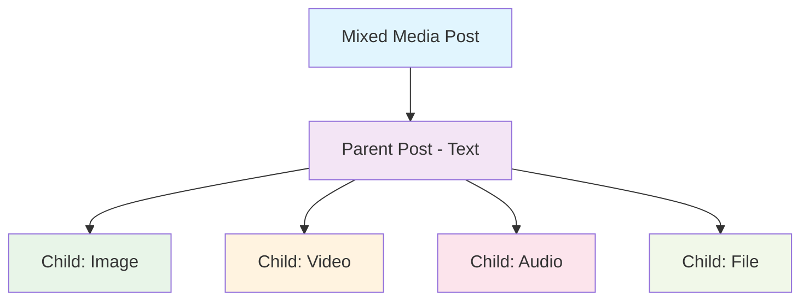

Create rich, diverse content by combining different media types in a single post. Mix images, videos, audio files, and documents to create engaging multimedia experiences.

<CardGroup cols={2}>
  <Card title="Multiple Media Types" icon="layer-group">
    Combine images, videos, audio, and files in one post
  </Card>
  <Card title="Up to 10 Attachments" icon="images">
    Mix and match up to 10 media items of any type
  </Card>
</CardGroup>

## Overview

Mixed media posts enable creators to share diverse content without splitting into multiple posts:

- **Flexible Combinations**: Mix images + videos + audio + files
- **Single Post Structure**: Keep related content together
- **Unified Engagement**: Users interact with one cohesive post
- **Smart Filtering**: Query posts by structure type for precise content discovery



## Post Structure Types

Every post now has a `structureType` field that describes its media composition:

<AccordionGroup>
  <Accordion title="Pure Types (Single Media Type)" icon="file">
    | Structure Type | Description | Example |
    |----------------|-------------|---------|
    | `image` | Contains only image attachments | Photo gallery with 3 images |
    | `video` | Contains only video attachments | Video post with 2 clips |
    | `audio` | Contains only audio attachments | Podcast episode |
    | `file` | Contains only file attachments | Document sharing (PDFs, docs) |
    
    <Info>
    Pure type posts maintain backward compatibility with existing filtering behavior.
    </Info>
  </Accordion>
  
  <Accordion title="Mixed Type (Multiple Media Types)" icon="layer-group">
    **Structure Type**: `mixed`
    
    A post is classified as `mixed` when it contains:
    - **2+ distinct media types** (e.g., images + videos)
    - **OR any combination including audio** (e.g., image + audio, or just audio with any other type)
    
    **Examples**:
    - Image + Video = `mixed`
    - Image + Audio = `mixed`
    - Video + File = `mixed`
    - Image + Video + Audio + File = `mixed`
    
    <Note>
    The `structureType` is automatically determined when you create or edit a post. You don't need to specify it manually.
    </Note>
  </Accordion>
  
  <Accordion title="Text-Only Posts" icon="text">
    **Structure Type**: `null` or absent
    
    Posts with no attachments (text-only) don't have a `structureType` value.
  </Accordion>
</AccordionGroup>

### Structure Type Determination

The system automatically determines the `structureType` based on your attachments:

```typescript
// Automatic structureType assignment examples

// Example 1: Pure image post
attachments: [
  { fileId: "img1", type: "image" },
  { fileId: "img2", type: "image" }
]
// Result: structureType = "image"

// Example 2: Mixed media post
attachments: [
  { fileId: "img1", type: "image" },
  { fileId: "vid1", type: "video" }
]
// Result: structureType = "mixed"

// Example 3: Audio with image (always mixed)
attachments: [
  { fileId: "img1", type: "image" },
  { fileId: "aud1", type: "audio" }
]
// Result: structureType = "mixed"

// Example 4: Text-only post
attachments: []
// Result: structureType = null (no value)
```

## Requirements & Limits

| Requirement | Limit | Notes |
|-------------|-------|-------|
| **Total Attachments** | Maximum 10 items | All media types combined |
| **Media Types** | image, video, audio, file | Can mix any combination |
| **File Size** | Varies by type | Images: 100MB, Videos: varies, Audio: 1GB, Files: 1GB |
| **Text** | 10,000 characters | Optional caption |

<Warning>
All media files must be uploaded before creating the post. Each media type has its own upload endpoint. See upload guides for [Images](/social-plus-sdk/core-concepts/content-handling/files-images-and-videos/image-handling), [Videos](/social-plus-sdk/core-concepts/content-handling/files-images-and-videos/video-handling), [Audio](/social-plus-sdk/core-concepts/content-handling/files-images-and-videos/audio-handling), and [Files](/social-plus-sdk/core-concepts/content-handling/files-images-and-videos/file).
</Warning>

## Quick Start

<Steps>
  <Step title="Upload Media Files">
    Upload your media files using the appropriate endpoints for each type
  </Step>
  <Step title="Build Mixed Media Post">
    Use the `AmityMixedMediaPostBuilder` to combine different media types
  </Step>
  <Step title="Create Post">
    Create the post with all attachments in a single request
  </Step>
  <Step title="Handle Response">
    The post includes parent and child posts with automatic `structureType` assignment
  </Step>
</Steps>

## Parameters

| Parameter | Type | Required | Description |
|-----------|------|----------|-------------|
| `text` | String | ❌ | Caption text (max 10,000 characters) |
| `attachments` | Array | ✅ | Mixed array of media items (max 10 total) |
| `targetType` | Enum | ✅ | Target type (`user` or `community`) |
| `targetId` | String | ✅ | Target ID (`userId` or `communityId`) |
| `metadata` | Object | ❌ | Custom metadata |

## Implementation

<CodeGroup>
```swift iOS
func createMixedMediaPost(
    images: [AmityImageData],
    videos: [AmityVideoData],
    audios: [AmityAudioData],
    files: [AmityFileData],
    text: String
) async {
    // Use the MixedMediaPostBuilder to combine different media types
    let builder = AmityMixedMediaPostBuilder()
    builder.setText(text)
    
    // Add different media types
    // The order you set them is maintained in the final post
    builder.setImages(images)
    builder.setVideos(videos)
    builder.setAudios(audios)
    builder.setFiles(files)
    
    do {
        let post = try await postRepository.createMixedMediaPost(
            builder,
            targetId: "community123",
            targetType: .community,
            metadata: nil,
            mentionees: nil
        )
        
        print("Mixed media post created!")
    } catch {
        print("Failed to create mixed media post: \(error)")
    }
}

// Example: Complete workflow with uploads
func uploadAndCreateMixedPost() async {
    do {
        // Step 1: Upload different media types
        let imageData = try await fileRepository.uploadImage(
            with: imageUrl,
            progress: { progress in
                print("Image upload: \(progress * 100)%")
            }
        )
        
        let audioData = try await fileRepository.uploadAudio(
            with: audioUrl,
            progress: { progress in
                print("Audio upload: \(progress * 100)%")
            }
        )
        
        let videoData = try await fileRepository.uploadVideo(
            with: videoUrl,
            progress: { progress in
                print("Video upload: \(progress * 100)%")
            }
        )
        
        // Step 2: Create mixed media post
        let builder = AmityMixedMediaPostBuilder()
        builder.setText("Check out this amazing content!")
        builder.setImages([imageData])
        builder.setAudios([audioData])
        builder.setVideos([videoData])
        
        let post = try await postRepository.createMixedMediaPost(
            builder,
            targetId: nil,
            targetType: .user,
            metadata: nil,
            mentionees: nil
        )
        
        print("Complete! Mixed post created with structureType: \(post.structureType ?? "mixed")")
    } catch {
        print("Error: \(error)")
    }
}
```

```kotlin Android
fun createMixedMediaPost(
    postRepository: AmityPostRepository,
    uploadedImages: Array<AmityImage>,
    uploadedVideos: Array<AmityVideo>,
    uploadedAudios: Array<AmityAudio>,
    uploadedFiles: Array<AmityFile>
) {
    postRepository.createPost()
        .targetCommunity(communityId = "community123")
        .text("Amazing mixed media content!")
        .image(images = uploadedImages)
        .video(videos = uploadedVideos)
        .audio(audios = uploadedAudios)
        .file(files = uploadedFiles)
        .build()
        .post()
        .doOnSuccess { amityPost: AmityPost ->
            Log.d("Post", "Mixed media post created: ${amityPost.postId}")
            Log.d("Post", "Structure Type: ${amityPost.structureType}")
            Log.d("Post", "Children count: ${amityPost.children.size}")
        }
        .doOnError { error ->
            Log.e("Post", "Failed to create mixed media post: ${error.message}")
        }
        .subscribe()
}

// Example: Complete workflow with uploads
fun uploadAndCreateMixedPost(
    imageUri: Uri,
    audioUri: Uri,
    videoUri: Uri
) {
    val fileRepo = AmityCoreClient.newFileRepository()
    val uploadedMedia = mutableListOf<Any>()
    
    // Upload all media types
    // (In production, handle these uploads with proper error handling and progress tracking)
    
    fileRepo.uploadImage(imageUri)
        .doOnNext { result ->
            if (result is AmityUploadResult.COMPLETE) {
                uploadedMedia.add(result.getFile())
                checkAndCreatePost(uploadedMedia)
            }
        }
        .subscribe()
    
    fileRepo.uploadAudio(audioUri)
        .doOnNext { result ->
            if (result is AmityUploadResult.COMPLETE) {
                uploadedMedia.add(result.getFile())
                checkAndCreatePost(uploadedMedia)
            }
        }
        .subscribe()
}

fun checkAndCreatePost(uploadedMedia: List<Any>) {
    // When all uploads complete, create the mixed post
    if (uploadedMedia.size == 3) {
        val images = uploadedMedia.filterIsInstance<AmityImage>().toTypedArray()
        val audios = uploadedMedia.filterIsInstance<AmityAudio>().toTypedArray()
        val videos = uploadedMedia.filterIsInstance<AmityVideo>().toTypedArray()
        
        AmitySocialClient.newPostRepository()
            .createPost()
            .targetCommunity("community123")
            .text("Mixed media post!")
            .image(images = images)
            .audio(audios = audios)
            .video(videos = videos)
            .build()
            .post()
            .doOnSuccess { post ->
                Log.d("Post", "Complete! Structure Type: ${post.structureType}")
            }
            .subscribe()
    }
}
```

```typescript TypeScript
import { PostRepository, PostContentType, FileRepository } from '@amityco/ts-sdk';

async function createMixedMediaPost(
  imageFileIds: string[],
  videoFileIds: string[],
  audioFileIds: string[],
  fileFileIds: string[]
): Promise<Amity.Post> {
  // Combine all attachments in a single array
  // The order you add them is preserved in the post
  const attachments = [
    ...imageFileIds.map(fileId => ({ type: PostContentType.IMAGE, fileId })),
    ...videoFileIds.map(fileId => ({ type: PostContentType.VIDEO, fileId })),
    ...audioFileIds.map(fileId => ({ type: PostContentType.AUDIO, fileId })),
    ...fileFileIds.map(fileId => ({ type: PostContentType.FILE, fileId })),
  ];

  const newPost = {
    tags: ['mixed-media', 'content'],
    data: {
      text: 'Check out this amazing mixed media content!',
    },
    attachments: attachments,
    targetType: 'community',
    targetId: 'community123',
  };

  const { data: post } = await PostRepository.createPost(newPost);
  
  console.log('Mixed media post created:', post.postId);
  console.log('Structure Type:', post.structureType); // Will be "mixed"
  console.log('Total attachments:', attachments.length);
  
  return post;
}

// Example: Complete workflow with uploads
async function uploadAndCreateMixedPost(
  imageFile: File,
  audioFile: File,
  videoFile: File
): Promise<Amity.Post> {
  try {
    // Step 1: Upload all media files in parallel
    const [imageResult, audioResult, videoResult] = await Promise.all([
      FileRepository.uploadImage(createFormData(imageFile)),
      FileRepository.uploadAudio(createFormData(audioFile)),
      FileRepository.uploadVideo(createFormData(videoFile)),
    ]);

    console.log('All uploads complete!');
    
    // Step 2: Create mixed media post
    const attachments = [
      { type: PostContentType.IMAGE, fileId: imageResult.data[0].fileId },
      { type: PostContentType.AUDIO, fileId: audioResult.data[0].fileId },
      { type: PostContentType.VIDEO, fileId: videoResult.data[0].fileId },
    ];

    const newPost = {
      data: {
        text: 'Mixed media post with image, audio, and video!',
      },
      attachments: attachments,
      targetType: 'community',
      targetId: 'community123',
    };

    const { data: post } = await PostRepository.createPost(newPost);
    console.log('Complete! Structure Type:', post.structureType); // "mixed"
    
    return post;
  } catch (error) {
    console.error('Error creating mixed media post:', error.message);
    throw error;
  }
}

function createFormData(file: File): FormData {
  const data = new FormData();
  data.append('files', file);
  return data;
}
```

</CodeGroup>

<Note>
**Attachment Order Preservation**: The `AmityMixedMediaPostBuilder` maintains the order in which you add attachments. Set media in the order you want them displayed.
</Note>

## Structure Type Behavior

### Automatic Classification

The system automatically classifies posts based on their attachments:

<Tabs>
  <Tab title="Pure Types">
    **Single media type only**
    
    ```typescript
    // Example: Pure image post
    attachments: [
      { type: "image", fileId: "img1" },
      { type: "image", fileId: "img2" },
      { type: "image", fileId: "img3" }
    ]
    // structureType = "image"
    
    // Example: Pure video post
    attachments: [
      { type: "video", fileId: "vid1" }
    ]
    // structureType = "video"
    ```
  </Tab>
  
  <Tab title="Mixed Types">
    **Multiple media types or includes audio**
    
    ```typescript
    // Example 1: Images + Videos = Mixed
    attachments: [
      { type: "image", fileId: "img1" },
      { type: "video", fileId: "vid1" }
    ]
    // structureType = "mixed"
    
    // Example 2: Any combination with audio = Mixed
    attachments: [
      { type: "image", fileId: "img1" },
      { type: "audio", fileId: "aud1" }
    ]
    // structureType = "mixed"
    
    // Example 3: All types = Mixed
    attachments: [
      { type: "image", fileId: "img1" },
      { type: "video", fileId: "vid1" },
      { type: "audio", fileId: "aud1" },
      { type: "file", fileId: "file1" }
    ]
    // structureType = "mixed"
    ```
  </Tab>
</Tabs>

### Editing Posts

When you edit a post and change its attachments, the `structureType` is automatically updated:

```typescript
// Original post: Pure image
attachments: [
  { type: "image", fileId: "img1" }
]
// structureType = "image"

// After edit: Add a video
attachments: [
  { type: "image", fileId: "img1" },
  { type: "video", fileId: "vid1" }
]
// structureType = "mixed" (automatically updated)
```

<Warning>
**Important**: When editing posts, the `structureType` is recalculated based on the final set of attachments. This includes both active and soft-deleted child posts, so removing media may not change the structure type immediately.
</Warning>

## Querying Mixed Media Posts

Use the `includeMixedStructure` parameter to control whether mixed media posts appear in your query results:

<AccordionGroup>
  <Accordion title="Default Behavior (includeMixedStructure=false)" icon="filter">
    **Pure type filtering** - excludes mixed posts
    
    ```typescript
    // Query for image posts only
    const posts = await PostRepository.getPosts({
      dataTypes: ['image'],
      includeMixedStructure: false // default
    });
    
    // Returns:
    // ✅ Pure image posts (structureType = "image")
    // ❌ Mixed posts (structureType = "mixed") - EXCLUDED even if they contain images
    ```
    
    This preserves legacy behavior where single-type filters return only "pure" posts of that type.
  </Accordion>
  
  <Accordion title="Include Mixed Posts (includeMixedStructure=true)" icon="layer-group">
    **Inclusive filtering** - includes mixed posts containing the requested type
    
    ```typescript
    // Query for image posts INCLUDING mixed posts with images
    const posts = await PostRepository.getPosts({
      dataTypes: ['image'],
      includeMixedStructure: true
    });
    
    // Returns:
    // ✅ Pure image posts (structureType = "image")
    // ✅ Mixed posts containing images (structureType = "mixed")
    ```
    
    Useful when you want to show all posts containing a specific media type, regardless of whether they also contain other types.
  </Accordion>
  
  <Accordion title="Multiple Types Query" icon="list">
    **Multi-type filtering** - mixed posts automatically included
    
    ```typescript
    // Query for image OR video posts
    const posts = await PostRepository.getPosts({
      dataTypes: ['image', 'video']
      // includeMixedStructure doesn't matter here
    });
    
    // Returns:
    // ✅ Pure image posts (structureType = "image")
    // ✅ Pure video posts (structureType = "video")
    // ✅ Mixed posts (structureType = "mixed") - automatically included
    ```
    
    When querying for multiple types, mixed posts are always relevant and included.
  </Accordion>
</AccordionGroup>

For detailed filtering documentation, see [Post Retrieval](/social-plus-sdk/social/content-management/posts/retrieval/query-posts).

## Best Practices

<AccordionGroup>
  <Accordion title="Content Organization">
    - **Keep related content together**: Use mixed media for content that tells a single story
    - **Maintain logical order**: Add attachments in the order users should view them
    - **Use appropriate combinations**: Match media types to your content needs
    - **Consider user experience**: Don't overwhelm with too many different types
    
    ```typescript
    // Good: Tutorial post with related media
    const tutorialPost = {
      text: "How to make perfect coffee ☕",
      attachments: [
        { type: "image", fileId: "step1_img" },  // Step 1 photo
        { type: "video", fileId: "demo_video" }, // Demo video
        { type: "file", fileId: "recipe_pdf" },  // Detailed recipe
        { type: "audio", fileId: "tips_audio" }  // Pro tips audio
      ]
    };
    ```
  </Accordion>
  
  <Accordion title="Performance Optimization">
    - **Upload in parallel**: Upload different media types simultaneously
    - **Validate before upload**: Check file sizes and formats client-side
    - **Show progress**: Display upload progress for each media type
    - **Handle failures gracefully**: Implement retry logic for individual uploads
    - **Cache uploads**: Store uploaded file IDs to avoid re-uploading
    
    ```typescript
    // Example: Parallel uploads with progress tracking
    async function uploadAllMedia(files: MediaFiles) {
      const uploads = await Promise.allSettled([
        uploadImage(files.image, onImageProgress),
        uploadVideo(files.video, onVideoProgress),
        uploadAudio(files.audio, onAudioProgress),
      ]);
      
      // Filter successful uploads
      const successful = uploads
        .filter(result => result.status === 'fulfilled')
        .map(result => result.value);
      
      if (successful.length < uploads.length) {
        handlePartialFailure(successful, uploads);
      }
      
      return successful;
    }
    ```
  </Accordion>
  
  <Accordion title="User Experience">
    - **Preview all media**: Let users preview all attachments before posting
    - **Support reordering**: Allow users to change attachment order
    - **Clear media indicators**: Show media type icons/badges
    - **Handle missing media**: Gracefully handle cases where media fails to load
    - **Provide editing controls**: Allow users to remove/replace individual items
    
    ```typescript
    // Example: Media preview component
    const MixedMediaPreview = ({ attachments }) => (
      <div className="media-preview-grid">
        {attachments.map((item, index) => (
          <MediaPreviewCard
            key={index}
            type={item.type}
            fileId={item.fileId}
            onRemove={() => removeAttachment(index)}
            onReorder={(newIndex) => reorderAttachment(index, newIndex)}
          />
        ))}
      </div>
    );
    ```
  </Accordion>
  
  <Accordion title="Attachment Strategy">
    - **Limit total items**: Stay within 10 attachment limit
    - **Balance media types**: Don't overload with one type
    - **Consider load time**: More attachments = longer load time
    - **Optimize file sizes**: Compress media before upload
    - **Use appropriate quality**: Match quality to content importance
    
    ```typescript
    // Example: Validate mixed media before posting
    function validateMixedMedia(attachments: Attachment[]): ValidationResult {
      if (attachments.length > 10) {
        return { valid: false, error: 'Maximum 10 attachments allowed' };
      }
      
      const typeCounts = countByType(attachments);
      if (typeCounts.image > 8) {
        return { valid: false, error: 'Consider creating an image album instead' };
      }
      
      const totalSize = calculateTotalSize(attachments);
      if (totalSize > 500 * 1024 * 1024) { // 500MB
        return { valid: false, error: 'Total size too large, compress media' };
      }
      
      return { valid: true };
    }
    ```
  </Accordion>
</AccordionGroup>

## Troubleshooting

<AccordionGroup>
  <Accordion title="Attachment Limit Exceeded" icon="triangle-exclamation">
    **Problem**: Cannot add more than 10 attachments
    
    **Solution**:
    - Remove some attachments to stay within limit
    - Split content into multiple posts if needed
    - Prioritize most important media
    
    ```typescript
    if (attachments.length > 10) {
      showError('Maximum 10 attachments allowed per post');
      // Suggest splitting into multiple posts
      suggestMultiplePosts(attachments);
    }
    ```
  </Accordion>
  
  <Accordion title="Mixed Upload Failures" icon="upload">
    **Problem**: Some media uploads fail while others succeed
    
    **Solution**:
    - Track upload status for each media type separately
    - Retry failed uploads individually
    - Allow users to post with successful uploads only
    - Provide clear feedback on which uploads failed
    
    ```typescript
    const results = await Promise.allSettled(uploads);
    const failed = results.filter(r => r.status === 'rejected');
    
    if (failed.length > 0) {
      const failedTypes = failed.map(f => f.type).join(', ');
      showError(`Failed to upload: ${failedTypes}. Retry or post without them?`);
    }
    ```
  </Accordion>
  
  <Accordion title="Structure Type Issues" icon="layer-group">
    **Problem**: Post has unexpected `structureType`
    
    **Solution**:
    - Verify attachment types in your request
    - Check if deleted children are affecting classification
    - Remember: any combination with audio = mixed
    - Review automatic classification rules
    
    ```typescript
    // Debug structure type
    console.log('Attachments:', post.attachments);
    console.log('Structure Type:', post.structureType);
    console.log('Children:', post.children.map(c => c.dataType));
    
    // Verify classification
    const expected = calculateExpectedStructureType(post.attachments);
    if (expected !== post.structureType) {
      console.warn('Unexpected structure type - check for deleted children');
    }
    ```
  </Accordion>
  
  <Accordion title="Query Filtering Issues" icon="filter">
    **Problem**: Mixed posts not appearing in filtered queries
    
    **Solution**:
    - Set `includeMixedStructure: true` for single-type queries
    - Understand default filtering excludes mixed posts
    - Use multiple type queries to automatically include mixed posts
    
    ```typescript
    // If you want ALL posts with images (including mixed):
    const posts = await getPosts({
      dataTypes: ['image'],
      includeMixedStructure: true // ← Important!
    });
    
    // Or query for multiple types (mixed auto-included):
    const posts = await getPosts({
      dataTypes: ['image', 'video'] // mixed posts auto-included
    });
    ```
  </Accordion>
</AccordionGroup>

<Info>
**Backward Compatibility**: Existing single-type post creation methods (createImagePost, createVideoPost, etc.) continue to work unchanged. Mixed media posts are an additive feature that doesn't break existing functionality.
</Info>

## Common Use Cases

<CardGroup cols={2}>
  <Card title="Product Showcases" icon="cart-shopping">
    Combine product photos, demo videos, spec sheets (PDFs), and audio reviews
  </Card>
  <Card title="Event Coverage" icon="calendar">
    Share event photos, highlight videos, attendee interviews (audio), and schedules (files)
  </Card>
  <Card title="Educational Content" icon="graduation-cap">
    Mix tutorial images, demo videos, downloadable resources, and audio explanations
  </Card>
  <Card title="Portfolio Pieces" icon="briefcase">
    Showcase work with images, process videos, case study PDFs, and client testimonials (audio)
  </Card>
  <Card title="News Articles" icon="newspaper">
    Combine article images, video clips, interview audio, and related documents
  </Card>
  <Card title="Travel Stories" icon="plane">
    Share photos, video clips, voice narration, and travel guides (PDFs)
  </Card>
</CardGroup>

## Related Topics

<CardGroup cols={3}>
  <Card title="Image Posts" href="./image-post" icon="image">
    Create pure image posts with multiple photos
  </Card>
  <Card title="Video Posts" href="./video-post" icon="video">
    Share video content and clips
  </Card>
  <Card title="Audio Posts" href="./audio-post" icon="file-audio">
    Create posts with audio files
  </Card>
  <Card title="File Posts" href="./file-post" icon="file">
    Share documents and files
  </Card>
  <Card title="Query Posts" href="/social-plus-sdk/social/content-management/posts/retrieval/query-posts" icon="filter">
    Filter posts by structure type
  </Card>
  <Card title="Text Posts" href="./text-post" icon="text">
    Understand post structure types
  </Card>
</CardGroup>
