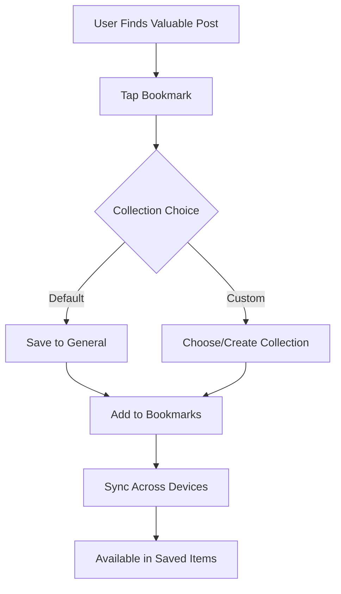

# Bookmarks

Enable users to save valuable content for later reference through a comprehensive bookmarking system. Help users organize, categorize, and easily retrieve their saved posts.

<CardGroup cols={2}>
  <Card title="Save Posts" icon="bookmark">
    Bookmark posts for personal reference and later viewing
  </Card>
  <Card title="Organize Collections" icon="folder">
    Create custom folders and categories for saved content
  </Card>
  <Card title="Quick Access" icon="lightning-bolt">
    Fast retrieval and search within saved content
  </Card>
  <Card title="Sync Across Devices" icon="arrow-path">
    Access bookmarks across all user devices
  </Card>
</CardGroup>

## Bookmark Flow



## Implementation

<CodeGroup>
```swift iOS
import AmitySDK

// Bookmark a post
func bookmarkPost(postId: String, collection: String? = nil) async throws {
    let bookmarkRepository = AmityBookmarkRepository(client: client)
    
    try await bookmarkRepository.addBookmark(
        postId: postId,
        collection: collection ?? "general"
    )
}

// Remove bookmark
func removeBookmark(postId: String) async throws {
    let bookmarkRepository = AmityBookmarkRepository(client: client)
    
    try await bookmarkRepository.removeBookmark(postId: postId)
}

// Get user's bookmarks
func getUserBookmarks(collection: String? = nil) -> AmityCollection<AmityPost> {
    let bookmarkRepository = AmityBookmarkRepository(client: client)
    
    return bookmarkRepository.getBookmarks(
        collection: collection,
        sortBy: .dateAdded
    )
}
```

```typescript TypeScript
import { BookmarkRepository } from '@amityco/ts-sdk';

// Add bookmark
async function bookmarkPost(postId: string, collection?: string) {
  const bookmark = await BookmarkRepository.addBookmark({
    postId: postId,
    collection: collection || 'general'
  });
  
  return bookmark;
}

// Remove bookmark
async function removeBookmark(postId: string) {
  await BookmarkRepository.removeBookmark({
    postId: postId
  });
}

// Get bookmarked posts
async function getBookmarks(collection?: string) {
  const { data: bookmarks } = await BookmarkRepository.getBookmarks({
    collection: collection,
    sortBy: 'dateAdded',
    sortDirection: 'desc'
  });
  
  return bookmarks;
}
```

```kotlin Android
// Bookmark a post
fun bookmarkPost(postId: String, collection: String = "general") {
    val bookmarkRepository = AmityBookmarkRepository(client)
    
    bookmarkRepository.addBookmark(postId, collection)
        .doOnSuccess { bookmark ->
            // Handle successful bookmark
        }
        .doOnError { error ->
            // Handle error
        }
        .subscribe()
}

// Get user bookmarks
fun getUserBookmarks(collection: String? = null): AmityCollection<AmityPost> {
    val bookmarkRepository = AmityBookmarkRepository(client)
    
    return bookmarkRepository.getBookmarks()
        .collection(collection)
        .sortBy(AmitySortBy.DATE_ADDED)
        .build()
}
```
</CodeGroup>

## Organization Features

<AccordionGroup>
  <Accordion title="Collections">
    - **Default Collection**: General bookmarks for quick saving
    - **Custom Collections**: User-created folders for organization
    - **Smart Collections**: Auto-categorized based on content type
    - **Shared Collections**: Collaborative bookmark folders
  </Accordion>
  
  <Accordion title="Management Tools">
    - **Search**: Find bookmarks by title, content, or tags
    - **Filtering**: Filter by date, collection, or post type
    - **Bulk Actions**: Organize multiple bookmarks at once
    - **Export**: Export bookmarks for external use
  </Accordion>
</AccordionGroup>

## Use Cases

<AccordionGroup>
  <Accordion title="Personal Reference">
    - Save useful tutorials and how-to guides
    - Keep important announcements and updates
    - Collect inspirational content and ideas
    - Archive posts for later detailed reading
  </Accordion>
  
  <Accordion title="Professional Use">
    - Bookmark industry insights and trends
    - Save competitor analysis and market research
    - Collect resources for projects and presentations
    - Archive important company communications
  </Accordion>
  
  <Accordion title="Content Curation">
    - Create themed collections for sharing
    - Organize resources by topic or category
    - Build reading lists for specific interests
    - Curate content for team or community sharing
  </Accordion>
</AccordionGroup>

## Best Practices

<AccordionGroup>
  <Accordion title="Organization Strategy">
    - Create meaningful collection names and descriptions
    - Use consistent naming conventions
    - Regularly review and clean up old bookmarks
    - Tag content for easier discovery
  </Accordion>
  
  <Accordion title="User Experience">
    - Provide clear visual indicators for bookmarked posts
    - Make bookmark/unbookmark actions easily accessible
    - Offer quick access to recently bookmarked content
    - Enable offline access to saved content when possible
  </Accordion>
</AccordionGroup>

## Related Topics

<CardGroup cols={3}>
  <Card title="Post Reactions" href="reactions" icon="heart">
    Express appreciation for valuable content
  </Card>
  <Card title="Content Sharing" href="sharing" icon="share">
    Share bookmarked content with others
  </Card>
  <Card title="Post Retrieval" href="../retrieval/overview" icon="search">
    Efficiently find and access saved content
  </Card>
</CardGroup>
