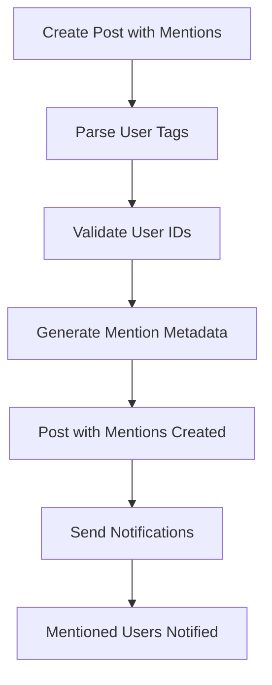

# Mentions in Posts

Mentions enable users to tag other community members in posts, creating direct engagement opportunities and enhancing social interaction. The Social Plus SDK provides comprehensive mention functionality with metadata support for custom rendering and notification systems.

## Overview



<CardGroup cols={2}>
  <Card title="Enhanced Engagement" icon="at">
    Direct user engagement through mentions increases interaction and community building
  </Card>
  <Card title="Custom Rendering" icon="palette">
    Flexible metadata system supports custom mention display and interaction patterns
  </Card>
</CardGroup>

## Mention Features

| Feature | Description | Benefit |
|---------|-------------|---------|
| **User Tagging** | Tag specific users in post content | Direct engagement |
| **Metadata Support** | Custom rendering information | Flexible UI design |
| **Notification Integration** | Automatic notifications for mentioned users | Real-time engagement |
| **Validation** | Verify user existence and permissions | Data integrity |
| **Update Support** | Modify mentions in existing posts | Content maintenance |

## Create Post with Mentions

Include user mentions when creating new posts with comprehensive metadata for custom rendering.

<Tabs>
  <Tab title="iOS">
    ```swift
    import AmitySDK
    
    class PostMentionManager {
        private let client: AmityClient
        
        init(client: AmityClient) {
            self.client = client
        }
        
        // Create text post with mentions
        func createTextPostWithMentions(
            text: String,
            mentionedUserIds: [String],
            communityId: String? = nil,
            completion: @escaping (Result<AmityPost, Error>) -> Void
        ) {
            // Build mention metadata
            let mentionMetadata = buildMentionMetadata(text: text, userIds: mentionedUserIds)
            
            let builder = AmityTextPostBuilder()
                .setText(text)
                .setMentionUsers(mentionedUserIds)
                .setMetadata(mentionMetadata)
            
            let repository = AmityPostRepository(client: client)
            
            if let communityId = communityId {
                repository.createPost(builder, targetId: communityId, targetType: .community)
                    .subscribe { result in
                        completion(result)
                    }
            } else {
                repository.createPost(builder, targetType: .user)
                    .subscribe { result in
                        completion(result)
                    }
            }
        }
        
        // Build mention metadata for rendering
        private func buildMentionMetadata(text: String, userIds: [String]) -> [String: Any] {
            var mentions: [[String: Any]] = []
            
            for userId in userIds {
                // Find mention positions in text
                let mentionPattern = "@\(userId)"
                let ranges = text.ranges(of: mentionPattern)
                
                for range in ranges {
                    mentions.append([
                        "userId": userId,
                        "type": "user",
                        "index": text.distance(from: text.startIndex, to: range.lowerBound),
                        "length": mentionPattern.count
                    ])
                }
            }
            
            return [
                "mentioned": mentions
            ]
        }
        
        // Create post with advanced mention formatting
        func createPostWithFormattedMentions(
            text: String,
            mentions: [(userId: String, displayName: String, range: NSRange)],
            communityId: String? = nil
        ) {
            let userIds = mentions.map { $0.userId }
            
            // Build rich metadata
            let mentionObjects = mentions.map { mention in
                return [
                    "userId": mention.userId,
                    "displayName": mention.displayName,
                    "type": "user",
                    "index": mention.range.location,
                    "length": mention.range.length
                ]
            }
            
            let metadata = [
                "mentioned": mentionObjects,
                "version": "1.0"
            ]
            
            let builder = AmityTextPostBuilder()
                .setText(text)
                .setMentionUsers(userIds)
                .setMetadata(metadata)
            
            let repository = AmityPostRepository(client: client)
            
            if let communityId = communityId {
                repository.createPost(builder, targetId: communityId, targetType: .community)
                    .subscribe { result in
                        print("Post with mentions created: \(result)")
                    }
            }
        }
        
        // Validate mentions before creating post
        func validateAndCreatePost(
            text: String,
            mentionedUserIds: [String],
            completion: @escaping (Result<AmityPost, Error>) -> Void
        ) {
            // Validate users exist
            let userRepository = AmityUserRepository(client: client)
            
            let group = DispatchGroup()
            var validUserIds: [String] = []
            var errors: [Error] = []
            
            for userId in mentionedUserIds {
                group.enter()
                
                userRepository.getUser(withId: userId) { result in
                    switch result {
                    case .success:
                        validUserIds.append(userId)
                    case .failure(let error):
                        errors.append(error)
                    }
                    group.leave()
                }
            }
            
            group.notify(queue: .main) {
                if !errors.isEmpty {
                    completion(.failure(errors.first!))
                    return
                }
                
                self.createTextPostWithMentions(
                    text: text,
                    mentionedUserIds: validUserIds,
                    completion: completion
                )
            }
        }
    }
    
    extension String {
        func ranges(of substring: String) -> [Range<String.Index>] {
            var ranges: [Range<String.Index>] = []
            var startIndex = self.startIndex
            
            while startIndex < self.endIndex,
                  let range = self.range(of: substring, range: startIndex..<self.endIndex) {
                ranges.append(range)
                startIndex = range.upperBound
            }
            
            return ranges
        }
    }
    ```
  </Tab>
  
  <Tab title="Android">
    ```kotlin
    import co.amity.sdk.*
    import com.google.gson.JsonObject
    import com.google.gson.JsonArray
    
    class PostMentionManager {
        
        // Create text post with mentions
        fun createTextPostWithMentions(
            text: String,
            mentionedUserIds: List<String>,
            communityId: String? = null,
            callback: (AmityPost?, String?) -> Unit
        ) {
            val metadata = buildMentionMetadata(text, mentionedUserIds)
            
            val repository = AmityPostRepository.Builder().build()
            val builder = repository.createPost()
                .targetType(if (communityId != null) AmityPostTarget.COMMUNITY else AmityPostTarget.USER)
                .apply {
                    communityId?.let { targetId(it) }
                }
                .text(text)
                .mentionUsers(mentionedUserIds)
                .metadata(metadata)
                .build()
            
            builder.create()
                .subscribe(
                    { post ->
                        println("Post with mentions created successfully")
                        callback(post, null)
                    },
                    { error ->
                        println("Failed to create post with mentions: ${error.message}")
                        callback(null, error.message)
                    }
                )
        }
        
        // Build mention metadata for custom rendering
        private fun buildMentionMetadata(text: String, userIds: List<String>): JsonObject {
            val metadata = JsonObject()
            val mentionArray = JsonArray()
            
            userIds.forEach { userId ->
                val mentionPattern = "@$userId"
                var startIndex = 0
                
                while (true) {
                    val index = text.indexOf(mentionPattern, startIndex)
                    if (index == -1) break
                    
                    val mentionObject = JsonObject().apply {
                        addProperty("userId", userId)
                        addProperty("type", "user")
                        addProperty("index", index)
                        addProperty("length", mentionPattern.length)
                    }
                    
                    mentionArray.add(mentionObject)
                    startIndex = index + mentionPattern.length
                }
            }
            
            metadata.add("mentioned", mentionArray)
            return metadata
        }
        
        // Create post with advanced mention data
        fun createPostWithAdvancedMentions(
            text: String,
            mentions: List<MentionData>,
            communityId: String? = null
        ) {
            val userIds = mentions.map { it.userId }
            val metadata = JsonObject()
            val mentionArray = JsonArray()
            
            mentions.forEach { mention ->
                val mentionObject = JsonObject().apply {
                    addProperty("userId", mention.userId)
                    addProperty("displayName", mention.displayName)
                    addProperty("type", "user")
                    addProperty("index", mention.startIndex)
                    addProperty("length", mention.length)
                }
                mentionArray.add(mentionObject)
            }
            
            metadata.add("mentioned", mentionArray)
            metadata.addProperty("version", "1.0")
            
            AmityPostRepository.Builder().build()
                .createPost()
                .targetType(if (communityId != null) AmityPostTarget.COMMUNITY else AmityPostTarget.USER)
                .apply { communityId?.let { targetId(it) } }
                .text(text)
                .mentionUsers(userIds)
                .metadata(metadata)
                .build()
                .create()
                .subscribe(
                    { post ->
                        println("Advanced mention post created: ${post.postId}")
                    },
                    { error ->
                        println("Error creating advanced mention post: ${error.message}")
                    }
                )
        }
        
        // Validate users before mentioning
        fun validateAndCreatePost(
            text: String,
            mentionedUserIds: List<String>,
            callback: (Boolean, String?) -> Unit
        ) {
            val userRepository = AmityUserRepository.Builder().build()
            var validatedCount = 0
            val validUsers = mutableListOf<String>()
            
            if (mentionedUserIds.isEmpty()) {
                createTextPostWithMentions(text, emptyList()) { post, error ->
                    callback(post != null, error)
                }
                return
            }
            
            mentionedUserIds.forEach { userId ->
                userRepository.getUser(userId)
                    .observeForever { user ->
                        validatedCount++
                        
                        if (user != null) {
                            validUsers.add(userId)
                        }
                        
                        if (validatedCount == mentionedUserIds.size) {
                            createTextPostWithMentions(text, validUsers) { post, error ->
                                callback(post != null, error)
                            }
                        }
                    }
            }
        }
        
        // Extract mentions from text
        fun extractMentionsFromText(text: String): List<String> {
            val mentionPattern = "@([a-zA-Z0-9._-]+)".toRegex()
            return mentionPattern.findAll(text)
                .map { it.groupValues[1] }
                .distinct()
                .toList()
        }
    }
    
    data class MentionData(
        val userId: String,
        val displayName: String,
        val startIndex: Int,
        val length: Int
    )
    ```
  </Tab>
  
  <Tab title="TypeScript">
    ```typescript
    import { PostRepository, UserRepository, CreatePostParams } from '@amityco/ts-sdk';
    
    interface MentionData {
      userId: string;
      displayName: string;
      startIndex: number;
      length: number;
    }
    
    interface MentionMetadata {
      mentioned: Array<{
        userId: string;
        displayName?: string;
        type: 'user';
        index: number;
        length: number;
      }>;
      version?: string;
    }
    
    class PostMentionManager {
      
      // Create text post with mentions
      async createTextPostWithMentions(
        text: string,
        mentionedUserIds: string[],
        options: {
          communityId?: string;
          targetType?: 'community' | 'user';
        } = {}
      ): Promise<any> {
        try {
          const metadata = this.buildMentionMetadata(text, mentionedUserIds);
          
          const params: CreatePostParams = {
            data: { text },
            mentionees: [{
              type: 'user',
              userIds: mentionedUserIds
            }],
            metadata,
            targetType: options.targetType || 'community'
          };
          
          if (options.communityId) {
            params.targetId = options.communityId;
          }
          
          const post = await PostRepository.createPost(params);
          console.log('Post with mentions created successfully');
          return post;
        } catch (error) {
          console.error('Failed to create post with mentions:', error);
          throw error;
        }
      }
      
      // Build mention metadata for rendering
      private buildMentionMetadata(text: string, userIds: string[]): MentionMetadata {
        const mentions: MentionMetadata['mentioned'] = [];
        
        userIds.forEach(userId => {
          const mentionPattern = `@${userId}`;
          let startIndex = 0;
          
          while (true) {
            const index = text.indexOf(mentionPattern, startIndex);
            if (index === -1) break;
            
            mentions.push({
              userId,
              type: 'user',
              index,
              length: mentionPattern.length
            });
            
            startIndex = index + mentionPattern.length;
          }
        });
        
        return {
          mentioned: mentions,
          version: '1.0'
        };
      }
      
      // Create post with advanced mention formatting
      async createPostWithFormattedMentions(
        text: string,
        mentions: MentionData[],
        communityId?: string
      ): Promise<any> {
        const userIds = mentions.map(m => m.userId);
        
        const metadata: MentionMetadata = {
          mentioned: mentions.map(mention => ({
            userId: mention.userId,
            displayName: mention.displayName,
            type: 'user',
            index: mention.startIndex,
            length: mention.length
          })),
          version: '1.0'
        };
        
        const params: CreatePostParams = {
          data: { text },
          mentionees: [{
            type: 'user',
            userIds
          }],
          metadata,
          targetType: 'community',
          targetId: communityId
        };
        
        return await PostRepository.createPost(params);
      }
      
      // Validate mentions before creating post
      async validateAndCreatePost(
        text: string,
        mentionedUserIds: string[],
        communityId?: string
      ): Promise<{ success: boolean; post?: any; errors: string[] }> {
        const result = {
          success: false,
          post: undefined as any,
          errors: [] as string[]
        };
        
        try {
          // Validate users exist
          const validationPromises = mentionedUserIds.map(async userId => {
            try {
              await UserRepository.getUser(userId);
              return { userId, valid: true };
            } catch (error) {
              return { userId, valid: false, error: error.message };
            }
          });
          
          const validationResults = await Promise.allSettled(validationPromises);
          const validUserIds: string[] = [];
          
          validationResults.forEach((result, index) => {
            if (result.status === 'fulfilled' && result.value.valid) {
              validUserIds.push(result.value.userId);
            } else {
              const userId = mentionedUserIds[index];
              result.errors.push(`Invalid user: ${userId}`);
            }
          });
          
          // Create post with valid mentions
          if (validUserIds.length > 0 || mentionedUserIds.length === 0) {
            result.post = await this.createTextPostWithMentions(
              text,
              validUserIds,
              { communityId }
            );
            result.success = true;
          }
          
        } catch (error) {
          result.errors.push(`Failed to create post: ${error.message}`);
        }
        
        return result;
      }
      
      // Extract mentions from text using regex
      extractMentionsFromText(text: string): string[] {
        const mentionPattern = /@([a-zA-Z0-9._-]+)/g;
        const matches = text.match(mentionPattern);
        
        if (!matches) return [];
        
        return matches
          .map(match => match.substring(1)) // Remove @ symbol
          .filter((userId, index, arr) => arr.indexOf(userId) === index); // Remove duplicates
      }
      
      // Parse rich text with mentions
      parseTextWithMentions(text: string): Array<{
        type: 'text' | 'mention';
        content: string;
        userId?: string;
      }> {
        const mentionPattern = /@([a-zA-Z0-9._-]+)/g;
        const parts: Array<{ type: 'text' | 'mention'; content: string; userId?: string }> = [];
        let lastIndex = 0;
        let match;
        
        while ((match = mentionPattern.exec(text)) !== null) {
          // Add text before mention
          if (match.index > lastIndex) {
            parts.push({
              type: 'text',
              content: text.substring(lastIndex, match.index)
            });
          }
          
          // Add mention
          parts.push({
            type: 'mention',
            content: match[0],
            userId: match[1]
          });
          
          lastIndex = match.index + match[0].length;
        }
        
        // Add remaining text
        if (lastIndex < text.length) {
          parts.push({
            type: 'text',
            content: text.substring(lastIndex)
          });
        }
        
        return parts;
      }
    }
    ```
  </Tab>
  
  <Tab title="Flutter">
    ```dart
    import 'package:amity_sdk/amity_sdk.dart';
    
    class PostMentionManager {
      
      // Create text post with mentions
      Future<AmityPost?> createTextPostWithMentions(
        String text,
        List<String> mentionedUserIds, {
        String? communityId,
      }) async {
        try {
          final metadata = _buildMentionMetadata(text, mentionedUserIds);
          
          final postBuilder = AmitySocialClient.newPostRepository()
              .createPost()
              .targetType(
                communityId != null 
                  ? AmityPostTargetType.COMMUNITY 
                  : AmityPostTargetType.USER
              )
              .text(text)
              .mentionUsers(mentionedUserIds)
              .metadata(metadata);
          
          if (communityId != null) {
            postBuilder.targetId(communityId);
          }
          
          final post = await postBuilder.post();
          print('Post with mentions created successfully');
          return post;
        } catch (error) {
          print('Failed to create post with mentions: $error');
          return null;
        }
      }
      
      // Build mention metadata for rendering
      Map<String, dynamic> _buildMentionMetadata(
        String text, 
        List<String> userIds
      ) {
        final mentions = <Map<String, dynamic>>[];
        
        for (final userId in userIds) {
          final mentionPattern = '@$userId';
          int startIndex = 0;
          
          while (true) {
            final index = text.indexOf(mentionPattern, startIndex);
            if (index == -1) break;
            
            mentions.add({
              'userId': userId,
              'type': 'user',
              'index': index,
              'length': mentionPattern.length,
            });
            
            startIndex = index + mentionPattern.length;
          }
        }
        
        return {
          'mentioned': mentions,
          'version': '1.0',
        };
      }
      
      // Create post with advanced mention data
      Future<AmityPost?> createPostWithAdvancedMentions(
        String text,
        List<MentionData> mentions, {
        String? communityId,
      }) async {
        try {
          final userIds = mentions.map((m) => m.userId).toList();
          
          final metadata = {
            'mentioned': mentions.map((mention) => {
              'userId': mention.userId,
              'displayName': mention.displayName,
              'type': 'user',
              'index': mention.startIndex,
              'length': mention.length,
            }).toList(),
            'version': '1.0',
          };
          
          final postBuilder = AmitySocialClient.newPostRepository()
              .createPost()
              .targetType(
                communityId != null 
                  ? AmityPostTargetType.COMMUNITY 
                  : AmityPostTargetType.USER
              )
              .text(text)
              .mentionUsers(userIds)
              .metadata(metadata);
          
          if (communityId != null) {
            postBuilder.targetId(communityId);
          }
          
          return await postBuilder.post();
        } catch (error) {
          print('Error creating advanced mention post: $error');
          return null;
        }
      }
      
      // Validate users before mentioning
      Future<AmityPost?> validateAndCreatePost(
        String text,
        List<String> mentionedUserIds, {
        String? communityId,
      }) async {
        try {
          final validUsers = <String>[];
          
          // Validate each user
          for (final userId in mentionedUserIds) {
            try {
              await AmityCoreClient.newUserRepository().getUser(userId);
              validUsers.add(userId);
            } catch (error) {
              print('Invalid user $userId: $error');
            }
          }
          
          return await createTextPostWithMentions(
            text,
            validUsers,
            communityId: communityId,
          );
        } catch (error) {
          print('Error validating and creating post: $error');
          return null;
        }
      }
      
      // Extract mentions from text
      List<String> extractMentionsFromText(String text) {
        final mentionPattern = RegExp(r'@([a-zA-Z0-9._-]+)');
        final matches = mentionPattern.allMatches(text);
        
        return matches
            .map((match) => match.group(1)!)
            .toSet() // Remove duplicates
            .toList();
      }
      
      // Parse text with mentions for UI rendering
      List<TextSpan> parseTextWithMentions(
        String text,
        TextStyle normalStyle,
        TextStyle mentionStyle,
      ) {
        final spans = <TextSpan>[];
        final mentionPattern = RegExp(r'@([a-zA-Z0-9._-]+)');
        int lastIndex = 0;
        
        for (final match in mentionPattern.allMatches(text)) {
          // Add text before mention
          if (match.start > lastIndex) {
            spans.add(TextSpan(
              text: text.substring(lastIndex, match.start),
              style: normalStyle,
            ));
          }
          
          // Add mention with special styling
          spans.add(TextSpan(
            text: match.group(0),
            style: mentionStyle,
            // You can add gesture recognizers here for interaction
          ));
          
          lastIndex = match.end;
        }
        
        // Add remaining text
        if (lastIndex < text.length) {
          spans.add(TextSpan(
            text: text.substring(lastIndex),
            style: normalStyle,
          ));
        }
        
        return spans;
      }
      
      // Create mention with validation and user lookup
      Future<Map<String, dynamic>> createMentionWithUserInfo(
        String text,
        List<String> userIds, {
        String? communityId,
      }) async {
        final result = <String, dynamic>{
          'success': false,
          'post': null,
          'validUsers': <String>[],
          'invalidUsers': <String>[],
        };
        
        // Validate and get user info
        for (final userId in userIds) {
          try {
            final user = await AmityCoreClient.newUserRepository().getUser(userId);
            result['validUsers'].add({
              'userId': userId,
              'displayName': user.displayName,
            });
          } catch (error) {
            result['invalidUsers'].add(userId);
          }
        }
        
        // Create post if we have valid users
        if ((result['validUsers'] as List).isNotEmpty) {
          final validUserIds = (result['validUsers'] as List<Map<String, dynamic>>)
              .map((user) => user['userId'] as String)
              .toList();
          
          final post = await createTextPostWithMentions(
            text,
            validUserIds,
            communityId: communityId,
          );
          
          result['success'] = post != null;
          result['post'] = post;
        }
        
        return result;
      }
    }
    
    class MentionData {
      final String userId;
      final String displayName;
      final int startIndex;
      final int length;
      
      MentionData({
        required this.userId,
        required this.displayName,
        required this.startIndex,
        required this.length,
      });
    }
    ```
  </Tab>
</Tabs>
## Update Post with Mentions

Modify existing posts to add, remove, or update user mentions while maintaining post integrity.

<Info>
The pattern for adding mentions to posts is consistent across all post types (text, image, video, file). The examples show text posts, but the same creation process applies to any post type.
</Info>

<Tabs>
  <Tab title="iOS">
    ```swift
    // Update existing post with new mentions
    func updatePostWithMentions(
        postId: String,
        newText: String,
        mentionedUserIds: [String],
        completion: @escaping (Result<AmityPost, Error>) -> Void
    ) {
        // Build updated mention metadata
        let mentionMetadata = buildMentionMetadata(text: newText, userIds: mentionedUserIds)
        
        let builder = AmityTextPostBuilder()
            .setText(newText)
            .setMentionUsers(mentionedUserIds)
            .setMetadata(mentionMetadata)
        
        let repository = AmityPostRepository(client: client)
        repository.editPost(withId: postId, builder: builder)
            .subscribe { result in
                completion(result)
            }
    }
    
    // Remove all mentions from a post
    func removeMentionsFromPost(
        postId: String,
        newText: String,
        completion: @escaping (Result<AmityPost, Error>) -> Void
    ) {
        let builder = AmityTextPostBuilder()
            .setText(newText)
            .setMentionUsers([]) // Empty mention list
            .setMetadata([:])    // Empty metadata
        
        let repository = AmityPostRepository(client: client)
        repository.editPost(withId: postId, builder: builder)
            .subscribe { result in
                completion(result)
            }
    }
    ```
  </Tab>
  
  <Tab title="Android">
    ```kotlin
    // Update post with new mentions
    fun updatePostWithMentions(
        postId: String,
        newText: String,
        mentionedUserIds: List<String>,
        callback: (Boolean, String?) -> Unit
    ) {
        val metadata = buildMentionMetadata(newText, mentionedUserIds)
        
        AmityPostRepository.Builder()
            .build()
            .edit(postId)
            .text(newText)
            .mentionUsers(mentionedUserIds)
            .metadata(metadata)
            .build()
            .edit()
            .subscribe(
                { post ->
                    println("Post updated with mentions successfully")
                    callback(true, null)
                },
                { error ->
                    println("Failed to update post with mentions: ${error.message}")
                    callback(false, error.message)
                }
            )
    }
    
    // Remove mentions from existing post
    fun removeMentionsFromPost(
        postId: String,
        newText: String,
        callback: (Boolean, String?) -> Unit
    ) {
        AmityPostRepository.Builder()
            .build()
            .edit(postId)
            .text(newText)
            .mentionUsers(emptyList()) // Remove all mentions
            .metadata(JsonObject())    // Clear metadata
            .build()
            .edit()
            .subscribe(
                { post ->
                    println("Mentions removed successfully")
                    callback(true, null)
                },
                { error ->
                    println("Failed to remove mentions: ${error.message}")
                    callback(false, error.message)
                }
            )
    }
    ```
  </Tab>
  
  <Tab title="TypeScript">
    ```typescript
    // Update post with new mentions
    async updatePostWithMentions(
      postId: string,
      newText: string,
      mentionedUserIds: string[]
    ): Promise<boolean> {
      try {
        const metadata = this.buildMentionMetadata(newText, mentionedUserIds);
        
        await PostRepository.updatePost({
          postId,
          data: { text: newText },
          mentionees: [{
            type: 'user',
            userIds: mentionedUserIds
          }],
          metadata
        });
        
        console.log('Post updated with mentions successfully');
        return true;
      } catch (error) {
        console.error('Failed to update post with mentions:', error);
        throw error;
      }
    }
    
    // Remove all mentions from post
    async removeMentionsFromPost(
      postId: string,
      newText: string
    ): Promise<boolean> {
      try {
        await PostRepository.updatePost({
          postId,
          data: { text: newText },
          mentionees: [], // Empty mentions
          metadata: {}   // Clear metadata
        });
        
        console.log('Mentions removed successfully');
        return true;
      } catch (error) {
        console.error('Failed to remove mentions:', error);
        throw error;
      }
    }
    
    // Selectively update mentions (add/remove specific users)
    async updateSelectiveMentions(
      postId: string,
      newText: string,
      addUsers: string[] = [],
      removeUsers: string[] = []
    ): Promise<boolean> {
      try {
        // Get current post to check existing mentions
        const currentPost = await PostRepository.getPost(postId);
        const currentMentions = currentPost.mentionees?.[0]?.userIds || [];
        
        // Calculate new mention list
        let newMentions = [...currentMentions];
        
        // Add new users
        addUsers.forEach(userId => {
          if (!newMentions.includes(userId)) {
            newMentions.push(userId);
          }
        });
        
        // Remove specified users
        newMentions = newMentions.filter(userId => !removeUsers.includes(userId));
        
        return await this.updatePostWithMentions(postId, newText, newMentions);
      } catch (error) {
        console.error('Failed to update selective mentions:', error);
        throw error;
      }
    }
    ```
  </Tab>
  
  <Tab title="Flutter">
    ```dart
    // Update post with new mentions
    Future<bool> updatePostWithMentions(
      String postId,
      String newText,
      List<String> mentionedUserIds,
    ) async {
      try {
        final metadata = _buildMentionMetadata(newText, mentionedUserIds);
        
        await AmitySocialClient.newPostRepository()
            .updatePost(postId)
            .text(newText)
            .mentionUsers(mentionedUserIds)
            .metadata(metadata)
            .update();
        
        print('Post updated with mentions successfully');
        return true;
      } catch (error) {
        print('Failed to update post with mentions: $error');
        return false;
      }
    }
    
    // Remove all mentions from post
    Future<bool> removeMentionsFromPost(
      String postId,
      String newText,
    ) async {
      try {
        await AmitySocialClient.newPostRepository()
            .updatePost(postId)
            .text(newText)
            .mentionUsers([])     // Empty mention list
            .metadata({})         // Clear metadata
            .update();
        
        print('Mentions removed successfully');
        return true;
      } catch (error) {
        print('Failed to remove mentions: $error');
        return false;
      }
    }
    
    // Smart mention update (preserve existing mentions, add new ones)
    Future<bool> smartUpdateMentions(
      String postId,
      String newText,
      List<String> additionalMentions,
    ) async {
      try {
        // Get current post
        final currentPost = await AmitySocialClient.newPostRepository()
            .getPost(postId);
        
        // Extract current mentions from metadata
        final currentMentions = <String>[];
        if (currentPost.metadata != null && 
            currentPost.metadata!.containsKey('mentioned')) {
          final mentionedList = currentPost.metadata!['mentioned'] as List?;
          if (mentionedList != null) {
            for (final mention in mentionedList) {
              if (mention is Map<String, dynamic> && 
                  mention.containsKey('userId')) {
                currentMentions.add(mention['userId'] as String);
              }
            }
          }
        }
        
        // Combine current and new mentions (remove duplicates)
        final allMentions = <String>{
          ...currentMentions,
          ...additionalMentions,
        }.toList();
        
        return await updatePostWithMentions(postId, newText, allMentions);
      } catch (error) {
        print('Failed to smart update mentions: $error');
        return false;
      }
    }
    ```
  </Tab>
</Tabs>

## Advanced Mention Features

<AccordionGroup>
  <Accordion title="Mention Validation" icon="shield-check">
    - **User Existence**: Verify mentioned users exist before creating posts
    - **Permission Checks**: Ensure users can be mentioned in the target context
    - **Community Membership**: Validate users are members of the target community
    - **Privacy Settings**: Respect user privacy preferences for mentions
  </Accordion>
  
  <Accordion title="Rich Metadata" icon="code">
    - **Display Names**: Store user display names for consistent rendering
    - **Position Tracking**: Maintain exact mention positions in text
    - **Type Information**: Support different mention types (users, groups, etc.)
    - **Version Control**: Track metadata format versions for compatibility
  </Accordion>
  
  <Accordion title="UI Integration" icon="paintbrush">
    - **Auto-completion**: Provide user suggestions as they type
    - **Visual Highlighting**: Style mentions differently from regular text
    - **Click Handlers**: Enable interaction with mentioned users
    - **Accessibility**: Support screen readers and keyboard navigation
  </Accordion>
  
  <Accordion title="Notification System" icon="bell">
    - **Real-time Alerts**: Notify mentioned users immediately
    - **Batch Processing**: Handle multiple mentions efficiently
    - **Delivery Tracking**: Monitor notification delivery status
    - **User Preferences**: Respect mention notification settings
  </Accordion>
</AccordionGroup>

## Best Practices

<CardGroup cols={2}>
  <Card title="Performance" icon="bolt">
    Validate mentions before post creation and batch operations for efficiency
  </Card>
  <Card title="User Experience" icon="heart">
    Provide clear visual feedback for mentions and auto-completion features
  </Card>
  <Card title="Privacy" icon="shield">
    Respect user privacy settings and community mention policies
  </Card>
  <Card title="Accessibility" icon="universal-access">
    Ensure mentions work with screen readers and keyboard navigation
  </Card>
</CardGroup>

## Render Mentions

For comprehensive mention rendering guidelines, including metadata structure, custom mention objects, and UI implementation patterns, refer to the [Mentions Core Concept](../../core-concepts/mentions.md#render-mentions) documentation.

## Common Implementation Patterns

<Tabs>
  <Tab title="Auto-completion UI">
    ```swift
    class MentionInputViewController: UIViewController {
        @IBOutlet weak var textView: UITextView!
        private let mentionManager = PostMentionManager()
        
        func textView(_ textView: UITextView, shouldChangeTextIn range: NSRange, replacementText text: String) -> Bool {
            let currentText = textView.text as NSString
            let updatedText = currentText.replacingCharacters(in: range, with: text)
            
            // Check if user is typing a mention
            if text == "@" {
                showUserSuggestions()
            } else if updatedText.contains("@") {
                updateUserSuggestions(for: updatedText)
            }
            
            return true
        }
        
        private func showUserSuggestions() {
            // Show user picker or autocomplete list
        }
        
        private func updateUserSuggestions(for text: String) {
            let mentions = mentionManager.extractMentionsFromText(text)
            // Update suggestion list based on partial mentions
        }
    }
    ```
  </Tab>
  
  <Tab title="Mention Parsing">
    ```typescript
    class MentionParser {
      static parseMentions(text: string): {
        cleanText: string;
        mentions: MentionData[];
      } {
        const mentions: MentionData[] = [];
        let cleanText = text;
        let offset = 0;
        
        const mentionRegex = /@(\w+)/g;
        let match;
        
        while ((match = mentionRegex.exec(text)) !== null) {
          const userId = match[1];
          const startIndex = match.index - offset;
          const originalLength = match[0].length;
          
          mentions.push({
            userId,
            displayName: `@${userId}`, // This would come from user lookup
            startIndex,
            length: originalLength
          });
        }
        
        return { cleanText, mentions };
      }
    }
    ```
  </Tab>
</Tabs>

<Warning>
**Notification Behavior**: When updating posts with mentions, the mentioned users will NOT receive new notifications. Mention notifications are only sent when posts are initially created.
</Warning>

<Info>
**Cross-Platform Consistency**: The mention metadata structure is consistent across all platforms, enabling seamless mention rendering regardless of the client implementation.
</Info>