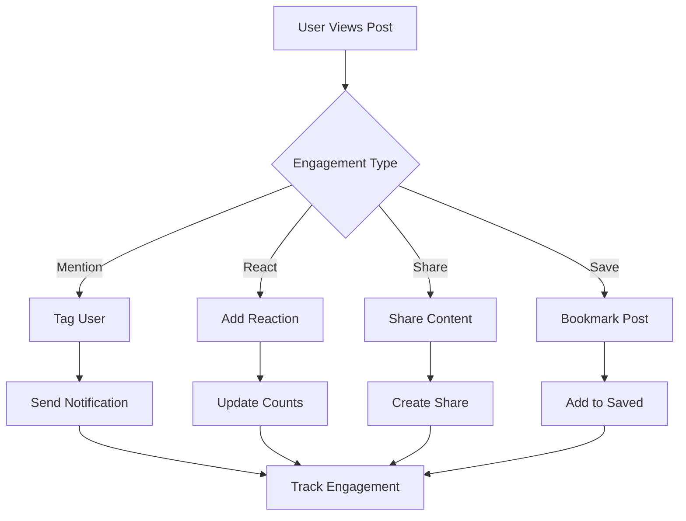

# Post Engagement

Foster community interaction and content discovery through comprehensive engagement features. Enable users to react, share, mention others, and save content for later.

<CardGroup cols={2}>
  <Card title="User Mentions" icon="at" href="mentions">
    Tag and notify users in posts with smart mention functionality
  </Card>
  <Card title="Post Reactions" icon="heart" href="reactions">
    Enable likes, reactions, and emotional responses to posts
  </Card>
  <Card title="Content Sharing" icon="share" href="sharing">
    Share posts across platforms and within communities
  </Card>
  <Card title="Bookmarks" icon="bookmark" href="bookmarks">
    Allow users to save and organize favorite posts
  </Card>
</CardGroup>

## Engagement Flow

## Key Features

<AccordionGroup>
  <Accordion title="Social Interactions">
    - **Mentions**: Tag users with @ notation and smart autocomplete
    - **Reactions**: Support for multiple reaction types beyond simple likes
    - **Threading**: Enable discussion threads from post interactions
    - **Notifications**: Real-time notifications for all engagement activities
  </Accordion>
  
  <Accordion title="Content Discovery">
    - **Sharing**: Share to external platforms and internal communities
    - **Bookmarks**: Personal content organization and retrieval
    - **Trending**: Surface popular content based on engagement
    - **Recommendations**: Suggest content based on user interactions
  </Accordion>
  
  <Accordion title="Analytics Integration">
    - **Engagement Tracking**: Monitor all interaction types and patterns
    - **User Insights**: Understand user behavior and preferences
    - **Content Performance**: Measure post success through engagement metrics
    - **Real-time Metrics**: Live updates on engagement statistics
  </Accordion>
</AccordionGroup>

## Best Practices

<AccordionGroup>
  <Accordion title="Mention Etiquette">
    - Use mentions sparingly and meaningfully
    - Provide context when mentioning users
    - Respect user preferences for mention notifications
    - Implement mention limits to prevent spam
  </Accordion>
  
  <Accordion title="Reaction Design">
    - Keep reaction options simple and intuitive
    - Use familiar icons and gestures
    - Provide feedback for successful actions
    - Consider cultural differences in reaction meanings
  </Accordion>
  
  <Accordion title="Sharing Strategy">
    - Optimize shared content for different platforms
    - Include compelling preview text and images
    - Track sharing success and adjust content accordingly
    - Respect platform-specific sharing guidelines
  </Accordion>
</AccordionGroup>

## Common Use Cases

<CardGroup cols={3}>
  <Card title="Community Building" icon="users">
    Foster connections through mentions and reactions
  </Card>
  <Card title="Content Curation" icon="collection">
    Help users organize and save valuable content
  </Card>
  <Card title="Viral Growth" icon="trending-up">
    Amplify reach through strategic sharing features
  </Card>
</CardGroup>

## Related Topics

<CardGroup cols={3}>
  <Card title="Post Creation" href="../creation/overview" icon="plus">
    Learn how to create engaging post content
  </Card>
  <Card title="Post Retrieval" href="../retrieval/overview" icon="search">
    Efficiently query and display posts
  </Card>
  <Card title="Post Analytics" href="../analytics/overview" icon="chart-bar">
    Measure and analyze engagement performance
  </Card>
</CardGroup>
