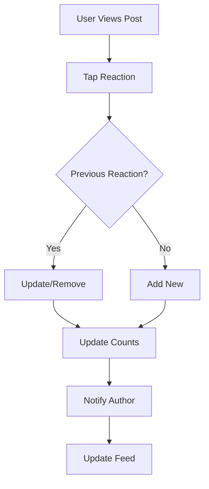

# Post Reactions

Enable rich emotional responses to posts through a comprehensive reaction system. Support likes, emotions, and custom reactions to foster engagement and community interaction.

<CardGroup cols={2}>
  <Card title="Like Posts" icon="heart">
    Simple like/unlike functionality for post appreciation
  </Card>
  <Card title="Emotion Reactions" icon="face-smile">
    Express feelings with emoji-based emotional reactions
  </Card>
  <Card title="Custom Reactions" icon="star">
    Create branded or community-specific reaction types
  </Card>
  <Card title="Reaction Analytics" icon="chart-bar">
    Track reaction patterns and user engagement
  </Card>
</CardGroup>

## Reaction Flow



## Implementation

<CodeGroup>
```swift iOS
import AmitySDK

// React to a post
func reactToPost(postId: String, reactionType: String) async throws {
    let reactionRepository = AmityReactionRepository(client: client)
    
    try await reactionRepository.addReaction(
        to: postId,
        reactionType: reactionType
    )
}

// Remove reaction
func removeReaction(postId: String) async throws {
    let reactionRepository = AmityReactionRepository(client: client)
    
    try await reactionRepository.removeReaction(from: postId)
}
```

```kotlin Android
// React to a post
fun reactToPost(postId: String, reactionType: String) {
    val reactionRepository = AmityReactionRepository(client)
    
    reactionRepository.addReaction(postId, reactionType)
        .doOnSuccess { reaction ->
            // Handle successful reaction
        }
        .doOnError { error ->
            // Handle error
        }
        .subscribe()
}
```

```typescript TypeScript
import { ReactionRepository } from '@amityco/ts-sdk';

// Add reaction to post
async function reactToPost(postId: string, reactionType: string) {
  const { data: reaction } = await ReactionRepository.addReaction({
    referenceId: postId,
    referenceType: 'post',
    reactionName: reactionType
  });
  
  return reaction;
}

// Remove reaction
async function removeReaction(postId: string) {
  await ReactionRepository.removeReaction({
    referenceId: postId,
    referenceType: 'post'
  });
}
```
</CodeGroup>

## Reaction Types

<AccordionGroup>
  <Accordion title="Basic Reactions">
    - **Like**: Simple thumbs up or heart
    - **Love**: Strong positive emotion
    - **Laugh**: Humorous content appreciation
    - **Wow**: Surprise or amazement
    - **Sad**: Empathetic response
    - **Angry**: Strong negative reaction
  </Accordion>
  
  <Accordion title="Custom Reactions">
    - **Branded Reactions**: Company or app-specific reactions
    - **Community Reactions**: Reactions specific to communities
    - **Seasonal Reactions**: Time-limited special reactions
    - **Achievement Reactions**: Milestone or accomplishment reactions
  </Accordion>
</AccordionGroup>

## Related Topics

<CardGroup cols={3}>
  <Card title="User Mentions" href="mentions" icon="at">
    Tag users in posts and comments
  </Card>
  <Card title="Content Sharing" href="sharing" icon="share">
    Share posts across platforms
  </Card>
  <Card title="Post Analytics" href="../analytics/overview" icon="chart-bar">
    Analyze reaction patterns and engagement
  </Card>
</CardGroup>
