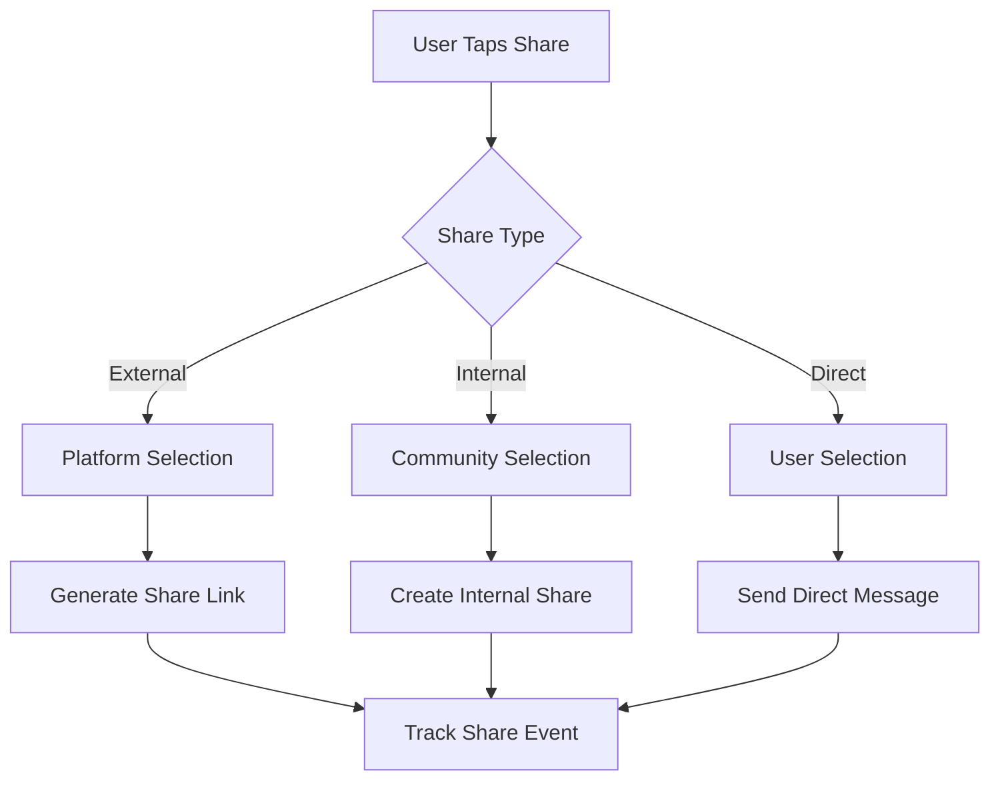

# Content Sharing

Amplify content reach through comprehensive sharing capabilities. Enable users to share posts across social platforms, within communities, and through direct messaging.

<CardGroup cols={2}>
  <Card title="Platform Sharing" icon="share">
    Share to external social media platforms
  </Card>
  <Card title="Internal Sharing" icon="arrow-right">
    Share within communities and user feeds
  </Card>
  <Card title="Direct Sharing" icon="paper-plane">
    Send posts directly to specific users
  </Card>
  <Card title="Share Analytics" icon="chart-line">
    Track sharing performance and reach
  </Card>
</CardGroup>

## Sharing Flow



## Implementation

<CodeGroup>
```swift iOS
import AmitySDK

// Share post externally
func sharePostExternally(post: AmityPost) {
    let shareText = "\(post.data?["text"] ?? "") - Shared via MyApp"
    let shareURL = generateShareURL(for: post.postId)
    
    let activityViewController = UIActivityViewController(
        activityItems: [shareText, shareURL],
        applicationActivities: nil
    )
    
    present(activityViewController, animated: true)
}

// Share within community
func shareToFeed(originalPostId: String, targetFeedId: String) async throws {
    let builder = AmitySharePostBuilder()
    builder.setSharedPostId(originalPostId)
    
    let post = try await postRepository.sharePost(
        builder,
        targetId: targetFeedId,
        targetType: .community
    )
}
```

```typescript TypeScript
import { PostRepository } from '@amityco/ts-sdk';

// Share post to another community
async function shareToFeed(originalPostId: string, targetFeedId: string) {
  const sharedPost = await PostRepository.createPost({
    dataType: 'share',
    data: {
      originalPostId: originalPostId
    },
    targetType: 'community',
    targetId: targetFeedId
  });
  
  return sharedPost;
}

// Generate shareable link
function generateShareLink(postId: string): string {
  return `https://myapp.com/posts/${postId}`;
}
```
</CodeGroup>

## Share Types

<AccordionGroup>
  <Accordion title="External Platforms">
    - **Social Media**: Twitter, Facebook, Instagram, LinkedIn
    - **Messaging**: WhatsApp, Telegram, SMS
    - **Email**: Direct email sharing with rich previews
    - **Copy Link**: Simple URL copying for any platform
  </Accordion>
  
  <Accordion title="Internal Sharing">
    - **Community Cross-posting**: Share to other communities
    - **User Feeds**: Share to personal timelines
    - **Groups**: Share within private groups
    - **Direct Messages**: Send to specific users
  </Accordion>
</AccordionGroup>

## Best Practices

<AccordionGroup>
  <Accordion title="Share Optimization">
    - Include compelling preview text and images
    - Optimize for each platform's format requirements
    - Track successful shares to improve content strategy
    - Provide easy-to-use sharing interfaces
  </Accordion>
  
  <Accordion title="Attribution">
    - Always credit original authors
    - Maintain links back to original content
    - Respect content licensing and permissions
    - Include app branding in external shares
  </Accordion>
</AccordionGroup>

## Related Topics

<CardGroup cols={3}>
  <Card title="Post Reactions" href="reactions" icon="heart">
    Enable emotional responses to posts
  </Card>
  <Card title="User Mentions" href="mentions" icon="at">
    Tag users in shared content
  </Card>
  <Card title="Post Analytics" href="../analytics/overview" icon="chart-bar">
    Measure sharing impact and reach
  </Card>
</CardGroup>
