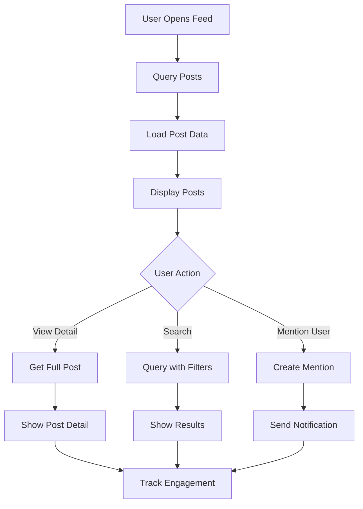

# Post Interactions

Enable rich user interactions with posts through comprehensive viewing, querying, and engagement features. Help users discover, access, and interact with content effectively.

<CardGroup cols={2}>
  <Card title="Viewing Posts" icon="eye" href="viewing-post-content">
    Display and render post content with proper formatting and media handling
  </Card>
  <Card title="Get Posts" icon="download" href="get-post">
    Retrieve specific posts by ID with full content and metadata
  </Card>
  <Card title="Query Posts" icon="search" href="query-post">
    Search and filter posts with advanced querying capabilities
  </Card>
  <Card title="Mentions" icon="at" href="mention-in-post">
    Enable user mentions in posts with notifications and linking
  </Card>
</CardGroup>

## Interaction Flow



## Core Features

<AccordionGroup>
  <Accordion title="Content Display">
    - **Rich Rendering**: Support for text formatting, images, videos, and files
    - **Responsive Design**: Optimal display across different screen sizes
    - **Media Optimization**: Efficient loading and caching of images and videos
    - **Accessibility**: Screen reader support and keyboard navigation
  </Accordion>
  
  <Accordion title="Content Discovery">
    - **Advanced Queries**: Filter by date, author, community, content type
    - **Full-text Search**: Search within post content and metadata
    - **Pagination**: Efficient loading of large result sets
    - **Real-time Updates**: Live updates when new posts match queries
  </Accordion>
  
  <Accordion title="Social Features">
    - **User Mentions**: Tag users with automatic notifications
    - **Link Previews**: Generate previews for shared links
    - **Hashtag Support**: Enable hashtag discovery and trending
    - **Cross-references**: Link related posts and content
  </Accordion>
</AccordionGroup>

## Implementation Examples

<Tabs>
  <Tab title="Basic Post Display">
    ```typescript
    // Get and display a specific post
    const post = await AmitySDK.getPost('post-id');
    
    // Render post content
    function renderPost(post: AmityPost) {
      return {
        id: post.postId,
        content: post.data?.text || '',
        author: post.postedUser,
        createdAt: post.createdAt,
        reactions: post.reactionsCount,
        comments: post.commentsCount
      };
    }
    ```
  </Tab>
  
  <Tab title="Advanced Querying">
    ```typescript
    // Query posts with filters
    const posts = AmitySDK.queryPosts({
      targetType: 'community',
      targetId: 'community-id',
      types: ['text', 'image'],
      sortBy: 'lastCreated',
      limit: 20,
      includeDeleted: false
    });
    
    // Search posts by content
    const searchResults = AmitySDK.searchPosts({
      query: 'machine learning',
      fields: ['text', 'tags'],
      limit: 10
    });
    ```
  </Tab>
  
  <Tab title="Mentions and Linking">
    ```typescript
    // Create post with mentions
    const postWithMentions = await AmitySDK.createPost({
      type: 'text',
      text: 'Great work @john.doe and @jane.smith!',
      mentionees: [
        { userId: 'john-doe-id', type: 'user' },
        { userId: 'jane-smith-id', type: 'user' }
      ],
      metadata: {
        hashtags: ['teamwork', 'achievement']
      }
    });
    ```
  </Tab>
</Tabs>

## Best Practices

<AccordionGroup>
  <Accordion title="Performance">
    - **Lazy Loading**: Load content progressively as users scroll
    - **Image Optimization**: Serve appropriate image sizes for different devices
    - **Caching Strategy**: Cache frequently accessed posts locally
    - **Pagination**: Use proper pagination to avoid loading too much data at once
  </Accordion>
  
  <Accordion title="User Experience">
    - **Loading States**: Show loading indicators for better user feedback
    - **Error Handling**: Gracefully handle failed requests and network issues
    - **Offline Support**: Cache content for offline viewing when possible
    - **Accessibility**: Ensure all interactions work with assistive technologies
  </Accordion>
</AccordionGroup>
