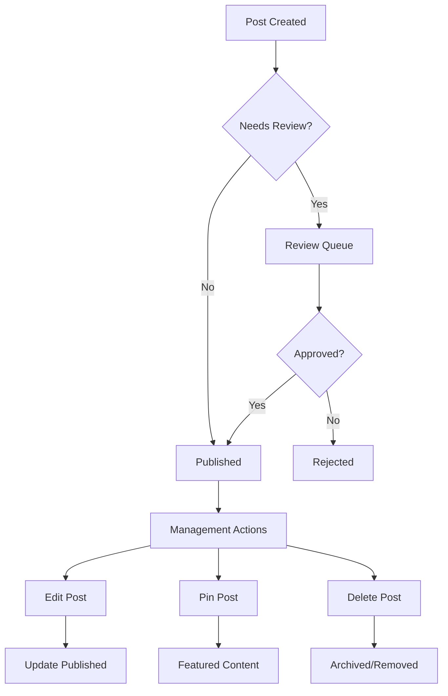

# Post Management

Comprehensive tools for managing posts throughout their lifecycle. Handle post updates, deletions, pinning important content, and implementing review workflows.

<CardGroup cols={2}>
  <Card title="Edit Posts" icon="edit" href="edit-post">
    Update post content, metadata, and settings after publication
  </Card>
  <Card title="Delete Posts" icon="trash" href="delete-post">
    Remove posts with proper cleanup and user notifications
  </Card>
  <Card title="Pin Posts" icon="thumbtack" href="pinned-post">
    Highlight important posts by pinning them to communities or feeds
  </Card>
  <Card title="Post Review" icon="search" href="post-review">
    Implement review workflows for content approval and quality control
  </Card>
</CardGroup>

## Management Workflow

## Key Features

<AccordionGroup>
  <Accordion title="Post Editing">
    - **Content Updates**: Modify text, images, and media after publication
    - **Metadata Changes**: Update tags, categories, and custom fields
    - **Version History**: Track changes and maintain edit history
    - **Permission Controls**: Restrict editing based on user roles and time limits
  </Accordion>
  
  <Accordion title="Content Lifecycle">
    - **Soft Deletion**: Remove posts while preserving data for recovery
    - **Hard Deletion**: Permanently remove posts and associated data
    - **Archiving**: Store old content in archived state
    - **Restoration**: Recover deleted or archived content when needed
  </Accordion>
  
  <Accordion title="Content Curation">
    - **Post Pinning**: Feature important posts at the top of feeds
    - **Priority Levels**: Set different priority levels for content visibility
    - **Community Pinning**: Pin posts within specific communities
    - **Time-based Pinning**: Automatically unpin content after specified duration
  </Accordion>
</AccordionGroup>

## Best Practices

<AccordionGroup>
  <Accordion title="Content Updates">
    - **Clear Change Indicators**: Show when and what was edited
    - **Edit Windows**: Set reasonable time limits for post editing
    - **Approval Workflows**: Require approval for significant edits
    - **User Notifications**: Inform relevant users about important changes
  </Accordion>
  
  <Accordion title="Deletion Policies">
    - **Soft Delete First**: Use soft delete to allow recovery
    - **Clear Policies**: Establish clear deletion policies and communicate them
    - **User Rights**: Respect user rights to delete their own content
    - **Dependencies**: Handle comments and reactions when deleting posts
  </Accordion>
</AccordionGroup>
