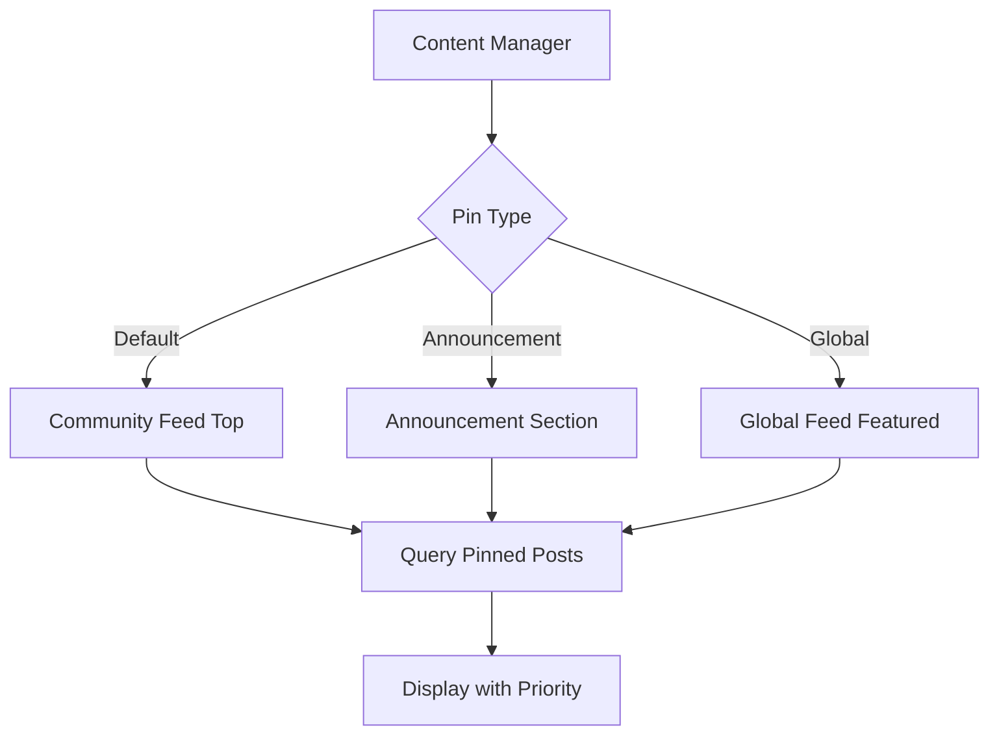

# Pinned Posts

Pinned posts empower community moderators to highlight key announcements, discussions, or content critical for community engagement. The Social Plus SDK provides comprehensive pinning functionality with support for different placement types and visibility levels.

## Overview



<CardGroup cols={3}>
  <Card title="Default Pins" icon="thumbtack">
    Featured posts at the top of community feeds
  </Card>
  <Card title="Announcements" icon="megaphone">
    Important updates in dedicated announcement sections
  </Card>
  <Card title="Global Featured" icon="globe">
    Platform-wide featured content for maximum visibility
  </Card>
</CardGroup>

## Pin Placement Types

| Placement | Description | Use Case | Visibility |
|-----------|-------------|----------|------------|
| `default` | Standard community pins | Important community posts | Community members |
| `announcement` | Announcement section pins | Critical updates, rules | Community members |
| `global` | Platform-wide featured | Major announcements, events | All users |

<Info>
Currently, post pinning is managed through the ASC (Admin Studio Console). SDK integration for pinning management is planned for future releases.
</Info>

## Query Pinned Posts

Retrieve pinned posts for display at the top of community feeds, ensuring maximum visibility for important content.

<Tabs>
  <Tab title="iOS">
    ```swift
    import AmitySDK
    
    class PinnedPostManager {
        private let client: AmityClient
        
        init(client: AmityClient) {
            self.client = client
        }
        
        // Get default pinned posts for community
        func getDefaultPinnedPosts(
            communityId: String,
            completion: @escaping (Result<[AmityPost], Error>) -> Void
        ) {
            let repository = AmityPostRepository(client: client)
            let collection = repository.getPinnedPosts(
                communityId: communityId,
                placement: .default
            )
            
            collection.observeOnce { result in
                switch result {
                case .success(let postsInfo):
                    let posts = postsInfo.object
                    print("Retrieved \(posts.count) default pinned posts")
                    completion(.success(posts))
                    
                case .failure(let error):
                    print("Failed to get pinned posts: \(error.localizedDescription)")
                    completion(.failure(error))
                }
            }
        }
        
        // Observe pinned posts with live updates
        func observePinnedPosts(
            communityId: String,
            placement: AmityPinnedPostPlacement = .default,
            onUpdate: @escaping ([AmityPost]) -> Void,
            onError: @escaping (Error) -> Void
        ) -> AmityNotificationToken {
            
            let repository = AmityPostRepository(client: client)
            let collection = repository.getPinnedPosts(
                communityId: communityId,
                placement: placement
            )
            
            return collection.observe { result in
                switch result {
                case .success(let postsInfo):
                    let posts = postsInfo.object
                    print("Pinned posts updated: \(posts.count) posts")
                    onUpdate(posts)
                    
                case .failure(let error):
                    print("Pinned posts observation error: \(error)")
                    onError(error)
                }
            }
        }
        
        // Get all pinned posts for a community (all placements)
        func getAllPinnedPostsForCommunity(
            communityId: String,
            completion: @escaping (Result<PinnedPostsResult, Error>) -> Void
        ) {
            let group = DispatchGroup()
            var defaultPosts: [AmityPost] = []
            var announcementPosts: [AmityPost] = []
            var errors: [Error] = []
            
            let repository = AmityPostRepository(client: client)
            
            // Get default pinned posts
            group.enter()
            let defaultCollection = repository.getPinnedPosts(
                communityId: communityId,
                placement: .default
            )
            defaultCollection.observeOnce { result in
                switch result {
                case .success(let postsInfo):
                    defaultPosts = postsInfo.object
                case .failure(let error):
                    errors.append(error)
                }
                group.leave()
            }
            
            // Get announcement posts
            group.enter()
            let announcementCollection = repository.getPinnedPosts(
                communityId: communityId,
                placement: .announcement
            )
            announcementCollection.observeOnce { result in
                switch result {
                case .success(let postsInfo):
                    announcementPosts = postsInfo.object
                case .failure(let error):
                    errors.append(error)
                }
                group.leave()
            }
            
            group.notify(queue: .main) {
                if !errors.isEmpty {
                    completion(.failure(errors.first!))
                } else {
                    let result = PinnedPostsResult(
                        defaultPosts: defaultPosts,
                        announcementPosts: announcementPosts
                    )
                    completion(.success(result))
                }
            }
        }
    }
    
    struct PinnedPostsResult {
        let defaultPosts: [AmityPost]
        let announcementPosts: [AmityPost]
        
        var totalCount: Int {
            return defaultPosts.count + announcementPosts.count
        }
    }
    ```
  </Tab>
  
  <Tab title="Android">
    ```kotlin
    import co.amity.sdk.*
    
    class PinnedPostManager {
        
        // Get default pinned posts
        fun getDefaultPinnedPosts(
            communityId: String
        ): LiveData<List<AmityPost>> {
            return AmityPostRepository.Builder()
                .build()
                .getPinnedPosts(
                    communityId = communityId,
                    placement = AmityPinnedPostPlacement.DEFAULT
                )
        }
        
        // Get pinned posts with observer
        fun observePinnedPosts(
            communityId: String,
            placement: AmityPinnedPostPlacement = AmityPinnedPostPlacement.DEFAULT,
            onUpdate: (List<AmityPost>) -> Unit,
            onError: (Throwable) -> Unit
        ) {
            val liveData = AmityPostRepository.Builder()
                .build()
                .getPinnedPosts(
                    communityId = communityId,
                    placement = placement
                )
            
            liveData.observeForever { posts ->
                if (posts != null) {
                    println("Pinned posts updated: ${posts.size} posts")
                    onUpdate(posts)
                } else {
                    onError(Exception("Failed to load pinned posts"))
                }
            }
        }
        
        // Get all pinned posts for community
        fun getAllPinnedPostsForCommunity(
            communityId: String,
            callback: (PinnedPostsResult?, String?) -> Unit
        ) {
            val repository = AmityPostRepository.Builder().build()
            var defaultPosts: List<AmityPost>? = null
            var announcementPosts: List<AmityPost>? = null
            var completedRequests = 0
            var errorMessage: String? = null
            
            fun checkCompletion() {
                completedRequests++
                if (completedRequests == 2) {
                    if (errorMessage != null) {
                        callback(null, errorMessage)
                    } else {
                        val result = PinnedPostsResult(
                            defaultPosts = defaultPosts ?: emptyList(),
                            announcementPosts = announcementPosts ?: emptyList()
                        )
                        callback(result, null)
                    }
                }
            }
            
            // Get default pinned posts
            repository.getPinnedPosts(
                communityId = communityId,
                placement = AmityPinnedPostPlacement.DEFAULT
            ).observeForever { posts ->
                defaultPosts = posts ?: emptyList()
                checkCompletion()
            }
            
            // Get announcement posts
            repository.getPinnedPosts(
                communityId = communityId,
                placement = AmityPinnedPostPlacement.ANNOUNCEMENT
            ).observeForever { posts ->
                announcementPosts = posts ?: emptyList()
                checkCompletion()
            }
        }
        
        // Check if a post is pinned
        fun isPostPinned(
            postId: String,
            communityId: String,
            callback: (Boolean) -> Unit
        ) {
            getAllPinnedPostsForCommunity(communityId) { result, error ->
                if (result != null) {
                    val allPinnedIds = result.defaultPosts.map { it.postId } + 
                                     result.announcementPosts.map { it.postId }
                    callback(allPinnedIds.contains(postId))
                } else {
                    callback(false)
                }
            }
        }
    }
    
    data class PinnedPostsResult(
        val defaultPosts: List<AmityPost>,
        val announcementPosts: List<AmityPost>
    ) {
        val totalCount: Int
            get() = defaultPosts.size + announcementPosts.size
    }
    ```
  </Tab>
  
  <Tab title="TypeScript">
    ```typescript
    import { PostRepository, PinnedPostPlacement, AmityPost, LiveCollection } from '@amityco/ts-sdk';
    
    interface PinnedPostsResult {
      defaultPosts: AmityPost[];
      announcementPosts: AmityPost[];
      totalCount: number;
    }
    
    class PinnedPostManager {
      
      // Get default pinned posts
      async getDefaultPinnedPosts(communityId: string): Promise<AmityPost[]> {
        try {
          const posts = await PostRepository.getPinnedPosts({
            communityId,
            placement: PinnedPostPlacement.Default
          });
          
          console.log(`Retrieved ${posts.length} default pinned posts`);
          return posts;
        } catch (error) {
          console.error('Failed to get default pinned posts:', error);
          throw error;
        }
      }
      
      // Observe pinned posts with live updates
      observePinnedPosts(
        communityId: string,
        placement: PinnedPostPlacement = PinnedPostPlacement.Default,
        onUpdate: (posts: AmityPost[]) => void,
        onError: (error: Error) => void
      ): () => void {
        
        const liveCollection = PostRepository.getPinnedPostsLive({
          communityId,
          placement
        });
        
        liveCollection.on('dataUpdated', (posts: AmityPost[]) => {
          console.log(`Pinned posts updated: ${posts.length} posts`);
          onUpdate(posts);
        });
        
        liveCollection.on('dataError', (error: Error) => {
          console.error('Pinned posts observation error:', error);
          onError(error);
        });
        
        // Return cleanup function
        return () => liveCollection.dispose();
      }
      
      // Get all pinned posts for community
      async getAllPinnedPostsForCommunity(
        communityId: string
      ): Promise<PinnedPostsResult> {
        try {
          const [defaultPosts, announcementPosts] = await Promise.all([
            this.getPinnedPostsByPlacement(communityId, PinnedPostPlacement.Default),
            this.getPinnedPostsByPlacement(communityId, PinnedPostPlacement.Announcement)
          ]);
          
          return {
            defaultPosts,
            announcementPosts,
            totalCount: defaultPosts.length + announcementPosts.length
          };
        } catch (error) {
          console.error('Failed to get all pinned posts:', error);
          throw error;
        }
      }
      
      // Get pinned posts by specific placement
      async getPinnedPostsByPlacement(
        communityId: string,
        placement: PinnedPostPlacement
      ): Promise<AmityPost[]> {
        try {
          return await PostRepository.getPinnedPosts({
            communityId,
            placement
          });
        } catch (error) {
          console.error(`Failed to get pinned posts for placement ${placement}:`, error);
          return [];
        }
      }
      
      // Check if a post is pinned
      async isPostPinned(postId: string, communityId: string): Promise<boolean> {
        try {
          const allPinnedPosts = await this.getAllPinnedPostsForCommunity(communityId);
          const allPinnedIds = [
            ...allPinnedPosts.defaultPosts.map(p => p.postId),
            ...allPinnedPosts.announcementPosts.map(p => p.postId)
          ];
          
          return allPinnedIds.includes(postId);
        } catch (error) {
          console.error('Error checking if post is pinned:', error);
          return false;
        }
      }
      
      // Get pinned posts with metadata
      async getPinnedPostsWithMetadata(
        communityId: string
      ): Promise<{
        posts: AmityPost[];
        metadata: {
          totalPinned: number;
          byPlacement: Record<string, number>;
          lastUpdated: string;
        };
      }> {
        const result = await this.getAllPinnedPostsForCommunity(communityId);
        
        return {
          posts: [...result.defaultPosts, ...result.announcementPosts],
          metadata: {
            totalPinned: result.totalCount,
            byPlacement: {
              default: result.defaultPosts.length,
              announcement: result.announcementPosts.length
            },
            lastUpdated: new Date().toISOString()
          }
        };
      }
    }
    ```
  </Tab>
</Tabs>

## Query Announcements

Announcement-type pinned posts are tracked separately and typically displayed in dedicated sections for maximum visibility.

<Tabs>
  <Tab title="iOS">
    <CodeGroup>
```swift
// iOS - Get announcements
func getAnnouncements(communityId: String) {
    let repository = AmityPostRepository(client: client)
    let collection = repository.getPinnedPosts(
        communityId: communityId,
        placement: .announcement
    )
    
    collection.observeOnce { result in
        switch result {
        case .success(let postsInfo):
            let announcements = postsInfo.object
            print("Retrieved \(announcements.count) announcements")
            // Display announcements in dedicated section
        case .failure(let error):
            print("Error getting announcements: \(error)")
        }
    }
}
```
    </CodeGroup>
  </Tab>
  <Tab title="Android">
    <CodeGroup>
```kotlin
// Android - Get announcements
fun getAnnouncements(communityId: String) {
    val repository = AmityPostRepository(client)
    val query = repository.getPinnedPosts(
        communityId = communityId,
        placement = AmityPinnedPostPlacement.ANNOUNCEMENT
    )
    
    query.build().query()
        .observeOn(AndroidSchedulers.mainThread())
        .subscribe(
            { pagedList ->
                val announcements = pagedList.snapshot()
                println("Retrieved ${announcements.size} announcements")
                // Display announcements in dedicated section
            },
            { error ->
                println("Error getting announcements: ${error.message}")
            }
        )
}
```
    </CodeGroup>
  </Tab>
  <Tab title="TypeScript">
    <CodeGroup>
```typescript
// TypeScript - Get announcements
async function getAnnouncements(communityId: string) {
  try {
    const { data: announcements } = await client.post.getPinnedPosts({
      communityId,
      placement: 'announcement'
    });
    
    console.log(`Retrieved ${announcements.posts.length} announcements`);
    // Display announcements in dedicated section
    return announcements.posts;
  } catch (error) {
    console.error('Error getting announcements:', error);
    throw error;
  }
}
```
    </CodeGroup>
  </Tab>
  <Tab title="Flutter">
    <CodeGroup>
```dart
// Flutter - Get announcements
Future<void> getAnnouncements(String communityId) async {
  try {
    final repository = AmityPostRepository(client);
    final query = repository.getPinnedPosts(
      communityId: communityId,
      placement: AmityPinnedPostPlacement.announcement,
    );
    
    final pagedList = await query.build().query();
    final announcements = pagedList.snapshot();
    
    print('Retrieved ${announcements.length} announcements');
    // Display announcements in dedicated section
  } catch (error) {
    print('Error getting announcements: $error');
  }
}
```
    </CodeGroup>
  </Tab>
</Tabs>

## Query Global Featured Posts

Global featured posts appear at the top of the main feed across the entire platform, ensuring maximum visibility for platform-wide announcements and featured content.

<Info>
To maintain a balanced feed with fresh content from your communities, we recommend limiting the number of posts featured globally.
</Info>

<Tabs>
  <Tab title="iOS">
    <CodeGroup>
```swift
func getGlobalPinnedPost() {
    let request = GetPinnedPostsRequest(placement: .global)
    
    client.getPinnedPosts(request) { result in
        switch result {
        case .success(let response):
            // Handle global pinned posts
            print("Global pinned posts: \(response.posts)")
        case .failure(let error):
            // Handle error
            print("Error: \(error)")
        }
    }
}
```
    </CodeGroup>
  </Tab>
  <Tab title="Android">
    <CodeGroup>
```kotlin
fun getGlobalPinnedPost() {
    val request = GetPinnedPostsRequest(
        placement = PinnedPostPlacement.GLOBAL
    )
    
    client.getPinnedPosts(request).enqueue(object : Callback<GetPinnedPostsResponse> {
        override fun onResponse(
            call: Call<GetPinnedPostsResponse>,
            response: Response<GetPinnedPostsResponse>
        ) {
            // Handle global pinned posts
            println("Global pinned posts: ${response.body()?.posts}")
        }
        
        override fun onFailure(call: Call<GetPinnedPostsResponse>, t: Throwable) {
            // Handle error
            println("Error: ${t.message}")
        }
    })
}
```
    </CodeGroup>
  </Tab>
  <Tab title="Typescript">
    <CodeGroup>
```typescript
async function getGlobalPinnedPost() {
  try {
    const response = await client.getPinnedPosts({
      placement: 'global'
    });
    // Handle global pinned posts
    console.log('Global pinned posts:', response.posts);
  } catch (error) {
    // Handle error
    console.error('Error:', error);
  }
}
```
    </CodeGroup>
  </Tab>
</Tabs>