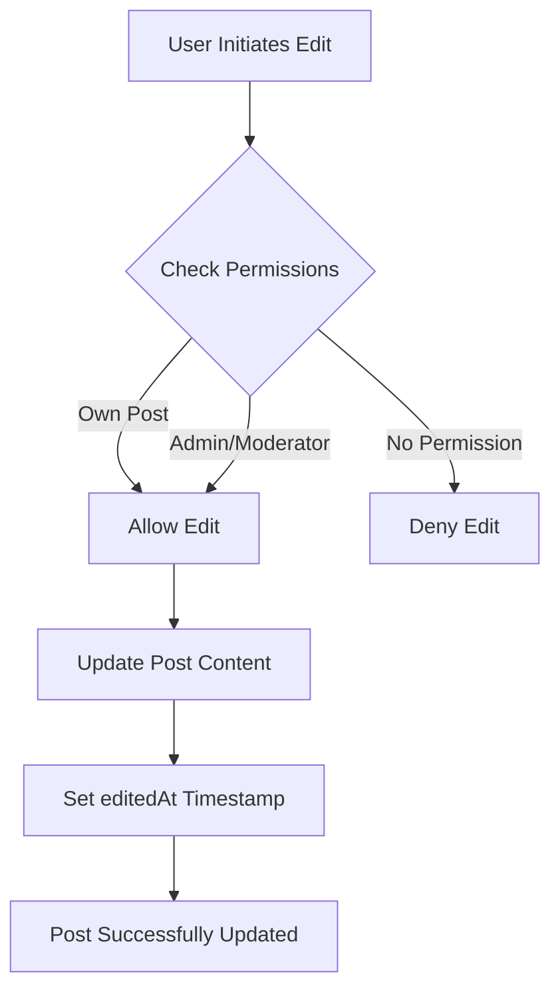

# Edit Posts

The Social Plus SDK provides comprehensive post editing capabilities that promote accountability and transparency within your application. Users can edit their own posts, while community admins and moderators have additional privileges to edit posts within their communities.

## Overview



<CardGroup cols={2}>
  <Card title="Supported Post Types" icon="edit">
    - Text posts
    - Image posts  
    - Video posts
    - File posts
  </Card>
  <Card title="Key Features" icon="sparkles">
    - Edit timestamp tracking
    - Permission-based editing
    - Media file management
    - Content validation
  </Card>
</CardGroup>

## Edit Parameters

| Parameter | Type | Description | Required |
|-----------|------|-------------|----------|
| `postId` | String | ID of the post to edit | ✅ |
| `data` | Object | New post content data | ✅ |
| `metadata` | Object | Additional post metadata | ❌ |
| `tags` | Array\<String\> | Post tags (max 5, 24 chars each) | ❌ |
| `mentionees` | Array | Users mentioned in post | ❌ |

## Post Editing Examples

<Tabs>
<Tab title="iOS">
### Text Post Editing

Update text content while preserving post metadata and engagement metrics.

```swift
import AmitySDK

func editTextPost(postId: String, newText: String) {
    let textPostBuilder = AmityTextPostBuilder()
        .setText(newText)
        .setTags(["updated", "edited"])
        .setMetadata(["editReason": "typo_correction"])
    
    let repository = AmityPostRepository(client: client)
    repository.editPost(withId: postId, builder: textPostBuilder)
        .subscribe { [weak self] result in
            switch result {
            case .success(let post):
                print("Post edited successfully: \(post.postId)")
                print("Edited at: \(post.editedAt)")
            case .failure(let error):
                print("Edit failed: \(error.localizedDescription)")
            }
        }
}

// Batch edit with validation
func editMultiplePosts(posts: [(id: String, text: String)]) {
    let group = DispatchGroup()
    var results: [String: Bool] = [:]
    
    for postData in posts {
        group.enter()
        let builder = AmityTextPostBuilder().setText(postData.text)
        
        AmityPostRepository(client: client)
            .editPost(withId: postData.id, builder: builder)
            .subscribe { result in
                results[postData.id] = result.isSuccess
                group.leave()
            }
    }
    
    group.notify(queue: .main) {
        print("Batch edit complete: \(results)")
    }
}
```

### Image Post Editing

Replace or append images while maintaining existing content structure.

```swift
func editImagePost(postId: String, newImages: [UIImage], keepExisting: Bool = true) {
    // First upload new images
    let fileRepository = AmityFileRepository(client: client)
    var uploadedFiles: [AmityFile] = []
    
    let group = DispatchGroup()
    
    for image in newImages {
        group.enter()
        fileRepository.uploadImage(image) { result in
            switch result {
            case .success(let file):
                uploadedFiles.append(file)
            case .failure(let error):
                print("Upload failed: \(error)")
            }
            group.leave()
        }
    }
    
    group.notify(queue: .main) {
        // Build image post with new files
        let imageBuilder = AmityImagePostBuilder()
            .setImages(uploadedFiles)
            .setText("Updated with new images")
        
        AmityPostRepository(client: client)
            .editPost(withId: postId, builder: imageBuilder)
            .subscribe { result in
                switch result {
                case .success:
                    print("Image post updated successfully")
                case .failure(let error):
                    print("Edit failed: \(error)")
                }
            }
    }
}
```

### File Post Editing

Update file attachments with proper validation and error handling.

```swift
func editFilePost(postId: String, newFileURLs: [URL]) {
    let fileRepository = AmityFileRepository(client: client)
    var uploadedFiles: [AmityFile] = []
    
    // Upload new files
    for fileURL in newFileURLs {
        fileRepository.uploadFile(fileURL) { result in
            switch result {
            case .success(let file):
                uploadedFiles.append(file)
            case .failure(let error):
                print("File upload failed: \(error)")
                return
            }
        }
    }
    
    // Edit post with new files
    let fileBuilder = AmityFilePostBuilder()
        .setFiles(uploadedFiles)
        .setText("Updated file attachments")
    
    AmityPostRepository(client: client)
        .editPost(withId: postId, builder: fileBuilder)
        .subscribe { result in
            // Handle result
        }
}
```

### Video Post Editing

Manage video content updates with transcoding support.

```swift
func editVideoPost(postId: String, newVideoURLs: [URL]) {
    let fileRepository = AmityFileRepository(client: client)
    var uploadedVideos: [AmityFile] = []
    
    // Upload videos with progress tracking
    for videoURL in newVideoURLs {
        fileRepository.uploadVideo(videoURL) { progress in
            print("Upload progress: \(progress.completedUnitCount)/\(progress.totalUnitCount)")
        } completion: { result in
            switch result {
            case .success(let file):
                uploadedVideos.append(file)
            case .failure(let error):
                print("Video upload failed: \(error)")
            }
        }
    }
    
    // Update post with new videos
    let videoBuilder = AmityVideoPostBuilder()
        .setVideos(uploadedVideos)
        .setText("Updated video content")
    
    AmityPostRepository(client: client)
        .editPost(withId: postId, builder: videoBuilder)
        .subscribe { result in
            // Handle completion
        }
}
```
</Tab>

<Tab title="Android">
### Text Post Editing

```kotlin
import co.amity.sdk.AmityPost
import co.amity.sdk.AmityPostRepository

class PostEditManager {
    
    fun editTextPost(postId: String, newText: String) {
        AmityPostRepository.Builder()
            .build()
            .edit(postId)
            .text(newText)
            .metadata(mapOf("editReason" to "content_update"))
            .tags(listOf("edited", "updated"))
            .build()
            .edit()
            .subscribe(
                { result ->
                    when (result) {
                        is AmityResultSuccess -> {
                            println("Post edited: ${result.data.postId}")
                            println("Edit timestamp: ${result.data.editedAt}")
                        }
                        is AmityResultError -> {
                            handleEditError(result.error)
                        }
                    }
                },
                { error ->
                    println("Edit failed: ${error.message}")
                }
            )
    }
    
    // Batch editing with error handling
    fun editMultiplePosts(posts: List<Pair<String, String>>) {
        val repository = AmityPostRepository.Builder().build()
        
        posts.forEach { (postId, newText) ->
            repository.edit(postId)
                .text(newText)
                .build()
                .edit()
                .doOnSuccess { 
                    println("Successfully edited post: $postId")
                }
                .doOnError { error ->
                    println("Failed to edit post $postId: ${error.message}")
                }
                .subscribe()
        }
    }
}
```

### Image Post Editing

```kotlin
fun editImagePost(postId: String, newImages: List<Uri>, keepExisting: Boolean = true) {
    // Upload new images first
    val fileRepository = AmityFileRepository.Builder().build()
    val uploadedFiles = mutableListOf<AmityFile>()
    
    newImages.forEach { imageUri ->
        fileRepository.uploadImage(imageUri)
            .doOnNext { result ->
                when (result) {
                    is AmityUploadResult.PROGRESS -> {
                        val progress = result.uploadInfo
                        println("Upload progress: ${progress.progressPercentage}%")
                    }
                    is AmityUploadResult.COMPLETE -> {
                        uploadedFiles.add(result.file)
                        
                        // When all uploads complete, edit the post
                        if (uploadedFiles.size == newImages.size) {
                            updateImagePost(postId, uploadedFiles)
                        }
                    }
                    is AmityUploadResult.ERROR -> {
                        println("Upload failed: ${result.exception.message}")
                    }
                    is AmityUploadResult.CANCELLED -> {
                        println("Upload cancelled")
                    }
                }
            }
            .subscribe()
    }
}

private fun updateImagePost(postId: String, images: List<AmityFile>) {
    AmityPostRepository.Builder()
        .build()
        .edit(postId)
        .attachments(images)
        .text("Updated with new images")
        .build()
        .edit()
        .subscribe { result ->
            when (result) {
                is AmityResultSuccess -> {
                    println("Image post updated successfully")
                }
                is AmityResultError -> {
                    println("Failed to update image post: ${result.error}")
                }
            }
        }
}
```

### File Post Editing

```kotlin
fun editFilePost(postId: String, newFiles: List<Uri>) {
    val fileRepository = AmityFileRepository.Builder().build()
    val uploadedFiles = mutableListOf<AmityFile>()
    
    newFiles.forEach { fileUri ->
        fileRepository.uploadFile(fileUri)
            .doOnNext { result ->
                when (result) {
                    is AmityUploadResult.COMPLETE -> {
                        uploadedFiles.add(result.file)
                        
                        if (uploadedFiles.size == newFiles.size) {
                            // Update post with all uploaded files
                            AmityPostRepository.Builder()
                                .build()
                                .edit(postId)
                                .attachments(uploadedFiles)
                                .text("Updated file attachments")
                                .build()
                                .edit()
                                .subscribe()
                        }
                    }
                    is AmityUploadResult.ERROR -> {
                        println("File upload failed: ${result.exception}")
                    }
                }
            }
            .subscribe()
    }
}
```

### Video Post Editing

```kotlin
fun editVideoPost(postId: String, newVideos: List<Uri>) {
    val fileRepository = AmityFileRepository.Builder().build()
    val uploadedVideos = mutableListOf<AmityFile>()
    
    newVideos.forEach { videoUri ->
        fileRepository.uploadVideo(videoUri)
            .doOnNext { result ->
                when (result) {
                    is AmityUploadResult.PROGRESS -> {
                        println("Video upload: ${result.uploadInfo.progressPercentage}%")
                    }
                    is AmityUploadResult.COMPLETE -> {
                        uploadedVideos.add(result.file)
                        
                        if (uploadedVideos.size == newVideos.size) {
                            updateVideoPost(postId, uploadedVideos)
                        }
                    }
                    is AmityUploadResult.ERROR -> {
                        println("Video upload failed: ${result.exception}")
                    }
                }
            }
            .subscribe()
    }
}

private fun updateVideoPost(postId: String, videos: List<AmityFile>) {
    AmityPostRepository.Builder()
        .build()
        .edit(postId)
        .attachments(videos)
        .text("Updated video content")
        .build()
        .edit()
        .subscribe { result ->
            // Handle result
        }
}
```
</Tab>

<Tab title="TypeScript">
### Text Post Editing

```typescript
import { PostRepository, UpdatePostParams } from '@amityco/ts-sdk';

class PostEditManager {
  async editTextPost(postId: string, newText: string): Promise<void> {
    try {
      const params: UpdatePostParams = {
        postId,
        data: { text: newText },
        metadata: { editReason: 'content_update' },
        tags: ['edited', 'updated']
      };
      
      const success = await PostRepository.updatePost(params);
      
      if (success) {
        console.log('Post edited successfully');
        
        // Get updated post to show edit timestamp
        const updatedPost = await PostRepository.getPost(postId);
        console.log('Edit timestamp:', updatedPost.editedAt);
      }
    } catch (error) {
      console.error('Edit failed:', error);
      throw error;
    }
  }
  
  // Edit with mention updates
  async editPostWithMentions(
    postId: string, 
    text: string, 
    mentionedUserIds: string[]
  ): Promise<void> {
    const params: UpdatePostParams = {
      postId,
      data: { text },
      mentionees: [{
        type: 'user',
        userIds: mentionedUserIds
      }]
    };
    
    await PostRepository.updatePost(params);
  }
  
  // Batch editing with error handling
  async editMultiplePosts(
    edits: Array<{ postId: string; text: string }>
  ): Promise<{ success: string[]; failed: string[] }> {
    const results = { success: [], failed: [] };
    
    await Promise.allSettled(
      edits.map(async ({ postId, text }) => {
        try {
          await this.editTextPost(postId, text);
          results.success.push(postId);
        } catch (error) {
          results.failed.push(postId);
          console.error(`Failed to edit ${postId}:`, error);
        }
      })
    );
    
    return results;
  }
}
```

### Image Post Editing

```typescript
import { PostRepository, FileRepository, FileType } from '@amityco/ts-sdk';

async function editImagePost(
  postId: string, 
  newImages: File[], 
  caption?: string
): Promise<void> {
  try {
    // Upload new images
    const uploadPromises = newImages.map(image => 
      FileRepository.uploadFile(image)
    );
    
    const uploadResults = await Promise.all(uploadPromises);
    const attachments = uploadResults.map(result => ({
      fileId: result.fileId,
      type: FileType.Image
    }));
    
    // Update post with new images
    await PostRepository.updatePost({
      postId,
      data: { text: caption || 'Updated images' },
      attachments
    });
    
    console.log('Image post updated successfully');
  } catch (error) {
    console.error('Failed to update image post:', error);
    throw error;
  }
}
```

### Video Post Editing

```typescript
async function editVideoPost(
  postId: string,
  newVideos: File[],
  description?: string
): Promise<void> {
  try {
    // Upload videos with progress tracking
    const uploadPromises = newVideos.map(async video => {
      const uploadResult = await FileRepository.uploadFile(video, {
        onProgress: (progress) => {
          console.log(`Upload progress: ${progress.loaded}/${progress.total}`);
        }
      });
      return uploadResult;
    });
    
    const uploadResults = await Promise.all(uploadPromises);
    const attachments = uploadResults.map(result => ({
      fileId: result.fileId,
      type: FileType.Video
    }));
    
    await PostRepository.updatePost({
      postId,
      data: { text: description || 'Updated video content' },
      attachments
    });
    
  } catch (error) {
    console.error('Video post edit failed:', error);
    throw error;
  }
}
```

### Advanced Edit Features

```typescript
class AdvancedPostEditor {
  // Edit with validation
  async editWithValidation(
    postId: string, 
    newContent: string
  ): Promise<boolean> {
    // Validate content
    if (newContent.length > 5000) {
      throw new Error('Content too long');
    }
    
    if (newContent.trim().length === 0) {
      throw new Error('Content cannot be empty');
    }
    
    // Check if user has permission to edit
    const post = await PostRepository.getPost(postId);
    const currentUser = await UserRepository.getCurrentUser();
    
    if (post.userId !== currentUser.userId && !currentUser.isModerator) {
      throw new Error('No permission to edit this post');
    }
    
    return await PostRepository.updatePost({
      postId,
      data: { text: newContent }
    });
  }
  
  // Edit with history tracking
  async editWithHistory(postId: string, newContent: string): Promise<void> {
    const post = await PostRepository.getPost(postId);
    
    // Store edit history in metadata
    const editHistory = post.metadata?.editHistory || [];
    editHistory.push({
      timestamp: new Date().toISOString(),
      previousContent: post.data.text,
      editedBy: (await UserRepository.getCurrentUser()).userId
    });
    
    await PostRepository.updatePost({
      postId,
      data: { text: newContent },
      metadata: {
        ...post.metadata,
        editHistory
      }
    });
  }
}
```
</Tab>

<Tab title="Flutter">
### Text Post Editing

```dart
import 'package:amity_sdk/amity_sdk.dart';

class PostEditManager {
  Future<void> editTextPost(String postId, String newText) async {
    try {
      await AmitySocialClient.newPostRepository()
          .updatePost(postId)
          .text(newText)
          .metadata({'editReason': 'content_update'})
          .update();
      
      print('Post edited successfully');
      
      // Get updated post to verify changes
      final updatedPost = await AmitySocialClient.newPostRepository()
          .getPost(postId);
      
      print('Edit timestamp: ${updatedPost.editedAt}');
    } catch (error) {
      print('Edit failed: $error');
      rethrow;
    }
  }
  
  // Edit with comprehensive error handling
  Future<bool> editPostSafely(String postId, String newText) async {
    try {
      // Validate input
      if (newText.trim().isEmpty) {
        throw ArgumentError('Text cannot be empty');
      }
      
      if (newText.length > 5000) {
        throw ArgumentError('Text too long (max 5000 characters)');
      }
      
      await AmitySocialClient.newPostRepository()
          .updatePost(postId)
          .text(newText)
          .update();
      
      return true;
    } on AmityException catch (e) {
      print('Amity error: ${e.message}');
      return false;
    } catch (e) {
      print('General error: $e');
      return false;
    }
  }
  
  // Batch editing
  Future<Map<String, bool>> editMultiplePosts(
    Map<String, String> postsToEdit
  ) async {
    final results = <String, bool>{};
    
    await Future.wait(
      postsToEdit.entries.map((entry) async {
        try {
          await editTextPost(entry.key, entry.value);
          results[entry.key] = true;
        } catch (e) {
          results[entry.key] = false;
          print('Failed to edit ${entry.key}: $e');
        }
      }),
    );
    
    return results;
  }
}
```

### Advanced Editing Features

```dart
class AdvancedPostEditor {
  // Edit with permission check
  Future<void> editWithPermissionCheck(
    String postId, 
    String newContent
  ) async {
    final post = await AmitySocialClient.newPostRepository()
        .getPost(postId);
    
    final currentUser = AmityCoreClient.getCurrentUser();
    
    // Check editing permissions
    if (post.userId != currentUser.userId) {
      // Check if user is admin/moderator
      final community = await AmitySocialClient.newCommunityRepository()
          .getCommunity(post.targetId!);
      
      final membership = await AmitySocialClient.newCommunityRepository()
          .getMember(community.communityId!, currentUser.userId!);
      
      if (!membership.isAdmin && !membership.isModerator) {
        throw Exception('No permission to edit this post');
      }
    }
    
    await AmitySocialClient.newPostRepository()
        .updatePost(postId)
        .text(newContent)
        .update();
  }
  
  // Edit with rollback capability
  Future<void> editWithRollback(
    String postId, 
    String newContent
  ) async {
    // Get original content for rollback
    final originalPost = await AmitySocialClient.newPostRepository()
        .getPost(postId);
    
    final originalContent = originalPost.data?['text'] as String?;
    
    try {
      await AmitySocialClient.newPostRepository()
          .updatePost(postId)
          .text(newContent)
          .update();
    } catch (error) {
      print('Edit failed, attempting rollback...');
      
      if (originalContent != null) {
        try {
          await AmitySocialClient.newPostRepository()
              .updatePost(postId)
              .text(originalContent)
              .update();
          print('Rollback successful');
        } catch (rollbackError) {
          print('Rollback failed: $rollbackError');
        }
      }
      
      rethrow;
    }
  }
}
```

### Usage Examples

```dart
void main() async {
  final editor = PostEditManager();
  
  // Simple text edit
  await editor.editTextPost('post123', 'Updated content');
  
  // Safe edit with validation
  final success = await editor.editPostSafely('post123', 'New content');
  
  if (success) {
    print('Edit completed successfully');
  } else {
    print('Edit failed - check logs for details');
  }
  
  // Batch editing
  final batchResults = await editor.editMultiplePosts({
    'post1': 'Updated content 1',
    'post2': 'Updated content 2',
    'post3': 'Updated content 3',
  });
  
  final successCount = batchResults.values.where((v) => v).length;
  print('Successfully edited $successCount out of ${batchResults.length} posts');
}
```
</Tab>
</Tabs>

## Best Practices

<AccordionGroup>
  <Accordion title="Content Validation" icon="shield-check">
    - Validate content length and format before submission
    - Sanitize user input to prevent XSS attacks
    - Check file types and sizes for media uploads
    - Implement rate limiting for edit operations
  </Accordion>
  
  <Accordion title="Permission Management" icon="key">
    - Always verify user permissions before allowing edits
    - Implement role-based access control for community posts
    - Log edit activities for audit trails
    - Consider implementing edit time limits
  </Accordion>
  
  <Accordion title="User Experience" icon="heart">
    - Show edit timestamps to maintain transparency
    - Provide clear feedback during edit operations
    - Implement auto-save for long edits
    - Allow users to preview changes before saving
  </Accordion>
  
  <Accordion title="Error Handling" icon="triangle-exclamation">
    - Provide meaningful error messages
    - Implement retry mechanisms for network failures
    - Handle offline scenarios gracefully
    - Validate post existence before edit attempts
  </Accordion>
</AccordionGroup>

## Error Handling

| Error Code | Description | Solution |
|------------|-------------|----------|
| `403` | Insufficient permissions | Check user role and post ownership |
| `404` | Post not found | Verify post ID and existence |
| `413` | File too large | Reduce file size or compress media |
| `422` | Invalid content format | Validate input data structure |
| `429` | Rate limit exceeded | Implement exponential backoff |

## Real-World Use Cases

<CardGroup cols={2}>
  <Card title="Content Moderation" icon="gavel">
    Enable moderators to edit posts for compliance while maintaining edit history and transparency through timestamps.
  </Card>
  <Card title="Collaborative Editing" icon="users">
    Allow team members to collaboratively improve posts with proper permission controls and change tracking.
  </Card>
  <Card title="Content Updates" icon="refresh">
    Keep evergreen content current by allowing authors to update posts with new information while preserving engagement.
  </Card>
  <Card title="Error Correction" icon="spell-check">
    Quick fixes for typos and factual errors while maintaining the original post's context and replies.
  </Card>
</CardGroup>

<Note>
**File Upload Limits**: You can upload a maximum of 10 images/files in a single post. Ensure your builder type matches the original post type when editing.
</Note>

<Warning>
**Important**: When editing posts with media attachments, you must first upload new files before updating the post. The edit operation will replace existing attachments based on the new attachment list provided.
</Warning>