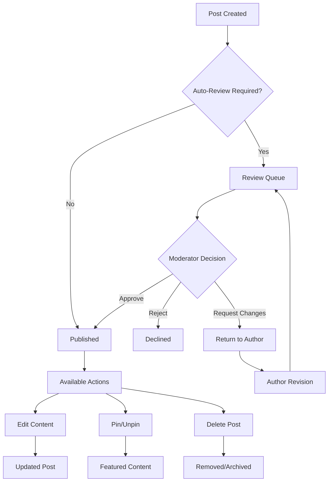

# Post Moderation

Comprehensive moderation tools for maintaining content quality and community standards. Handle post lifecycle management, implement review workflows, and provide administrative controls.

<CardGroup cols={2}>
  <Card title="Edit Posts" icon="edit" href="edit-post">
    Update post content, metadata, and settings after publication
  </Card>
  <Card title="Delete Posts" icon="trash" href="delete-post">
    Remove posts with proper cleanup and user notifications
  </Card>
  <Card title="Review Workflow" icon="clipboard-check" href="post-review">
    Implement approval processes for content quality control
  </Card>
  <Card title="Pin Posts" icon="thumbtack" href="pin-post">
    Highlight important posts by pinning them to communities
  </Card>
</CardGroup>

## Moderation Workflow

## Key Features

<AccordionGroup>
  <Accordion title="Content Management">
    - **Post Editing**: Modify content, tags, and metadata after publication
    - **Bulk Operations**: Manage multiple posts simultaneously
    - **Version History**: Track changes and maintain edit history
    - **Rollback**: Restore previous versions of edited posts
  </Accordion>
  
  <Accordion title="Review System">
    - **Approval Workflows**: Configure multi-stage review processes
    - **Auto-Moderation**: AI-powered content screening and flagging
    - **Manual Review**: Human moderator approval for sensitive content
    - **Appeal Process**: Allow users to contest moderation decisions
  </Accordion>
  
  <Accordion title="Administrative Controls">
    - **Soft Deletion**: Hide posts without permanent removal
    - **Hard Deletion**: Completely remove posts and associated data
    - **Content Pinning**: Feature important posts in communities
    - **Batch Actions**: Efficient handling of multiple moderation tasks
  </Accordion>
</AccordionGroup>

## Moderation Roles

<AccordionGroup>
  <Accordion title="Community Moderators">
    - **Local Authority**: Moderate content within specific communities
    - **Member Management**: Handle user reports and community guidelines
    - **Content Curation**: Pin important posts and organize discussions
    - **Escalation**: Report severe violations to platform administrators
  </Accordion>
  
  <Accordion title="Platform Administrators">
    - **Global Oversight**: Moderate content across all communities
    - **Policy Enforcement**: Implement platform-wide content policies
    - **System Configuration**: Set up automated moderation rules
    - **Appeals Handling**: Review and process moderation appeals
  </Accordion>
  
  <Accordion title="Content Authors">
    - **Self-Moderation**: Edit and manage their own posts
    - **Response to Reviews**: Address moderator feedback and requests
    - **Compliance**: Follow community guidelines and platform policies
    - **Appeal Rights**: Contest unfair moderation decisions
  </Accordion>
</AccordionGroup>

## Best Practices

<AccordionGroup>
  <Accordion title="Review Efficiency">
    - Set clear review criteria and guidelines
    - Use automated tools to pre-filter content
    - Prioritize reviews based on community impact
    - Provide timely feedback to content creators
  </Accordion>
  
  <Accordion title="Fair Moderation">
    - Apply rules consistently across all users
    - Provide clear explanations for moderation actions
    - Offer appeal processes for contested decisions
    - Maintain transparency in moderation policies
  </Accordion>
  
  <Accordion title="Community Guidelines">
    - Establish clear, easy-to-understand rules
    - Regularly communicate policy updates
    - Provide examples of acceptable content
    - Foster self-moderation within communities
  </Accordion>
</AccordionGroup>

## Common Use Cases

<CardGroup cols={3}>
  <Card title="Quality Control" icon="shield-check">
    Ensure high-quality content meets community standards
  </Card>
  <Card title="Safety Management" icon="exclamation-shield">
    Remove harmful or inappropriate content quickly
  </Card>
  <Card title="Community Curation" icon="star">
    Highlight valuable content through pinning and featuring
  </Card>
</CardGroup>

## Related Topics

<CardGroup cols={3}>
  <Card title="Post Creation" href="../creation/overview" icon="plus">
    Understand how posts are created and submitted
  </Card>
  <Card title="Post Analytics" href="../analytics/overview" icon="chart-bar">
    Monitor content performance and moderation metrics
  </Card>
  <Card title="Community Management" href="../../communities/overview" icon="users">
    Learn about broader community moderation tools
  </Card>
</CardGroup>
