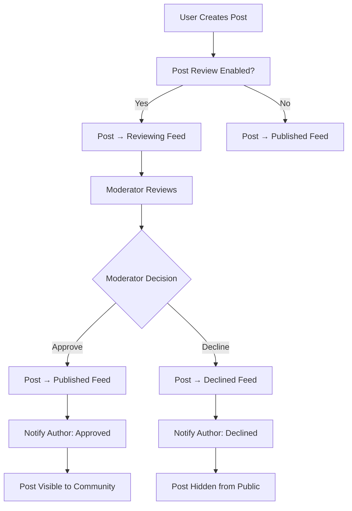

# Post Review & Moderation

The post review system provides comprehensive content moderation capabilities, allowing community moderators to review, approve, or decline posts before they appear in public feeds. This ensures high-quality content and maintains community standards through structured approval workflows.

<Info>
Post review is a community-level setting that must be enabled by community administrators. Once enabled, all posts require approval before becoming visible to community members.
</Info>

## Architecture Overview



## Feed Types

Posts in communities with review enabled can exist in three different feed states:

| Feed Type | Description | Visibility | Who Can Access |
|-----------|-------------|------------|----------------|
| `reviewing` | Posts awaiting moderation approval | Moderators + Post Author | Users with `REVIEW_COMMUNITY_POST` permission |
| `published` | Approved posts visible to community | All Community Members | Everyone in the community |
| `declined` | Rejected posts hidden from public view | Post Author Only | Original post author |

<Tabs>
  <Tab title="iOS">
    <CodeGroup>
```swift
// Feed type enumeration
enum AmityPostFeedType {
    case reviewing
    case published 
    case declined
}

// Check post feed type
func checkPostFeedType(post: AmityPost) {
    switch post.feedType {
    case .reviewing:
        print("Post is under review")
        showReviewingBadge()
    case .published:
        print("Post is published and visible")
        showPublishedContent()
    case .declined:
        print("Post was declined")
        showDeclinedNotice()
    }
}

// Filter posts by feed type
func filterPostsByFeedType(posts: [AmityPost], feedType: AmityPostFeedType) -> [AmityPost] {
    return posts.filter { $0.feedType == feedType }
}
```
    </CodeGroup>
  </Tab>
  <Tab title="Android">
    <CodeGroup>
```kotlin
// Feed type enumeration
enum class AmityPostFeedType {
    REVIEWING,
    PUBLISHED,
    DECLINED
}

// Check post feed type
fun checkPostFeedType(post: AmityPost) {
    when (post.feedType) {
        AmityPostFeedType.REVIEWING -> {
            println("Post is under review")
            showReviewingBadge()
        }
        AmityPostFeedType.PUBLISHED -> {
            println("Post is published and visible")
            showPublishedContent()
        }
        AmityPostFeedType.DECLINED -> {
            println("Post was declined")
            showDeclinedNotice()
        }
    }
}

// Filter posts by feed type
fun filterPostsByFeedType(posts: List<AmityPost>, feedType: AmityPostFeedType): List<AmityPost> {
    return posts.filter { it.feedType == feedType }
}
```
    </CodeGroup>
  </Tab>
  <Tab title="TypeScript">
    <CodeGroup>
```typescript
// Feed type enumeration
enum PostFeedType {
  REVIEWING = 'reviewing',
  PUBLISHED = 'published',
  DECLINED = 'declined'
}

// Check post feed type
function checkPostFeedType(post: AmityPost): void {
  switch (post.feedType) {
    case PostFeedType.REVIEWING:
      console.log('Post is under review');
      showReviewingBadge();
      break;
    case PostFeedType.PUBLISHED:
      console.log('Post is published and visible');
      showPublishedContent();
      break;
    case PostFeedType.DECLINED:
      console.log('Post was declined');
      showDeclinedNotice();
      break;
  }
}

// Filter posts by feed type
function filterPostsByFeedType(posts: AmityPost[], feedType: PostFeedType): AmityPost[] {
  return posts.filter(post => post.feedType === feedType);
}

// Type guard for feed type checking
function isPostUnderReview(post: AmityPost): boolean {
  return post.feedType === PostFeedType.REVIEWING;
}
```
    </CodeGroup>
  </Tab>
  <Tab title="Flutter">
    <CodeGroup>
```dart
// Feed type enumeration
enum AmityPostFeedType {
  reviewing,
  published,
  declined,
}

// Check post feed type
void checkPostFeedType(AmityPost post) {
  switch (post.feedType) {
    case AmityPostFeedType.reviewing:
      print('Post is under review');
      showReviewingBadge();
      break;
    case AmityPostFeedType.published:
      print('Post is published and visible');
      showPublishedContent();
      break;
    case AmityPostFeedType.declined:
      print('Post was declined');
      showDeclinedNotice();
      break;
  }
}

// Filter posts by feed type
List<AmityPost> filterPostsByFeedType(
  List<AmityPost> posts, 
  AmityPostFeedType feedType,
) {
  return posts.where((post) => post.feedType == feedType).toList();
}

// Extension for easier feed type checking
extension PostFeedTypeExtension on AmityPost {
  bool get isUnderReview => feedType == AmityPostFeedType.reviewing;
  bool get isPublished => feedType == AmityPostFeedType.published;
  bool get isDeclined => feedType == AmityPostFeedType.declined;
}
```
    </CodeGroup>
  </Tab>
</Tabs>

## Get Post Feed Type

Retrieve the current feed type of a post to determine its moderation status and display appropriate UI elements.

<Tabs>
  <Tab title="iOS">
    <CodeGroup>
```swift
// Get feed type from post
func getPostFeedType(post: AmityPost) -> AmityPostFeedType {
    return post.feedType
}

// Advanced: Post status checker with UI updates
class PostStatusChecker {
    func checkAndUpdatePostStatus(post: AmityPost, in cell: PostTableViewCell) {
        let feedType = post.feedType
        
        switch feedType {
        case .reviewing:
            cell.statusLabel.text = "Under Review"
            cell.statusLabel.backgroundColor = .systemOrange
            cell.isUserInteractionEnabled = false
            
        case .published:
            cell.statusLabel.text = "Published"
            cell.statusLabel.backgroundColor = .systemGreen
            cell.isUserInteractionEnabled = true
            
        case .declined:
            cell.statusLabel.text = "Declined"
            cell.statusLabel.backgroundColor = .systemRed
            cell.showDeclineReason()
            
        @unknown default:
            cell.statusLabel.text = "Unknown"
            cell.statusLabel.backgroundColor = .systemGray
        }
    }
}

// Reactive feed type observation
func observePostFeedTypeChanges(postId: String) {
    let repository = AmityPostRepository(client: client)
    
    repository.getPost(postId).observe { [weak self] result in
        switch result {
        case .success(let post):
            self?.handleFeedTypeChange(post.feedType)
        case .failure(let error):
            print("Error observing post: \(error)")
        }
    }
}
```
    </CodeGroup>
  </Tab>
  <Tab title="Android">
    <CodeGroup>
```kotlin
// Get feed type from post
fun getPostFeedType(post: AmityPost): AmityPostFeedType {
    return post.feedType
}

// Advanced: Post status checker with UI updates
class PostStatusChecker {
    fun checkAndUpdatePostStatus(post: AmityPost, holder: PostViewHolder) {
        when (val feedType = post.feedType) {
            AmityPostFeedType.REVIEWING -> {
                holder.statusText.text = "Under Review"
                holder.statusText.setBackgroundColor(Color.ORANGE)
                holder.itemView.isEnabled = false
            }
            
            AmityPostFeedType.PUBLISHED -> {
                holder.statusText.text = "Published"
                holder.statusText.setBackgroundColor(Color.GREEN)
                holder.itemView.isEnabled = true
            }
            
            AmityPostFeedType.DECLINED -> {
                holder.statusText.text = "Declined"
                holder.statusText.setBackgroundColor(Color.RED)
                holder.showDeclineReason()
            }
        }
    }
}

// Reactive feed type observation
fun observePostFeedTypeChanges(postId: String): LiveData<AmityPostFeedType> {
    val repository = AmityPostRepository(client)
    
    return repository.getPost(postId)
        .build()
        .query()
        .map { it.feedType }
        .toLiveData()
}
```
    </CodeGroup>
  </Tab>
  <Tab title="TypeScript">
    <CodeGroup>
```typescript
// Get feed type from post
function getPostFeedType(post: AmityPost): PostFeedType {
  return post.feedType;
}

// Advanced: Post status manager with UI updates
class PostStatusManager {
  updatePostStatus(post: AmityPost, element: HTMLElement): void {
    const statusElement = element.querySelector('.post-status') as HTMLElement;
    const feedType = post.feedType;
    
    // Remove existing status classes
    statusElement.classList.remove('reviewing', 'published', 'declined');
    
    switch (feedType) {
      case PostFeedType.REVIEWING:
        statusElement.textContent = 'Under Review';
        statusElement.classList.add('reviewing');
        element.classList.add('disabled');
        break;
        
      case PostFeedType.PUBLISHED:
        statusElement.textContent = 'Published';
        statusElement.classList.add('published');
        element.classList.remove('disabled');
        break;
        
      case PostFeedType.DECLINED:
        statusElement.textContent = 'Declined';
        statusElement.classList.add('declined');
        this.showDeclineReason(element, post);
        break;
    }
  }
  
  private showDeclineReason(element: HTMLElement, post: AmityPost): void {
    const reasonElement = element.querySelector('.decline-reason');
    if (reasonElement && post.declineReason) {
      reasonElement.textContent = `Reason: ${post.declineReason}`;
      reasonElement.style.display = 'block';
    }
  }
}

// Reactive feed type observation
async function observePostFeedTypeChanges(
  postId: string,
  callback: (feedType: PostFeedType) => void
): Promise<() => void> {
  const repository = new AmityPostRepository(client);
  
  const unsubscribe = repository.getPost(postId).subscribe({
    next: (post) => {
      callback(post.feedType);
    },
    error: (error) => {
      console.error('Error observing post:', error);
    }
  });
  
  return unsubscribe;
}
```
    </CodeGroup>
  </Tab>
  <Tab title="Flutter">
    <CodeGroup>
```dart
// Get feed type from post
AmityPostFeedType getPostFeedType(AmityPost post) {
  return post.feedType;
}

// Advanced: Post status widget
class PostStatusWidget extends StatelessWidget {
  final AmityPost post;
  
  const PostStatusWidget({Key? key, required this.post}) : super(key: key);
  
  @override
  Widget build(BuildContext context) {
    return Container(
      padding: const EdgeInsets.symmetric(horizontal: 8, vertical: 4),
      decoration: BoxDecoration(
        color: _getStatusColor(),
        borderRadius: BorderRadius.circular(12),
      ),
      child: Text(
        _getStatusText(),
        style: const TextStyle(
          color: Colors.white,
          fontSize: 12,
          fontWeight: FontWeight.bold,
        ),
      ),
    );
  }
  
  Color _getStatusColor() {
    switch (post.feedType) {
      case AmityPostFeedType.reviewing:
        return Colors.orange;
      case AmityPostFeedType.published:
        return Colors.green;
      case AmityPostFeedType.declined:
        return Colors.red;
    }
  }
  
  String _getStatusText() {
    switch (post.feedType) {
      case AmityPostFeedType.reviewing:
        return 'Under Review';
      case AmityPostFeedType.published:
        return 'Published';
      case AmityPostFeedType.declined:
        return 'Declined';
    }
  }
}

// Reactive feed type stream
class PostFeedTypeNotifier extends ChangeNotifier {
  final AmityPostRepository _repository;
  AmityPostFeedType? _feedType;
  
  PostFeedTypeNotifier(this._repository);
  
  AmityPostFeedType? get feedType => _feedType;
  
  Stream<AmityPostFeedType> watchFeedType(String postId) {
    return _repository.getPost(postId).map((post) {
      _feedType = post.feedType;
      notifyListeners();
      return post.feedType;
    });
  }
}
```
    </CodeGroup>
  </Tab>
</Tabs>

## Post Approval & Decline

Moderators with the `REVIEW_COMMUNITY_POST` permission can approve or decline posts in the reviewing feed. This section covers both individual and batch moderation operations.

### Approve Posts

Approve posts to move them from the reviewing feed to the published feed, making them visible to all community members.

<Tabs>
  <Tab title="iOS">
    <CodeGroup>
```swift
// Single post approval
func approvePost(postId: String) async throws {
    let repository = AmityPostRepository(client: client)
    
    do {
        let result = try await repository.approvePost(postId: postId)
        print("Post approved successfully")
        
        // Show success notification
        showSuccessNotification("Post approved and published")
        
        // Update UI
        updatePostStatus(postId: postId, status: .published)
        
    } catch {
        print("Failed to approve post: \(error)")
        throw error
    }
}

// Batch post approval
func approvePosts(postIds: [String]) async throws {
    let repository = AmityPostRepository(client: client)
    var approvedCount = 0
    var failedApprovals: [String] = []
    
    for postId in postIds {
        do {
            try await repository.approvePost(postId: postId)
            approvedCount += 1
        } catch {
            failedApprovals.append(postId)
            print("Failed to approve post \(postId): \(error)")
        }
    }
    
    // Show batch results
    let message = "\(approvedCount) posts approved"
    if !failedApprovals.isEmpty {
        message += ", \(failedApprovals.count) failed"
    }
    showBatchResultNotification(message)
}

// Approve with confirmation dialog
func approvePostWithConfirmation(postId: String, from viewController: UIViewController) {
    let alert = UIAlertController(
        title: "Approve Post",
        message: "This post will be published and visible to all community members.",
        preferredStyle: .alert
    )
    
    alert.addAction(UIAlertAction(title: "Approve", style: .default) { _ in
        Task {
            try await self.approvePost(postId: postId)
        }
    })
    
    alert.addAction(UIAlertAction(title: "Cancel", style: .cancel))
    viewController.present(alert, animated: true)
}
```
    </CodeGroup>
  </Tab>
  <Tab title="Android">
    <CodeGroup>
```kotlin
// Single post approval
suspend fun approvePost(postId: String) {
    val repository = AmityPostRepository(client)
    
    try {
        repository.approvePost(postId).await()
        println("Post approved successfully")
        
        // Show success notification
        showSuccessNotification("Post approved and published")
        
        // Update UI
        updatePostStatus(postId, AmityPostFeedType.PUBLISHED)
        
    } catch (e: Exception) {
        println("Failed to approve post: ${e.message}")
        throw e
    }
}

// Batch post approval
suspend fun approvePosts(postIds: List<String>) {
    val repository = AmityPostRepository(client)
    var approvedCount = 0
    val failedApprovals = mutableListOf<String>()
    
    postIds.forEach { postId ->
        try {
            repository.approvePost(postId).await()
            approvedCount++
        } catch (e: Exception) {
            failedApprovals.add(postId)
            println("Failed to approve post $postId: ${e.message}")
        }
    }
    
    // Show batch results
    val message = "$approvedCount posts approved" + 
        if (failedApprovals.isNotEmpty()) ", ${failedApprovals.size} failed" else ""
    showBatchResultNotification(message)
}

// Approve with confirmation dialog
fun approvePostWithConfirmation(postId: String, context: Context) {
    AlertDialog.Builder(context)
        .setTitle("Approve Post")
        .setMessage("This post will be published and visible to all community members.")
        .setPositiveButton("Approve") { _, _ ->
            lifecycleScope.launch {
                approvePost(postId)
            }
        }
        .setNegativeButton("Cancel", null)
        .show()
}
```
    </CodeGroup>
  </Tab>
  <Tab title="TypeScript">
    <CodeGroup>
```typescript
// Single post approval
async function approvePost(postId: string): Promise<void> {
  try {
    const repository = new AmityPostRepository(client);
    await repository.approvePost(postId);
    
    console.log('Post approved successfully');
    
    // Show success notification
    showSuccessNotification('Post approved and published');
    
    // Update UI
    updatePostStatus(postId, PostFeedType.PUBLISHED);
    
  } catch (error) {
    console.error('Failed to approve post:', error);
    throw error;
  }
}

// Batch post approval
async function approvePosts(postIds: string[]): Promise<BatchResult> {
  const repository = new AmityPostRepository(client);
  const results: BatchResult = {
    successful: [],
    failed: []
  };
  
  // Process approvals in parallel with concurrency limit
  const concurrencyLimit = 5;
  const chunks = chunkArray(postIds, concurrencyLimit);
  
  for (const chunk of chunks) {
    const promises = chunk.map(async (postId) => {
      try {
        await repository.approvePost(postId);
        results.successful.push(postId);
      } catch (error) {
        results.failed.push({ postId, error: error.message });
        console.error(`Failed to approve post ${postId}:`, error);
      }
    });
    
    await Promise.all(promises);
  }
  
  // Show batch results
  const message = `${results.successful.length} posts approved` +
    (results.failed.length > 0 ? `, ${results.failed.length} failed` : '');
  showBatchResultNotification(message);
  
  return results;
}

// Approve with confirmation dialog
function approvePostWithConfirmation(postId: string): Promise<boolean> {
  return new Promise((resolve) => {
    const modal = document.createElement('div');
    modal.className = 'confirmation-modal';
    modal.innerHTML = `
      <div class="modal-content">
        <h3>Approve Post</h3>
        <p>This post will be published and visible to all community members.</p>
        <div class="modal-actions">
          <button class="btn-approve">Approve</button>
          <button class="btn-cancel">Cancel</button>
        </div>
      </div>
    `;
    
    modal.querySelector('.btn-approve')?.addEventListener('click', async () => {
      try {
        await approvePost(postId);
        resolve(true);
      } catch (error) {
        resolve(false);
      } finally {
        document.body.removeChild(modal);
      }
    });
    
    modal.querySelector('.btn-cancel')?.addEventListener('click', () => {
      document.body.removeChild(modal);
      resolve(false);
    });
    
    document.body.appendChild(modal);
  });
}
```
    </CodeGroup>
  </Tab>
  <Tab title="Flutter">
    <CodeGroup>
```dart
// Single post approval
Future<void> approvePost(String postId) async {
  try {
    final repository = AmityPostRepository(client);
    await repository.approvePost(postId);
    
    print('Post approved successfully');
    
    // Show success notification
    _showSuccessNotification('Post approved and published');
    
    // Update UI
    _updatePostStatus(postId, AmityPostFeedType.published);
    
  } catch (error) {
    print('Failed to approve post: $error');
    rethrow;
  }
}

// Batch post approval
Future<BatchResult> approvePosts(List<String> postIds) async {
  final repository = AmityPostRepository(client);
  final results = BatchResult();
  
  // Process approvals with progress tracking
  for (int i = 0; i < postIds.length; i++) {
    final postId = postIds[i];
    try {
      await repository.approvePost(postId);
      results.successful.add(postId);
    } catch (error) {
      results.failed.add(BatchError(postId: postId, error: error.toString()));
      print('Failed to approve post $postId: $error');
    }
    
    // Update progress
    _updateBatchProgress(i + 1, postIds.length);
  }
  
  // Show batch results
  final message = '${results.successful.length} posts approved' +
      (results.failed.isNotEmpty ? ', ${results.failed.length} failed' : '');
  _showBatchResultNotification(message);
  
  return results;
}

// Approve with confirmation dialog
Future<bool> approvePostWithConfirmation(
  BuildContext context, 
  String postId,
) async {
  return await showDialog<bool>(
    context: context,
    builder: (context) => AlertDialog(
      title: const Text('Approve Post'),
      content: const Text(
        'This post will be published and visible to all community members.'
      ),
      actions: [
        TextButton(
          onPressed: () => Navigator.of(context).pop(false),
          child: const Text('Cancel'),
        ),
        ElevatedButton(
          onPressed: () async {
            try {
              await approvePost(postId);
              Navigator.of(context).pop(true);
            } catch (error) {
              Navigator.of(context).pop(false);
              _showErrorNotification('Failed to approve post');
            }
          },
          child: const Text('Approve'),
        ),
      ],
    ),
  ) ?? false;
}
```
    </CodeGroup>
  </Tab>
</Tabs>

### Decline Posts

Decline posts to move them from the reviewing feed to the declined feed, hiding them from public view.

<Tabs>
  <Tab title="iOS">
    <CodeGroup>
```swift
// Single post decline
func declinePost(postId: String, reason: String? = nil) async throws {
    let repository = AmityPostRepository(client: client)
    
    do {
        let result = try await repository.declinePost(
            postId: postId,
            reason: reason
        )
        print("Post declined successfully")
        
        // Show success notification
        showSuccessNotification("Post declined and hidden")
        
        // Update UI
        updatePostStatus(postId: postId, status: .declined)
        
    } catch {
        print("Failed to decline post: \(error)")
        throw error
    }
}

// Decline with reason dialog
func declinePostWithReason(postId: String, from viewController: UIViewController) {
    let alert = UIAlertController(
        title: "Decline Post",
        message: "Please provide a reason for declining this post:",
        preferredStyle: .alert
    )
    
    alert.addTextField { textField in
        textField.placeholder = "Reason (optional)"
        textField.autocapitalizationType = .sentences
    }
    
    alert.addAction(UIAlertAction(title: "Decline", style: .destructive) { _ in
        let reason = alert.textFields?.first?.text
        Task {
            try await self.declinePost(postId: postId, reason: reason)
        }
    })
    
    alert.addAction(UIAlertAction(title: "Cancel", style: .cancel))
    viewController.present(alert, animated: true)
}
```
    </CodeGroup>
  </Tab>
  <Tab title="Android">
    <CodeGroup>
```kotlin
// Single post decline
suspend fun declinePost(postId: String, reason: String? = null) {
    val repository = AmityPostRepository(client)
    
    try {
        repository.declinePost(postId, reason).await()
        println("Post declined successfully")
        
        // Show success notification
        showSuccessNotification("Post declined and hidden")
        
        // Update UI
        updatePostStatus(postId, AmityPostFeedType.DECLINED)
        
    } catch (e: Exception) {
        println("Failed to decline post: ${e.message}")
        throw e
    }
}

// Decline with reason dialog
fun declinePostWithReason(postId: String, context: Context) {
    val input = EditText(context).apply {
        hint = "Reason (optional)"
        inputType = InputType.TYPE_CLASS_TEXT or InputType.TYPE_TEXT_FLAG_CAP_SENTENCES
    }
    
    AlertDialog.Builder(context)
        .setTitle("Decline Post")
        .setMessage("Please provide a reason for declining this post:")
        .setView(input)
        .setPositiveButton("Decline") { _, _ ->
            val reason = input.text.toString().takeIf { it.isNotBlank() }
            lifecycleScope.launch {
                declinePost(postId, reason)
            }
        }
        .setNegativeButton("Cancel", null)
        .show()
}
```
    </CodeGroup>
  </Tab>
  <Tab title="TypeScript">
    <CodeGroup>
```typescript
// Single post decline
async function declinePost(postId: string, reason?: string): Promise<void> {
  try {
    const repository = new AmityPostRepository(client);
    await repository.declinePost(postId, reason);
    
    console.log('Post declined successfully');
    
    // Show success notification
    showSuccessNotification('Post declined and hidden');
    
    // Update UI
    updatePostStatus(postId, PostFeedType.DECLINED);
    
  } catch (error) {
    console.error('Failed to decline post:', error);
    throw error;
  }
}

// Decline with reason dialog
function declinePostWithReason(postId: string): Promise<boolean> {
  return new Promise((resolve) => {
    const modal = document.createElement('div');
    modal.className = 'confirmation-modal';
    modal.innerHTML = `
      <div class="modal-content">
        <h3>Decline Post</h3>
        <p>Please provide a reason for declining this post:</p>
        <textarea 
          class="reason-input" 
          placeholder="Reason (optional)"
          rows="3"
        ></textarea>
        <div class="modal-actions">
          <button class="btn-decline">Decline</button>
          <button class="btn-cancel">Cancel</button>
        </div>
      </div>
    `;
    
    const reasonInput = modal.querySelector('.reason-input') as HTMLTextAreaElement;
    
    modal.querySelector('.btn-decline')?.addEventListener('click', async () => {
      try {
        const reason = reasonInput.value.trim() || undefined;
        await declinePost(postId, reason);
        resolve(true);
      } catch (error) {
        resolve(false);
      } finally {
        document.body.removeChild(modal);
      }
    });
    
    modal.querySelector('.btn-cancel')?.addEventListener('click', () => {
      document.body.removeChild(modal);
      resolve(false);
    });
    
    document.body.appendChild(modal);
  });
}
```
    </CodeGroup>
  </Tab>
  <Tab title="Flutter">
    <CodeGroup>
```dart
// Single post decline
Future<void> declinePost(String postId, {String? reason}) async {
  try {
    final repository = AmityPostRepository(client);
    await repository.declinePost(postId, reason: reason);
    
    print('Post declined successfully');
    
    // Show success notification
    _showSuccessNotification('Post declined and hidden');
    
    // Update UI
    _updatePostStatus(postId, AmityPostFeedType.declined);
    
  } catch (error) {
    print('Failed to decline post: $error');
    rethrow;
  }
}

// Decline with reason dialog
Future<bool> declinePostWithReason(
  BuildContext context, 
  String postId,
) async {
  final reasonController = TextEditingController();
  
  return await showDialog<bool>(
    context: context,
    builder: (context) => AlertDialog(
      title: const Text('Decline Post'),
      content: Column(
        mainAxisSize: MainAxisSize.min,
        children: [
          const Text('Please provide a reason for declining this post:'),
          const SizedBox(height: 16),
          TextField(
            controller: reasonController,
            decoration: const InputDecoration(
              hintText: 'Reason (optional)',
              border: OutlineInputBorder(),
            ),
            maxLines: 3,
            textCapitalization: TextCapitalization.sentences,
          ),
        ],
      ),
      actions: [
        TextButton(
          onPressed: () => Navigator.of(context).pop(false),
          child: const Text('Cancel'),
        ),
        ElevatedButton(
          style: ElevatedButton.styleFrom(backgroundColor: Colors.red),
          onPressed: () async {
            try {
              final reason = reasonController.text.trim();
              await declinePost(
                postId, 
                reason: reason.isEmpty ? null : reason,
              );
              Navigator.of(context).pop(true);
            } catch (error) {
              Navigator.of(context).pop(false);
              _showErrorNotification('Failed to decline post');
            }
          },
          child: const Text('Decline'),
        ),
      ],
    ),
  ) ?? false;
}
```
    </CodeGroup>
  </Tab>
</Tabs>

## Query Community Posts by Feed Type

Retrieve posts from different feeds based on user permissions and feed type requirements.

### Permission Matrix

| User Role | Can View Reviewing | Can View Published | Can View Declined |
|-----------|-------------------|-------------------|-------------------|
| Community Member | Own posts only | All posts | Own posts only |
| Moderator | All posts | All posts | All posts |
| Community Owner | All posts | All posts | All posts |

<Tabs>
  <Tab title="iOS">
    <CodeGroup>
```swift
// Query posts by feed type
func queryPostsByFeedType(
    communityId: String,
    feedType: AmityPostFeedType,
    limit: Int = 20
) async throws -> [AmityPost] {
    let repository = AmityPostRepository(client: client)
    
    let query = repository.getPosts()
        .communityId(communityId)
        .feedType(feedType)
        .limit(limit)
    
    let collection = query.build()
    
    return try await withCheckedThrowingContinuation { continuation in
        collection.query { result in
            switch result {
            case .success(let posts):
                continuation.resume(returning: posts.object)
            case .failure(let error):
                continuation.resume(throwing: error)
            }
        }
    }
}

// Advanced: Paginated query with real-time updates
class PostModerationManager: ObservableObject {
    @Published var reviewingPosts: [AmityPost] = []
    @Published var publishedPosts: [AmityPost] = []
    @Published var declinedPosts: [AmityPost] = []
    
    private let repository: AmityPostRepository
    private var collections: [AmityCollection<AmityPost>] = []
    
    init(client: AmityClient) {
        self.repository = AmityPostRepository(client: client)
    }
    
    func observeAllFeeds(communityId: String) {
        // Observe reviewing posts
        observeFeed(communityId: communityId, feedType: .reviewing) { [weak self] posts in
            self?.reviewingPosts = posts
        }
        
        // Observe published posts
        observeFeed(communityId: communityId, feedType: .published) { [weak self] posts in
            self?.publishedPosts = posts
        }
        
        // Observe declined posts (if user has permission)
        observeFeed(communityId: communityId, feedType: .declined) { [weak self] posts in
            self?.declinedPosts = posts
        }
    }
    
    private func observeFeed(
        communityId: String,
        feedType: AmityPostFeedType,
        completion: @escaping ([AmityPost]) -> Void
    ) {
        let collection = repository.getPosts()
            .communityId(communityId)
            .feedType(feedType)
            .build()
        
        collections.append(collection)
        
        collection.observe { result in
            switch result {
            case .success(let posts):
                completion(posts.object)
            case .failure(let error):
                print("Error observing \(feedType) feed: \(error)")
            }
        }
    }
}
```
    </CodeGroup>
  </Tab>
  <Tab title="Android">
    <CodeGroup>
```kotlin
// Query posts by feed type
suspend fun queryPostsByFeedType(
    communityId: String,
    feedType: AmityPostFeedType,
    limit: Int = 20
): List<AmityPost> {
    val repository = AmityPostRepository(client)
    
    return repository.getPosts()
        .communityId(communityId)
        .feedType(feedType)
        .limit(limit)
        .build()
        .query()
        .firstOrError()
        .await()
        .snapshot()
}

// Advanced: Reactive moderation manager
class PostModerationManager {
    private val repository = AmityPostRepository(client)
    
    fun observeAllFeeds(communityId: String): Observable<ModerationFeedData> {
        return Observable.combineLatest(
            observeFeed(communityId, AmityPostFeedType.REVIEWING),
            observeFeed(communityId, AmityPostFeedType.PUBLISHED),
            observeFeed(communityId, AmityPostFeedType.DECLINED)
        ) { reviewing, published, declined ->
            ModerationFeedData(
                reviewingPosts = reviewing,
                publishedPosts = published,
                declinedPosts = declined
            )
        }
    }
    
    private fun observeFeed(
        communityId: String,
        feedType: AmityPostFeedType
    ): Observable<List<AmityPost>> {
        return repository.getPosts()
            .communityId(communityId)
            .feedType(feedType)
            .build()
            .query()
            .map { it.snapshot() }
            .distinctUntilChanged()
    }
    
    fun searchPostsInFeed(
        communityId: String,
        feedType: AmityPostFeedType,
        searchTerm: String
    ): Observable<List<AmityPost>> {
        return observeFeed(communityId, feedType)
            .map { posts ->
                posts.filter { post ->
                    post.data?.text?.contains(searchTerm, ignoreCase = true) == true ||
                    post.user?.displayName?.contains(searchTerm, ignoreCase = true) == true
                }
            }
    }
}
```
    </CodeGroup>
  </Tab>
  <Tab title="TypeScript">
    <CodeGroup>
```typescript
// Query posts by feed type
async function queryPostsByFeedType(
  communityId: string,
  feedType: PostFeedType,
  options: QueryOptions = {}
): Promise<AmityPost[]> {
  const repository = new AmityPostRepository(client);
  
  const query = repository.getPosts({
    communityId,
    feedType,
    limit: options.limit || 20,
    sortBy: options.sortBy || 'createdAt',
    sortDirection: options.sortDirection || 'desc'
  });
  
  const { data: posts } = await query.query();
  return posts;
}

// Advanced: Reactive moderation manager
class PostModerationManager extends EventEmitter {
  private repository: AmityPostRepository;
  private feedSubscriptions: Map<string, () => void> = new Map();
  
  constructor(client: AmityClient) {
    super();
    this.repository = new AmityPostRepository(client);
  }
  
  observeAllFeeds(communityId: string): void {
    // Subscribe to all feed types
    Object.values(PostFeedType).forEach(feedType => {
      this.observeFeed(communityId, feedType);
    });
  }
  
  private observeFeed(communityId: string, feedType: PostFeedType): void {
    const subscriptionKey = `${communityId}_${feedType}`;
    
    // Unsubscribe existing subscription
    this.feedSubscriptions.get(subscriptionKey)?.();
    
    const query = this.repository.getPosts({
      communityId,
      feedType
    });
    
    const unsubscribe = query.subscribe({
      next: (posts) => {
        this.emit('feed-updated', { feedType, posts });
      },
      error: (error) => {
        this.emit('feed-error', { feedType, error });
      }
    });
    
    this.feedSubscriptions.set(subscriptionKey, unsubscribe);
  }
  
  async searchPostsInFeed(
    communityId: string,
    feedType: PostFeedType,
    searchTerm: string
  ): Promise<AmityPost[]> {
    const posts = await this.queryPostsByFeedType(communityId, feedType);
    
    return posts.filter(post => {
      const textMatch = post.data?.text?.toLowerCase().includes(searchTerm.toLowerCase());
      const authorMatch = post.user?.displayName?.toLowerCase().includes(searchTerm.toLowerCase());
      return textMatch || authorMatch;
    });
  }
  
  cleanup(): void {
    this.feedSubscriptions.forEach(unsubscribe => unsubscribe());
    this.feedSubscriptions.clear();
  }
}
```
    </CodeGroup>
  </Tab>
  <Tab title="Flutter">
    <CodeGroup>
```dart
// Query posts by feed type
Future<List<AmityPost>> queryPostsByFeedType(
  String communityId,
  AmityPostFeedType feedType, {
  int limit = 20,
}) async {
  final repository = AmityPostRepository(client);
  
  final query = repository.getPosts()
    ..communityId(communityId)
    ..feedType(feedType)
    ..limit(limit);
    
  final pagedList = await query.build().query();
  return pagedList.snapshot();
}

// Advanced: Reactive moderation provider
class PostModerationProvider extends ChangeNotifier {
  final AmityPostRepository _repository;
  
  List<AmityPost> _reviewingPosts = [];
  List<AmityPost> _publishedPosts = [];
  List<AmityPost> _declinedPosts = [];
  
  bool _isLoading = false;
  String? _error;
  
  PostModerationProvider(AmityClient client) 
      : _repository = AmityPostRepository(client);
  
  // Getters
  List<AmityPost> get reviewingPosts => _reviewingPosts;
  List<AmityPost> get publishedPosts => _publishedPosts;
  List<AmityPost> get declinedPosts => _declinedPosts;
  bool get isLoading => _isLoading;
  String? get error => _error;
  
  // Observe all feeds with real-time updates
  void observeAllFeeds(String communityId) {
    _observeFeed(communityId, AmityPostFeedType.reviewing, (posts) {
      _reviewingPosts = posts;
      notifyListeners();
    });
    
    _observeFeed(communityId, AmityPostFeedType.published, (posts) {
      _publishedPosts = posts;
      notifyListeners();
    });
    
    _observeFeed(communityId, AmityPostFeedType.declined, (posts) {
      _declinedPosts = posts;
      notifyListeners();
    });
  }
  
  void _observeFeed(
    String communityId,
    AmityPostFeedType feedType,
    Function(List<AmityPost>) onUpdate,
  ) {
    final query = _repository.getPosts()
      ..communityId(communityId)
      ..feedType(feedType);
      
    query.build().query().listen(
      (pagedList) {
        onUpdate(pagedList.snapshot());
      },
      onError: (error) {
        _error = error.toString();
        notifyListeners();
      },
    );
  }
  
  // Search posts in specific feed
  List<AmityPost> searchPostsInFeed(
    AmityPostFeedType feedType,
    String searchTerm,
  ) {
    final posts = _getPostsByFeedType(feedType);
    final lowerSearchTerm = searchTerm.toLowerCase();
    
    return posts.where((post) {
      final textMatch = post.data?.text?.toLowerCase().contains(lowerSearchTerm) ?? false;
      final authorMatch = post.user?.displayName?.toLowerCase().contains(lowerSearchTerm) ?? false;
      return textMatch || authorMatch;
    }).toList();
  }
  
  List<AmityPost> _getPostsByFeedType(AmityPostFeedType feedType) {
    switch (feedType) {
      case AmityPostFeedType.reviewing:
        return _reviewingPosts;
      case AmityPostFeedType.published:
        return _publishedPosts;
      case AmityPostFeedType.declined:
        return _declinedPosts;
    }
  }
}

// Widget for moderation dashboard
class ModerationDashboard extends StatelessWidget {
  final String communityId;
  final PostModerationProvider provider;
  
  const ModerationDashboard({
    Key? key,
    required this.communityId,
    required this.provider,
  }) : super(key: key);
  
  @override
  Widget build(BuildContext context) {
    return ChangeNotifierProvider.value(
      value: provider..observeAllFeeds(communityId),
      child: Consumer<PostModerationProvider>(
        builder: (context, provider, child) {
          return DefaultTabController(
            length: 3,
            child: Column(
              children: [
                TabBar(
                  tabs: [
                    Tab(text: 'Reviewing (${provider.reviewingPosts.length})'),
                    Tab(text: 'Published (${provider.publishedPosts.length})'),
                    Tab(text: 'Declined (${provider.declinedPosts.length})'),
                  ],
                ),
                Expanded(
                  child: TabBarView(
                    children: [
                      PostFeedView(posts: provider.reviewingPosts),
                      PostFeedView(posts: provider.publishedPosts),
                      PostFeedView(posts: provider.declinedPosts),
                    ],
                  ),
                ),
              ],
            ),
          );
        },
      ),
    );
  }
}
```
    </CodeGroup>
  </Tab>
</Tabs>

## Best Practices

<AccordionGroup>
  <Accordion title="Moderation Workflow Optimization">
    - **Batch Operations**: Process multiple posts simultaneously to improve efficiency
    - **Keyboard Shortcuts**: Implement shortcuts for quick approve/decline actions
    - **Auto-refresh**: Keep moderation queues updated with real-time data
    - **Priority Sorting**: Sort posts by creation time, user reputation, or content type
  </Accordion>

  <Accordion title="User Experience">
    - **Clear Status Indicators**: Use visual cues to show post review status
    - **Confirmation Dialogs**: Require confirmation for destructive actions
    - **Reason Collection**: Allow moderators to provide decline reasons
    - **Notification System**: Keep authors informed about post status changes
  </Accordion>

  <Accordion title="Performance Considerations">
    - **Pagination**: Load posts in smaller batches to improve performance  
    - **Caching**: Cache recently reviewed posts to reduce API calls
    - **Background Processing**: Handle approval/decline operations asynchronously
    - **Optimistic Updates**: Update UI immediately, rollback on failure
  </Accordion>

  <Accordion title="Security & Permissions">
    - **Permission Validation**: Always verify moderation permissions before operations
    - **Audit Logging**: Track all moderation actions for accountability
    - **Rate Limiting**: Implement client-side rate limiting for bulk operations
    - **Error Recovery**: Handle network failures gracefully with retry mechanisms
  </Accordion>
</AccordionGroup>

## Error Handling

Common errors and solutions:

| Error | Cause | Solution |
|-------|-------|----------|
| `PERMISSION_DENIED` | User lacks moderation permissions | Check user role and community permissions |
| `POST_NOT_FOUND` | Post was deleted or doesn't exist | Validate post existence before operations |
| `INVALID_FEED_TYPE` | Incorrect feed type specified | Use valid feed type enums |
| `RATE_LIMIT_EXCEEDED` | Too many operations in short time | Implement rate limiting and retry logic |
| `NETWORK_ERROR` | Connection issues during operation | Implement retry with exponential backoff |

## Real-World Use Cases

<CardGroup cols={2}>
  <Card title="Community Moderation Dashboard" icon="shield-check">
    Build comprehensive dashboards for moderators to efficiently review and manage community content.
  </Card>
  
  <Card title="Automated Content Filtering" icon="filter">
    Implement pre-screening rules that automatically flag certain content types for review.
  </Card>
  
  <Card title="Escalation Workflows" icon="arrow-up">
    Create multi-level approval processes where complex content can be escalated to senior moderators.
  </Card>
  
  <Card title="Analytics & Reporting" icon="chart-bar">
    Track moderation metrics, response times, and content quality trends over time.
  </Card>
</CardGroup>