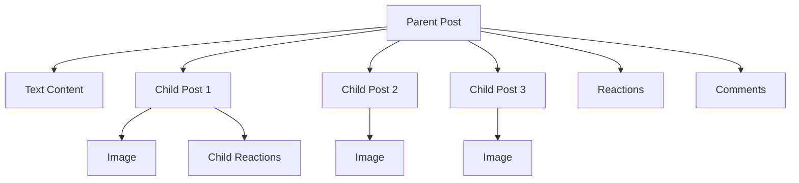

Posts are the foundation of content creation and sharing in social.plus. A post can include text, images, videos, files, polls, live streams, or custom content—enabling users to express themselves, share information, and connect with others in a network or community.

<CardGroup cols={2}>
  <Card title="Text Posts" icon="text-size" href="./creation/text-post">
    Simple text-based posts with formatting support
  </Card>
  <Card title="Image Posts" icon="image" href="./creation/image-post">
    Photo sharing with multiple image support and filters
  </Card>
  <Card title="Video Posts" icon="video" href="./creation/video-post">
    Video content with streaming and playback controls
  </Card>
  <Card title="Audio Posts" icon="file-audio" href="./creation/audio-post">
    Share audio files, podcasts, and voice messages
  </Card>
  <Card title="Clip Posts" icon="play" href="./creation/clip-post">
    Short-form video content up to 15 minutes
  </Card>
  <Card
    title="File Posts"
    icon="paperclip-vertical"
    href="./creation/file-post"
  >
    Document and file sharing capabilities
  </Card>
  <Card title="Poll Posts" icon="chart-bar" href="./creation/poll-post">
    Interactive polls and surveys for user engagement
  </Card>
  <Card
    title="Live Stream Posts"
    icon="circle-video"
    href="./creation/live-stream-post"
  >
    Real-time live streaming integration
  </Card>
  <Card title="Mixed Media Posts" icon="layer-group" href="./creation/mixed-media-post">
    Combine multiple media types in a single post
  </Card>
  <Card title="Custom Posts" icon="puzzle-piece" href="./creation/custom-post">
    Extend functionality with custom post types
  </Card>
</CardGroup>

<Info>
  Posts support real-time events and Live Object features. See [Live
  Objects/Collections](/social-plus-sdk/core-concepts/realtime-communication/live-objects-collections/overview)
  and [Realtime
  Events](/social-plus-sdk/core-concepts/realtime-communication/realtime-events/overview)
  for more.
</Info>

## Post Structure

Posts use a parent-child relationship:

- The parent post acts as a container (e.g., for text or metadata)
- Each image, video, or file is a separate child post
- Both parent and child posts support reactions and comments

Example: An image post with three images will have one parent post (text container) and three child posts (each with an image).



<Info>
  Users can interact (react, comment) with both parent and child posts, enabling
  rich engagement.
</Info>

## Post Structure Types

Every post has a `structureType` field that automatically classifies its content composition. This enables precise filtering and querying of posts based on their media content.

<AccordionGroup>
  <Accordion title="Pure Structure Types" icon="file">
    Posts containing a single type of content or attachment:
    
    | Structure Type | Description | Use Case |
    |----------------|-------------|----------|
    | `text` | Text-only content, no attachments | Announcements, discussions, status updates |
    | `image` | Only image attachments (1-10 images) | Photo galleries, visual content |
    | `video` | Only video attachments | Video tutorials, recordings |
    | `audio` | Only audio attachments | Podcasts, voice messages, audio content |
    | `file` | Only file attachments | Document sharing, PDFs, presentations |
    | `liveStream` | Live streaming content | Live broadcasts, real-time events |
    | `poll` | Poll/survey content | Voting, feedback collection |
    | `clip` | Short-form video content (up to 15 min) | Quick videos, highlights |
    
    **Example Query**: Get only photo posts (pure images)
    ```typescript
    const posts = await PostRepository.getPosts({
      dataTypes: ['image'],
      includeMixedStructure: false // Only pure image posts
    });
    ```
  </Accordion>
  
  <Accordion title="Mixed Structure Type" icon="layer-group">
    **Structure Type**: `mixed`
    
    Posts that combine multiple media types in a single post. A post is classified as `mixed` when it contains 2 or more distinct attachment types (image, video, audio, file).
    
    **Examples of Mixed Posts**:
    - Tutorial with images + instructional video
    - Product showcase with photos + demo video + spec sheet PDF
    - Event coverage with photos + highlight video + audio interview
    - Educational content with diagrams + explanatory video + downloadable resources
    
    **Creation**: Use `createMixedMediaPost()` or `createMixedAttachmentPost()` to combine different media types.
    
    **Querying**: Control whether mixed posts appear in filtered results using `includeMixedStructure`:
    ```typescript
    // Include mixed posts that contain images
    const posts = await PostRepository.getPosts({
      dataTypes: ['image'],
      includeMixedStructure: true // Includes pure + mixed with images
    });
    ```
    
    Learn more: [Mixed Media Posts](/social-plus-sdk/social/content-management/posts/creation/mixed-media-post)
  </Accordion>
  
  <Accordion title="Structure Type Behavior" icon="info-circle">
    **Automatic Classification**
    - The `structureType` is automatically assigned based on post attachments
    - No manual specification needed
    - Updates automatically when post is edited
    
    **Query Filtering**
    - By default, single-type queries return only pure structure posts
    - Use `includeMixedStructure: true` to include mixed posts containing that type
    - Multi-type queries automatically include mixed posts
    
    See [Query Posts](/social-plus-sdk/social/content-management/posts/retrieval/query-posts#mixed-media-filtering) for filtering details.
  </Accordion>
</AccordionGroup>


### Post Data Model

| Name                 | Data Type             | Description                                  |
| -------------------- | --------------------- | -------------------------------------------- |
| `postId`             | String                | ID of the post                               |
| `parentPostId`       | String                | ID of the parent post (null if parent)       |
| `postedUserId`       | String                | ID of the user who posted                    |
| `targetID`           | String                | ID of the target (e.g., community, user)     |
| `targetType`         | String                | Type of target (e.g., community, user)       |
| `dataType`           | String                | Data type of post (text, image, video, etc.) |
| `structureType`      | String                | Structure classification (text, image, video, audio, file, liveStream, poll, clip, mixed). Automatically determined based on attachments. |
| `data`               | Object                | Data of the post                             |
| `metadata`           | Object                | Metadata of the post                         |
| `flagCount`          | Integer               | Number of times the post is flagged          |
| `editedAt`           | Date                  | Date/time the post was edited                |
| `createdAt`          | Date                  | Date/time the post was created               |
| `updatedAt`          | Date                  | Date/time the post was updated               |
| `reactions`          | Object                | Information about the post reactions         |
| `reactionsCount`     | Integer               | Number of reactions to the post              |
| `myReactions`        | Array of strings      | Reactions by the current user                |
| `commentsCount`      | Integer               | Number of comments to the post               |
| `comments`           | Array of AmityComment | The first three comments for previewing      |
| `childrenPosts`      | Object                | Child posts (e.g., images, videos)           |
| `isDeleted`          | Boolean               | True if the post is deleted                  |
| `hasFlaggedComment`  | Boolean               | True if the post has flagged comments        |
| `hasFlaggedChildren` | Boolean               | True if the post has flagged children        |
| `tags`               | Array of strings      | Arbitrary tags for querying/filtering posts  |
| `feedId`             | String                | ID of the post's feed                        |

## Quick Start Guide

<Steps>
  <Step title="Choose Post Type">
    Select the appropriate post type based on your content:
    - **Text**: For discussions and announcements
    - **Image**: For photo sharing and visual content
    - **Video**: For video content and tutorials
    - **Audio**: For podcasts, voice messages, and audio content
    - **Clip**: For short-form video content up to 15 minutes
    - **Poll**: For community engagement and feedback
    - **File**: For document sharing
    - **Live Stream**: For real-time broadcasts
    - **Mixed Media**: For combining multiple media types (images + videos + audio + files)
    - **Custom**: For advanced or app-specific content
  </Step>
  <Step title="Create Content">
    Use the creation guides for your chosen post type:
    ```typescript
    // Example: Creating a text post
    const post = await PostRepository.createPost({
      type: 'text',
      data: {
      text: 'hello!',
      },
      targetType: 'community',
      targetId: 'community-id'
    });
    ```
  </Step>
  <Step title="Manage Post">
    Use management tools to edit, delete, or moderate your posts
  </Step>
  <Step title="Track Performance">
    Monitor engagement through analytics and impression tracking
  </Step>
</Steps>

## Related Topics

<CardGroup cols={3}>
  <Card title="Comments" href="../comments/overview" icon="message">
    Enable discussions and conversations on your posts
  </Card>
  <Card title="Moderation" href="../moderation/overview" icon="shield">
    Keep content quality high with automated and manual moderation
  </Card>
  <Card
    title="Reactions"
    href="/social-plus-sdk/social/reactions/README"
    icon="heart"
  >
    Let users express themselves with likes, loves, and custom reactions
  </Card>
</CardGroup>
