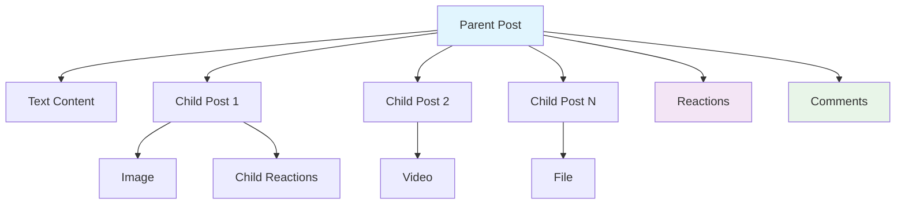

# Posts

Posts are the foundation of content creation in Social+. Create rich, engaging content with support for multiple media types, interactive features, and comprehensive management tools.

## Post Types

<CardGroup cols={2}>
  <Card title="Text Posts" icon="type" href="creation/text-post">
    Simple text-based posts with formatting support
  </Card>
  <Card title="Image Posts" icon="image" href="creation/image-post">
    Photo sharing with multiple image support and filters
  </Card>
  <Card title="Video Posts" icon="video" href="creation/video-post">
    Video content with streaming and playback controls
  </Card>
  <Card title="File Posts" icon="file" href="creation/file-post">
    Document and file sharing capabilities
  </Card>
  <Card title="Poll Posts" icon="chart-bar" href="creation/poll-post">
    Interactive polls and surveys for user engagement
  </Card>
  <Card title="Live Stream Posts" icon="broadcast-tower" href="creation/live-stream-post">
    Real-time live streaming integration
  </Card>
</CardGroup>

## Post Architecture

Posts use a hierarchical parent-child structure for complex content compositions:



## Quick Start Guide

<Steps>
  <Step title="Choose Post Type">
    Select the appropriate post type based on your content:
    - **Text**: For discussions and announcements
    - **Image**: For photo sharing and visual content
    - **Video**: For video content and tutorials
    - **Poll**: For community engagement and feedback
  </Step>
  <Step title="Create Content">
    Use the creation guides for your chosen post type:
    ```typescript
    // Example: Creating a text post
    const post = await AmitySDK.createPost({
      type: 'text',
      text: 'Hello, Social+ community!',
      targetType: 'community',
      targetId: 'community-id'
    });
    ```
  </Step>
  <Step title="Manage Post">
    Use management tools to edit, delete, or moderate your posts
  </Step>
  <Step title="Track Performance">
    Monitor engagement through analytics and impression tracking
  </Step>
</Steps>

## Related Sections

- **[Comments](../comments/overview)** - Enable discussions on your posts
- **[Moderation](../moderation/overview)** - Keep content quality high
- **[Reactions](../../discovery-engagement/reactions/overview)** - Let users react to posts
