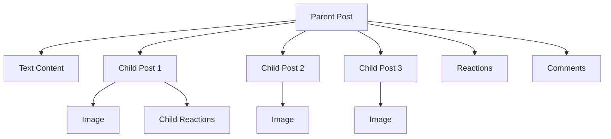

Posts are the foundation of content creation and sharing in Social Plus. A post can include text, images, videos, files, polls, live streams, or custom content—enabling users to express themselves, share information, and connect with others in a network or community.

<CardGroup cols={2}>
  <Card title="Text Posts" icon="text-size" href="creation/text-post">
    Simple text-based posts with formatting support
  </Card>
  <Card title="Image Posts" icon="image" href="creation/image-post">
    Photo sharing with multiple image support and filters
  </Card>
  <Card title="Video Posts" icon="video" href="creation/video-post">
    Video content with streaming and playback controls
  </Card>
  <Card title="File Posts" icon="paperclip-vertical" href="creation/file-post">
    Document and file sharing capabilities
  </Card>
  <Card title="Poll Posts" icon="chart-bar" href="creation/poll-post">
    Interactive polls and surveys for user engagement
  </Card>
  <Card title="Live Stream Posts" icon="circle-video" href="creation/live-stream-post">
    Real-time live streaming integration
  </Card>
  <Card title="Custom Posts" icon="puzzle-piece" href="creation/custom-post">
    Extend functionality with custom post types
  </Card>
</CardGroup>

<Info>
Posts support real-time events and Live Object features. See [Live Objects/Collections](../../../core-concepts/realtime-communication/live-objects-collections/overview) and [Realtime Events](../../../core-concepts/realtime-communication/realtime-events/overview) for more.
</Info>

## Post Structure
Posts use a parent-child relationship:
- The parent post acts as a container (e.g., for text or metadata)
- Each image, video, or file is a separate child post
- Both parent and child posts support reactions and comments

Example: An image post with three images will have one parent post (text container) and three child posts (each with an image).




<Info>
Users can interact (react, comment) with both parent and child posts, enabling rich engagement.
</Info>

### Post Data Model

| Name               | Data Type         | Description                                                        |
|--------------------|------------------|--------------------------------------------------------------------|
| `postId`           | String           | ID of the post                                                     |
| `parentPostId`     | String           | ID of the parent post (null if parent)                             |
| `postedUserId`     | String           | ID of the user who posted                                          |
| `targetID`         | String           | ID of the target (e.g., community, user)                           |
| `targetType`       | String           | Type of target (e.g., community, user)                             |
| `dataType`         | String           | Data type of post (text, image, video, etc.)                       |
| `data`             | Object           | Data of the post                                                   |
| `metadata`         | Object           | Metadata of the post                                               |
| `flagCount`        | Integer          | Number of times the post is flagged                                |
| `editedAt`         | Date             | Date/time the post was edited                                      |
| `createdAt`        | Date             | Date/time the post was created                                     |
| `updatedAt`        | Date             | Date/time the post was updated                                     |
| `reactions`        | Object           | Information about the post reactions                               |
| `reactionsCount`   | Integer          | Number of reactions to the post                                    |
| `myReactions`      | Array of strings | Reactions by the current user                                      |
| `commentsCount`    | Integer          | Number of comments to the post                                     |
| `comments`         | Array of AmityComment | The first three comments for previewing                            |
| `childrenPosts`    | Object           | Child posts (e.g., images, videos)                                 |
| `isDeleted`        | Boolean          | True if the post is deleted                                        |
| `hasFlaggedComment`| Boolean          | True if the post has flagged comments                              |
| `hasFlaggedChildren`| Boolean         | True if the post has flagged children                              |
| `tags`             | Array of strings | Arbitrary tags for querying/filtering posts                        |
| `feedId`           | String           | ID of the post's feed                                              |


## Quick Start Guide

<Steps>
  <Step title="Choose Post Type">
    Select the appropriate post type based on your content:
    - **Text**: For discussions and announcements
    - **Image**: For photo sharing and visual content
    - **Video**: For video content and tutorials
    - **Poll**: For community engagement and feedback
    - **File**: For document sharing
    - **Live Stream**: For real-time broadcasts
    - **Custom**: For advanced or app-specific content
  </Step>
  <Step title="Create Content">
    Use the creation guides for your chosen post type:
    ```typescript
    // Example: Creating a text post
    const post = await PostRepository.createPost({
      type: 'text',
      data: {
      text: 'hello!',
      },
      targetType: 'community',
      targetId: 'community-id'
    });
    ```
  </Step>
  <Step title="Manage Post">
    Use management tools to edit, delete, or moderate your posts
  </Step>
  <Step title="Track Performance">
    Monitor engagement through analytics and impression tracking
  </Step>
</Steps>

## Related Topics

<CardGroup cols={3}>
  <Card title="Comments" href="../comments/overview" icon="message">
    Enable discussions and conversations on your posts
  </Card>
  <Card title="Moderation" href="../moderation/overview" icon="shield">
    Keep content quality high with automated and manual moderation
  </Card>
  <Card title="Reactions" href="../../discovery-engagement/reactions/overview" icon="heart">
    Let users express themselves with likes, loves, and custom reactions
  </Card>
</CardGroup>
