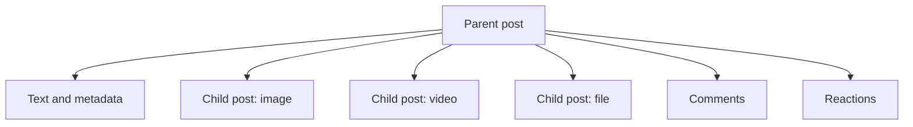

Posts are the primary content objects in Social+. A post belongs to a target, such as a user feed or community feed, and can contain text, uploaded media, poll data, live or room references, or custom data depending on the SDK.

<Tip>
  Looking for a product walkthrough? The [Rich Content Creation](/use-cases/social/rich-content-creation) guide covers an end-to-end content flow. This page focuses on SDK surfaces and data behavior.
</Tip>

## Post Types

| Type | Current SDK notes |
| --- | --- |
| Text | Supported by TypeScript, iOS, Android, and Flutter. |
| Image | Supported by TypeScript, iOS, Android, and Flutter after image upload. |
| Video | Supported by TypeScript, iOS, Android, and Flutter after video upload. |
| File | Supported by TypeScript, iOS, Android, and Flutter after file upload. |
| Poll | Supported by TypeScript, iOS, Android, and Flutter when a poll exists. |
| Live stream or room | TypeScript and Android expose both live stream and room data types. iOS exposes room creation and deprecated live-stream creation. Flutter exposes live-stream post creation in the current source. |
| Audio | Supported by TypeScript, iOS, and Android after audio upload. A Flutter audio post creator was not found in the current source. |
| Clip | Supported by TypeScript, iOS, and Android after clip upload. A Flutter clip post creator was not found in the current source. |
| Mixed media | TypeScript, iOS, and Android expose mixed attachment/media flows. A Flutter mixed-media post creator was not found in the current source. |
| Custom | Supported by TypeScript, iOS, Android, and Flutter for app-specific data. |

## Parameters

| Operation | Parameter | Required | Description |
| --- | --- | --- | --- |
| Create a text post | `targetType` | Yes | Feed target type, commonly `community` or `user`. |
| Create a text post | `targetId` | Yes | Target feed ID, such as a community ID or user ID. |
| Create a text post | `data.text` | Yes | Text body for the post. |
| Query posts with mixed structure | `dataTypes` | Yes | Content type filter, such as `image`. |
| Query posts with mixed structure | `includeMixedStructure` | No | Include mixed-structure posts alongside the requested media type. |
| Subscribe to post/comment events | Community or post object | Yes | Object used to build the realtime topic for the scope being observed. |
| Subscribe to post/comment events | Subscription level | Yes | Realtime level, such as post-and-comment or comment-only. |

## Create a Text Post

Use the text post creation page for full platform coverage; this TypeScript example shows the minimum shape for a community text post.

<CodeGroup>

```typescript TypeScript
import { PostRepository } from "@amityco/ts-sdk";

const { data: createdPost } = await PostRepository.createPost({
  targetType: "community",
  targetId: communityId,
  data: {
    text: "Hello community",
  },
});
```

</CodeGroup>

## Post Structure

Media posts use a parent-child structure. The parent post carries the target, text, metadata, counters, and other feed-level fields. Uploaded image, video, file, audio, or clip attachments are represented as child posts.


```mermaid
graph TD
    A["Parent post"] --> B["Text and metadata"]
    A --> C["Child post: image"]
    A --> D["Child post: video"]
    A --> E["Child post: file"]
    A --> F["Comments"]
    A --> G["Reactions"]
```

Common post fields include:

| Field | Notes |
| --- | --- |
| `postId` | Unique post ID. |
| `parentPostId` | Parent ID for a child post; empty or null for parent posts depending on platform. |
| `targetId` / `targetID` | Feed target ID, such as a community ID or user ID. TypeScript and iOS use `targetId`; some platform models expose differently cased names. |
| `targetType` | Target type, commonly `community` or `user`. |
| `dataType` / `type` | Content type such as `text`, `image`, `video`, `file`, `poll`, or custom type. Flutter exposes this as `type`. |
| `structureType` | Composition type exposed by TypeScript, iOS, and Android. Flutter's current public post model does not expose this field. |
| `data` | Type-specific post data. |
| `metadata` | App-defined metadata. |
| `commentsCount` | Server comment count at fetch time. |
| `localCommentCount` | Locally computed live count exposed by TypeScript, iOS, and Android. |
| `childrenPosts` / `children` | Child posts for media attachments. Field name varies by SDK. |
| `isDeleted` | Soft-delete state. |

## Structure Type

`structureType` classifies a post by its attachment composition.

| Platform | Current behavior |
| --- | --- |
| TypeScript | Typed values are `text`, `image`, `video`, `file`, `audio`, and `mixed`. |
| iOS | Exposes `structureType` as a string on `AmityPost`. |
| Android | Exposes `getStructureType()` with values including `TEXT`, `IMAGE`, `VIDEO`, `AUDIO`, `FILE`, `LIVESTREAM`, `POLL`, `CLIP`, `ROOM`, `MIXED`, and `UNKNOWN`. |
| Flutter | No public `structureType` field was found in the current public `AmityPost` model. |

Use `includeMixedStructure` when querying a single media type and you also want posts whose `structureType` is `mixed`.

<CodeGroup>

```typescript TypeScript
import { PostRepository } from "@amityco/ts-sdk";

const stopObserving = PostRepository.getPosts(
  {
    targetType: "community",
    targetId: communityId,
    dataTypes: ["image"],
    includeMixedStructure: true,
  },
  ({ data }) => {
    renderResults(data);
  }
);
```

</CodeGroup>

## Live Comment Count

`localCommentCount` is a client-side count that starts from the server `commentsCount` value and then updates as the SDK observes comment create/delete events. It is exposed by TypeScript, iOS, and Android in the current SDKs.

Use it for active feed or detail screens where a live counter matters. Use `commentsCount` when you only need the server value returned with the fetched post.

To receive remote updates, the app must both observe the post or feed and subscribe to an appropriate realtime topic.

<CodeGroup>

```typescript TypeScript
import { getCommunityTopic, getPostTopic, SubscriptionLevels } from "@amityco/ts-sdk";

const communityTopic = getCommunityTopic(
  community,
  SubscriptionLevels.POST_AND_COMMENT
);

const postCommentTopic = getPostTopic(post, SubscriptionLevels.COMMENT);
```

</CodeGroup>

<Note>
  Global feed queries do not provide a single global post/comment realtime topic. Subscribe at a community, user, or post scope when the UI needs remote events.
</Note>

## Related Topics

<CardGroup cols={3}>
  <Card title="Text Posts" icon="text-size" href="./creation/text-post">
    Start with the simplest post creation path.
  </Card>
  <Card title="Query Posts" icon="list" href="./retrieval/query-posts">
    Load feeds and filter by type, target, review status, or mixed structure.
  </Card>
  <Card title="Post Impressions" icon="chart-line" href="./analytics/post-impressions">
    Track post views and meaningful views where supported.
  </Card>
</CardGroup>
