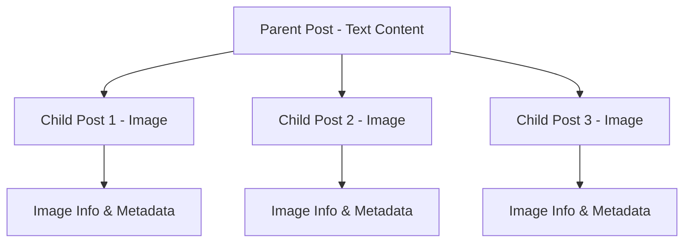

Understand how to properly display and render different types of posts in the social.plus SDK. Learn about the parent-child post structure and how to access various content types including images, files, videos, live streams, and polls.

<CardGroup cols={2}>
  <Card title="Post Structure" icon="sitemap">
    Understand parent-child relationships in media posts
  </Card>
  <Card title="Content Access" icon="eye">
    Access post data and media information efficiently
  </Card>
  <Card title="Media Handling" icon="photo-film">
    Handle images, videos, and files with multiple resolutions
  </Card>
  <Card title="Interactive Content" icon="chart-bar">
    Display polls and live streams in your application
  </Card>
</CardGroup>

## Post Structure Overview

In social.plus's SDK, posts with images, files, or videos follow a **Parent-Child relationship**, where each uploaded image/file is represented as a separate child post. When creating an image/file post, any text that is set will act as the Parent post.



<Info>
The Parent post contains a `childrenPosts` property, which provides an array of Post instances for each child post. For more information about post structure, please refer to [Post Overview](../overview).
</Info>

### Key Concepts

<AccordionGroup>
  <Accordion title="Parent-Child Relationship">
    - **Parent Post**: Contains the main text content and metadata
    - **Child Posts**: Individual media items (images, files, videos)
    - **Data Access**: Both parent and child posts use the same `data` property
    - **Flexible Structure**: Allows efficient management of complex multimedia posts
  </Accordion>
  
  <Accordion title="Post Data Access">
    - **Text Posts**: Access content directly through the `data` property
    - **Media Posts**: Access media information through specialized functions
    - **File Information**: Use `getFileInfo()` for file details and download URLs
    - **Image Information**: Use `getImageInfo()` for image metadata and URLs
  </Accordion>
</AccordionGroup>

## Accessing Children Posts

Each instance of a Post holds several pieces of information, including data, reactions, comments, metadata, child posts, and more. Here's how to access parent and child post information:

<CodeGroup>
```swift iOS
var token: AmityNotificationToken?

func accessPostAndItsChildrenInfo(liveObject: AmityObject<AmityPost>) {
    token = liveObject.observe { liveObject, error in
        guard let post = liveObject.object else { return }
        
        // 1. Accessing the post itself
        let postId = post.postId
        let postData = post.data
        print("postId: \(postId), data: \(String(describing: postData))")
        
        // 2. Accessing children posts
        let childrenPosts = post.childrenPosts
        guard !childrenPosts.isEmpty else {
            print("This post has no children.")
            return
        }
        
        for (index, childPost) in childrenPosts.enumerated() {
            print("found [\(index)] child post")
            print("- type: \(childPost.dataType)")
            
            switch childPost.dataType {
            case "file":
                // This post is a file post. So we get file information
                if let fileInfo = childPost.getFileInfo() {
                    print("- fileInfo: \(fileInfo.fileId)")
                }
            case "image":
                // This post is an image post. So we get image information
                if let imageInfo = childPost.getImageInfo() {
                    print("- imageInfo: \(imageInfo.fileId)")
                }
            default:
                break
            }
        }
    }
}
```

```kotlin Android
fun getPost(postId: String, postRepository: AmityPostRepository) {
    postRepository.getPost(postId)
        .doOnNext { amityPost: AmityPost ->
            // AmityPost data is available
            val children: List<AmityPost> = amityPost.getChildren()
            // We check if this post has any children i.e file/image
            if (children.isNotEmpty()) {
                children.forEach { childPost ->
                    when (childPost.getData()) {
                        is AmityPost.Data.IMAGE -> {
                            // This post is an image post. So we get image information
                            val imageData: AmityImage? =
                                (childPost.getData() as AmityPost.Data.IMAGE).getImage()
                        }
                        is AmityPost.Data.FILE -> {
                            // This post is a file post. So we get file information
                            val fileData: AmityFile? =
                                (childPost.getData() as AmityPost.Data.FILE).getFile()
                        }
                    }
                }
            }
            // Since parent post contains text, we can access it as
            val data: AmityPost.Data = amityPost.getData()
            val text: String? = (amityPost.getData() as? AmityPost.Data.TEXT)?.getText()
        }
        .doOnError {
            // handle error here
        }.subscribe()
}
```

```typescript TypeScript
import { PostRepository } from '@amityco/ts-sdk';


// Get post only once by postId
const getPost = async (postId: string): Promise<Amity.Post> => {
  return new Promise<Amity.Post>((resolve) => {
    const unsubscribe = PostRepository.getPost(postId, ({ data, loading }) => {
      if (!loading) {
        resolve(data);
      }
    });

    // Unsubscribe immediately after getting the data to avoid memory leaks.
    unsubscribe();
  });
};

// Resolve information about the children of a post.
const resolvePostChildrenInfo = async (postId: string): Promise<void> => {
  const post = await getPost(postId);
  const postChildren = post.children?.length ? await getPost(post.children[0]) : null;

  // Check the type of the child post and handle accordingly.
  if (postChildren) {
    switch (postChildren.dataType) {
      // Cast post data to the appropriate type using type assertion.
      case 'image':
        const imagePost = postChildren.data as Amity.Post<'image'>;
        // Access imageFileId from the image post.
        const imageFileId = imagePost.data?.fileId;
        console.log('Image FileId:', imageFileId);
        break;

      case 'file':
        const filePost = postChildren.data as Amity.Post<'file'>;
        // Access fileId from the file post.
        const fileId = filePost.data?.fileId;
        console.log('FileId:', fileId);
        break;

      default:
        // Handle other types or unknown cases.
        console.log('Unknown or unsupported data type:', postChildren.dataType);
        break;
    }
  }
};
```

```dart Flutter
void getPost(String postId) {
  AmitySocialClient.newPostRepository()
      .getPost(postId)
      .then((AmityPost post) {
    //parent post text is always TextData
    //from this line you can get the post's text data
    //eg 'Hello bob'
    final textContent = post.data as TextData;
    final childrenPosts = post.children;
    //check if the chidren posts exist in the parent post
    if (childrenPosts?.isNotEmpty == true) {
      childrenPosts?.forEach((AmityPost childPost) {
        //check if the current child post is an image post
        if (childPost.type == AmityDataType.IMAGE) {
          //if the current child post is an image post,
          //we can cast its data to ImageData
          final AmityPostData? amityPostData = childPost.data;
          if (amityPostData != null) {
            final imageData = amityPostData as ImageData;
            //to get the full image url without transcoding
            final largeImageUrl = imageData.getUrl(AmityImageSize.FULL);
          }
        }
      });
    }
  }).onError((error, stackTrace) {
    //handle error
  });
}
```
</CodeGroup>


## Content Types

### Image Posts

Posting visual content such as photos, graphics, or images is facilitated by this type of post. Images are automatically transformed into four different sizes for versatile usage.

<CardGroup cols={4}>
  <Card title="Small">
    Thumbnail size for previews
  </Card>
  <Card title="Medium">
    Standard feed display
  </Card>
  <Card title="Large">
    High-quality viewing
  </Card>
  <Card title="Full">
    Original resolution
  </Card>
</CardGroup>

<Warning>
**Maximum Size**: 1 GB per image. For more information about image handling, please refer to [Image Handling](/social-plus-sdk/core-concepts/content-handling/files-images-and-videos/image-handling).
</Warning>

<CodeGroup>
```swift iOS
func getImageInfo(post: AmityPost) {
    let image = post.getImageInfo()
    print("FileId: \(image?.fileId)")
    print("FileURL: \(image?.fileURL)")
    
    // Use fileURL to download the image
    // You can use fileDownload API from AmityFileRepository or
    // other network clients to download the image
}
```

```kotlin Android
fun getImageInfo(
    post: AmityPost
) {
    val data = post.getData()
    when (data) {
        is AmityPost.Data.IMAGE -> {
            val image = data.getImage()
            val imageUrl = image?.getUrl(AmityImage.Size.MEDIUM)
        }
        else -> {}
    }
}
```

```typescript TypeScript
import { FileRepository, PostRepository } from '@amityco/ts-sdk';
// Get post data by postId
const getPost = async (postId: string): Promise<Amity.Post> => {
  return new Promise<Amity.Post>(resolve => {
    const unsubscribe = PostRepository.getPost(postId, ({ data, loading }) => {
      if (!loading) {
        resolve(data);
        unsubscribe();
      }
    });
  });
};

// Get file information by fileId
const getPostFile = async <T extends Amity.FileType>(fileId?: string): Promise<Amity.File<T> | null> => {
  if (!fileId) return null;
  const { data: file } = await FileRepository.getFile(fileId);
  return file as Amity.File<T>;
};

// Get image post information along with its URL
const getPostImageInfo = async (postId: string): Promise<Amity.File<'image'> | null> => {
  const post = await getPost(postId);
  const firstChildId = post.children?.[0];

  if (firstChildId) {
    const postChildren = await getPost(firstChildId);

    // Ensure the post type is 'image' before attempting to get its image information
    if (postChildren.dataType === 'image') {
      const imagePost = postChildren as Amity.Post<'image'>;
      const postImage = await getPostFile<'image'>(imagePost.data?.fileId);
      console.log('Post Image URL:', postImage?.fileUrl);
      console.log('Post ImageId:', postImage?.fileId);
      return postImage;
    }
  }

  return null;
};
```

```dart Flutter
void getImage(AmityPost post) {
  final AmityPostData? amityPostData = post.data;
  if (amityPostData != null) {
    final imageData = amityPostData as ImageData;
    //for large image url
    final largeImageUrl = imageData.getUrl(AmityImageSize.LARGE);
    //for small image url
    final smallImageUrl = imageData.getUrl(AmityImageSize.SMALL);
  }
}
```

</CodeGroup>

#### Image Size Parameters

If you are using your own implementation to download the image of appropriate size, you need to construct the download URL yourself by appending size query parameter.

**Example URL Construction:**
```
Base URL: https://my-image-download-link-from-amity/123/456
Small Size: https://my-image-download-link-from-amity/123/456?size=small
```

### File Posts

This is a post that contains a file attachment, such as a PDF, a Word document, or any other type of file. Useful for sharing documents, spreadsheets, presentations, and other file types within communities.


<Info>
For more information about file handling, please refer to [File Handling](/social-plus-sdk/core-concepts/content-handling/files-images-and-videos/file).
</Info>

<CodeGroup>
```swift iOS
func getFileInfo(post: AmityPost) {
    let file = post.getFileInfo()
    print("FileId: \(file?.fileId)")
    print("FileURL: \(file?.fileURL)")
    
    // Use fileURL to download the file
    // You can use fileDownload API from AmityFileRepository or
    // other network clients to download the file
}
```

```kotlin Android
fun getFileInfo(
    post: AmityPost
) {
    val data = post.getData()
    when (data) {
        is AmityPost.Data.FILE -> {
            val file = data.getFile()
            val fileUrl = file?.getUrl()
            val fileName = file?.getFileName()
            val fileSize = file?.getFileSize()
            val mimeType = file?.getMimeType()
        }
        else -> {}
    }
}
```

```typescript TypeScript
import { FileRepository, PostRepository } from '@amityco/ts-sdk';

// Get post data by postId
const getPost = async (postId: string): Promise<Amity.Post> => {
  return new Promise<Amity.Post>(resolve => {
    const unsubscribe = PostRepository.getPost(postId, ({ data, loading }) => {
      if (!loading) {
        resolve(data);
        unsubscribe();
      }
    });
  });
};

// Get file information by fileId
const getPostFile = async <T extends Amity.FileType>(fileId?: string): Promise<Amity.File<T> | null> => {
  if (!fileId) return null;
  const { data: file } = await FileRepository.getFile(fileId);
  return file as Amity.File<T>;
};

// Get file post information along with its URL
const getPostFileInfo = async (postId: string): Promise<Amity.File<'file'> | null> => {
  const post = await getPost(postId);
  const firstChildId = post.children?.[0];

  if (firstChildId) {
    const postChildren = await getPost(firstChildId);

    // Ensure the post type is 'file' before attempting to get its image information
    if (postChildren.dataType === 'file') {
      const filePost = postChildren as Amity.Post<'file'>;
      const postFile = await getPostFile<'file'>(filePost.data?.fileId);
      console.log('Post File URL:', postFile?.fileUrl);
      console.log('Post FileId:', postFile?.fileId);
      return postFile;
    }
  }

  return null;
};
```

```dart Flutter
void getFile(AmityPost post) {
  final AmityPostData? amityPostData = post.data;
  if (amityPostData != null) {
    final fileData = amityPostData as FileData;
    final AmityFile amityFile = fileData.file!;
    final String? fileUrl = amityFile.fileUrl;
  }
}
```
</CodeGroup>

### Video Posts

Share video content within feeds, such as short clips or longer videos. Videos are automatically transcoded into different resolutions for optimal playback across devices.

<CardGroup cols={3}>
  <Card title="1080p" icon="video">
    Full HD quality
  </Card>
  <Card title="720p" icon="video">
    HD quality
  </Card>
  <Card title="480p" icon="video">
    Standard quality
  </Card>
  <Card title="360p" icon="video">
    Mobile-optimized
  </Card>
  <Card title="Original" icon="video">
    Source resolution
  </Card>
</CardGroup>

<Warning>
**Maximum Size**: 1 GB per video. **Transcoding**: Videos undergo transcoding from their original resolution. Original size is accessible immediately, but transcoded resolutions take time to be ready.
</Warning>

<Info>
For more information about video handling, please refer to [Video Handling](/social-plus-sdk/core-concepts/content-handling/files-images-and-videos/video-handling).
</Info>

<CodeGroup>
```swift iOS
func getVideoData(fromPost post: AmityPost) {
    let childrenPosts = post.childrenPosts
    let allVideosData = childrenPosts.compactMap { childPost in
        childPost.getVideoInfo()
    }
    
    print("This post has \(allVideosData.count) videos.")
    
    for (index, videoData) in allVideosData.enumerated() {
        if let videoPath = videoData.getVideo(resolution: .original) {
            print("The video[\(index)] can be watched or downloaded at \(videoPath).")
        }
    }
}
```

```kotlin Android
fun getVideoInfo(
    post: AmityPost,
) {
    val data = post.getData()
    when (data) {
        is AmityPost.Data.VIDEO -> {
            val thumbnailUrl = data.getThumbnailImage()?.getUrl()
            data.getVideo()
                .doOnSuccess { video ->
                    // resolution options
                    val resolutions = video.getResolutions()
                    val defaultResolution = resolutions.first()

                    // url by selected resolution
                    val videoUrl = video.getVideoUrl(defaultResolution)
                }
                .doOnError {
                    // Exception
                }
                .subscribe()
        }

        else -> {}
    }
}
```

```typescript TypeScript
import { FileRepository, PostRepository } from '@amityco/ts-sdk';

// Get details of a video post's children.
const getVideoPostChildren = async (postId: string): Promise<{ fileId?: string, thumbnailFileId?: string }> => {
  const post = await new Promise<Amity.Post>((resolve, reject) => {
    const unsubscribe = PostRepository.getPost(postId, ({ data, loading, error }) => {
      if (!loading) {
        if (error) {
          reject(error);
        } else {
          resolve(data);
        }
        unsubscribe();
      }
    });
  });

  const postChildrenId = post.children[0];
  const postChildren = await new Promise<Amity.Post<'video'>>((resolve, reject) => {
    const unsubscribe = PostRepository.getPost(postChildrenId, ({ data, loading, error }) => {
      if (!loading) {
        if (error) {
          reject(error);
        } else {
          resolve(data as Amity.Post<'video'>);
        }
        unsubscribe();
      }
    });
  });

  return {
    fileId: postChildren.data?.videoFileId.original,
    thumbnailFileId: postChildren.data?.thumbnailFileId,
  };
};

// Get file information by fileId
const getPostFile = async <T extends Amity.FileType>(fileId?: string): Promise<Amity.File<T> | null> => {
  if (!fileId) return null;
  const { data: file } = await FileRepository.getFile(fileId);
  return file as Amity.File<T>;
};

// Retrieve URLs for video and its thumbnail.
const fetchVideoAndThumbnail = async (postId: string) => {
  const { fileId, thumbnailFileId } = await getVideoPostChildren(postId);
  const videoFile = await getPostFile<'video'>(fileId);
  const thumbnailFile = await getPostFile<'image'>(thumbnailFileId);

  console.log('Video 360p URL:', videoFile?.videoUrl?.['360p']);
  console.log('Video 480p URL:', videoFile?.videoUrl?.['480p']);
  console.log('Video 360p URL:', videoFile?.videoUrl?.['720p']);
  console.log('Video 360p URL:', videoFile?.videoUrl?.['1080p']);
  console.log('Thumbnail URL:', thumbnailFile?.fileUrl);
};
```

```dart Flutter
void getVideo(AmityPost post) {
  final AmityPostData? amityPostData = post.data;
  if (amityPostData != null) {
    final videoData = amityPostData as VideoData;
    //for high quality video
    videoData.getVideo(AmityVideoQuality.HIGH).then((AmityVideo video) {
      //handle result
    });
    //for low quality video
    videoData.getVideo(AmityVideoQuality.LOW).then((AmityVideo video) {
      //handle result
    });
  }
}
```


</CodeGroup>

### Poll Posts

Implement poll functionality in posts by leveraging the existing poll features in social.plus SDK. Polls can be created as child posts within the post thread, with poll data and options easily accessible to users.

<CardGroup cols={2}>
  <Card title="Multiple Options" icon="list">
    Create polls with 2-10 answer options
  </Card>
  <Card title="Time Limits" icon="clock">
    Set custom voting deadlines or keep open indefinitely
  </Card>
</CardGroup>

<Info>
For more information about polls, please refer to [Polls](/social-plus-sdk/core-concepts/content-handling/poll).
</Info>

<CodeGroup>

```swift iOS
func getPoll(from post: AmityPost) {
    let _ = post.getPollInfo()
    // Access poll data, options, and voting results
}
```

```kotlin Android
fun getPollInfo(
    post: AmityPost,
) {
    val data = post.getData()
    when (data) {
        is AmityPost.Data.POLL -> {
            data.getPoll()
                .doOnNext { poll ->
                    val pollQuestion = poll.getQuestion()
                    val pollAnswerType = poll.getAnswerType()
                    val pollAnswers = poll.getAnswers()
                    val isPollOpen = poll.getStatus() == AmityPoll.Status.OPEN
                    val pollClosingTime = poll.getClosedAt()
                    val hasVoted = poll.isVoted()
                }
                .doOnError {
                    // Exception
                }
                .subscribe()
        }

        else -> {}
    }
}
```

```typescript TypeScript
import { PostRepository, PollRepository } from '@amityco/ts-sdk';

// Get post data by postId
const getPost = async (postId: string): Promise<Amity.Post> => {
  return new Promise<Amity.Post>(resolve => {
    const unsubscribe = PostRepository.getPost(postId, ({ data, loading }) => {
      if (!loading) {
        resolve(data);
        unsubscribe();
      }
    });
  });
};

// Get poll by pollId
const getPoll = async (pollId: string): Promise<Amity.Poll | null> => {
  return new Promise(resolve => {
    const unsubscribe = PollRepository.getPoll(pollId, ({ data }) => {
      resolve(data);
      unsubscribe();
    });
  });
};

// Get poll post information along with its question and answers
const getPostPollInfo = async (postId: string): Promise<Amity.Poll | null> => {
  const post = await getPost(postId);
  const firstChildId = post.children?.[0];

  if (firstChildId) {
    const postChildren = await getPost(firstChildId);

    // Ensure the child post type is 'poll' before attempting to fetch its poll data.
    if (postChildren.dataType === 'poll') {
      const pollPost = postChildren as Amity.Post<'poll'>;
      const pollId = pollPost.data?.pollId;
      if (pollId) {
        const postPoll = await getPoll(pollId);
        console.log('Post Poll Question:', postPoll?.question);
        console.log('Post Poll Answers:', postPoll?.answers);
        return postPoll;
      }
    }
  }

  return null;
};
```

```dart Flutter
void getPollPost(AmityPost post) {
  //parent post text is always TextData
  //from this line you can get the post's text data
  //eg 'What are your favorite songs?'
  final textContent = post.data as TextData;
  final childrenPosts = post.children;
  //check if the chidren posts exist in the parent post
  if (childrenPosts?.isNotEmpty == true) {
    childrenPosts?.forEach((AmityPost childPost) {
      //check if the current child post is an poll post
      if (childPost.type == AmityDataType.POLL) {
        //if the current child post is an poll post,
        //we can cast its data to PollData
        final AmityPostData? amityPostData = childPost.data;
        if (amityPostData != null) {
          final pollData = amityPostData as PollData;
          pollData.getPoll().then((AmityPoll poll) {
            //handle poll data here
          });
        }
      }
    });
  }
}
```

</CodeGroup>


### Room Posts

Room posts enable interactive live room experiences with co-hosting capabilities. Rooms can be live (currently broadcasting) or recorded (playback available). Access room data to retrieve playback URLs based on the room status.

<CardGroup cols={2}>
  <Card title="Live Playback" icon="tower-broadcast">
    Stream live content in real-time
  </Card>
  <Card title="Recorded Playback" icon="video">
    Access recorded sessions after broadcast ends
  </Card>
</CardGroup>

**Room Statuses**

| Status | Description | Playback URL |
|--------|-------------|--------------|
| `live` | Room is currently broadcasting | Use `getLivePlaybackUrl()` |
| `recorded` | Recording available for playback | Use `getRecordedPlaybackInfos()` |
| `idle` | Room created but not yet live | No playback available |
| `ended` | Broadcast ended, processing recording | No playback available yet |

<Info>
For more information about creating room posts, please refer to [Room Posts](/social-plus-sdk/social/content-management/posts/creation/room-post).
</Info>

#### Getting Room Playback URLs

<CodeGroup>

```swift iOS
func getRoomPlaybackUrls(from post: AmityPost) {
    guard let roomData = post.getRoomInfo() else { return }
    
    let status = roomData.status
    var playbackUrls: [String] = []
    
    switch status {
    case .live:
        // Get live playback URL for active broadcast
        if let liveUrl = roomData.getLivePlaybackUrl() {
            playbackUrls.append(liveUrl)
        }
    case .recorded:
        // Get recorded playback URLs after broadcast ends
        let recordedInfos = roomData.getRecordedPlaybackInfos()
        playbackUrls = recordedInfos.compactMap { $0.url }
    default:
        // Room is idle or ended, no playback available
        break
    }
    
    print("Playback URLs: \(playbackUrls)")
}
```

```kotlin Android
fun getRoomPlaybackUrls(room: AmityRoom): List<String> {
    val liveUrl = room.getLivePlaybackUrl()
    
    val urls = if (room.getStatus() != AmityRoomStatus.RECORDED && !liveUrl.isNullOrBlank()) {
        // Room is live, use live playback URL
        listOf(liveUrl)
    } else if (room.getStatus() == AmityRoomStatus.RECORDED) {
        // Room has ended and recording is available
        room.getRecordedPlaybackInfos()
            ?.mapNotNull { it.url }
            ?: emptyList()
    } else {
        // Room is idle or ended without recording
        emptyList()
    }
    
    return urls
}
```

```typescript TypeScript
import { PostRepository, RoomRepository } from '@amityco/ts-sdk';

async function getRoomPlaybackUrls(roomId: string): Promise<string[]> {
  const room = await RoomRepository.getRoom(roomId);
  
  let playbackUrls: string[] = [];
  
  if (room.status === 'live') {
    // Get live playback URL for active broadcast
    const liveUrl = room.livePlaybackUrl;
    if (liveUrl) {
      playbackUrls.push(liveUrl);
    }
  } else if (room.status === 'recorded') {
    // Get recorded playback URLs after broadcast ends
    const recordedInfos = room.recordedPlaybackInfos || [];
    playbackUrls = recordedInfos
      .map(info => info.url)
      .filter((url): url is string => !!url);
  }
  
  return playbackUrls;
}
```

</CodeGroup>

#### Rendering Video Playback

Once you have the playback URL, use platform-specific video players to render the content.

<CodeGroup>

```swift iOS
import AVKit

func playRoomVideo(url: String) {
    guard let videoURL = URL(string: url) else { return }
    
    // Create AVPlayer with the playback URL
    let player = AVPlayer(url: videoURL)
    
    // Create player view controller
    let playerViewController = AVPlayerViewController()
    playerViewController.player = player
    
    // Present and play
    present(playerViewController, animated: true) {
        player.play()
    }
}

// Usage with room post
func playRoom(from post: AmityPost) {
    guard let roomData = post.getRoomInfo() else { return }
    
    if roomData.status == .live, let liveUrl = roomData.getLivePlaybackUrl() {
        playRoomVideo(url: liveUrl)
    } else if roomData.status == .recorded {
        if let firstRecordedUrl = roomData.getRecordedPlaybackInfos().first?.url {
            playRoomVideo(url: firstRecordedUrl)
        }
    }
}
```

```kotlin Android
import androidx.media3.common.MediaItem
import androidx.media3.exoplayer.ExoPlayer

fun playRoomVideo(
    context: Context,
    urls: List<String>
) {
    if (urls.isEmpty()) return
    
    // Create ExoPlayer instance
    val exoPlayer = ExoPlayer.Builder(context).build()
    
    // Add media items for each URL
    urls.forEach { url ->
        val mediaItem = MediaItem.fromUri(url)
        exoPlayer.addMediaItem(mediaItem)
    }
    
    // Prepare and start playback
    exoPlayer.prepare()
    exoPlayer.playWhenReady = true
}

// Complete example with room data
fun playRoomFromPost(
    context: Context,
    room: AmityRoom,
    playerView: PlayerView
) {
    val urls = getRoomPlaybackUrls(room)
    
    if (urls.isNotEmpty()) {
        val exoPlayer = ExoPlayer.Builder(context).build()
        
        // Bind player to view
        playerView.player = exoPlayer
        
        // Add all playback URLs as media items
        urls.forEach { url ->
            exoPlayer.addMediaItem(MediaItem.fromUri(url))
        }
        
        exoPlayer.prepare()
        exoPlayer.playWhenReady = true
    }
}
```

```typescript TypeScript
// Using HTML5 Video element or a video library like Video.js or HLS.js

function playRoomVideo(url: string, videoElement: HTMLVideoElement) {
  // For HLS streams, use HLS.js library
  if (url.includes('.m3u8')) {
    import('hls.js').then(({ default: Hls }) => {
      if (Hls.isSupported()) {
        const hls = new Hls();
        hls.loadSource(url);
        hls.attachMedia(videoElement);
        hls.on(Hls.Events.MANIFEST_PARSED, () => {
          videoElement.play();
        });
      } else if (videoElement.canPlayType('application/vnd.apple.mpegurl')) {
        // Native HLS support (Safari)
        videoElement.src = url;
        videoElement.play();
      }
    });
  } else {
    // For regular video URLs
    videoElement.src = url;
    videoElement.play();
  }
}

// React example
function RoomVideoPlayer({ roomId }: { roomId: string }) {
  const videoRef = useRef<HTMLVideoElement>(null);
  
  useEffect(() => {
    async function loadVideo() {
      const urls = await getRoomPlaybackUrls(roomId);
      if (urls.length > 0 && videoRef.current) {
        playRoomVideo(urls[0], videoRef.current);
      }
    }
    loadVideo();
  }, [roomId]);
  
  return <video ref={videoRef} controls />;
}
```

<Note>
For Android, add Media3 ExoPlayer dependency to your `build.gradle`:
```gradle
dependencies {
    implementation "androidx.media3:media3-exoplayer:1.+"
    implementation "androidx.media3:media3-ui:1.+"
    implementation "androidx.media3:media3-exoplayer-hls:1.+" // For HLS streams
}
```
</Note>


### Live Stream Posts (Deprecated)

Live stream posts offer an effective means of creating captivating and interactive content that engages users and promotes deeper connections among them. The social.plus SDK enables developers to swiftly integrate live stream posts into social feeds.

<CardGroup cols={2}>
  <Card title="Real-time Interaction" icon="tower-broadcast">
    Live engagement with audience
  </Card>
  <Card title="Stream Integration" icon="video">
    Easy integration into social feeds
  </Card>
</CardGroup>

<Info>
For more information about live streaming, please refer to [Video Streaming](/social-plus-sdk/video/README).
</Info>

<CodeGroup>

```swift iOS
// Grab the stream object from the first child post
if let firstChildPost = post.childrenPosts.first,
   let _ = firstChildPost.getLiveStreamInfo() {
    // Handle `stream` data here
}
```

```kotlin Android
fun getLivestreamInfo(
    post: AmityPost,
    videoPlayer: AmityVideoPlayer
) {
    val data = post.getData()
    when (data) {
        is AmityPost.Data.LIVE_STREAM -> {
            data.getStream()
                .doOnNext { stream ->
                    val title = stream.getTitle()
                    val description = stream.getDescription()
                    val thumbnailUrl = stream.getThumbnailImage()?.getUrl()

                    val status = stream.getStatus()
                    when (status) {
                        AmityStream.Status.LIVE, AmityStream.Status.RECORDED  -> {
                            videoPlayer.play(stream.getStreamId())
                        }
                        else -> {
                            // content is not playable
                        }
                    }
                }
                .doOnError {
                    // Exception
                }
                .subscribe()
        }

        else -> {}
    }
}
```

```typescript TypeScript
import { StreamRepository } from '@amityco/ts-sdk';

async function getStream() {
  const stream = await StreamRepository.getStream('streamId');

  return stream;
}
```
</CodeGroup>


## Related Topics

<CardGroup cols={3}>
  <Card title="Create Text Posts" href="../creation/text-post" icon="plus">
    Learn how to create basic text posts
  </Card>
  <Card title="Query Posts" href="./query-posts" icon="filters">
    Filter and retrieve posts by content type
  </Card>
  <Card title="Post Impressions" href="../analytics/post-impressions" icon="chart-bar">
    Track visibility and engagement metrics
  </Card>
</CardGroup>