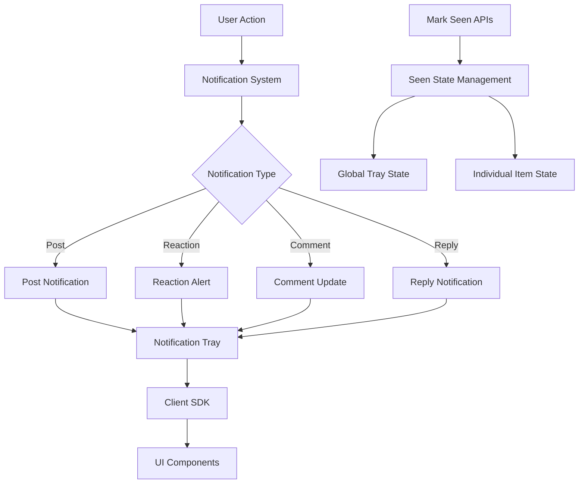

# Notification Tray

<CardGroup cols={2}>
  <Card title="Real-time Notifications" icon="bell">
    Keep users engaged with instant notifications for posts, reactions, comments, and replies
  </Card>
  <Card title="Flexible Integration" icon="puzzle-piece">
    Easy-to-use SDK methods for seamless notification tray integration
  </Card>
  <Card title="Granular Control" icon="sliders">
    Fine-grained read tracking with both global and per-item seen states
  </Card>
  <Card title="Cross-platform Support" icon="mobile-screen">
    Consistent notification experience across iOS, Android, and Web platforms
  </Card>
</CardGroup>

## Architecture Overview



## Key Features

The **Notification Tray SDK Feature** enhances user engagement and connectivity within your application by providing comprehensive notification management capabilities.

<AccordionGroup>
  <Accordion title="Core Notification Types">
    <CardGroup cols={2}>
      <Card title="User Post Notifications" icon="file-text">
        Instantly notify users when someone posts within their community, keeping them updated on relevant discussions
      </Card>
      <Card title="Reaction Alerts" icon="heart">
        Users receive notifications when others react to their posts, fostering engagement and interaction
      </Card>
      <Card title="Comment Updates" icon="comment">
        Notify users when someone comments on their posts, allowing timely responses and deeper conversations
      </Card>
      <Card title="Reply Notifications" icon="reply">
        Users get alerts when someone replies to their comments, ensuring they remain engaged in ongoing discussions
      </Card>
    </CardGroup>
  </Accordion>

  <Accordion title="State Management Features">
    - **Real-time Updates**: Instant notification delivery and state synchronization
    - **Cross-device Sync**: Notification states synchronized across multiple devices
    - **Granular Tracking**: Both global tray-level and individual item-level seen states
    - **Flexible Refresh**: Support for both on-demand and polling refresh strategies
  </Accordion>

  <Accordion title="Developer Benefits">
    - **Easy Integration**: Simple SDK methods for quick implementation
    - **Customizable UI**: Flexible notification display and interaction patterns
    - **Performance Optimized**: Efficient data structures and minimal API calls
    - **Cross-platform**: Consistent behavior across iOS, Android, and Web
  </Accordion>
</AccordionGroup>

## Data Models

### Notification Tray Item

<Tabs>
  <Tab title="Properties Overview">
    | Property | Type | Description |
    |----------|------|-------------|
    | `notificationId` | `String` | Unique identifier of notification item |
    | `lastSeenAt` | `Datetime` | Timestamp when the notification was last seen |
    | `lastOccuredAt` | `Datetime` | Timestamp when the notification last occurred |
    | `actors` | `List<AmityNotificationActors>` | Data of users that acted on this notification item |
    | `actorCount` | `Int` | Number of users that acted on this notification item |
    | `actionType` | `String` | Type of action that triggered this notification |
    | `trayItemCategory` | `String` | Category for when action is either "mention" or "reply" |
    | `targetId` | `String` | Object ID of the target |
    | `targetType` | `String` | Type of target for this action |
    | `referenceId` | `String` | Optional ObjectId of the reference |
    | `referenceType` | `String` | Type of reference for this action |
    | `parentId` | `String` | Optional ObjectId of parent |
    | `text` | `String` | Ready to render text without any templating |
    | `templatedText` | `String` | Ready to render text with templating for client interpretation |
    | `isSeen` | `Boolean` | Whether this notification item has been seen |
    | `isRecent` | `Boolean` | Whether this notification item is recent or older |
    | `users` | `List<AmityUser>` | List of users that acted on this notification |
  </Tab>
  
  <Tab title="Usage Examples">
    <CodeGroup>
      ```swift iOS Example
      // Access notification properties
      let notificationId = trayItem.notificationId
      let isUnseen = !trayItem.isSeen
      let actorNames = trayItem.users.map { $0.displayName }
      
      // Check notification type
      switch trayItem.actionType {
      case "post":
          handlePostNotification(trayItem)
      case "reaction":
          handleReactionNotification(trayItem)
      case "comment":
          handleCommentNotification(trayItem)
      default:
          handleGenericNotification(trayItem)
      }
      ```
      
      ```kotlin Android Example
      // Access notification properties
      val notificationId = trayItem.notificationId
      val isUnseen = !trayItem.isSeen
      val actorNames = trayItem.users.map { it.displayName }
      
      // Check notification type
      when (trayItem.actionType) {
          "post" -> handlePostNotification(trayItem)
          "reaction" -> handleReactionNotification(trayItem)
          "comment" -> handleCommentNotification(trayItem)
          else -> handleGenericNotification(trayItem)
      }
      ```
      
      ```typescript TypeScript Example
      // Access notification properties
      const notificationId = trayItem.notificationId;
      const isUnseen = !trayItem.isSeen;
      const actorNames = trayItem.users.map(user => user.displayName);
      
      // Check notification type
      switch (trayItem.actionType) {
          case 'post':
              handlePostNotification(trayItem);
              break;
          case 'reaction':
              handleReactionNotification(trayItem);
              break;
          case 'comment':
              handleCommentNotification(trayItem);
              break;
          default:
              handleGenericNotification(trayItem);
      }
      ```
    </CodeGroup>
  </Tab>
</Tabs>

### Notification Tray Seen State

<Tabs>
  <Tab title="Properties">
    | Property | Type | Description |
    |----------|------|-------------|
    | `lastTraySeenAt` | `Datetime` | Timestamp when the tray was last seen |
    | `lastTrayOccuredAt` | `Datetime` | Timestamp when the last tray item occurred |
    | `isSeen` | `Boolean` | Whether the entire tray has been seen |
  </Tab>
  
  <Tab title="Implementation">
    <CodeGroup>
      ```swift iOS Example
      // Check global tray seen state
      AmityNotificationTrayRepository().getNotificationTraySeen { result in
          switch result {
          case .success(let traySeenData):
              let hasUnseenNotifications = !traySeenData.isSeen
              updateUIBadge(show: hasUnseenNotifications)
          case .failure(let error):
              handleError(error)
          }
      }
      ```
      
      ```kotlin Android Example
      // Check global tray seen state
      notificationRepository.getNotificationTraySeen()
          .subscribe({ traySeenData ->
              val hasUnseenNotifications = !traySeenData.isSeen
              updateUIBadge(hasUnseenNotifications)
          }, { error ->
              handleError(error)
          })
      ```
      
      ```typescript TypeScript Example
      // Check global tray seen state
      try {
          const traySeenData = await notificationRepository.getNotificationTraySeen();
          const hasUnseenNotifications = !traySeenData.isSeen;
          updateUIBadge(hasUnseenNotifications);
      } catch (error) {
          handleError(error);
      }
      ```
    </CodeGroup>
  </Tab>
</Tabs>

## Implementation Strategies

<AccordionGroup>
  <Accordion title="State Synchronization Patterns">
    ### Global vs Individual Tracking
    
    The notification system supports two levels of seen state tracking:
    
    <CardGroup cols={2}>
      <Card title="Global Tray State" icon="globe">
        - Use `markNotificationTraySeen()` when user opens tray
        - Check with `getNotificationTraySeen()` for badge indicators
        - Ideal for UI-level read/unread indicators
      </Card>
      <Card title="Individual Item State" icon="list-check">
        - Use `markSeen()` on specific tray items
        - Track fine-grained interaction patterns
        - Perfect for detailed analytics and UX optimization
      </Card>
    </CardGroup>
  </Accordion>

  <Accordion title="Refresh Strategy Best Practices">
    ### Recommended Approach: On-demand Refresh
    
    ```mermaid
    sequenceDiagram
        participant User
        participant App
        participant SDK
        participant Server
        
        User->>App: Opens Tray Screen
        App->>SDK: getNotificationTraySeen()
        SDK->>Server: Fetch seen state
        Server-->>SDK: Return current state
        SDK-->>App: Update UI badge
        App->>SDK: markNotificationTraySeen()
        SDK->>Server: Update seen timestamp
    ```
    
    ### Alternative: Polling Strategy (Use Sparingly)
    
    - **Minimum interval**: 120 seconds
    - **Use case**: Critical real-time applications only  
    - **Risk**: Server rate limiting and battery drain
  </Accordion>

  <Accordion title="Cross-device Synchronization">
    ### Understanding Sync Limitations
    
    - **Local updates**: Immediate when using same client
    - **Cross-device**: Requires manual refresh via `getNotificationTraySeen()`
    - **No real-time events**: State changes don't broadcast automatically
    
    ### Implementation Pattern
    
    <CodeGroup>
      ```swift iOS Implementation
      class NotificationManager {
          private let repository = AmityNotificationTrayRepository()
          
          func refreshTrayState() {
              repository.getNotificationTraySeen { [weak self] result in
                  DispatchQueue.main.async {
                      switch result {
                      case .success(let state):
                          self?.updateBadgeState(state.isSeen)
                      case .failure(let error):
                          self?.handleSyncError(error)
                      }
                  }
              }
          }
          
          func markTrayAsSeenAndRefresh() {
              repository.markNotificationTraySeen { [weak self] result in
                  switch result {
                  case .success:
                      self?.refreshTrayState()
                  case .failure(let error):
                      self?.handleError(error)
                  }
              }
          }
      }
      ```
      
      ```kotlin Android Implementation
      class NotificationManager {
          private val repository = AmityNotificationTrayRepository()
          
          fun refreshTrayState() {
              repository.getNotificationTraySeen()
                  .observeOn(AndroidSchedulers.mainThread())
                  .subscribe({ state ->
                      updateBadgeState(state.isSeen)
                  }, { error ->
                      handleSyncError(error)
                  })
          }
          
          fun markTrayAsSeenAndRefresh() {
              repository.markNotificationTraySeen()
                  .observeOn(AndroidSchedulers.mainThread())
                  .subscribe({
                      refreshTrayState()
                  }, { error ->
                      handleError(error)
                  })
          }
      }
      ```
    </CodeGroup>
  </Accordion>
</AccordionGroup>

## Quick Start Guide

<Steps>
  <Step title="Initialize Repository">
    Set up the notification repository in your application
    
    <Tabs>
      <Tab title="iOS">
        ```swift
        import AmitySDK
        
        class NotificationViewController: UIViewController {
            private let notificationRepository = AmityNotificationTrayRepository()
            
            override func viewDidLoad() {
                super.viewDidLoad()
                setupNotificationHandling()
            }
        }
        ```
      </Tab>
      <Tab title="Android">
        ```kotlin
        import com.amity.socialcloud.sdk.AmityCoreClient
        
        class NotificationActivity : AppCompatActivity() {
            private lateinit var notificationRepository: AmityNotificationTrayRepository
            
            override fun onCreate(savedInstanceState: Bundle?) {
                super.onCreate(savedInstanceState)
                notificationRepository = AmityCoreClient.newNotificationRepository()
            }
        }
        ```
      </Tab>
      <Tab title="Web">
        ```typescript
        import { AmityNotificationTrayRepository } from '@amityco/ts-sdk';
        
        class NotificationManager {
            private notificationRepository: AmityNotificationTrayRepository;
            
            constructor() {
                this.notificationRepository = new AmityNotificationTrayRepository();
            }
        }
        ```
      </Tab>
    </Tabs>
  </Step>
  
  <Step title="Check Notification State">
    Implement badge indicators based on tray seen status
    
    <Tabs>
      <Tab title="iOS">
        ```swift
        func checkForUnseenNotifications() {
            notificationRepository.getNotificationTraySeen { [weak self] result in
                DispatchQueue.main.async {
                    switch result {
                    case .success(let trayData):
                        self?.updateNotificationBadge(!trayData.isSeen)
                    case .failure(let error):
                        print("Error checking notifications: \(error)")
                    }
                }
            }
        }
        ```
      </Tab>
      <Tab title="Android">
        ```kotlin
        private fun checkForUnseenNotifications() {
            notificationRepository.getNotificationTraySeen()
                .observeOn(AndroidSchedulers.mainThread())
                .subscribe({ trayData ->
                    updateNotificationBadge(!trayData.isSeen)
                }, { error ->
                    Log.e("NotificationTray", "Error checking notifications", error)
                })
        }
        ```
      </Tab>
      <Tab title="Web">
        ```typescript
        async function checkForUnseenNotifications() {
            try {
                const trayData = await notificationRepository.getNotificationTraySeen();
                updateNotificationBadge(!trayData.isSeen);
            } catch (error) {
                console.error('Error checking notifications:', error);
            }
        }
        ```
      </Tab>
    </Tabs>
  </Step>
  
  <Step title="Mark as Seen">
    Update seen status when user interacts with notifications
    
    <Tabs>
      <Tab title="iOS">
        ```swift
        func markTrayAsSeen() {
            notificationRepository.markNotificationTraySeen { [weak self] result in
                switch result {
                case .success:
                    self?.checkForUnseenNotifications() // Refresh state
                case .failure(let error):
                    print("Error marking tray as seen: \(error)")
                }
            }
        }
        ```
      </Tab>
      <Tab title="Android">
        ```kotlin
        private fun markTrayAsSeen() {
            notificationRepository.markNotificationTraySeen()
                .observeOn(AndroidSchedulers.mainThread())
                .subscribe({
                    checkForUnseenNotifications() // Refresh state
                }, { error ->
                    Log.e("NotificationTray", "Error marking tray as seen", error)
                })
        }
        ```
      </Tab>
      <Tab title="Web">
        ```typescript
        async function markTrayAsSeen() {
            try {
                await notificationRepository.markNotificationTraySeen();
                await checkForUnseenNotifications(); // Refresh state
            } catch (error) {
                console.error('Error marking tray as seen:', error);
            }
        }
        ```
      </Tab>
    </Tabs>
  </Step>
</Steps>

## Related Topics

<CardGroup cols={3}>
  <Card title="Query Notification Items" href="./query-notification-tray-item" icon="magnifying-glass">
    Learn how to retrieve and filter notification tray items
  </Card>
  <Card title="Mark Individual Items" href="./mark-notification-tray-item-seen" icon="check">
    Track seen status for specific notification items
  </Card>
  <Card title="Tray Seen Status" href="./get-notification-tray-seen" icon="eye">
    Understand global tray seen state management
  </Card>
</CardGroup>