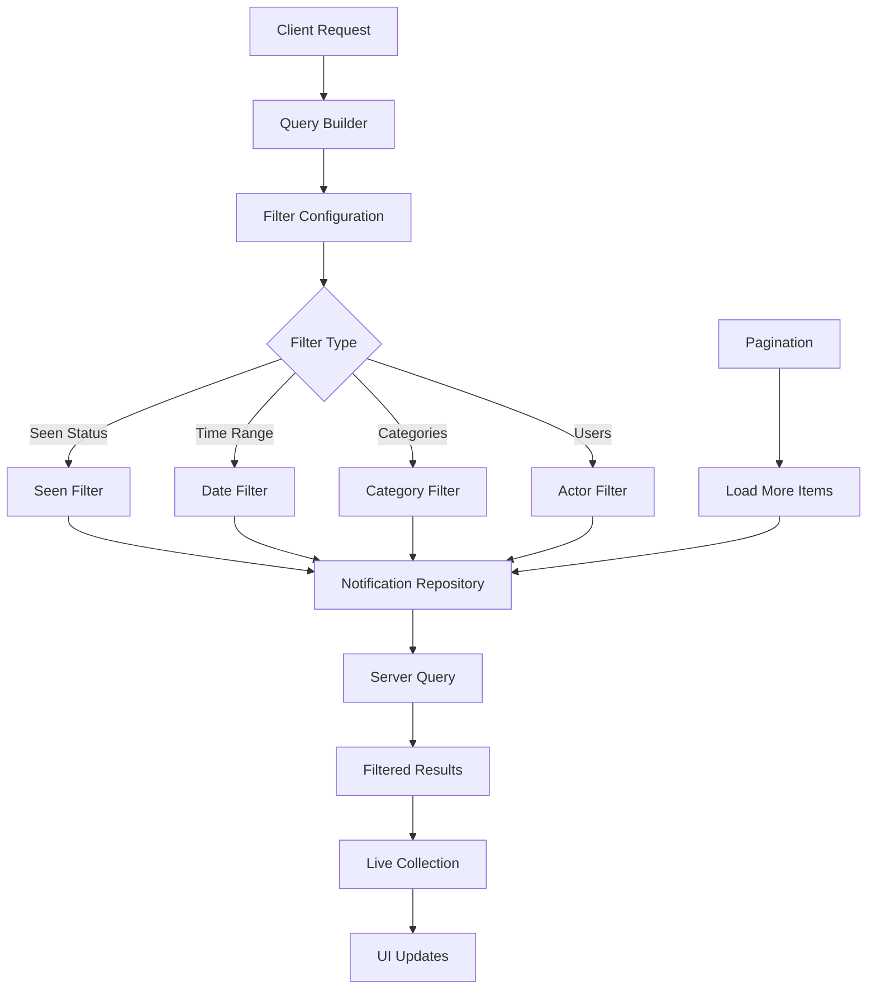

# Query Notification Tray Item

<CardGroup cols={2}>
  <Card title="Flexible Filtering" icon="filter">
    Query notifications with advanced filtering options for targeted retrieval
  </Card>
  <Card title="Pagination Support" icon="list">
    Efficiently handle large notification sets with built-in pagination
  </Card>
  <Card title="Real-time Updates" icon="arrows-rotate">
    Live collection updates for dynamic notification experiences
  </Card>
  <Card title="Multi-platform SDK" icon="mobile-screen">
    Consistent querying across iOS, Android, and Web platforms
  </Card>
</CardGroup>

## Overview

The **Query Notification Tray Item** feature allows you to retrieve and filter notification tray items with powerful querying capabilities. This functionality is essential for building dynamic notification interfaces that can display relevant notifications based on user preferences, seen status, and notification types.

## Architecture Overview



## Key Features

<AccordionGroup>
  <Accordion title="Advanced Filtering Options">
    <CardGroup cols={2}>
      <Card title="Seen Status Filtering" icon="eye">
        Filter notifications based on whether they have been seen or remain unread
      </Card>
      <Card title="Category-based Filtering" icon="tags">
        Query specific notification types such as posts, reactions, comments, or replies
      </Card>
      <Card title="Time-based Filtering" icon="clock">
        Retrieve notifications within specific date ranges or time periods
      </Card>
      <Card title="Actor-based Filtering" icon="users">
        Filter notifications by specific users or user groups
      </Card>
    </CardGroup>
  </Accordion>

  <Accordion title="Live Collection Features">
    - **Real-time Updates**: Automatic UI refresh when new notifications arrive
    - **Efficient Pagination**: Built-in support for loading additional items
    - **Smart Caching**: Optimized data retrieval and local storage
    - **State Management**: Automatic handling of loading and error states
  </Accordion>

  <Accordion title="Performance Optimizations">
    - **Lazy Loading**: Load notifications on-demand to improve performance
    - **Batch Operations**: Efficient handling of multiple notification updates
    - **Memory Management**: Automatic cleanup of unused notification data
    - **Network Optimization**: Minimal API calls with intelligent caching
  </Accordion>
</AccordionGroup>

## Query Configuration

<Tabs>
  <Tab title="Query Builder">
    <AccordionGroup>
      <Accordion title="Basic Query Options">
        **Required Parameters:**
        - `limit`: Maximum number of items to retrieve per page (default: 20, max: 100)
        
        **Optional Parameters:**
        - `includeDeleted`: Include soft-deleted notifications (default: false)
        - `sortBy`: Sort order - `lastOccurredAt` or `createdAt` (default: `lastOccurredAt`)
        - `sortDirection`: `asc` or `desc` (default: `desc`)
      </Accordion>

      <Accordion title="Filter Parameters">
        **Seen Status Filter:**
        - `seenStatus`: `seen`, `unseen`, or `all` (default: `all`)
        
        **Category Filter:**
        - `categories`: Array of notification categories to include
        - Available categories: `post`, `reaction`, `comment`, `reply`, `mention`
        
        **Time Range Filter:**
        - `startDate`: Filter notifications after this timestamp
        - `endDate`: Filter notifications before this timestamp
        
        **Actor Filter:**
        - `actorIds`: Array of user IDs to filter notifications by
      </Accordion>

      <Accordion title="Advanced Options">
        **Performance Settings:**
        - `enableRealTimeUpdates`: Enable live collection updates (default: true)
        - `cacheTimeout`: Cache expiration time in seconds (default: 300)
        
        **UI Configuration:**
        - `loadingBehavior`: `immediate` or `lazy` (default: `immediate`)
        - `errorRetryCount`: Number of retry attempts on failure (default: 3)
      </Accordion>
    </AccordionGroup>
  </Tab>

  <Tab title="Usage Examples">
    <CodeGroup>
      ```swift iOS Query Builder
      import AmitySDK
      
      class NotificationQueryManager {
          private let repository = AmityNotificationTrayRepository()
          private var liveCollection: AmityCollection<AmityNotificationTrayItem>?
          
          func setupBasicQuery() {
              // Basic query for recent notifications
              let query = AmityNotificationTrayQuery()
                  .limit(20)
                  .sortBy(.lastOccurredAt, direction: .descending)
              
              liveCollection = repository.getNotificationTrayItems(query: query)
              observeNotifications()
          }
          
          func setupAdvancedQuery() {
              // Advanced query with filters
              let query = AmityNotificationTrayQuery()
                  .limit(50)
                  .seenStatus(.unseen)
                  .categories([.post, .reaction, .comment])
                  .timeRange(startDate: Date().addingTimeInterval(-86400)) // Last 24 hours
              
              liveCollection = repository.getNotificationTrayItems(query: query)
              observeNotifications()
          }
          
          private func observeNotifications() {
              liveCollection?.observe { [weak self] collection, _, error in
                  DispatchQueue.main.async {
                      if let error = error {
                          self?.handleError(error)
                          return
                      }
                      
                      self?.updateUI(with: collection.object)
                  }
              }
          }
      }
      ```
      
      ```kotlin Android Query Builder
      import com.amity.socialcloud.sdk.AmityCoreClient
      
      class NotificationQueryManager {
          private val repository = AmityCoreClient.newNotificationRepository()
          private var liveCollection: AmityCollection<AmityNotificationTrayItem>? = null
          
          fun setupBasicQuery() {
              // Basic query for recent notifications
              val query = AmityNotificationTrayQuery.Builder()
                  .limit(20)
                  .sortBy(AmityNotificationTrayQuery.SortBy.LAST_OCCURRED_AT)
                  .sortDirection(AmityNotificationTrayQuery.SortDirection.DESC)
                  .build()
              
              liveCollection = repository.getNotificationTrayItems(query)
              observeNotifications()
          }
          
          fun setupAdvancedQuery() {
              // Advanced query with filters
              val categories = listOf(
                  AmityNotificationCategory.POST,
                  AmityNotificationCategory.REACTION,
                  AmityNotificationCategory.COMMENT
              )
              
              val startDate = System.currentTimeMillis() - 86400000 // Last 24 hours
              
              val query = AmityNotificationTrayQuery.Builder()
                  .limit(50)
                  .seenStatus(AmityNotificationSeenStatus.UNSEEN)
                  .categories(categories)
                  .startDate(Date(startDate))
                  .build()
              
              liveCollection = repository.getNotificationTrayItems(query)
              observeNotifications()
          }
          
          private fun observeNotifications() {
              liveCollection?.observe()?.subscribe({ collection ->
                  updateUI(collection.data)
              }, { error ->
                  handleError(error)
              })
          }
      }
      ```
      
      ```typescript TypeScript Query Builder
      import { 
          AmityNotificationTrayRepository, 
          AmityNotificationTrayQuery,
          AmityNotificationCategory,
          AmityNotificationSeenStatus
      } from '@amityco/ts-sdk';
      
      class NotificationQueryManager {
          private repository: AmityNotificationTrayRepository;
          
          constructor() {
              this.repository = new AmityNotificationTrayRepository();
          }
          
          setupBasicQuery() {
              // Basic query for recent notifications
              const query: AmityNotificationTrayQuery = {
                  limit: 20,
                  sortBy: 'lastOccurredAt',
                  sortDirection: 'desc'
              };
              
              const liveCollection = this.repository.getNotificationTrayItems(query);
              this.observeNotifications(liveCollection);
          }
          
          setupAdvancedQuery() {
              // Advanced query with filters
              const oneDayAgo = new Date(Date.now() - 86400000); // Last 24 hours
              
              const query: AmityNotificationTrayQuery = {
                  limit: 50,
                  seenStatus: AmityNotificationSeenStatus.UNSEEN,
                  categories: [
                      AmityNotificationCategory.POST,
                      AmityNotificationCategory.REACTION,
                      AmityNotificationCategory.COMMENT
                  ],
                  startDate: oneDayAgo
              };
              
              const liveCollection = this.repository.getNotificationTrayItems(query);
              this.observeNotifications(liveCollection);
          }
          
          private observeNotifications(liveCollection: any) {
              liveCollection.subscribe({
                  next: (collection: any) => {
                      this.updateUI(collection.data);
                  },
                  error: (error: any) => {
                      this.handleError(error);
                  }
              });
          }
      }
      ```

      ```dart Flutter Query Builder
      import 'package:amity_sdk/amity_sdk.dart';
      
      class NotificationQueryManager {
        late AmityNotificationTrayRepository _repository;
        AmityCollection<AmityNotificationTrayItem>? _liveCollection;
        
        NotificationQueryManager() {
          _repository = AmityCoreClient.newNotificationRepository();
        }
        
        void setupBasicQuery() {
          // Basic query for recent notifications
          final query = AmityNotificationTrayQueryBuilder()
              .limit(20)
              .sortBy(AmityNotificationSortBy.lastOccurredAt)
              .sortDirection(AmitySortDirection.descending)
              .build();
          
          _liveCollection = _repository.getNotificationTrayItems(query);
          _observeNotifications();
        }
        
        void setupAdvancedQuery() {
          // Advanced query with filters
          final oneDayAgo = DateTime.now().subtract(Duration(days: 1));
          
          final query = AmityNotificationTrayQueryBuilder()
              .limit(50)
              .seenStatus(AmityNotificationSeenStatus.unseen)
              .categories([
                AmityNotificationCategory.post,
                AmityNotificationCategory.reaction,
                AmityNotificationCategory.comment
              ])
              .startDate(oneDayAgo)
              .build();
          
          _liveCollection = _repository.getNotificationTrayItems(query);
          _observeNotifications();
        }
        
        void _observeNotifications() {
          _liveCollection?.listen((collection) {
            _updateUI(collection.data);
          }).onError((error) {
            _handleError(error);
          });
        }
      }
      ```
    </CodeGroup>
  </Tab>
</Tabs>

## Pagination Implementation

<Tabs>
  <Tab title="Load More Pattern">
    <CodeGroup>
      ```swift iOS Pagination
      class NotificationListViewController: UIViewController, UITableViewDataSource {
          private var notifications: [AmityNotificationTrayItem] = []
          private var liveCollection: AmityCollection<AmityNotificationTrayItem>?
          private var isLoading = false
          
          func loadMoreIfNeeded(at indexPath: IndexPath) {
              guard !isLoading,
                    indexPath.row >= notifications.count - 5, // Load more when 5 items from end
                    liveCollection?.hasNext == true else { return }
              
              isLoading = true
              liveCollection?.nextPage { [weak self] result in
                  DispatchQueue.main.async {
                      self?.isLoading = false
                      switch result {
                      case .success:
                          // Collection will update automatically through observer
                          break
                      case .failure(let error):
                          self?.handlePaginationError(error)
                      }
                  }
              }
          }
          
          // MARK: - UITableViewDataSource
          func tableView(_ tableView: UITableView, numberOfRowsInSection section: Int) -> Int {
              return notifications.count + (liveCollection?.hasNext == true ? 1 : 0) // +1 for loading cell
          }
          
          func tableView(_ tableView: UITableView, cellForRowAt indexPath: IndexPath) -> UITableViewCell {
              if indexPath.row >= notifications.count {
                  // Return loading cell
                  return tableView.dequeueReusableCell(withIdentifier: "LoadingCell", for: indexPath)
              }
              
              let cell = tableView.dequeueReusableCell(withIdentifier: "NotificationCell", for: indexPath)
              configureCell(cell, with: notifications[indexPath.row])
              return cell
          }
      }
      ```
      
      ```kotlin Android Pagination  
      class NotificationAdapter : RecyclerView.Adapter<RecyclerView.ViewHolder>() {
          private val notifications = mutableListOf<AmityNotificationTrayItem>()
          private var liveCollection: AmityCollection<AmityNotificationTrayItem>? = null
          private var isLoading = false
          
          companion object {
              private const val TYPE_NOTIFICATION = 0
              private const val TYPE_LOADING = 1
              private const val LOAD_MORE_THRESHOLD = 5
          }
          
          fun setLiveCollection(collection: AmityCollection<AmityNotificationTrayItem>) {
              this.liveCollection = collection
              collection.observe().subscribe({ collectionSnapshot ->
                  notifications.clear()
                  notifications.addAll(collectionSnapshot.data)
                  notifyDataSetChanged()
              }, { error ->
                  handleCollectionError(error)
              })
          }
          
          override fun getItemCount(): Int {
              return notifications.size + if (liveCollection?.hasNext() == true) 1 else 0
          }
          
          override fun getItemViewType(position: Int): Int {
              return if (position >= notifications.size) TYPE_LOADING else TYPE_NOTIFICATION
          }
          
          override fun onBindViewHolder(holder: RecyclerView.ViewHolder, position: Int) {
              when (holder.itemViewType) {
                  TYPE_NOTIFICATION -> {
                      val notificationHolder = holder as NotificationViewHolder
                      notificationHolder.bind(notifications[position])
                      
                      // Check if we need to load more
                      if (position >= notifications.size - LOAD_MORE_THRESHOLD) {
                          loadMoreIfNeeded()
                      }
                  }
                  TYPE_LOADING -> {
                      // Show loading indicator
                      loadMoreIfNeeded()
                  }
              }
          }
          
          private fun loadMoreIfNeeded() {
              if (!isLoading && liveCollection?.hasNext() == true) {
                  isLoading = true
                  liveCollection?.loadNext()?.subscribe({
                      isLoading = false
                  }, { error ->
                      isLoading = false
                      handlePaginationError(error)
                  })
              }
          }
      }
      ```
      
      ```typescript TypeScript Pagination
      class NotificationListManager {
          private notifications: AmityNotificationTrayItem[] = [];
          private liveCollection: any;
          private isLoading = false;
          private readonly LOAD_MORE_THRESHOLD = 5;
          
          constructor(private onUpdate: (notifications: AmityNotificationTrayItem[]) => void) {}
          
          setLiveCollection(collection: any) {
              this.liveCollection = collection;
              
              collection.subscribe({
                  next: (collectionData: any) => {
                      this.notifications = [...collectionData.data];
                      this.onUpdate(this.notifications);
                  },
                  error: (error: any) => {
                      this.handleCollectionError(error);
                  }
              });
          }
          
          async loadMoreIfNeeded(currentIndex: number) {
              if (this.isLoading || !this.liveCollection?.hasNext) {
                  return;
              }
              
              // Check if we're close to the end
              if (currentIndex >= this.notifications.length - this.LOAD_MORE_THRESHOLD) {
                  await this.loadNextPage();
              }
          }
          
          private async loadNextPage() {
              if (this.isLoading) return;
              
              this.isLoading = true;
              try {
                  await this.liveCollection.loadNext();
                  // Collection will update automatically through subscription
              } catch (error) {
                  this.handlePaginationError(error);
              } finally {
                  this.isLoading = false;
              }
          }
          
          getNotifications(): AmityNotificationTrayItem[] {
              return this.notifications;
          }
          
          hasNext(): boolean {
              return this.liveCollection?.hasNext || false;
          }
          
          isLoadingMore(): boolean {
              return this.isLoading;
          }
      }
      ```
    </CodeGroup>
  </Tab>

  <Tab title="React Hook Implementation">
    <CodeGroup>
      ```typescript useNotificationQuery Hook
      import { useState, useEffect, useCallback } from 'react';
      import { AmityNotificationTrayRepository, AmityNotificationTrayQuery } from '@amityco/ts-sdk';
      
      interface UseNotificationQueryOptions {
          query: AmityNotificationTrayQuery;
          autoLoad?: boolean;
      }
      
      export const useNotificationQuery = ({ query, autoLoad = true }: UseNotificationQueryOptions) => {
          const [notifications, setNotifications] = useState<AmityNotificationTrayItem[]>([]);
          const [isLoading, setIsLoading] = useState(false);
          const [isLoadingMore, setIsLoadingMore] = useState(false);
          const [error, setError] = useState<Error | null>(null);
          const [hasNext, setHasNext] = useState(false);
          
          const [repository] = useState(() => new AmityNotificationTrayRepository());
          const [liveCollection, setLiveCollection] = useState<any>(null);
          
          useEffect(() => {
              if (autoLoad) {
                  loadNotifications();
              }
          }, [query, autoLoad]);
          
          const loadNotifications = useCallback(async () => {
              setIsLoading(true);
              setError(null);
              
              try {
                  const collection = repository.getNotificationTrayItems(query);
                  setLiveCollection(collection);
                  
                  // Subscribe to collection updates
                  collection.subscribe({
                      next: (collectionData: any) => {
                          setNotifications(collectionData.data);
                          setHasNext(collectionData.hasNext);
                          setIsLoading(false);
                      },
                      error: (err: Error) => {
                          setError(err);
                          setIsLoading(false);
                      }
                  });
              } catch (err) {
                  setError(err as Error);
                  setIsLoading(false);
              }
          }, [query, repository]);
          
          const loadMore = useCallback(async () => {
              if (!liveCollection || !hasNext || isLoadingMore) {
                  return;
              }
              
              setIsLoadingMore(true);
              try {
                  await liveCollection.loadNext();
                  // Collection will update automatically through subscription
              } catch (err) {
                  setError(err as Error);
              } finally {
                  setIsLoadingMore(false);
              }
          }, [liveCollection, hasNext, isLoadingMore]);
          
          const refresh = useCallback(() => {
              loadNotifications();
          }, [loadNotifications]);
          
          return {
              notifications,
              isLoading,
              isLoadingMore,
              error,
              hasNext,
              loadMore,
              refresh
          };
      };
      
      // Usage Example
      function NotificationList() {
          const query: AmityNotificationTrayQuery = {
              limit: 20,
              seenStatus: 'all',
              sortBy: 'lastOccurredAt',
              sortDirection: 'desc'
          };
          
          const {
              notifications,
              isLoading,
              isLoadingMore,
              error,
              hasNext,
              loadMore,
              refresh
          } = useNotificationQuery({ query });
          
          if (isLoading) {
              return <div>Loading notifications...</div>;
          }
          
          if (error) {
              return <div>Error: {error.message}</div>;
          }
          
          return (
              <div>
                  <button onClick={refresh}>Refresh</button>
                  
                  {notifications.map((notification, index) => (
                      <NotificationItem 
                          key={notification.notificationId} 
                          notification={notification}
                          onVisible={() => {
                              // Load more when near the end
                              if (index >= notifications.length - 5) {
                                  loadMore();
                              }
                          }}
                      />
                  ))}
                  
                  {isLoadingMore && <div>Loading more...</div>}
                  {hasNext && !isLoadingMore && (
                      <button onClick={loadMore}>Load More</button>
                  )}
              </div>
          );
      }
      ```
    </CodeGroup>
  </Tab>
</Tabs>

## Best Practices

<AccordionGroup>
  <Accordion title="Query Optimization">
    ### Efficient Querying Strategies
    
    <CardGroup cols={2}>
      <Card title="Reasonable Page Sizes" icon="list">
        Use page sizes between 20-50 items to balance performance and user experience
      </Card>
      <Card title="Targeted Filtering" icon="filter">
        Apply specific filters to reduce data transfer and improve response times
      </Card>
      <Card title="Smart Caching" icon="database">
        Leverage built-in caching mechanisms to minimize unnecessary network requests
      </Card>
      <Card title="Progressive Loading" icon="spinner">
        Implement progressive loading for better perceived performance
      </Card>
    </CardGroup>
    
    ### Performance Guidelines
    
    ```typescript
    // ✅ Good: Reasonable page size with specific filtering
    const optimizedQuery = {
        limit: 25,
        seenStatus: 'unseen',
        categories: ['post', 'reaction'],
        startDate: new Date(Date.now() - 86400000) // Last 24 hours
    };
    
    // ❌ Avoid: Too large page size without filtering
    const inefficientQuery = {
        limit: 200, // Too large
        seenStatus: 'all', // Too broad
        // No time filtering - queries all historical data
    };
    ```
  </Accordion>

  <Accordion title="Error Handling Strategies">
    ### Robust Error Management
    
    <CardGroup cols={2}>
      <Card title="Network Failures" icon="wifi-slash">
        Implement retry logic with exponential backoff for network-related errors
      </Card>
      <Card title="Rate Limiting" icon="clock">
        Handle rate limiting gracefully with appropriate user feedback
      </Card>
      <Card title="Data Validation" icon="shield-check">
        Validate query parameters before sending requests
      </Card>
      <Card title="Graceful Degradation" icon="triangle-exclamation">
        Provide fallback experiences when queries fail
      </Card>
    </CardGroup>
    
    ### Implementation Pattern
    
    <CodeGroup>
      ```swift iOS Error Handling
      class NotificationErrorHandler {
          func handleQueryError(_ error: Error, retryAction: @escaping () -> Void) {
              switch error {
              case AmityError.networkError:
                  showRetryOption(retryAction)
              case AmityError.rateLimited:
                  showRateLimitMessage()
              case AmityError.invalidQuery:
                  logQueryValidationError(error)
                  showGenericError()
              default:
                  showGenericError()
              }
          }
          
          private func showRetryOption(_ retryAction: @escaping () -> Void) {
              let alert = UIAlertController(
                  title: "Connection Error",
                  message: "Unable to load notifications. Try again?",
                  preferredStyle: .alert
              )
              
              alert.addAction(UIAlertAction(title: "Retry", style: .default) { _ in
                  retryAction()
              })
              
              alert.addAction(UIAlertAction(title: "Cancel", style: .cancel))
              
              // Present alert
          }
      }
      ```
      
      ```kotlin Android Error Handling
      class NotificationErrorHandler {
          fun handleQueryError(error: Throwable, retryAction: () -> Unit) {
              when (error) {
                  is AmityException.NetworkException -> {
                      showRetryOption(retryAction)
                  }
                  is AmityException.RateLimitException -> {
                      showRateLimitMessage()
                  }
                  is AmityException.InvalidQueryException -> {
                      Log.e("NotificationQuery", "Invalid query parameters", error)
                      showGenericError()
                  }
                  else -> {
                      showGenericError()
                  }
              }
          }
          
          private fun showRetryOption(retryAction: () -> Unit) {
              AlertDialog.Builder(context)
                  .setTitle("Connection Error")
                  .setMessage("Unable to load notifications. Try again?")
                  .setPositiveButton("Retry") { _, _ -> retryAction() }
                  .setNegativeButton("Cancel", null)
                  .show()
          }
      }
      ```
    </CodeGroup>
  </Accordion>

  <Accordion title="Memory Management">
    ### Lifecycle Best Practices
    
    - **Proper Disposal**: Always dispose live collections when views are destroyed
    - **Weak References**: Use weak references to prevent retain cycles
    - **Background Processing**: Handle collection updates on appropriate threads
    - **Resource Cleanup**: Clean up observers and subscriptions appropriately
    
    ### Implementation Examples
    
    <CodeGroup>
      ```swift iOS Memory Management
      class NotificationViewController: UIViewController {
          private var liveCollection: AmityCollection<AmityNotificationTrayItem>?
          private var collectionToken: AmityNotificationToken?
          
          deinit {
              // Clean up resources
              collectionToken?.invalidate()
              liveCollection = nil
          }
          
          override func viewDidDisappear(_ animated: Bool) {
              super.viewDidDisappear(animated)
              
              // Pause updates when view is not visible
              if isMovingFromParent {
                  collectionToken?.invalidate()
              }
          }
      }
      ```
      
      ```kotlin Android Memory Management
      class NotificationFragment : Fragment() {
          private var liveCollection: AmityCollection<AmityNotificationTrayItem>? = null
          private var disposable: Disposable? = null
          
          override fun onDestroyView() {
              super.onDestroyView()
              
              // Clean up resources
              disposable?.dispose()
              liveCollection = null
          }
          
          override fun onPause() {
              super.onPause()
              
              // Pause updates when fragment is not visible
              disposable?.dispose()
          }
      }
      ```
    </CodeGroup>
  </Accordion>
</AccordionGroup>

## Use Cases

<CardGroup cols={2}>
  <Card title="Notification Feed" icon="list">
    Display a chronological list of all user notifications with filtering options
    
    **Implementation:**
    - Use basic query with time-based sorting
    - Enable real-time updates for live experience
    - Implement pagination for performance
  </Card>
  
  <Card title="Unread Badge Counter" icon="bell-exclamation">
    Show count of unseen notifications for UI badge indicators
    
    **Implementation:**
    - Query with `seenStatus: 'unseen'`
    - Use count from collection metadata
    - Refresh on app foreground/resume
  </Card>
  
  <Card title="Category-specific Views" icon="tags">
    Create separate views for different notification types
    
    **Implementation:**
    - Filter by specific categories
    - Create dedicated UI for each type
    - Optimize queries for targeted content
  </Card>
  
  <Card title="User Activity Timeline" icon="timeline">
    Show notifications from specific users or user groups
    
    **Implementation:**
    - Use actor-based filtering
    - Combine with time range filters
    - Enable cross-referencing with user profiles
  </Card>
</CardGroup>

## Error Handling

<AccordionGroup>
  <Accordion title="Common Error Scenarios">
    **Network Connectivity Issues:**
    - **Error**: Connection timeout or network unavailable
    - **Response**: Show offline indicator and retry options
    - **Recovery**: Implement exponential backoff retry strategy
    
    **Invalid Query Parameters:**
    - **Error**: Malformed query or invalid filter values
    - **Response**: Log validation errors and use fallback query
    - **Recovery**: Validate parameters before query execution
    
    **Rate Limiting:**
    - **Error**: Too many requests in short time period
    - **Response**: Display rate limit message to user
    - **Recovery**: Implement request throttling and queue management
    
    **Server Errors:**
    - **Error**: Internal server errors or maintenance
    - **Response**: Show maintenance message with status updates
    - **Recovery**: Implement graceful degradation and status checking
  </Accordion>

  <Accordion title="Error Recovery Patterns">
    <CodeGroup>
      ```swift iOS Error Recovery
      class NotificationQueryService {
          private let maxRetryAttempts = 3
          private var retryCount = 0
          
          func executeQueryWithRetry(query: AmityNotificationTrayQuery, completion: @escaping (Result<AmityCollection<AmityNotificationTrayItem>, Error>) -> Void) {
              
              let executeQuery = { [weak self] in
                  self?.repository.getNotificationTrayItems(query: query) { result in
                      switch result {
                      case .success(let collection):
                          self?.retryCount = 0 // Reset on success
                          completion(.success(collection))
                      case .failure(let error):
                          self?.handleQueryFailure(error, query: query, completion: completion)
                      }
                  }
              }
              
              executeQuery()
          }
          
          private func handleQueryFailure(_ error: Error, query: AmityNotificationTrayQuery, completion: @escaping (Result<AmityCollection<AmityNotificationTrayItem>, Error>) -> Void) {
              
              retryCount += 1
              
              if retryCount <= maxRetryAttempts && shouldRetry(error) {
                  let delay = pow(2.0, Double(retryCount)) // Exponential backoff
                  
                  DispatchQueue.main.asyncAfter(deadline: .now() + delay) { [weak self] in
                      self?.executeQueryWithRetry(query: query, completion: completion)
                  }
              } else {
                  retryCount = 0
                  completion(.failure(error))
              }
          }
          
          private func shouldRetry(_ error: Error) -> Bool {
              // Determine if error is retryable
              if case AmityError.networkError = error {
                  return true
              }
              return false
          }
      }
      ```
    </CodeGroup>
  </Accordion>
</AccordionGroup>

## Related Topics

<CardGroup cols={3}>
  <Card title="Mark Item as Seen" href="./mark-notification-tray-item-seen" icon="check">
    Update seen status for individual notification items
  </Card>
  <Card title="Global Tray Status" href="./get-notification-tray-seen" icon="bell">
    Manage overall notification tray seen state
  </Card>
  <Card title="Mark Tray as Seen" href="./mark-notification-tray-seen" icon="eye">
    Update global tray seen timestamp
  </Card>
</CardGroup>