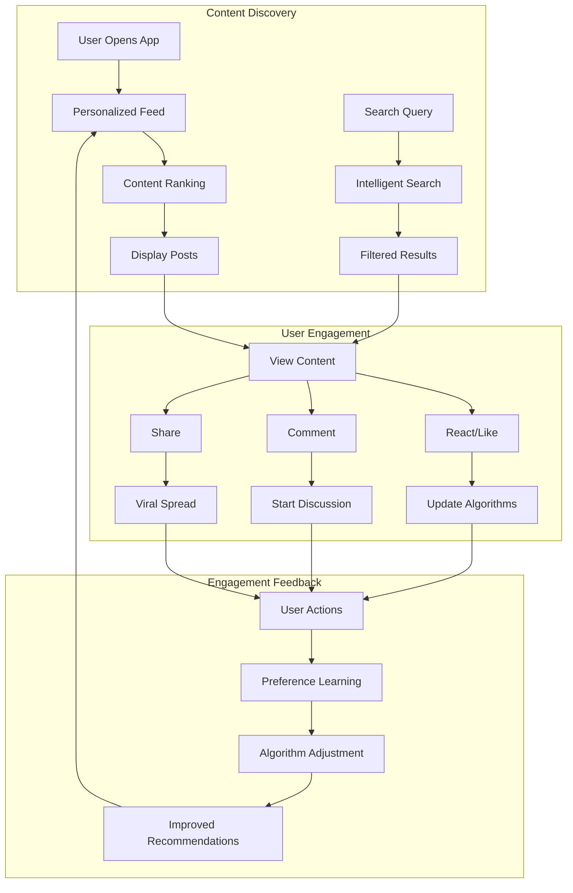

# Discovery & Engagement

Enhance user experience with powerful discovery and engagement tools. Help users find relevant content, stay connected with their interests, and actively participate in your social platform.

<CardGroup cols={2}>
  <Card title="Feeds & Timelines" icon="rss" href="feed/overview">
    Personalized content feeds with algorithmic ranking and customization
  </Card>
  <Card title="Search & Intelligence" icon="search" href="search/overview">
    Advanced search capabilities with intelligent filtering and recommendations
  </Card>
  <Card title="Reactions & Engagement" icon="heart" href="reactions/overview">
    Express emotions and engage with content through reactions and interactions
  </Card>
  <Card title="Notifications" icon="bell" href="notifications/overview">
    Keep users informed with real-time notifications and activity updates
  </Card>
  <Card title="Stories" icon="clock" href="stories/overview">
    Share ephemeral content with time-limited visibility and engagement tracking
  </Card>
</CardGroup>

## Discovery & Engagement Flow



## Core Features

<AccordionGroup>
  <Accordion title="Personalized Feeds">
    - **Algorithmic Ranking**: Smart content ordering based on user preferences
    - **Custom Feeds**: Create specialized feeds for different content types
    - **Real-time Updates**: Live content updates with new posts and reactions
    - **Feed Customization**: User-controlled feed preferences and filtering
  </Accordion>
  
  <Accordion title="Intelligent Search">
    - **Semantic Search**: Understand user intent beyond keyword matching
    - **Multi-type Search**: Search across posts, communities, and users
    - **Auto-suggestions**: Provide helpful search suggestions and completions
    - **Advanced Filters**: Filter by date, type, popularity, and more
  </Accordion>
  
  <Accordion title="Engagement Tools">
    - **Reaction System**: Express emotions with likes, loves, and custom reactions
    - **Story Features**: Share temporary content with engagement tracking
    - **Notification System**: Real-time alerts for important activities
    - **Social Sharing**: Share content across platforms and communities
  </Accordion>
  
  <Accordion title="Analytics & Insights">
    - **Engagement Metrics**: Track likes, comments, shares, and views
    - **Content Performance**: Analyze what content resonates with users
    - **User Behavior**: Understand how users discover and interact with content
    - **Trend Analysis**: Identify trending topics and viral content
  </Accordion>
</AccordionGroup>

## Implementation Guide

<Tabs>
  <Tab title="Basic Discovery">
    Set up essential discovery features:
    
    ```typescript
    // Set up global feed
    const globalFeed = AmitySDK.queryGlobalFeed({
      limit: 20,
      includeDeleted: false
    });
    
    // Basic search functionality
    const searchResults = AmitySDK.searchPosts({
      query: 'technology',
      limit: 10
    });
    
    // Simple reaction system
    await AmitySDK.addReaction({
      referenceId: 'post-id',
      referenceType: 'post',
      reactionName: 'like'
    });
    ```
  </Tab>
  
  <Tab title="Advanced Features">
    Implement sophisticated discovery and engagement:
    
    ```typescript
    // Custom feed with ranking
    const customFeed = AmitySDK.queryCustomFeed({
      userId: 'current-user-id',
      algorithm: 'personalized',
      sources: ['following', 'communities', 'trending'],
      limit: 30
    });
    
    // Intelligent search with filters
    const advancedSearch = AmitySDK.intelligentSearch({
      query: 'machine learning',
      types: ['posts', 'communities'],
      dateRange: { start: '2024-01-01', end: '2024-12-31' },
      sortBy: 'relevance',
      filters: {
        hasImages: true,
        minReactions: 10
      }
    });
    
    // Real-time notifications
    const notifications = AmitySDK.queryNotifications({
      userId: 'current-user-id',
      types: ['reactions', 'comments', 'mentions']
    });
    
    notifications.on('dataUpdated', (newNotifications) => {
      updateNotificationUI(newNotifications);
    });
    ```
  </Tab>
  
  <Tab title="Stories & Ephemeral">
    Implement stories and time-limited content:
    
    ```typescript
    // Create a story
    const story = await AmitySDK.createStory({
      imageFileId: 'story-image-id',
      duration: 24 * 60 * 60 * 1000, // 24 hours
      targets: [
        { type: 'global' },
        { type: 'community', id: 'community-id' }
      ]
    });
    
    // Get story feeds
    const globalStories = AmitySDK.getGlobalStories({
      limit: 20
    });
    
    const communityStories = AmitySDK.getCommunityStories({
      communityId: 'community-id',
      limit: 10
    });
    
    // Track story impressions
    await AmitySDK.trackStoryImpression({
      storyId: story.storyId,
      userId: 'viewer-user-id'
    });
    ```
  </Tab>
</Tabs>

## Best Practices

<AccordionGroup>
  <Accordion title="Content Discovery">
    - **Personalization**: Use user behavior to improve content recommendations
    - **Diversity**: Balance familiar and new content to prevent echo chambers
    - **Performance**: Optimize feed loading times and search responsiveness
    - **Accessibility**: Ensure discovery features work for all users
  </Accordion>
  
  <Accordion title="User Engagement">
    - **Meaningful Interactions**: Encourage quality engagement over quantity
    - **Timely Notifications**: Send relevant notifications without overwhelming users
    - **Social Proof**: Show engagement metrics to encourage participation
    - **Easy Actions**: Make liking, sharing, and commenting effortless
  </Accordion>
  
  <Accordion title="Algorithm Fairness">
    - **Transparent Ranking**: Provide users with some control over their feeds
    - **Bias Prevention**: Regularly audit algorithms for fairness and bias
    - **Creator Support**: Ensure content creators have fair reach opportunities
    - **User Choice**: Allow users to customize their discovery preferences
  </Accordion>
</AccordionGroup>

## Related Features

- **[Content Management](../content-management/overview)** - Create content that users can discover and engage with
- **[Communities & Spaces](../communities-spaces/overview)** - Build communities that enhance content discovery
- **[User Interactions](../user-interactions/overview)** - Enable social connections that drive engagement
