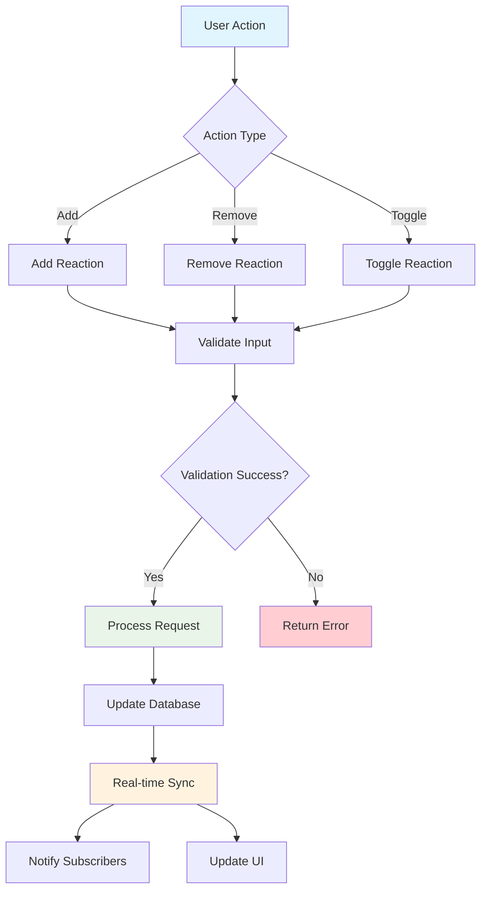
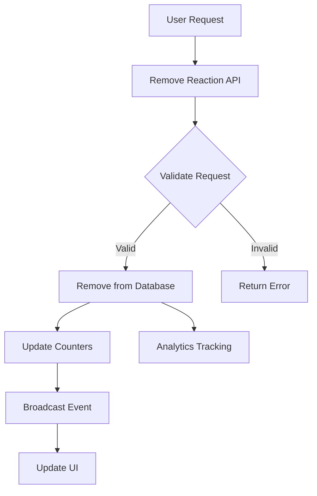

# Add & Remove Reactions

Enable users to express emotions and engage with content through comprehensive reaction management. Build expressive communities where users can add, modify, and remove reactions on posts, stories, comments, and messages with real-time synchronization.

## Architecture Overview



## Key Features

<CardGroup cols={2}>
  <Card title="Multi-Content Reactions" icon="heart">
    Add reactions to posts, stories, comments, and messages
  </Card>
  <Card title="Real-time Updates" icon="bolt">
    Instant reaction synchronization across all clients
  </Card>
  <Card title="Flexible Reaction Types" icon="face-smile">
    Support unlimited custom reaction types up to 100 characters
  </Card>
  <Card title="Optimistic Updates" icon="sync">
    Immediate UI feedback with automatic error handling
  </Card>
</CardGroup>

## Add Reaction

Enable users to express emotions and engagement through reactions. The `addReaction` function provides comprehensive support for all content types with real-time synchronization and optimistic UI updates.

### Parameters

<AccordionGroup>
  <Accordion title="reactionName">
    **Type:** `string`
    
    **Required:** Yes
    
    **Description:** Name of the reaction to add. Case-sensitive with maximum length of 100 characters.
    
    **Examples:** `"like"`, `"love"`, `"wow"`, `"celebrate"`, `"support"`
    
    **Validation:**
    - Maximum 100 characters
    - Case-sensitive ("like" ≠ "Like")
    - Alphanumeric and special characters allowed
  </Accordion>
  
  <Accordion title="referenceType">
    **Type:** `ReactionReferenceType`
    
    **Required:** Yes
    
    **Description:** Specifies the type of content to react to.
    
    **Valid Values:**
    - `POST` - React to posts in feeds and communities
    - `STORY` - React to ephemeral story content  
    - `COMMENT` - React to comments in discussions
    - `MESSAGE` - React to messages in chats
  </Accordion>
  
  <Accordion title="referenceId">
    **Type:** `string`
    
    **Required:** Yes
    
    **Description:** Unique identifier of the content to react to. Must correspond to existing content of the specified reference type.
  </Accordion>
  
  <Accordion title="callback">
    **Type:** `Function`
    
    **Required:** No (varies by platform)
    
    **Description:** Optional callback function to handle success/error responses. Returns reaction data on success.
  </Accordion>
</AccordionGroup>

### Implementation

<Tabs>
  <Tab title="iOS">
    <CodeGroup>
      ```swift Basic Reaction
      import AmitySDK
      
      class ReactionManager {
          private let reactionRepository: AmityReactionRepository
          
          init(client: AmityClient) {
              self.reactionRepository = AmityReactionRepository(client: client)
          }
          
          func addReaction(
              reactionName: String,
              referenceType: AmityReactionReferenceType,
              referenceId: String,
              completion: @escaping (Result<AmityReaction, Error>) -> Void
          ) {
              reactionRepository.addReaction(
                  reactionName,
                  referenceType: referenceType,
                  referenceId: referenceId
              ) { [weak self] success, error in
                  if success {
                      print("Reaction '\(reactionName)' added successfully")
                      self?.trackReactionAdded(reactionName: reactionName, referenceType: referenceType)
                      completion(.success(success))
                  } else {
                      print("Failed to add reaction: \(error?.localizedDescription ?? "Unknown error")")
                      completion(.failure(error ?? ReactionError.unknown))
                  }
              }
          }
          
          private func trackReactionAdded(reactionName: String, referenceType: AmityReactionReferenceType) {
              // Analytics tracking
              AnalyticsManager.shared.track("reaction_added", parameters: [
                  "reaction_name": reactionName,
                  "reference_type": referenceType.rawValue,
                  "timestamp": Date().timeIntervalSince1970
              ])
          }
      }
      ```
      
      ```swift Advanced Reaction with Validation
      class AdvancedReactionManager {
          private let reactionRepository: AmityReactionRepository
          private var reactionCache: Set<String> = []
          
          func addReactionWithValidation(
              reactionName: String,
              referenceType: AmityReactionReferenceType,
              referenceId: String,
              completion: @escaping (Result<AmityReaction, Error>) -> Void
          ) {
              // Validate reaction name
              guard validateReactionName(reactionName) else {
                  completion(.failure(ReactionError.invalidReactionName))
                  return
              }
              
              // Check for duplicate reaction
              let reactionKey = "\(referenceId)_\(reactionName)"
              guard !reactionCache.contains(reactionKey) else {
                  completion(.failure(ReactionError.duplicateReaction))
                  return
              }
              
              // Add to cache optimistically
              reactionCache.insert(reactionKey)
              
              reactionRepository.addReaction(
                  reactionName,
                  referenceType: referenceType,
                  referenceId: referenceId
              ) { [weak self] reaction, error in
                  if let reaction = reaction {
                      self?.handleReactionSuccess(reaction, reactionKey: reactionKey)
                      completion(.success(reaction))
                  } else {
                      // Remove from cache on failure
                      self?.reactionCache.remove(reactionKey)
                      self?.handleReactionError(error, reactionName: reactionName)
                      completion(.failure(error ?? ReactionError.unknown))
                  }
              }
          }
          
          private func validateReactionName(_ name: String) -> Bool {
              return !name.isEmpty && name.count <= 100
          }
          
          private func handleReactionSuccess(_ reaction: AmityReaction, reactionKey: String) {
              // Update UI optimistically
              NotificationCenter.default.post(
                  name: .reactionAdded,
                  object: reaction
              )
              
              // Track successful reaction
              AnalyticsManager.shared.track("reaction_success", parameters: [
                  "reaction_id": reaction.reactionId,
                  "reaction_name": reaction.reactionName
              ])
          }
      }
      ```
    </CodeGroup>
  </Tab>
  
  <Tab title="Android">
    <CodeGroup>
      ```kotlin Basic Reaction
      import com.amity.socialcloud.sdk.social.reaction.*
      
      class ReactionManager(private val client: AmityClient) {
          private val reactionRepository = AmityReactionRepository(client)
          
          fun addReaction(
              reactionName: String,
              referenceType: AmityReactionReferenceType,
              referenceId: String,
              callback: (Result<AmityReaction>) -> Unit
          ) {
              reactionRepository.addReaction(reactionName, referenceType, referenceId)
                  .observeOn(AndroidSchedulers.mainThread())
                  .subscribe(
                      { reaction ->
                          println("Reaction '$reactionName' added successfully")
                          trackReactionAdded(reactionName, referenceType)
                          callback(Result.success(reaction))
                      },
                      { error ->
                          println("Failed to add reaction: ${error.message}")
                          callback(Result.failure(RuntimeException(error)))
                      }
                  )
          }
          
          private fun trackReactionAdded(
              reactionName: String, 
              referenceType: AmityReactionReferenceType
          ) {
              AnalyticsManager.track("reaction_added", mapOf(
                  "reaction_name" to reactionName,
                  "reference_type" to referenceType.name,
                  "timestamp" to System.currentTimeMillis()
              ))
          }
      }
      ```
      
      ```kotlin Advanced Reaction with RxJava
      class AdvancedReactionManager(private val client: AmityClient) {
          private val reactionRepository = AmityReactionRepository(client)
          private val compositeDisposable = CompositeDisposable()
          private val reactionCache = mutableSetOf<String>()
          
          fun addReactionWithValidation(
              reactionName: String,
              referenceType: AmityReactionReferenceType,
              referenceId: String
          ): Single<AmityReaction> {
              return validateReactionInput(reactionName, referenceType, referenceId)
                  .flatMap { validationResult ->
                      if (validationResult.isValid) {
                          // Add to cache optimistically
                          val reactionKey = "${referenceId}_$reactionName"
                          reactionCache.add(reactionKey)
                          
                          reactionRepository.addReaction(reactionName, referenceType, referenceId)
                              .doOnSuccess { reaction ->
                                  handleReactionSuccess(reaction, reactionKey)
                              }
                              .doOnError { error ->
                                  // Remove from cache on failure
                                  reactionCache.remove(reactionKey)
                                  handleReactionError(error, reactionName)
                              }
                      } else {
                          Single.error(Exception(validationResult.error))
                      }
                  }
                  .subscribeOn(Schedulers.io())
                  .observeOn(AndroidSchedulers.mainThread())
          }
          
          private fun validateReactionInput(
              reactionName: String,
              referenceType: AmityReactionReferenceType,
              referenceId: String
          ): Single<ValidationResult> {
              return Single.fromCallable {
                  when {
                      reactionName.isEmpty() -> ValidationResult(false, "Reaction name cannot be empty")
                      reactionName.length > 100 -> ValidationResult(false, "Reaction name too long")
                      referenceId.isEmpty() -> ValidationResult(false, "Reference ID cannot be empty")
                      reactionCache.contains("${referenceId}_$reactionName") -> 
                          ValidationResult(false, "Duplicate reaction")
                      else -> ValidationResult(true, null)
                  }
              }
          }
          
          private fun handleReactionSuccess(reaction: AmityReaction, reactionKey: String) {
              // Broadcast reaction added event
              LocalBroadcastManager.getInstance(context).sendBroadcast(
                  Intent("REACTION_ADDED").putExtra("reaction", reaction)
              )
              
              // Track analytics
              AnalyticsManager.track("reaction_success", mapOf(
                  "reaction_id" to reaction.reactionId,
                  "reaction_name" to reaction.reactionName
              ))
          }
          
          fun cleanup() {
              compositeDisposable.clear()
          }
      }
      
      data class ValidationResult(val isValid: Boolean, val error: String?)
      ```
    </CodeGroup>
  </Tab>
  
  <Tab title="TypeScript">
    <CodeGroup>
      ```typescript Basic Reaction
      import { SocialClient, ReactionReferenceType } from '@amityco/ts-sdk';
      
      class ReactionManager {
          private client: SocialClient;
          
          constructor(client: SocialClient) {
              this.client = client;
          }
          
          async addReaction(
              reactionName: string,
              referenceType: ReactionReferenceType,
              referenceId: string
          ): Promise<Reaction> {
              try {
                  const reaction = await this.client.addReaction(
                      reactionName,
                      referenceType,
                      referenceId
                  );
                  
                  console.log(`Reaction '${reactionName}' added successfully`);
                  this.trackReactionAdded(reactionName, referenceType);
                  
                  return reaction;
              } catch (error) {
                  console.error('Failed to add reaction:', error);
                  throw error;
              }
          }
          
          private trackReactionAdded(
              reactionName: string, 
              referenceType: ReactionReferenceType
          ): void {
              if (typeof window !== 'undefined' && window.analytics) {
                  window.analytics.track('Reaction Added', {
                      reactionName,
                      referenceType,
                      timestamp: Date.now()
                  });
              }
          }
      }
      ```
      
      ```typescript React Hook for Reactions
      import { useState, useCallback } from 'react';
      import { ReactionReferenceType, Reaction } from '@amityco/ts-sdk';
      
      interface UseReactionResult {
          addReaction: (reactionName: string, referenceType: ReactionReferenceType, referenceId: string) => Promise<Reaction>;
          removeReaction: (reactionName: string, referenceType: ReactionReferenceType, referenceId: string) => Promise<void>;
          toggleReaction: (reactionName: string, referenceType: ReactionReferenceType, referenceId: string) => Promise<void>;
          isProcessing: boolean;
          error: string | null;
      }
      
      export const useReaction = (): UseReactionResult => {
          const [isProcessing, setIsProcessing] = useState(false);
          const [error, setError] = useState<string | null>(null);
          const [reactionCache] = useState(new Set<string>());
          
          const validateReactionInput = (
              reactionName: string,
              referenceId: string
          ): void => {
              if (!reactionName || reactionName.length === 0) {
                  throw new Error('Reaction name cannot be empty');
              }
              if (reactionName.length > 100) {
                  throw new Error('Reaction name cannot exceed 100 characters');
              }
              if (!referenceId) {
                  throw new Error('Reference ID is required');
              }
              
              const reactionKey = `${referenceId}_${reactionName}`;
              if (reactionCache.has(reactionKey)) {
                  throw new Error('Reaction already exists');
              }
          };
          
          const addReaction = useCallback(async (
              reactionName: string,
              referenceType: ReactionReferenceType,
              referenceId: string
          ): Promise<Reaction> => {
              setIsProcessing(true);
              setError(null);
              
              try {
                  validateReactionInput(reactionName, referenceId);
                  
                  // Optimistically add to cache
                  const reactionKey = `${referenceId}_${reactionName}`;
                  reactionCache.add(reactionKey);
                  
                  const reaction = await client.addReaction(
                      reactionName,
                      referenceType,
                      referenceId
                  );
                  
                  // Track success
                  trackReactionEvent('reaction_added', {
                      reactionName,
                      referenceType,
                      referenceId
                  });
                  
                  return reaction;
                  
              } catch (err) {
                  // Remove from cache on failure
                  const reactionKey = `${referenceId}_${reactionName}`;
                  reactionCache.delete(reactionKey);
                  
                  const errorMessage = err instanceof Error ? err.message : 'Unknown error';
                  setError(errorMessage);
                  throw err;
              } finally {
                  setIsProcessing(false);
              }
          }, [reactionCache]);
          
          const removeReaction = useCallback(async (
              reactionName: string,
              referenceType: ReactionReferenceType,
              referenceId: string
          ): Promise<void> => {
              setIsProcessing(true);
              setError(null);
              
              try {
                  await client.removeReaction(reactionName, referenceType, referenceId);
                  
                  // Remove from cache
                  const reactionKey = `${referenceId}_${reactionName}`;
                  reactionCache.delete(reactionKey);
                  
                  trackReactionEvent('reaction_removed', {
                      reactionName,
                      referenceType,
                      referenceId
                  });
                  
              } catch (err) {
                  const errorMessage = err instanceof Error ? err.message : 'Unknown error';
                  setError(errorMessage);
                  throw err;
              } finally {
                  setIsProcessing(false);
              }
          }, [reactionCache]);
          
          const toggleReaction = useCallback(async (
              reactionName: string,
              referenceType: ReactionReferenceType,
              referenceId: string
          ): Promise<void> => {
              const reactionKey = `${referenceId}_${reactionName}`;
              
              if (reactionCache.has(reactionKey)) {
                  await removeReaction(reactionName, referenceType, referenceId);
              } else {
                  await addReaction(reactionName, referenceType, referenceId);
              }
          }, [addReaction, removeReaction, reactionCache]);
          
          return {
              addReaction,
              removeReaction,
              toggleReaction,
              isProcessing,
              error
          };
      };
      
      // Helper function for analytics
      const trackReactionEvent = (
          eventName: string,
          properties: Record<string, any>
      ): void => {
          if (typeof window !== 'undefined' && window.analytics) {
              window.analytics.track(eventName, {
                  ...properties,
                  timestamp: Date.now()
              });
          }
      };
      ```
    </CodeGroup>
  </Tab>
  
  <Tab title="Flutter">
    <CodeGroup>
      ```dart Basic Reaction
      import 'package:amity_sdk/amity_sdk.dart';
      
      class ReactionManager {
        Future<AmityReaction> addReaction({
          required String reactionName,
          required AmityReactionReferenceType referenceType,
          required String referenceId,
        }) async {
          try {
            final reaction = await AmityReactionRepository()
                .addReaction(reactionName, referenceType, referenceId);
            
            print('Reaction \'$reactionName\' added successfully');
            _trackReactionAdded(reactionName, referenceType);
            
            return reaction;
          } catch (error) {
            print('Failed to add reaction: $error');
            rethrow;
          }
        }
        
        void _trackReactionAdded(
          String reactionName,
          AmityReactionReferenceType referenceType,
        ) {
          // Analytics tracking
          AnalyticsManager.track('reaction_added', {
            'reaction_name': reactionName,
            'reference_type': referenceType.name,
            'timestamp': DateTime.now().millisecondsSinceEpoch,
          });
        }
      }
      ```
      
      ```dart Provider Example
      import 'package:flutter/material.dart';
      import 'package:amity_sdk/amity_sdk.dart';
      
      class ReactionProvider extends ChangeNotifier {
        final Set<String> _reactionCache = <String>{};
        bool _isProcessing = false;
        String? _error;
        
        bool get isProcessing => _isProcessing;
        String? get error => _error;
        
        Future<AmityReaction> addReactionWithValidation({
          required String reactionName,
          required AmityReactionReferenceType referenceType,
          required String referenceId,
        }) async {
          // Validate input
          final validationError = _validateReactionInput(reactionName, referenceId);
          if (validationError != null) {
            _error = validationError;
            notifyListeners();
            throw Exception(validationError);
          }
          
          _isProcessing = true;
          _error = null;
          notifyListeners();
          
          try {
            // Optimistically add to cache
            final reactionKey = '${referenceId}_$reactionName';
            _reactionCache.add(reactionKey);
            
            final reaction = await AmityReactionRepository()
                .addReaction(reactionName, referenceType, referenceId);
            
            _handleReactionSuccess(reaction, reactionKey);
            
            return reaction;
            
          } catch (error) {
            // Remove from cache on failure
            final reactionKey = '${referenceId}_$reactionName';
            _reactionCache.remove(reactionKey);
            
            _error = error.toString();
            rethrow;
          } finally {
            _isProcessing = false;
            notifyListeners();
          }
        }
        
        String? _validateReactionInput(String reactionName, String referenceId) {
          if (reactionName.isEmpty) {
            return 'Reaction name cannot be empty';
          }
          if (reactionName.length > 100) {
            return 'Reaction name cannot exceed 100 characters';
          }
          if (referenceId.isEmpty) {
            return 'Reference ID is required';
          }
          
          final reactionKey = '${referenceId}_$reactionName';
          if (_reactionCache.contains(reactionKey)) {
            return 'Reaction already exists';
          }
          
          return null;
        }
        
        void _handleReactionSuccess(AmityReaction reaction, String reactionKey) {
          // Track analytics
          AnalyticsManager.track('reaction_success', {
            'reaction_id': reaction.reactionId,
            'reaction_name': reaction.reactionName,
          });
          
          // Notify listeners of successful reaction
          notifyListeners();
        }
        
        Future<void> removeReaction({
          required String reactionName,
          required AmityReactionReferenceType referenceType,
          required String referenceId,
        }) async {
          _isProcessing = true;
          _error = null;
          notifyListeners();
          
          try {
            await AmityReactionRepository()
                .removeReaction(reactionName, referenceType, referenceId);
            
            // Remove from cache
            final reactionKey = '${referenceId}_$reactionName';
            _reactionCache.remove(reactionKey);
            
            _trackReactionRemoved(reactionName, referenceType);
            
          } catch (error) {
            _error = error.toString();
            rethrow;
          } finally {
            _isProcessing = false;
            notifyListeners();
          }
        }
        
        Future<void> toggleReaction({
          required String reactionName,
          required AmityReactionReferenceType referenceType,
          required String referenceId,
        }) async {
          final reactionKey = '${referenceId}_$reactionName';
          
          if (_reactionCache.contains(reactionKey)) {
            await removeReaction(
              reactionName: reactionName,
              referenceType: referenceType,
              referenceId: referenceId,
            );
          } else {
            await addReactionWithValidation(
              reactionName: reactionName,
              referenceType: referenceType,
              referenceId: referenceId,
            );
          }
        }
        
        void _trackReactionRemoved(
          String reactionName,
          AmityReactionReferenceType referenceType,
        ) {
          AnalyticsManager.track('reaction_removed', {
            'reaction_name': reactionName,
            'reference_type': referenceType.name,
            'timestamp': DateTime.now().millisecondsSinceEpoch,
          });
        }
        
        void clearError() {
          _error = null;
          notifyListeners();
        }
        
        bool hasReaction(String referenceId, String reactionName) {
          return _reactionCache.contains('${referenceId}_$reactionName');
        }
      }
      ```
    </CodeGroup>
  </Tab>
</Tabs>

## Remove Reaction

The `removeReaction` function allows users to remove a previously added reaction from content. This provides users with greater control over their engagement and allows them to change their minds or update their reactions over time.

### Architecture



### Features

<CardGroup cols={2}>
  <Card title="Instant Removal" icon="times-circle">
    Remove reactions immediately with real-time updates
  </Card>
  <Card title="Reference Support" icon="link">
    Remove reactions from posts, stories, comments, and messages
  </Card>
  <Card title="Analytics Tracking" icon="chart-line">
    Track removal patterns and user engagement metrics
  </Card>
  <Card title="Error Handling" icon="shield-check">
    Comprehensive validation and error management
  </Card>
</CardGroup>

### Parameters

<AccordionGroup>
  <Accordion title="reactionName">
    **Type:** `string`
    
    **Required:** Yes
    
    **Description:** The name of the reaction to remove. Names are case-sensitive (e.g., "like" vs "Like" are different reactions).
    
    **Example:** `"like"`, `"love"`, `"angry"`
  </Accordion>
  
  <Accordion title="referenceType">
    **Type:** `ReactionReferenceType`
    
    **Required:** Yes
    
    **Description:** Specifies the type of content to remove reaction from.
    
    **Valid Values:**
    - `POST` - Remove reaction from posts
    - `STORY` - Remove reaction from story content  
    - `COMMENT` - Remove reaction from comments
    - `MESSAGE` - Remove reaction from messages
  </Accordion>
  
  <Accordion title="referenceId">
    **Type:** `string`
    
    **Required:** Yes
    
    **Description:** Unique identifier of the content to remove reaction from.
  </Accordion>
</AccordionGroup>

### Implementation

<Tabs>
  <Tab title="iOS">
    <CodeGroup>
      ```swift Basic Removal
      import AmitySDK
      
      class ReactionManager {
          private let reactionRepository: AmityReactionRepository
          
          init(client: AmityClient) {
              self.reactionRepository = AmityReactionRepository(client: client)
          }
          
          func removeReaction(
              reactionName: String,
              referenceType: AmityReactionReferenceType,
              referenceId: String,
              completion: @escaping (Result<Bool, Error>) -> Void
          ) {
              reactionRepository.removeReaction(
                  reactionName,
                  referenceType: referenceType,
                  referenceId: referenceId
              ) { [weak self] success, error in
                  if success {
                      print("Reaction '\(reactionName)' removed successfully")
                      self?.trackReactionRemoved(reactionName: reactionName, referenceType: referenceType)
                      completion(.success(true))
                  } else {
                      print("Failed to remove reaction: \(error?.localizedDescription ?? "Unknown error")")
                      completion(.failure(error ?? ReactionError.unknown))
                  }
              }
          }
          
          private func trackReactionRemoved(reactionName: String, referenceType: AmityReactionReferenceType) {
              AnalyticsManager.shared.track("reaction_removed", parameters: [
                  "reaction_name": reactionName,
                  "reference_type": referenceType.rawValue,
                  "timestamp": Date().timeIntervalSince1970
              ])
          }
      }
      ```
      
      ```swift Advanced Removal with Cache Management
      class AdvancedReactionManager {
          private let reactionRepository: AmityReactionRepository
          private var reactionCache: Set<String> = []
          
          func removeReactionWithCacheUpdate(
              reactionName: String,
              referenceType: AmityReactionReferenceType,
              referenceId: String,
              completion: @escaping (Result<Bool, Error>) -> Void
          ) {
              let reactionKey = "\(referenceId)_\(reactionName)"
              
              // Check if reaction exists in cache
              guard reactionCache.contains(reactionKey) else {
                  completion(.failure(ReactionError.reactionNotFound))
                  return
              }
              
              // Remove from cache optimistically
              reactionCache.remove(reactionKey)
              
              reactionRepository.removeReaction(
                  reactionName,
                  referenceType: referenceType,
                  referenceId: referenceId
              ) { [weak self] success, error in
                  if success {
                      self?.handleRemovalSuccess(reactionName: reactionName, referenceType: referenceType)
                      completion(.success(true))
                  } else {
                      // Re-add to cache on failure
                      self?.reactionCache.insert(reactionKey)
                      self?.handleRemovalError(error, reactionName: reactionName)
                      completion(.failure(error ?? ReactionError.unknown))
                  }
              }
          }
          
          private func handleRemovalSuccess(reactionName: String, referenceType: AmityReactionReferenceType) {
              // Update UI
              NotificationCenter.default.post(
                  name: .reactionRemoved,
                  object: nil,
                  userInfo: ["reactionName": reactionName, "referenceType": referenceType]
              )
          }
          
          private func handleRemovalError(_ error: Error?, reactionName: String) {
              print("Failed to remove reaction '\(reactionName)': \(error?.localizedDescription ?? "Unknown error")")
              // Show user feedback
              NotificationCenter.default.post(
                  name: .reactionRemovalFailed,
                  object: nil,
                  userInfo: ["error": error?.localizedDescription ?? "Unknown error"]
              )
          }
      }
      ```
    </CodeGroup>
  </Tab>
  
  <Tab title="Android">
    <CodeGroup>
      ```kotlin Basic Removal
      import com.amity.socialcloud.sdk.AmityClient
      import com.amity.socialcloud.sdk.model.social.reaction.AmityReactionRepository
      import com.amity.socialcloud.sdk.model.social.reaction.AmityReactionReferenceType
      
      class ReactionManager(private val client: AmityClient) {
          private val reactionRepository = AmityReactionRepository(client)
          
          fun removeReaction(
              reactionName: String,
              referenceType: AmityReactionReferenceType,
              referenceId: String
          ): Completable {
              return reactionRepository.removeReaction(reactionName, referenceType, referenceId)
                  .doOnComplete {
                      Log.d("ReactionManager", "Reaction '$reactionName' removed successfully")
                      trackReactionRemoved(reactionName, referenceType)
                  }
                  .doOnError { error ->
                      Log.e("ReactionManager", "Failed to remove reaction: ${error.message}")
                  }
          }
          
          private fun trackReactionRemoved(reactionName: String, referenceType: AmityReactionReferenceType) {
              AnalyticsManager.track("reaction_removed", mapOf(
                  "reaction_name" to reactionName,
                  "reference_type" to referenceType.name,
                  "timestamp" to System.currentTimeMillis()
              ))
          }
      }
      ```
      
      ```kotlin Advanced Removal with Validation
      class AdvancedReactionManager(private val client: AmityClient) {
          private val reactionRepository = AmityReactionRepository(client)
          private val reactionCache = mutableSetOf<String>()
          
          fun removeReactionWithValidation(
              reactionName: String,
              referenceType: AmityReactionReferenceType,
              referenceId: String
          ): Completable {
              val reactionKey = "${referenceId}_$reactionName"
              
              return Completable.fromAction {
                  // Validate reaction exists
                  if (!reactionCache.contains(reactionKey)) {
                      throw ReactionNotFoundException("Reaction not found: $reactionName")
                  }
                  
                  // Remove from cache optimistically
                  reactionCache.remove(reactionKey)
              }
              .andThen(
                  reactionRepository.removeReaction(reactionName, referenceType, referenceId)
                      .doOnComplete {
                          handleRemovalSuccess(reactionName, referenceType)
                      }
                      .doOnError { error ->
                          // Re-add to cache on failure
                          reactionCache.add(reactionKey)
                          handleRemovalError(error, reactionName)
                      }
              )
          }
          
          private fun handleRemovalSuccess(reactionName: String, referenceType: AmityReactionReferenceType) {
              // Broadcast success event
              LocalBroadcastManager.getInstance(context).sendBroadcast(
                  Intent("REACTION_REMOVED").apply {
                      putExtra("reaction_name", reactionName)
                      putExtra("reference_type", referenceType.name)
                  }
              )
          }
          
          private fun handleRemovalError(error: Throwable, reactionName: String) {
              Log.e("ReactionManager", "Failed to remove reaction '$reactionName'", error)
              // Show user feedback
              EventBus.getDefault().post(ReactionRemovalErrorEvent(error.message))
          }
      }
      ```
    </CodeGroup>
  </Tab>
  
  <Tab title="TypeScript">
    <CodeGroup>
      ```typescript Basic Removal
      import { AmityClient, ReactionReferenceType } from '@amityco/ts-sdk';
      
      class ReactionManager {
          constructor(private client: AmityClient) {}
          
          async removeReaction(
              reactionName: string,
              referenceType: ReactionReferenceType,
              referenceId: string
          ): Promise<boolean> {
              try {
                  const result = await this.client.removeReaction(
                      reactionName,
                      referenceType,
                      referenceId
                  );
                  
                  console.log(`Reaction '${reactionName}' removed successfully`);
                  this.trackReactionRemoved(reactionName, referenceType);
                  
                  return result;
              } catch (error) {
                  console.error('Failed to remove reaction:', error);
                  throw error;
              }
          }
          
          private trackReactionRemoved(reactionName: string, referenceType: ReactionReferenceType): void {
              // Analytics tracking
              analytics.track('reaction_removed', {
                  reaction_name: reactionName,
                  reference_type: referenceType,
                  timestamp: Date.now()
              });
          }
      }
      ```
      
      ```typescript Advanced Removal with State Management
      interface ReactionState {
          reactions: Set<string>;
          isLoading: boolean;
      }
      
      class AdvancedReactionManager {
          private state: ReactionState = {
              reactions: new Set(),
              isLoading: false
          };
          
          constructor(private client: AmityClient) {}
          
          async removeReactionWithStateManagement(
              reactionName: string,
              referenceType: ReactionReferenceType,
              referenceId: string
          ): Promise<boolean> {
              const reactionKey = `${referenceId}_${reactionName}`;
              
              // Validate reaction exists
              if (!this.state.reactions.has(reactionKey)) {
                  throw new Error(`Reaction '${reactionName}' not found`);
              }
              
              this.state.isLoading = true;
              
              try {
                  // Remove from state optimistically
                  this.state.reactions.delete(reactionKey);
                  
                  const result = await this.client.removeReaction(
                      reactionName,
                      referenceType,
                      referenceId
                  );
                  
                  this.handleRemovalSuccess(reactionName, referenceType);
                  return result;
              } catch (error) {
                  // Revert state on failure
                  this.state.reactions.add(reactionKey);
                  this.handleRemovalError(error as Error, reactionName);
                  throw error;
              } finally {
                  this.state.isLoading = false;
              }
          }
          
          private handleRemovalSuccess(reactionName: string, referenceType: ReactionReferenceType): void {
              // Emit success event
              document.dispatchEvent(new CustomEvent('reactionRemoved', {
                  detail: { reactionName, referenceType }
              }));
          }
          
          private handleRemovalError(error: Error, reactionName: string): void {
              console.error(`Failed to remove reaction '${reactionName}':`, error);
              // Emit error event
              document.dispatchEvent(new CustomEvent('reactionRemovalError', {
                  detail: { error: error.message, reactionName }
              }));
          }
      }
      ```
    </CodeGroup>
  </Tab>
  
  <Tab title="Flutter">
    <CodeGroup>
      ```dart Basic Removal
      import 'package:amity_sdk/amity_sdk.dart';
      
      class ReactionManager {
          
          Future<void> removeReaction({
              required String reactionName,
              required String referenceType,
              required String referenceId,
          }) async {
              try {
                  // Remove reaction based on reference type
                  switch (referenceType.toLowerCase()) {
                      case 'post':
                          await AmityReaction.removePostReaction(
                              postId: referenceId,
                              reactionName: reactionName,
                          );
                          break;
                      case 'comment':
                          await AmityReaction.removeCommentReaction(
                              commentId: referenceId,
                              reactionName: reactionName,
                          );
                          break;
                      case 'story':
                          await AmityReaction.removeStoryReaction(
                              storyId: referenceId,
                              reactionName: reactionName,
                          );
                          break;
                      case 'message':
                          await AmityReaction.removeMessageReaction(
                              messageId: referenceId,
                              reactionName: reactionName,
                          );
                          break;
                      default:
                          throw ArgumentError('Unsupported reference type: $referenceType');
                  }
                  
                  print('Reaction "$reactionName" removed successfully');
                  _trackReactionRemoved(reactionName, referenceType);
              } catch (error) {
                  print('Failed to remove reaction: $error');
                  rethrow;
              }
          }
          
          void _trackReactionRemoved(String reactionName, String referenceType) {
              // Analytics tracking
              AnalyticsManager.track('reaction_removed', {
                  'reaction_name': reactionName,
                  'reference_type': referenceType,
                  'timestamp': DateTime.now().millisecondsSinceEpoch,
              });
          }
      }
      ```
      
      ```dart Advanced Removal with State Management
      class AdvancedReactionManager extends ChangeNotifier {
          final Set<String> _reactionCache = <String>{};
          bool _isLoading = false;
          
          bool get isLoading => _isLoading;
          
          Future<void> removeReactionWithValidation({
              required String reactionName,
              required String referenceType,
              required String referenceId,
          }) async {
              final reactionKey = '${referenceId}_$reactionName';
              
              // Validate reaction exists
              if (!_reactionCache.contains(reactionKey)) {
                  throw StateError('Reaction "$reactionName" not found');
              }
              
              _isLoading = true;
              notifyListeners();
              
              try {
                  // Remove from cache optimistically
                  _reactionCache.remove(reactionKey);
                  notifyListeners();
                  
                  await removeReaction(
                      reactionName: reactionName,
                      referenceType: referenceType,
                      referenceId: referenceId,
                  );
                  
                  _handleRemovalSuccess(reactionName, referenceType);
              } catch (error) {
                  // Re-add to cache on failure
                  _reactionCache.add(reactionKey);
                  _handleRemovalError(error, reactionName);
                  notifyListeners();
                  rethrow;
              } finally {
                  _isLoading = false;
                  notifyListeners();
              }
          }
          
          void _handleRemovalSuccess(String reactionName, String referenceType) {
              // Show success feedback
              ScaffoldMessenger.of(context).showSnackBar(
                  SnackBar(content: Text('Reaction "$reactionName" removed')),
              );
          }
          
          void _handleRemovalError(dynamic error, String reactionName) {
              print('Failed to remove reaction "$reactionName": $error');
              // Show error feedback
              ScaffoldMessenger.of(context).showSnackBar(
                  SnackBar(
                      content: Text('Failed to remove reaction'),
                      backgroundColor: Colors.red,
                  ),
              );
          }
          
          bool hasReaction(String referenceId, String reactionName) {
              return _reactionCache.contains('${referenceId}_$reactionName');
          }
      }
      ```
    </CodeGroup>
  </Tab>
</Tabs>

## Best Practices

<CardGroup cols={2}>
  <Card title="Optimistic Updates" icon="zap">
    Update UI immediately while processing the reaction in the background for better user experience.
  </Card>
  <Card title="Error Handling" icon="exclamation-triangle">
    Always implement proper error handling and provide user feedback for failed operations.
  </Card>
  <Card title="State Management" icon="database">
    Maintain local reaction state to prevent duplicate operations and enable offline functionality.
  </Card>
  <Card title="Analytics Tracking" icon="chart-bar">
    Track reaction patterns to understand user engagement and improve content strategy.
  </Card>
</CardGroup>

### Implementation Guidelines

<AccordionGroup>
  <Accordion title="Validation and Error Handling">
    - Always validate reaction names and reference IDs before making API calls
    - Implement proper error handling for network failures and invalid requests
    - Provide meaningful error messages to users
    - Use try-catch blocks to handle exceptions gracefully
  </Accordion>
  
  <Accordion title="Performance Optimization">
    - Implement caching to track existing reactions and prevent redundant API calls
    - Use debouncing for rapid add/remove operations
    - Consider implementing offline support with sync when connection is restored
    - Batch multiple reaction operations when possible
  </Accordion>
  
  <Accordion title="User Experience">
    - Provide immediate visual feedback when reactions are added or removed
    - Show loading states during API operations
    - Handle edge cases like network failures gracefully
    - Allow users to undo reaction changes within a reasonable time window
  </Accordion>
  
  <Accordion title="Analytics and Monitoring">
    - Track reaction addition and removal events for engagement analysis
    - Monitor API response times and error rates
    - Log user interaction patterns to improve UX
    - Implement A/B testing for different reaction UI designs
  </Accordion>
</AccordionGroup>

## Use Cases

<Tabs>
  <Tab title="Social Feed">
    Enable users to react to posts in social feeds with various emotion types like likes, loves, and reactions.
    
    **Example:** A photo-sharing app where users can react to friends' photos with different emotions.
  </Tab>
  
  <Tab title="Comment System">
    Allow reactions on individual comments to show agreement, disagreement, or appreciation.
    
    **Example:** A discussion forum where users can react to specific comments to show support.
  </Tab>
  
  <Tab title="Story Interactions">
    Enable quick reactions to ephemeral story content for immediate engagement feedback.
    
    **Example:** A social media app where users can react to stories with emojis.
  </Tab>
  
  <Tab title="Chat Messages">
    Allow users to react to messages in group chats for non-verbal communication.
    
    **Example:** A team communication app where users can react to messages with thumbs up or other emojis.
  </Tab>
</Tabs>

## Error Handling

<AccordionGroup>
  <Accordion title="Common Error Types">
    - **Network Errors**: Handle offline scenarios and poor connectivity
    - **Validation Errors**: Invalid reaction names or reference IDs
    - **Permission Errors**: User lacks permission to react to content
    - **Rate Limiting**: Too many reactions added/removed too quickly
  </Accordion>
  
  <Accordion title="Error Response Examples">
    ```json
    {
      "error": {
        "code": "REACTION_NOT_FOUND",
        "message": "The specified reaction does not exist",
        "details": {
          "reactionName": "like",
          "referenceId": "post_123"
        }
      }
    }
    ```
  </Accordion>
  
  <Accordion title="Recovery Strategies">
    - Implement retry logic with exponential backoff
    - Provide fallback UI states for failed operations  
    - Cache operations for offline execution when connection is restored
    - Show appropriate error messages based on error type
  </Accordion>
</AccordionGroup>