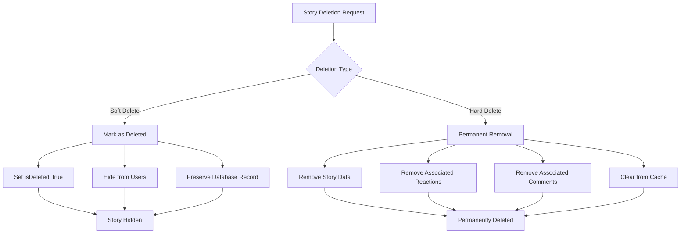

# Delete Story

Manage story lifecycle with powerful deletion capabilities supporting both soft and hard deletion patterns for different content management needs.

## Architecture Overview



## Feature Summary

<CardGroup cols={2}>
  <Card title="Soft Delete" icon="eye-slash">
    Mark stories as deleted while preserving data for potential recovery
  </Card>
  <Card title="Hard Delete" icon="trash">
    Permanently remove stories and all associated data from the system
  </Card>
  <Card title="Cache Management" icon="database">
    Automatically handle unsynced story removal from local cache
  </Card>
  <Card title="Data Integrity" icon="shield">
    Maintain referential integrity during deletion operations
  </Card>
</CardGroup>

## Deletion Types Comparison

| Feature | Soft Delete | Hard Delete |
|---------|-------------|-------------|
| **Data Preservation** | ✅ Preserved in database | ❌ Permanently removed |
| **User Visibility** | ❌ Hidden from users | ❌ Completely removed |
| **Associated Data** | ✅ Reactions/comments preserved | ❌ All data removed |
| **Recovery** | ✅ Can be restored | ❌ Cannot be recovered |
| **Performance** | 🟡 Requires filtering | ✅ No database overhead |
| **Compliance** | 🟡 May not meet strict requirements | ✅ Meets data deletion requirements |

## Soft Delete Story

The `softDeleteStory()` function marks a story as deleted while preserving all data in the database. The story becomes invisible to users but can potentially be restored later.

### Parameters

<AccordionGroup>
  <Accordion title="storyId (required)">
    **Type:** `string`
    
    The unique identifier of the story to soft delete.
    
    **Validation:**
    - Must be a valid story ID
    - Story must exist and be accessible by the current user
    - User must have deletion permissions for the story
  </Accordion>
</AccordionGroup>

### Implementation

<Tabs>
  <Tab title="iOS">
    <CodeGroup>
      ```swift Basic Soft Delete
      import AmitySDK
      
      class StoryDeletionManager {
          func softDeleteStory(storyId: String) {
              AmityManager.shared.client.softDeleteStory(storyId) { [weak self] result in
                  switch result {
                  case .success:
                      print("Story soft deleted successfully")
                      self?.handleSoftDeleteSuccess(storyId: storyId)
                      
                  case .failure(let error):
                      print("Failed to soft delete story: \(error.localizedDescription)")
                      self?.handleSoftDeleteError(error: error)
                  }
              }
          }
          
          private func handleSoftDeleteSuccess(storyId: String) {
              // Update UI to reflect story deletion
              // Remove from local cache if needed
              NotificationCenter.default.post(
                  name: .storyDeleted,
                  object: nil,
                  userInfo: ["storyId": storyId, "type": "soft"]
              )
          }
          
          private func handleSoftDeleteError(error: Error) {
              // Show error message to user
              // Log error for debugging
              DispatchQueue.main.async {
                  // Update UI with error state
              }
          }
      }
      
      extension Notification.Name {
          static let storyDeleted = Notification.Name("StoryDeleted")
      }
      ```

      ```swift With Confirmation Dialog
      import AmitySDK
      import UIKit
      
      class StoryViewController: UIViewController {
          func showSoftDeleteConfirmation(for storyId: String) {
              let alert = UIAlertController(
                  title: "Hide Story",
                  message: "This will hide the story from other users. You can restore it later if needed.",
                  preferredStyle: .alert
              )
              
              alert.addAction(UIAlertAction(title: "Cancel", style: .cancel))
              alert.addAction(UIAlertAction(title: "Hide Story", style: .destructive) { _ in
                  self.performSoftDelete(storyId: storyId)
              })
              
              present(alert, animated: true)
          }
          
          private func performSoftDelete(storyId: String) {
              showLoadingIndicator()
              
              AmityManager.shared.client.softDeleteStory(storyId) { [weak self] result in
                  DispatchQueue.main.async {
                      self?.hideLoadingIndicator()
                      
                      switch result {
                      case .success:
                          self?.showSuccessMessage("Story hidden successfully")
                          self?.removeStoryFromUI(storyId: storyId)
                          
                      case .failure(let error):
                          self?.showErrorMessage("Failed to hide story: \(error.localizedDescription)")
                      }
                  }
              }
          }
      }
      ```
    </CodeGroup>
  </Tab>
  
  <Tab title="Android">
    <CodeGroup>
      ```kotlin Basic Soft Delete
      import com.amity.socialcloud.sdk.AmityCoreClient
      import com.amity.socialcloud.sdk.story.AmityStoryRepository
      
      class StoryDeletionManager {
          private val storyRepository = AmityCoreClient.newStoryRepository()
          
          fun softDeleteStory(storyId: String) {
              storyRepository.softDeleteStory(storyId)
                  .subscribe({ 
                      handleSoftDeleteSuccess(storyId)
                  }, { error ->
                      handleSoftDeleteError(error)
                  })
          }
          
          private fun handleSoftDeleteSuccess(storyId: String) {
              // Update UI to reflect story deletion
              // Notify other components
              println("Story soft deleted successfully: $storyId")
              
              // Broadcast deletion event
              val intent = Intent("STORY_DELETED").apply {
                  putExtra("storyId", storyId)
                  putExtra("type", "soft")
              }
              LocalBroadcastManager.getInstance(context).sendBroadcast(intent)
          }
          
          private fun handleSoftDeleteError(error: Throwable) {
              println("Failed to soft delete story: ${error.message}")
              // Show error message to user
              // Log error for debugging
          }
      }
      ```

      ```kotlin With RxJava and Error Handling
      import com.amity.socialcloud.sdk.AmityCoreClient
      import io.reactivex.rxjava3.android.schedulers.AndroidSchedulers
      import io.reactivex.rxjava3.schedulers.Schedulers
      import io.reactivex.rxjava3.disposables.CompositeDisposable
      
      class StoryManager {
          private val storyRepository = AmityCoreClient.newStoryRepository()
          private val disposables = CompositeDisposable()
          
          fun softDeleteWithConfirmation(storyId: String, context: Context) {
              AlertDialog.Builder(context)
                  .setTitle("Hide Story")
                  .setMessage("This will hide the story from other users. You can restore it later if needed.")
                  .setPositiveButton("Hide Story") { _, _ ->
                      performSoftDelete(storyId)
                  }
                  .setNegativeButton("Cancel", null)
                  .show()
          }
          
          private fun performSoftDelete(storyId: String) {
              val disposable = storyRepository.softDeleteStory(storyId)
                  .subscribeOn(Schedulers.io())
                  .observeOn(AndroidSchedulers.mainThread())
                  .doOnSubscribe { showLoadingIndicator() }
                  .doFinally { hideLoadingIndicator() }
                  .subscribe(
                      {
                          showSuccessMessage("Story hidden successfully")
                          removeStoryFromUI(storyId)
                      },
                      { error ->
                          showErrorMessage("Failed to hide story: ${error.message}")
                          logError("Soft delete failed", error)
                      }
                  )
              
              disposables.add(disposable)
          }
          
          fun cleanup() {
              disposables.clear()
          }
      }
      ```
    </CodeGroup>
  </Tab>
  
  <Tab title="TypeScript">
    <CodeGroup>
      ```typescript Basic Soft Delete
      import { StoryRepository } from '@amityco/ts-sdk';
      
      class StoryDeletionManager {
          private storyRepository: StoryRepository;
          
          constructor() {
              this.storyRepository = new StoryRepository();
          }
          
          async softDeleteStory(storyId: string): Promise<void> {
              try {
                  await this.storyRepository.softDeleteStory(storyId);
                  this.handleSoftDeleteSuccess(storyId);
              } catch (error) {
                  this.handleSoftDeleteError(error);
              }
          }
          
          private handleSoftDeleteSuccess(storyId: string): void {
              console.log('Story soft deleted successfully:', storyId);
              
              // Emit event for UI updates
              this.emit('storyDeleted', { 
                  storyId, 
                  type: 'soft',
                  timestamp: new Date().toISOString()
              });
          }
          
          private handleSoftDeleteError(error: any): void {
              console.error('Failed to soft delete story:', error);
              
              // Emit error event
              this.emit('storyDeleteError', {
                  error: error.message || 'Unknown error occurred',
                  type: 'soft'
              });
          }
      }
      ```

      ```typescript With React Hook
      import { useState, useCallback } from 'react';
      import { StoryRepository } from '@amityco/ts-sdk';
      
      interface UseSoftDeleteStoryResult {
          softDeleteStory: (storyId: string) => Promise<void>;
          isDeleting: boolean;
          error: string | null;
      }
      
      export const useSoftDeleteStory = (): UseSoftDeleteStoryResult => {
          const [isDeleting, setIsDeleting] = useState(false);
          const [error, setError] = useState<string | null>(null);
          const storyRepository = new StoryRepository();
          
          const softDeleteStory = useCallback(async (storyId: string) => {
              setIsDeleting(true);
              setError(null);
              
              try {
                  await storyRepository.softDeleteStory(storyId);
                  
                  // Optional: Remove from local state/cache
                  // updateLocalStories(stories => stories.filter(s => s.id !== storyId));
                  
              } catch (err) {
                  const errorMessage = err instanceof Error ? err.message : 'Failed to delete story';
                  setError(errorMessage);
                  throw err;
              } finally {
                  setIsDeleting(false);
              }
          }, [storyRepository]);
          
          return { softDeleteStory, isDeleting, error };
      };
      
      // Usage in component
      const StoryCard: React.FC<{ story: Story }> = ({ story }) => {
          const { softDeleteStory, isDeleting, error } = useSoftDeleteStory();
          
          const handleSoftDelete = async () => {
              if (window.confirm('Hide this story? You can restore it later.')) {
                  try {
                      await softDeleteStory(story.id);
                      // Story will be automatically removed from UI
                  } catch (err) {
                      // Error is already handled by the hook
                  }
              }
          };
          
          return (
              <div className="story-card">
                  {/* Story content */}
                  <button 
                      onClick={handleSoftDelete}
                      disabled={isDeleting}
                      className="delete-btn"
                  >
                      {isDeleting ? 'Hiding...' : 'Hide Story'}
                  </button>
                  {error && <div className="error">{error}</div>}
              </div>
          );
      };
      ```
    </CodeGroup>
  </Tab>
  
  <Tab title="Flutter">
    <CodeGroup>
      ```dart Basic Soft Delete
      import 'package:amity_sdk/amity_sdk.dart';
      
      class StoryDeletionManager {
          final AmityStoryRepository _storyRepository = AmityStoryRepository();
          
          Future<void> softDeleteStory(String storyId) async {
              try {
                  await _storyRepository.softDeleteStory(storyId);
                  _handleSoftDeleteSuccess(storyId);
              } catch (error) {
                  _handleSoftDeleteError(error);
              }
          }
          
          void _handleSoftDeleteSuccess(String storyId) {
              print('Story soft deleted successfully: $storyId');
              
              // Notify listeners about the deletion
              StoryEventBus.instance.emit(StoryDeletedEvent(
                  storyId: storyId,
                  type: StoryDeletionType.soft,
              ));
          }
          
          void _handleSoftDeleteError(dynamic error) {
              print('Failed to soft delete story: $error');
              
              // Emit error event
              StoryEventBus.instance.emit(StoryDeleteErrorEvent(
                  error: error.toString(),
                  type: StoryDeletionType.soft,
              ));
          }
      }
      
      enum StoryDeletionType { soft, hard }
      
      class StoryDeletedEvent {
          final String storyId;
          final StoryDeletionType type;
          
          StoryDeletedEvent({required this.storyId, required this.type});
      }
      ```

      ```dart With State Management (Provider)
      import 'package:flutter/material.dart';
      import 'package:provider/provider.dart';
      import 'package:amity_sdk/amity_sdk.dart';
      
      class StoryDeletionProvider extends ChangeNotifier {
          final AmityStoryRepository _storyRepository = AmityStoryRepository();
          bool _isDeleting = false;
          String? _error;
          
          bool get isDeleting => _isDeleting;
          String? get error => _error;
          
          Future<void> softDeleteStory(String storyId) async {
              _isDeleting = true;
              _error = null;
              notifyListeners();
              
              try {
                  await _storyRepository.softDeleteStory(storyId);
                  // Story deletion successful
              } catch (error) {
                  _error = 'Failed to hide story: $error';
              } finally {
                  _isDeleting = false;
                  notifyListeners();
              }
          }
          
          void clearError() {
              _error = null;
              notifyListeners();
          }
      }
      
      class StoryCard extends StatelessWidget {
          final Story story;
          
          const StoryCard({Key? key, required this.story}) : super(key: key);
          
          @override
          Widget build(BuildContext context) {
              return Consumer<StoryDeletionProvider>(
                  builder: (context, provider, child) {
                      return Card(
                          child: Column(
                              children: [
                                  // Story content
                                  ElevatedButton(
                                      onPressed: provider.isDeleting ? null : () {
                                          _showSoftDeleteConfirmation(context, provider);
                                      },
                                      child: provider.isDeleting
                                          ? const CircularProgressIndicator()
                                          : const Text('Hide Story'),
                                  ),
                                  if (provider.error != null)
                                      Text(
                                          provider.error!,
                                          style: const TextStyle(color: Colors.red),
                                      ),
                              ],
                          ),
                      );
                  },
              );
          }
          
          void _showSoftDeleteConfirmation(BuildContext context, StoryDeletionProvider provider) {
              showDialog(
                  context: context,
                  builder: (context) => AlertDialog(
                      title: const Text('Hide Story'),
                      content: const Text('This will hide the story from other users. You can restore it later if needed.'),
                      actions: [
                          TextButton(
                              onPressed: () => Navigator.pop(context),
                              child: const Text('Cancel'),
                          ),
                          TextButton(
                              onPressed: () {
                                  Navigator.pop(context);
                                  provider.softDeleteStory(story.id);
                              },
                              child: const Text('Hide Story'),
                          ),
                      ],
                  ),
              );
          }
      }
      ```
    </CodeGroup>
  </Tab>
</Tabs>

## Hard Delete Story

The `hardDeleteStory()` function permanently removes a story and all associated data from the system. This action cannot be undone and meets strict data deletion requirements.

### Parameters

<AccordionGroup>
  <Accordion title="storyId (required)">
    **Type:** `string`
    
    The unique identifier of the story to permanently delete.
    
    **Validation:**
    - Must be a valid story ID
    - Story must exist and be accessible by the current user
    - User must have deletion permissions for the story
    
    **Data Removed:**
    - Story content and metadata
    - All associated reactions
    - All associated comments
    - Analytics and impression data
    - Cache entries
  </Accordion>
</AccordionGroup>

<Note>
**Permanent Action:** Hard deletion cannot be undone. All data associated with the story will be permanently removed from the system.
</Note>

### Implementation

<Tabs>
  <Tab title="iOS">
    <CodeGroup>
      ```swift Basic Hard Delete
      import AmitySDK
      
      class StoryDeletionManager {
          func hardDeleteStory(storyId: String) {
              AmityManager.shared.client.hardDeleteStory(storyId) { [weak self] result in
                  switch result {
                  case .success:
                      print("Story permanently deleted")
                      self?.handleHardDeleteSuccess(storyId: storyId)
                      
                  case .failure(let error):
                      print("Failed to permanently delete story: \(error.localizedDescription)")
                      self?.handleHardDeleteError(error: error)
                  }
              }
          }
          
          private func handleHardDeleteSuccess(storyId: String) {
              // Remove from all local caches
              // Update UI immediately
              NotificationCenter.default.post(
                  name: .storyDeleted,
                  object: nil,
                  userInfo: ["storyId": storyId, "type": "hard"]
              )
          }
          
          private func handleHardDeleteError(error: Error) {
              // Show error message to user
              // Log error for debugging
              DispatchQueue.main.async {
                  // Update UI with error state
              }
          }
      }
      ```

      ```swift With Strong Confirmation
      import AmitySDK
      import UIKit
      
      class StoryViewController: UIViewController {
          func showHardDeleteConfirmation(for storyId: String) {
              let alert = UIAlertController(
                  title: "Permanently Delete Story",
                  message: "This action cannot be undone. The story and all associated data will be permanently removed.",
                  preferredStyle: .alert
              )
              
              alert.addAction(UIAlertAction(title: "Cancel", style: .cancel))
              alert.addAction(UIAlertAction(title: "Delete Forever", style: .destructive) { _ in
                  self.showFinalConfirmation(for: storyId)
              })
              
              present(alert, animated: true)
          }
          
          private func showFinalConfirmation(for storyId: String) {
              let alert = UIAlertController(
                  title: "Are you absolutely sure?",
                  message: "Type 'DELETE' to confirm permanent deletion",
                  preferredStyle: .alert
              )
              
              alert.addTextField { textField in
                  textField.placeholder = "Type DELETE here"
                  textField.autocapitalizationType = .allCharacters
              }
              
              alert.addAction(UIAlertAction(title: "Cancel", style: .cancel))
              alert.addAction(UIAlertAction(title: "Delete Forever", style: .destructive) { _ in
                  if let textField = alert.textFields?.first,
                     textField.text?.uppercased() == "DELETE" {
                      self.performHardDelete(storyId: storyId)
                  } else {
                      self.showErrorMessage("Confirmation text did not match")
                  }
              })
              
              present(alert, animated: true)
          }
          
          private func performHardDelete(storyId: String) {
              showLoadingIndicator()
              
              AmityManager.shared.client.hardDeleteStory(storyId) { [weak self] result in
                  DispatchQueue.main.async {
                      self?.hideLoadingIndicator()
                      
                      switch result {
                      case .success:
                          self?.showSuccessMessage("Story permanently deleted")
                          self?.removeStoryFromUI(storyId: storyId)
                          
                      case .failure(let error):
                          self?.showErrorMessage("Failed to delete story: \(error.localizedDescription)")
                      }
                  }
              }
          }
      }
      ```
    </CodeGroup>
  </Tab>
  
  <Tab title="Android">
    <CodeGroup>
      ```kotlin Basic Hard Delete
      import com.amity.socialcloud.sdk.AmityCoreClient
      import com.amity.socialcloud.sdk.story.AmityStoryRepository
      
      class StoryDeletionManager {
          private val storyRepository = AmityCoreClient.newStoryRepository()
          
          fun hardDeleteStory(storyId: String) {
              storyRepository.hardDeleteStory(storyId)
                  .subscribe({ 
                      handleHardDeleteSuccess(storyId)
                  }, { error ->
                      handleHardDeleteError(error)
                  })
          }
          
          private fun handleHardDeleteSuccess(storyId: String) {
              println("Story permanently deleted: $storyId")
              
              // Broadcast deletion event
              val intent = Intent("STORY_DELETED").apply {
                  putExtra("storyId", storyId)
                  putExtra("type", "hard")
              }
              LocalBroadcastManager.getInstance(context).sendBroadcast(intent)
          }
          
          private fun handleHardDeleteError(error: Throwable) {
              println("Failed to permanently delete story: ${error.message}")
              // Show error message to user
          }
      }
      ```

      ```kotlin With Confirmation Dialog
      import com.amity.socialcloud.sdk.AmityCoreClient
      import android.app.AlertDialog
      import android.widget.EditText
      
      class StoryManager {
          private val storyRepository = AmityCoreClient.newStoryRepository()
          
          fun showHardDeleteConfirmation(storyId: String, context: Context) {
              AlertDialog.Builder(context)
                  .setTitle("Permanently Delete Story")
                  .setMessage("This action cannot be undone. The story and all associated data will be permanently removed.")
                  .setPositiveButton("Delete Forever") { _, _ ->
                      showFinalConfirmation(storyId, context)
                  }
                  .setNegativeButton("Cancel", null)
                  .show()
          }
          
          private fun showFinalConfirmation(storyId: String, context: Context) {
              val editText = EditText(context).apply {
                  hint = "Type DELETE to confirm"
                  inputType = InputType.TYPE_TEXT_FLAG_CAP_CHARACTERS
              }
              
              AlertDialog.Builder(context)
                  .setTitle("Are you absolutely sure?")
                  .setMessage("Type 'DELETE' to confirm permanent deletion")
                  .setView(editText)
                  .setPositiveButton("Delete Forever") { _, _ ->
                      if (editText.text.toString().uppercase() == "DELETE") {
                          performHardDelete(storyId)
                      } else {
                          Toast.makeText(context, "Confirmation text did not match", Toast.LENGTH_SHORT).show()
                      }
                  }
                  .setNegativeButton("Cancel", null)
                  .show()
          }
          
          private fun performHardDelete(storyId: String) {
              val disposable = storyRepository.hardDeleteStory(storyId)
                  .subscribeOn(Schedulers.io())
                  .observeOn(AndroidSchedulers.mainThread())
                  .doOnSubscribe { showLoadingIndicator() }
                  .doFinally { hideLoadingIndicator() }
                  .subscribe(
                      {
                          showSuccessMessage("Story permanently deleted")
                          removeStoryFromUI(storyId)
                      },
                      { error ->
                          showErrorMessage("Failed to delete story: ${error.message}")
                      }
                  )
              
              disposables.add(disposable)
          }
      }
      ```
    </CodeGroup>
  </Tab>
  
  <Tab title="TypeScript">
    <CodeGroup>
      ```typescript Basic Hard Delete
      import { StoryRepository } from '@amityco/ts-sdk';
      
      class StoryDeletionManager {
          private storyRepository: StoryRepository;
          
          constructor() {
              this.storyRepository = new StoryRepository();
          }
          
          async hardDeleteStory(storyId: string): Promise<void> {
              try {
                  await this.storyRepository.hardDeleteStory(storyId);
                  this.handleHardDeleteSuccess(storyId);
              } catch (error) {
                  this.handleHardDeleteError(error);
              }
          }
          
          private handleHardDeleteSuccess(storyId: string): void {
              console.log('Story permanently deleted:', storyId);
              
              // Emit event for UI updates
              this.emit('storyDeleted', { 
                  storyId, 
                  type: 'hard',
                  timestamp: new Date().toISOString()
              });
          }
          
          private handleHardDeleteError(error: any): void {
              console.error('Failed to permanently delete story:', error);
              
              this.emit('storyDeleteError', {
                  error: error.message || 'Unknown error occurred',
                  type: 'hard'
              });
          }
      }
      ```

      ```typescript With React Hook and Confirmation
      import { useState, useCallback } from 'react';
      import { StoryRepository } from '@amityco/ts-sdk';
      
      interface UseHardDeleteStoryResult {
          hardDeleteStory: (storyId: string) => Promise<void>;
          isDeleting: boolean;
          error: string | null;
          showConfirmation: (storyId: string, onConfirm: () => void) => void;
      }
      
      export const useHardDeleteStory = (): UseHardDeleteStoryResult => {
          const [isDeleting, setIsDeleting] = useState(false);
          const [error, setError] = useState<string | null>(null);
          const storyRepository = new StoryRepository();
          
          const hardDeleteStory = useCallback(async (storyId: string) => {
              setIsDeleting(true);
              setError(null);
              
              try {
                  await storyRepository.hardDeleteStory(storyId);
                  
                  // Remove from local state/cache immediately
                  // updateLocalStories(stories => stories.filter(s => s.id !== storyId));
                  
              } catch (err) {
                  const errorMessage = err instanceof Error ? err.message : 'Failed to delete story';
                  setError(errorMessage);
                  throw err;
              } finally {
                  setIsDeleting(false);
              }
          }, [storyRepository]);
          
          const showConfirmation = useCallback((storyId: string, onConfirm: () => void) => {
              const isConfirmed = window.confirm(
                  'Are you sure you want to permanently delete this story? This action cannot be undone.'
              );
              
              if (isConfirmed) {
                  const finalConfirmation = window.prompt(
                      'Type "DELETE" to confirm permanent deletion:'
                  );
                  
                  if (finalConfirmation?.toUpperCase() === 'DELETE') {
                      onConfirm();
                  } else {
                      alert('Confirmation text did not match');
                  }
              }
          }, []);
          
          return { hardDeleteStory, isDeleting, error, showConfirmation };
      };
      
      // Usage in component
      const StoryCard: React.FC<{ story: Story }> = ({ story }) => {
          const { hardDeleteStory, isDeleting, error, showConfirmation } = useHardDeleteStory();
          
          const handleHardDelete = () => {
              showConfirmation(story.id, async () => {
                  try {
                      await hardDeleteStory(story.id);
                  } catch (err) {
                      // Error is already handled by the hook
                  }
              });
          };
          
          return (
              <div className="story-card">
                  {/* Story content */}
                  <button 
                      onClick={handleHardDelete}
                      disabled={isDeleting}
                      className="delete-btn delete-btn--permanent"
                  >
                      {isDeleting ? 'Deleting...' : 'Delete Forever'}
                  </button>
                  {error && <div className="error">{error}</div>}
              </div>
          );
      };
      ```
    </CodeGroup>
  </Tab>
  
  <Tab title="Flutter">
    <CodeGroup>
      ```dart Basic Hard Delete
      import 'package:amity_sdk/amity_sdk.dart';
      
      class StoryDeletionManager {
          final AmityStoryRepository _storyRepository = AmityStoryRepository();
          
          Future<void> hardDeleteStory(String storyId) async {
              try {
                  await _storyRepository.hardDeleteStory(storyId);
                  _handleHardDeleteSuccess(storyId);
              } catch (error) {
                  _handleHardDeleteError(error);
              }
          }
          
          void _handleHardDeleteSuccess(String storyId) {
              print('Story permanently deleted: $storyId');
              
              StoryEventBus.instance.emit(StoryDeletedEvent(
                  storyId: storyId,
                  type: StoryDeletionType.hard,
              ));
          }
          
          void _handleHardDeleteError(dynamic error) {
              print('Failed to permanently delete story: $error');
              
              StoryEventBus.instance.emit(StoryDeleteErrorEvent(
                  error: error.toString(),
                  type: StoryDeletionType.hard,
              ));
          }
      }
      ```

      ```dart With Confirmation Dialog
      import 'package:flutter/material.dart';
      import 'package:amity_sdk/amity_sdk.dart';
      
      class StoryDeletionProvider extends ChangeNotifier {
          final AmityStoryRepository _storyRepository = AmityStoryRepository();
          bool _isDeleting = false;
          String? _error;
          
          bool get isDeleting => _isDeleting;
          String? get error => _error;
          
          Future<void> showHardDeleteConfirmation(
              BuildContext context, 
              String storyId
          ) async {
              final confirmed = await showDialog<bool>(
                  context: context,
                  builder: (context) => AlertDialog(
                      title: const Text('Permanently Delete Story'),
                      content: const Text(
                          'This action cannot be undone. The story and all associated data will be permanently removed.'
                      ),
                      actions: [
                          TextButton(
                              onPressed: () => Navigator.pop(context, false),
                              child: const Text('Cancel'),
                          ),
                          TextButton(
                              onPressed: () => Navigator.pop(context, true),
                              style: TextButton.styleFrom(foregroundColor: Colors.red),
                              child: const Text('Delete Forever'),
                          ),
                      ],
                  ),
              );
              
              if (confirmed == true) {
                  await _showFinalConfirmation(context, storyId);
              }
          }
          
          Future<void> _showFinalConfirmation(
              BuildContext context, 
              String storyId
          ) async {
              final TextEditingController controller = TextEditingController();
              
              final confirmed = await showDialog<bool>(
                  context: context,
                  builder: (context) => AlertDialog(
                      title: const Text('Are you absolutely sure?'),
                      content: Column(
                          mainAxisSize: MainAxisSize.min,
                          children: [
                              const Text('Type "DELETE" to confirm permanent deletion:'),
                              const SizedBox(height: 16),
                              TextField(
                                  controller: controller,
                                  decoration: const InputDecoration(
                                      hintText: 'Type DELETE here',
                                      border: OutlineInputBorder(),
                                  ),
                                  textCapitalization: TextCapitalization.characters,
                              ),
                          ],
                      ),
                      actions: [
                          TextButton(
                              onPressed: () => Navigator.pop(context, false),
                              child: const Text('Cancel'),
                          ),
                          TextButton(
                              onPressed: () {
                                  final isValid = controller.text.toUpperCase() == 'DELETE';
                                  Navigator.pop(context, isValid);
                              },
                              style: TextButton.styleFrom(foregroundColor: Colors.red),
                              child: const Text('Delete Forever'),
                          ),
                      ],
                  ),
              );
              
              if (confirmed == true) {
                  await hardDeleteStory(storyId);
              } else if (confirmed == false) {
                  ScaffoldMessenger.of(context).showSnackBar(
                      const SnackBar(content: Text('Confirmation text did not match')),
                  );
              }
          }
          
          Future<void> hardDeleteStory(String storyId) async {
              _isDeleting = true;
              _error = null;
              notifyListeners();
              
              try {
                  await _storyRepository.hardDeleteStory(storyId);
                  // Story deletion successful
              } catch (error) {
                  _error = 'Failed to delete story permanently: $error';
              } finally {
                  _isDeleting = false;
                  notifyListeners();
              }
          }
      }
      ```
    </CodeGroup>
  </Tab>
</Tabs>

## Best Practices

<AccordionGroup>
  <Accordion title="Deletion Strategy">
    **Choose the Right Deletion Type**
    
    - **Soft Delete**: Use for user-generated content that might need recovery
    - **Hard Delete**: Use for compliance requirements or sensitive data
    - **Consider Business Rules**: Some content types may require specific deletion approaches
    
    ```typescript
    // Example deletion strategy
    class StoryDeletionStrategy {
        static getRecommendedDeletionType(story: Story): 'soft' | 'hard' {
            // Hard delete for sensitive content
            if (story.tags.includes('sensitive') || story.isReported) {
                return 'hard';
            }
            
            // Hard delete for old content
            if (this.isOlderThan(story.createdAt, 365)) {
                return 'hard';
            }
            
            // Soft delete by default
            return 'soft';
        }
    }
    ```
  </Accordion>
  
  <Accordion title="User Experience">
    **Provide Clear Communication**
    
    - Use clear, descriptive language for deletion actions
    - Implement confirmation dialogs for irreversible actions
    - Show loading states during deletion operations
    - Provide immediate feedback after successful deletion
    
    ```typescript
    const DeletionButton: React.FC<{ type: 'soft' | 'hard' }> = ({ type }) => {
        const buttonText = type === 'soft' ? 'Hide Story' : 'Delete Forever';
        const confirmText = type === 'soft' 
            ? 'Hide this story? You can restore it later.'
            : 'Permanently delete this story? This cannot be undone.';
            
        return (
            <button 
                onClick={() => handleDelete(type)}
                className={`btn ${type === 'hard' ? 'btn-danger' : 'btn-warning'}`}
            >
                {buttonText}
            </button>
        );
    };
    ```
  </Accordion>
  
  <Accordion title="Error Handling">
    **Robust Error Management**
    
    - Handle network failures gracefully
    - Provide specific error messages for different failure scenarios
    - Implement retry mechanisms for transient failures
    - Log errors for debugging and monitoring
    
    ```typescript
    class StoryDeletionErrorHandler {
        static handleDeletionError(error: any, type: 'soft' | 'hard'): string {
            if (error.code === 'NETWORK_ERROR') {
                return 'Network error. Please check your connection and try again.';
            }
            
            if (error.code === 'PERMISSION_DENIED') {
                return 'You don\'t have permission to delete this story.';
            }
            
            if (error.code === 'STORY_NOT_FOUND') {
                return 'Story not found. It may have already been deleted.';
            }
            
            return `Failed to ${type === 'soft' ? 'hide' : 'delete'} story. Please try again.`;
        }
    }
    ```
  </Accordion>
  
  <Accordion title="Performance Optimization">
    **Efficient Deletion Operations**
    
    - Update UI immediately after successful deletion
    - Clean up local caches and references
    - Batch multiple deletions when possible
    - Monitor deletion performance and optimize queries
    
    ```typescript
    class OptimizedStoryDeletionManager {
        private localCache = new Map<string, Story>();
        
        async deleteStories(storyIds: string[], type: 'soft' | 'hard'): Promise<void> {
            // Update UI immediately (optimistic update)
            this.removeFromLocalCache(storyIds);
            this.updateUI(storyIds, 'deleted');
            
            try {
                // Perform batch deletion
                await this.batchDelete(storyIds, type);
            } catch (error) {
                // Revert optimistic update on failure
                this.revertLocalCache(storyIds);
                this.updateUI(storyIds, 'error');
                throw error;
            }
        }
    }
    ```
  </Accordion>
</AccordionGroup>

## Use Cases

<CardGroup cols={2}>
  <Card title="Content Moderation" icon="shield-check">
    **Scenario:** Remove inappropriate or reported content
    
    **Approach:** Use hard delete for violations, soft delete for borderline content
    
    **Implementation:** Automated moderation triggers with manual review options
  </Card>
  
  <Card title="User-Requested Deletion" icon="user-minus">
    **Scenario:** Users want to remove their own stories
    
    **Approach:** Offer both options with clear explanations
    
    **Implementation:** User-friendly deletion interface with confirmation
  </Card>
  
  <Card title="Data Retention Compliance" icon="calendar-clock">
    **Scenario:** Meet legal requirements for data retention
    
    **Approach:** Automated hard deletion after retention periods
    
    **Implementation:** Scheduled cleanup jobs with audit trails
  </Card>
  
  <Card title="Storage Optimization" icon="database">
    **Scenario:** Manage storage costs and performance
    
    **Approach:** Archive old content with selective hard deletion
    
    **Implementation:** Tiered storage strategy with automated cleanup
  </Card>
</CardGroup>

## Error Handling

Common error scenarios and their handling:

| Error Type | Soft Delete | Hard Delete | Recommended Action |
|------------|-------------|-------------|-------------------|
| **Permission Denied** | Show access error | Show access error | Check user permissions |
| **Story Not Found** | Handle gracefully | Handle gracefully | Update local state |
| **Network Error** | Retry with backoff | Retry with backoff | Show retry option |
| **Server Error** | Show error message | Show error message | Log and retry |
| **Concurrent Deletion** | Update local state | Update local state | Refresh data |

<Note>
**Cache Management:** Both soft and hard deletion automatically remove unsynced stories from local cache to maintain data consistency.
</Note>