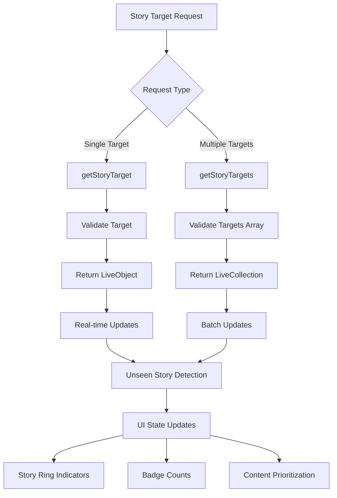

# Get Story Targets

Retrieve and observe individual or multiple story targets with real-time updates, enabling features like unseen story indicators and targeted content management.

## Architecture Overview



## Feature Summary

<CardGroup cols={2}>
  <Card title="Single Target Observation" icon="target">
    Monitor individual story targets with LiveObject for precise updates
  </Card>
  <Card title="Batch Target Monitoring" icon="layer-group">
    Observe multiple targets simultaneously with efficient batch operations
  </Card>
  <Card title="Unseen Detection" icon="eye">
    Real-time tracking of unseen stories for visual indicators
  </Card>
  <Card title="Performance Optimized" icon="bolt">
    Efficient data fetching with automatic caching and updates
  </Card>
</CardGroup>

## Single Story Target

The `getStoryTarget()` function enables real-time observation of a specific StoryTarget. This function returns a **LiveObject** that automatically updates when the target's story state changes.

### Parameters

<AccordionGroup>
  <Accordion title="targetType (required)">
    **Type:** `string`
    
    **Values:** `'community'` (currently supported)
    
    **Description:** The type of target to observe
    
    **Future Support:** Additional target types may be added in future versions
  </Accordion>
  
  <Accordion title="targetId (required)">
    **Type:** `string`
    
    **Description:** The unique identifier of the target to observe
    
    **Validation:** Must be a valid ID for the specified target type
  </Accordion>
</AccordionGroup>

### Implementation

<Tabs>
  <Tab title="iOS">
    <CodeGroup>
      ```swift Basic Single Target
      import AmitySDK
      
      class StoryTargetManager {
          private var storyTargetObject: AmityObject<AmityStoryTarget>?
          private var token: AmityNotificationToken?
          
          func observeStoryTarget(targetType: String, targetId: String) {
              storyTargetObject = AmityManager.shared.client.getStoryTarget(
                  targetType: targetType,
                  targetId: targetId
              )
              
              token = storyTargetObject?.observe { [weak self] storyTarget, error in
                  if let error = error {
                      self?.handleError(error)
                      return
                  }
                  
                  guard let storyTarget = storyTarget else { return }
                  self?.handleStoryTargetUpdate(storyTarget)
              }
          }
          
          private func handleStoryTargetUpdate(_ storyTarget: AmityStoryTarget) {
              let hasUnseenStories = storyTarget.hasUnseenStories
              
              print("Story target updated - Has unseen: \(hasUnseenStories)")
              
              // Update UI elements
              DispatchQueue.main.async {
                  self.updateStoryRing(hasUnseen: hasUnseenStories)
                  self.updateBadgeCount(storyTarget.unseenStoriesCount)
              }
          }
          
          private func updateStoryRing(hasUnseen: Bool) {
              // Update story ring UI
              NotificationCenter.default.post(
                  name: .storyRingUpdated,
                  object: nil,
                  userInfo: ["hasUnseen": hasUnseen]
              )
          }
          
          private func updateBadgeCount(_ count: Int) {
              // Update badge count
              NotificationCenter.default.post(
                  name: .badgeCountUpdated,
                  object: nil,
                  userInfo: ["count": count]
              )
          }
          
          private func handleError(_ error: Error) {
              print("Error observing story target: \(error.localizedDescription)")
          }
          
          deinit {
              token?.invalidate()
          }
      }
      
      extension Notification.Name {
          static let storyRingUpdated = Notification.Name("StoryRingUpdated")
          static let badgeCountUpdated = Notification.Name("BadgeCountUpdated")
      }
      ```

      ```swift Story Ring UI Implementation
      import AmitySDK
      import UIKit
      
      class StoryRingView: UIView {
          @IBOutlet weak var profileImageView: UIImageView!
          @IBOutlet weak var ringView: UIView!
          @IBOutlet weak var badgeLabel: UILabel!
          
          private var storyTargetManager = StoryTargetManager()
          private var targetType: String?
          private var targetId: String?
          
          override func awakeFromNib() {
              super.awakeFromNib()
              setupUI()
              setupNotifications()
          }
          
          private func setupUI() {
              profileImageView.layer.cornerRadius = profileImageView.frame.width / 2
              ringView.layer.cornerRadius = ringView.frame.width / 2
              ringView.layer.borderWidth = 3
              ringView.layer.borderColor = UIColor.gray.cgColor
              
              badgeLabel.layer.cornerRadius = badgeLabel.frame.width / 2
              badgeLabel.isHidden = true
          }
          
          private func setupNotifications() {
              NotificationCenter.default.addObserver(
                  self,
                  selector: #selector(handleStoryRingUpdate),
                  name: .storyRingUpdated,
                  object: nil
              )
              
              NotificationCenter.default.addObserver(
                  self,
                  selector: #selector(handleBadgeUpdate),
                  name: .badgeCountUpdated,
                  object: nil
              )
          }
          
          func configure(targetType: String, targetId: String, profileImage: UIImage?) {
              self.targetType = targetType
              self.targetId = targetId
              self.profileImageView.image = profileImage
              
              // Start observing story target
              storyTargetManager.observeStoryTarget(targetType: targetType, targetId: targetId)
          }
          
          @objc private func handleStoryRingUpdate(_ notification: Notification) {
              guard let hasUnseen = notification.userInfo?["hasUnseen"] as? Bool else { return }
              
              UIView.animate(withDuration: 0.3) {
                  self.ringView.layer.borderColor = hasUnseen 
                      ? UIColor.systemBlue.cgColor 
                      : UIColor.gray.cgColor
              }
          }
          
          @objc private func handleBadgeUpdate(_ notification: Notification) {
              guard let count = notification.userInfo?["count"] as? Int else { return }
              
              if count > 0 {
                  badgeLabel.text = "\(count)"
                  badgeLabel.isHidden = false
              } else {
                  badgeLabel.isHidden = true
              }
          }
          
          deinit {
              NotificationCenter.default.removeObserver(self)
          }
      }
      ```
    </CodeGroup>
  </Tab>
  
  <Tab title="Android">
    <CodeGroup>
      ```kotlin Basic Single Target
      import com.amity.socialcloud.sdk.AmityCoreClient
      import com.amity.socialcloud.sdk.story.AmityStoryRepository
      import io.reactivex.rxjava3.disposables.CompositeDisposable
      
      class StoryTargetManager {
          private val storyRepository = AmityCoreClient.newStoryRepository()
          private val disposables = CompositeDisposable()
          
          fun observeStoryTarget(
              targetType: String,
              targetId: String,
              onUpdate: (AmityStoryTarget) -> Unit,
              onError: (Throwable) -> Unit
          ) {
              val disposable = storyRepository.getStoryTarget(targetType, targetId)
                  .observeOn(AndroidSchedulers.mainThread())
                  .subscribeOn(Schedulers.io())
                  .subscribe(
                      { liveObject ->
                          liveObject.observe { storyTarget ->
                              storyTarget?.let { onUpdate(it) }
                          }
                      },
                      { error ->
                          onError(error)
                      }
                  )
              
              disposables.add(disposable)
          }
          
          fun cleanup() {
              disposables.clear()
          }
      }
      ```

      ```kotlin Story Ring UI Implementation
      import com.amity.socialcloud.sdk.story.AmityStoryTarget
      import androidx.lifecycle.ViewModel
      import androidx.lifecycle.MutableLiveData
      
      class StoryRingViewModel : ViewModel() {
          private val storyTargetManager = StoryTargetManager()
          
          val hasUnseenStories = MutableLiveData<Boolean>()
          val unseenStoriesCount = MutableLiveData<Int>()
          val error = MutableLiveData<String>()
          
          fun observeStoryTarget(targetType: String, targetId: String) {
              storyTargetManager.observeStoryTarget(
                  targetType = targetType,
                  targetId = targetId,
                  onUpdate = { storyTarget ->
                      hasUnseenStories.value = storyTarget.hasUnseenStories()
                      unseenStoriesCount.value = storyTarget.getUnseenStoriesCount()
                  },
                  onError = { throwable ->
                      error.value = throwable.message ?: "Unknown error"
                  }
              )
          }
          
          override fun onCleared() {
              super.onCleared()
              storyTargetManager.cleanup()
          }
      }
      
      class StoryRingView @JvmOverloads constructor(
          context: Context,
          attrs: AttributeSet? = null,
          defStyleAttr: Int = 0
      ) : FrameLayout(context, attrs, defStyleAttr) {
          
          private val binding: ViewStoryRingBinding
          private val viewModel = StoryRingViewModel()
          
          init {
              binding = ViewStoryRingBinding.inflate(LayoutInflater.from(context), this, true)
              setupObservers()
          }
          
          private fun setupObservers() {
              viewModel.hasUnseenStories.observe(context as LifecycleOwner) { hasUnseen ->
                  updateRingAppearance(hasUnseen)
              }
              
              viewModel.unseenStoriesCount.observe(context as LifecycleOwner) { count ->
                  updateBadgeCount(count)
              }
              
              viewModel.error.observe(context as LifecycleOwner) { errorMessage ->
                  // Handle error
                  Log.e("StoryRingView", "Error: $errorMessage")
              }
          }
          
          fun configure(targetType: String, targetId: String, profileImageUrl: String?) {
              viewModel.observeStoryTarget(targetType, targetId)
              
              // Load profile image
              profileImageUrl?.let { url ->
                  Glide.with(context)
                      .load(url)
                      .circleCrop()
                      .into(binding.profileImageView)
              }
          }
          
          private fun updateRingAppearance(hasUnseen: Boolean) {
              val ringColor = if (hasUnseen) {
                  ContextCompat.getColor(context, R.color.story_ring_unseen)
              } else {
                  ContextCompat.getColor(context, R.color.story_ring_seen)
              }
              
              binding.ringView.setBackgroundColor(ringColor)
          }
          
          private fun updateBadgeCount(count: Int) {
              if (count > 0) {
                  binding.badgeTextView.text = count.toString()
                  binding.badgeTextView.isVisible = true
              } else {
                  binding.badgeTextView.isVisible = false
              }
          }
      }
      ```
    </CodeGroup>
  </Tab>
  
  <Tab title="TypeScript">
    <CodeGroup>
      ```typescript Basic Single Target
      import { StoryRepository, StoryTarget } from '@amityco/ts-sdk';
      
      class StoryTargetManager {
          private storyRepository: StoryRepository;
          private liveObject: any;
          
          constructor() {
              this.storyRepository = new StoryRepository();
          }
          
          observeStoryTarget(
              targetType: string,
              targetId: string,
              onUpdate: (storyTarget: StoryTarget) => void,
              onError: (error: Error) => void
          ) {
              try {
                  this.liveObject = this.storyRepository.getStoryTarget(targetType, targetId);
                  
                  this.liveObject.on('dataUpdated', (storyTarget: StoryTarget) => {
                      onUpdate(storyTarget);
                  });
                  
                  this.liveObject.on('error', (error: Error) => {
                      onError(error);
                  });
              } catch (error) {
                  onError(error as Error);
              }
          }
          
          dispose() {
              if (this.liveObject) {
                  this.liveObject.dispose();
              }
          }
      }
      ```

      ```typescript React Hook Implementation
      import { useState, useEffect, useCallback } from 'react';
      import { StoryRepository, StoryTarget } from '@amityco/ts-sdk';
      
      interface UseStoryTargetResult {
          storyTarget: StoryTarget | null;
          hasUnseenStories: boolean;
          unseenStoriesCount: number;
          loading: boolean;
          error: string | null;
      }
      
      export const useStoryTarget = (
          targetType: string,
          targetId: string
      ): UseStoryTargetResult => {
          const [storyTarget, setStoryTarget] = useState<StoryTarget | null>(null);
          const [loading, setLoading] = useState(true);
          const [error, setError] = useState<string | null>(null);
          const [manager] = useState(() => new StoryTargetManager());
          
          useEffect(() => {
              if (!targetType || !targetId) return;
              
              setLoading(true);
              setError(null);
              
              manager.observeStoryTarget(
                  targetType,
                  targetId,
                  (target) => {
                      setStoryTarget(target);
                      setLoading(false);
                  },
                  (error) => {
                      setError(error.message);
                      setLoading(false);
                  }
              );
              
              return () => {
                  manager.dispose();
              };
          }, [targetType, targetId, manager]);
          
          return {
              storyTarget,
              hasUnseenStories: storyTarget?.hasUnseenStories || false,
              unseenStoriesCount: storyTarget?.unseenStoriesCount || 0,
              loading,
              error
          };
      };
      
      // Story Ring Component
      interface StoryRingProps {
          targetType: string;
          targetId: string;
          profileImageUrl?: string;
          size?: 'small' | 'medium' | 'large';
          onClick?: () => void;
      }
      
      const StoryRing: React.FC<StoryRingProps> = ({
          targetType,
          targetId,
          profileImageUrl,
          size = 'medium',
          onClick
      }) => {
          const { hasUnseenStories, unseenStoriesCount, loading, error } = useStoryTarget(
              targetType,
              targetId
          );
          
          if (loading) {
              return <div className={`story-ring story-ring--${size} story-ring--loading`} />;
          }
          
          if (error) {
              return (
                  <div className={`story-ring story-ring--${size} story-ring--error`}>
                      <span>!</span>
                  </div>
              );
          }
          
          return (
              <div
                  className={`story-ring story-ring--${size} ${
                      hasUnseenStories ? 'story-ring--unseen' : 'story-ring--seen'
                  }`}
                  onClick={onClick}
              >
                  
                  {unseenStoriesCount > 0 && (
                      <div className="story-ring__badge">
                          {unseenStoriesCount}
                      </div>
                  )}
              </div>
          );
      };
      
      export default StoryRing;
      ```
    </CodeGroup>
  </Tab>
  
  <Tab title="Flutter">
    <CodeGroup>
      ```dart Basic Single Target
      import 'package:amity_sdk/amity_sdk.dart';
      
      class StoryTargetManager {
          final AmityStoryRepository _storyRepository = AmityStoryRepository();
          AmityLiveObject<AmityStoryTarget>? _liveObject;
          StreamSubscription? _subscription;
          
          void observeStoryTarget(
              String targetType,
              String targetId,
              Function(AmityStoryTarget) onUpdate,
              Function(AmityException) onError,
          ) {
              try {
                  _liveObject = _storyRepository.getStoryTarget(targetType, targetId);
                  
                  _subscription = _liveObject!.stream.listen(
                      (storyTarget) {
                          if (storyTarget != null) {
                              onUpdate(storyTarget);
                          }
                      },
                      onError: (error) => onError(error as AmityException),
                  );
              } catch (error) {
                  onError(AmityException.fromError(error));
              }
          }
          
          void dispose() {
              _subscription?.cancel();
              _liveObject?.dispose();
          }
      }
      ```

      ```dart Story Ring Widget
      import 'package:flutter/material.dart';
      import 'package:amity_sdk/amity_sdk.dart';
      
      class StoryRingWidget extends StatefulWidget {
          final String targetType;
          final String targetId;
          final String? profileImageUrl;
          final double size;
          final VoidCallback? onTap;
          
          const StoryRingWidget({
              Key? key,
              required this.targetType,
              required this.targetId,
              this.profileImageUrl,
              this.size = 60.0,
              this.onTap,
          }) : super(key: key);
          
          @override
          _StoryRingWidgetState createState() => _StoryRingWidgetState();
      }
      
      class _StoryRingWidgetState extends State<StoryRingWidget> {
          final StoryTargetManager _manager = StoryTargetManager();
          
          bool _hasUnseenStories = false;
          int _unseenStoriesCount = 0;
          bool _loading = true;
          String? _error;
          
          @override
          void initState() {
              super.initState();
              _observeStoryTarget();
          }
          
          void _observeStoryTarget() {
              _manager.observeStoryTarget(
                  widget.targetType,
                  widget.targetId,
                  (storyTarget) {
                      setState(() {
                          _hasUnseenStories = storyTarget.hasUnseenStories;
                          _unseenStoriesCount = storyTarget.unseenStoriesCount;
                          _loading = false;
                          _error = null;
                      });
                  },
                  (error) {
                      setState(() {
                          _error = error.message;
                          _loading = false;
                      });
                  },
              );
          }
          
          @override
          Widget build(BuildContext context) {
              if (_loading) {
                  return _buildLoadingRing();
              }
              
              if (_error != null) {
                  return _buildErrorRing();
              }
              
              return _buildStoryRing();
          }
          
          Widget _buildLoadingRing() {
              return Container(
                  width: widget.size,
                  height: widget.size,
                  decoration: BoxDecoration(
                      shape: BoxShape.circle,
                      color: Colors.grey[300],
                  ),
                  child: const Center(
                      child: SizedBox(
                          width: 20,
                          height: 20,
                          child: CircularProgressIndicator(strokeWidth: 2),
                      ),
                  ),
              );
          }
          
          Widget _buildErrorRing() {
              return Container(
                  width: widget.size,
                  height: widget.size,
                  decoration: BoxDecoration(
                      shape: BoxShape.circle,
                      color: Colors.red[100],
                      border: Border.all(color: Colors.red, width: 2),
                  ),
                  child: const Center(
                      child: Icon(Icons.error, color: Colors.red),
                  ),
              );
          }
          
          Widget _buildStoryRing() {
              return GestureDetector(
                  onTap: widget.onTap,
                  child: Stack(
                      children: [
                          Container(
                              width: widget.size,
                              height: widget.size,
                              decoration: BoxDecoration(
                                  shape: BoxShape.circle,
                                  border: Border.all(
                                      color: _hasUnseenStories
                                          ? Theme.of(context).primaryColor
                                          : Colors.grey,
                                      width: 3,
                                  ),
                              ),
                              child: ClipRRect(
                                  borderRadius: BorderRadius.circular(widget.size / 2),
                                  child: widget.profileImageUrl != null
                                      ? Image.network(
                                          widget.profileImageUrl!,
                                          fit: BoxFit.cover,
                                          errorBuilder: (context, error, stackTrace) {
                                              return Container(
                                                  color: Colors.grey[300],
                                                  child: const Icon(Icons.person),
                                              );
                                          },
                                      )
                                      : Container(
                                          color: Colors.grey[300],
                                          child: const Icon(Icons.person),
                                      ),
                              ),
                          ),
                          if (_unseenStoriesCount > 0)
                              Positioned(
                                  top: 0,
                                  right: 0,
                                  child: Container(
                                      padding: const EdgeInsets.all(4),
                                      decoration: BoxDecoration(
                                          color: Colors.red,
                                          shape: BoxShape.circle,
                                          border: Border.all(color: Colors.white, width: 2),
                                      ),
                                      child: Text(
                                          _unseenStoriesCount.toString(),
                                          style: const TextStyle(
                                              color: Colors.white,
                                              fontSize: 12,
                                              fontWeight: FontWeight.bold,
                                          ),
                                      ),
                                  ),
                              ),
                      ],
                  ),
              );
          }
          
          @override
          void dispose() {
              _manager.dispose();
              super.dispose();
          }
      }
      ```
    </CodeGroup>
  </Tab>
</Tabs>

## Multiple Story Targets

The `getStoryTargets()` function enables batch observation of multiple StoryTargets simultaneously. This function returns a **LiveCollection** that efficiently manages updates for multiple targets.

### Parameters

<AccordionGroup>
  <Accordion title="targets (required)">
    **Type:** `Array<{ targetType: string, targetId: string }>`
    
    **Description:** Array of target pairs to observe
    
    **Limit:** Maximum of 10 target pairs per request
    
    **Example:**
    ```javascript
    [
        { targetType: 'community', targetId: 'community1' },
        { targetType: 'community', targetId: 'community2' },
        // ... up to 10 targets
    ]
    ```
  </Accordion>
</AccordionGroup>

<Note>
**Batch Limit:** The function accepts a maximum of 10 target pairs to optimize performance and prevent excessive resource usage.
</Note>

### Implementation

<Tabs>
  <Tab title="iOS">
    <CodeGroup>
      ```swift Multiple Targets Management
      import AmitySDK
      
      class MultipleStoryTargetsManager {
          private var storyTargetsCollection: AmityCollection<AmityStoryTarget>?
          private var token: AmityNotificationToken?
          
          func observeMultipleStoryTargets(targets: [(targetType: String, targetId: String)]) {
              // Validate target count
              guard targets.count <= 10 else {
                  print("Error: Maximum 10 targets allowed")
                  return
              }
              
              let targetPairs = targets.map { AmityStoryTargetPair(targetType: $0.targetType, targetId: $0.targetId) }
              
              storyTargetsCollection = AmityManager.shared.client.getStoryTargets(targets: targetPairs)
              
              token = storyTargetsCollection?.observe { [weak self] collection, change, error in
                  if let error = error {
                      self?.handleError(error)
                      return
                  }
                  
                  switch change {
                  case .initial:
                      self?.handleInitialLoad(collection)
                  case .update(let deletions, let insertions, let modifications):
                      self?.handleUpdates(deletions: deletions, insertions: insertions, modifications: modifications)
                  case .error(let error):
                      self?.handleError(error)
                  }
              }
          }
          
          private func handleInitialLoad(_ collection: AmityCollection<AmityStoryTarget>) {
              let storyTargets = collection.allObjects()
              print("Loaded \(storyTargets.count) story targets")
              
              // Calculate total unseen count
              let totalUnseen = storyTargets.reduce(0) { $0 + $1.unseenStoriesCount }
              
              DispatchQueue.main.async {
                  self.updateUI(with: storyTargets, totalUnseen: totalUnseen)
              }
          }
          
          private func handleUpdates(deletions: [IndexPath], insertions: [IndexPath], modifications: [IndexPath]) {
              guard let collection = storyTargetsCollection else { return }
              
              let updatedTargets = collection.allObjects()
              let totalUnseen = updatedTargets.reduce(0) { $0 + $1.unseenStoriesCount }
              
              DispatchQueue.main.async {
                  self.applyUpdates(
                      targets: updatedTargets,
                      deletions: deletions,
                      insertions: insertions,
                      modifications: modifications,
                      totalUnseen: totalUnseen
                  )
              }
          }
          
          private func updateUI(with targets: [AmityStoryTarget], totalUnseen: Int) {
              // Update UI with story targets
              NotificationCenter.default.post(
                  name: .multipleStoryTargetsUpdated,
                  object: nil,
                  userInfo: [
                      "targets": targets,
                      "totalUnseen": totalUnseen
                  ]
              )
          }
          
          deinit {
              token?.invalidate()
          }
      }
      
      extension Notification.Name {
          static let multipleStoryTargetsUpdated = Notification.Name("MultipleStoryTargetsUpdated")
      }
      ```

      ```swift Story Feed Implementation
      import AmitySDK
      import UIKit
      
      class StoryFeedViewController: UIViewController {
          @IBOutlet weak var collectionView: UICollectionView!
          @IBOutlet weak var totalBadgeLabel: UILabel!
          
          private var storyTargetsManager = MultipleStoryTargetsManager()
          private var storyTargets: [AmityStoryTarget] = []
          
          override func viewDidLoad() {
              super.viewDidLoad()
              setupUI()
              loadStoryTargets()
          }
          
          private func setupUI() {
              collectionView.register(StoryTargetCell.self, forCellWithReuseIdentifier: "StoryTargetCell")
              
              NotificationCenter.default.addObserver(
                  self,
                  selector: #selector(handleStoryTargetsUpdate),
                  name: .multipleStoryTargetsUpdated,
                  object: nil
              )
          }
          
          private func loadStoryTargets() {
              // Example: Load story targets for multiple communities
              let targets = [
                  (targetType: "community", targetId: "community1"),
                  (targetType: "community", targetId: "community2"),
                  (targetType: "community", targetId: "community3"),
                  // Add more targets as needed (max 10)
              ]
              
              storyTargetsManager.observeMultipleStoryTargets(targets: targets)
          }
          
          @objc private func handleStoryTargetsUpdate(_ notification: Notification) {
              guard let userInfo = notification.userInfo,
                    let targets = userInfo["targets"] as? [AmityStoryTarget],
                    let totalUnseen = userInfo["totalUnseen"] as? Int else { return }
              
              self.storyTargets = targets
              
              // Update total badge
              updateTotalBadge(count: totalUnseen)
              
              // Reload collection view
              collectionView.reloadData()
          }
          
          private func updateTotalBadge(count: Int) {
              if count > 0 {
                  totalBadgeLabel.text = "\(count)"
                  totalBadgeLabel.isHidden = false
              } else {
                  totalBadgeLabel.isHidden = true
              }
          }
      }
      
      // MARK: - Collection View DataSource
      extension StoryFeedViewController: UICollectionViewDataSource {
          func collectionView(_ collectionView: UICollectionView, numberOfItemsInSection section: Int) -> Int {
              return storyTargets.count
          }
          
          func collectionView(_ collectionView: UICollectionView, cellForItemAt indexPath: IndexPath) -> UICollectionViewCell {
              let cell = collectionView.dequeueReusableCell(withReuseIdentifier: "StoryTargetCell", for: indexPath) as! StoryTargetCell
              
              let target = storyTargets[indexPath.item]
              cell.configure(with: target)
              
              return cell
          }
      }
      ```
    </CodeGroup>
  </Tab>
  
  <Tab title="Android">
    <CodeGroup>
      ```kotlin Multiple Targets Management
      import com.amity.socialcloud.sdk.AmityCoreClient
      import com.amity.socialcloud.sdk.story.AmityStoryRepository
      import com.amity.socialcloud.sdk.story.AmityStoryTargetPair
      
      class MultipleStoryTargetsManager {
          private val storyRepository = AmityCoreClient.newStoryRepository()
          private val disposables = CompositeDisposable()
          
          fun observeMultipleStoryTargets(
              targets: List<Pair<String, String>>,
              onUpdate: (List<AmityStoryTarget>) -> Unit,
              onError: (Throwable) -> Unit
          ) {
              // Validate target count
              if (targets.size > 10) {
                  onError(IllegalArgumentException("Maximum 10 targets allowed"))
                  return
              }
              
              val targetPairs = targets.map { (targetType, targetId) ->
                  AmityStoryTargetPair(targetType, targetId)
              }
              
              val disposable = storyRepository.getStoryTargets(targetPairs)
                  .observeOn(AndroidSchedulers.mainThread())
                  .subscribeOn(Schedulers.io())
                  .subscribe(
                      { liveCollection ->
                          liveCollection.observe { storyTargets ->
                              onUpdate(storyTargets)
                          }
                      },
                      { error ->
                          onError(error)
                      }
                  )
              
              disposables.add(disposable)
          }
          
          fun cleanup() {
              disposables.clear()
          }
      }
      ```

      ```kotlin Story Feed Activity
      import com.amity.socialcloud.sdk.story.AmityStoryTarget
      import androidx.recyclerview.widget.LinearLayoutManager
      import androidx.lifecycle.ViewModelProvider
      
      class StoryFeedActivity : AppCompatActivity() {
          private lateinit var binding: ActivityStoryFeedBinding
          private lateinit var viewModel: StoryFeedViewModel
          private lateinit var adapter: StoryTargetsAdapter
          
          override fun onCreate(savedInstanceState: Bundle?) {
              super.onCreate(savedInstanceState)
              binding = ActivityStoryFeedBinding.inflate(layoutInflater)
              setContentView(binding.root)
              
              setupViewModel()
              setupRecyclerView()
              loadStoryTargets()
          }
          
          private fun setupViewModel() {
              viewModel = ViewModelProvider(this)[StoryFeedViewModel::class.java]
              
              viewModel.storyTargets.observe(this) { targets ->
                  adapter.submitList(targets)
                  updateTotalBadge(targets)
              }
              
              viewModel.error.observe(this) { errorMessage ->
                  if (errorMessage != null) {
                      showErrorMessage(errorMessage)
                  }
              }
          }
          
          private fun setupRecyclerView() {
              adapter = StoryTargetsAdapter { storyTarget ->
                  // Handle story target click
                  openStoryViewer(storyTarget)
              }
              
              binding.recyclerView.apply {
                  layoutManager = LinearLayoutManager(this@StoryFeedActivity, LinearLayoutManager.HORIZONTAL, false)
                  adapter = this@StoryFeedActivity.adapter
              }
          }
          
          private fun loadStoryTargets() {
              val targets = listOf(
                  "community" to "community1",
                  "community" to "community2",
                  "community" to "community3",
                  // Add more targets as needed (max 10)
              )
              
              viewModel.loadStoryTargets(targets)
          }
          
          private fun updateTotalBadge(targets: List<AmityStoryTarget>) {
              val totalUnseen = targets.sumOf { it.getUnseenStoriesCount() }
              
              if (totalUnseen > 0) {
                  binding.totalBadge.text = totalUnseen.toString()
                  binding.totalBadge.isVisible = true
              } else {
                  binding.totalBadge.isVisible = false
              }
          }
      }
      
      class StoryFeedViewModel : ViewModel() {
          private val manager = MultipleStoryTargetsManager()
          
          val storyTargets = MutableLiveData<List<AmityStoryTarget>>()
          val error = MutableLiveData<String>()
          
          fun loadStoryTargets(targets: List<Pair<String, String>>) {
              manager.observeMultipleStoryTargets(
                  targets = targets,
                  onUpdate = { storyTargets.value = it },
                  onError = { error.value = it.message }
              )
          }
          
          override fun onCleared() {
              super.onCleared()
              manager.cleanup()
          }
      }
      ```
    </CodeGroup>
  </Tab>
  
  <Tab title="TypeScript">
    <CodeGroup>
      ```typescript Multiple Targets Hook
      import { useState, useEffect, useCallback } from 'react';
      import { StoryRepository, StoryTarget } from '@amityco/ts-sdk';
      
      interface StoryTargetPair {
          targetType: string;
          targetId: string;
      }
      
      interface UseMultipleStoryTargetsResult {
          storyTargets: StoryTarget[];
          totalUnseenCount: number;
          loading: boolean;
          error: string | null;
          refetch: () => void;
      }
      
      export const useMultipleStoryTargets = (
          targets: StoryTargetPair[]
      ): UseMultipleStoryTargetsResult => {
          const [storyTargets, setStoryTargets] = useState<StoryTarget[]>([]);
          const [loading, setLoading] = useState(true);
          const [error, setError] = useState<string | null>(null);
          const [manager] = useState(() => new MultipleStoryTargetsManager());
          
          const refetch = useCallback(() => {
              if (targets.length === 0) {
                  setStoryTargets([]);
                  setLoading(false);
                  return;
              }
              
              if (targets.length > 10) {
                  setError('Maximum 10 targets allowed');
                  setLoading(false);
                  return;
              }
              
              setLoading(true);
              setError(null);
              
              manager.observeMultipleStoryTargets(
                  targets,
                  (updatedTargets) => {
                      setStoryTargets(updatedTargets);
                      setLoading(false);
                  },
                  (error) => {
                      setError(error.message);
                      setLoading(false);
                  }
              );
          }, [targets, manager]);
          
          useEffect(() => {
              refetch();
              
              return () => {
                  manager.dispose();
              };
          }, [refetch, manager]);
          
          const totalUnseenCount = storyTargets.reduce(
              (total, target) => total + (target.unseenStoriesCount || 0),
              0
          );
          
          return {
              storyTargets,
              totalUnseenCount,
              loading,
              error,
              refetch
          };
      };
      
      // Story Feed Component
      interface StoryFeedProps {
          communityIds: string[];
      }
      
      const StoryFeed: React.FC<StoryFeedProps> = ({ communityIds }) => {
          const targets = communityIds.map(id => ({
              targetType: 'community',
              targetId: id
          }));
          
          const { storyTargets, totalUnseenCount, loading, error, refetch } = useMultipleStoryTargets(targets);
          
          if (loading) return <div className="story-feed-loading">Loading stories...</div>;
          if (error) return <div className="story-feed-error">Error: {error}</div>;
          
          return (
              <div className="story-feed">
                  <div className="story-feed-header">
                      <h2>Stories</h2>
                      {totalUnseenCount > 0 && (
                          <span className="total-badge">{totalUnseenCount}</span>
                      )}
                      <button onClick={refetch} className="refresh-btn">
                          Refresh
                      </button>
                  </div>
                  
                  <div className="story-targets-grid">
                      {storyTargets.map(target => (
                          <StoryTargetCard
                              key={`${target.targetType}-${target.targetId}`}
                              target={target}
                              onClick={() => openStoryViewer(target)}
                          />
                      ))}
                  </div>
              </div>
          );
      };
      
      class MultipleStoryTargetsManager {
          private storyRepository: StoryRepository;
          private liveCollection: any;
          
          constructor() {
              this.storyRepository = new StoryRepository();
          }
          
          observeMultipleStoryTargets(
              targets: StoryTargetPair[],
              onUpdate: (targets: StoryTarget[]) => void,
              onError: (error: Error) => void
          ) {
              try {
                  this.liveCollection = this.storyRepository.getStoryTargets(targets);
                  
                  this.liveCollection.on('dataUpdated', (storyTargets: StoryTarget[]) => {
                      onUpdate(storyTargets);
                  });
                  
                  this.liveCollection.on('error', (error: Error) => {
                      onError(error);
                  });
              } catch (error) {
                  onError(error as Error);
              }
          }
          
          dispose() {
              if (this.liveCollection) {
                  this.liveCollection.dispose();
              }
          }
      }
      ```
    </CodeGroup>
  </Tab>
  
  <Tab title="Flutter">
    <CodeGroup>
      ```dart Multiple Targets Provider
      import 'package:flutter/material.dart';
      import 'package:amity_sdk/amity_sdk.dart';
      
      class StoryTargetPair {
          final String targetType;
          final String targetId;
          
          StoryTargetPair(this.targetType, this.targetId);
      }
      
      class MultipleStoryTargetsProvider extends ChangeNotifier {
          final MultipleStoryTargetsManager _manager = MultipleStoryTargetsManager();
          
          List<AmityStoryTarget> _storyTargets = [];
          bool _loading = false;
          String? _error;
          
          List<AmityStoryTarget> get storyTargets => _storyTargets;
          bool get loading => _loading;
          String? get error => _error;
          
          int get totalUnseenCount => _storyTargets
              .fold(0, (sum, target) => sum + target.unseenStoriesCount);
          
          void loadStoryTargets(List<StoryTargetPair> targets) {
              if (targets.length > 10) {
                  _error = 'Maximum 10 targets allowed';
                  notifyListeners();
                  return;
              }
              
              _loading = true;
              _error = null;
              notifyListeners();
              
              final targetPairs = targets.map((pair) => 
                  AmityStoryTargetPair(pair.targetType, pair.targetId)
              ).toList();
              
              _manager.observeMultipleStoryTargets(
                  targetPairs,
                  (updatedTargets) {
                      _storyTargets = updatedTargets;
                      _loading = false;
                      notifyListeners();
                  },
                  (error) {
                      _error = error.message;
                      _loading = false;
                      notifyListeners();
                  },
              );
          }
          
          @override
          void dispose() {
              _manager.dispose();
              super.dispose();
          }
      }
      
      class StoryFeedWidget extends StatefulWidget {
          final List<String> communityIds;
          
          const StoryFeedWidget({
              Key? key,
              required this.communityIds,
          }) : super(key: key);
          
          @override
          _StoryFeedWidgetState createState() => _StoryFeedWidgetState();
      }
      
      class _StoryFeedWidgetState extends State<StoryFeedWidget> {
          late MultipleStoryTargetsProvider _provider;
          
          @override
          void initState() {
              super.initState();
              _provider = MultipleStoryTargetsProvider();
              _loadStoryTargets();
          }
          
          void _loadStoryTargets() {
              final targets = widget.communityIds
                  .map((id) => StoryTargetPair('community', id))
                  .toList();
              
              _provider.loadStoryTargets(targets);
          }
          
          @override
          Widget build(BuildContext context) {
              return ChangeNotifierProvider.value(
                  value: _provider,
                  child: Consumer<MultipleStoryTargetsProvider>(
                      builder: (context, provider, child) {
                          if (provider.loading) {
                              return const Center(child: CircularProgressIndicator());
                          }
                          
                          if (provider.error != null) {
                              return Center(
                                  child: Column(
                                      mainAxisAlignment: MainAxisAlignment.center,
                                      children: [
                                          Text('Error: ${provider.error}'),
                                          ElevatedButton(
                                              onPressed: _loadStoryTargets,
                                              child: const Text('Retry'),
                                          ),
                                      ],
                                  ),
                              );
                          }
                          
                          return Column(
                              crossAxisAlignment: CrossAxisAlignment.start,
                              children: [
                                  _buildHeader(provider),
                                  _buildStoryTargetsList(provider),
                              ],
                          );
                      },
                  ),
              );
          }
          
          Widget _buildHeader(MultipleStoryTargetsProvider provider) {
              return Container(
                  padding: const EdgeInsets.all(16),
                  child: Row(
                      mainAxisAlignment: MainAxisAlignment.spaceBetween,
                      children: [
                          const Text(
                              'Stories',
                              style: TextStyle(
                                  fontSize: 24,
                                  fontWeight: FontWeight.bold,
                              ),
                          ),
                          Row(
                              children: [
                                  if (provider.totalUnseenCount > 0)
                                      Container(
                                          padding: const EdgeInsets.symmetric(
                                              horizontal: 8,
                                              vertical: 4,
                                          ),
                                          decoration: BoxDecoration(
                                              color: Colors.red,
                                              borderRadius: BorderRadius.circular(12),
                                          ),
                                          child: Text(
                                              provider.totalUnseenCount.toString(),
                                              style: const TextStyle(
                                                  color: Colors.white,
                                                  fontWeight: FontWeight.bold,
                                              ),
                                          ),
                                      ),
                                  const SizedBox(width: 8),
                                  IconButton(
                                      onPressed: _loadStoryTargets,
                                      icon: const Icon(Icons.refresh),
                                  ),
                              ],
                          ),
                      ],
                  ),
              );
          }
          
          Widget _buildStoryTargetsList(MultipleStoryTargetsProvider provider) {
              return SizedBox(
                  height: 100,
                  child: ListView.builder(
                      scrollDirection: Axis.horizontal,
                      padding: const EdgeInsets.symmetric(horizontal: 16),
                      itemCount: provider.storyTargets.length,
                      itemBuilder: (context, index) {
                          final target = provider.storyTargets[index];
                          return Padding(
                              padding: const EdgeInsets.only(right: 12),
                              child: StoryRingWidget(
                                  targetType: target.targetType,
                                  targetId: target.targetId,
                                  onTap: () => _openStoryViewer(target),
                              ),
                          );
                      },
                  ),
              );
          }
          
          void _openStoryViewer(AmityStoryTarget target) {
              // Navigate to story viewer
              Navigator.push(
                  context,
                  MaterialPageRoute(
                      builder: (context) => StoryViewerScreen(target: target),
                  ),
              );
          }
          
          @override
          void dispose() {
              _provider.dispose();
              super.dispose();
          }
      }
      ```
    </CodeGroup>
  </Tab>
</Tabs>

## Best Practices

<AccordionGroup>
  <Accordion title="Performance Optimization">
    **Efficient Target Management**
    
    - Limit batch requests to 10 targets maximum
    - Use single target observation for frequently updated targets
    - Implement proper disposal to prevent memory leaks
    - Cache story target data when appropriate
    
    ```typescript
    class OptimizedStoryTargetManager {
        private cache = new Map<string, StoryTarget>();
        private observers = new Map<string, any>();
        
        observeTarget(targetType: string, targetId: string) {
            const key = `${targetType}:${targetId}`;
            
            // Check if already observing
            if (this.observers.has(key)) {
                return this.observers.get(key);
            }
            
            // Create new observer
            const observer = this.createObserver(targetType, targetId);
            this.observers.set(key, observer);
            
            return observer;
        }
        
        dispose() {
            this.observers.forEach(observer => observer.dispose());
            this.observers.clear();
            this.cache.clear();
        }
    }
    ```
  </Accordion>
  
  <Accordion title="UI/UX Implementation">
    **Visual Indicators and Feedback**
    
    - Use distinct visual states for seen/unseen stories
    - Implement smooth animations for state transitions
    - Show loading states during data fetching
    - Provide clear error messages and retry options
    
    ```css
    .story-ring {
        transition: all 0.3s ease;
        border: 3px solid #e0e0e0;
    }
    
    .story-ring--unseen {
        border-color: #007bff;
        animation: pulse 2s infinite;
    }
    
    .story-ring--seen {
        border-color: #6c757d;
    }
    
    @keyframes pulse {
        0% { transform: scale(1); }
        50% { transform: scale(1.05); }
        100% { transform: scale(1); }
    }
    ```
  </Accordion>
  
  <Accordion title="Error Handling">
    **Robust Error Management**
    
    - Handle network connectivity issues gracefully
    - Provide meaningful error messages to users
    - Implement retry mechanisms for failed requests
    - Log errors for debugging and monitoring
    
    ```typescript
    class StoryTargetErrorHandler {
        static handleError(error: Error, context: string): UserFriendlyError {
            console.error(`Story target error in ${context}:`, error);
            
            if (error.message.includes('network')) {
                return {
                    message: 'Network error. Please check your connection.',
                    retryable: true
                };
            }
            
            if (error.message.includes('not found')) {
                return {
                    message: 'Story target not found.',
                    retryable: false
                };
            }
            
            return {
                message: 'Something went wrong. Please try again.',
                retryable: true
            };
        }
    }
    ```
  </Accordion>
  
  <Accordion title="Real-time Updates">
    **Efficient Update Handling**
    
    - Use LiveObject/LiveCollection for automatic updates
    - Implement debouncing for rapid updates
    - Update UI efficiently with minimal re-renders
    - Handle concurrent updates gracefully
    
    ```typescript
    class StoryTargetUpdateManager {
        private updateQueue: StoryTarget[] = [];
        private isProcessing = false;
        
        async handleUpdate(target: StoryTarget) {
            this.updateQueue.push(target);
            
            if (!this.isProcessing) {
                await this.processUpdates();
            }
        }
        
        private async processUpdates() {
            this.isProcessing = true;
            
            while (this.updateQueue.length > 0) {
                const targets = this.updateQueue.splice(0, 5); // Process in batches
                await this.updateUI(targets);
                await new Promise(resolve => setTimeout(resolve, 100)); // Throttle updates
            }
            
            this.isProcessing = false;
        }
    }
    ```
  </Accordion>
</AccordionGroup>

## Use Cases

<CardGroup cols={2}>
  <Card title="Story Ring Implementation" icon="circle">
    **Scenario:** Show unseen story indicators around profile pictures
    
    **Approach:** Use single target observation for individual rings
    
    **Implementation:** Real-time visual updates with smooth animations
  </Card>
  
  <Card title="Story Feed Dashboard" icon="grid">
    **Scenario:** Display multiple story targets in a feed layout
    
    **Approach:** Use batch target observation for efficient loading
    
    **Implementation:** Horizontal scrolling with badge counts
  </Card>
  
  <Card title="Notification System" icon="bell">
    **Scenario:** Alert users to new stories across multiple communities
    
    **Approach:** Monitor multiple targets with aggregated counts
    
    **Implementation:** Push notifications with total unseen counts
  </Card>
  
  <Card title="Admin Analytics" icon="chart-line">
    **Scenario:** Track story engagement across multiple targets
    
    **Approach:** Comprehensive monitoring with detailed metrics
    
    **Implementation:** Real-time dashboard with filtering options
  </Card>
</CardGroup>

## Advanced Features

### Smart Caching Strategy

```typescript
class StoryTargetCache {
    private cache = new Map<string, { 
        target: StoryTarget; 
        timestamp: number; 
        ttl: number; 
    }>();
    
    private readonly DEFAULT_TTL = 5 * 60 * 1000; // 5 minutes
    
    set(key: string, target: StoryTarget, ttl = this.DEFAULT_TTL) {
        this.cache.set(key, {
            target,
            timestamp: Date.now(),
            ttl
        });
    }
    
    get(key: string): StoryTarget | null {
        const entry = this.cache.get(key);
        
        if (!entry) return null;
        
        if (Date.now() - entry.timestamp > entry.ttl) {
            this.cache.delete(key);
            return null;
        }
        
        return entry.target;
    }
}
```

### Batch Update Optimization

```typescript
class BatchUpdateManager {
    private pendingUpdates = new Set<string>();
    private updateTimer: NodeJS.Timeout | null = null;
    
    scheduleUpdate(targetId: string) {
        this.pendingUpdates.add(targetId);
        
        if (this.updateTimer) {
            clearTimeout(this.updateTimer);
        }
        
        this.updateTimer = setTimeout(() => {
            this.processBatchUpdate();
        }, 500); // Batch updates every 500ms
    }
    
    private processBatchUpdate() {
        const targetIds = Array.from(this.pendingUpdates);
        this.pendingUpdates.clear();
        
        // Process batch update
        this.updateTargets(targetIds);
    }
}
```

<Note>
**Unseen Story Detection:** The LiveObject automatically updates the `hasUnseenStories` property when stories are viewed or new stories are added, enabling real-time UI updates.
</Note>

<Info>
**Batch Efficiency:** When observing multiple targets, the system optimizes network requests and memory usage by batching operations and sharing resources where possible.
</Info>