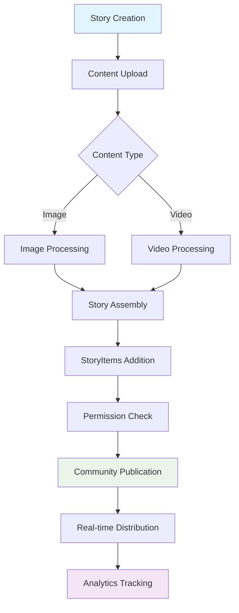

# Stories

Transform your app's content strategy with Social Plus Stories - powerful ephemeral content that drives engagement through time-sensitive, immersive experiences. Perfect for promotions, events, behind-the-scenes content, and real-time updates that complement your existing posts and videos.

<Info>
Stories support **rich media content** (images, videos, links), **real-time analytics** (views, reach, CTR), and **interactive elements** with configurable duration and expiry periods.
</Info>

## Architecture Overview

<CardGroup>
  <Card title="Multi-Media Support" icon="photo">
    Images up to 1GB, videos up to 2GB with 90-second max duration
  </Card>
  <Card title="Interactive Elements" icon="link">
    StoryItems with hyperlinks, overlays, and custom interactions
  </Card>
  <Card title="Real-time Analytics" icon="chart-bar">
    Track views, reach, reactions, and click-through rates
  </Card>
  <Card title="Community Integration" icon="users">
    Permission-based story creation in community feeds
  </Card>
</CardGroup>

## Story Architecture



## Key Features

- **Multi-format Content**: Support for images, videos, and mixed media
- **Interactive StoryItems**: Hyperlinks, overlays, and custom components
- **Permission Control**: Role-based story creation and management
- **Real-time Updates**: Live object synchronization and instant updates
- **Comprehensive Analytics**: Views, reach, reactions, and engagement metrics
- **Optimistic Creation**: Three-state sync system (SYNCING, SYNCED, FAILED)
- **Expiry Management**: Configurable story duration and automatic cleanup

## Story Structure & Components

### Content Types

| Content Type | Max Size | Duration | Description |
|--------------|----------|----------|-------------|
| **IMAGE** | 1GB | Configurable | High-quality images with overlay support |
| **VIDEO** | 2GB | 90 seconds | Rich video content with interactive elements |
| **MIXED** | Combined | Variable | Images and videos with custom StoryItems |

### StoryItems

StoryItems are interactive elements that overlay the main content, providing additional functionality and engagement opportunities:

**Hyperlink StoryItems**
- URL validation against network whitelist
- Custom aliases and call-to-action text
- Click tracking for analytics
- Seamless redirection to destinations

### Story Repository

The `StoryRepository` provides comprehensive story management functionality through a clean, consistent API across all platforms.

<Tabs>
  <Tab title="iOS">
    <CodeGroup>
      ```swift Story Repository Setup
      import AmitySDK
      
      class StoryManager {
          private let storyRepository: AmityStoryRepository
          private let client: AmityClient
          
          init(client: AmityClient) {
              self.client = client
              self.storyRepository = AmityStoryRepository(client: client)
          }
          
          // Repository provides access to all story operations
          func getRepository() -> AmityStoryRepository {
              return storyRepository
          }
          
          // Check story creation permissions
          func canCreateStory(in communityId: String) -> Bool {
              return client.hasPermission(.manageStory, for: communityId)
          }
      }
      ```

      ```swift Basic Story Operations
      // Create story manager
      let storyManager = StoryManager(client: AmityClient.shared)
      let repository = storyManager.getRepository()

      // Get active stories for a community
      let storiesQuery = repository.getActiveStories(
          targetType: .community,
          targetId: "community_123"
      )

      // Get single story
      let storyLiveObject = repository.getStory(storyId: "story_456")

      // Delete story
      repository.deleteStory(storyId: "story_789") { result in
          switch result {
          case .success:
              print("Story deleted successfully")
          case .failure(let error):
              print("Failed to delete story: \(error)")
          }
      }
      ```
    </CodeGroup>
  </Tab>
  
  <Tab title="Android">
    <CodeGroup>
      ```kotlin Story Repository Setup
      import com.amity.socialcloud.sdk.social.story.*
      
      class StoryManager(private val client: AmityClient) {
          private val storyRepository = AmityStoryRepository(client)
          
          // Repository provides access to all story operations
          fun getRepository(): AmityStoryRepository {
              return storyRepository
          }
          
          // Check story creation permissions
          fun canCreateStory(communityId: String): Boolean {
              return client.hasPermission(AmityPermission.MANAGE_STORY, communityId)
          }
      }
      ```

      ```kotlin Basic Story Operations
      // Create story manager
      val storyManager = StoryManager(AmityClient.getInstance())
      val repository = storyManager.getRepository()

      // Get active stories for a community
      val storiesCollection = repository.getActiveStories(
          targetType = AmityStoryTargetType.COMMUNITY,
          targetId = "community_123"
      )

      // Get single story
      val storyLiveObject = repository.getStory("story_456")

      // Delete story
      repository.deleteStory("story_789")
          .observeOn(AndroidSchedulers.mainThread())
          .subscribe(
              {
                  println("Story deleted successfully")
              },
              { error ->
                  println("Failed to delete story: $error")
              }
          )
      ```
    </CodeGroup>
  </Tab>

  <Tab title="TypeScript">
    <CodeGroup>
      ```typescript Story Repository Setup
      import { SocialPlus, StoryRepository, StoryTargetType } from '@amityco/sdk';

      class StoryManager {
          private storyRepository: StoryRepository;

          constructor() {
              this.storyRepository = SocialPlus.getStoryRepository();
          }

          // Repository provides access to all story operations
          getRepository(): StoryRepository {
              return this.storyRepository;
          }

          // Check story creation permissions
          async canCreateStory(communityId: string): Promise<boolean> {
              return SocialPlus.hasPermission('MANAGE_STORY', communityId);
          }
      }
      ```

      ```typescript Basic Story Operations
      // Create story manager
      const storyManager = new StoryManager();
      const repository = storyManager.getRepository();

      // Get active stories for a community
      const storiesQuery = repository.getActiveStories({
          targetType: StoryTargetType.COMMUNITY,
          targetId: 'community_123'
      });

      // Get single story
      const storyLiveObject = repository.getStory('story_456');

      // Delete story
      try {
          await repository.deleteStory('story_789');
          console.log('Story deleted successfully');
      } catch (error) {
          console.error('Failed to delete story:', error);
      }
      ```
    </CodeGroup>
  </Tab>

  <Tab title="Flutter">
    <CodeGroup>
      ```dart Story Repository Setup
      import 'package:amity_sdk/amity_sdk.dart';

      class StoryManager {
        final AmityStoryRepository _storyRepository;

        StoryManager() : _storyRepository = AmitySocialClient.newStoryRepository();

        // Repository provides access to all story operations
        AmityStoryRepository getRepository() {
          return _storyRepository;
        }

        // Check story creation permissions
        Future<bool> canCreateStory(String communityId) async {
          return await AmityCoreClient.hasPermission(
            AmityPermission.MANAGE_STORY,
            communityId
          );
        }
      }
      ```

      ```dart Basic Story Operations
      // Create story manager
      final storyManager = StoryManager();
      final repository = storyManager.getRepository();

      // Get active stories for a community
      final storiesQuery = repository.getActiveStories(
        targetType: AmityStoryTargetType.COMMUNITY,
        targetId: 'community_123',
      );

      // Get single story
      final storyLiveObject = repository.getStory('story_456');

      // Delete story
      try {
        await repository.deleteStory('story_789');
        print('Story deleted successfully');
      } catch (error) {
        print('Failed to delete story: $error');
      }
      ```
    </CodeGroup>
  </Tab>
</Tabs>

## Data Structures

### Story Schema

```typescript
interface Story {
    storyId: string;
    targetType: 'community' | 'user';
    targetId: string;
    dataType: 'image' | 'video';
    data: StoryImageData | StoryVideoData;
    storyItems: StoryItem[];
    createdAt: Date;
    updatedAt: Date;
    expiresAt: Date;
    syncState: 'SYNCING' | 'SYNCED' | 'FAILED';
    isSeen: boolean;
    reactionsCount: number;
    impressionsCount: number;
    reachCount: number;
    metadata?: Record<string, any>;
}

interface StoryImageData {
    fileUrl: string;
    thumbnailUrl?: string;
    width: number;
    height: number;
    displayMode: 'FIT' | 'FILL';
}

interface StoryVideoData {
    fileUrl: string;
    thumbnailUrl?: string;
    duration: number;
    width: number;
    height: number;
}

interface StoryItem {
    type: 'hyperlink' | 'custom';
    data: HyperlinkData | CustomData;
    position: {
        x: number;
        y: number;
        width: number;
        height: number;
    };
}
```

### StoryTarget Schema

| Property | Type | Description |
|----------|------|-------------|
| **targetType** | `Enum` | Type of target (community, user) |
| **targetId** | `String` | ID of the target entity |
| **updatedAt** | `DateTime` | Last update timestamp |
| **hasUnseen** | `Boolean` | Indicates if target has unseen stories |
| **storiesCount** | `Number` | Total number of active stories |
| **unseenCount** | `Number` | Number of unseen stories |

## Permission System

Stories use a comprehensive permission system for secure content creation and management:

### Default Permissions

| Role | MANAGE_COMMUNITY_STORY | View Stories | Delete Stories |
|------|:---------------------:|:------------:|:-------------:|
| **Global Admin** | ✅ | ✅ | ✅ |
| **Super Moderator** | ✅ | ✅ | ✅ |
| **Community Moderator** | ✅ | ✅ | ✅ |
| **Moderator** | ✅ | ✅ | ✅ |
| **Member** | ❌ | ✅ | ❌ |
| **Guest** | ❌ | ✅ | ❌ |

### Custom Permission Assignment

<AccordionGroup>
  <Accordion title="Assign Story Creation Permissions">
    Grant story creation permissions to specific users or roles.

    ```swift
    // iOS - Assign permission to user
    AmityClient.shared.assignPermission(
        .manageStory,
        to: userId,
        in: communityId
    ) { result in
        switch result {
        case .success:
            print("Permission assigned successfully")
        case .failure(let error):
            print("Failed to assign permission: \(error)")
        }
    }
    ```

    ```kotlin
    // Android - Check and assign permissions
    AmityClient.getInstance().assignPermission(
        AmityPermission.MANAGE_STORY,
        userId,
        communityId
    ).observeOn(AndroidSchedulers.mainThread())
    .subscribe(
        {
            println("Permission assigned successfully")
        },
        { error ->
            println("Failed to assign permission: $error")
        }
    )
    ```
  </Accordion>
</AccordionGroup>

## Limits and Constraints

<CardGroup cols={2}>
  <Card title="Story Limits" icon="limit">
    - **Active Stories**: 100 per community
    - **Image Size**: Up to 1GB per image
    - **Video Size**: Up to 2GB per video
    - **Video Duration**: Maximum 90 seconds
  </Card>
  <Card title="Performance Guidelines" icon="gauge-high">
    - **Batch Operations**: Process multiple stories efficiently
    - **Caching**: Implement proper story caching strategies
    - **Preloading**: Pre-fetch story content for smooth playback
    - **Cleanup**: Automatic expired story removal
  </Card>
</CardGroup>

<Note>
  **Story Expiry**: When stories expire, they are automatically removed from active collections, allowing new stories to be created. The expiry duration is configurable at the network level.
</Note>

## Best Practices

<AccordionGroup>
  <Accordion title="Content Optimization">
    - **Image Quality**: Use high-resolution images optimized for mobile viewing
    - **Video Compression**: Balance quality and file size for faster loading
    - **Thumbnail Generation**: Provide clear, engaging thumbnails
    - **Aspect Ratios**: Follow platform guidelines for optimal display
  </Accordion>

  <Accordion title="User Experience">
    - **Loading States**: Show progress during story creation and playback
    - **Error Handling**: Provide clear feedback for failed operations
    - **Accessibility**: Support screen readers and keyboard navigation
    - **Offline Support**: Handle network connectivity issues gracefully
  </Accordion>

  <Accordion title="Analytics Integration">
    - **View Tracking**: Implement proper story view tracking
    - **Engagement Metrics**: Monitor reactions, shares, and click-through rates
    - **User Behavior**: Analyze story completion rates and interaction patterns
    - **A/B Testing**: Test different story formats and content strategies
  </Accordion>
</AccordionGroup>

## Getting Started

1. **[Create Stories](./create-story.mdx)** - Learn to create image and video stories with interactive elements
2. **[Get Stories](./get-stories.mdx)** - Retrieve and display stories with real-time updates
3. **[Story Targets](./get-story-targets.mdx)** - Manage story targets and organize content
4. **[Story Impressions](./story-impressions.mdx)** - Track analytics and user engagement
5. **[Delete Stories](./delete-story.mdx)** - Remove expired or inappropriate content

## Related Documentation

- [Community Management](../communities/) - Learn about community-based story creation
- [User Permissions](../../core-concepts/user/user-permission/) - Understand permission systems
- [Real-time Events](../../core-concepts/realtime-events/) - Handle live story updates
- [Analytics](../../core-concepts/analytics/) - Track story performance metrics