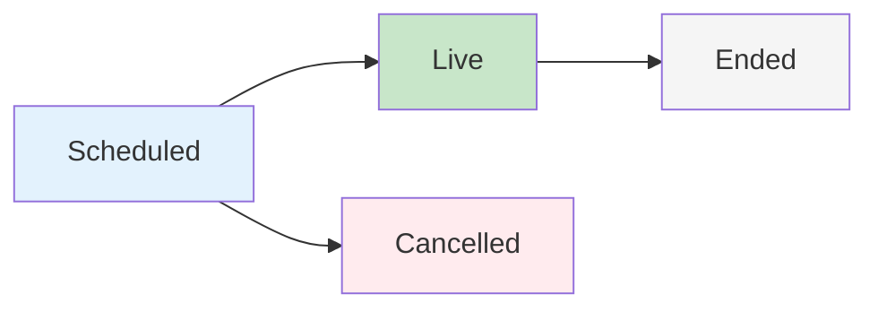

# Events

The Events feature in social.plus SDK enables users to create, manage, and participate in scheduled events with comprehensive RSVP functionality. Events can be created for communities or user timelines, supporting both virtual and in-person gatherings with livestream integration.

## Overview

Events in social.plus are time-based social activities that allow users to:
- Schedule virtual or in-person events
- Manage event details including location and timezone
- Track attendees through RSVP responses
- Create discussion spaces for event participants
- Integrate livestreaming for virtual events
- Discover upcoming and past events

## Key Features

<CardGroup cols={2}>
  <Card title="Event Creation" icon="calendar-plus">
    **Schedule and organize events**
    - Virtual and in-person event types
    - Timezone-aware scheduling
    - Cover images and descriptions
    - Location and external URL support
  </Card>
  <Card title="RSVP Management" icon="user-check">
    **Track event attendance**
    - Going and Not Going responses
    - Attendee lists and counts
    - User RSVP history
    - Response notifications
  </Card>
  <Card title="Event Discovery" icon="search">
    **Find relevant events**
    - Query by community or user
    - Filter by status and type
    - Sort by start time or creation date
    - Upcoming and past event views
  </Card>
  <Card title="Livestream Integration" icon="video">
    **Virtual event broadcasting**
    - Schedule events with livestream
    - Automatic discussion community
    - Live chat during broadcasts
    - Event-specific permissions
  </Card>
</CardGroup>

## Event Types

Events support two distinct types to accommodate different gathering formats:

| Type | Description | Use Cases |
|------|-------------|-----------|
| **Virtual** | Online events accessible remotely | Webinars, online workshops, livestreams, virtual meetups |
| **In-Person** | Physical location-based events | Conferences, local meetups, community gatherings |

## Event Lifecycle



| Status | Description | Characteristics |
|--------|-------------|-----------------|
| **Scheduled** | Event is upcoming | Can be edited, RSVP open, notifications sent |
| **Live** | Event is currently happening | Livestream active (if applicable), real-time interaction |
| **Ended** | Event has concluded | Read-only, archived content, recorded stream available |
| **Cancelled** | Event was cancelled | No longer active, attendees notified |

## Event Permissions

Access control for event management:

| Permission | Description | Required For |
|-----------|-------------|--------------|
| `CREATE_EVENT` | Create events in global feed | Creating user timeline events |
| `CREATE_EVENT_WITH_LIVESTREAM` | Create events with livestream capability | Virtual events with broadcasting |
| `DELETE_EVENT` | Delete any event | Removing events (moderator) |
| `MANAGE_COMMUNITY_EVENTS` | Manage events in a community | Community event moderation |

<Note>
**Permission Scope**: Permissions can be granted globally or per-community. Check permissions before showing creation options.
</Note>

## Event Origin Types

Events can be created in two contexts:

| Origin | Description | Access Control |
|--------|-------------|----------------|
| **Community** | Event belongs to a specific community | Community members can view and RSVP |
| **User** | Event created on user's timeline | Follows user's privacy settings |

## Quick Start

<Steps>
  <Step title="Create an Event">
    Schedule a new event with essential details
    ```typescript
    import { EventRepository, AmityEventType, AmityEventOriginType } from '@amityco/ts-sdk';

    const { data: event } = await EventRepository.createEvent({
      title: "Community Meetup 2025",
      description: "Join us for our annual community gathering",
      type: AmityEventType.InPerson,
      startTime: "2025-02-15T18:00:00Z",
      endTime: "2025-02-15T21:00:00Z",
      originType: AmityEventOriginType.Community,
      originId: "community-123",
      location: "123 Main St, City",
      metadata: {
        timezone: "America/New_York"
      }
    });
    ```
  </Step>
  <Step title="RSVP to Event">
    Respond to an event invitation
    ```typescript
    import { AmityEventResponseStatus } from '@amityco/ts-sdk';

    const rsvp = await event.createRSVP(AmityEventResponseStatus.Going);
    ```
  </Step>
  <Step title="Query Events">
    Discover upcoming events
    ```typescript
    import { EventRepository, AmityEventOriginType, AmityEventStatus, AmityEventSortOption } from '@amityco/ts-sdk';

    const unsubscribe = EventRepository.getEvents(
      {
        originType: AmityEventOriginType.Community,
        originId: "community-123",
        status: AmityEventStatus.Scheduled,
        sortBy: AmityEventSortOption.StartTime
      },
      ({ data: events, loading, error }) => {
        console.log("Upcoming events:", events);
      }
    );
    ```
  </Step>
</Steps>

## Common Use Cases

### Community Events
Create events that bring community members together:
- Weekly community calls
- Monthly meetups
- Special announcements
- Collaborative workshops

### Virtual Gatherings
Host online events with livestream integration:
- Webinars and presentations
- Live Q&A sessions
- Virtual conferences
- Online workshops

### Hybrid Events
Combine in-person and virtual attendance:
- Livestream physical events
- Multi-location gatherings
- Regional meetups with online participants

## Event Data Model

Key fields in the `AmityEvent` object:

```typescript
interface AmityEvent {
  eventId: string;
  title: string;
  description: string;
  type: AmityEventType; // virtual | in_person
  status: AmityEventStatus; // scheduled | live | ended | cancelled
  startTime: string; // ISO 8601 format
  endTime?: string;
  originType: AmityEventOriginType; // community | user
  originId: string;
  userId: string; // Event creator
  rsvpCount: number;
  interestedCount: number;
  location?: string;
  externalUrl?: string;
  coverImageFileId?: string;
  tags: string[];
  metadata: {
    timezone: string;
  };
  discussionCommunityId?: string;
  isDeleted: boolean;
  createdAt: string;
  updatedAt: string;
  
  // Linked objects
  creator: AmityUser;
  targetCommunity?: AmityCommunity;
  coverImage?: AmityImage;
}
```

## RSVP Response Types

| Status | Description | Use Case |
|--------|-------------|----------|
| **Going** | User will attend | Confirmed attendance |
| **Not Going** | User won't attend | Declined invitation |

## Best Practices

<AccordionGroup>
  <Accordion title="Timezone Handling" icon="clock">
    Always store and transmit times in ISO 8601 format with timezone information:
    
    - Use UTC for storage
    - Include timezone in metadata
    - Display times in user's local timezone
    - Account for daylight saving changes
    
    ```typescript
    import { EventRepository } from '@amityco/ts-sdk';

    const { data: event } = await EventRepository.createEvent({
      // ... other required fields
      startTime: "2025-02-15T18:00:00Z", // UTC
      metadata: {
        timezone: "America/New_York" // Display timezone
      }
    });
    ```
  </Accordion>
  
  <Accordion title="Event Scheduling" icon="calendar">
    Consider these factors when scheduling events:
    
    - Allow sufficient lead time for promotion
    - Check for conflicting events
    - Consider timezone differences for virtual events
    - Set appropriate end times
    - Send reminder notifications
  </Accordion>
  
  <Accordion title="Permission Management" icon="shield">
    Implement proper permission checks:
    
    ```typescript
    // Check global permission
    const canCreate = await client.hasPermission(
      AmityPermission.CREATE_EVENT
    );
    
    // Check community permission
    const canCreateInCommunity = await client.hasPermission(
      AmityPermission.CREATE_EVENT,
      communityId
    );
    ```
  </Accordion>
  
  <Accordion title="Event Discovery" icon="magnifying-glass">
    Optimize event queries for better discovery:
    
    - Use appropriate filters (status, type, origin)
    - Sort by relevant criteria (start time, creation date)
    - Implement pagination for large result sets
    - Cache frequently accessed events
  </Accordion>
</AccordionGroup>

## Next Steps

<CardGroup cols={3}>
  <Card title="Create Events" href="./create-event" icon="plus">
    Learn how to create and schedule new events
  </Card>
  <Card title="Manage Events" href="./manage-events" icon="gear">
    Update, delete, and query existing events
  </Card>
  <Card title="RSVP Management" href="./event-rsvp" icon="user-check">
    Handle event responses and track attendance
  </Card>
</CardGroup>
