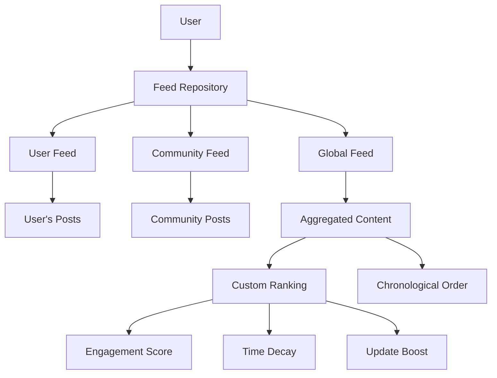

# Feed


## Overview

social.plus SDK provides a powerful Feed feature that allows users to stay informed, communicate, and express themselves through ranked posts. The Feed system creates an engaging timeline experience with intelligent content curation and multiple feed types to suit different user needs.



## Feed Types

<CardGroup cols={3}>
  <Card title="User Feed" icon="user">
    A personalized collection of posts curated for an individual user's timeline, providing relevant content they generate and interact with.
  </Card>
  
  <Card title="Community Feed" icon="users">
    Posts generated by members of a particular community, fostering connection and engagement within specific groups.
  </Card>
  
  <Card title="Global Feed" icon="globe">
    Aggregated content from both User and Community feeds, providing a comprehensive view of all relevant content in the user's network.
  </Card>
</CardGroup>

## Key Features

<AccordionGroup>
  <Accordion title="Smart Content Curation">
    Intelligent algorithms ensure users see the most relevant and engaging content based on their interests and community participation.
  </Accordion>

  <Accordion title="Custom Post Ranking">
    Advanced scoring system that considers engagement rate, posting time, and content updates to surface the most relevant posts.
  </Accordion>

  <Accordion title="Real-time Updates">
    Live feed updates ensure users always see the latest content without manual refresh.
  </Accordion>

  <Accordion title="Multi-platform Support">
    Consistent feed experience across iOS, Android, Web, and Flutter applications.
  </Accordion>
</AccordionGroup>

## Implementation

Feed management methods are contained in the `AmityFeedRepository` class. For querying posts from User Feed and Community Feed, refer to the [Posts Query documentation](/social-plus-sdk/social/posts/query-post).

### Initialize Feed Repository

<Tabs>
  <Tab title="iOS">
    <CodeGroup>
      ```swift Initialize Feed Repository
      import AmitySDK

      class FeedManager {
          private let feedRepository: AmityFeedRepository
          
          init() {
              // Initialize the feed repository
              self.feedRepository = AmityFeedRepository(client: AmityManager.shared.client!)
          }
          
          func setupFeedObserver() {
              // The repository is now ready for feed operations
              print("Feed repository initialized successfully")
          }
      }

      // Usage
      let feedManager = FeedManager()
      ```

      ```swift Advanced Setup
      import AmitySDK

      class AdvancedFeedManager {
          private let feedRepository: AmityFeedRepository
          private var feedToken: AmityNotificationToken?
          
          init() {
              self.feedRepository = AmityFeedRepository(client: AmityManager.shared.client!)
              setupRealtimeUpdates()
          }
          
          private func setupRealtimeUpdates() {
              // Setup real-time feed updates
              feedToken = NotificationCenter.default.observe(
                  name: .AmityFeedDidUpdate,
                  object: nil,
                  queue: .main
              ) { [weak self] _ in
                  self?.handleFeedUpdate()
              }
          }
          
          private func handleFeedUpdate() {
              print("Feed updated with new content")
          }
          
          deinit {
              feedToken?.invalidate()
          }
      }
      ```
    </CodeGroup>
  </Tab>

  <Tab title="Android">
    <CodeGroup>
      ```kotlin Initialize Feed Repository
      import com.amity.socialcloud.sdk.AmityCoreClient
      import com.amity.socialcloud.sdk.social.feed.AmityFeedRepository

      class FeedManager {
          private val feedRepository: AmityFeedRepository
          
          init {
              // Initialize the feed repository
              feedRepository = AmityCoreClient.newFeedRepository()
          }
          
          fun setupFeedObserver() {
              // The repository is now ready for feed operations
              println("Feed repository initialized successfully")
          }
      }

      // Usage
      val feedManager = FeedManager()
      ```

      ```kotlin Advanced Setup
      import com.amity.socialcloud.sdk.AmityCoreClient
      import com.amity.socialcloud.sdk.social.feed.AmityFeedRepository
      import io.reactivex.rxjava3.disposables.CompositeDisposable

      class AdvancedFeedManager {
          private val feedRepository: AmityFeedRepository = AmityCoreClient.newFeedRepository()
          private val compositeDisposable = CompositeDisposable()
          
          init {
              setupRealtimeUpdates()
          }
          
          private fun setupRealtimeUpdates() {
              // Setup real-time feed updates
              val disposable = feedRepository.observeFeedUpdates()
                  .subscribe(
                      { handleFeedUpdate() },
                      { error -> handleError(error) }
                  )
              compositeDisposable.add(disposable)
          }
          
          private fun handleFeedUpdate() {
              println("Feed updated with new content")
          }
          
          private fun handleError(error: Throwable) {
              println("Feed update error: ${error.message}")
          }
          
          fun dispose() {
              compositeDisposable.dispose()
          }
      }
      ```
    </CodeGroup>
  </Tab>

  <Tab title="TypeScript">
    <CodeGroup>
      ```typescript Initialize Feed Repository
      import { FeedRepository } from '@amityco/ts-sdk';

      class FeedManager {
          private feedRepository: FeedRepository;
          
          constructor() {
              // Initialize the feed repository
              this.feedRepository = new FeedRepository();
          }
          
          setupFeedObserver(): void {
              // The repository is now ready for feed operations
              console.log('Feed repository initialized successfully');
          }
      }

      // Usage
      const feedManager = new FeedManager();
      ```

      ```typescript Advanced Setup
      import { FeedRepository, FeedUpdateEvent } from '@amityco/ts-sdk';

      class AdvancedFeedManager {
          private feedRepository: FeedRepository;
          private feedUpdateSubscription?: () => void;
          
          constructor() {
              this.feedRepository = new FeedRepository();
              this.setupRealtimeUpdates();
          }
          
          private setupRealtimeUpdates(): void {
              // Setup real-time feed updates
              this.feedUpdateSubscription = this.feedRepository.onFeedUpdate(
                  (event: FeedUpdateEvent) => {
                      this.handleFeedUpdate(event);
                  }
              );
          }
          
          private handleFeedUpdate(event: FeedUpdateEvent): void {
              console.log('Feed updated with new content:', event);
          }
          
          dispose(): void {
              if (this.feedUpdateSubscription) {
                  this.feedUpdateSubscription();
              }
          }
      }
      ```
    </CodeGroup>
  </Tab>

  <Tab title="Flutter">
    <CodeGroup>
      ```dart Initialize Feed Repository
      import 'package:amity_sdk/amity_sdk.dart';

      class FeedManager {
        late AmityFeedRepository _feedRepository;
        
        FeedManager() {
          // Initialize the feed repository
          _feedRepository = AmitySocialClient.newFeedRepository();
        }
        
        void setupFeedObserver() {
          // The repository is now ready for feed operations
          print('Feed repository initialized successfully');
        }
      }

      // Usage
      final feedManager = FeedManager();
      ```

      ```dart Advanced Setup
      import 'package:amity_sdk/amity_sdk.dart';
      import 'dart:async';

      class AdvancedFeedManager {
        late AmityFeedRepository _feedRepository;
        StreamSubscription<AmityFeedUpdateEvent>? _feedUpdateSubscription;
        
        AdvancedFeedManager() {
          _feedRepository = AmitySocialClient.newFeedRepository();
          _setupRealtimeUpdates();
        }
        
        void _setupRealtimeUpdates() {
          // Setup real-time feed updates
          _feedUpdateSubscription = _feedRepository.onFeedUpdate.listen(
            (event) => _handleFeedUpdate(event),
            onError: (error) => _handleError(error),
          );
        }
        
        void _handleFeedUpdate(AmityFeedUpdateEvent event) {
          print('Feed updated with new content: ${event.type}');
        }
        
        void _handleError(dynamic error) {
          print('Feed update error: $error');
        }
        
        void dispose() {
          _feedUpdateSubscription?.cancel();
        }
      }
      ```
    </CodeGroup>
  </Tab>
</Tabs>

## Best Practices

<CardGroup cols={2}>
  <Card title="Performance Optimization" icon="bolt">
    - Implement pagination for large feeds
    - Use lazy loading for images and media
    - Cache frequently accessed content
    - Optimize network requests with batching
  </Card>
  
  <Card title="User Experience" icon="heart">
    - Provide loading states during content fetch
    - Implement pull-to-refresh functionality
    - Show empty states when no content is available
    - Handle offline scenarios gracefully
  </Card>
</CardGroup>

## Related Documentation

- [Posts Query](/social-plus-sdk/social/posts/query-post) - Learn how to query posts in User and Community feeds
- [Custom Post Ranking](/social-plus-sdk/social/feed/custom-post-ranking) - Understand the intelligent ranking algorithm
- [Query Global Feed](/social-plus-sdk/social/feed/query-global-feed) - Implementation guide for global feed queries