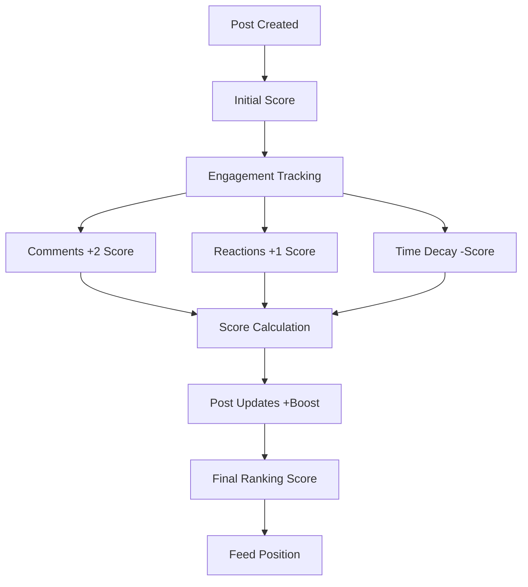

# Custom Post Ranking

## Algorithm Componentserview

Traditional feed systems display posts in chronological order, where newer content always appears first. While this approach has merit, it doesn't consider user engagement or content quality. Our custom post ranking algorithm introduces intelligent content curation that prioritizes meaningful interactions and engaging content.


Custom Post Ranking

In our previous implementation of our global feed, we rank posts in chronological order. This means that newer posts will rank higher than older ones, thus, the former will show up higher in the feed. While this is not a bad algorithm, other factors should also be considered to determine the posts’ ranking in the global feed.

With our new custom post ranking algorithm, we are using a smarter ranking in our global feed that supports a score-sorting mechanism. We focus on what we consider as “meaningful interactions”. This means that, aside from the post’s submission time, we also factor in user engagements, i.e., posts with more comments and reactions will have a higher ranking. In addition, we factor in the updates and edits done to the post.

## Algorithm Components

<CardGroup cols={3}>
  <Card title="Engagement Rate" icon="heart">
    Posts with more comments and reactions rank higher. Comments score twice as much as reactions due to deeper engagement.
  </Card>
  
  <Card title="Time Decay" icon="clock">
    Newer posts naturally rank higher, with scores decreasing over time to maintain feed freshness.
  </Card>
  
  <Card title="Update Boost" icon="arrow-up">
    Post edits and updates provide score boosts, keeping relevant content visible longer.
  </Card>
</CardGroup>

## Ranking Factors

### Primary Factors

<AccordionGroup>
  <Accordion title="Engagement Metrics">
    - **Comments Count**: Each comment adds significant weight (2x multiplier)
    - **Reactions Count**: Each reaction adds moderate weight (1x multiplier)
    - **Engagement Velocity**: Rate of new interactions over time
  </Accordion>

  <Accordion title="Temporal Factors">
    - **Creation Time** (`createdAt`): Base timestamp for age calculation
    - **Time Decay Function**: Exponential decrease over time
    - **Recency Bonus**: Newer posts receive initial boost
  </Accordion>

  <Accordion title="Content Updates">
    - **Last Updated** (`updatedAt`): Any content modification
    - **Edit Timestamp** (`editedAt`): Direct content edits
    - **Update Boost**: Temporary score increase after updates
  </Accordion>
</AccordionGroup>

### Scoring Formula

The ranking system uses these post model properties:

```javascript Mathematical Formula
// Simplified representation of the ranking algorithm
function calculatePostScore(post) {
  const engagementScore = (post.commentsCount * 2) + (post.reactionsCount * 1);
  const timeDecay = calculateTimeDecay(post.createdAt);
  const updateBoost = calculateUpdateBoost(post.updatedAt, post.editedAt);
  
  return (engagementScore * timeDecay) + updateBoost;
}

function calculateTimeDecay(createdAt) {
  const ageInHours = (Date.now() - createdAt) / (1000 * 60 * 60);
  return Math.pow(0.98, ageInHours); // 2% decay per hour
}

function calculateUpdateBoost(updatedAt, editedAt) {
  const latestUpdate = Math.max(updatedAt, editedAt || 0);
  const timeSinceUpdate = Date.now() - latestUpdate;
  const hoursAfterUpdate = timeSinceUpdate / (1000 * 60 * 60);
  
  // Boost decays over 24 hours
  return hoursAfterUpdate < 24 ? Math.max(0, 10 - (hoursAfterUpdate * 0.4)) : 0;
}
```

```json Post Model Properties
{
  "commentsCount": "number - total comments on the post",
  "reactionsCount": "number - total reactions on the post", 
  "createdAt": "timestamp - when post was originally created",
  "updatedAt": "timestamp - last modification time",
  "editedAt": "timestamp - when content was last edited"
}
```

## How it Works

### Score Calculation Process

1. **Initial Score**: Based on post creation time and initial engagement
2. **Engagement Weighting**: Comments weighted 2x more than reactions
3. **Time Decay Application**: Score reduces over time to promote fresh content
4. **Update Boosts**: Recent updates temporarily increase visibility
5. **Final Ranking**: Posts sorted by calculated score in descending order

### Real-time Updates

<Info>
Post scores are recalculated for every query, ensuring rankings reflect the most current engagement data. This means pagination results may shift as users interact with content.
</Info>

## Configuration

### Custom Ranking Logic

If you need to tailor the ranking algorithm to your specific requirements:

<Steps>
  <Step title="Contact Support">
    Reach out to [social.plus Support](https://ekoapp.atlassian.net/servicedesk/customer/portal/3) with your ranking requirements
  </Step>
  
  <Step title="Review Process">
    Our team will review your use case and discuss optimal ranking parameters
  </Step>
  
  <Step title="Implementation">
    Custom ranking logic will be applied to your network configuration
  </Step>
  
  <Step title="Testing">
    Validate the new ranking behavior in your development environment
  </Step>
</Steps>

<Note>
Future releases will include ranking configuration options in the social.plus Console, allowing self-service updates without support tickets.
</Note>

## Limitations

<Warning>
Current implementation has the following constraints:

- **Global Feed Delay**: New posts appear immediately in User Feed but may have momentary delay in Global Feed due to ranking calculations
- **Configuration Restrictions**: Ranking formula updates require support team assistance
- **Visibility Limits**: Maximum 20 posts per user/community visible in global feed
- **Data Migration**: Only posts created with SDK version 5.10+ utilize custom ranking
</Warning>

## Implementation

Ready to implement custom post ranking in your application? Check out our comprehensive guide:

<Card title="Query Global Feed Implementation" icon="code" href="./query-global-feed">
  Learn how to integrate custom post ranking into your global feed queries with detailed code examples for all supported platforms.
</Card>

## UI Kit Integration

We also provide ready-to-use UI components for custom post ranking:

<CardGroup cols={2}>
  <Card title="iOS UI Kit" icon="apple" href="/uikit/components/overview">
    Pre-built iOS components with custom ranking support
  </Card>
  
  <Card title="Android UI Kit" icon="android" href="/uikit/components/overview">
    Native Android components with ranking implementation
  </Card>
</CardGroup>

## Best Practices

<CardGroup cols={2}>
  <Card title="Performance" icon="bolt">
    - Implement efficient pagination
    - Cache ranking calculations when possible
    - Monitor query performance metrics
    - Use appropriate page sizes
  </Card>
  
  <Card title="User Experience" icon="users">
    - Explain ranking to users transparently
    - Provide chronological fallback option
    - Handle ranking changes gracefully
    - Consider user preferences
  </Card>
</CardGroup>
