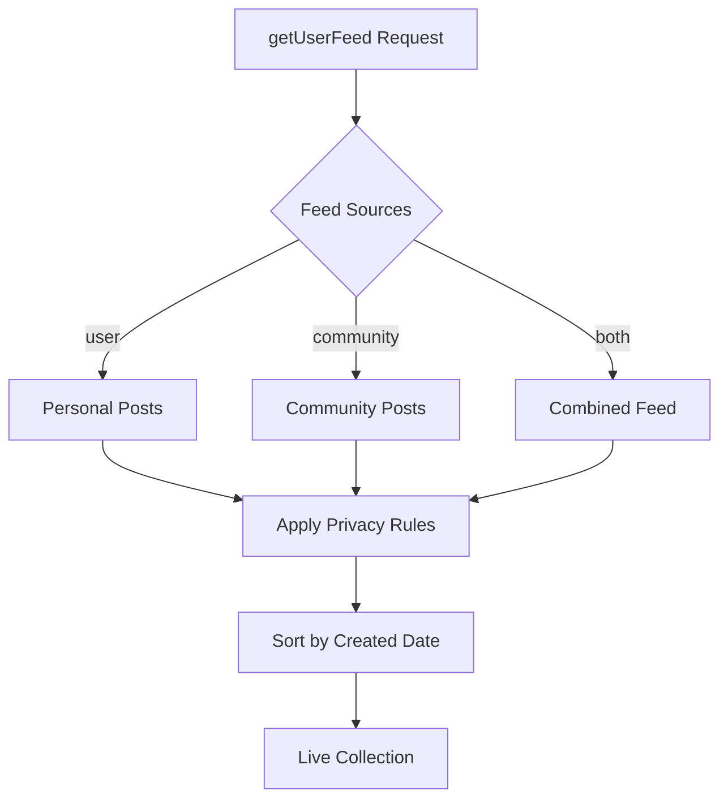

# Get User Feed

The `getUserFeed` API enables you to query a user's personal feed posts alongside posts they've authored in public communities. This provides a comprehensive view of user activity across the platform.

## Overview



<CardGroup cols={2}>
  <Card title="Flexible Sources" icon="filter">
    Query personal posts, community posts, or both with configurable feed
    sources
  </Card>
  <Card title="Privacy Aware" icon="shield">
    Automatically respects user privacy settings and community visibility rules
  </Card>
</CardGroup>

## API Overview

The new feed repository approach uses the `getUserFeed` method with configurable feed sources:

```
GET /api/v4/user-feeds/:userId

feed_repository.getUserFeed(
  userId: string,
  feedSources?: ('user' | 'community')[],  // default: ['user']
  dataTypes?: string[],                    // default: all types
  sortBy?: string,                         // default: 'lastCreated'
  includeDeleted?: boolean,                // default: false
  matchingOnlyParentPost?: boolean         // default: true
)
```

## Parameters

| Parameter                | Type    | Description                            | Default         | Options                                                                   |
| ------------------------ | ------- | -------------------------------------- | --------------- | ------------------------------------------------------------------------- |
| `userId`                 | String  | Target user ID                         | Required        | Any valid user ID                                                         |
| `feedSources`            | Array   | Source types for feed content          | `['user']`      | `'user'`, `'community'`, `['user', 'community']`                          |
| `dataTypes`              | Array   | Post content types to include          | All types       | `text`, `image`, `video`, `file`, `audio`, `poll`, `liveStream`, `custom` |
| `sortBy`                 | String  | Sort order for results                 | `'lastCreated'` | `'lastCreated'`, `'firstCreated'`                                         |
| `includeDeleted`         | Boolean | Include soft-deleted posts             | `false`         | `true`, `false`                                                           |
| `includeMixedStructure`  | Boolean | Include mixed media posts in filtering | `false`         | `true`, `false`. When true, posts with mixed media types are included when filtering by `dataTypes`. See [Query Posts - Mixed Media Filtering](/social-plus-sdk/social/content-management/posts/retrieval/query-posts#mixed-media-filtering) for details. |
| `matchingOnlyParentPost` | Boolean | Include only parent posts (no replies) | `true`          | `true`, `false`                                                           |
| `untilAt`                | DateTime | Time boundary for pagination (local-only). Stops fetching posts beyond this datetime. | None | See [Time-Bounded Pagination](#time-bounded-pagination-with-untilat). Available on **iOS** and **Android** only. |

## Feed Source Types

| Source Type             | Description                                             | Visibility                       |
| ----------------------- | ------------------------------------------------------- | -------------------------------- |
| `'user'`                | Posts made directly to the user's personal feed         | Based on user's privacy settings |
| `'community'`           | Posts authored by the user in public communities        | Public community posts only      |
| `['user', 'community']` | Combined feed showing both personal and community posts | Merged in chronological order    |

## Implementation Examples

<Tabs>
  <Tab title="iOS">
    ```swift
    import AmitySDK
    
    class UserFeedManager {
        private let client: AmityClient
        
        init(client: AmityClient) {
            self.client = client
        }
        
        // Query user's personal feed only (default behavior)
        func getUserPersonalFeed(
            userId: String,
            sortBy: AmityPostQuerySortOption = .lastCreated
        ) -> AmityCollection<AmityPost> {
            
            let repository = AmityFeedRepository(client: client)
            
            return repository.getUserFeed(
                userId: userId,
                feedSources: ["user"],
                sortBy: sortBy,
                includeDeleted: false,
                matchingOnlyParentPost: true
            )
        }
        
        // Query user's community posts only
        func getUserCommunityPosts(
            userId: String,
            includeDeleted: Bool = false
        ) -> AmityCollection<AmityPost> {
            
            let repository = AmityFeedRepository(client: client)
            
            return repository.getUserFeed(
                userId: userId,
                feedSources: ["community"],
                sortBy: .lastCreated,
                includeDeleted: includeDeleted,
                matchingOnlyParentPost: true
            )
        }
        
        // Query combined feed (personal + community posts)
        func getUserCombinedFeed(
            userId: String,
            dataTypes: [AmityPostDataType] = []
        ) -> AmityCollection<AmityPost> {
            
            let repository = AmityFeedRepository(client: client)
            
            return repository.getUserFeed(
                userId: userId,
                feedSources: ["user", "community"],
                dataTypes: dataTypes.isEmpty ? nil : dataTypes,
                sortBy: .lastCreated,
                includeDeleted: false,
                matchingOnlyParentPost: true
            )
        }
        
        // Observe feed with community posts
        func observeUserCombinedFeed(
            userId: String,
            onUpdate: @escaping ([AmityPost]) -> Void,
            onError: @escaping (Error) -> Void
        ) -> AmityNotificationToken {
            
            let collection = getUserCombinedFeed(userId: userId)
            
            return collection.observe { result in
                switch result {
                case .success(let postsInfo):
                    let posts = postsInfo.object
                    onUpdate(posts)
                    
                case .failure(let error):
                    onError(error)
                }
            }
        }
    }
    ```
  </Tab>
  
  <Tab title="Android">
    ```kotlin
    import co.amity.sdk.*
    
    class UserFeedManager {
        
        // Query user's personal feed only
        fun getUserPersonalFeed(
            userId: String,
            sortBy: AmityPostQuerySortOption = AmityPostQuerySortOption.LAST_CREATED
        ): LiveData<PagingData<AmityPost>> {
            
            val repository = AmityFeedRepository.Builder().build()
            
            return repository.getUserFeed(
                userId = userId,
                feedSources = listOf("user"),
                sortBy = sortBy,
                includeDeleted = false,
                matchingOnlyParentPost = true
            )
        }
        
        // Query user's community posts only
        fun getUserCommunityPosts(
            userId: String,
            dataTypes: List<AmityDataType> = emptyList()
        ): LiveData<PagingData<AmityPost>> {
            
            val repository = AmityFeedRepository.Builder().build()
            
            return repository.getUserFeed(
                userId = userId,
                feedSources = listOf("community"),
                dataTypes = dataTypes.ifEmpty { null },
                sortBy = AmityPostQuerySortOption.LAST_CREATED,
                includeDeleted = false,
                matchingOnlyParentPost = true
            )
        }
        
        // Query combined feed (personal + community posts)
        fun getUserCombinedFeed(
            userId: String,
            includeDeleted: Boolean = false
        ): LiveData<PagingData<AmityPost>> {
            
            val repository = AmityFeedRepository.Builder().build()
            
            return repository.getUserFeed(
                userId = userId,
                feedSources = listOf("user", "community"),
                sortBy = AmityPostQuerySortOption.LAST_CREATED,
                includeDeleted = includeDeleted,
                matchingOnlyParentPost = true
            )
        }
        
        // Observe feed with live updates
        fun observeUserFeed(
            userId: String,
            feedSources: List<String> = listOf("user", "community"),
            onDataChanged: (List<AmityPost>) -> Unit
        ) {
            
            val feedLiveData = getUserCombinedFeed(userId)
            
            feedLiveData.observeForever { pagingData ->
                // Convert PagingData to List for UI
                pagingData?.let { data ->
                    // Handle paging data updates
                    onDataChanged(data.snapshot().items)
                }
            }
        }
    }
    ```
  </Tab>
  
  <Tab title="TypeScript">
    ```typescript
    import { AmityFeedRepository, AmityPost, LiveCollection } from '@amityco/ts-sdk';
    
    interface UserFeedOptions {
      feedSources?: ('user' | 'community')[];
      dataTypes?: string[];
      sortBy?: 'lastCreated' | 'firstCreated';
      includeDeleted?: boolean;
      matchingOnlyParentPost?: boolean;
    }
    
    class UserFeedManager {
      private repository: AmityFeedRepository;
      
      constructor() {
        this.repository = new AmityFeedRepository();
      }
      
      // Query user's personal feed only
      async getUserPersonalFeed(
        userId: string,
        options: Partial<UserFeedOptions> = {}
      ): Promise<AmityPost[]> {
        
        return this.repository.getUserFeed(
          userId,
          ['user'],  // feedSources
          options.dataTypes,
          options.sortBy || 'lastCreated',
          options.includeDeleted || false,
          options.matchingOnlyParentPost !== false
        );
      }
      
      // Query user's community posts only
      async getUserCommunityPosts(
        userId: string,
        dataTypes?: string[]
      ): Promise<AmityPost[]> {
        
        return this.repository.getUserFeed(
          userId,
          ['community'],  // feedSources
          dataTypes,
          'lastCreated',
          false,
          true
        );
      }
      
      // Query combined feed (personal + community posts)
      async getUserCombinedFeed(
        userId: string,
        options: Partial<UserFeedOptions> = {}
      ): Promise<AmityPost[]> {
        
        return this.repository.getUserFeed(
          userId,
          ['user', 'community'],  // feedSources
          options.dataTypes,
          options.sortBy || 'lastCreated',
          options.includeDeleted || false,
          options.matchingOnlyParentPost !== false
        );
      }
      
      // Live collection for real-time updates
      getUserFeedLiveCollection(
        userId: string,
        feedSources: ('user' | 'community')[] = ['user', 'community']
      ): LiveCollection<AmityPost> {
        
        return this.repository.getUserFeedCollection(
          userId,
          feedSources,
          undefined, // dataTypes
          'lastCreated',
          false, // includeDeleted
          true   // matchingOnlyParentPost
        );
      }
      
      // Filter by specific post types
      async getUserMediaFeed(
        userId: string,
        feedSources: ('user' | 'community')[] = ['user', 'community']
      ): Promise<AmityPost[]> {
        
        return this.repository.getUserFeed(
          userId,
          feedSources,
          ['image', 'video'], // Only media posts
          'lastCreated',
          false,
          true
        );
      }
    }
    ```
  </Tab>
  
  <Tab title="Flutter">
    ```dart
    import 'package:amity_sdk/amity_sdk.dart';
    
    class UserFeedManager {
      
      // Query user's personal feed only
      Future<List<AmityPost>> getUserPersonalFeed(
        String userId, {
        AmityPostQuerySortOption sortBy = AmityPostQuerySortOption.LAST_CREATED,
        bool includeDeleted = false,
      }) async {
        
        final repository = AmityFeedRepository();
        
        return await repository.getUserFeed(
          userId: userId,
          feedSources: ['user'],
          sortBy: sortBy,
          includeDeleted: includeDeleted,
          matchingOnlyParentPost: true,
        );
      }
      
      // Query user's community posts only
      Future<List<AmityPost>> getUserCommunityPosts(
        String userId, {
        List<AmityDataType>? dataTypes,
        bool includeDeleted = false,
      }) async {
        
        final repository = AmityFeedRepository();
        
        return await repository.getUserFeed(
          userId: userId,
          feedSources: ['community'],
          dataTypes: dataTypes,
          sortBy: AmityPostQuerySortOption.LAST_CREATED,
          includeDeleted: includeDeleted,
          matchingOnlyParentPost: true,
        );
      }
      
      // Query combined feed (personal + community posts)
      Future<List<AmityPost>> getUserCombinedFeed(
        String userId, {
        List<AmityDataType>? dataTypes,
        AmityPostQuerySortOption sortBy = AmityPostQuerySortOption.LAST_CREATED,
      }) async {
        
        final repository = AmityFeedRepository();
        
        return await repository.getUserFeed(
          userId: userId,
          feedSources: ['user', 'community'],
          dataTypes: dataTypes,
          sortBy: sortBy,
          includeDeleted: false,
          matchingOnlyParentPost: true,
        );
      }
      
      // Stream for real-time updates
      Stream<List<AmityPost>> getUserFeedStream(
        String userId,
        List<String> feedSources,
      ) {
        
        final repository = AmityFeedRepository();
        
        return repository.getUserFeedStream(
          userId: userId,
          feedSources: feedSources,
          sortBy: AmityPostQuerySortOption.LAST_CREATED,
          includeDeleted: false,
          matchingOnlyParentPost: true,
        );
      }
      
      // Query with pagination
      Future<AmityCollection<AmityPost>> getUserFeedWithPagination(
        String userId,
        List<String> feedSources, {
        int limit = 20,
      }) async {
        
        final repository = AmityFeedRepository();
        
        return await repository.getUserFeedCollection(
          userId: userId,
          feedSources: feedSources,
          limit: limit,
          sortBy: AmityPostQuerySortOption.LAST_CREATED,
          includeDeleted: false,
          matchingOnlyParentPost: true,
        );
      }
    }
    ```
  </Tab>
</Tabs>

## Time-Bounded Pagination with `untilAt`

<Info>
**Platform Availability**: The `untilAt` parameter is currently available on **iOS** and **Android** only. Web (TypeScript) support is under development.
</Info>

The `untilAt` parameter lets you constrain the user feed to a specific time window. When provided, the SDK stops fetching and collecting posts beyond the given datetime boundary. This is useful for building "catch-up" feeds or historical profile views.

- **Local-only filter** — `untilAt` is never sent to the backend.
- **Exclusive comparison** — A post whose `createdAt` equals exactly `untilAt` is **not** included.
- **Automatic pagination stop** — Once the boundary is reached, no further pages are fetched.
- **Real-time aware** — Posts arriving via real-time events are also checked against the boundary.

| Sort Direction | `untilAt` Acts As | Excludes Posts Where |
|----------------|-------------------|---------------------|
| `lastCreated` (newest first) | Lower bound | `createdAt < untilAt` |
| `firstCreated` (oldest first) | Upper bound | `createdAt > untilAt` |

<Tabs>
  <Tab title="iOS">
    ```swift
    import AmitySDK

    let repository = AmityFeedRepository(client: client)

    // Show only posts from the last 30 days
    let thirtyDaysAgo = Calendar.current.date(byAdding: .day, value: -30, to: Date())!

    let collection = repository.getUserFeed(
        userId: "user-123",
        feedSources: ["user", "community"],
        sortBy: .lastCreated,
        includeDeleted: false,
        matchingOnlyParentPost: true,
        untilAt: thirtyDaysAgo
    )

    let token = collection.observe { result in
        switch result {
        case .success(let postsInfo):
            let posts = postsInfo.object
            // All posts will have createdAt >= thirtyDaysAgo
            print("Posts in time window: \(posts.count)")
        case .failure(let error):
            print("Error: \(error)")
        }
    }
    ```
  </Tab>

  <Tab title="Android">
    ```kotlin
    import co.amity.sdk.*
    import java.util.Calendar

    val repository = AmityFeedRepository.Builder().build()

    // Show only posts from the last 30 days
    val thirtyDaysAgo = Calendar.getInstance().apply {
        add(Calendar.DAY_OF_YEAR, -30)
    }.time

    repository.getUserFeed(
        userId = "user-123",
        feedSources = listOf("user", "community"),
        sortBy = AmityPostQuerySortOption.LAST_CREATED,
        includeDeleted = false,
        matchingOnlyParentPost = true,
        untilAt = thirtyDaysAgo
    ).subscribe { pagingData ->
        // All posts will have createdAt >= thirtyDaysAgo
        // Handle pagingData
    }
    ```
  </Tab>
</Tabs>

## Privacy and Visibility Rules

<AccordionGroup>
  <Accordion title="Community Posts Visibility" icon="eye">
    **Public Communities Only**: Only posts from public communities are included
    in user feeds - Posts from private communities are never shown - Community
    privacy changes affect visibility retroactively - Deleted communities remove
    all associated posts from user feeds
  </Accordion>

{" "}
<Accordion title="User Profile Privacy" icon="shield">
  **Privacy Settings Integration**: User feed visibility respects profile
  privacy - Private profiles: Only followers can see the combined feed - Public
  profiles: Anyone can view community posts - Blocked users: See empty state
  with filter options still visible
</Accordion>

{" "}
<Accordion title="Community Membership" icon="users">
  **Membership Status**: Posts remain visible even after leaving communities -
  Left community: Posts remain if community is still public - Community becomes
  private: Posts are removed from user feed - Community deleted: All posts
  removed from user feed
</Accordion>

  <Accordion title="Moderation Context" icon="gavel">
    **Moderator Indicators**: Special badges for community moderators -
    Moderator badge shown on posts in communities where user is a moderator -
    Badge visibility follows community's current state - No retroactive badge
    removal when moderator status changes
  </Accordion>
</AccordionGroup>

## Use Cases

<CardGroup cols={2}>
  <Card title="User Profile Feeds" icon="user">
    Display comprehensive user activity including personal and community posts
    with privacy controls
  </Card>
  <Card title="Community Discovery" icon="compass">
    Help users discover active community contributors through their post history
  </Card>
  <Card title="Content Aggregation" icon="layer-group">
    Aggregate user content from multiple sources for analytics and insights
  </Card>
  <Card title="Moderation Review" icon="gavel">
    Review user activity across personal and community contexts for moderation
    decisions
  </Card>
</CardGroup>

## Best Practices

<AccordionGroup>
  <Accordion title="Performance Optimization" icon="bolt">
    - Use specific feedSources instead of always querying both
    - Implement pagination for users with many posts
    - Cache frequently accessed user feeds
    - Dispose of live collections when no longer needed
  </Accordion>
  <Accordion title="Privacy Considerations" icon="shield">
    - Always respect user privacy settings
    - Handle blocked users appropriately
    - Provide clear UI indicators for private vs public content
    - Follow platform privacy guidelines
  </Accordion>
  <Accordion title="User Experience" icon="heart">
    - Show loading states during feed queries
    - Implement pull-to-refresh for real-time updates
    - Provide empty states for users with no content
    - Use skeleton screens for better perceived performance
  </Accordion>
  <Accordion title="Error Handling" icon="triangle-exclamation">
    - Handle network connectivity issues gracefully
    - Implement retry mechanisms for failed queries
    - Provide meaningful error messages
    - Log errors for debugging without exposing sensitive information
  </Accordion>
</AccordionGroup>

<Info>
  **Backward Compatibility**: The default behavior (`feedSources: ['user']`)
  maintains existing functionality. Enable community posts by explicitly setting
  `feedSources: ['user', 'community']`.
</Info>

<Warning>
  **Privacy Note**: Community posts are only included from public communities.
  Private community content is never exposed through user feeds, ensuring user
  privacy and community security.
</Warning>
