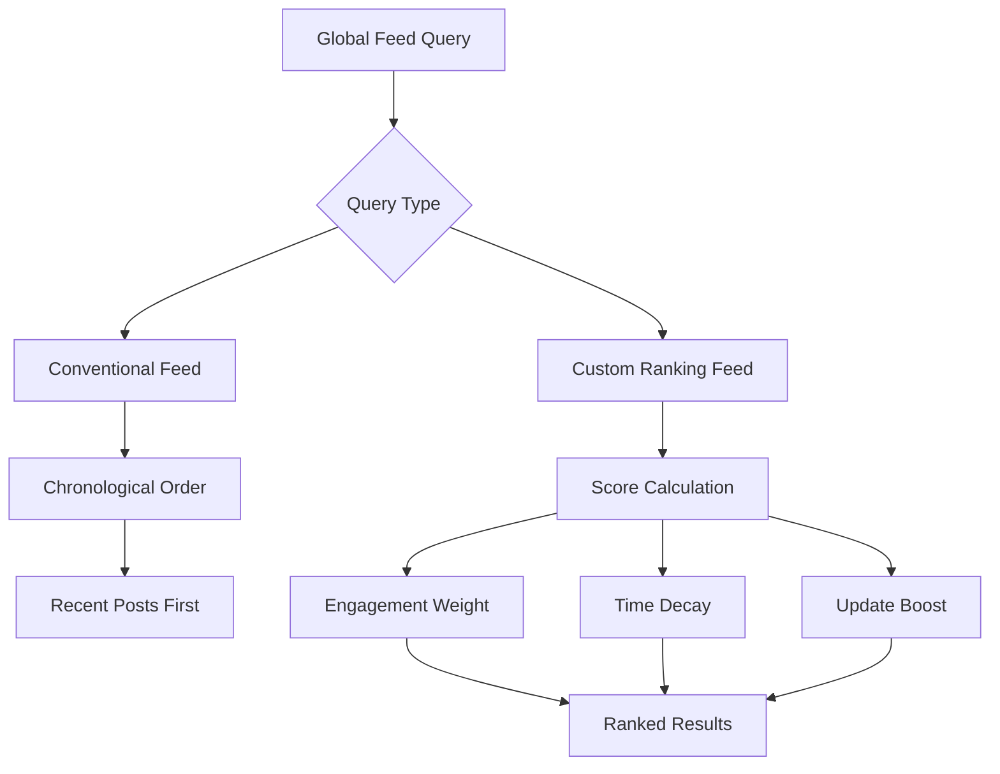

# Query Global Feed

## Overview

The social.plus SDK provides two powerful approaches for retrieving global feed content: conventional chronological ordering and intelligent custom post ranking. This flexibility allows you to create the optimal content experience for your users based on your application's specific needs.



## Feed Query Methods

<CardGroup cols={2}>
  <Card title="Conventional Global Feed" icon="clock">
    Simple chronological ordering with the most recent posts appearing first. Perfect for real-time content streams.
  </Card>
  
  <Card title="Custom Post Ranking" icon="star">
    Intelligent content curation using engagement metrics, time decay, and update boosts for optimal user experience.
  </Card>
</CardGroup>

## Conventional Global Feed Query

The `getGlobalFeed` method provides a straightforward way to query posts in chronological order, ensuring users see the most recent content first.

<Info>
The system displays the 20 most recent posts per community in the global feed. Older posts may not be visible to optimize performance and relevance.
</Info>

### Implementation

<Tabs>
  <Tab title="iOS">
    <CodeGroup>
      ```swift Basic Global Feed Query
      import AmitySDK

      class GlobalFeedManager {
          private let feedRepository: AmityFeedRepository
          private var feedCollection: AmityCollection<AmityPost>?
          private var feedToken: AmityNotificationToken?
          
          init() {
              self.feedRepository = AmityFeedRepository(client: AmityManager.shared.client!)
          }
          
          func queryGlobalFeed() {
              // Create global feed query
              let query = feedRepository.getGlobalFeed()
              
              // Observe feed changes
              feedToken = query.observe { [weak self] collection, _, error in
                  if let error = error {
                      print("Global feed error: \(error.localizedDescription)")
                      return
                  }
                  
                  self?.feedCollection = collection
                  self?.handleFeedUpdate(posts: collection.allObjects())
              }
          }
          
          private func handleFeedUpdate(posts: [AmityPost]) {
              print("Global feed updated with \(posts.count) posts")
              // Update UI with new posts
          }
          
          deinit {
              feedToken?.invalidate()
          }
      }
      ```

      ```swift Advanced Global Feed with Pagination
      import AmitySDK

      class AdvancedGlobalFeedManager {
          private let feedRepository: AmityFeedRepository
          private var feedCollection: AmityCollection<AmityPost>?
          private var feedToken: AmityNotificationToken?
          
          init() {
              self.feedRepository = AmityFeedRepository(client: AmityManager.shared.client!)
          }
          
          func queryGlobalFeedWithPagination() {
              // Create global feed query with options
              let builder = AmityGlobalFeedQueryBuilder()
                  .limit(20)
                  .includeDeleted(false)
              
              let query = feedRepository.getGlobalFeed(builder: builder)
              
              feedToken = query.observe { [weak self] collection, changes, error in
                  if let error = error {
                      self?.handleError(error)
                      return
                  }
                  
                  self?.feedCollection = collection
                  self?.processFeedChanges(changes: changes, posts: collection.allObjects())
              }
          }
          
          func loadMorePosts() {
              guard let collection = feedCollection else { return }
              
              if collection.hasNext {
                  collection.nextPage()
              }
          }
          
          private func processFeedChanges(changes: [AmityCollectionChange], posts: [AmityPost]) {
              // Handle incremental updates efficiently
              for change in changes {
                  switch change {
                  case .insert(let indexPath):
                      print("New post inserted at \(indexPath)")
                  case .delete(let indexPath):
                      print("Post deleted at \(indexPath)")
                  case .update(let indexPath):
                      print("Post updated at \(indexPath)")
                  case .move(let fromIndexPath, let toIndexPath):
                      print("Post moved from \(fromIndexPath) to \(toIndexPath)")
                  }
              }
          }
          
          private func handleError(_ error: Error) {
              print("Global feed error: \(error.localizedDescription)")
          }
      }
      ```
    </CodeGroup>
  </Tab>

  <Tab title="Android">
    <CodeGroup>
      ```kotlin Basic Global Feed Query
      import com.amity.socialcloud.sdk.AmityCoreClient
      import com.amity.socialcloud.sdk.social.feed.AmityFeedRepository
      import com.amity.socialcloud.sdk.social.post.AmityPost
      import io.reactivex.rxjava3.android.schedulers.AndroidSchedulers
      import io.reactivex.rxjava3.disposables.CompositeDisposable
      import io.reactivex.rxjava3.schedulers.Schedulers

      class GlobalFeedManager {
          private val feedRepository: AmityFeedRepository = AmityCoreClient.newFeedRepository()
          private val compositeDisposable = CompositeDisposable()
          
          fun queryGlobalFeed() {
              val disposable = feedRepository.getGlobalFeed()
                  .build()
                  .query()
                  .subscribeOn(Schedulers.io())
                  .observeOn(AndroidSchedulers.mainThread())
                  .subscribe(
                      { paginatedList ->
                          handleFeedUpdate(paginatedList.data)
                      },
                      { error ->
                          handleError(error)
                      }
                  )
              
              compositeDisposable.add(disposable)
          }
          
          private fun handleFeedUpdate(posts: List<AmityPost>) {
              println("Global feed updated with ${posts.size} posts")
              // Update UI with new posts
          }
          
          private fun handleError(error: Throwable) {
              println("Global feed error: ${error.message}")
          }
          
          fun dispose() {
              compositeDisposable.dispose()
          }
      }
      ```

      ```kotlin Advanced Global Feed with Pagination
      import com.amity.socialcloud.sdk.AmityCoreClient
      import com.amity.socialcloud.sdk.social.feed.AmityFeedRepository
      import com.amity.socialcloud.sdk.social.post.AmityPost
      import androidx.paging.PagingData
      import io.reactivex.rxjava3.android.schedulers.AndroidSchedulers
      import io.reactivex.rxjava3.disposables.CompositeDisposable
      import io.reactivex.rxjava3.schedulers.Schedulers

      class AdvancedGlobalFeedManager {
          private val feedRepository: AmityFeedRepository = AmityCoreClient.newFeedRepository()
          private val compositeDisposable = CompositeDisposable()
          
          fun queryGlobalFeedWithPagination() {
              val disposable = feedRepository.getGlobalFeed()
                  .limit(20)
                  .includeDeleted(false)
                  .build()
                  .getPagingData()
                  .subscribeOn(Schedulers.io())
                  .observeOn(AndroidSchedulers.mainThread())
                  .subscribe(
                      { pagingData ->
                          handlePagingData(pagingData)
                      },
                      { error ->
                          handleError(error)
                      }
                  )
              
              compositeDisposable.add(disposable)
          }
          
          private fun handlePagingData(pagingData: PagingData<AmityPost>) {
              // Handle paging data with RecyclerView adapter
              println("Received paging data for global feed")
          }
          
          fun queryGlobalFeedRealtime() {
              val disposable = feedRepository.getGlobalFeed()
                  .build()
                  .query()
                  .subscribeOn(Schedulers.io())
                  .observeOn(AndroidSchedulers.mainThread())
                  .subscribe(
                      { paginatedList ->
                          // Real-time updates
                          handleRealtimeUpdate(paginatedList.data)
                      },
                      { error ->
                          handleError(error)
                      }
                  )
              
              compositeDisposable.add(disposable)
          }
          
          private fun handleRealtimeUpdate(posts: List<AmityPost>) {
              println("Real-time update: ${posts.size} posts")
          }
          
          private fun handleError(error: Throwable) {
              println("Global feed error: ${error.message}")
          }
          
          fun dispose() {
              compositeDisposable.dispose()
          }
      }
      ```
    </CodeGroup>
  </Tab>

  <Tab title="TypeScript">
    <CodeGroup>
      ```typescript Basic Global Feed Query
      import { FeedRepository, PostRepository, Post } from '@amityco/ts-sdk';

      class GlobalFeedManager {
          private feedRepository: FeedRepository;
          private postRepository: PostRepository;
          private unsubscribe?: () => void;
          
          constructor() {
              this.feedRepository = new FeedRepository();
              this.postRepository = new PostRepository();
          }
          
          async queryGlobalFeed(): Promise<void> {
              try {
                  // Query global feed
                  const { data: posts, hasNextPage, nextPage } = await this.feedRepository.getGlobalFeed({
                      limit: 20,
                      includeDeleted: false
                  });
                  
                  this.handleFeedUpdate(posts);
                  
                  // Setup real-time updates
                  this.unsubscribe = this.feedRepository.observeGlobalFeed((updatedPosts) => {
                      this.handleFeedUpdate(updatedPosts);
                  });
                  
              } catch (error) {
                  this.handleError(error);
              }
          }
          
          private handleFeedUpdate(posts: Post[]): void {
              console.log(`Global feed updated with ${posts.length} posts`);
              // Update UI with new posts
          }
          
          private handleError(error: any): void {
              console.error('Global feed error:', error.message);
          }
          
          dispose(): void {
              if (this.unsubscribe) {
                  this.unsubscribe();
              }
          }
      }
      ```

      ```typescript Advanced Global Feed with Pagination
      import { FeedRepository, Post, PaginationOptions } from '@amityco/ts-sdk';

      interface GlobalFeedOptions extends PaginationOptions {
          includeDeleted?: boolean;
          sortBy?: 'createdAt' | 'updatedAt';
      }

      class AdvancedGlobalFeedManager {
          private feedRepository: FeedRepository;
          private currentPage: string | undefined;
          private unsubscribe?: () => void;
          
          constructor() {
              this.feedRepository = new FeedRepository();
          }
          
          async queryGlobalFeedWithPagination(options: GlobalFeedOptions = {}): Promise<void> {
              try {
                  const feedOptions = {
                      limit: options.limit || 20,
                      before: options.before,
                      after: options.after,
                      includeDeleted: options.includeDeleted || false,
                      sortBy: options.sortBy || 'createdAt'
                  };
                  
                  const response = await this.feedRepository.getGlobalFeed(feedOptions);
                  
                  this.currentPage = response.nextPage;
                  this.handleFeedUpdate(response.data, response.hasNextPage);
                  
                  // Setup real-time updates
                  this.setupRealtimeUpdates();
                  
              } catch (error) {
                  this.handleError(error);
              }
          }
          
          async loadMorePosts(): Promise<void> {
              if (!this.currentPage) return;
              
              try {
                  const response = await this.feedRepository.getGlobalFeed({
                      limit: 20,
                      after: this.currentPage
                  });
                  
                  this.currentPage = response.nextPage;
                  this.handleMorePosts(response.data, response.hasNextPage);
                  
              } catch (error) {
                  this.handleError(error);
              }
          }
          
          private setupRealtimeUpdates(): void {
              this.unsubscribe = this.feedRepository.observeGlobalFeed((posts, changeType) => {
                  switch (changeType) {
                      case 'added':
                          console.log('New posts added to feed');
                          break;
                      case 'updated':
                          console.log('Posts updated in feed');
                          break;
                      case 'removed':
                          console.log('Posts removed from feed');
                          break;
                  }
                  this.handleRealtimeUpdate(posts, changeType);
              });
          }
          
          private handleFeedUpdate(posts: Post[], hasNextPage: boolean): void {
              console.log(`Global feed loaded with ${posts.length} posts, hasNext: ${hasNextPage}`);
          }
          
          private handleMorePosts(posts: Post[], hasNextPage: boolean): void {
              console.log(`Loaded ${posts.length} more posts, hasNext: ${hasNextPage}`);
          }
          
          private handleRealtimeUpdate(posts: Post[], changeType: string): void {
              console.log(`Real-time update (${changeType}): ${posts.length} posts`);
          }
          
          private handleError(error: any): void {
              console.error('Global feed error:', error.message);
          }
          
          dispose(): void {
              if (this.unsubscribe) {
                  this.unsubscribe();
              }
          }
      }
      ```
    </CodeGroup>
  </Tab>

  <Tab title="Flutter">
    <CodeGroup>
      ```dart Basic Global Feed Query
      import 'package:amity_sdk/amity_sdk.dart';
      import 'dart:async';

      class GlobalFeedManager {
        late AmityFeedRepository _feedRepository;
        StreamSubscription<AmityGlobalFeedPagingData>? _feedSubscription;
        
        GlobalFeedManager() {
          _feedRepository = AmitySocialClient.newFeedRepository();
        }
        
        void queryGlobalFeed() {
          // Create global feed query
          final query = _feedRepository.getGlobalFeed()
              .limit(20)
              .includeDeleted(false);
          
          // Subscribe to feed updates
          _feedSubscription = query.getPagingData().listen(
            (pagingData) {
              _handleFeedUpdate(pagingData.data);
            },
            onError: (error) {
              _handleError(error);
            },
          );
        }
        
        void _handleFeedUpdate(List<AmityPost> posts) {
          print('Global feed updated with ${posts.length} posts');
          // Update UI with new posts
        }
        
        void _handleError(dynamic error) {
          print('Global feed error: $error');
        }
        
        void dispose() {
          _feedSubscription?.cancel();
        }
      }
      ```

      ```dart Advanced Global Feed with Pagination
      import 'package:amity_sdk/amity_sdk.dart';
      import 'dart:async';

      class AdvancedGlobalFeedManager {
        late AmityFeedRepository _feedRepository;
        StreamSubscription<AmityGlobalFeedPagingData>? _feedSubscription;
        StreamSubscription<List<AmityPost>>? _realtimeSubscription;
        AmityGlobalFeedPagingData? _currentPagingData;
        
        AdvancedGlobalFeedManager() {
          _feedRepository = AmitySocialClient.newFeedRepository();
        }
        
        void queryGlobalFeedWithPagination() {
          final query = _feedRepository.getGlobalFeed()
              .limit(20)
              .includeDeleted(false);
          
          // Subscribe to paging data
          _feedSubscription = query.getPagingData().listen(
            (pagingData) {
              _currentPagingData = pagingData;
              _handleFeedUpdate(pagingData.data, pagingData.hasNextPage);
            },
            onError: (error) {
              _handleError(error);
            },
          );
          
          // Setup real-time updates
          _setupRealtimeUpdates();
        }
        
        void _setupRealtimeUpdates() {
          _realtimeSubscription = _feedRepository.observeGlobalFeed().listen(
            (posts) {
              _handleRealtimeUpdate(posts);
            },
            onError: (error) {
              _handleError(error);
            },
          );
        }
        
        Future<void> loadMorePosts() async {
          if (_currentPagingData?.hasNextPage == true) {
            try {
              await _currentPagingData!.loadNext();
            } catch (error) {
              _handleError(error);
            }
          }
        }
        
        void _handleFeedUpdate(List<AmityPost> posts, bool hasNextPage) {
          print('Global feed loaded with ${posts.length} posts, hasNext: $hasNextPage');
          // Update UI with new posts
        }
        
        void _handleRealtimeUpdate(List<AmityPost> posts) {
          print('Real-time update: ${posts.length} posts');
          // Handle real-time updates
        }
        
        void _handleError(dynamic error) {
          print('Global feed error: $error');
        }
        
        void dispose() {
          _feedSubscription?.cancel();
          _realtimeSubscription?.cancel();
        }
      }
      ```
    </CodeGroup>
  </Tab>
</Tabs>

## Custom Post Ranking Query

The `getCustomRankingGlobalFeed` method provides intelligent content curation using our advanced scoring algorithm. This approach considers engagement metrics, time decay, and content updates to surface the most relevant posts for each user.

<Note>
Custom post ranking requires SDK version 5.10 or higher. Posts created with earlier versions will not participate in the ranking algorithm.
</Note>

### Implementation

<Tabs>
  <Tab title="iOS">
    <CodeGroup>
      ```swift Basic Custom Ranking Query
      import AmitySDK

      class CustomRankingFeedManager {
          private let feedRepository: AmityFeedRepository
          private var feedCollection: AmityCollection<AmityPost>?
          private var feedToken: AmityNotificationToken?
          
          init() {
              self.feedRepository = AmityFeedRepository(client: AmityManager.shared.client!)
          }
          
          func queryCustomRankingFeed() {
              // Create custom ranking global feed query
              let query = feedRepository.getCustomRankingGlobalFeed()
              
              feedToken = query.observe { [weak self] collection, _, error in
                  if let error = error {
                      print("Custom ranking feed error: \(error.localizedDescription)")
                      return
                  }
                  
                  self?.feedCollection = collection
                  self?.handleRankedFeedUpdate(posts: collection.allObjects())
              }
          }
          
          private func handleRankedFeedUpdate(posts: [AmityPost]) {
              print("Custom ranking feed updated with \(posts.count) ranked posts")
              // Posts are automatically sorted by engagement score
              // Display posts in the order received for optimal user experience
          }
          
          deinit {
              feedToken?.invalidate()
          }
      }
      ```

      ```swift Advanced Custom Ranking with Analytics
      import AmitySDK

      class AdvancedCustomRankingManager {
          private let feedRepository: AmityFeedRepository
          private var feedCollection: AmityCollection<AmityPost>?
          private var feedToken: AmityNotificationToken?
          private var analyticsData: [String: Any] = [:]
          
          init() {
              self.feedRepository = AmityFeedRepository(client: AmityManager.shared.client!)
          }
          
          func queryCustomRankingFeedWithAnalytics() {
              let builder = AmityCustomRankingFeedQueryBuilder()
                  .limit(20)
                  .includeAnalytics(true)
                  .trackEngagement(true)
              
              let query = feedRepository.getCustomRankingGlobalFeed(builder: builder)
              
              feedToken = query.observe { [weak self] collection, changes, error in
                  if let error = error {
                      self?.handleError(error)
                      return
                  }
                  
                  self?.feedCollection = collection
                  self?.processRankedFeedWithAnalytics(
                      posts: collection.allObjects(), 
                      changes: changes
                  )
              }
          }
          
          private func processRankedFeedWithAnalytics(posts: [AmityPost], changes: [AmityCollectionChange]) {
              // Track ranking performance
              analyticsData["totalPosts"] = posts.count
              analyticsData["averageEngagement"] = calculateAverageEngagement(posts: posts)
              analyticsData["topRankedPostId"] = posts.first?.postId
              
              // Process incremental changes
              for change in changes {
                  switch change {
                  case .insert(let indexPath):
                      trackPostInsertion(at: indexPath, posts: posts)
                  case .update(let indexPath):
                      trackPostUpdate(at: indexPath, posts: posts)
                  default:
                      break
                  }
              }
              
              handleRankedFeedUpdate(posts: posts)
          }
          
          private func calculateAverageEngagement(posts: [AmityPost]) -> Double {
              let totalEngagement = posts.reduce(0) { result, post in
                  return result + (post.reactionsCount ?? 0) + (post.commentsCount ?? 0)
              }
              return posts.isEmpty ? 0 : Double(totalEngagement) / Double(posts.count)
          }
          
          private func trackPostInsertion(at indexPath: IndexPath, posts: [AmityPost]) {
              if indexPath.row < posts.count {
                  let post = posts[indexPath.row]
                  print("New ranked post inserted: \(post.postId ?? "unknown") at position \(indexPath.row)")
              }
          }
          
          private func trackPostUpdate(at indexPath: IndexPath, posts: [AmityPost]) {
              if indexPath.row < posts.count {
                  let post = posts[indexPath.row]
                  print("Ranked post updated: \(post.postId ?? "unknown") at position \(indexPath.row)")
              }
          }
          
          private func handleRankedFeedUpdate(posts: [AmityPost]) {
              print("Custom ranking feed updated with \(posts.count) posts")
              print("Analytics: \(analyticsData)")
          }
          
          private func handleError(_ error: Error) {
              print("Custom ranking feed error: \(error.localizedDescription)")
          }
      }
      ```
    </CodeGroup>
  </Tab>

  <Tab title="Android">
    <CodeGroup>
      ```kotlin Basic Custom Ranking Query
      import com.amity.socialcloud.sdk.AmityCoreClient
      import com.amity.socialcloud.sdk.social.feed.AmityFeedRepository
      import com.amity.socialcloud.sdk.social.post.AmityPost
      import io.reactivex.rxjava3.android.schedulers.AndroidSchedulers
      import io.reactivex.rxjava3.disposables.CompositeDisposable
      import io.reactivex.rxjava3.schedulers.Schedulers

      class CustomRankingFeedManager {
          private val feedRepository: AmityFeedRepository = AmityCoreClient.newFeedRepository()
          private val compositeDisposable = CompositeDisposable()
          
          fun queryCustomRankingFeed() {
              val disposable = feedRepository.getCustomRankingGlobalFeed()
                  .build()
                  .query()
                  .subscribeOn(Schedulers.io())
                  .observeOn(AndroidSchedulers.mainThread())
                  .subscribe(
                      { paginatedList ->
                          handleRankedFeedUpdate(paginatedList.data)
                      },
                      { error ->
                          handleError(error)
                      }
                  )
              
              compositeDisposable.add(disposable)
          }
          
          private fun handleRankedFeedUpdate(posts: List<AmityPost>) {
              println("Custom ranking feed updated with ${posts.size} ranked posts")
              // Posts are automatically sorted by engagement score
              // Display posts in the order received for optimal user experience
          }
          
          private fun handleError(error: Throwable) {
              println("Custom ranking feed error: ${error.message}")
          }
          
          fun dispose() {
              compositeDisposable.dispose()
          }
      }
      ```

      ```kotlin Advanced Custom Ranking with Filtering
      import com.amity.socialcloud.sdk.AmityCoreClient
      import com.amity.socialcloud.sdk.social.feed.AmityFeedRepository
      import com.amity.socialcloud.sdk.social.post.AmityPost
      import androidx.paging.PagingData
      import io.reactivex.rxjava3.android.schedulers.AndroidSchedulers
      import io.reactivex.rxjava3.disposables.CompositeDisposable
      import io.reactivex.rxjava3.schedulers.Schedulers

      class AdvancedCustomRankingManager {
          private val feedRepository: AmityFeedRepository = AmityCoreClient.newFeedRepository()
          private val compositeDisposable = CompositeDisposable()
          private val analyticsData = mutableMapOf<String, Any>()
          
          fun queryCustomRankingFeedWithFiltering() {
              val disposable = feedRepository.getCustomRankingGlobalFeed()
                  .limit(20)
                  .includeDeleted(false)
                  .minimumEngagementScore(5.0) // Only posts with engagement score >= 5
                  .build()
                  .getPagingData()
                  .subscribeOn(Schedulers.io())
                  .observeOn(AndroidSchedulers.mainThread())
                  .subscribe(
                      { pagingData ->
                          handleRankedPagingData(pagingData)
                      },
                      { error ->
                          handleError(error)
                      }
                  )
              
              compositeDisposable.add(disposable)
          }
          
          fun queryAllPosts() {
              // Alternative method for JavaScript/TypeScript compatibility
              val disposable = feedRepository.queryAllPosts()
                  .withCustomRanking(true)
                  .limit(20)
                  .build()
                  .query()
                  .subscribeOn(Schedulers.io())
                  .observeOn(AndroidSchedulers.mainThread())
                  .subscribe(
                      { paginatedList ->
                          handleQueryAllPostsResult(paginatedList.data)
                      },
                      { error ->
                          handleQueryAllPostsError(error)
                      }
                  )
              
              compositeDisposable.add(disposable)
          }
          
          private fun handleRankedPagingData(pagingData: PagingData<AmityPost>) {
              println("Received ranked paging data for global feed")
              // Handle paging data with RecyclerView adapter
          }
          
          private fun handleQueryAllPostsResult(posts: List<AmityPost>) {
              analyticsData["totalPosts"] = posts.size
              analyticsData["averageEngagement"] = calculateAverageEngagement(posts)
              analyticsData["topRankedPostId"] = posts.firstOrNull()?.getPostId()
              
              println("Query all posts with custom ranking: ${posts.size} posts")
              println("Analytics: $analyticsData")
          }
          
          private fun calculateAverageEngagement(posts: List<AmityPost>): Double {
              val totalEngagement = posts.sumOf { 
                  (it.getReactionCount() ?: 0) + (it.getCommentCount() ?: 0) 
              }
              return if (posts.isEmpty()) 0.0 else totalEngagement.toDouble() / posts.size
          }
          
          private fun handleQueryAllPostsError(error: Throwable) {
              println("Query all posts error: ${error.message}")
              
              // Handle specific error cases
              when (error) {
                  is IllegalArgumentException -> {
                      println("Invalid parameters passed to queryAllPosts")
                  }
                  else -> {
                      println("Unexpected error: ${error}")
                  }
              }
          }
          
          private fun handleError(error: Throwable) {
              println("Custom ranking feed error: ${error.message}")
          }
          
          fun dispose() {
              compositeDisposable.dispose()
          }
      }
      ```
    </CodeGroup>
  </Tab>

  <Tab title="TypeScript">
    <CodeGroup>
      ```typescript Basic Custom Ranking Query
      import { FeedRepository, Post } from '@amityco/ts-sdk';

      class CustomRankingFeedManager {
          private feedRepository: FeedRepository;
          private unsubscribe?: () => void;
          
          constructor() {
              this.feedRepository = new FeedRepository();
          }
          
          async queryCustomRankingFeed(): Promise<void> {
              try {
                  // Query custom ranking global feed
                  const { data: posts, hasNextPage } = await this.feedRepository.getCustomRankingGlobalFeed({
                      limit: 20,
                      includeDeleted: false
                  });
                  
                  this.handleRankedFeedUpdate(posts);
                  
                  // Setup real-time updates for ranked content
                  this.unsubscribe = this.feedRepository.observeCustomRankingFeed((updatedPosts) => {
                      this.handleRankedFeedUpdate(updatedPosts);
                  });
                  
              } catch (error) {
                  this.handleError(error);
              }
          }
          
          private handleRankedFeedUpdate(posts: Post[]): void {
              console.log(`Custom ranking feed updated with ${posts.length} ranked posts`);
              // Posts are automatically sorted by engagement score
              // Display posts in the order received for optimal user experience
          }
          
          private handleError(error: any): void {
              console.error('Custom ranking feed error:', error.message);
          }
          
          dispose(): void {
              if (this.unsubscribe) {
                  this.unsubscribe();
              }
          }
      }
      ```

      ```typescript queryAllPosts Method (V6 & Beta)
      import { PostRepository, Post, FeedQueryOptions } from '@amityco/ts-sdk';

      interface CustomRankingOptions extends FeedQueryOptions {
          customRanking?: boolean;
          minimumEngagementScore?: number;
          includeAnalytics?: boolean;
      }

      class QueryAllPostsManager {
          private postRepository: PostRepository;
          private analyticsData: Record<string, any> = {};
          
          constructor() {
              this.postRepository = new PostRepository();
          }
          
          async queryAllPostsWithCustomRanking(options: CustomRankingOptions = {}): Promise<void> {
              try {
                  const queryOptions = {
                      ...options,
                      customRanking: true,
                      limit: options.limit || 20,
                      includeAnalytics: options.includeAnalytics || false
                  };
                  
                  const response = await this.postRepository.queryAllPosts(queryOptions);
                  
                  if (options.includeAnalytics) {
                      this.processAnalytics(response.data);
                  }
                  
                  this.handleQueryAllPostsResult(response.data, response.hasNextPage);
                  
              } catch (error) {
                  this.handleQueryAllPostsError(error);
              }
          }
          
          private processAnalytics(posts: Post[]): void {
              this.analyticsData = {
                  totalPosts: posts.length,
                  averageEngagement: this.calculateAverageEngagement(posts),
                  topRankedPostId: posts[0]?.id,
                  engagementDistribution: this.calculateEngagementDistribution(posts)
              };
          }
          
          private calculateAverageEngagement(posts: Post[]): number {
              const totalEngagement = posts.reduce((sum, post) => {
                  return sum + (post.reactionsCount || 0) + (post.commentsCount || 0);
              }, 0);
              return posts.length > 0 ? totalEngagement / posts.length : 0;
          }
          
          private calculateEngagementDistribution(posts: Post[]): Record<string, number> {
              const distribution = { low: 0, medium: 0, high: 0 };
              
              posts.forEach(post => {
                  const engagement = (post.reactionsCount || 0) + (post.commentsCount || 0);
                  if (engagement < 5) distribution.low++;
                  else if (engagement < 20) distribution.medium++;
                  else distribution.high++;
              });
              
              return distribution;
          }
          
          private handleQueryAllPostsResult(posts: Post[], hasNextPage: boolean): void {
              console.log(`Query all posts with custom ranking: ${posts.length} posts, hasNext: ${hasNextPage}`);
              if (Object.keys(this.analyticsData).length > 0) {
                  console.log('Ranking analytics:', this.analyticsData);
              }
          }
          
          private handleQueryAllPostsError(error: any): void {
              console.error('Query all posts error:', error.message);
              
              // Handle specific error cases
              if (error.message.includes('Invalid parameters')) {
                  console.error('Check your query parameters for correctness');
              }
          }
      }
      ```
    </CodeGroup>
  </Tab>

  <Tab title="Flutter">
    <CodeGroup>
      ```dart Basic Custom Ranking Query
      import 'package:amity_sdk/amity_sdk.dart';
      import 'dart:async';

      class CustomRankingFeedManager {
        late AmityFeedRepository _feedRepository;
        StreamSubscription<AmityCustomRankingFeedPagingData>? _feedSubscription;
        
        CustomRankingFeedManager() {
          _feedRepository = AmitySocialClient.newFeedRepository();
        }
        
        void queryCustomRankingFeed() {
          // Create custom ranking global feed query
          final query = _feedRepository.getCustomRankingGlobalFeed()
              .limit(20)
              .includeDeleted(false);
          
          // Subscribe to ranked feed updates
          _feedSubscription = query.getPagingData().listen(
            (pagingData) {
              _handleRankedFeedUpdate(pagingData.data);
            },
            onError: (error) {
              _handleError(error);
            },
          );
        }
        
        void _handleRankedFeedUpdate(List<AmityPost> posts) {
          print('Custom ranking feed updated with ${posts.length} ranked posts');
          // Posts are automatically sorted by engagement score
          // Display posts in the order received for optimal user experience
        }
        
        void _handleError(dynamic error) {
          print('Custom ranking feed error: $error');
        }
        
        void dispose() {
          _feedSubscription?.cancel();
        }
      }
      ```

      ```dart Advanced Custom Ranking with Analytics
      import 'package:amity_sdk/amity_sdk.dart';
      import 'dart:async';

      class AdvancedCustomRankingManager {
        late AmityFeedRepository _feedRepository;
        StreamSubscription<AmityCustomRankingFeedPagingData>? _feedSubscription;
        AmityCustomRankingFeedPagingData? _currentPagingData;
        Map<String, dynamic> analyticsData = {};
        
        AdvancedCustomRankingManager() {
          _feedRepository = AmitySocialClient.newFeedRepository();
        }
        
        void queryCustomRankingFeedWithAnalytics() {
          final query = _feedRepository.getCustomRankingGlobalFeed()
              .limit(20)
              .includeDeleted(false)
              .includeAnalytics(true)
              .minimumEngagementScore(3.0);
          
          _feedSubscription = query.getPagingData().listen(
            (pagingData) {
              _currentPagingData = pagingData;
              _processRankedFeedWithAnalytics(pagingData.data, pagingData.hasNextPage);
            },
            onError: (error) {
              _handleError(error);
            },
          );
        }
        
        Future<void> loadMoreRankedPosts() async {
          if (_currentPagingData?.hasNextPage == true) {
            try {
              await _currentPagingData!.loadNext();
            } catch (error) {
              _handleError(error);
            }
          }
        }
        
        void _processRankedFeedWithAnalytics(List<AmityPost> posts, bool hasNextPage) {
          // Calculate ranking analytics
          analyticsData = {
            'totalPosts': posts.length,
            'averageEngagement': _calculateAverageEngagement(posts),
            'topRankedPostId': posts.isNotEmpty ? posts.first.postId : null,
            'engagementDistribution': _calculateEngagementDistribution(posts),
            'hasNextPage': hasNextPage,
          };
          
          _handleRankedFeedUpdate(posts);
        }
        
        double _calculateAverageEngagement(List<AmityPost> posts) {
          if (posts.isEmpty) return 0.0;
          
          final totalEngagement = posts.fold<int>(0, (sum, post) {
            return sum + (post.reactionsCount ?? 0) + (post.commentsCount ?? 0);
          });
          
          return totalEngagement / posts.length;
        }
        
        Map<String, int> _calculateEngagementDistribution(List<AmityPost> posts) {
          final distribution = {'low': 0, 'medium': 0, 'high': 0};
          
          for (final post in posts) {
            final engagement = (post.reactionsCount ?? 0) + (post.commentsCount ?? 0);
            if (engagement < 5) {
              distribution['low'] = distribution['low']! + 1;
            } else if (engagement < 20) {
              distribution['medium'] = distribution['medium']! + 1;
            } else {
              distribution['high'] = distribution['high']! + 1;
            }
          }
          
          return distribution;
        }
        
        void _handleRankedFeedUpdate(List<AmityPost> posts) {
          print('Custom ranking feed updated with ${posts.length} posts');
          print('Ranking analytics: $analyticsData');
        }
        
        void _handleError(dynamic error) {
          print('Custom ranking feed error: $error');
        }
        
        void dispose() {
          _feedSubscription?.cancel();
        }
      }
      ```
    </CodeGroup>
  </Tab>
</Tabs>

## Key Features & Capabilities

<AccordionGroup>
  <Accordion title="Real-time Updates">
    Both conventional and custom ranking feeds support real-time updates, ensuring users see new content as it becomes available without manual refresh.
  </Accordion>

  <Accordion title="Efficient Pagination">
    Pagination support allows for smooth scrolling experiences with large amounts of content while maintaining optimal performance.
  </Accordion>

  <Accordion title="Engagement Analytics">
    Custom ranking queries provide detailed analytics about post engagement, ranking performance, and user interaction patterns.
  </Accordion>

  <Accordion title="Flexible Filtering">
    Configure minimum engagement scores, include/exclude deleted posts, and apply various filters to customize the feed experience.
  </Accordion>
</AccordionGroup>

## Performance Considerations

<CardGroup cols={2}>
  <Card title="Pagination Best Practices" icon="forward">
    - Use appropriate page sizes (20-50 posts)
    - Implement lazy loading for optimal performance
    - Cache results when possible
    - Handle pagination state properly
  </Card>
  
  <Card title="Real-time Updates" icon="bolt">
    - Subscribe to feed updates for live content
    - Handle network reconnection gracefully
    - Implement proper memory management
    - Dispose of subscriptions when done
  </Card>
</CardGroup>

## Error Handling

<Tabs>
  <Tab title="Common Error Scenarios">
    <CodeGroup>
      ```swift iOS Error Handling
      func handleFeedError(_ error: Error) {
          if let amityError = error as? AmityError {
              switch amityError {
              case .networkError:
                  showNetworkErrorMessage()
              case .permissionDenied:
                  showPermissionErrorMessage()
              case .rateLimitExceeded:
                  showRateLimitMessage()
              default:
                  showGenericErrorMessage()
              }
          }
      }
      ```

      ```kotlin Android Error Handling
      fun handleFeedError(error: Throwable) {
          when (error) {
              is AmityException -> {
                  when (error.code) {
                      AmityError.NETWORK_ERROR -> showNetworkErrorMessage()
                      AmityError.PERMISSION_DENIED -> showPermissionErrorMessage()
                      AmityError.RATE_LIMIT_EXCEEDED -> showRateLimitMessage()
                      else -> showGenericErrorMessage()
                  }
              }
              else -> showGenericErrorMessage()
          }
      }
      ```

      ```typescript TypeScript Error Handling
      function handleFeedError(error: any): void {
          if (error.code) {
              switch (error.code) {
                  case 'NETWORK_ERROR':
                      showNetworkErrorMessage();
                      break;
                  case 'PERMISSION_DENIED':
                      showPermissionErrorMessage();
                      break;
                  case 'RATE_LIMIT_EXCEEDED':
                      showRateLimitMessage();
                      break;
                  default:
                      showGenericErrorMessage();
              }
          } else {
              showGenericErrorMessage();
          }
      }
      ```

      ```dart Flutter Error Handling
      void handleFeedError(dynamic error) {
        if (error is AmityException) {
          switch (error.code) {
            case AmityErrorCode.networkError:
              showNetworkErrorMessage();
              break;
            case AmityErrorCode.permissionDenied:
              showPermissionErrorMessage();
              break;
            case AmityErrorCode.rateLimitExceeded:
              showRateLimitMessage();
              break;
            default:
              showGenericErrorMessage();
          }
        } else {
          showGenericErrorMessage();
        }
      }
      ```
    </CodeGroup>
  </Tab>

  <Tab title="Recovery Strategies">
    <Steps>
      <Step title="Network Errors">
        Implement retry logic with exponential backoff for network-related failures
      </Step>
      
      <Step title="Permission Errors">
        Guide users to proper authentication or contact support for access issues
      </Step>
      
      <Step title="Rate Limiting">
        Display appropriate messaging and implement automatic retry after cooldown period
      </Step>
      
      <Step title="Data Corruption">
        Clear local cache and reinitialize feed repository if data appears corrupted
      </Step>
    </Steps>
  </Tab>
</Tabs>

## Best Practices

<CardGroup cols={2}>
  <Card title="Query Optimization" icon="search">
    - Choose appropriate query type based on use case
    - Set reasonable page limits
    - Use custom ranking for engagement-focused feeds
    - Implement proper caching strategies
  </Card>
  
  <Card title="User Experience" icon="heart">
    - Provide loading states during queries
    - Handle empty states gracefully
    - Implement pull-to-refresh functionality
    - Show appropriate error messages
  </Card>
</CardGroup>

## Related Documentation

<CardGroup cols={3}>
  <Card title="Custom Post Ranking" icon="star" href="custom-post-ranking.md">
    Learn about the intelligent ranking algorithm and configuration options
  </Card>
  
  <Card title="Feed Overview" icon="home" href="README.md">
    Understand the different feed types and basic concepts
  </Card>
  
  <Card title="Posts Query" icon="file-text" href="../posts/query-post.md">
    Explore post querying for User and Community feeds
  </Card>
</CardGroup>

### JavaScript/TypeScript queryAllPosts Method

For JavaScript and TypeScript applications, you can use the `queryAllPosts` method with custom ranking enabled:

<CodeGroup>
  ```javascript JavaScript Implementation
  import { PostRepository } from '@amityco/js-sdk';

  class GlobalFeedWithRanking {
      constructor() {
          this.postRepository = new PostRepository();
      }
      
      async queryGlobalFeedWithRanking() {
          try {
              const posts = await this.postRepository.queryAllPosts({
                  customRanking: true,
                  limit: 20,
                  includeDeleted: false
              });
              
              this.handleRankedPosts(posts);
              return posts;
              
          } catch (error) {
              this.handleQueryError(error);
              throw error;
          }
      }
      
      handleRankedPosts(posts) {
          console.log(`Retrieved ${posts.length} ranked posts`);
          // Posts are sorted by engagement score
      }
      
      handleQueryError(error) {
          console.error('Query error:', error.message);
          
          // The queryAllPosts method will throw an error if parameters are incorrect
          if (error.message.includes('parameters')) {
              console.error('Please check your query parameters');
          }
      }
  }
  ```

  ```typescript TypeScript Implementation
  import { PostRepository, Post, QueryAllPostsOptions } from '@amityco/ts-sdk';

  interface RankingQueryOptions extends QueryAllPostsOptions {
      customRanking: boolean;
      minimumEngagementScore?: number;
  }

  class GlobalFeedWithRanking {
      private postRepository: PostRepository;
      
      constructor() {
          this.postRepository = new PostRepository();
      }
      
      async queryGlobalFeedWithRanking(options: RankingQueryOptions): Promise<Post[]> {
          try {
              const posts = await this.postRepository.queryAllPosts({
                  customRanking: true,
                  limit: options.limit || 20,
                  includeDeleted: false,
                  minimumEngagementScore: options.minimumEngagementScore || 0,
                  ...options
              });
              
              this.handleRankedPosts(posts);
              return posts;
              
          } catch (error) {
              this.handleQueryError(error);
              throw error;
          }
      }
      
      private handleRankedPosts(posts: Post[]): void {
          console.log(`Retrieved ${posts.length} ranked posts`);
          // Posts are sorted by engagement score
      }
      
      private handleQueryError(error: Error): void {
          console.error('Query error:', error.message);
          
          // The queryAllPosts method will throw an error if parameters are incorrect
          if (error.message.includes('parameters')) {
              console.error('Please check your query parameters');
          }
      }
  }
  ```
</CodeGroup>

<Warning>
The `queryAllPosts` method will throw an error if incorrect parameters are passed. Always validate your parameters and handle errors appropriately.
</Warning>