# Follow/Unfollow

<CardGroup cols={2}>
  <Card title="Social Connections" icon="users">
    Build meaningful relationships between users with flexible follow/unfollow functionality
  </Card>
  <Card title="Request Management" icon="handshake">
    Support both direct following and request-based connections for user privacy
  </Card>
  <Card title="Connection Analytics" icon="chart-line">
    Track follower/following counts and connection statuses for engagement insights
  </Card>
  <Card title="Cross-platform SDK" icon="mobile-screen">
    Consistent following experience across iOS, Android, and Web platforms
  </Card>
</CardGroup>

## Architecture Overview

```mermaid
graph TB
    A[User A] --> B{Follow Action}
    B -->|Direct Follow| C[Immediate Connection]
    B -->|Request-based| D[Follow Request]
    
    D --> E{User B Decision}
    E -->|Accept| F[Connection Established]
    E -->|Decline| G[Request Rejected]
    
    C --> H[Following Relationship]
    F --> H
    
    H --> I[Feed Visibility]
    H --> J[Content Access]
    H --> K[Notification Delivery]
    
    L[Connection Manager] --> M[Follower Lists]
    L --> N[Following Lists]
    L --> O[Connection Counters]
    L --> P[Status Tracking]
```



## Key Features

<AccordionGroup>
  <Accordion title="Connection Types">
    <CardGroup cols={2}>
      <Card title="Direct Following" icon="bolt">
        Instant connection establishment without requiring approval from the target user
      </Card>
      <Card title="Request-based Following" icon="lock">
        Privacy-focused approach where target users must approve follow requests
      </Card>
      <Card title="Mutual Connections" icon="arrows-rotate">
        Track bidirectional relationships when both users follow each other
      </Card>
      <Card title="Connection Status" icon="signal">
        Monitor relationship states: none, pending, following, blocked
      </Card>
    </CardGroup>
  </Accordion>

  <Accordion title="Relationship Management">
    - **Follow/Unfollow**: Simple connection creation and removal
    - **Request Handling**: Accept/decline incoming follow requests
    - **Status Tracking**: Real-time connection state monitoring
    - **Bulk Operations**: Efficient handling of multiple connections
    - **Privacy Controls**: User-configurable follow permissions
  </Accordion>

  <Accordion title="Analytics & Insights">
    - **Connection Counters**: Follower and following count tracking
    - **Relationship Status**: Detailed connection state information
    - **Activity Monitoring**: Track follow/unfollow patterns
    - **Growth Metrics**: Monitor user engagement and network expansion
  </Accordion>
</AccordionGroup>

## User Relationship Concepts

### One-Directional Relationships

The social.plus SDK implements **one-directional relationships** between users. When User A follows User B:

- User A becomes a **follower** of User B
- User B gains User A as a **following** 
- User B is **not automatically following** User A in return
- Each direction is independent and must be established separately


### Connection Methods

<Tabs>
  <Tab title="Request-based Following (Default)">
    **How it works:**
    1. User A sends a follow request to User B
    2. User B receives a notification about the request
    3. User B can accept or decline the request
    4. Connection is established only upon acceptance
    
    **Use cases:**
    - Privacy-focused social platforms
    - Professional networking applications
    - Content creator platforms with selective audiences
    
    <CodeGroup>
      ```swift iOS Request-based
      // Send follow request
      AmityUserRepository().followUser(userId: "targetUserId") { result in
          switch result {
          case .success:
              print("Follow request sent successfully")
          case .failure(let error):
              print("Failed to send request: \(error)")
          }
      }
      
      // Check if request is pending
      AmityUserRepository().getConnectionStatus(userId: "targetUserId") { status in
          if status == .pending {
              print("Follow request is pending approval")
          }
      }
      ```
      
      ```kotlin Android Request-based
      // Send follow request
      userRepository.followUser("targetUserId")
          .subscribe({ 
              println("Follow request sent successfully")
          }, { error ->
              println("Failed to send request: $error")
          })
      
      // Check if request is pending
      userRepository.getConnectionStatus("targetUserId")
          .subscribe({ status ->
              if (status == AmityConnectionStatus.PENDING) {
                  println("Follow request is pending approval")
              }
          })
      ```
      
      ```typescript TypeScript Request-based
      // Send follow request
      try {
          await userRepository.followUser('targetUserId');
          console.log('Follow request sent successfully');
      } catch (error) {
          console.log('Failed to send request:', error);
      }
      
      // Check if request is pending
      const status = await userRepository.getConnectionStatus('targetUserId');
      if (status === 'pending') {
          console.log('Follow request is pending approval');
      }
      ```
    </CodeGroup>
  </Tab>

  <Tab title="Direct Following">
    **How it works:**
    1. User A initiates follow action for User B
    2. Connection is established immediately
    3. No approval required from User B
    4. Both users are notified of the new connection
    
    **Use cases:**
    - Public social media platforms
    - Community-focused applications
    - Open networking environments
    
    <CodeGroup>
      ```swift iOS Direct Following
      // Direct follow (when request process is disabled)
      AmityUserRepository().followUser(userId: "targetUserId") { result in
          switch result {
          case .success:
              print("Now following user successfully")
              // Connection is immediately established
          case .failure(let error):
              print("Failed to follow: \(error)")
          }
      }
      
      // Verify connection
      AmityUserRepository().getConnectionStatus(userId: "targetUserId") { status in
          if status == .following {
              print("Successfully following user")
          }
      }
      ```
      
      ```kotlin Android Direct Following
      // Direct follow (when request process is disabled)
      userRepository.followUser("targetUserId")
          .subscribe({ 
              println("Now following user successfully")
              // Connection is immediately established
          }, { error ->
              println("Failed to follow: $error")
          })
      
      // Verify connection
      userRepository.getConnectionStatus("targetUserId")
          .subscribe({ status ->
              if (status == AmityConnectionStatus.FOLLOWING) {
                  println("Successfully following user")
              }
          })
      ```
      
      ```typescript TypeScript Direct Following
      // Direct follow (when request process is disabled)
      try {
          await userRepository.followUser('targetUserId');
          console.log('Now following user successfully');
          // Connection is immediately established
      } catch (error) {
          console.log('Failed to follow:', error);
      }
      
      // Verify connection
      const status = await userRepository.getConnectionStatus('targetUserId');
      if (status === 'following') {
          console.log('Successfully following user');
      }
      ```
    </CodeGroup>
  </Tab>
</Tabs>

## Connection Status Types

<AccordionGroup>
  <Accordion title="Connection Status Values">
    **Available Status Types:**
    
    | Status | Description | User Action Required |
    |--------|-------------|---------------------|
    | `none` | No relationship exists | Can send follow request/follow |
    | `pending` | Follow request sent, awaiting approval | Target user must accept/decline |
    | `following` | Active following relationship | Can unfollow |
    | `blocked` | User has been blocked | Cannot interact |
    
    **Status Transitions:**
    
    ```mermaid
    stateDiagram-v2
        [*] --> none
        none --> pending : Send Request
        none --> following : Direct Follow
        pending --> following : Accept Request
        pending --> none : Decline Request
        following --> none : Unfollow
        none --> blocked : Block User
        following --> blocked : Block User
        blocked --> none : Unblock User
    ```
  </Accordion>

  <Accordion title="Status Checking Implementation">
    <CodeGroup>
      ```swift iOS Status Checking
      class ConnectionStatusManager {
          private let userRepository = AmityUserRepository()
          
          func checkConnectionStatus(with userId: String, completion: @escaping (AmityConnectionStatus) -> Void) {
              userRepository.getConnectionStatus(userId: userId) { status in
                  completion(status)
              }
          }
          
          func getConnectionSummary(for userId: String) -> String {
              var summary = ""
              
              checkConnectionStatus(with: userId) { status in
                  switch status {
                  case .none:
                      summary = "No connection - can follow"
                  case .pending:
                      summary = "Follow request pending"
                  case .following:
                      summary = "Currently following"
                  case .blocked:
                      summary = "User is blocked"
                  }
              }
              
              return summary
          }
      }
      ```
      
      ```kotlin Android Status Checking
      class ConnectionStatusManager {
          private val userRepository = AmityCoreClient.newUserRepository()
          
          fun checkConnectionStatus(userId: String): Single<AmityConnectionStatus> {
              return userRepository.getConnectionStatus(userId)
          }
          
          fun getConnectionSummary(userId: String): Single<String> {
              return checkConnectionStatus(userId)
                  .map { status ->
                      when (status) {
                          AmityConnectionStatus.NONE -> "No connection - can follow"
                          AmityConnectionStatus.PENDING -> "Follow request pending"
                          AmityConnectionStatus.FOLLOWING -> "Currently following"
                          AmityConnectionStatus.BLOCKED -> "User is blocked"
                      }
                  }
          }
      }
      ```
      
      ```typescript TypeScript Status Checking
      class ConnectionStatusManager {
          private userRepository = new AmityUserRepository();
          
          async checkConnectionStatus(userId: string): Promise<AmityConnectionStatus> {
              return await this.userRepository.getConnectionStatus(userId);
          }
          
          async getConnectionSummary(userId: string): Promise<string> {
              const status = await this.checkConnectionStatus(userId);
              
              switch (status) {
                  case 'none':
                      return 'No connection - can follow';
                  case 'pending':
                      return 'Follow request pending';
                  case 'following':
                      return 'Currently following';
                  case 'blocked':
                      return 'User is blocked';
                  default:
                      return 'Unknown status';
              }
          }
      }
      ```
    </CodeGroup>
  </Accordion>
</AccordionGroup>

## Configuration

<Note>
The default connection method is **request-based following**. To change to direct following, modify your network settings via API.
</Note>

### Enable/Disable Follow Requests

<Tabs>
  <Tab title="API Configuration">
    <CodeGroup>
      ```bash Enable Direct Following
      curl --location --request PUT 'https://api.sg.amity.co/api/v3/network-settings/social' \
      --header 'accept: application/json' \
      --header 'Content-Type: application/json' \
      --header 'Authorization: Bearer YOUR_ACCESS_TOKEN' \
      --data '{
        "isFollowWithRequestEnabled": false
      }'
      ```
      
      ```bash Enable Request-based Following
      curl --location --request PUT 'https://api.sg.amity.co/api/v3/network-settings/social' \
      --header 'accept: application/json' \
      --header 'Content-Type: application/json' \
      --header 'Authorization: Bearer YOUR_ACCESS_TOKEN' \
      --data '{
        "isFollowWithRequestEnabled": true
      }'
      ```
    </CodeGroup>
  </Tab>

  <Tab title="Configuration Impact">
    **When `isFollowWithRequestEnabled: true` (Default):**
    - Follow actions create pending requests
    - Target users must approve connections
    - Higher privacy protection
    - Suitable for professional/private networks
    
    **When `isFollowWithRequestEnabled: false`:**
    - Follow actions create immediate connections
    - No approval required
    - More open social networking
    - Suitable for public/community platforms
    
    <Info>
    Configuration changes affect all users in your network and take effect immediately for new follow actions.
    </Info>
  </Tab>
</Tabs>

## Quick Start Guide

<Steps>
  <Step title="Initialize User Repository">
    Set up the user repository for follow/unfollow operations
    
    <Tabs>
      <Tab title="iOS">
        ```swift
        import AmitySDK
        
        class FollowManager {
            private let userRepository = AmityUserRepository()
            
            // Repository is ready to use
        }
        ```
      </Tab>
      <Tab title="Android">
        ```kotlin
        import com.amity.socialcloud.sdk.AmityCoreClient
        
        class FollowManager {
            private val userRepository = AmityCoreClient.newUserRepository()
            
            // Repository is ready to use
        }
        ```
      </Tab>
      <Tab title="Web">
        ```typescript
        import { AmityUserRepository } from '@amityco/ts-sdk';
        
        class FollowManager {
            private userRepository = new AmityUserRepository();
            
            // Repository is ready to use
        }
        ```
      </Tab>
    </Tabs>
  </Step>
  
  <Step title="Follow a User">
    Implement basic follow functionality
    
    <Tabs>
      <Tab title="iOS">
        ```swift
        func followUser(userId: String) {
            userRepository.followUser(userId: userId) { [weak self] result in
                DispatchQueue.main.async {
                    switch result {
                    case .success:
                        print("Follow action successful")
                        self?.updateUI()
                    case .failure(let error):
                        print("Follow failed: \(error)")
                        self?.showError(error)
                    }
                }
            }
        }
        ```
      </Tab>
      <Tab title="Android">
        ```kotlin
        fun followUser(userId: String) {
            userRepository.followUser(userId)
                .subscribe({ 
                    println("Follow action successful")
                    updateUI()
                }, { error ->
                    println("Follow failed: $error")
                    showError(error)
                })
        }
        ```
      </Tab>
      <Tab title="Web">
        ```typescript
        async function followUser(userId: string) {
            try {
                await userRepository.followUser(userId);
                console.log('Follow action successful');
                updateUI();
            } catch (error) {
                console.log('Follow failed:', error);
                showError(error);
            }
        }
        ```
      </Tab>
    </Tabs>
  </Step>
  
  <Step title="Check Connection Status">
    Verify the relationship status between users
    
    <Tabs>
      <Tab title="iOS">
        ```swift
        func checkStatus(for userId: String) {
            userRepository.getConnectionStatus(userId: userId) { [weak self] status in
                DispatchQueue.main.async {
                    switch status {
                    case .following:
                        self?.showUnfollowButton()
                    case .pending:
                        self?.showPendingState()
                    case .none:
                        self?.showFollowButton()
                    case .blocked:
                        self?.showBlockedState()
                    }
                }
            }
        }
        ```
      </Tab>
      <Tab title="Android">
        ```kotlin
        fun checkStatus(userId: String) {
            userRepository.getConnectionStatus(userId)
                .subscribe({ status ->
                    when (status) {
                        AmityConnectionStatus.FOLLOWING -> showUnfollowButton()
                        AmityConnectionStatus.PENDING -> showPendingState()
                        AmityConnectionStatus.NONE -> showFollowButton()
                        AmityConnectionStatus.BLOCKED -> showBlockedState()
                    }
                })
        }
        ```
      </Tab>
      <Tab title="Web">
        ```typescript
        async function checkStatus(userId: string) {
            try {
                const status = await userRepository.getConnectionStatus(userId);
                
                switch (status) {
                    case 'following':
                        showUnfollowButton();
                        break;
                    case 'pending':
                        showPendingState();
                        break;
                    case 'none':
                        showFollowButton();
                        break;
                    case 'blocked':
                        showBlockedState();
                        break;
                }
            } catch (error) {
                console.error('Failed to check status:', error);
            }
        }
        ```
      </Tab>
    </Tabs>
  </Step>
</Steps>

## Best Practices

<AccordionGroup>
  <Accordion title="User Experience Guidelines">
    ### Visual Feedback
    
    <CardGroup cols={2}>
      <Card title="Clear Button States" icon="toggle-on">
        Use distinct visual states for Follow, Following, Pending, and Blocked states
      </Card>
      <Card title="Loading Indicators" icon="spinner">
        Show loading states during follow/unfollow operations
      </Card>
      <Card title="Error Messages" icon="triangle-exclamation">
        Provide clear, actionable error messages for failed operations
      </Card>
      <Card title="Confirmation Dialogs" icon="question-circle">
        Confirm destructive actions like unfollowing or blocking users
      </Card>
    </CardGroup>
    
    ### Implementation Pattern
    
    <CodeGroup>
      ```swift iOS UX Best Practices
      class FollowButton: UIButton {
          enum State {
              case follow, following, pending, blocked
          }
          
          var connectionState: State = .follow {
              didSet {
                  updateAppearance()
              }
          }
          
          private func updateAppearance() {
              switch connectionState {
              case .follow:
                  setTitle("Follow", for: .normal)
                  backgroundColor = .systemBlue
                  isEnabled = true
              case .following:
                  setTitle("Following", for: .normal)
                  backgroundColor = .systemGreen
                  isEnabled = true
              case .pending:
                  setTitle("Pending", for: .normal)
                  backgroundColor = .systemOrange
                  isEnabled = false
              case .blocked:
                  setTitle("Blocked", for: .normal)
                  backgroundColor = .systemRed
                  isEnabled = false
              }
          }
      }
      ```
    </CodeGroup>
  </Accordion>

  <Accordion title="Performance Optimization">
    ### Efficient Data Management
    
    - **Batch Operations**: Use batch queries for checking multiple user statuses
    - **Caching Strategy**: Cache connection statuses for recently viewed users  
    - **Lazy Loading**: Load follower/following lists on-demand
    - **Real-time Updates**: Implement live updates for connection changes
    
    ### Implementation Strategy
    
    <CodeGroup>
      ```swift iOS Performance Optimization
      class ConnectionCache {
          private var statusCache: [String: AmityConnectionStatus] = [:]
          private let cacheExpiry: TimeInterval = 300 // 5 minutes
          private var cacheTimestamps: [String: Date] = [:]
          
          func getConnectionStatus(for userId: String, completion: @escaping (AmityConnectionStatus?) -> Void) {
              // Check cache first
              if let cachedStatus = getCachedStatus(for: userId) {
                  completion(cachedStatus)
                  return
              }
              
              // Fetch from repository
              userRepository.getConnectionStatus(userId: userId) { [weak self] status in
                  self?.cacheStatus(status, for: userId)
                  completion(status)
              }
          }
          
          private func getCachedStatus(for userId: String) -> AmityConnectionStatus? {
              guard let timestamp = cacheTimestamps[userId],
                    Date().timeIntervalSince(timestamp) < cacheExpiry,
                    let status = statusCache[userId] else {
                  return nil
              }
              return status
          }
          
          private func cacheStatus(_ status: AmityConnectionStatus, for userId: String) {
              statusCache[userId] = status
              cacheTimestamps[userId] = Date()
          }
      }
      ```
    </CodeGroup>
  </Accordion>

  <Accordion title="Error Handling">
    ### Common Scenarios
    
    **Network Connectivity:**
    - Handle offline scenarios gracefully
    - Implement retry mechanisms for failed requests
    - Cache pending actions for later execution
    
    **Permission Errors:**
    - Handle blocked user interactions
    - Manage rate limiting scenarios
    - Provide clear feedback for unauthorized actions
    
    **State Conflicts:**
    - Handle concurrent follow/unfollow actions
    - Manage state synchronization across devices
    - Resolve conflicting relationship states
    
    ### Error Recovery Pattern
    
    <CodeGroup>
      ```swift iOS Error Handling
      class FollowErrorHandler {
          func handleFollowError(_ error: Error, for userId: String, retryAction: @escaping () -> Void) {
              switch error {
              case AmityError.networkError:
                  showRetryAlert(retryAction)
              case AmityError.rateLimited:
                  showRateLimitMessage()
              case AmityError.userBlocked:
                  showBlockedUserMessage()
              case AmityError.invalidUser:
                  showInvalidUserMessage()
              default:
                  showGenericErrorMessage()
              }
          }
          
          private func showRetryAlert(_ retryAction: @escaping () -> Void) {
              let alert = UIAlertController(
                  title: "Connection Error",
                  message: "Unable to complete follow action. Try again?",
                  preferredStyle: .alert
              )
              
              alert.addAction(UIAlertAction(title: "Retry", style: .default) { _ in
                  retryAction()
              })
              
              alert.addAction(UIAlertAction(title: "Cancel", style: .cancel))
              
              // Present alert to user
          }
      }
      ```
    </CodeGroup>
  </Accordion>
</AccordionGroup>

## Use Cases

<CardGroup cols={2}>
  <Card title="Social Media Feed" icon="newspaper">
    Build content feeds based on following relationships
    
    **Implementation:**
    - Query posts from followed users
    - Implement feed algorithm based on connections
    - Support real-time updates for new connections
  </Card>
  
  <Card title="User Discovery" icon="magnifying-glass">
    Help users find and connect with others
    
    **Implementation:**
    - Show mutual connections
    - Suggest users based on following patterns
    - Implement connection analytics
  </Card>
  
  <Card title="Privacy Controls" icon="shield">
    Manage user privacy through follow requests
    
    **Implementation:**
    - Allow users to approve/decline requests
    - Implement private/public profile settings
    - Support blocking and unblocking users
  </Card>
  
  <Card title="Community Building" icon="users-group">
    Foster community engagement through connections
    
    **Implementation:**
    - Track community growth metrics
    - Implement follower milestone notifications
    - Support group following patterns
  </Card>
</CardGroup>

## Related Topics

<CardGroup cols={2}>
  <Card title="Follow/Unfollow User" href="./follow-unfollow-user" icon="user-plus">
    Learn how to implement basic follow and unfollow functionality
  </Card>
  <Card title="Accept/Decline Requests" href="./accept-decline-follow-request" icon="handshake">
    Handle incoming follow requests with approval workflows
  </Card>
  <Card title="Connection Status" href="./get-connection-status-and-connection-counter" icon="signal">
    Check relationship status and connection counters
  </Card>
  <Card title="Follower Lists" href="./get-follower-following-list" icon="list">
    Retrieve and display follower and following lists
  </Card>
</CardGroup>