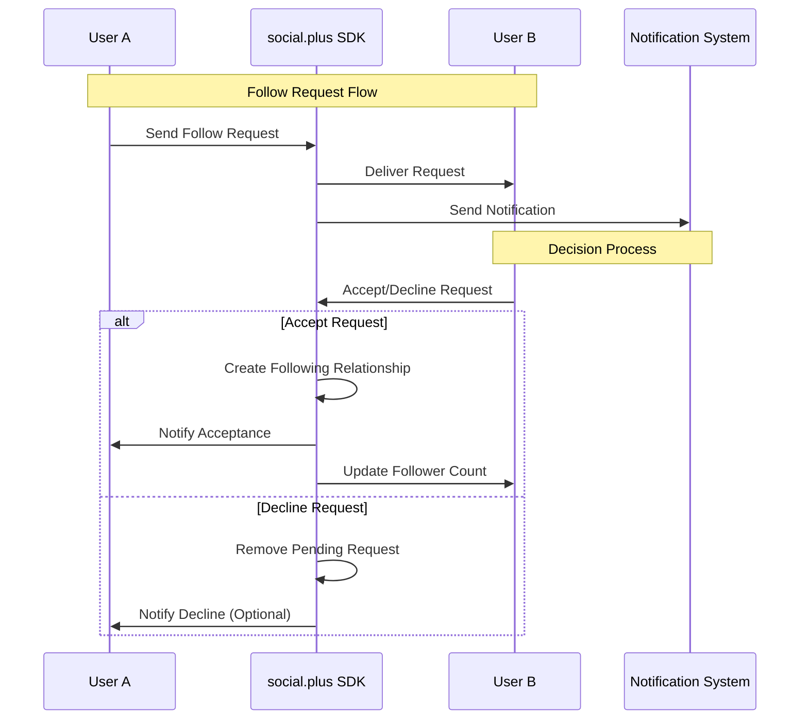

# Accept/Decline Follow Request

<CardGroup cols={2}>
  <Card title="Request Management" icon="handshake">
    Handle incoming follow requests with accept/decline functionality
  </Card>
  <Card title="Privacy Control" icon="shield">
    Maintain user privacy by controlling who can follow
  </Card>
  <Card title="Notification Integration" icon="bell">
    Seamless integration with notification systems for request updates
  </Card>
  <Card title="Real-time Updates" icon="arrows-rotate">
    Instant status updates for both requesting and target users
  </Card>
</CardGroup>

## Overview

The **Accept/Decline Follow Request** feature enables users to manage incoming follow requests when your platform uses request-based following. This functionality gives users control over their follower list and maintains privacy by requiring explicit approval for new connections.

When a user receives a follow request, they can choose to:
- **Accept** the request to establish a following relationship
- **Decline** the request to reject the connection without establishing a relationship

## Architecture Overview



## Key Features

<AccordionGroup>
  <Accordion title="Request Management">
    <CardGroup cols={2}>
      <Card title="Accept Requests" icon="check-circle">
        Approve follow requests to establish connections and grant access to content
      </Card>
      <Card title="Decline Requests" icon="x-circle">
        Reject follow requests while maintaining user privacy and control
      </Card>
      <Card title="Bulk Operations" icon="list-check">
        Handle multiple requests efficiently with batch accept/decline operations
      </Card>
      <Card title="Request History" icon="clock-rotate-left">
        Track and review past request decisions for user insights
      </Card>
    </CardGroup>
  </Accordion>

  <Accordion title="Privacy & Security">
    - **Consent-based Following**: Users must explicitly approve new followers
    - **Request Validation**: Automatic validation of request authenticity
    - **Spam Protection**: Built-in protection against request flooding
    - **Reversible Actions**: Ability to unfollow later if needed
  </Accordion>

  <Accordion title="User Experience">
    - **Real-time Notifications**: Instant alerts for new requests
    - **Batch Management**: Handle multiple requests at once
    - **Clear Feedback**: Visual confirmation of accept/decline actions
    - **Undo Protection**: Confirmation dialogs for destructive actions
  </Accordion>
</AccordionGroup>

## Accept Follow Request

### Implementation

<Tabs>
  <Tab title="iOS">
    <CodeGroup>
      ```swift Basic Implementation
      import AmitySDK
      
      class FollowRequestManager {
          private let userRepository = AmityUserRepository()
          
          func acceptFollowRequest(from userId: String) {
              userRepository.acceptMyFollower(userId: userId) { [weak self] result in
                  DispatchQueue.main.async {
                      switch result {
                      case .success:
                          print("Follow request accepted successfully")
                          self?.updateFollowerCount()
                          self?.notifyRequestAccepted(userId)
                      case .failure(let error):
                          print("Failed to accept request: \(error)")
                          self?.handleAcceptError(error)
                      }
                  }
              }
          }
          
          private func updateFollowerCount() {
              // Refresh follower count in UI
              NotificationCenter.default.post(name: .followerCountChanged, object: nil)
          }
          
          private func notifyRequestAccepted(_ userId: String) {
              // Optional: Notify the requesting user
              // This could trigger a notification or update their UI
          }
      }
      ```
      
      ```swift Advanced Implementation with Error Handling
      class AdvancedFollowRequestManager {
          private let userRepository = AmityUserRepository()
          private let notificationCenter = NotificationCenter.default
          
          func acceptFollowRequestWithValidation(from userId: String) {
              // Validate request exists
              guard validateRequestExists(userId) else {
                  showError("Follow request not found or already processed")
                  return
              }
              
              userRepository.acceptMyFollower(userId: userId) { [weak self] result in
                  DispatchQueue.main.async {
                      switch result {
                      case .success:
                          self?.handleSuccessfulAccept(userId)
                      case .failure(let error):
                          self?.handleAcceptError(error, for: userId)
                      }
                  }
              }
          }
          
          private func handleSuccessfulAccept(_ userId: String) {
              // Update UI
              updateFollowersList()
              showSuccessMessage("Follow request accepted")
              
              // Analytics tracking
              trackAnalytics("follow_request_accepted", userId: userId)
              
              // Refresh related data
              refreshConnectionStatus(for: userId)
          }
          
          private func handleAcceptError(_ error: Error, for userId: String) {
              switch error {
              case AmityError.requestNotFound:
                  showError("Request no longer available")
              case AmityError.networkError:
                  showRetryOption(for: userId)
              default:
                  showError("Failed to accept request: \(error.localizedDescription)")
              }
          }
      }
      ```
    </CodeGroup>
  </Tab>
  
  <Tab title="Android">
    <CodeGroup>
      ```kotlin Basic Implementation
      import com.amity.socialcloud.sdk.AmityCoreClient
      
      class FollowRequestManager {
          private val userRepository = AmityCoreClient.newUserRepository()
          
          fun acceptFollowRequest(userId: String) {
              userRepository.acceptMyFollower(userId)
                  .subscribe({ 
                      println("Follow request accepted successfully")
                      updateFollowerCount()
                      notifyRequestAccepted(userId)
                  }, { error ->
                      println("Failed to accept request: $error")
                      handleAcceptError(error)
                  })
          }
          
          private fun updateFollowerCount() {
              // Refresh follower count in UI
              EventBus.getDefault().post(FollowerCountChangedEvent())
          }
          
          private fun notifyRequestAccepted(userId: String) {
              // Optional: Notify the requesting user
              // This could trigger a notification or update their UI
          }
      }
      ```
      
      ```kotlin Advanced Implementation with Validation
      class AdvancedFollowRequestManager {
          private val userRepository = AmityCoreClient.newUserRepository()
          private val compositeDisposable = CompositeDisposable()
          
          fun acceptFollowRequestWithValidation(userId: String) {
              // Validate request exists
              if (!validateRequestExists(userId)) {
                  showError("Follow request not found or already processed")
                  return
              }
              
              val disposable = userRepository.acceptMyFollower(userId)
                  .subscribeOn(Schedulers.io())
                  .observeOn(AndroidSchedulers.mainThread())
                  .subscribe({ 
                      handleSuccessfulAccept(userId)
                  }, { error ->
                      handleAcceptError(error, userId)
                  })
              
              compositeDisposable.add(disposable)
          }
          
          private fun handleSuccessfulAccept(userId: String) {
              // Update UI
              updateFollowersList()
              showSuccessMessage("Follow request accepted")
              
              // Analytics tracking
              trackAnalytics("follow_request_accepted", userId)
              
              // Refresh related data
              refreshConnectionStatus(userId)
          }
          
          private fun handleAcceptError(error: Throwable, userId: String) {
              when (error) {
                  is AmityException.RequestNotFoundException -> {
                      showError("Request no longer available")
                  }
                  is AmityException.NetworkException -> {
                      showRetryOption(userId)
                  }
                  else -> {
                      showError("Failed to accept request: ${error.message}")
                  }
              }
          }
          
          fun cleanup() {
              compositeDisposable.clear()
          }
      }
      ```
    </CodeGroup>
  </Tab>
  
  <Tab title="TypeScript">
    <CodeGroup>
      ```typescript Basic Implementation
      import { AmityUserRepository } from '@amityco/ts-sdk';
      
      class FollowRequestManager {
          private userRepository = new AmityUserRepository();
          
          async acceptFollowRequest(userId: string): Promise<void> {
              try {
                  await this.userRepository.acceptMyFollower(userId);
                  console.log('Follow request accepted successfully');
                  this.updateFollowerCount();
                  this.notifyRequestAccepted(userId);
              } catch (error) {
                  console.error('Failed to accept request:', error);
                  this.handleAcceptError(error);
              }
          }
          
          private updateFollowerCount(): void {
              // Refresh follower count in UI
              document.dispatchEvent(new CustomEvent('followerCountChanged'));
          }
          
          private notifyRequestAccepted(userId: string): void {
              // Optional: Notify the requesting user
              // This could trigger a notification or update their UI
          }
      }
      ```
      
      ```typescript React Hook Implementation
      import { useState, useCallback } from 'react';
      import { AmityUserRepository } from '@amityco/ts-sdk';
      
      export const useFollowRequestManager = () => {
          const [isProcessing, setIsProcessing] = useState(false);
          const [error, setError] = useState<string | null>(null);
          const userRepository = new AmityUserRepository();
          
          const acceptFollowRequest = useCallback(async (userId: string) => {
              setIsProcessing(true);
              setError(null);
              
              try {
                  await userRepository.acceptMyFollower(userId);
                  
                  // Update UI state
                  document.dispatchEvent(new CustomEvent('followerCountChanged'));
                  
                  // Show success message
                  document.dispatchEvent(new CustomEvent('showMessage', {
                      detail: { type: 'success', message: 'Follow request accepted' }
                  }));
                  
              } catch (err) {
                  const errorMessage = err instanceof Error ? err.message : 'Failed to accept request';
                  setError(errorMessage);
                  
                  // Show error message
                  document.dispatchEvent(new CustomEvent('showMessage', {
                      detail: { type: 'error', message: errorMessage }
                  }));
                  
              } finally {
                  setIsProcessing(false);
              }
          }, [userRepository]);
          
          return {
              acceptFollowRequest,
              isProcessing,
              error
          };
      };
      ```
      
      ```typescript Advanced Error Handling
      class AdvancedFollowRequestManager {
          private userRepository = new AmityUserRepository();
          
          async acceptFollowRequestWithValidation(userId: string): Promise<boolean> {
              try {
                  // Validate request exists
                  if (!await this.validateRequestExists(userId)) {
                      throw new Error('Follow request not found or already processed');
                  }
                  
                  await this.userRepository.acceptMyFollower(userId);
                  
                  // Handle successful accept
                  await this.handleSuccessfulAccept(userId);
                  
                  return true;
                  
              } catch (error) {
                  this.handleAcceptError(error, userId);
                  return false;
              }
          }
          
          private async handleSuccessfulAccept(userId: string): Promise<void> {
              // Update UI
              this.updateFollowersList();
              this.showSuccessMessage('Follow request accepted');
              
              // Analytics tracking
              this.trackAnalytics('follow_request_accepted', { userId });
              
              // Refresh related data
              await this.refreshConnectionStatus(userId);
          }
          
          private handleAcceptError(error: any, userId: string): void {
              if (error.code === 'REQUEST_NOT_FOUND') {
                  this.showError('Request no longer available');
              } else if (error.code === 'NETWORK_ERROR') {
                  this.showRetryOption(userId);
              } else {
                  this.showError(`Failed to accept request: ${error.message}`);
              }
          }
      }
      ```
    </CodeGroup>
  </Tab>
  
  <Tab title="Flutter">
    <CodeGroup>
      ```dart Basic Implementation
      import 'package:amity_sdk/amity_sdk.dart';
      
      class FollowRequestManager {
        final AmityUserRepository _userRepository = AmityCoreClient.newUserRepository();
        
        Future<void> acceptFollowRequest(String userId) async {
          try {
            await _userRepository.acceptMyFollower(userId);
            print('Follow request accepted successfully');
            _updateFollowerCount();
            _notifyRequestAccepted(userId);
          } catch (error) {
            print('Failed to accept request: $error');
            _handleAcceptError(error);
          }
        }
        
        void _updateFollowerCount() {
          // Refresh follower count in UI
          // This could trigger a state update in your provider/bloc
        }
        
        void _notifyRequestAccepted(String userId) {
          // Optional: Notify the requesting user
          // This could trigger a notification or update their UI
        }
      }
      ```
      
      ```dart Provider Pattern Implementation
      import 'package:flutter/foundation.dart';
      import 'package:amity_sdk/amity_sdk.dart';
      
      class FollowRequestProvider extends ChangeNotifier {
        final AmityUserRepository _userRepository = AmityCoreClient.newUserRepository();
        
        bool _isProcessing = false;
        String? _error;
        
        bool get isProcessing => _isProcessing;
        String? get error => _error;
        
        Future<bool> acceptFollowRequest(String userId) async {
          _isProcessing = true;
          _error = null;
          notifyListeners();
          
          try {
            await _userRepository.acceptMyFollower(userId);
            
            // Handle successful accept
            await _handleSuccessfulAccept(userId);
            
            _isProcessing = false;
            notifyListeners();
            return true;
            
          } catch (error) {
            _error = error.toString();
            _isProcessing = false;
            notifyListeners();
            return false;
          }
        }
        
        Future<void> _handleSuccessfulAccept(String userId) async {
          // Update follower count
          notifyListeners();
          
          // Show success message
          // This could be handled by a SnackBar or Toast
        }
      }
      ```
    </CodeGroup>
  </Tab>
</Tabs>

## Decline Follow Request

### Implementation

<Tabs>
  <Tab title="iOS">
    <CodeGroup>
      ```swift Basic Implementation
      func declineFollowRequest(from userId: String) {
          userRepository.declineMyFollower(userId: userId) { [weak self] result in
              DispatchQueue.main.async {
                  switch result {
                  case .success:
                      print("Follow request declined successfully")
                      self?.updatePendingRequestsList()
                      self?.notifyRequestDeclined(userId)
                  case .failure(let error):
                      print("Failed to decline request: \(error)")
                      self?.handleDeclineError(error)
                  }
              }
          }
      }
      ```
      
      ```swift Advanced Implementation with Confirmation
      func declineFollowRequestWithConfirmation(from userId: String, userName: String) {
          let alert = UIAlertController(
              title: "Decline Follow Request",
              message: "Are you sure you want to decline the follow request from \(userName)?",
              preferredStyle: .alert
          )
          
          alert.addAction(UIAlertAction(title: "Cancel", style: .cancel))
          alert.addAction(UIAlertAction(title: "Decline", style: .destructive) { [weak self] _ in
              self?.declineFollowRequest(from: userId)
          })
          
          present(alert, animated: true)
      }
      ```
    </CodeGroup>
  </Tab>
  
  <Tab title="Android">
    <CodeGroup>
      ```kotlin Basic Implementation
      fun declineFollowRequest(userId: String) {
          userRepository.declineMyFollower(userId)
              .subscribe({ 
                  println("Follow request declined successfully")
                  updatePendingRequestsList()
                  notifyRequestDeclined(userId)
              }, { error ->
                  println("Failed to decline request: $error")
                  handleDeclineError(error)
              })
      }
      ```
      
      ```kotlin Advanced Implementation with Confirmation
      fun declineFollowRequestWithConfirmation(userId: String, userName: String) {
          AlertDialog.Builder(context)
              .setTitle("Decline Follow Request")
              .setMessage("Are you sure you want to decline the follow request from $userName?")
              .setNegativeButton("Cancel", null)
              .setPositiveButton("Decline") { _, _ ->
                  declineFollowRequest(userId)
              }
              .show()
      }
      ```
    </CodeGroup>
  </Tab>
  
  <Tab title="TypeScript">
    <CodeGroup>
      ```typescript Basic Implementation
      async declineFollowRequest(userId: string): Promise<void> {
          try {
              await this.userRepository.declineMyFollower(userId);
              console.log('Follow request declined successfully');
              this.updatePendingRequestsList();
              this.notifyRequestDeclined(userId);
          } catch (error) {
              console.error('Failed to decline request:', error);
              this.handleDeclineError(error);
          }
      }
      ```
      
      ```typescript React Hook Implementation
      const declineFollowRequest = useCallback(async (userId: string) => {
          setIsProcessing(true);
          setError(null);
          
          try {
              await userRepository.declineMyFollower(userId);
              
              // Update UI state
              document.dispatchEvent(new CustomEvent('pendingRequestsChanged'));
              
              // Show success message
              document.dispatchEvent(new CustomEvent('showMessage', {
                  detail: { type: 'info', message: 'Follow request declined' }
              }));
              
          } catch (err) {
              const errorMessage = err instanceof Error ? err.message : 'Failed to decline request';
              setError(errorMessage);
              
          } finally {
              setIsProcessing(false);
          }
      }, [userRepository]);
      ```
    </CodeGroup>
  </Tab>
  
  <Tab title="Flutter">
    <CodeGroup>
      ```dart Basic Implementation
      Future<void> declineFollowRequest(String userId) async {
        try {
          await _userRepository.declineMyFollower(userId);
          print('Follow request declined successfully');
          _updatePendingRequestsList();
          _notifyRequestDeclined(userId);
        } catch (error) {
          print('Failed to decline request: $error');
          _handleDeclineError(error);
        }
      }
      ```
      
      ```dart Advanced Implementation with Confirmation
      Future<void> declineFollowRequestWithConfirmation(String userId, String userName) async {
        final bool? confirmed = await showDialog<bool>(
          context: context,
          builder: (BuildContext context) {
            return AlertDialog(
              title: Text('Decline Follow Request'),
              content: Text('Are you sure you want to decline the follow request from $userName?'),
              actions: [
                TextButton(
                  onPressed: () => Navigator.of(context).pop(false),
                  child: Text('Cancel'),
                ),
                TextButton(
                  onPressed: () => Navigator.of(context).pop(true),
                  child: Text('Decline'),
                ),
              ],
            );
          },
        );
        
        if (confirmed == true) {
          await declineFollowRequest(userId);
        }
      }
      ```
    </CodeGroup>
  </Tab>
</Tabs>

## Batch Request Management

<Tabs>
  <Tab title="Accept Multiple Requests">
    <CodeGroup>
      ```swift iOS Batch Accept
      class BatchFollowRequestManager {
          private let userRepository = AmityUserRepository()
          private let maxConcurrentRequests = 5
          
          func acceptMultipleRequests(_ userIds: [String]) {
              let semaphore = DispatchSemaphore(value: maxConcurrentRequests)
              let group = DispatchGroup()
              
              for userId in userIds {
                  group.enter()
                  semaphore.wait()
                  
                  userRepository.acceptMyFollower(userId: userId) { result in
                      defer {
                          semaphore.signal()
                          group.leave()
                      }
                      
                      switch result {
                      case .success:
                          print("Accepted request from \(userId)")
                      case .failure(let error):
                          print("Failed to accept \(userId): \(error)")
                      }
                  }
              }
              
              group.notify(queue: .main) {
                  print("Batch accept completed")
                  self.refreshFollowersList()
              }
          }
      }
      ```
      
      ```kotlin Android Batch Accept
      class BatchFollowRequestManager {
          private val userRepository = AmityCoreClient.newUserRepository()
          
          fun acceptMultipleRequests(userIds: List<String>) {
              val observables = userIds.map { userId ->
                  userRepository.acceptMyFollower(userId)
                      .subscribeOn(Schedulers.io())
                      .doOnSuccess { println("Accepted request from $userId") }
                      .doOnError { error -> println("Failed to accept $userId: $error") }
                      .onErrorComplete() // Continue with other requests even if one fails
              }
              
              Observable.merge(observables)
                  .observeOn(AndroidSchedulers.mainThread())
                  .subscribe({
                      // Individual request completed
                  }, {
                      // Error in batch processing
                  }, {
                      println("Batch accept completed")
                      refreshFollowersList()
                  })
          }
      }
      ```
      
      ```typescript TypeScript Batch Accept
      class BatchFollowRequestManager {
          private userRepository = new AmityUserRepository();
          
          async acceptMultipleRequests(userIds: string[]): Promise<void> {
              const maxConcurrent = 5;
              const results = [];
              
              for (let i = 0; i < userIds.length; i += maxConcurrent) {
                  const batch = userIds.slice(i, i + maxConcurrent);
                  
                  const batchPromises = batch.map(async (userId) => {
                      try {
                          await this.userRepository.acceptMyFollower(userId);
                          console.log(`Accepted request from ${userId}`);
                          return { userId, success: true };
                      } catch (error) {
                          console.error(`Failed to accept ${userId}:`, error);
                          return { userId, success: false, error };
                      }
                  });
                  
                  const batchResults = await Promise.all(batchPromises);
                  results.push(...batchResults);
              }
              
              console.log('Batch accept completed');
              this.refreshFollowersList();
          }
      }
      ```
    </CodeGroup>
  </Tab>

  <Tab title="Decline Multiple Requests">
    <CodeGroup>
      ```swift iOS Batch Decline
      func declineMultipleRequests(_ userIds: [String]) {
          let semaphore = DispatchSemaphore(value: maxConcurrentRequests)
          let group = DispatchGroup()
          
          for userId in userIds {
              group.enter()
              semaphore.wait()
              
              userRepository.declineMyFollower(userId: userId) { result in
                  defer {
                      semaphore.signal()
                      group.leave()
                  }
                  
                  switch result {
                  case .success:
                      print("Declined request from \(userId)")
                  case .failure(let error):
                      print("Failed to decline \(userId): \(error)")
                  }
              }
          }
          
          group.notify(queue: .main) {
              print("Batch decline completed")
              self.refreshPendingRequestsList()
          }
      }
      ```
      
      ```kotlin Android Batch Decline
      fun declineMultipleRequests(userIds: List<String>) {
          val observables = userIds.map { userId ->
              userRepository.declineMyFollower(userId)
                  .subscribeOn(Schedulers.io())
                  .doOnSuccess { println("Declined request from $userId") }
                  .doOnError { error -> println("Failed to decline $userId: $error") }
                  .onErrorComplete() // Continue with other requests even if one fails
          }
          
          Observable.merge(observables)
              .observeOn(AndroidSchedulers.mainThread())
              .subscribe({
                  // Individual request completed
              }, {
                  // Error in batch processing
              }, {
                  println("Batch decline completed")
                  refreshPendingRequestsList()
              })
      }
      ```
      
      ```typescript TypeScript Batch Decline
      async declineMultipleRequests(userIds: string[]): Promise<void> {
          const maxConcurrent = 5;
          const results = [];
          
          for (let i = 0; i < userIds.length; i += maxConcurrent) {
              const batch = userIds.slice(i, i + maxConcurrent);
              
              const batchPromises = batch.map(async (userId) => {
                  try {
                      await this.userRepository.declineMyFollower(userId);
                      console.log(`Declined request from ${userId}`);
                      return { userId, success: true };
                  } catch (error) {
                      console.error(`Failed to decline ${userId}:`, error);
                      return { userId, success: false, error };
                  }
              });
              
              const batchResults = await Promise.all(batchPromises);
              results.push(...batchResults);
          }
          
          console.log('Batch decline completed');
          this.refreshPendingRequestsList();
      }
      ```
    </CodeGroup>
  </Tab>
</Tabs>

## Best Practices

<AccordionGroup>
  <Accordion title="User Experience Guidelines">
    ### Clear Communication
    
    <CardGroup cols={2}>
      <Card title="Visual Feedback" icon="eye">
        Provide immediate visual feedback when requests are processed
      </Card>
      <Card title="Confirmation Dialogs" icon="question-circle">
        Use confirmation dialogs for destructive actions like declining requests
      </Card>
      <Card title="Batch Actions" icon="list-check">
        Support batch accept/decline for users with many pending requests
      </Card>
      <Card title="Undo Functionality" icon="undo">
        Consider providing undo options for recently declined requests
      </Card>
    </CardGroup>
    
    ### Implementation Pattern
    
    <CodeGroup>
      ```swift iOS UX Best Practices
      class FollowRequestCell: UITableViewCell {
          @IBOutlet weak var userImageView: UIImageView!
          @IBOutlet weak var usernameLabel: UILabel!
          @IBOutlet weak var acceptButton: UIButton!
          @IBOutlet weak var declineButton: UIButton!
          @IBOutlet weak var loadingIndicator: UIActivityIndicatorView!
          
          private var userId: String?
          private weak var delegate: FollowRequestCellDelegate?
          
          func configure(with request: FollowRequest, delegate: FollowRequestCellDelegate) {
              self.userId = request.userId
              self.delegate = delegate
              
              usernameLabel.text = request.username
              // Load user image
              
              updateButtonStates(isProcessing: false)
          }
          
          @IBAction func acceptButtonTapped(_ sender: UIButton) {
              guard let userId = userId else { return }
              
              updateButtonStates(isProcessing: true)
              delegate?.acceptRequest(userId: userId) { [weak self] success in
                  DispatchQueue.main.async {
                      if success {
                          self?.showAcceptedState()
                      } else {
                          self?.updateButtonStates(isProcessing: false)
                      }
                  }
              }
          }
          
          @IBAction func declineButtonTapped(_ sender: UIButton) {
              guard let userId = userId else { return }
              
              // Show confirmation dialog
              delegate?.confirmDeclineRequest(userId: userId) { [weak self] confirmed in
                  if confirmed {
                      self?.updateButtonStates(isProcessing: true)
                      self?.delegate?.declineRequest(userId: userId) { success in
                          DispatchQueue.main.async {
                              if success {
                                  self?.showDeclinedState()
                              } else {
                                  self?.updateButtonStates(isProcessing: false)
                              }
                          }
                      }
                  }
              }
          }
          
          private func updateButtonStates(isProcessing: Bool) {
              acceptButton.isEnabled = !isProcessing
              declineButton.isEnabled = !isProcessing
              
              if isProcessing {
                  loadingIndicator.startAnimating()
              } else {
                  loadingIndicator.stopAnimating()
              }
          }
      }
      ```
    </CodeGroup>
  </Accordion>

  <Accordion title="Error Handling Strategies">
    ### Common Error Scenarios
    
    **Request Not Found:**
    - **Cause**: Request was already processed or withdrawn
    - **Response**: Show informative message and refresh request list
    - **Recovery**: Remove item from UI and update counts
    
    **Network Connectivity:**
    - **Cause**: Poor network connection or server unavailable
    - **Response**: Retry mechanism with exponential backoff
    - **Recovery**: Queue actions for retry when connection restored
    
    **Rate Limiting:**
    - **Cause**: Too many requests in short time period
    - **Response**: Show rate limit message and disable actions temporarily
    - **Recovery**: Re-enable actions after cooldown period
    
    ### Error Recovery Implementation
    
    <CodeGroup>
      ```swift iOS Error Recovery
      class FollowRequestErrorHandler {
          private let maxRetryAttempts = 3
          private var retryCount = 0
          
          func handleRequestError(_ error: Error, for userId: String, action: @escaping () -> Void) {
              switch error {
              case AmityError.requestNotFound:
                  showRequestNoLongerAvailable()
                  removeRequestFromUI(userId)
              case AmityError.networkError:
                  if retryCount < maxRetryAttempts {
                      retryCount += 1
                      showRetryOption(action)
                  } else {
                      showMaxRetriesReached()
                  }
              case AmityError.rateLimited:
                  showRateLimitMessage()
                  disableActionsTemporarily()
              default:
                  showGenericError()
              }
          }
          
          private func showRetryOption(_ action: @escaping () -> Void) {
              let alert = UIAlertController(
                  title: "Connection Error",
                  message: "Unable to process request. Try again?",
                  preferredStyle: .alert
              )
              
              alert.addAction(UIAlertAction(title: "Retry", style: .default) { _ in
                  action()
              })
              
              alert.addAction(UIAlertAction(title: "Cancel", style: .cancel) { _ in
                  self.retryCount = 0
              })
              
              // Present alert
          }
      }
      ```
    </CodeGroup>
  </Accordion>

  <Accordion title="Performance Optimization">
    ### Efficient Request Management
    
    - **Batch Processing**: Handle multiple requests in batches to reduce API calls
    - **Concurrent Limits**: Limit concurrent requests to prevent server overload
    - **Local State Updates**: Update UI immediately while processing in background
    - **Request Queuing**: Queue requests when network is unavailable
    
    ### Memory Management
    
    - **Proper Disposal**: Clean up observers and subscriptions
    - **Weak References**: Use weak references to prevent retain cycles
    - **Request Cancellation**: Cancel in-flight requests when view is dismissed
    
    <CodeGroup>
      ```swift iOS Performance Optimization
      class OptimizedFollowRequestManager {
          private let requestQueue = OperationQueue()
          private var activeRequests: [String: Operation] = [:]
          
          init() {
              requestQueue.maxConcurrentOperationCount = 3
              requestQueue.qualityOfService = .userInitiated
          }
          
          func processRequest(userId: String, action: RequestAction, completion: @escaping (Bool) -> Void) {
              // Cancel existing request for this user
              activeRequests[userId]?.cancel()
              
              let operation = RequestOperation(userId: userId, action: action) { [weak self] success in
                  DispatchQueue.main.async {
                      completion(success)
                      self?.activeRequests.removeValue(forKey: userId)
                  }
              }
              
              activeRequests[userId] = operation
              requestQueue.addOperation(operation)
          }
          
          func cancelAllRequests() {
              requestQueue.cancelAllOperations()
              activeRequests.removeAll()
          }
      }
      ```
    </CodeGroup>
  </Accordion>
</AccordionGroup>

## Use Cases

<CardGroup cols={2}>
  <Card title="Privacy-Focused Platform" icon="shield">
    Social platform where users control their followers
    
    **Implementation:**
    - Enable request-based following
    - Provide bulk accept/decline options
    - Show request sender profiles for informed decisions
  </Card>
  
  <Card title="Professional Networking" icon="briefcase">
    Professional network with selective connections
    
    **Implementation:**
    - Show requester's professional background
    - Enable request filtering by industry/role
    - Support connection recommendations
  </Card>
  
  <Card title="Content Creator Platform" icon="video">
    Platform where creators manage their audience
    
    **Implementation:**
    - Auto-accept based on creator preferences
    - Bulk management for high-volume creators
    - Analytics on request acceptance rates
  </Card>
  
  <Card title="Community Management" icon="users">
    Community-based platform with moderated access
    
    **Implementation:**
    - Moderator approval workflows
    - Community-specific acceptance criteria
    - Batch approval for events/campaigns
  </Card>
</CardGroup>

## Error Handling

<AccordionGroup>
  <Accordion title="Common Error Scenarios">
    **Request No Longer Available:**
    - **Error**: Follow request was already processed or withdrawn by sender
    - **Response**: Remove request from UI and show informative message
    - **Recovery**: Refresh pending requests list to ensure accuracy
    
    **Network Connectivity Issues:**
    - **Error**: Connection timeout or network unavailable
    - **Response**: Queue request for retry when connection restored
    - **Recovery**: Implement offline mode with request synchronization
    
    **Server Rate Limiting:**
    - **Error**: Too many accept/decline actions in short time period
    - **Response**: Display rate limit message and temporarily disable actions
    - **Recovery**: Re-enable actions after cooldown period expires
    
    **Invalid User State:**
    - **Error**: User account is disabled or deleted
    - **Response**: Remove invalid requests from UI
    - **Recovery**: Validate user status before processing requests
  </Accordion>

  <Accordion title="Error Recovery Best Practices">
    <CodeGroup>
      ```swift iOS Error Recovery Pattern
      class RequestErrorRecovery {
          func handleError(_ error: Error, context: RequestContext) -> RecoveryAction {
              switch error {
              case AmityError.requestNotFound:
                  return .removeFromUI(message: "Request no longer available")
              
              case AmityError.networkError:
                  return .retryWithBackoff(maxAttempts: 3)
              
              case AmityError.rateLimited:
                  return .temporaryDisable(duration: 60) // 1 minute
              
              case AmityError.userInvalid:
                  return .removeFromUI(message: "User account unavailable")
              
              default:
                  return .showGenericError
              }
          }
      }
      
      enum RecoveryAction {
          case removeFromUI(message: String)
          case retryWithBackoff(maxAttempts: Int)
          case temporaryDisable(duration: TimeInterval)
          case showGenericError
      }
      ```
    </CodeGroup>
  </Accordion>
</AccordionGroup>

<Note>
If a follow request is no longer available (either the sender has withdrawn the request or it has already been processed), the SDK will return an appropriate error message. Always handle these scenarios gracefully in your UI.
</Note>

## Related Topics

<CardGroup cols={3}>
  <Card title="Follow/Unfollow User" href="./follow-unfollow-user" icon="user-plus">
    Learn how to send follow requests and manage following relationships
  </Card>
  <Card title="Connection Status" href="./get-connection-status-and-connection-counter" icon="signal">
    Check relationship status and connection counters between users
  </Card>
  <Card title="Follower Lists" href="./get-follower-following-list" icon="list">
    Retrieve and display follower and following lists for users
  </Card>
</CardGroup>