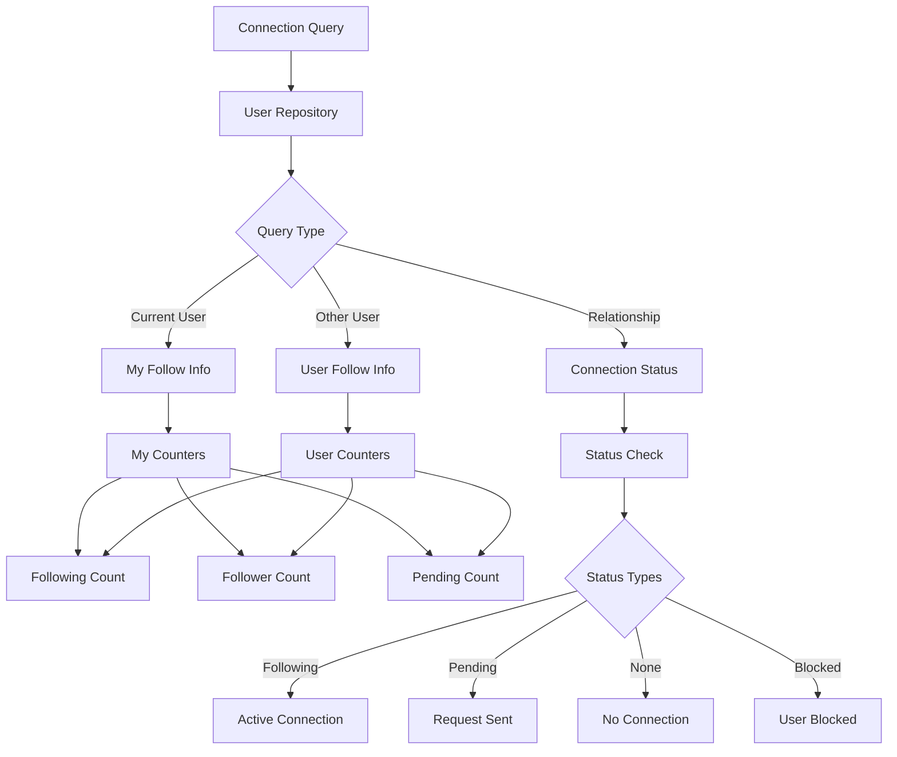

# Get Connection Status and Connection Counter

<CardGroup cols={2}>
  <Card title="Connection Status" icon="signal">
    Check relationship status between users: following, pending, none, or blocked
  </Card>
  <Card title="Connection Counters" icon="chart-line">
    Track follower, following, and pending request counts for user analytics
  </Card>
  <Card title="Real-time Data" icon="arrows-rotate">
    Access up-to-date connection information for accurate relationship tracking
  </Card>
  <Card title="Cross-platform SDK" icon="mobile-screen">
    Consistent connection data across iOS, Android, and Web platforms
  </Card>
</CardGroup>

## Overview

The **Connection Status and Counter** feature provides comprehensive insights into user relationships within your social platform. This functionality enables you to check the current relationship status between users and access detailed analytics about connections, followers, and pending requests.

## Architecture Overview



## Connection Status Types

<AccordionGroup>
  <Accordion title="Status Definitions">
    **Available Connection Statuses:**
    
    | Status | Description | User Action Available |
    |--------|-------------|----------------------|
    | `following` | Active connection established | Can unfollow |
    | `pending` | Follow request sent, awaiting approval | Can withdraw request |
    | `none` | No relationship exists | Can send follow request |
    | `blocked` | User has been blocked | Can unblock user |
    
    **Status Transitions:**
    
    ```mermaid
    stateDiagram-v2
        [*] --> none
        none --> pending : Send Request
        none --> following : Direct Follow
        pending --> following : Accept Request
        pending --> none : Decline/Withdraw
        following --> none : Unfollow
        none --> blocked : Block User
        following --> blocked : Block User
        blocked --> none : Unblock User
    ```
  </Accordion>

  <Accordion title="Counter Metrics">
    **Connection Counters Explained:**
    
    <CardGroup cols={3}>
      <Card title="Following Count" icon="user-plus">
        Total number of users that the target user is following
      </Card>
      <Card title="Follower Count" icon="users">
        Total number of users who are following the target user
      </Card>
      <Card title="Pending Count" icon="clock">
        Total number of follow requests the target user has received but not yet processed
      </Card>
    </CardGroup>
    
    **Counter Updates:**
    - Real-time updates when connections change
    - Automatic synchronization across devices
    - Accurate counts for analytics and UI display
  </Accordion>
</AccordionGroup>

## Implementation

### Get Current User Follow Information

<Tabs>
  <Tab title="iOS">
    <CodeGroup>
      ```swift Basic Implementation
      import AmitySDK
      
      class MyFollowInfoManager {
          private let userRepository = AmityUserRepository()
          
          func getMyFollowInfo() {
              userRepository.getMyFollowInfo { [weak self] result in
                  DispatchQueue.main.async {
                      switch result {
                      case .success(let followInfo):
                          self?.displayMyFollowInfo(followInfo)
                      case .failure(let error):
                          self?.handleError(error)
                      }
                  }
              }
          }
          
          private func displayMyFollowInfo(_ followInfo: AmityFollowInfo) {
              print("My Following Count: \(followInfo.followingCount)")
              print("My Follower Count: \(followInfo.followerCount)")
              print("My Pending Requests: \(followInfo.pendingCount)")
              
              // Update UI
              updateFollowingCountLabel(followInfo.followingCount)
              updateFollowerCountLabel(followInfo.followerCount)
              updatePendingCountLabel(followInfo.pendingCount)
          }
      }
      ```
      
      ```swift SwiftUI Implementation
      import SwiftUI
      import AmitySDK
      
      struct MyFollowInfoView: View {
          @State private var followInfo: AmityFollowInfo?
          @State private var isLoading = true
          @State private var error: Error?
          
          private let userRepository = AmityUserRepository()
          
          var body: some View {
              VStack(spacing: 16) {
                  if isLoading {
                      ProgressView("Loading follow information...")
                  } else if let followInfo = followInfo {
                      HStack(spacing: 24) {
                          FollowStatView(
                              title: "Following",
                              count: followInfo.followingCount,
                              color: .blue
                          )
                          
                          FollowStatView(
                              title: "Followers",
                              count: followInfo.followerCount,
                              color: .green
                          )
                          
                          FollowStatView(
                              title: "Pending",
                              count: followInfo.pendingCount,
                              color: .orange
                          )
                      }
                  } else if let error = error {
                      Text("Error: \(error.localizedDescription)")
                          .foregroundColor(.red)
                  }
              }
              .onAppear {
                  loadMyFollowInfo()
              }
          }
          
          private func loadMyFollowInfo() {
              isLoading = true
              userRepository.getMyFollowInfo { result in
                  DispatchQueue.main.async {
                      isLoading = false
                      switch result {
                      case .success(let info):
                          followInfo = info
                      case .failure(let error):
                          self.error = error
                      }
                  }
              }
          }
      }
      
      struct FollowStatView: View {
          let title: String
          let count: Int
          let color: Color
          
          var body: some View {
              VStack {
                  Text("\(count)")
                      .font(.title2)
                      .fontWeight(.bold)
                      .foregroundColor(color)
                  
                  Text(title)
                      .font(.caption)
                      .foregroundColor(.secondary)
              }
          }
      }
      ```
    </CodeGroup>
  </Tab>
  
  <Tab title="Android">
    <CodeGroup>
      ```kotlin Basic Implementation
      import com.amity.socialcloud.sdk.AmityCoreClient
      
      class MyFollowInfoManager {
          private val userRepository = AmityCoreClient.newUserRepository()
          
          fun getMyFollowInfo() {
              userRepository.getMyFollowInfo()
                  .subscribe({ followInfo ->
                      displayMyFollowInfo(followInfo)
                  }, { error ->
                      handleError(error)
                  })
          }
          
          private fun displayMyFollowInfo(followInfo: AmityFollowInfo) {
              println("My Following Count: ${followInfo.followingCount}")
              println("My Follower Count: ${followInfo.followerCount}")
              println("My Pending Requests: ${followInfo.pendingCount}")
              
              // Update UI
              updateFollowingCountLabel(followInfo.followingCount)
              updateFollowerCountLabel(followInfo.followerCount)
              updatePendingCountLabel(followInfo.pendingCount)
          }
      }
      ```
      
      ```kotlin Jetpack Compose Implementation
      import androidx.compose.runtime.*
      import androidx.compose.ui.Modifier
      import androidx.compose.material3.*
      import com.amity.socialcloud.sdk.AmityCoreClient
      
      @Composable
      fun MyFollowInfoCard(
          modifier: Modifier = Modifier
      ) {
          var followInfo by remember { mutableStateOf<AmityFollowInfo?>(null) }
          var isLoading by remember { mutableStateOf(true) }
          var error by remember { mutableStateOf<String?>(null) }
          
          val userRepository = remember { AmityCoreClient.newUserRepository() }
          
          LaunchedEffect(Unit) {
              userRepository.getMyFollowInfo()
                  .subscribe({ info ->
                      followInfo = info
                      isLoading = false
                  }, { err ->
                      error = err.message
                      isLoading = false
                  })
          }
          
          Card(modifier = modifier) {
              Column(
                  modifier = Modifier.padding(16.dp)
              ) {
                  Text(
                      text = "My Follow Information",
                      style = MaterialTheme.typography.headlineSmall
                  )
                  
                  Spacer(modifier = Modifier.height(16.dp))
                  
                  when {
                      isLoading -> {
                          CircularProgressIndicator()
                      }
                      error != null -> {
                          Text(
                              text = "Error: $error",
                              color = MaterialTheme.colorScheme.error
                          )
                      }
                      followInfo != null -> {
                          Row(
                              horizontalArrangement = Arrangement.SpaceEvenly,
                              modifier = Modifier.fillMaxWidth()
                          ) {
                              FollowStatColumn("Following", followInfo!!.followingCount)
                              FollowStatColumn("Followers", followInfo!!.followerCount)
                              FollowStatColumn("Pending", followInfo!!.pendingCount)
                          }
                      }
                  }
              }
          }
      }
      
      @Composable
      private fun FollowStatColumn(title: String, count: Int) {
          Column(horizontalAlignment = Alignment.CenterHorizontally) {
              Text(
                  text = count.toString(),
                  style = MaterialTheme.typography.headlineMedium,
                  fontWeight = FontWeight.Bold
              )
              Text(
                  text = title,
                  style = MaterialTheme.typography.bodySmall,
                  color = MaterialTheme.colorScheme.onSurfaceVariant
              )
          }
      }
      ```
    </CodeGroup>
  </Tab>
  
  <Tab title="TypeScript">
    <CodeGroup>
      ```typescript Basic Implementation
      import { AmityUserRepository, AmityFollowInfo } from '@amityco/ts-sdk';
      
      class MyFollowInfoManager {
          private userRepository = new AmityUserRepository();
          
          async getMyFollowInfo(): Promise<void> {
              try {
                  const followInfo = await this.userRepository.getMyFollowInfo();
                  this.displayMyFollowInfo(followInfo);
              } catch (error) {
                  this.handleError(error);
              }
          }
          
          private displayMyFollowInfo(followInfo: AmityFollowInfo): void {
              console.log(`My Following Count: ${followInfo.followingCount}`);
              console.log(`My Follower Count: ${followInfo.followerCount}`);
              console.log(`My Pending Requests: ${followInfo.pendingCount}`);
              
              // Update UI
              this.updateFollowingCountLabel(followInfo.followingCount);
              this.updateFollowerCountLabel(followInfo.followerCount);
              this.updatePendingCountLabel(followInfo.pendingCount);
          }
      }
      ```
      
      ```typescript React Hook Implementation
      import { useState, useEffect } from 'react';
      import { AmityUserRepository, AmityFollowInfo } from '@amityco/ts-sdk';
      
      export const useMyFollowInfo = () => {
          const [followInfo, setFollowInfo] = useState<AmityFollowInfo | null>(null);
          const [isLoading, setIsLoading] = useState(true);
          const [error, setError] = useState<string | null>(null);
          
          const userRepository = new AmityUserRepository();
          
          const loadMyFollowInfo = async () => {
              setIsLoading(true);
              setError(null);
              
              try {
                  const info = await userRepository.getMyFollowInfo();
                  setFollowInfo(info);
              } catch (err) {
                  setError(err instanceof Error ? err.message : 'Failed to load follow info');
              } finally {
                  setIsLoading(false);
              }
          };
          
          useEffect(() => {
              loadMyFollowInfo();
          }, []);
          
          return {
              followInfo,
              isLoading,
              error,
              refresh: loadMyFollowInfo
          };
      };
      
      // Usage Component
      function MyFollowInfoCard() {
          const { followInfo, isLoading, error, refresh } = useMyFollowInfo();
          
          if (isLoading) {
              return <div className="loading">Loading follow information...</div>;
          }
          
          if (error) {
              return <div className="error">Error: {error}</div>;
          }
          
          if (!followInfo) {
              return <div>No follow information available</div>;
          }
          
          return (
              <div className="follow-info-card">
                  <h3>My Follow Information</h3>
                  <div className="stats-row">
                      <div className="stat">
                          <span className="count">{followInfo.followingCount}</span>
                          <span className="label">Following</span>
                      </div>
                      <div className="stat">
                          <span className="count">{followInfo.followerCount}</span>
                          <span className="label">Followers</span>
                      </div>
                      <div className="stat">
                          <span className="count">{followInfo.pendingCount}</span>
                          <span className="label">Pending</span>
                      </div>
                  </div>
                  <button onClick={refresh}>Refresh</button>
              </div>
          );
      }
      ```
    </CodeGroup>
  </Tab>
  
  <Tab title="Flutter">
    <CodeGroup>
      ```dart Basic Implementation
      import 'package:amity_sdk/amity_sdk.dart';
      
      class MyFollowInfoManager {
        final AmityUserRepository _userRepository = AmityCoreClient.newUserRepository();
        
        Future<void> getMyFollowInfo() async {
          try {
            final followInfo = await _userRepository.getMyFollowInfo();
            _displayMyFollowInfo(followInfo);
          } catch (error) {
            _handleError(error);
          }
        }
        
        void _displayMyFollowInfo(AmityFollowInfo followInfo) {
          print('My Following Count: ${followInfo.followingCount}');
          print('My Follower Count: ${followInfo.followerCount}');
          print('My Pending Requests: ${followInfo.pendingCount}');
          
          // Update UI
          _updateFollowingCountLabel(followInfo.followingCount);
          _updateFollowerCountLabel(followInfo.followerCount);
          _updatePendingCountLabel(followInfo.pendingCount);
        }
      }
      ```
      
      ```dart Provider Pattern Implementation
      import 'package:flutter/foundation.dart';
      import 'package:amity_sdk/amity_sdk.dart';
      
      class MyFollowInfoProvider extends ChangeNotifier {
        final AmityUserRepository _userRepository = AmityCoreClient.newUserRepository();
        
        AmityFollowInfo? _followInfo;
        bool _isLoading = false;
        String? _error;
        
        AmityFollowInfo? get followInfo => _followInfo;
        bool get isLoading => _isLoading;
        String? get error => _error;
        
        Future<void> loadMyFollowInfo() async {
          _isLoading = true;
          _error = null;
          notifyListeners();
          
          try {
            _followInfo = await _userRepository.getMyFollowInfo();
          } catch (error) {
            _error = error.toString();
          } finally {
            _isLoading = false;
            notifyListeners();
          }
        }
      }
      
      // Usage Widget
      class MyFollowInfoCard extends StatelessWidget {
        @override
        Widget build(BuildContext context) {
          return Consumer<MyFollowInfoProvider>(
            builder: (context, provider, child) {
              if (provider.isLoading) {
                return Card(
                  child: Padding(
                    padding: EdgeInsets.all(16.0),
                    child: Center(child: CircularProgressIndicator()),
                  ),
                );
              }
              
              if (provider.error != null) {
                return Card(
                  child: Padding(
                    padding: EdgeInsets.all(16.0),
                    child: Text('Error: ${provider.error}'),
                  ),
                );
              }
              
              final followInfo = provider.followInfo;
              if (followInfo == null) {
                return Card(
                  child: Padding(
                    padding: EdgeInsets.all(16.0),
                    child: Text('No follow information available'),
                  ),
                );
              }
              
              return Card(
                child: Padding(
                  padding: EdgeInsets.all(16.0),
                  child: Column(
                    crossAxisAlignment: CrossAxisAlignment.start,
                    children: [
                      Text(
                        'My Follow Information',
                        style: Theme.of(context).textTheme.headline6,
                      ),
                      SizedBox(height: 16),
                      Row(
                        mainAxisAlignment: MainAxisAlignment.spaceEvenly,
                        children: [
                          _buildStatColumn('Following', followInfo.followingCount),
                          _buildStatColumn('Followers', followInfo.followerCount),
                          _buildStatColumn('Pending', followInfo.pendingCount),
                        ],
                      ),
                    ],
                  ),
                ),
              );
            },
          );
        }
        
        Widget _buildStatColumn(String title, int count) {
          return Column(
            children: [
              Text(
                count.toString(),
                style: TextStyle(
                  fontSize: 24,
                  fontWeight: FontWeight.bold,
                ),
              ),
              Text(
                title,
                style: TextStyle(
                  fontSize: 12,
                  color: Colors.grey[600],
                ),
              ),
            ],
          );
        }
      }
      ```
    </CodeGroup>
  </Tab>
</Tabs>

### Get Other User Follow Information

<Tabs>
  <Tab title="iOS">
    <CodeGroup>
      ```swift Basic Implementation
      func getUserFollowInfo(userId: String) {
          userRepository.getFollowInfo(userId: userId) { [weak self] result in
              DispatchQueue.main.async {
                  switch result {
                  case .success(let followInfo):
                      self?.displayUserFollowInfo(followInfo, for: userId)
                  case .failure(let error):
                      self?.handleError(error)
                  }
              }
          }
      }
      
      private func displayUserFollowInfo(_ followInfo: AmityFollowInfo, for userId: String) {
          print("User \(userId) Following Count: \(followInfo.followingCount)")
          print("User \(userId) Follower Count: \(followInfo.followerCount)")
          
          // Update UI
          updateUserFollowingCount(userId, count: followInfo.followingCount)
          updateUserFollowerCount(userId, count: followInfo.followerCount)
      }
      ```
      
      ```swift Advanced Implementation with Caching
      class UserFollowInfoManager {
          private let userRepository = AmityUserRepository()
          private var cachedFollowInfo: [String: (info: AmityFollowInfo, timestamp: Date)] = [:]
          private let cacheTimeout: TimeInterval = 300 // 5 minutes
          
          func getUserFollowInfo(userId: String, forceRefresh: Bool = false) {
              // Check cache first
              if !forceRefresh, let cached = getCachedFollowInfo(for: userId) {
                  displayUserFollowInfo(cached.info, for: userId)
                  return
              }
              
              userRepository.getFollowInfo(userId: userId) { [weak self] result in
                  DispatchQueue.main.async {
                      switch result {
                      case .success(let followInfo):
                          self?.cacheFollowInfo(followInfo, for: userId)
                          self?.displayUserFollowInfo(followInfo, for: userId)
                      case .failure(let error):
                          self?.handleError(error)
                      }
                  }
              }
          }
          
          private func getCachedFollowInfo(for userId: String) -> (info: AmityFollowInfo, timestamp: Date)? {
              guard let cached = cachedFollowInfo[userId],
                    Date().timeIntervalSince(cached.timestamp) < cacheTimeout else {
                  return nil
              }
              return cached
          }
          
          private func cacheFollowInfo(_ info: AmityFollowInfo, for userId: String) {
              cachedFollowInfo[userId] = (info: info, timestamp: Date())
          }
      }
      ```
    </CodeGroup>
  </Tab>
  
  <Tab title="Android">
    <CodeGroup>
      ```kotlin Basic Implementation
      fun getUserFollowInfo(userId: String) {
          userRepository.getFollowInfo(userId)
              .subscribe({ followInfo ->
                  displayUserFollowInfo(followInfo, userId)
              }, { error ->
                  handleError(error)
              })
      }
      
      private fun displayUserFollowInfo(followInfo: AmityFollowInfo, userId: String) {
          println("User $userId Following Count: ${followInfo.followingCount}")
          println("User $userId Follower Count: ${followInfo.followerCount}")
          
          // Update UI
          updateUserFollowingCount(userId, followInfo.followingCount)
          updateUserFollowerCount(userId, followInfo.followerCount)
      }
      ```
      
      ```kotlin Advanced Implementation with RxJava
      class UserFollowInfoManager {
          private val userRepository = AmityCoreClient.newUserRepository()
          private val compositeDisposable = CompositeDisposable()
          
          fun loadUserFollowInfo(userId: String): Observable<AmityFollowInfo> {
              return userRepository.getFollowInfo(userId)
                  .subscribeOn(Schedulers.io())
                  .observeOn(AndroidSchedulers.mainThread())
                  .doOnSuccess { followInfo ->
                      cacheFollowInfo(userId, followInfo)
                  }
                  .doOnError { error ->
                      handleError(error)
                  }
          }
          
          fun getUserFollowInfoWithCaching(userId: String): Observable<AmityFollowInfo> {
              // Try cache first, then network
              return getCachedFollowInfo(userId)
                  .switchIfEmpty(loadUserFollowInfo(userId))
          }
          
          private fun getCachedFollowInfo(userId: String): Observable<AmityFollowInfo> {
              // Implementation for cache retrieval
              return Observable.empty()
          }
          
          fun cleanup() {
              compositeDisposable.clear()
          }
      }
      ```
    </CodeGroup>
  </Tab>
  
  <Tab title="TypeScript">
    <CodeGroup>
      ```typescript Basic Implementation
      async getUserFollowInfo(userId: string): Promise<void> {
          try {
              const followInfo = await this.userRepository.getFollowInfo(userId);
              this.displayUserFollowInfo(followInfo, userId);
          } catch (error) {
              this.handleError(error);
          }
      }
      
      private displayUserFollowInfo(followInfo: AmityFollowInfo, userId: string): void {
          console.log(`User ${userId} Following Count: ${followInfo.followingCount}`);
          console.log(`User ${userId} Follower Count: ${followInfo.followerCount}`);
          
          // Update UI
          this.updateUserFollowingCount(userId, followInfo.followingCount);
          this.updateUserFollowerCount(userId, followInfo.followerCount);
      }
      ```
      
      ```typescript React Hook for User Follow Info
      export const useUserFollowInfo = (userId: string) => {
          const [followInfo, setFollowInfo] = useState<AmityFollowInfo | null>(null);
          const [isLoading, setIsLoading] = useState(true);
          const [error, setError] = useState<string | null>(null);
          
          const userRepository = new AmityUserRepository();
          
          const loadUserFollowInfo = useCallback(async () => {
              if (!userId) return;
              
              setIsLoading(true);
              setError(null);
              
              try {
                  const info = await userRepository.getFollowInfo(userId);
                  setFollowInfo(info);
              } catch (err) {
                  setError(err instanceof Error ? err.message : 'Failed to load user follow info');
              } finally {
                  setIsLoading(false);
              }
          }, [userId, userRepository]);
          
          useEffect(() => {
              loadUserFollowInfo();
          }, [loadUserFollowInfo]);
          
          return {
              followInfo,
              isLoading,
              error,
              refresh: loadUserFollowInfo
          };
      };
      ```
    </CodeGroup>
  </Tab>
  
  <Tab title="Flutter">
    <CodeGroup>
      ```dart Basic Implementation
      Future<void> getUserFollowInfo(String userId) async {
        try {
          final followInfo = await _userRepository.getFollowInfo(userId);
          _displayUserFollowInfo(followInfo, userId);
        } catch (error) {
          _handleError(error);
        }
      }
      
      void _displayUserFollowInfo(AmityFollowInfo followInfo, String userId) {
        print('User $userId Following Count: ${followInfo.followingCount}');
        print('User $userId Follower Count: ${followInfo.followerCount}');
        
        // Update UI
        _updateUserFollowingCount(userId, followInfo.followingCount);
        _updateUserFollowerCount(userId, followInfo.followerCount);
      }
      ```
      
      ```dart Future Builder Implementation
      class UserFollowInfoWidget extends StatelessWidget {
        final String userId;
        
        const UserFollowInfoWidget({Key? key, required this.userId}) : super(key: key);
        
        @override
        Widget build(BuildContext context) {
          return FutureBuilder<AmityFollowInfo>(
            future: AmityCoreClient.newUserRepository().getFollowInfo(userId),
            builder: (context, snapshot) {
              if (snapshot.connectionState == ConnectionState.waiting) {
                return Center(child: CircularProgressIndicator());
              }
              
              if (snapshot.hasError) {
                return Center(child: Text('Error: ${snapshot.error}'));
              }
              
              if (!snapshot.hasData) {
                return Center(child: Text('No follow information available'));
              }
              
              final followInfo = snapshot.data!;
              
              return Card(
                child: Padding(
                  padding: EdgeInsets.all(16.0),
                  child: Row(
                    mainAxisAlignment: MainAxisAlignment.spaceEvenly,
                    children: [
                      _buildStatColumn('Following', followInfo.followingCount),
                      _buildStatColumn('Followers', followInfo.followerCount),
                    ],
                  ),
                ),
              );
            },
          );
        }
        
        Widget _buildStatColumn(String title, int count) {
          return Column(
            children: [
              Text(
                count.toString(),
                style: TextStyle(fontSize: 20, fontWeight: FontWeight.bold),
              ),
              Text(title, style: TextStyle(color: Colors.grey[600])),
            ],
          );
        }
      }
      ```
    </CodeGroup>
  </Tab>
</Tabs>

### Check Connection Status

<Tabs>
  <Tab title="iOS">
    <CodeGroup>
      ```swift Basic Connection Status Check
      func checkConnectionStatus(with userId: String) {
          userRepository.getConnectionStatus(userId: userId) { [weak self] status in
              DispatchQueue.main.async {
                  self?.handleConnectionStatus(status, for: userId)
              }
          }
      }
      
      private func handleConnectionStatus(_ status: AmityConnectionStatus, for userId: String) {
          switch status {
          case .following:
              updateUI(for: userId, buttonTitle: "Following", isEnabled: true)
          case .pending:
              updateUI(for: userId, buttonTitle: "Pending", isEnabled: false)
          case .none:
              updateUI(for: userId, buttonTitle: "Follow", isEnabled: true)
          case .blocked:
              updateUI(for: userId, buttonTitle: "Blocked", isEnabled: false)
          }
      }
      ```
      
      ```swift Batch Connection Status Check
      func checkMultipleConnectionStatuses(userIds: [String]) {
          let group = DispatchGroup()
          var results: [String: AmityConnectionStatus] = [:]
          
          for userId in userIds {
              group.enter()
              userRepository.getConnectionStatus(userId: userId) { status in
                  results[userId] = status
                  group.leave()
              }
          }
          
          group.notify(queue: .main) { [weak self] in
              self?.handleBatchConnectionResults(results)
          }
      }
      ```
    </CodeGroup>
  </Tab>
  
  <Tab title="Android">
    <CodeGroup>
      ```kotlin Basic Connection Status Check
      fun checkConnectionStatus(userId: String) {
          userRepository.getConnectionStatus(userId)
              .subscribe({ status ->
                  handleConnectionStatus(status, userId)
              }, { error ->
                  handleError(error)
              })
      }
      
      private fun handleConnectionStatus(status: AmityConnectionStatus, userId: String) {
          when (status) {
              AmityConnectionStatus.FOLLOWING -> {
                  updateUI(userId, "Following", true)
              }
              AmityConnectionStatus.PENDING -> {
                  updateUI(userId, "Pending", false)
              }
              AmityConnectionStatus.NONE -> {
                  updateUI(userId, "Follow", true)
              }
              AmityConnectionStatus.BLOCKED -> {
                  updateUI(userId, "Blocked", false)
              }
          }
      }
      ```
      
      ```kotlin Batch Connection Status Check
      fun checkMultipleConnectionStatuses(userIds: List<String>) {
          val observables = userIds.map { userId ->
              userRepository.getConnectionStatus(userId)
                  .map { status -> userId to status }
                  .onErrorReturn { error -> userId to AmityConnectionStatus.NONE }
          }
          
          Observable.zip(observables) { results ->
              results.map { it as Pair<String, AmityConnectionStatus> }.toMap()
          }
          .subscribe({ statusMap ->
              handleBatchConnectionResults(statusMap)
          }, { error ->
              handleError(error)
          })
      }
      ```
    </CodeGroup>
  </Tab>
  
  <Tab title="TypeScript">
    <CodeGroup>
      ```typescript Basic Connection Status Check
      async checkConnectionStatus(userId: string): Promise<void> {
          try {
              const status = await this.userRepository.getConnectionStatus(userId);
              this.handleConnectionStatus(status, userId);
          } catch (error) {
              this.handleError(error);
          }
      }
      
      private handleConnectionStatus(status: AmityConnectionStatus, userId: string): void {
          switch (status) {
              case 'following':
                  this.updateUI(userId, 'Following', true);
                  break;
              case 'pending':
                  this.updateUI(userId, 'Pending', false);
                  break;
              case 'none':
                  this.updateUI(userId, 'Follow', true);
                  break;
              case 'blocked':
                  this.updateUI(userId, 'Blocked', false);
                  break;
          }
      }
      ```
      
      ```typescript Batch Connection Status Check
      async checkMultipleConnectionStatuses(userIds: string[]): Promise<Map<string, AmityConnectionStatus>> {
          const statusPromises = userIds.map(async (userId) => {
              try {
                  const status = await this.userRepository.getConnectionStatus(userId);
                  return [userId, status] as [string, AmityConnectionStatus];
              } catch (error) {
                  console.error(`Failed to get status for ${userId}:`, error);
                  return [userId, 'none'] as [string, AmityConnectionStatus];
              }
          });
          
          const results = await Promise.all(statusPromises);
          return new Map(results);
      }
      ```
    </CodeGroup>
  </Tab>
  
  <Tab title="Flutter">
    <CodeGroup>
      ```dart Basic Connection Status Check
      Future<void> checkConnectionStatus(String userId) async {
        try {
          final status = await _userRepository.getConnectionStatus(userId);
          _handleConnectionStatus(status, userId);
        } catch (error) {
          _handleError(error);
        }
      }
      
      void _handleConnectionStatus(AmityConnectionStatus status, String userId) {
        switch (status) {
          case AmityConnectionStatus.following:
            _updateUI(userId, 'Following', true);
            break;
          case AmityConnectionStatus.pending:
            _updateUI(userId, 'Pending', false);
            break;
          case AmityConnectionStatus.none:
            _updateUI(userId, 'Follow', true);
            break;
          case AmityConnectionStatus.blocked:
            _updateUI(userId, 'Blocked', false);
            break;
        }
      }
      ```
      
      ```dart Batch Connection Status Check
      Future<Map<String, AmityConnectionStatus>> checkMultipleConnectionStatuses(List<String> userIds) async {
        final Map<String, AmityConnectionStatus> results = {};
        
        await Future.wait(userIds.map((userId) async {
          try {
            final status = await _userRepository.getConnectionStatus(userId);
            results[userId] = status;
          } catch (error) {
            print('Failed to get status for $userId: $error');
            results[userId] = AmityConnectionStatus.none;
          }
        }));
        
        return results;
      }
      ```
    </CodeGroup>
  </Tab>
</Tabs>

## Best Practices

<AccordionGroup>
  <Accordion title="Performance Optimization">
    ### Efficient Data Loading
    
    <CardGroup cols={2}>
      <Card title="Caching Strategy" icon="database">
        Cache follow information to reduce unnecessary API calls and improve response times
      </Card>
      <Card title="Batch Operations" icon="list">
        Check multiple user statuses in batches rather than individual calls
      </Card>
      <Card title="Lazy Loading" icon="clock">
        Load follow information only when needed, not preemptively
      </Card>
      <Card title="Background Sync" icon="arrows-rotate">
        Sync connection data in background when app becomes active
      </Card>
    </CardGroup>
    
    ### Implementation Strategy
    
    <CodeGroup>
      ```swift iOS Caching Implementation
      class ConnectionStatusCache {
          private var cache: [String: (status: AmityConnectionStatus, timestamp: Date)] = [:]
          private let cacheTimeout: TimeInterval = 300 // 5 minutes
          
          func getCachedStatus(for userId: String) -> AmityConnectionStatus? {
              guard let cached = cache[userId],
                    Date().timeIntervalSince(cached.timestamp) < cacheTimeout else {
                  return nil
              }
              return cached.status
          }
          
          func cacheStatus(_ status: AmityConnectionStatus, for userId: String) {
              cache[userId] = (status: status, timestamp: Date())
          }
          
          func invalidateCache(for userId: String) {
              cache.removeValue(forKey: userId)
          }
          
          func clearExpiredCache() {
              let now = Date()
              cache = cache.filter { now.timeIntervalSince($0.value.timestamp) < cacheTimeout }
          }
      }
      ```
    </CodeGroup>
  </Accordion>

  <Accordion title="Real-time Updates">
    ### Status Synchronization
    
    - **Periodic Refresh**: Refresh connection statuses periodically for active users
    - **Event-driven Updates**: Update statuses when connection-related actions occur
    - **Cross-device Sync**: Handle status changes from other devices gracefully
    - **Conflict Resolution**: Resolve conflicts between cached and server data
    
    ### Implementation Pattern
    
    <CodeGroup>
      ```swift iOS Real-time Updates
      class ConnectionStatusManager {
          private let refreshInterval: TimeInterval = 300 // 5 minutes
          private var refreshTimer: Timer?
          private var activeUserIds: Set<String> = []
          
          func startMonitoring(userIds: [String]) {
              activeUserIds = Set(userIds)
              startPeriodicRefresh()
          }
          
          func stopMonitoring() {
              refreshTimer?.invalidate()
              refreshTimer = nil
              activeUserIds.removeAll()
          }
          
          private func startPeriodicRefresh() {
              refreshTimer = Timer.scheduledTimer(withTimeInterval: refreshInterval, repeats: true) { [weak self] _ in
                  self?.refreshActiveUserStatuses()
              }
          }
          
          private func refreshActiveUserStatuses() {
              for userId in activeUserIds {
                  refreshConnectionStatus(for: userId)
              }
          }
          
          func onConnectionAction(userId: String) {
              // Immediately refresh status after connection action
              refreshConnectionStatus(for: userId)
              
              // Also refresh related counters
              refreshFollowInfo(for: userId)
          }
      }
      ```
    </CodeGroup>
  </Accordion>

  <Accordion title="Error Handling">
    ### Common Error Scenarios
    
    **Network Connectivity:**
    - Handle offline scenarios with cached data
    - Implement retry mechanisms for failed requests
    - Show appropriate offline indicators
    
    **Invalid User Data:**
    - Handle deleted or suspended user accounts
    - Validate user IDs before making requests
    - Gracefully handle user not found errors
    
    **Rate Limiting:**
    - Implement exponential backoff for rate-limited requests
    - Show appropriate user feedback during rate limits
    - Queue requests for later execution when possible
    
    ### Error Recovery Pattern
    
    <CodeGroup>
      ```swift iOS Error Recovery
      class ConnectionStatusErrorHandler {
          func handleError(_ error: Error, for userId: String, retryAction: @escaping () -> Void) {
              switch error {
              case AmityError.networkError:
                  showNetworkErrorMessage()
                  scheduleRetry(retryAction, delay: 5.0)
              case AmityError.userNotFound:
                  showUserNotFoundMessage()
                  removeUserFromActiveList(userId)
              case AmityError.rateLimited:
                  showRateLimitMessage()
                  scheduleRetry(retryAction, delay: 60.0)
              default:
                  showGenericErrorMessage()
              }
          }
          
          private func scheduleRetry(_ action: @escaping () -> Void, delay: TimeInterval) {
              DispatchQueue.main.asyncAfter(deadline: .now() + delay) {
                  action()
              }
          }
      }
      ```
    </CodeGroup>
  </Accordion>
</AccordionGroup>

## Use Cases

<CardGroup cols={2}>
  <Card title="User Profile Display" icon="user">
    Show connection stats on user profiles
    
    **Implementation:**
    - Display follower/following counts prominently
    - Show connection status with current user
    - Enable quick follow/unfollow actions
  </Card>
  
  <Card title="Social Discovery" icon="magnifying-glass">
    Help users discover connections
    
    **Implementation:**
    - Show mutual connections
    - Display follow suggestions
    - Filter by connection status
  </Card>
  
  <Card title="Relationship Management" icon="users-gear">
    Manage user relationships and privacy
    
    **Implementation:**
    - Bulk follow/unfollow operations
    - Connection status filtering
    - Privacy-based content access
  </Card>
  
  <Card title="Analytics Dashboard" icon="chart-bar">
    Track social engagement metrics
    
    **Implementation:**
    - Monitor follower growth trends
    - Analyze connection patterns
    - Track pending request metrics
  </Card>
</CardGroup>

## Related Topics

<CardGroup cols={3}>
  <Card title="Follow/Unfollow User" href="./follow-unfollow-user" icon="user-plus">
    Learn how to implement basic follow and unfollow functionality
  </Card>
  <Card title="Accept/Decline Requests" href="./accept-decline-follow-request" icon="handshake">
    Handle incoming follow requests with approval workflows
  </Card>
  <Card title="Follower Lists" href="./get-follower-following-list" icon="list">
    Retrieve and display follower and following lists for users
  </Card>
</CardGroup>