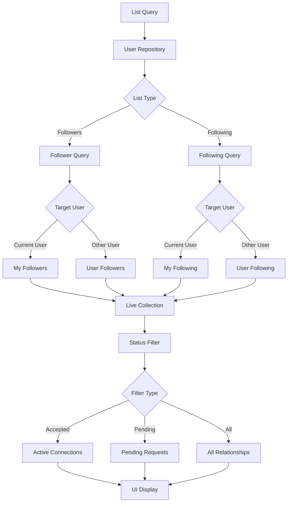

# Get Follower/Following List

<CardGroup cols={2}>
  <Card title="Live Collections" icon="arrows-rotate">
    Real-time updated follower and following lists with automatic synchronization
  </Card>
  <Card title="Status Filtering" icon="filter">
    Filter lists by connection status: accepted, pending, or all relationships
  </Card>
  <Card title="Pagination Support" icon="list">
    Efficient handling of large follower/following lists with built-in pagination
  </Card>
  <Card title="Cross-platform SDK" icon="mobile-screen">
    Consistent list management across iOS, Android, and Web platforms
  </Card>
</CardGroup>

## Overview

The **Follower/Following Lists** feature provides comprehensive access to user relationship data through live collections. These lists enable you to build social features like follower displays, mutual connection discovery, and relationship management interfaces.

## Architecture Overview



## Key Features

<AccordionGroup>
  <Accordion title="List Types and Filtering">
    <CardGroup cols={2}>
      <Card title="Follower Lists" icon="users">
        Retrieve users who are following a specific user, with status-based filtering
      </Card>
      <Card title="Following Lists" icon="user-plus">
        Get users that a specific user is following, including pending requests
      </Card>
      <Card title="Status-based Filtering" icon="funnel">
        Filter by connection status: accepted connections or pending requests
      </Card>
      <Card title="Real-time Updates" icon="bolt">
        Live collections automatically update when relationships change
      </Card>
    </CardGroup>
  </Accordion>

  <Accordion title="Data Structure">
    **Follow Relationship Object Properties:**
    
    - `sourceUser`: The user who initiated the follow action
    - `targetUser`: The user being followed
    - `status`: Connection status (accepted, pending, blocked)
    - `createdAt`: Timestamp when the relationship was created
    - `updatedAt`: Timestamp of the last status change
    
    **Collection Features:**
    - Chronological ordering by follow date (newest first)
    - Automatic exclusion of deleted users
    - Pagination support for large lists
    - Real-time updates when relationships change
  </Accordion>

  <Accordion title="Privacy and Access Control">
    - **Own Lists**: Full access to your follower/following lists
    - **Other User Lists**: Access based on privacy settings
    - **Pending Requests**: Only visible to relevant users
    - **Blocked Users**: Automatically excluded from results
  </Accordion>
</AccordionGroup>

## Get Followers List

### Implementation

<Tabs>
  <Tab title="iOS">
    <CodeGroup>
      ```swift Get My Followers List
      import AmitySDK
      
      class MyFollowersManager {
          private let userRepository = AmityUserRepository()
          private var followersCollection: AmityCollection<AmityFollowRelationship>?
          
          func getMyFollowers() {
              followersCollection = userRepository.getMyFollowers()
              observeFollowersList()
          }
          
          func getMyFollowersWithStatus(_ status: AmityFollowStatus) {
              followersCollection = userRepository.getMyFollowers(status: status)
              observeFollowersList()
          }
          
          private func observeFollowersList() {
              followersCollection?.observe { [weak self] collection, _, error in
                  DispatchQueue.main.async {
                      if let error = error {
                          self?.handleError(error)
                          return
                      }
                      
                      self?.updateFollowersUI(collection.object)
                  }
              }
          }
          
          private func updateFollowersUI(_ relationships: [AmityFollowRelationship]) {
              let followers = relationships.map { $0.sourceUser }
              displayFollowers(followers)
          }
      }
      ```
      
      ```swift Get Other User Followers List
      func getUserFollowers(userId: String, status: AmityFollowStatus? = nil) {
          let collection: AmityCollection<AmityFollowRelationship>
          
          if let status = status {
              collection = userRepository.getFollowers(userId: userId, status: status)
          } else {
              collection = userRepository.getFollowers(userId: userId)
          }
          
          collection.observe { [weak self] collectionData, _, error in
              DispatchQueue.main.async {
                  if let error = error {
                      self?.handleError(error)
                      return
                  }
                  
                  let followers = collectionData.object.map { $0.sourceUser }
                  self?.displayUserFollowers(followers, for: userId)
              }
          }
      }
      ```
      
      ```swift SwiftUI Followers List
      import SwiftUI
      import AmitySDK
      
      struct FollowersListView: View {
          let userId: String?
          @State private var followers: [AmityUser] = []
          @State private var isLoading = true
          @State private var selectedStatus: AmityFollowStatus = .accepted
          
          private let userRepository = AmityUserRepository()
          
          var body: some View {
              NavigationView {
                  VStack {
                      Picker("Status", selection: $selectedStatus) {
                          Text("Accepted").tag(AmityFollowStatus.accepted)
                          Text("Pending").tag(AmityFollowStatus.pending)
                      }
                      .pickerStyle(SegmentedPickerStyle())
                      .padding()
                      
                      if isLoading {
                          ProgressView("Loading followers...")
                      } else {
                          List(followers, id: \.userId) { follower in
                              FollowerRowView(user: follower)
                          }
                      }
                  }
                  .navigationTitle("Followers")
                  .onAppear {
                      loadFollowers()
                  }
                  .onChange(of: selectedStatus) { _ in
                      loadFollowers()
                  }
              }
          }
          
          private func loadFollowers() {
              isLoading = true
              
              let collection: AmityCollection<AmityFollowRelationship>
              
              if let userId = userId {
                  collection = userRepository.getFollowers(userId: userId, status: selectedStatus)
              } else {
                  collection = userRepository.getMyFollowers(status: selectedStatus)
              }
              
              collection.observe { collectionData, _, error in
                  DispatchQueue.main.async {
                      isLoading = false
                      
                      if let error = error {
                          print("Error loading followers: \(error)")
                          return
                      }
                      
                      followers = collectionData.object.map { $0.sourceUser }
                  }
              }
          }
      }
      
      struct FollowerRowView: View {
          let user: AmityUser
          
          var body: some View {
              HStack {
                  AsyncImage(url: URL(string: user.avatarURL ?? "")) { image in
                      image.resizable()
                  } placeholder: {
                      Circle().fill(Color.gray)
                  }
                  .frame(width: 40, height: 40)
                  .clipShape(Circle())
                  
                  VStack(alignment: .leading) {
                      Text(user.displayName ?? "Unknown")
                          .font(.headline)
                      
                      if let description = user.description, !description.isEmpty {
                          Text(description)
                              .font(.caption)
                              .foregroundColor(.secondary)
                      }
                  }
                  
                  Spacer()
              }
              .padding(.vertical, 4)
          }
      }
      ```
    </CodeGroup>
  </Tab>
  
  <Tab title="Android">
    <CodeGroup>
      ```kotlin Get My Followers List
      import com.amity.socialcloud.sdk.AmityCoreClient
      
      class MyFollowersManager {
          private val userRepository = AmityCoreClient.newUserRepository()
          private var followersCollection: AmityCollection<AmityFollowRelationship>? = null
          
          fun getMyFollowers() {
              followersCollection = userRepository.getMyFollowers()
              observeFollowersList()
          }
          
          fun getMyFollowersWithStatus(status: AmityFollowStatus) {
              followersCollection = userRepository.getMyFollowers(status)
              observeFollowersList()
          }
          
          private fun observeFollowersList() {
              followersCollection?.observe()?.subscribe({ collection ->
                  val followers = collection.data.map { it.sourceUser }
                  updateFollowersUI(followers)
              }, { error ->
                  handleError(error)
              })
          }
          
          private fun updateFollowersUI(followers: List<AmityUser>) {
              // Update RecyclerView or other UI components
              displayFollowers(followers)
          }
      }
      ```
      
      ```kotlin Get Other User Followers List
      fun getUserFollowers(userId: String, status: AmityFollowStatus? = null) {
          val collection = if (status != null) {
              userRepository.getFollowers(userId, status)
          } else {
              userRepository.getFollowers(userId)
          }
          
          collection.observe().subscribe({ collectionData ->
              val followers = collectionData.data.map { it.sourceUser }
              displayUserFollowers(followers, userId)
          }, { error ->
              handleError(error)
          })
      }
      ```
      
      ```kotlin Jetpack Compose Followers List
      import androidx.compose.runtime.*
      import androidx.compose.ui.Modifier
      import androidx.compose.material3.*
      import androidx.compose.foundation.lazy.LazyColumn
      import androidx.compose.foundation.lazy.items
      import com.amity.socialcloud.sdk.AmityCoreClient
      
      @Composable
      fun FollowersListScreen(
          userId: String? = null,
          modifier: Modifier = Modifier
      ) {
          var followers by remember { mutableStateOf<List<AmityUser>>(emptyList()) }
          var isLoading by remember { mutableStateOf(true) }
          var selectedStatus by remember { mutableStateOf(AmityFollowStatus.ACCEPTED) }
          
          val userRepository = remember { AmityCoreClient.newUserRepository() }
          
          LaunchedEffect(userId, selectedStatus) {
              isLoading = true
              
              val collection = if (userId != null) {
                  userRepository.getFollowers(userId, selectedStatus)
              } else {
                  userRepository.getMyFollowers(selectedStatus)
              }
              
              collection.observe().subscribe({ collectionData ->
                  followers = collectionData.data.map { it.sourceUser }
                  isLoading = false
              }, { error ->
                  isLoading = false
                  // Handle error
              })
          }
          
          Column(modifier = modifier) {
              // Status filter tabs
              TabRow(selectedTabIndex = if (selectedStatus == AmityFollowStatus.ACCEPTED) 0 else 1) {
                  Tab(
                      selected = selectedStatus == AmityFollowStatus.ACCEPTED,
                      onClick = { selectedStatus = AmityFollowStatus.ACCEPTED }
                  ) {
                      Text("Accepted", modifier = Modifier.padding(16.dp))
                  }
                  
                  Tab(
                      selected = selectedStatus == AmityFollowStatus.PENDING,
                      onClick = { selectedStatus = AmityFollowStatus.PENDING }
                  ) {
                      Text("Pending", modifier = Modifier.padding(16.dp))
                  }
              }
              
              if (isLoading) {
                  Box(
                      modifier = Modifier.fillMaxSize(),
                      contentAlignment = Alignment.Center
                  ) {
                      CircularProgressIndicator()
                  }
              } else {
                  LazyColumn {
                      items(followers) { follower ->
                          FollowerItem(user = follower)
                      }
                  }
              }
          }
      }
      
      @Composable
      fun FollowerItem(user: AmityUser) {
          Card(
              modifier = Modifier
                  .fillMaxWidth()
                  .padding(horizontal = 16.dp, vertical = 4.dp)
          ) {
              Row(
                  modifier = Modifier.padding(16.dp),
                  verticalAlignment = Alignment.CenterVertically
              ) {
                  // User avatar
                  AsyncImage(
                      model = user.avatarUrl,
                      contentDescription = null,
                      modifier = Modifier
                          .size(40.dp)
                          .clip(CircleShape),
                      placeholder = painterResource(id = R.drawable.placeholder_avatar)
                  )
                  
                  Spacer(modifier = Modifier.width(12.dp))
                  
                  Column {
                      Text(
                          text = user.displayName ?: "Unknown",
                          style = MaterialTheme.typography.bodyLarge,
                          fontWeight = FontWeight.Medium
                      )
                      
                      user.description?.let { description ->
                          Text(
                              text = description,
                              style = MaterialTheme.typography.bodySmall,
                              color = MaterialTheme.colorScheme.onSurfaceVariant
                          )
                      }
                  }
              }
          }
      }
      ```
    </CodeGroup>
  </Tab>
  
  <Tab title="TypeScript">
    <CodeGroup>
      ```typescript Get My Followers List
      import { AmityUserRepository, AmityFollowStatus } from '@amityco/ts-sdk';
      
      class MyFollowersManager {
          private userRepository = new AmityUserRepository();
          
          async getMyFollowers(): Promise<void> {
              try {
                  const collection = this.userRepository.getMyFollowers();
                  this.observeFollowersList(collection);
              } catch (error) {
                  this.handleError(error);
              }
          }
          
          async getMyFollowersWithStatus(status: AmityFollowStatus): Promise<void> {
              try {
                  const collection = this.userRepository.getMyFollowers(status);
                  this.observeFollowersList(collection);
              } catch (error) {
                  this.handleError(error);
              }
          }
          
          private observeFollowersList(collection: any): void {
              collection.subscribe({
                  next: (collectionData: any) => {
                      const followers = collectionData.data.map((rel: any) => rel.sourceUser);
                      this.updateFollowersUI(followers);
                  },
                  error: (error: any) => {
                      this.handleError(error);
                  }
              });
          }
      }
      ```
      
      ```typescript React Hook for Followers
      import { useState, useEffect, useCallback } from 'react';
      import { AmityUserRepository, AmityFollowStatus, AmityUser } from '@amityco/ts-sdk';
      
      export const useFollowersList = (userId?: string, status: AmityFollowStatus = 'accepted') => {
          const [followers, setFollowers] = useState<AmityUser[]>([]);
          const [isLoading, setIsLoading] = useState(true);
          const [error, setError] = useState<string | null>(null);
          
          const userRepository = new AmityUserRepository();
          
          const loadFollowers = useCallback(async () => {
              setIsLoading(true);
              setError(null);
              
              try {
                  const collection = userId 
                      ? userRepository.getFollowers(userId, status)
                      : userRepository.getMyFollowers(status);
                  
                  collection.subscribe({
                      next: (collectionData: any) => {
                          const followersList = collectionData.data.map((rel: any) => rel.sourceUser);
                          setFollowers(followersList);
                          setIsLoading(false);
                      },
                      error: (err: any) => {
                          setError(err.message || 'Failed to load followers');
                          setIsLoading(false);
                      }
                  });
                  
              } catch (err) {
                  setError(err instanceof Error ? err.message : 'Failed to load followers');
                  setIsLoading(false);
              }
          }, [userId, status, userRepository]);
          
          useEffect(() => {
              loadFollowers();
          }, [loadFollowers]);
          
          return {
              followers,
              isLoading,
              error,
              refresh: loadFollowers
          };
      };
      
      // Usage Component
      function FollowersListComponent({ userId }: { userId?: string }) {
          const [selectedStatus, setSelectedStatus] = useState<AmityFollowStatus>('accepted');
          const { followers, isLoading, error, refresh } = useFollowersList(userId, selectedStatus);
          
          if (isLoading) {
              return <div className="loading">Loading followers...</div>;
          }
          
          if (error) {
              return <div className="error">Error: {error}</div>;
          }
          
          return (
              <div className="followers-list">
                  <div className="status-filter">
                      <button 
                          className={selectedStatus === 'accepted' ? 'active' : ''}
                          onClick={() => setSelectedStatus('accepted')}
                      >
                          Accepted
                      </button>
                      <button 
                          className={selectedStatus === 'pending' ? 'active' : ''}
                          onClick={() => setSelectedStatus('pending')}
                      >
                          Pending
                      </button>
                  </div>
                  
                  <div className="followers-grid">
                      {followers.map(follower => (
                          <div key={follower.userId} className="follower-item">
                              
                              <div className="user-info">
                                  <h4>{follower.displayName || 'Unknown'}</h4>
                                  {follower.description && (
                                      <p className="description">{follower.description}</p>
                                  )}
                              </div>
                          </div>
                      ))}
                  </div>
                  
                  <button onClick={refresh}>Refresh</button>
              </div>
          );
      }
      ```
    </CodeGroup>
  </Tab>
  
  <Tab title="Flutter">
    <CodeGroup>
      ```dart Get My Followers List
      import 'package:amity_sdk/amity_sdk.dart';
      
      class MyFollowersManager {
        final AmityUserRepository _userRepository = AmityCoreClient.newUserRepository();
        
        Future<void> getMyFollowers() async {
          try {
            final collection = _userRepository.getMyFollowers();
            _observeFollowersList(collection);
          } catch (error) {
            _handleError(error);
          }
        }
        
        Future<void> getMyFollowersWithStatus(AmityFollowStatus status) async {
          try {
            final collection = _userRepository.getMyFollowers(status);
            _observeFollowersList(collection);
          } catch (error) {
            _handleError(error);
          }
        }
        
        void _observeFollowersList(AmityCollection<AmityFollowRelationship> collection) {
          collection.listen((collectionData) {
            final followers = collectionData.data.map((rel) => rel.sourceUser).toList();
            _updateFollowersUI(followers);
          }).onError((error) {
            _handleError(error);
          });
        }
      }
      ```
      
      ```dart Flutter Widget for Followers List
      import 'package:flutter/material.dart';
      import 'package:amity_sdk/amity_sdk.dart';
      
      class FollowersListWidget extends StatefulWidget {
        final String? userId;
        
        const FollowersListWidget({Key? key, this.userId}) : super(key: key);
        
        @override
        _FollowersListWidgetState createState() => _FollowersListWidgetState();
      }
      
      class _FollowersListWidgetState extends State<FollowersListWidget>
          with SingleTickerProviderStateMixin {
        
        late TabController _tabController;
        final AmityUserRepository _userRepository = AmityCoreClient.newUserRepository();
        
        List<AmityUser> _acceptedFollowers = [];
        List<AmityUser> _pendingFollowers = [];
        bool _isLoading = true;
        
        @override
        void initState() {
          super.initState();
          _tabController = TabController(length: 2, vsync: this);
          _loadFollowers();
        }
        
        Future<void> _loadFollowers() async {
          setState(() {
            _isLoading = true;
          });
          
          try {
            // Load accepted followers
            final acceptedCollection = widget.userId != null
                ? _userRepository.getFollowers(widget.userId!, AmityFollowStatus.accepted)
                : _userRepository.getMyFollowers(AmityFollowStatus.accepted);
                
            acceptedCollection.listen((collectionData) {
              setState(() {
                _acceptedFollowers = collectionData.data.map((rel) => rel.sourceUser).toList();
              });
            });
            
            // Load pending followers
            final pendingCollection = widget.userId != null
                ? _userRepository.getFollowers(widget.userId!, AmityFollowStatus.pending)
                : _userRepository.getMyFollowers(AmityFollowStatus.pending);
                
            pendingCollection.listen((collectionData) {
              setState(() {
                _pendingFollowers = collectionData.data.map((rel) => rel.sourceUser).toList();
                _isLoading = false;
              });
            });
            
          } catch (error) {
            setState(() {
              _isLoading = false;
            });
            _showError(error.toString());
          }
        }
        
        @override
        Widget build(BuildContext context) {
          return Scaffold(
            appBar: AppBar(
              title: Text('Followers'),
              bottom: TabBar(
                controller: _tabController,
                tabs: [
                  Tab(text: 'Accepted (${_acceptedFollowers.length})'),
                  Tab(text: 'Pending (${_pendingFollowers.length})'),
                ],
              ),
            ),
            body: _isLoading
                ? Center(child: CircularProgressIndicator())
                : TabBarView(
                    controller: _tabController,
                    children: [
                      _buildFollowersList(_acceptedFollowers),
                      _buildFollowersList(_pendingFollowers),
                    ],
                  ),
          );
        }
        
        Widget _buildFollowersList(List<AmityUser> followers) {
          if (followers.isEmpty) {
            return Center(
              child: Text(
                'No followers found',
                style: TextStyle(fontSize: 16, color: Colors.grey[600]),
              ),
            );
          }
          
          return ListView.builder(
            itemCount: followers.length,
            itemBuilder: (context, index) {
              final follower = followers[index];
              return ListTile(
                leading: CircleAvatar(
                  backgroundImage: follower.avatarUrl != null
                      ? NetworkImage(follower.avatarUrl!)
                      : null,
                  child: follower.avatarUrl == null
                      ? Icon(Icons.person)
                      : null,
                ),
                title: Text(follower.displayName ?? 'Unknown'),
                subtitle: follower.description != null
                    ? Text(follower.description!)
                    : null,
                onTap: () {
                  // Navigate to user profile
                },
              );
            },
          );
        }
        
        void _showError(String message) {
          ScaffoldMessenger.of(context).showSnackBar(
            SnackBar(content: Text('Error: $message')),
          );
        }
        
        @override
        void dispose() {
          _tabController.dispose();
          super.dispose();
        }
      }
      ```
    </CodeGroup>
  </Tab>
</Tabs>

## Get Following List

### Implementation

<Tabs>
  <Tab title="iOS">
    <CodeGroup>
      ```swift Get My Following List
      func getMyFollowing() {
          let followingCollection = userRepository.getMyFollowing()
          observeFollowingList(followingCollection)
      }
      
      func getMyFollowingWithStatus(_ status: AmityFollowStatus) {
          let followingCollection = userRepository.getMyFollowing(status: status)
          observeFollowingList(followingCollection)
      }
      
      private func observeFollowingList(_ collection: AmityCollection<AmityFollowRelationship>) {
          collection.observe { [weak self] collectionData, _, error in
              DispatchQueue.main.async {
                  if let error = error {
                      self?.handleError(error)
                      return
                  }
                  
                  let following = collectionData.object.map { $0.targetUser }
                  self?.updateFollowingUI(following)
              }
          }
      }
      ```
      
      ```swift Get Other User Following List
      func getUserFollowing(userId: String, status: AmityFollowStatus? = nil) {
          let collection: AmityCollection<AmityFollowRelationship>
          
          if let status = status {
              collection = userRepository.getFollowing(userId: userId, status: status)
          } else {
              collection = userRepository.getFollowing(userId: userId)
          }
          
          observeFollowingList(collection)
      }
      ```
    </CodeGroup>
  </Tab>
  
  <Tab title="Android">
    <CodeGroup>
      ```kotlin Get My Following List
      fun getMyFollowing() {
          val followingCollection = userRepository.getMyFollowing()
          observeFollowingList(followingCollection)
      }
      
      fun getMyFollowingWithStatus(status: AmityFollowStatus) {
          val followingCollection = userRepository.getMyFollowing(status)
          observeFollowingList(followingCollection)
      }
      
      private fun observeFollowingList(collection: AmityCollection<AmityFollowRelationship>) {
          collection.observe().subscribe({ collectionData ->
              val following = collectionData.data.map { it.targetUser }
              updateFollowingUI(following)
          }, { error ->
              handleError(error)
          })
      }
      ```
      
      ```kotlin Get Other User Following List
      fun getUserFollowing(userId: String, status: AmityFollowStatus? = null) {
          val collection = if (status != null) {
              userRepository.getFollowing(userId, status)
          } else {
              userRepository.getFollowing(userId)
          }
          
          observeFollowingList(collection)
      }
      ```
    </CodeGroup>
  </Tab>
  
  <Tab title="TypeScript">
    <CodeGroup>
      ```typescript Get My Following List
      async getMyFollowing(): Promise<void> {
          try {
              const collection = this.userRepository.getMyFollowing();
              this.observeFollowingList(collection);
          } catch (error) {
              this.handleError(error);
          }
      }
      
      async getMyFollowingWithStatus(status: AmityFollowStatus): Promise<void> {
          try {
              const collection = this.userRepository.getMyFollowing(status);
              this.observeFollowingList(collection);
          } catch (error) {
              this.handleError(error);
          }
      }
      
      private observeFollowingList(collection: any): void {
          collection.subscribe({
              next: (collectionData: any) => {
                  const following = collectionData.data.map((rel: any) => rel.targetUser);
                  this.updateFollowingUI(following);
              },
              error: (error: any) => {
                  this.handleError(error);
              }
          });
      }
      ```
      
      ```typescript React Hook for Following List
      export const useFollowingList = (userId?: string, status: AmityFollowStatus = 'accepted') => {
          const [following, setFollowing] = useState<AmityUser[]>([]);
          const [isLoading, setIsLoading] = useState(true);
          const [error, setError] = useState<string | null>(null);
          
          const userRepository = new AmityUserRepository();
          
          const loadFollowing = useCallback(async () => {
              setIsLoading(true);
              setError(null);
              
              try {
                  const collection = userId 
                      ? userRepository.getFollowing(userId, status)
                      : userRepository.getMyFollowing(status);
                  
                  collection.subscribe({
                      next: (collectionData: any) => {
                          const followingList = collectionData.data.map((rel: any) => rel.targetUser);
                          setFollowing(followingList);
                          setIsLoading(false);
                      },
                      error: (err: any) => {
                          setError(err.message || 'Failed to load following list');
                          setIsLoading(false);
                      }
                  });
                  
              } catch (err) {
                  setError(err instanceof Error ? err.message : 'Failed to load following list');
                  setIsLoading(false);
              }
          }, [userId, status, userRepository]);
          
          useEffect(() => {
              loadFollowing();
          }, [loadFollowing]);
          
          return {
              following,
              isLoading,
              error,
              refresh: loadFollowing
          };
      };
      ```
    </CodeGroup>
  </Tab>
  
  <Tab title="Flutter">
    <CodeGroup>
      ```dart Get My Following List
      Future<void> getMyFollowing() async {
        try {
          final collection = _userRepository.getMyFollowing();
          _observeFollowingList(collection);
        } catch (error) {
          _handleError(error);
        }
      }
      
      Future<void> getMyFollowingWithStatus(AmityFollowStatus status) async {
        try {
          final collection = _userRepository.getMyFollowing(status);
          _observeFollowingList(collection);
        } catch (error) {
          _handleError(error);
        }
      }
      
      void _observeFollowingList(AmityCollection<AmityFollowRelationship> collection) {
        collection.listen((collectionData) {
          final following = collectionData.data.map((rel) => rel.targetUser).toList();
          _updateFollowingUI(following);
        }).onError((error) {
          _handleError(error);
        });
      }
      ```
      
      ```dart Get Other User Following List
      Future<void> getUserFollowing(String userId, [AmityFollowStatus? status]) async {
        try {
          final collection = status != null
              ? _userRepository.getFollowing(userId, status)
              : _userRepository.getFollowing(userId);
              
          _observeFollowingList(collection);
        } catch (error) {
          _handleError(error);
        }
      }
      ```
    </CodeGroup>
  </Tab>
</Tabs>

## Best Practices

<AccordionGroup>
  <Accordion title="Performance Optimization">
    ### Efficient List Management
    
    <CardGroup cols={2}>
      <Card title="Pagination Handling" icon="list">
        Implement proper pagination to handle large follower/following lists efficiently
      </Card>
      <Card title="Status-based Loading" icon="filter">
        Load only the specific status data needed to reduce unnecessary API calls
      </Card>
      <Card title="Lazy Loading" icon="clock">
        Load additional list items only when users scroll near the end
      </Card>
      <Card title="Collection Disposal" icon="trash">
        Properly dispose of live collections when views are destroyed
      </Card>
    </CardGroup>
    
    ### Implementation Strategy
    
    <CodeGroup>
      ```swift iOS Pagination Implementation
      class PaginatedFollowersManager {
          private let pageSize = 20
          private var followersCollection: AmityCollection<AmityFollowRelationship>?
          private var isLoadingMore = false
          
          func loadMoreFollowers() {
              guard let collection = followersCollection,
                    !isLoadingMore,
                    collection.hasNext else { return }
              
              isLoadingMore = true
              collection.nextPage { [weak self] result in
                  DispatchQueue.main.async {
                      self?.isLoadingMore = false
                      switch result {
                      case .success:
                          // Collection automatically updates via observer
                          break
                      case .failure(let error):
                          self?.handlePaginationError(error)
                      }
                  }
              }
          }
          
          func shouldLoadMore(at index: Int, totalCount: Int) -> Bool {
              return index >= totalCount - 5 && !isLoadingMore
          }
      }
      ```
    </CodeGroup>
  </Accordion>

  <Accordion title="UI/UX Guidelines">
    ### Visual Design
    
    - **Status Indicators**: Use clear visual indicators for different connection statuses
    - **Empty States**: Provide meaningful empty states for users with no followers/following
    - **Loading States**: Show loading indicators during data fetching
    - **Error Handling**: Display user-friendly error messages with retry options
    
    ### User Experience
    
    - **Pull-to-Refresh**: Implement pull-to-refresh for manual list updates
    - **Search Functionality**: Add search capability for large lists
    - **Quick Actions**: Provide quick follow/unfollow actions directly in the list
    - **Profile Navigation**: Enable easy navigation to user profiles from the list
    
    ### Accessibility
    
    - **Screen Reader Support**: Ensure proper labels for assistive technologies
    - **Keyboard Navigation**: Support keyboard navigation for web implementations
    - **Color Contrast**: Maintain sufficient color contrast for status indicators
    - **Focus Management**: Proper focus management during list updates
  </Accordion>

  <Accordion title="Data Synchronization">
    ### Real-time Updates
    
    - **Live Collections**: Leverage live collections for automatic updates
    - **Status Changes**: Handle connection status changes in real-time
    - **Cross-device Sync**: Ensure consistency across multiple devices
    - **Conflict Resolution**: Handle conflicts between local and server data
    
    ### Cache Management
    
    <CodeGroup>
      ```swift iOS Cache Management
      class FollowListCacheManager {
          private var cachedLists: [String: (data: [AmityUser], timestamp: Date)] = [:]
          private let cacheTimeout: TimeInterval = 600 // 10 minutes
          
          func getCachedList(for key: String) -> [AmityUser]? {
              guard let cached = cachedLists[key],
                    Date().timeIntervalSince(cached.timestamp) < cacheTimeout else {
                  return nil
              }
              return cached.data
          }
          
          func cacheList(_ users: [AmityUser], for key: String) {
              cachedLists[key] = (data: users, timestamp: Date())
          }
          
          func invalidateCache(for key: String) {
              cachedLists.removeValue(forKey: key)
          }
          
          func clearExpiredCache() {
              let now = Date()
              cachedLists = cachedLists.filter { 
                  now.timeIntervalSince($0.value.timestamp) < cacheTimeout 
              }
          }
      }
      ```
    </CodeGroup>
  </Accordion>
</AccordionGroup>

## Use Cases

<CardGroup cols={2}>
  <Card title="User Profile Display" icon="user">
    Show follower/following counts and lists on user profiles
    
    **Implementation:**
    - Display counts prominently on profiles
    - Enable list viewing with status filtering
    - Support mutual connection discovery
  </Card>
  
  <Card title="Social Discovery" icon="compass">
    Help users discover new connections through existing networks
    
    **Implementation:**
    - Show mutual followers/following
    - Suggest users based on connection patterns
    - Enable browsing through followers of followed users
  </Card>
  
  <Card title="Relationship Management" icon="users-gear">
    Manage pending requests and connection cleanup
    
    **Implementation:**
    - Bulk accept/decline pending requests
    - Clean up inactive or unwanted connections
    - Monitor relationship health metrics
  </Card>
  
  <Card title="Community Building" icon="users-group">
    Foster community growth through connection visibility
    
    **Implementation:**
    - Highlight active community members
    - Show connection growth trends
    - Enable community leader discovery
  </Card>
</CardGroup>

<Note>
**Important Notes:**
- Deleted users are automatically excluded from all follower/following lists
- Lists are ordered chronologically by relationship creation date (newest first)
- Pagination is handled automatically by live collections
- Status filtering is only available when request-based following is enabled
</Note>

## Related Topics

<CardGroup cols={3}>
  <Card title="Follow/Unfollow User" href="./follow-unfollow-user" icon="user-plus">
    Learn how to implement basic follow and unfollow functionality
  </Card>
  <Card title="Connection Status" href="./get-connection-status-and-connection-counter" icon="signal">
    Check relationship status and connection counters between users
  </Card>
  <Card title="Accept/Decline Requests" href="./accept-decline-follow-request" icon="handshake">
    Handle incoming follow requests with approval workflows
  </Card>
</CardGroup>