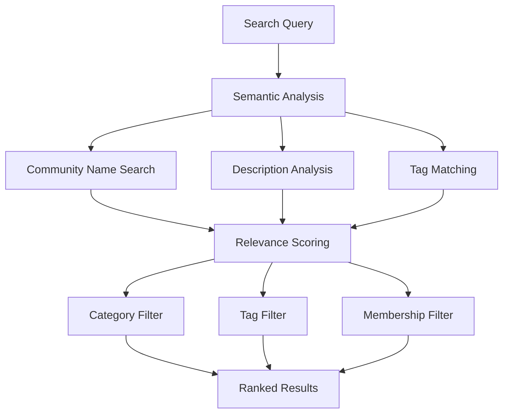

# Intelligent Search - Community

# Intelligent Search - Community

## Overview

Discover communities that match your interests using advanced semantic search capabilities. The Community Search API goes beyond simple name matching to understand context and meaning, helping users find relevant communities they might not have discovered through traditional keyword searches.



## Key Features

<CardGroup cols={3}>
  <Card title="Semantic Understanding" icon="brain">
    Find communities based on meaning and context, not just exact name matches
  </Card>
  
  <Card title="Advanced Filtering" icon="filter">
    Filter by categories, tags, and membership status for precise results
  </Card>
  
  <Card title="Relevance Scoring" icon="star">
    Results ranked by semantic relevance combined with lexical matching
  </Card>
</CardGroup>

## Search Filtering Options

### Category Filtering

<AccordionGroup>
  <Accordion title="All Categories (Default)">
    **Behavior**: Searches across all community categories
    
    **Use Case**: Broad discovery when category preference is unknown
    
    **Implementation**: Omit `categoryIds` parameter or pass empty array
  </Accordion>

  <Accordion title="Specific Categories">
    **Behavior**: Limits search to specified category IDs
    
    **Use Case**: Focused search within known interest areas
    
    **Implementation**: Pass array of category IDs: `categoryIds: ["cat1", "cat2"]`
  </Accordion>
</AccordionGroup>

### Tag-Based Filtering

<AccordionGroup>
  <Accordion title="All Tags (Default)">
    **Behavior**: Includes communities regardless of tags
    
    **Use Case**: Maximum coverage when tag preferences are flexible
    
    **Implementation**: Omit `tags` parameter or pass empty array
  </Accordion>

  <Accordion title="Specific Tags">
    **Behavior**: Filters to communities with specified tags
    
    **Use Case**: Targeted search for communities with specific topics/themes
    
    **Implementation**: Pass array of tags: `tags: ["technology", "beginner-friendly"]`
  </Accordion>
</AccordionGroup>

### Membership Status Filtering

<Tabs>
  <Tab title="ALL (Default)">
    **Description**: Include all communities regardless of user's membership status
    
    **Best For**: 
    - New user onboarding
    - General community discovery
    - Exploring new interests
    
    **Example Use Cases**:
    - "Show me all photography communities"
    - Public community browsers
    - Recommendation engines
  </Tab>

  <Tab title="MEMBER">
    **Description**: Show only communities where the user is already a member
    
    **Best For**:
    - Finding specific communities user belongs to
    - Personal content organization
    - Quick access to joined communities
    
    **Example Use Cases**:
    - "Find my gaming communities"
    - Personal dashboard searches
    - Content management workflows
  </Tab>

  <Tab title="NOT_MEMBER">
    **Description**: Show only communities where the user is not a member
    
    **Best For**:
    - Discovery of new communities
    - Expanding user interests
    - Avoiding duplicate suggestions
    
    **Example Use Cases**:
    - "Suggest new cooking communities"
    - Onboarding recommendations
    - Interest expansion features
  </Tab>
</Tabs>

## Implementation Examples

### Basic Community Search

<Tabs>
  <Tab title="iOS">
    <CodeGroup>
      ```swift Basic Community Search
      import AmitySDK

      class CommunitySearchManager {
          private let communityRepository: AmityCommunityRepository
          private var searchCollection: AmityCollection<AmityCommunity>?
          private var searchToken: AmityNotificationToken?
          
          init() {
              self.communityRepository = AmityCommunityRepository(client: AmityManager.shared.client!)
          }
          
          func searchCommunities(query: String) {
              // Basic semantic search for communities
              let searchQuery = communityRepository.semanticSearchCommunities(query: query)
              
              searchToken = searchQuery.observe { [weak self] collection, _, error in
                  if let error = error {
                      self?.handleSearchError(error)
                      return
                  }
                  
                  self?.searchCollection = collection
                  self?.handleSearchResults(communities: collection.allObjects())
              }
          }
          
          private func handleSearchResults(communities: [AmityCommunity]) {
              print("Found \(communities.count) communities")
              
              for community in communities {
                  print("Community: \(community.displayName ?? "Unknown")")
                  print("Score: \(community.relevanceScore ?? 0.0)")
                  print("Members: \(community.membersCount)")
                  print("---")
              }
          }
          
          private func handleSearchError(_ error: Error) {
              print("Community search error: \(error.localizedDescription)")
          }
          
          deinit {
              searchToken?.invalidate()
          }
      }
      ```

      ```swift Advanced Search with Filters
      import AmitySDK

      class AdvancedCommunitySearchManager {
          private let communityRepository: AmityCommunityRepository
          
          init() {
              self.communityRepository = AmityCommunityRepository(client: AmityManager.shared.client!)
          }
          
          func searchCommunitiesWithFilters(
              query: String,
              categoryIds: [String]? = nil,
              tags: [String]? = nil,
              membershipFilter: AmityMembershipFilter = .all,
              minScore: Double = 0.3
          ) {
              
              let searchBuilder = AmitySemanticCommunitySearchBuilder()
                  .query(query)
                  .minScore(minScore)
                  .membershipFilter(membershipFilter)
              
              // Apply category filter if provided
              if let categoryIds = categoryIds, !categoryIds.isEmpty {
                  searchBuilder.categoryIds(categoryIds)
              }
              
              // Apply tag filter if provided
              if let tags = tags, !tags.isEmpty {
                  searchBuilder.tags(tags)
              }
              
              let searchQuery = communityRepository.semanticSearchCommunities(builder: searchBuilder)
              
              searchQuery.observe { [weak self] collection, changes, error in
                  if let error = error {
                      self?.handleSearchError(error)
                      return
                  }
                  
                  self?.processSearchResults(
                      communities: collection.allObjects(),
                      changes: changes
                  )
              }
          }
          
          private func processSearchResults(
              communities: [AmityCommunity],
              changes: [AmityCollectionChange]
          ) {
              print("Search completed with \(communities.count) results")
              
              // Group results by relevance score
              let highRelevance = communities.filter { ($0.relevanceScore ?? 0) >= 0.7 }
              let mediumRelevance = communities.filter { 
                  let score = $0.relevanceScore ?? 0
                  return score >= 0.4 && score < 0.7 
              }
              let lowRelevance = communities.filter { ($0.relevanceScore ?? 0) < 0.4 }
              
              print("High relevance: \(highRelevance.count)")
              print("Medium relevance: \(mediumRelevance.count)")
              print("Low relevance: \(lowRelevance.count)")
              
              // Process incremental changes for real-time updates
              for change in changes {
                  switch change {
                  case .insert(let indexPath):
                      print("New community result at position \(indexPath.row)")
                  case .update(let indexPath):
                      print("Updated community result at position \(indexPath.row)")
                  default:
                      break
                  }
              }
          }
          
          private func handleSearchError(_ error: Error) {
              print("Advanced community search error: \(error.localizedDescription)")
          }
      }
      ```
    </CodeGroup>
  </Tab>

  <Tab title="Android">
    <CodeGroup>
      ```kotlin Basic Community Search
      import com.amity.socialcloud.sdk.AmityCoreClient
      import com.amity.socialcloud.sdk.social.community.AmityCommunityRepository
      import com.amity.socialcloud.sdk.social.community.AmityCommunity
      import io.reactivex.rxjava3.android.schedulers.AndroidSchedulers
      import io.reactivex.rxjava3.disposables.CompositeDisposable
      import io.reactivex.rxjava3.schedulers.Schedulers

      class CommunitySearchManager {
          private val communityRepository: AmityCommunityRepository = AmityCoreClient.newCommunityRepository()
          private val compositeDisposable = CompositeDisposable()
          
          fun searchCommunities(query: String) {
              val disposable = communityRepository.semanticSearchCommunities(query)
                  .build()
                  .query()
                  .subscribeOn(Schedulers.io())
                  .observeOn(AndroidSchedulers.mainThread())
                  .subscribe(
                      { paginatedList ->
                          handleSearchResults(paginatedList.data)
                      },
                      { error ->
                          handleSearchError(error)
                      }
                  )
              
              compositeDisposable.add(disposable)
          }
          
          private fun handleSearchResults(communities: List<AmityCommunity>) {
              println("Found ${communities.size} communities")
              
              communities.forEach { community ->
                  println("Community: ${community.getDisplayName()}")
                  println("Score: ${community.getRelevanceScore()}")
                  println("Members: ${community.getMemberCount()}")
                  println("---")
              }
          }
          
          private fun handleSearchError(error: Throwable) {
              println("Community search error: ${error.message}")
          }
          
          fun dispose() {
              compositeDisposable.dispose()
          }
      }
      ```

      ```kotlin Advanced Search with Filters
      import com.amity.socialcloud.sdk.AmityCoreClient
      import com.amity.socialcloud.sdk.social.community.AmityCommunityRepository
      import com.amity.socialcloud.sdk.social.community.AmityCommunity
      import com.amity.socialcloud.sdk.social.community.AmityMembershipFilter
      import io.reactivex.rxjava3.android.schedulers.AndroidSchedulers
      import io.reactivex.rxjava3.disposables.CompositeDisposable
      import io.reactivex.rxjava3.schedulers.Schedulers

      class AdvancedCommunitySearchManager {
          private val communityRepository: AmityCommunityRepository = AmityCoreClient.newCommunityRepository()
          private val compositeDisposable = CompositeDisposable()
          
          fun searchCommunitiesWithFilters(
              query: String,
              categoryIds: List<String>? = null,
              tags: List<String>? = null,
              membershipFilter: AmityMembershipFilter = AmityMembershipFilter.ALL,
              minScore: Double = 0.3
          ) {
              
              val searchBuilder = communityRepository.semanticSearchCommunities(query)
                  .minScore(minScore)
                  .membershipFilter(membershipFilter)
              
              // Apply category filter if provided
              categoryIds?.takeIf { it.isNotEmpty() }?.let { 
                  searchBuilder.categoryIds(it) 
              }
              
              // Apply tag filter if provided
              tags?.takeIf { it.isNotEmpty() }?.let { 
                  searchBuilder.tags(it) 
              }
              
              val disposable = searchBuilder
                  .build()
                  .query()
                  .subscribeOn(Schedulers.io())
                  .observeOn(AndroidSchedulers.mainThread())
                  .subscribe(
                      { paginatedList ->
                          processSearchResults(paginatedList.data)
                      },
                      { error ->
                          handleSearchError(error)
                      }
                  )
              
              compositeDisposable.add(disposable)
          }
          
          private fun processSearchResults(communities: List<AmityCommunity>) {
              println("Search completed with ${communities.size} results")
              
              // Group results by relevance score
              val highRelevance = communities.filter { (it.getRelevanceScore() ?: 0.0) >= 0.7 }
              val mediumRelevance = communities.filter { 
                  val score = it.getRelevanceScore() ?: 0.0
                  score >= 0.4 && score < 0.7 
              }
              val lowRelevance = communities.filter { (it.getRelevanceScore() ?: 0.0) < 0.4 }
              
              println("High relevance: ${highRelevance.size}")
              println("Medium relevance: ${mediumRelevance.size}")
              println("Low relevance: ${lowRelevance.size}")
              
              // Display top results
              communities.take(5).forEach { community ->
                  displayCommunityResult(community)
              }
          }
          
          private fun displayCommunityResult(community: AmityCommunity) {
              println("🏛️ ${community.getDisplayName()}")
              println("   Score: ${String.format("%.2f", community.getRelevanceScore() ?: 0.0)}")
              println("   Members: ${community.getMemberCount()}")
              println("   Description: ${community.getDescription()?.take(100)}...")
              println()
          }
          
          private fun handleSearchError(error: Throwable) {
              println("Advanced community search error: ${error.message}")
          }
          
          fun dispose() {
              compositeDisposable.dispose()
          }
      }
      ```
    </CodeGroup>
  </Tab>

  <Tab title="TypeScript">
    <CodeGroup>
      ```typescript Basic Community Search
      import { CommunityRepository, Community } from '@amityco/ts-sdk';

      class CommunitySearchManager {
          private communityRepository: CommunityRepository;
          private unsubscribe?: () => void;
          
          constructor() {
              this.communityRepository = new CommunityRepository();
          }
          
          async searchCommunities(query: string): Promise<void> {
              try {
                  const searchResults = await this.communityRepository.semanticSearchCommunities({
                      query,
                      limit: 20,
                      minScore: 0.3
                  });
                  
                  this.handleSearchResults(searchResults.data);
                  
                  // Setup real-time updates
                  this.unsubscribe = this.communityRepository.observeSearchResults((results) => {
                      this.handleSearchResults(results);
                  });
                  
              } catch (error) {
                  this.handleSearchError(error);
              }
          }
          
          private handleSearchResults(communities: Community[]): void {
              console.log(`Found ${communities.length} communities`);
              
              communities.forEach(community => {
                  console.log(`Community: ${community.displayName}`);
                  console.log(`Score: ${community.relevanceScore}`);
                  console.log(`Members: ${community.membersCount}`);
                  console.log('---');
              });
          }
          
          private handleSearchError(error: any): void {
              console.error('Community search error:', error.message);
          }
          
          dispose(): void {
              if (this.unsubscribe) {
                  this.unsubscribe();
              }
          }
      }
      ```

      ```typescript Advanced Search with Filters
      import { CommunityRepository, Community, MembershipFilter } from '@amityco/ts-sdk';

      interface CommunitySearchOptions {
          query: string;
          categoryIds?: string[];
          tags?: string[];
          membershipFilter?: MembershipFilter;
          minScore?: number;
          limit?: number;
      }

      class AdvancedCommunitySearchManager {
          private communityRepository: CommunityRepository;
          
          constructor() {
              this.communityRepository = new CommunityRepository();
          }
          
          async searchCommunitiesWithFilters(options: CommunitySearchOptions): Promise<Community[]> {
              try {
                  const searchParams = {
                      query: options.query,
                      categoryIds: options.categoryIds || [],
                      tags: options.tags || [],
                      membershipFilter: options.membershipFilter || MembershipFilter.ALL,
                      minScore: options.minScore || 0.3,
                      limit: options.limit || 20
                  };
                  
                  const searchResults = await this.communityRepository.semanticSearchCommunities(searchParams);
                  
                  this.processSearchResults(searchResults.data);
                  return searchResults.data;
                  
              } catch (error) {
                  this.handleSearchError(error);
                  throw error;
              }
          }
          
          private processSearchResults(communities: Community[]): void {
              console.log(`Search completed with ${communities.length} results`);
              
              // Group results by relevance score
              const highRelevance = communities.filter(c => (c.relevanceScore || 0) >= 0.7);
              const mediumRelevance = communities.filter(c => {
                  const score = c.relevanceScore || 0;
                  return score >= 0.4 && score < 0.7;
              });
              const lowRelevance = communities.filter(c => (c.relevanceScore || 0) < 0.4);
              
              console.log(`High relevance: ${highRelevance.length}`);
              console.log(`Medium relevance: ${mediumRelevance.length}`);
              console.log(`Low relevance: ${lowRelevance.length}`);
              
              // Display top results
              communities.slice(0, 5).forEach(community => {
                  this.displayCommunityResult(community);
              });
          }
          
          private displayCommunityResult(community: Community): void {
              console.log(`🏛️ ${community.displayName}`);
              console.log(`   Score: ${(community.relevanceScore || 0).toFixed(2)}`);
              console.log(`   Members: ${community.membersCount}`);
              console.log(`   Description: ${community.description?.substring(0, 100)}...`);
              console.log();
          }
          
          async searchByMembershipStatus(query: string, membershipFilter: MembershipFilter): Promise<Community[]> {
              return this.searchCommunitiesWithFilters({
                  query,
                  membershipFilter,
                  minScore: 0.5  // Higher threshold for membership-based searches
              });
          }
          
          private handleSearchError(error: any): void {
              console.error('Advanced community search error:', error.message);
          }
      }
      ```
    </CodeGroup>
  </Tab>

  <Tab title="Flutter">
    <CodeGroup>
      ```dart Basic Community Search
      import 'package:amity_sdk/amity_sdk.dart';
      import 'dart:async';

      class CommunitySearchManager {
        late AmityCommunityRepository _communityRepository;
        StreamSubscription<AmitySemanticSearchPagingData<AmityCommunity>>? _searchSubscription;
        
        CommunitySearchManager() {
          _communityRepository = AmitySocialClient.newCommunityRepository();
        }
        
        void searchCommunities(String query) {
          // Basic semantic search for communities
          final searchQuery = _communityRepository.semanticSearchCommunities(
            query: query,
            minScore: 0.3,
          );
          
          _searchSubscription = searchQuery.getPagingData().listen(
            (pagingData) {
              _handleSearchResults(pagingData.data);
            },
            onError: (error) {
              _handleSearchError(error);
            },
          );
        }
        
        void _handleSearchResults(List<AmityCommunity> communities) {
          print('Found ${communities.length} communities');
          
          for (final community in communities) {
            print('Community: ${community.displayName}');
            print('Score: ${community.relevanceScore}');
            print('Members: ${community.membersCount}');
            print('---');
          }
        }
        
        void _handleSearchError(dynamic error) {
          print('Community search error: $error');
        }
        
        void dispose() {
          _searchSubscription?.cancel();
        }
      }
      ```

      ```dart Advanced Search with Filters
      import 'package:amity_sdk/amity_sdk.dart';
      import 'dart:async';

      class AdvancedCommunitySearchManager {
        late AmityCommunityRepository _communityRepository;
        StreamSubscription<AmitySemanticSearchPagingData<AmityCommunity>>? _searchSubscription;
        
        AdvancedCommunitySearchManager() {
          _communityRepository = AmitySocialClient.newCommunityRepository();
        }
        
        void searchCommunitiesWithFilters({
          required String query,
          List<String>? categoryIds,
          List<String>? tags,
          AmityMembershipFilter membershipFilter = AmityMembershipFilter.all,
          double minScore = 0.3,
        }) {
          
          final searchQuery = _communityRepository.semanticSearchCommunities(
            query: query,
            categoryIds: categoryIds ?? [],
            tags: tags ?? [],
            membershipFilter: membershipFilter,
            minScore: minScore,
          );
          
          _searchSubscription = searchQuery.getPagingData().listen(
            (pagingData) {
              _processSearchResults(pagingData.data);
            },
            onError: (error) {
              _handleSearchError(error);
            },
          );
        }
        
        void _processSearchResults(List<AmityCommunity> communities) {
          print('Search completed with ${communities.length} results');
          
          // Group results by relevance score
          final highRelevance = communities.where((c) => (c.relevanceScore ?? 0) >= 0.7).toList();
          final mediumRelevance = communities.where((c) {
            final score = c.relevanceScore ?? 0;
            return score >= 0.4 && score < 0.7;
          }).toList();
          final lowRelevance = communities.where((c) => (c.relevanceScore ?? 0) < 0.4).toList();
          
          print('High relevance: ${highRelevance.length}');
          print('Medium relevance: ${mediumRelevance.length}');
          print('Low relevance: ${lowRelevance.length}');
          
          // Display top results
          communities.take(5).forEach((community) {
            _displayCommunityResult(community);
          });
        }
        
        void _displayCommunityResult(AmityCommunity community) {
          print('🏛️ ${community.displayName}');
          print('   Score: ${(community.relevanceScore ?? 0).toStringAsFixed(2)}');
          print('   Members: ${community.membersCount}');
          print('   Description: ${community.description?.substring(0, 100)}...');
          print('');
        }
        
        Future<List<AmityCommunity>> searchByMembershipStatus(
          String query, 
          AmityMembershipFilter membershipFilter,
        ) async {
          final completer = Completer<List<AmityCommunity>>();
          
          final searchQuery = _communityRepository.semanticSearchCommunities(
            query: query,
            membershipFilter: membershipFilter,
            minScore: 0.5, // Higher threshold for membership-based searches
          );
          
          final subscription = searchQuery.getPagingData().listen(
            (pagingData) {
              completer.complete(pagingData.data);
            },
            onError: (error) {
              completer.completeError(error);
            },
          );
          
          final result = await completer.future;
          subscription.cancel();
          return result;
        }
        
        void _handleSearchError(dynamic error) {
          print('Advanced community search error: $error');
        }
        
        void dispose() {
          _searchSubscription?.cancel();
        }
      }
      ```
    </CodeGroup>
  </Tab>
</Tabs>

## Example Use Cases & Results

### Search Example: "Ice Cream"

When users search for "ice cream," the intelligent search returns communities ranked by semantic relevance:

<Tabs>
  <Tab title="High Relevance (0.8-1.0)">
    <CodeGroup>
      ```text Top Results
      🥇 Community: "Ice Cream Society"
      📊 Score: 0.95
      📝 Description: "Share your favorite frozen dessert spots and homemade recipes."
      👥 Members: 2,847
      
      🥈 Community: "Frozen Treats United"  
      📊 Score: 0.89
      📝 Description: "Connect with other ice cream and gelato enthusiasts."
      👥 Members: 1,523
      ```
    </CodeGroup>
  </Tab>

  <Tab title="Medium Relevance (0.5-0.7)">
    <CodeGroup>
      ```text Good Matches
      🥉 Community: "Summer Vibes"
      📊 Score: 0.67
      📝 Description: "Your guide to the best ice cream parlors and gelato shops in town."
      👥 Members: 892
      
      🏅 Community: "Sweet Tooth Adventures"
      📊 Score: 0.61
      📝 Description: "Explore the world of frozen desserts, from gelato to sorbets."
      👥 Members: 1,205
      ```
    </CodeGroup>
  </Tab>

  <Tab title="Lower Relevance (0.3-0.4)">
    <CodeGroup>
      ```text Related Results
      📄 Community: "Pastry Lovers"
      📊 Score: 0.43
      📝 Description: "Indulge in the best dessert experiences, from cakes to chilled treats."
      👥 Members: 756
      
      📄 Community: "Food Photography"
      📊 Score: 0.38
      📝 Description: "Capture the beauty of food including desserts and treats."
      👥 Members: 1,834
      ```
    </CodeGroup>
  </Tab>
</Tabs>

### Practical Search Scenarios

<AccordionGroup>
  <Accordion title="New User Onboarding">
    **Scenario**: Help new users discover relevant communities
    
    **Approach**: Use `membershipFilter: NOT_MEMBER` with broad categories
    
    **Benefits**:
    - Exposes users to communities they haven't joined
    - Increases community discovery and engagement
    - Provides personalized recommendations
  </Accordion>

  <Accordion title="Content Organization">
    **Scenario**: User wants to find specific communities they're already in
    
    **Approach**: Use `membershipFilter: MEMBER` with specific search terms
    
    **Benefits**:
    - Quick access to joined communities
    - Efficient community management
    - Improved user experience
  </Accordion>

  <Accordion title="Category-Specific Discovery">
    **Scenario**: User interested in specific topics within a category
    
    **Approach**: Combine `categoryIds` filtering with semantic search
    
    **Benefits**:
    - Focused, relevant results
    - Reduced noise in search results
    - Better match with user intent
  </Accordion>
</AccordionGroup>

## Performance & Analytics

### Search Result Analytics

<CodeGroup>
  ```typescript Analytics Implementation
  interface SearchAnalytics {
    totalResults: number;
    averageScore: number;
    scoreDistribution: {
      high: number;    // 0.7-1.0
      medium: number;  // 0.4-0.6
      low: number;     // 0.0-0.3
    };
    searchDuration: number;
    filterUsage: {
      categories: boolean;
      tags: boolean;
      membership: string;
    };
  }

  class SearchAnalyticsTracker {
    trackCommunitySearch(
      query: string, 
      results: Community[], 
      searchParams: any
    ): SearchAnalytics {
      const startTime = Date.now();
      
      return {
        totalResults: results.length,
        averageScore: this.calculateAverageScore(results),
        scoreDistribution: this.calculateScoreDistribution(results),
        searchDuration: Date.now() - startTime,
        filterUsage: {
          categories: searchParams.categoryIds?.length > 0,
          tags: searchParams.tags?.length > 0,
          membership: searchParams.membershipFilter || 'ALL'
        }
      };
    }
    
    private calculateAverageScore(results: Community[]): number {
      const totalScore = results.reduce((sum, c) => sum + (c.relevanceScore || 0), 0);
      return results.length > 0 ? totalScore / results.length : 0;
    }
    
    private calculateScoreDistribution(results: Community[]) {
      return results.reduce((dist, community) => {
        const score = community.relevanceScore || 0;
        if (score >= 0.7) dist.high++;
        else if (score >= 0.4) dist.medium++;
        else dist.low++;
        return dist;
      }, { high: 0, medium: 0, low: 0 });
    }
  }
  ```
</CodeGroup>

## Error Handling & Best Practices

### Common Error Scenarios

<Tabs>
  <Tab title="Network Errors">
    <CodeGroup>
      ```swift iOS Error Handling
      func handleCommunitySearchError(_ error: Error) {
          if let amityError = error as? AmityError {
              switch amityError {
              case .networkError:
                  showRetryOption()
              case .rateLimitExceeded:
                  showCooldownMessage()
              case .invalidParameters:
                  validateSearchParameters()
              default:
                  showGenericError()
              }
          }
      }
      
      func showRetryOption() {
          // Implement retry logic with exponential backoff
          DispatchQueue.main.asyncAfter(deadline: .now() + 2.0) {
              self.retryLastSearch()
          }
      }
      ```

      ```kotlin Android Error Handling
      fun handleCommunitySearchError(error: Throwable) {
          when (error) {
              is AmityException -> {
                  when (error.code) {
                      AmityError.NETWORK_ERROR -> showRetryOption()
                      AmityError.RATE_LIMIT_EXCEEDED -> showCooldownMessage()
                      AmityError.INVALID_PARAMETERS -> validateSearchParameters()
                      else -> showGenericError()
                  }
              }
              else -> showGenericError()
          }
      }
      ```
    </CodeGroup>
  </Tab>

  <Tab title="Empty Results">
    <Steps>
      <Step title="Validate Query">
        Check if search query meets minimum requirements (length, content)
      </Step>
      
      <Step title="Adjust Filters">
        Suggest removing restrictive filters (categories, tags, membership)
      </Step>
      
      <Step title="Lower Threshold">
        Reduce minimum score requirement to show more results
      </Step>
      
      <Step title="Suggest Alternatives">
        Provide related search suggestions or popular communities
      </Step>
    </Steps>
  </Tab>
</Tabs>

## Advanced Features

### Real-time Search Updates

<Info>
Community search results can be updated in real-time as new communities are created or existing ones are modified. This ensures users always see the most current and relevant results.
</Info>

### Search Optimization Tips

<CardGroup cols={2}>
  <Card title="Query Optimization" icon="search">
    - Use natural language descriptions
    - Include context-rich terms
    - Avoid overly specific jargon
    - Test different query variations
  </Card>
  
  <Card title="Filter Strategy" icon="filter">
    - Start broad, then narrow down
    - Combine filters strategically
    - Monitor result quality vs quantity
    - Adjust thresholds based on use case
  </Card>
</CardGroup>

## Limitations & Considerations

<Warning>
**Current Limitations:**

- **Search Scope**: Limited to community names and descriptions only
- **Content Exclusion**: Does not search within community posts or comments
- **Language Mixing**: Mixed-language queries may have reduced accuracy
- **Real-time Lag**: New communities may take a few moments to appear in search results
</Warning>

## Related Documentation

<CardGroup cols={2}>
  <Card title="Intelligent Search Overview" icon="home" href="README.md">
    Learn about the core concepts and features of semantic search
  </Card>
  
  <Card title="Post Search" icon="file-text" href="intelligent-search-post.md">
    Discover how to implement intelligent search for posts and content
  </Card>
</CardGroup>