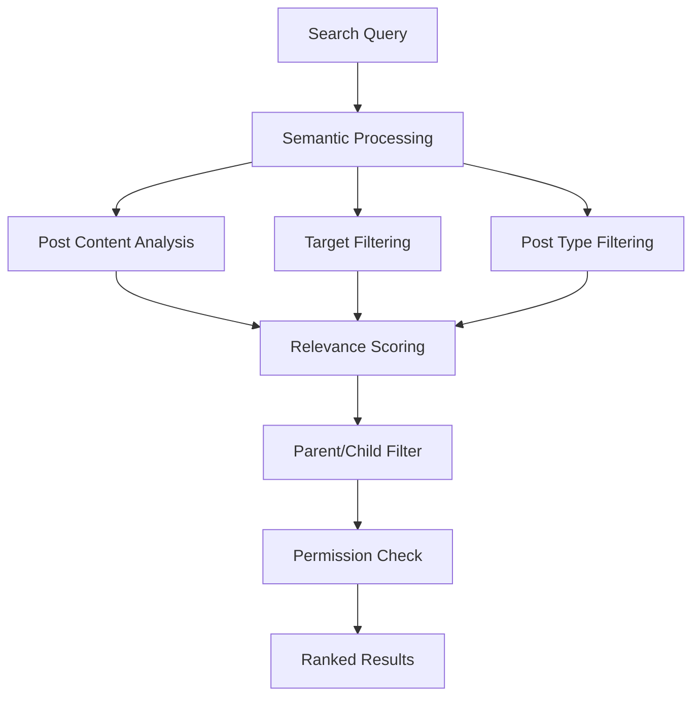

# Intelligent Search - Post

# Intelligent Search - Post

## Overview

Discover relevant posts across your network using advanced semantic search capabilities. The Post Search API understands context and meaning, allowing users to find valuable content even when posts don't contain exact keyword matches.



## Key Features

<CardGroup cols={3}>
  <Card title="Semantic Understanding" icon="brain">
    AI-powered search that comprehends context and meaning beyond exact text matches
  </Card>
  
  <Card title="Advanced Filtering" icon="filter">
    Filter by target type, post type, and parent-child relationships for precise results
  </Card>
  
  <Card title="Permission-Aware" icon="shield">
    Only returns posts from targets where the user has appropriate viewing permissions
  </Card>
</CardGroup>

## Search Filtering Options

### Target Filtering

<AccordionGroup>
  <Accordion title="All Targets (Default)">
    **Behavior**: Searches across all accessible targets (communities and user feeds)
    
    **Use Case**: Comprehensive content discovery across the entire network
    
    **Implementation**: Omit both `targetType` and `targetId` parameters
    
    **Permission Scope**: Only includes targets where user has view permissions
  </Accordion>

  <Accordion title="Specific Target">
    **Behavior**: Limits search to a single specified target
    
    **Use Case**: Finding content within a specific community or user feed
    
    **Implementation**: Provide both `targetType` and `targetId`:
    - `targetType: "community"` + `targetId: "communityId"`
    - `targetType: "user"` + `targetId: "userId"`
    
    **Validation**: Both parameters must be provided together
  </Accordion>
</AccordionGroup>

### Post Type Filtering

<Tabs>
  <Tab title="All Post Types (Default)">
    **Description**: Include all supported post types in search results
    
    **Supported Types**: Currently includes text and image posts
    
    **Best For**:
    - General content discovery
    - Comprehensive search results
    - Mixed content exploration
  </Tab>

  <Tab title="Text Posts Only">
    **Description**: Filter to only include text-based posts
    
    **Implementation**: `postTypes: ["text"]`
    
    **Best For**:
    - Finding discussions and conversations
    - Text-based content discovery
    - Question and answer searches
  </Tab>

  <Tab title="Image Posts Only">
    **Description**: Filter to only include image posts with captions
    
    **Implementation**: `postTypes: ["image"]`
    
    **Best For**:
    - Visual content discovery
    - Photo galleries and showcases
    - Image-based tutorials
  </Tab>

  <Tab title="Mixed Content">
    **Description**: Specify multiple post types
    
    **Implementation**: `postTypes: ["text", "image"]`
    
    **Best For**:
    - Flexible content strategies
    - Comprehensive content audits
    - Multi-format searches
  </Tab>
</Tabs>

### Parent-Child Relationship Filtering

<CardGroup cols={2}>
  <Card title="Include All Posts (Default)" icon="hierarchy">
    **Setting**: `matchingOnlyParentPost: false`
    
    **Results**: Both parent posts and child posts (replies/comments)
    
    **Use Cases**:
    - Complete conversation discovery
    - Finding all related discussions
    - Comprehensive content analysis
  </Card>
  
  <Card title="Parent Posts Only" icon="layers">
    **Setting**: `matchingOnlyParentPost: true`
    
    **Results**: Only top-level parent posts, excludes replies
    
    **Use Cases**:
    - Main topic discovery
    - Original content focus
    - Reduced result noise
  </Card>
</CardGroup>

## Implementation Examples

### Basic Post Search

<Tabs>
  <Tab title="iOS">
    <CodeGroup>
      ```swift Basic Post Search
      import AmitySDK

      class PostSearchManager {
          private let postRepository: AmityPostRepository
          private var searchCollection: AmityCollection<AmityPost>?
          private var searchToken: AmityNotificationToken?
          
          init() {
              self.postRepository = AmityPostRepository(client: AmityManager.shared.client!)
          }
          
          func searchPosts(query: String) {
              // Basic semantic search for posts
              let searchQuery = postRepository.semanticSearchPosts(query: query)
              
              searchToken = searchQuery.observe { [weak self] collection, _, error in
                  if let error = error {
                      self?.handleSearchError(error)
                      return
                  }
                  
                  self?.searchCollection = collection
                  self?.handleSearchResults(posts: collection.allObjects())
              }
          }
          
          private func handleSearchResults(posts: [AmityPost]) {
              print("Found \(posts.count) posts")
              
              for post in posts {
                  print("Post: \(post.data?["text"] as? String ?? "No text")")
                  print("Score: \(post.relevanceScore ?? 0.0)")
                  print("Type: \(post.dataType)")
                  print("Author: \(post.postedUserId ?? "Unknown")")
                  print("---")
              }
          }
          
          private func handleSearchError(_ error: Error) {
              print("Post search error: \(error.localizedDescription)")
          }
          
          deinit {
              searchToken?.invalidate()
          }
      }
      ```

      ```swift Advanced Post Search with Filters
      import AmitySDK

      class AdvancedPostSearchManager {
          private let postRepository: AmityPostRepository
          
          init() {
              self.postRepository = AmityPostRepository(client: AmityManager.shared.client!)
          }
          
          func searchPostsWithFilters(
              query: String,
              targetType: String? = nil,
              targetId: String? = nil,
              postTypes: [String]? = nil,
              parentPostsOnly: Bool = false,
              minScore: Double = 0.3
          ) {
              
              let searchBuilder = AmitySemanticPostSearchBuilder()
                  .query(query)
                  .minScore(minScore)
                  .matchingOnlyParentPost(parentPostsOnly)
              
              // Apply target filter if provided
              if let targetType = targetType, let targetId = targetId {
                  searchBuilder.target(type: targetType, id: targetId)
              }
              
              // Apply post type filter if provided
              if let postTypes = postTypes, !postTypes.isEmpty {
                  searchBuilder.postTypes(postTypes)
              }
              
              let searchQuery = postRepository.semanticSearchPosts(builder: searchBuilder)
              
              searchQuery.observe { [weak self] collection, changes, error in
                  if let error = error {
                      self?.handleSearchError(error)
                      return
                  }
                  
                  self?.processSearchResults(
                      posts: collection.allObjects(),
                      changes: changes
                  )
              }
          }
          
          private func processSearchResults(
              posts: [AmityPost],
              changes: [AmityCollectionChange]
          ) {
              print("Search completed with \(posts.count) results")
              
              // Analyze post types in results
              let textPosts = posts.filter { $0.dataType == "text" }
              let imagePosts = posts.filter { $0.dataType == "image" }
              
              print("Text posts: \(textPosts.count)")
              print("Image posts: \(imagePosts.count)")
              
              // Group by relevance score
              let highRelevance = posts.filter { ($0.relevanceScore ?? 0) >= 0.7 }
              let mediumRelevance = posts.filter { 
                  let score = $0.relevanceScore ?? 0
                  return score >= 0.4 && score < 0.7 
              }
              
              print("High relevance: \(highRelevance.count)")
              print("Medium relevance: \(mediumRelevance.count)")
              
              // Process real-time changes
              for change in changes {
                  switch change {
                  case .insert(let indexPath):
                      print("New post result at position \(indexPath.row)")
                  case .update(let indexPath):
                      print("Updated post result at position \(indexPath.row)")
                  default:
                      break
                  }
              }
          }
          
          private func handleSearchError(_ error: Error) {
              print("Advanced post search error: \(error.localizedDescription)")
          }
      }
      ```
    </CodeGroup>
  </Tab>

  <Tab title="Android">
    <CodeGroup>
      ```kotlin Basic Post Search
      import com.amity.socialcloud.sdk.AmityCoreClient
      import com.amity.socialcloud.sdk.social.post.AmityPostRepository
      import com.amity.socialcloud.sdk.social.post.AmityPost
      import io.reactivex.rxjava3.android.schedulers.AndroidSchedulers
      import io.reactivex.rxjava3.disposables.CompositeDisposable
      import io.reactivex.rxjava3.schedulers.Schedulers

      class PostSearchManager {
          private val postRepository: AmityPostRepository = AmityCoreClient.newPostRepository()
          private val compositeDisposable = CompositeDisposable()
          
          fun searchPosts(query: String) {
              val disposable = postRepository.semanticSearchPosts(query)
                  .build()
                  .query()
                  .subscribeOn(Schedulers.io())
                  .observeOn(AndroidSchedulers.mainThread())
                  .subscribe(
                      { paginatedList ->
                          handleSearchResults(paginatedList.data)
                      },
                      { error ->
                          handleSearchError(error)
                      }
                  )
              
              compositeDisposable.add(disposable)
          }
          
          private fun handleSearchResults(posts: List<AmityPost>) {
              println("Found ${posts.size} posts")
              
              posts.forEach { post ->
                  println("Post: ${post.getData()?.get("text") ?: "No text"}")
                  println("Score: ${post.getRelevanceScore()}")
                  println("Type: ${post.getDataType()}")
                  println("Author: ${post.getPostedUserId()}")
                  println("---")
              }
          }
          
          private fun handleSearchError(error: Throwable) {
              println("Post search error: ${error.message}")
          }
          
          fun dispose() {
              compositeDisposable.dispose()
          }
      }
      ```

      ```kotlin Advanced Post Search with Filters
      import com.amity.socialcloud.sdk.AmityCoreClient
      import com.amity.socialcloud.sdk.social.post.AmityPostRepository
      import com.amity.socialcloud.sdk.social.post.AmityPost
      import io.reactivex.rxjava3.android.schedulers.AndroidSchedulers
      import io.reactivex.rxjava3.disposables.CompositeDisposable
      import io.reactivex.rxjava3.schedulers.Schedulers

      class AdvancedPostSearchManager {
          private val postRepository: AmityPostRepository = AmityCoreClient.newPostRepository()
          private val compositeDisposable = CompositeDisposable()
          
          fun searchPostsWithFilters(
              query: String,
              targetType: String? = null,
              targetId: String? = null,
              postTypes: List<String>? = null,
              parentPostsOnly: Boolean = false,
              minScore: Double = 0.3
          ) {
              
              val searchBuilder = postRepository.semanticSearchPosts(query)
                  .minScore(minScore)
                  .matchingOnlyParentPost(parentPostsOnly)
              
              // Apply target filter if provided
              if (targetType != null && targetId != null) {
                  searchBuilder.target(targetType, targetId)
              }
              
              // Apply post type filter if provided
              postTypes?.takeIf { it.isNotEmpty() }?.let { 
                  searchBuilder.postTypes(it) 
              }
              
              val disposable = searchBuilder
                  .build()
                  .query()
                  .subscribeOn(Schedulers.io())
                  .observeOn(AndroidSchedulers.mainThread())
                  .subscribe(
                      { paginatedList ->
                          processSearchResults(paginatedList.data)
                      },
                      { error ->
                          handleSearchError(error)
                      }
                  )
              
              compositeDisposable.add(disposable)
          }
          
          private fun processSearchResults(posts: List<AmityPost>) {
              println("Search completed with ${posts.size} results")
              
              // Analyze post types in results
              val textPosts = posts.filter { it.getDataType() == "text" }
              val imagePosts = posts.filter { it.getDataType() == "image" }
              
              println("Text posts: ${textPosts.size}")
              println("Image posts: ${imagePosts.size}")
              
              // Group by relevance score
              val highRelevance = posts.filter { (it.getRelevanceScore() ?: 0.0) >= 0.7 }
              val mediumRelevance = posts.filter { 
                  val score = it.getRelevanceScore() ?: 0.0
                  score >= 0.4 && score < 0.7 
              }
              
              println("High relevance: ${highRelevance.size}")
              println("Medium relevance: ${mediumRelevance.size}")
              
              // Display top results
              posts.take(5).forEach { post ->
                  displayPostResult(post)
              }
          }
          
          private fun displayPostResult(post: AmityPost) {
              println("📝 ${post.getData()?.get("text") ?: "Image post"}")
              println("   Score: ${String.format("%.2f", post.getRelevanceScore() ?: 0.0)}")
              println("   Type: ${post.getDataType()}")
              println("   Target: ${post.getTargetType()}")
              println()
          }
          
          fun searchSpecificCommunity(query: String, communityId: String) {
              searchPostsWithFilters(
                  query = query,
                  targetType = "community",
                  targetId = communityId,
                  minScore = 0.5
              )
          }
          
          private fun handleSearchError(error: Throwable) {
              println("Advanced post search error: ${error.message}")
          }
          
          fun dispose() {
              compositeDisposable.dispose()
          }
      }
      ```
    </CodeGroup>
  </Tab>

  <Tab title="TypeScript">
    <CodeGroup>
      ```typescript Basic Post Search
      import { PostRepository, Post } from '@amityco/ts-sdk';

      class PostSearchManager {
          private postRepository: PostRepository;
          private unsubscribe?: () => void;
          
          constructor() {
              this.postRepository = new PostRepository();
          }
          
          async searchPosts(query: string): Promise<void> {
              try {
                  const searchResults = await this.postRepository.semanticSearchPosts({
                      query,
                      limit: 20,
                      minScore: 0.3
                  });
                  
                  this.handleSearchResults(searchResults.data);
                  
                  // Setup real-time updates
                  this.unsubscribe = this.postRepository.observeSearchResults((results) => {
                      this.handleSearchResults(results);
                  });
                  
              } catch (error) {
                  this.handleSearchError(error);
              }
          }
          
          private handleSearchResults(posts: Post[]): void {
              console.log(`Found ${posts.length} posts`);
              
              posts.forEach(post => {
                  console.log(`Post: ${post.data?.text || "No text"}`);
                  console.log(`Score: ${post.relevanceScore}`);
                  console.log(`Type: ${post.dataType}`);
                  console.log(`Author: ${post.postedUserId}`);
                  console.log('---');
              });
          }
          
          private handleSearchError(error: any): void {
              console.error('Post search error:', error.message);
          }
          
          dispose(): void {
              if (this.unsubscribe) {
                  this.unsubscribe();
              }
          }
      }
      ```

      ```typescript Advanced Post Search with Filters
      import { PostRepository, Post } from '@amityco/ts-sdk';

      interface PostSearchOptions {
          query: string;
          targetType?: 'community' | 'user';
          targetId?: string;
          postTypes?: ('text' | 'image')[];
          parentPostsOnly?: boolean;
          minScore?: number;
          limit?: number;
      }

      class AdvancedPostSearchManager {
          private postRepository: PostRepository;
          
          constructor() {
              this.postRepository = new PostRepository();
          }
          
          async searchPostsWithFilters(options: PostSearchOptions): Promise<Post[]> {
              try {
                  // Validate target parameters
                  if ((options.targetType && !options.targetId) || (!options.targetType && options.targetId)) {
                      throw new Error('Both targetType and targetId must be provided together');
                  }
                  
                  const searchParams = {
                      query: options.query,
                      targetType: options.targetType,
                      targetId: options.targetId,
                      postTypes: options.postTypes || [],
                      matchingOnlyParentPost: options.parentPostsOnly || false,
                      minScore: options.minScore || 0.3,
                      limit: options.limit || 20
                  };
                  
                  const searchResults = await this.postRepository.semanticSearchPosts(searchParams);
                  
                  this.processSearchResults(searchResults.data);
                  return searchResults.data;
                  
              } catch (error) {
                  this.handleSearchError(error);
                  throw error;
              }
          }
          
          private processSearchResults(posts: Post[]): void {
              console.log(`Search completed with ${posts.length} results`);
              
              // Analyze post types in results
              const textPosts = posts.filter(p => p.dataType === 'text');
              const imagePosts = posts.filter(p => p.dataType === 'image');
              
              console.log(`Text posts: ${textPosts.length}`);
              console.log(`Image posts: ${imagePosts.length}`);
              
              // Group by relevance score
              const highRelevance = posts.filter(p => (p.relevanceScore || 0) >= 0.7);
              const mediumRelevance = posts.filter(p => {
                  const score = p.relevanceScore || 0;
                  return score >= 0.4 && score < 0.7;
              });
              
              console.log(`High relevance: ${highRelevance.length}`);
              console.log(`Medium relevance: ${mediumRelevance.length}`);
              
              // Display top results
              posts.slice(0, 5).forEach(post => {
                  this.displayPostResult(post);
              });
          }
          
          private displayPostResult(post: Post): void {
              console.log(`📝 ${post.data?.text || "Image post"}`);
              console.log(`   Score: ${(post.relevanceScore || 0).toFixed(2)}`);
              console.log(`   Type: ${post.dataType}`);
              console.log(`   Target: ${post.targetType}`);
              console.log();
          }
          
          async searchTextPostsOnly(query: string, minScore: number = 0.5): Promise<Post[]> {
              return this.searchPostsWithFilters({
                  query,
                  postTypes: ['text'],
                  minScore
              });
          }
          
          async searchInCommunity(query: string, communityId: string): Promise<Post[]> {
              return this.searchPostsWithFilters({
                  query,
                  targetType: 'community',
                  targetId: communityId,
                  minScore: 0.4
              });
          }
          
          private handleSearchError(error: any): void {
              console.error('Advanced post search error:', error.message);
          }
      }
      ```
    </CodeGroup>
  </Tab>

  <Tab title="Flutter">
    <CodeGroup>
      ```dart Basic Post Search
      import 'package:amity_sdk/amity_sdk.dart';
      import 'dart:async';

      class PostSearchManager {
        late AmityPostRepository _postRepository;
        StreamSubscription<AmitySemanticSearchPagingData<AmityPost>>? _searchSubscription;
        
        PostSearchManager() {
          _postRepository = AmitySocialClient.newPostRepository();
        }
        
        void searchPosts(String query) {
          // Basic semantic search for posts
          final searchQuery = _postRepository.semanticSearchPosts(
            query: query,
            minScore: 0.3,
          );
          
          _searchSubscription = searchQuery.getPagingData().listen(
            (pagingData) {
              _handleSearchResults(pagingData.data);
            },
            onError: (error) {
              _handleSearchError(error);
            },
          );
        }
        
        void _handleSearchResults(List<AmityPost> posts) {
          print('Found ${posts.length} posts');
          
          for (final post in posts) {
            print('Post: ${post.data?["text"] ?? "No text"}');
            print('Score: ${post.relevanceScore}');
            print('Type: ${post.dataType}');
            print('Author: ${post.postedUserId}');
            print('---');
          }
        }
        
        void _handleSearchError(dynamic error) {
          print('Post search error: $error');
        }
        
        void dispose() {
          _searchSubscription?.cancel();
        }
      }
      ```

      ```dart Advanced Post Search with Filters
      import 'package:amity_sdk/amity_sdk.dart';
      import 'dart:async';

      class AdvancedPostSearchManager {
        late AmityPostRepository _postRepository;
        StreamSubscription<AmitySemanticSearchPagingData<AmityPost>>? _searchSubscription;
        
        AdvancedPostSearchManager() {
          _postRepository = AmitySocialClient.newPostRepository();
        }
        
        void searchPostsWithFilters({
          required String query,
          String? targetType,
          String? targetId,
          List<String>? postTypes,
          bool parentPostsOnly = false,
          double minScore = 0.3,
        }) {
          
          // Validate target parameters
          if ((targetType != null && targetId == null) || 
              (targetType == null && targetId != null)) {
            throw ArgumentError('Both targetType and targetId must be provided together');
          }
          
          final searchQuery = _postRepository.semanticSearchPosts(
            query: query,
            targetType: targetType,
            targetId: targetId,
            postTypes: postTypes ?? [],
            matchingOnlyParentPost: parentPostsOnly,
            minScore: minScore,
          );
          
          _searchSubscription = searchQuery.getPagingData().listen(
            (pagingData) {
              _processSearchResults(pagingData.data);
            },
            onError: (error) {
              _handleSearchError(error);
            },
          );
        }
        
        void _processSearchResults(List<AmityPost> posts) {
          print('Search completed with ${posts.length} results');
          
          // Analyze post types in results
          final textPosts = posts.where((p) => p.dataType == 'text').toList();
          final imagePosts = posts.where((p) => p.dataType == 'image').toList();
          
          print('Text posts: ${textPosts.length}');
          print('Image posts: ${imagePosts.length}');
          
          // Group by relevance score
          final highRelevance = posts.where((p) => (p.relevanceScore ?? 0) >= 0.7).toList();
          final mediumRelevance = posts.where((p) {
            final score = p.relevanceScore ?? 0;
            return score >= 0.4 && score < 0.7;
          }).toList();
          
          print('High relevance: ${highRelevance.length}');
          print('Medium relevance: ${mediumRelevance.length}');
          
          // Display top results
          posts.take(5).forEach((post) {
            _displayPostResult(post);
          });
        }
        
        void _displayPostResult(AmityPost post) {
          print('📝 ${post.data?["text"] ?? "Image post"}');
          print('   Score: ${(post.relevanceScore ?? 0).toStringAsFixed(2)}');
          print('   Type: ${post.dataType}');
          print('   Target: ${post.targetType}');
          print('');
        }
        
        Future<List<AmityPost>> searchTextPostsOnly(String query, {double minScore = 0.5}) async {
          final completer = Completer<List<AmityPost>>();
          
          final searchQuery = _postRepository.semanticSearchPosts(
            query: query,
            postTypes: ['text'],
            minScore: minScore,
          );
          
          final subscription = searchQuery.getPagingData().listen(
            (pagingData) {
              completer.complete(pagingData.data);
            },
            onError: (error) {
              completer.completeError(error);
            },
          );
          
          final result = await completer.future;
          subscription.cancel();
          return result;
        }
        
        Future<List<AmityPost>> searchInCommunity(String query, String communityId) async {
          final completer = Completer<List<AmityPost>>();
          
          final searchQuery = _postRepository.semanticSearchPosts(
            query: query,
            targetType: 'community',
            targetId: communityId,
            minScore: 0.4,
          );
          
          final subscription = searchQuery.getPagingData().listen(
            (pagingData) {
              completer.complete(pagingData.data);
            },
            onError: (error) {
              completer.completeError(error);
            },
          );
          
          final result = await completer.future;
          subscription.cancel();
          return result;
        }
        
        void _handleSearchError(dynamic error) {
          print('Advanced post search error: $error');
        }
        
        void dispose() {
          _searchSubscription?.cancel();
        }
      }
      ```
    </CodeGroup>
  </Tab>
</Tabs>

### Limitations

* Currently, the search only supports text and image posts; other post types are not included.
* The search function only considers the context of individual posts. It does not consider the relationship between parent posts, their replies, or comments.