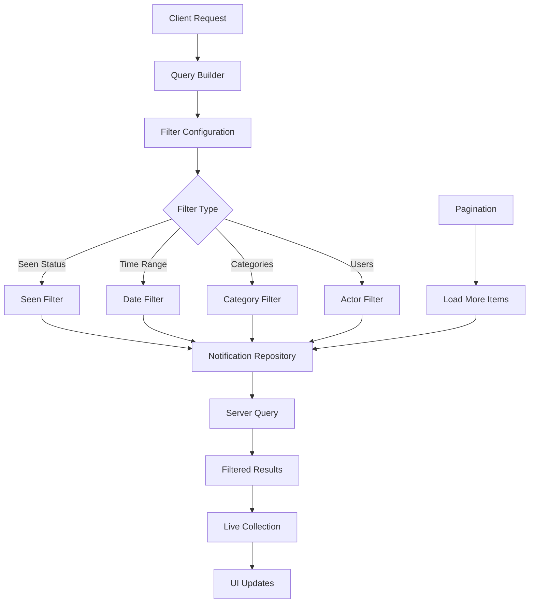

import NotificationTrayItemsQuery from '/snippets/social-plus-sdk/social/notification-tray-items-query.mdx';
import MarkNotificationItemSeen from '/snippets/social-plus-sdk/social/mark-notification-item-seen.mdx';
import NotificationTraySeenGet from '/snippets/social-plus-sdk/social/notification-tray-seen-get.mdx';
import MarkNotificationTraySeen from '/snippets/social-plus-sdk/social/mark-notification-tray-seen.mdx';

# Query Notification Tray Item

<CardGroup cols={2}>
  <Card title="Flexible Filtering" icon="filter">
    Query notifications with advanced filtering options for targeted retrieval
  </Card>
  <Card title="Pagination Support" icon="list">
    Efficiently handle large notification sets with built-in pagination
  </Card>
  <Card title="Real-time Updates" icon="arrows-rotate">
    Live collection updates for dynamic notification experiences
  </Card>
  <Card title="Multi-platform SDK" icon="mobile-screen">
    Consistent querying across iOS, Android, and Web platforms
  </Card>
</CardGroup>

## Overview

The **Query Notification Tray Item** feature allows you to retrieve and filter notification tray items with powerful querying capabilities. This functionality is essential for building dynamic notification interfaces that can display relevant notifications based on user preferences, seen status, and notification types.

Each notification tray item represents a specific event in your social network, with properties like `eventType`, `actionType`, and `templatedText` that define what triggered the notification and how it should be displayed to users.

<Note>
  For a complete reference of all event types, triggers, and message templates, see the [Event Types & Message Templates](#event-types--message-templates) section below.
</Note>

## Architecture Overview



## Key Features

<AccordionGroup>
  <Accordion title="Advanced Filtering Options">
    <CardGroup cols={2}>
      <Card title="Seen Status Filtering" icon="eye">
        Filter notifications based on whether they have been seen or remain unread
      </Card>
      <Card title="Category-based Filtering" icon="tags">
        Query specific notification types such as posts, reactions, comments, or replies
      </Card>
      <Card title="Time-based Filtering" icon="clock">
        Retrieve notifications within specific date ranges or time periods
      </Card>
      <Card title="Actor-based Filtering" icon="users">
        Filter notifications by specific users or user groups
      </Card>
    </CardGroup>
  </Accordion>
  <Accordion title="Live Collection Features">
    - **Real-time Updates**: Automatic UI refresh when new notifications arrive
    - **Efficient Pagination**: Built-in support for loading additional items
    - **Smart Caching**: Optimized data retrieval and local storage
    - **State Management**: Automatic handling of loading and error states
  </Accordion>
  <Accordion title="Performance Optimizations">
    - **Lazy Loading**: Load notifications on-demand to improve performance
    - **Batch Operations**: Efficient handling of multiple notification updates
    - **Memory Management**: Automatic cleanup of unused notification data
    - **Network Optimization**: Minimal API calls with intelligent caching
  </Accordion>
</AccordionGroup>

## Query Configuration

<Tabs>
  <Tab title="Query Builder">
    <AccordionGroup>
      <Accordion title="Basic Query Options">
        **Required Parameters:**

        - `limit`: Maximum number of items to retrieve per page (default: 20, max: 100)

        **Optional Parameters:**

        - `includeDeleted`: Include soft-deleted notifications (default: false)
        - `sortBy`: Sort order - `lastOccurredAt` or `createdAt` (default: `lastOccurredAt`)
        - `sortDirection`: `asc` or `desc` (default: `desc`)
      </Accordion>
      <Accordion title="Filter Parameters">
        **Seen Status Filter:**

        - `seenStatus`: `seen`, `unseen`, or `all` (default: `all`)

        **Category Filter:**

        - `categories`: Array of notification categories to include
        - Available categories: `post`, `poll`, `reaction`, `comment`, `reply`, `mention`, `follow`

        **Time Range Filter:**

        - `startDate`: Filter notifications after this timestamp
        - `endDate`: Filter notifications before this timestamp

        **Actor Filter:**

        - `actorIds`: Array of user IDs to filter notifications by
      </Accordion>
      <Accordion title="Advanced Options">
        **Performance Settings:**

        - `enableRealTimeUpdates`: Enable live collection updates (default: true)
        - `cacheTimeout`: Cache expiration time in seconds (default: 300)

        **UI Configuration:**

        - `loadingBehavior`: `immediate` or `lazy` (default: `immediate`)
        - `errorRetryCount`: Number of retry attempts on failure (default: 3)
      </Accordion>
    </AccordionGroup>
  </Tab>
  <Tab title="Usage Examples">
    <MarkNotificationTraySeen />
  </Tab>
</Tabs>

## Pagination Implementation

<Tabs>
  <Tab title="Load More Pattern">
    <NotificationTraySeenGet />
  </Tab>
  <Tab title="React Hook Implementation">
    <MarkNotificationItemSeen />
  </Tab>
</Tabs>

## Best Practices

<AccordionGroup>
  <Accordion title="Query Optimization">
    ### Efficient Querying Strategies

    <CardGroup cols={2}>
      <Card title="Reasonable Page Sizes" icon="list">
        Use page sizes between 20-50 items to balance performance and user experience
      </Card>
      <Card title="Targeted Filtering" icon="filter">
        Apply specific filters to reduce data transfer and improve response times
      </Card>
      <Card title="Smart Caching" icon="database">
        Leverage built-in caching mechanisms to minimize unnecessary network requests
      </Card>
      <Card title="Progressive Loading" icon="spinner">
        Implement progressive loading for better perceived performance
      </Card>
    </CardGroup>
    ### Performance Guidelines

    ```typescript
    // ✅ Good: Reasonable page size with specific filtering
    const optimizedQuery = {
        limit: 25,
        seenStatus: 'unseen',
        categories: ['post', 'reaction'],
        startDate: new Date(Date.now() - 86400000) // Last 24 hours
    };
    
    // ❌ Avoid: Too large page size without filtering
    const inefficientQuery = {
        limit: 200, // Too large
        seenStatus: 'all', // Too broad
        // No time filtering - queries all historical data
    };
    ```
  </Accordion>
  <Accordion title="Error Handling Strategies">
    ### Robust Error Management

    <CardGroup cols={2}>
      <Card title="Network Failures" icon="wifi-slash">
        Implement retry logic with exponential backoff for network-related errors
      </Card>
      <Card title="Rate Limiting" icon="clock">
        Handle rate limiting gracefully with appropriate user feedback
      </Card>
      <Card title="Data Validation" icon="shield-check">
        Validate query parameters before sending requests
      </Card>
      <Card title="Graceful Degradation" icon="triangle-exclamation">
        Provide fallback experiences when queries fail
      </Card>
    </CardGroup>
    ### Implementation Pattern

    <NotificationTrayItemsQuery />
  </Accordion>
  <Accordion title="Memory Management">
    ### Lifecycle Best Practices

    - **Proper Disposal**: Always dispose live collections when views are destroyed
    - **Weak References**: Use weak references to prevent retain cycles
    - **Background Processing**: Handle collection updates on appropriate threads
    - **Resource Cleanup**: Clean up observers and subscriptions appropriately

    ### Implementation Examples

    <CodeGroup>

    ```swift iOS Memory Management
    class NotificationViewController: UIViewController {
        private var liveCollection: AmityCollection<AmityNotificationTrayItem>?
        private var collectionToken: AmityNotificationToken?
        
        deinit {
            // Clean up resources
            collectionToken?.invalidate()
            liveCollection = nil
        }
        
        override func viewDidDisappear(_ animated: Bool) {
            super.viewDidDisappear(animated)
            
            // Pause updates when view is not visible
            if isMovingFromParent {
                collectionToken?.invalidate()
            }
        }
    }
    ```

    
    ```kotlin Android Memory Management
    class NotificationFragment : Fragment() {
        private var liveCollection: AmityCollection<AmityNotificationTrayItem>? = null
        private var disposable: Disposable? = null
        
        override fun onDestroyView() {
            super.onDestroyView()
            
            // Clean up resources
            disposable?.dispose()
            liveCollection = null
        }
        
        override fun onPause() {
            super.onPause()
            
            // Pause updates when fragment is not visible
            disposable?.dispose()
        }
    }
    ```

    </CodeGroup>
  </Accordion>
</AccordionGroup>

## Use Cases

<CardGroup cols={2}>
  <Card title="Notification Feed" icon="list">
    Display a chronological list of all user notifications with filtering options

    **Implementation:**

    - Use basic query with time-based sorting
    - Enable real-time updates for live experience
    - Implement pagination for performance
  </Card>
  <Card title="Unread Badge Counter" icon="bell-exclamation">
    Show count of unseen notifications for UI badge indicators

    **Implementation:**

    - Query with `seenStatus: 'unseen'`
    - Use count from collection metadata
    - Refresh on app foreground/resume
  </Card>
  <Card title="Category-specific Views" icon="tags">
    Create separate views for different notification types

    **Implementation:**

    - Filter by specific categories
    - Create dedicated UI for each type
    - Optimize queries for targeted content
  </Card>
  <Card title="User Activity Timeline" icon="timeline">
    Show notifications from specific users or user groups

    **Implementation:**

    - Use actor-based filtering
    - Combine with time range filters
    - Enable cross-referencing with user profiles
  </Card>
</CardGroup>

## Event Types

This section provides a comprehensive reference of all supported notification event types, their triggers, and the message templates displayed in the notification tray.

<Note>
  Understanding these event types and message templates is essential for properly rendering and handling notifications in your application. Each event has specific conditions that trigger it and corresponding message formats.
</Note>

### Complete Event Reference Table

<Tabs>
  <Tab title="Content Creation Events">
    | Event Type                    | Trigger Condition                                                                                                      | Message Template                                                                                                                                                                                                                                                                                                                                                                                 |
    | ----------------------------- | ---------------------------------------------------------------------------------------------------------------------- | ------------------------------------------------------------------------------------------------------------------------------------------------------------------------------------------------------------------------------------------------------------------------------------------------------------------------------------------------------------------------------------------------ |
    | **Post** (Text, Image, Video) | Bob & Alice are members of the same community<br />Bob creates a post in that community<br />→ Alice sees notification | **Single notification:**<br />`Bob posted in {{communityDisplayName}}`<br /><br />**Grouped (2 actors):**<br />`{{displayName_1}} and {{displayName_2}} posted in {{communityDisplayName}}`<br /><br />**Grouped (3+ actors):**<br />`{{displayName_1}} and {{number}} others posted in {{communityDisplayName}}`<br /><br />_Note: Posts in the same community within the same day are grouped_ |
    | **Poll**                      | Bob & Alice are members of the same community<br />Bob starts a poll in that community<br />→ Alice sees notification  | `Bob started a poll in {{communityDisplayName}}`                                                                                                                                                                                                                                                                                                                                                 |
    | **Comment**                   | Bob comments on Alice's post<br />→ Alice sees notification                                                            | **Community Post:**<br />`Bob commented on your post in {{communityDisplayName}}`<br /><br />**Alice's User Feed:**<br />`Bob commented on your post on your feed`<br /><br />**Another User's Feed:**<br />`Bob commented on your post on {{targetUserDisplayName}} feed`                                                                                                                       |
    | **Reply**                     | Bob replies to Alice's comment<br />→ Alice sees notification                                                          | **Community Comment:**<br />`Bob replied to your comment in {{communityDisplayName}}`<br /><br />**Alice's Feed:**<br />`Bob replied to your comment on your feed`<br /><br />**Bob's Feed:**<br />`Bob replied to your comment on their feed`<br /><br />**Charlie's Feed:**<br />`Bob replied to your comment on Charlie feed`                                                                 |
  </Tab>
  <Tab title="Engagement Events">
    | Event Type   | Trigger Condition                                                                         | Message Template                                                                                                                                                                                                                                                                                                                                                                                                                                                                                                                                                                                                                                                                                                                                                |
    | ------------ | ----------------------------------------------------------------------------------------- | --------------------------------------------------------------------------------------------------------------------------------------------------------------------------------------------------------------------------------------------------------------------------------------------------------------------------------------------------------------------------------------------------------------------------------------------------------------------------------------------------------------------------------------------------------------------------------------------------------------------------------------------------------------------------------------------------------------------------------------------------------------- |
    | **Reaction** | Any user reacts to Alice's post, poll, comment, or reply<br />→ Alice sees notification   | **Community Content (Single):**<br />`{{displayName}} reacted to your {{target}} in {{communityDisplayName}}`<br />_where target = post, poll, comment, or reply_<br /><br />**Community Content (2 actors):**<br />`{{displayName_1}} and {{displayName_2}} reacted to your {{target}} in {{communityDisplayName}}`<br /><br />**Community Content (3+ actors):**<br />`{{displayName_1}} and {{number}} others reacted to your {{target}} in {{communityDisplayName}}`<br /><br />**User Feed Variations:**<br />• Alice's feed: `Bob reacted to your post on your feed`<br />• Bob's feed: `Bob reacted to your post on their feed`<br />• Charlie's feed: `Bob reacted to your post on Charlie's feed`                                                      |
    | **Mention**  | Any user mentions Alice in a post, poll, comment, or reply<br />→ Alice sees notification | **Post Mention in Community:**<br />`{{displayName}} mentioned you in a post in {{communityDisplayName}}`<br /><br />**Poll Mention in Community:**<br />`{{displayName}} mentioned you in a poll in {{communityDisplayName}}`<br /><br />**Comment Mention in Community:**<br />`{{displayName}} mentioned you in a comment in {{communityDisplayName}}`<br /><br />**Reply Mention in Community:**<br />`{{displayName}} mentioned you in a reply in {{communityDisplayName}}`<br /><br />**User Feed Variations:**<br />• Bob's feed: `Bob mentioned you in a {{post/comment}} on their feed`<br />• Alice's feed: `Bob mentioned you in a {{post/comment}} on your feed`<br />• Charlie's feed: `Bob mentioned you in a {{post/comment}} on Charlie's feed` |
    | **Follow**   | Bob follows Alice<br />→ Alice sees notification                                          | `{{displayName}} started following you`<br /><br />**Example:**<br />`Bob started following you`<br /><br />_Note: This notification is only triggered when follow requests are disabled in the network settings_                                                                                                                                                                                                                                                                                                                                                                                                                                                                                                                                               |
  </Tab>
  <Tab title="Detailed Event Breakdown">
    ### Post Events

    **Single Notification:**

    - **Condition**: One user posts in a community
    - **Message**: `Bob posted in {{communityDisplayName}}`
    - **Example**: "Bob posted in Tech Community"

    **Grouped Notifications:**

    - **Condition**: Multiple users post in the same community within the same day
    - **2 actors**: `{{displayName_1}} and {{displayName_2}} posted in {{communityDisplayName}}`
    - **3+ actors**: `{{displayName_1}} and {{number}} others posted in {{communityDisplayName}}`
    - **Example**: "Bob and 2 others posted in Tech Community"

    ---

    ### Poll Events

    - **Condition**: User starts a poll in a community
    - **Message**: `Bob started a poll in {{communityDisplayName}}`
    - **Example**: "Bob started a poll in Tech Community"

    ---

    ### Comment Events

    **Community Post:**

    - **Message**: `Bob commented on your post in {{communityDisplayName}}`
    - **Example**: "Bob commented on your post in Tech Community"

    **User Feed (Own):**

    - **Message**: `Bob commented on your post on your feed`
    - **Example**: "Bob commented on your post on your feed"

    **User Feed (Another User's):**

    - **Message**: `Bob commented on your post on {{targetUserDisplayName}} feed`
    - **Example**: "Bob commented on your post on Charlie's feed"

    ---

    ### Reply Events

    **Community Comment:**

    - **Message**: `Bob replied to your comment in {{communityDisplayName}}`

    **Own Feed:**

    - **Message**: `Bob replied to your comment on your feed`

    **Their Feed:**

    - **Message**: `Bob replied to your comment on their feed`

    **Another User's Feed:**

    - **Message**: `Bob replied to your comment on {{targetUserDisplayName}} feed`

    ---

    ### Reaction Events

    **Target Types**: post, poll, comment, reply

    **Community Content (Single):**

    - **Message**: `{{displayName}} reacted to your {{target}} in {{communityDisplayName}}`
    - **Example**: "Bob reacted to your post in Tech Community"

    **Community Content (Grouped - 2 actors):**

    - **Message**: `{{displayName_1}} and {{displayName_2}} reacted to your {{target}} in {{communityDisplayName}}`
    - **Example**: "Bob and Alice reacted to your comment in Tech Community"

    **Community Content (Grouped - 3+ actors):**

    - **Message**: `{{displayName_1}} and {{number}} others reacted to your {{target}} in {{communityDisplayName}}`
    - **Example**: "Bob and 5 others reacted to your post in Tech Community"

    **User Feed Variations:**

    - **Own Feed**: `Bob reacted to your post on your feed`
    - **Their Feed**: `Bob reacted to your post on their feed`
    - **Another User's Feed**: `Bob reacted to your post on {{targetUserDisplayName}} feed`

    ---

    ### Mention Events

    **Post Mentions:**

    - **Community**: `{{displayName}} mentioned you in a post in {{communityDisplayName}}`
    - **Own Feed**: `Bob mentioned you in a post on your feed`
    - **Their Feed**: `Bob mentioned you in a post on their feed`
    - **Another User's Feed**: `Bob mentioned you in a post on {{targetUserDisplayName}} feed`

    **Poll Mentions:**

    - **Community**: `{{displayName}} mentioned you in a poll in {{communityDisplayName}}`
    - _(Similar user feed variations as post mentions)_

    **Comment Mentions:**

    - **Community**: `{{displayName}} mentioned you in a comment in {{communityDisplayName}}`
    - _(Similar user feed variations as post mentions)_

    **Reply Mentions:**

    - **Community**: `{{displayName}} mentioned you in a reply in {{communityDisplayName}}`
    - _(Similar user feed variations as post mentions)_

    ---

    ### Follow Events

    **Condition**: User starts following another user (when follow requests are disabled)

    **Message Template:**

    - `{{displayName}} started following you`
    - **Example**: "Bob started following you"

    **Important Notes:**

    - This notification is only triggered when the network has follow requests **disabled** (`socialSetting.isFollowWithRequestEnabled = false`)
    - If follow requests are enabled, users will not receive this notification type
    - The notification is sent to the user being followed
    - No grouping is applied to follow events
  </Tab>
</Tabs>

## Error Handling

<AccordionGroup>
  <Accordion title="Common Error Scenarios">
    **Network Connectivity Issues:**

    - **Error**: Connection timeout or network unavailable
    - **Response**: Show offline indicator and retry options
    - **Recovery**: Implement exponential backoff retry strategy

    **Invalid Query Parameters:**

    - **Error**: Malformed query or invalid filter values
    - **Response**: Log validation errors and use fallback query
    - **Recovery**: Validate parameters before query execution

    **Rate Limiting:**

    - **Error**: Too many requests in short time period
    - **Response**: Display rate limit message to user
    - **Recovery**: Implement request throttling and queue management

    **Server Errors:**

    - **Error**: Internal server errors or maintenance
    - **Response**: Show maintenance message with status updates
    - **Recovery**: Implement graceful degradation and status checking
  </Accordion>
  <Accordion title="Error Recovery Patterns">
    <CodeGroup>

    ```swift iOS Error Recovery
    class NotificationQueryService {
        private let maxRetryAttempts = 3
        private var retryCount = 0
        
        func executeQueryWithRetry(query: AmityNotificationTrayQuery, completion: @escaping (Result<AmityCollection<AmityNotificationTrayItem>, Error>) -> Void) {
            
            let executeQuery = { [weak self] in
                self?.repository.getNotificationTrayItems(query: query) { result in
                    switch result {
                    case .success(let collection):
                        self?.retryCount = 0 // Reset on success
                        completion(.success(collection))
                    case .failure(let error):
                        self?.handleQueryFailure(error, query: query, completion: completion)
                    }
                }
            }
            
            executeQuery()
        }
        
        private func handleQueryFailure(_ error: Error, query: AmityNotificationTrayQuery, completion: @escaping (Result<AmityCollection<AmityNotificationTrayItem>, Error>) -> Void) {
            
            retryCount += 1
            
            if retryCount <= maxRetryAttempts && shouldRetry(error) {
                let delay = pow(2.0, Double(retryCount)) // Exponential backoff
                
                DispatchQueue.main.asyncAfter(deadline: .now() + delay) { [weak self] in
                    self?.executeQueryWithRetry(query: query, completion: completion)
                }
            } else {
                retryCount = 0
                completion(.failure(error))
            }
        }
        
        private func shouldRetry(_ error: Error) -> Bool {
            // Determine if error is retryable
            if case AmityError.networkError = error {
                return true
            }
            return false
        }
    }
    ```

    </CodeGroup>
  </Accordion>
</AccordionGroup>

## Related Topics

<CardGroup cols={3}>
  <Card title="Mark Item as Seen" icon="check" href="./mark-notification-tray-item-seen">
    Update seen status for individual notification items
  </Card>
  <Card title="Global Tray Status" icon="bell" href="./get-notification-tray-seen">
    Manage overall notification tray seen state
  </Card>
  <Card title="Mark Tray as Seen" icon="eye" href="./mark-notification-tray-seen">
    Update global tray seen timestamp
  </Card>
</CardGroup>