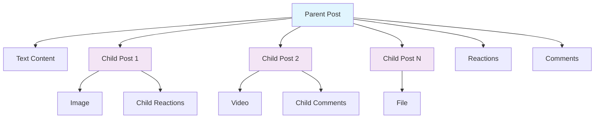

Create engaging social content with support for text, images, videos, files, polls, and live streams. Posts form the foundation of social interaction, enabling users to share experiences and connect with communities.

## Overview

Posts are the primary content type in social.plus SDK, supporting rich media and interactive features:

- **Rich Content Types**: Text, images, videos, files, live streams, polls, and custom posts
- **Parent-Child Structure**: Multi-media posts with nested relationships
- **Real-time Updates**: Live collections and event-driven updates
- **Interactive Features**: Reactions, comments, mentions, and sharing
- **Advanced Capabilities**: Flagging, moderation, impressions, and analytics

<CardGroup cols={2}>
  <Card title="Create Posts" icon="plus" href="/social-plus-sdk/social/posts/create-post/README">
    Learn how to create different types of posts with rich media support
  </Card>
  <Card title="Manage Posts" icon="cog" href="/social-plus-sdk/social/posts/edit-post">
    Edit, delete, and moderate posts with proper permissions
  </Card>
  <Card title="Query Posts" icon="search" href="/social-plus-sdk/social/posts/query-post">
    Search and filter posts with advanced querying capabilities
  </Card>
  <Card title="Post Analytics" icon="chart-line" href="/social-plus-sdk/social/posts/post-impression">
    Track engagement and performance metrics for posts
  </Card>
</CardGroup>

## Architecture

Posts use a hierarchical parent-child structure for complex content:



### Post Structure Benefits

- **Granular Interactions**: Users can react to individual media items
- **Flexible Content**: Mix text with multiple media types
- **Optimized Loading**: Load media progressively as needed
- **Enhanced Analytics**: Track engagement per content piece

## Quick Start

### Post Repository

Access post functionality through the repository pattern:

<Tabs>
  <Tab title="iOS">
    ```swift
    import AmitySDK

    class PostManager {
        private let postRepository: AmityPostRepository
        
        init(client: AmityClient) {
            self.postRepository = AmityPostRepository(client: client)
        }
        
        func createTextPost(text: String, targetId: String?, targetType: AmityPostTargetType) {
            let builder = AmityPostBuilder()
                .setText(text)
                .setTargetId(targetId)
                .setTargetType(targetType)
            
            postRepository.createPost(builder) { result in
                switch result {
                case .success(let post):
                    print("Post created: \(post.postId)")
                case .failure(let error):
                    print("Failed to create post: \(error)")
                }
            }
        }
    }
    ```
  </Tab>
  
  <Tab title="Android">
    ```kotlin
    import com.amity.socialcloud.sdk.api.social.AmitySocialClient
    import com.amity.socialcloud.sdk.model.social.post.AmityPost

    class PostManager(private val client: AmitySocialClient) {
        
        fun createTextPost(text: String, targetId: String?, targetType: AmityPostTargetType) {
            val builder = AmityPostBuilder()
                .setText(text)
                .setTargetId(targetId)
                .setTargetType(targetType)
            
            client.post()
                .createPost(builder)
                .subscribe({ post ->
                    println("Post created: ${post.postId}")
                }, { error ->
                    println("Failed to create post: ${error.message}")
                })
        }
    }
    ```
  </Tab>
  
  <Tab title="TypeScript">
    ```typescript
    import { PostRepository, PostTargetType } from '@amityco/js-sdk';

    class PostManager {
        private postRepository: PostRepository;
        
        constructor() {
            this.postRepository = new PostRepository();
        }
        
        async createTextPost(text: string, targetId?: string, targetType?: PostTargetType) {
            try {
                const post = await this.postRepository.createPost({
                    targetId,
                    targetType: targetType || 'user',
                    dataType: 'text',
                    data: { text }
                });
                
                console.log('Post created:', post.postId);
                return post;
            } catch (error) {
                console.error('Failed to create post:', error);
                throw error;
            }
        }
    }
    ```
  </Tab>
  
  <Tab title="Flutter">
    ```dart
    import 'package:amity_sdk/amity_sdk.dart';

    class PostManager {
        final AmitySocialClient _socialClient;
        
        PostManager(this._socialClient);
        
        Future<AmityPost> createTextPost(
            String text, 
            String? targetId, 
            AmityPostTargetType targetType
        ) async {
            try {
                final builder = AmityPostBuilder()
                    ..setText(text)
                    ..setTargetId(targetId)
                    ..setTargetType(targetType);
                
                final post = await _socialClient
                    .newPostRepository()
                    .createPost(builder);
                
                print('Post created: ${post.postId}');
                return post;
            } catch (error) {
                print('Failed to create post: $error');
                rethrow;
            }
        }
    }
    ```
  </Tab>
</Tabs>

## Post Properties

Core properties available on all post objects:

| Property | Type | Description |
|----------|------|-------------|
| `postId` | String | Unique identifier for the post |
| `parentPostId` | String? | ID of parent post (null for parent posts) |
| `postedUserId` | String | ID of the user who created the post |
| `sharedUserId` | String? | ID of user who shared the post |
| `sharedCount` | Integer | Number of times the post has been shared |
| `targetId` | String? | ID of the target (user or community) |
| `targetType` | String | Type of target (`user` or `community`) |
| `dataType` | String | Type of post content (`text`, `image`, `video`, etc.) |
| `data` | Object | Post content data |
| `metadata` | Object? | Additional metadata for the post |
| `flagCount` | Integer | Number of times the post has been flagged |
| `editedAt` | Date? | When the post was last edited |
| `createdAt` | Date | When the post was created |
| `updatedAt` | Date | When the post was last updated |
| `reactions` | Object | Reaction counts by type |
| `reactionsCount` | Integer | Total number of reactions |
| `myReactions` | Array\<String\> | Current user's reactions |
| `commentsCount` | Integer | Total number of comments |
| `comments` | Array\<Comment\> | Preview of first few comments |
| `childrenPosts` | Object | Child posts for multi-media content |
| `isDeleted` | Boolean | Whether the post has been deleted |
| `hasFlaggedComment` | Boolean | Whether post has flagged comments |
| `hasFlaggedChildren` | Boolean | Whether post has flagged child posts |
| `tags` | Array\<String\> | Tags for categorization and filtering |
| `feedId` | String | ID of the feed containing this post |

## Post Targets

Posts can be created on different targets:

### User Posts
- **My Feed**: Leave `targetId` empty to post on your own feed
- **User Feed**: Provide `targetId` and set `targetType` to `user`

### Community Posts  
- **Community Feed**: Provide community ID as `targetId` and set `targetType` to `community`

## Content Limits

| Limit Type | Value | Description |
|------------|-------|-------------|
| Text Length | 20,000 characters | Maximum text per post |
| Custom Data | 100KB | Maximum JSON data size |
| Media Files | Platform dependent | Based on file upload limits |
| Child Posts | No fixed limit | Depends on content type |

## Best Practices

<AccordionGroup>
  <Accordion title="Content Strategy">
    - Use appropriate post types for different content
    - Leverage parent-child structure for multi-media posts
    - Include relevant tags for discoverability
    - Consider target audience when posting
  </Accordion>
  
  <Accordion title="Performance">
    - Use live collections for real-time updates
    - Implement pagination for post feeds
    - Cache frequently accessed posts
    - Optimize media loading with progressive techniques
  </Accordion>
  
  <Accordion title="User Experience">
    - Provide clear feedback for post creation
    - Handle offline scenarios gracefully
    - Implement proper error handling
    - Show loading states during operations
  </Accordion>
</AccordionGroup>

## Common Use Cases

- **Social Feeds**: Display chronological posts from users and communities
- **Content Sharing**: Allow users to share rich media content
- **Community Engagement**: Foster discussions through posts and comments
- **Event Broadcasting**: Share live streams and real-time updates
- **Polls & Surveys**: Gather user opinions and feedback
- **File Sharing**: Distribute documents and media files