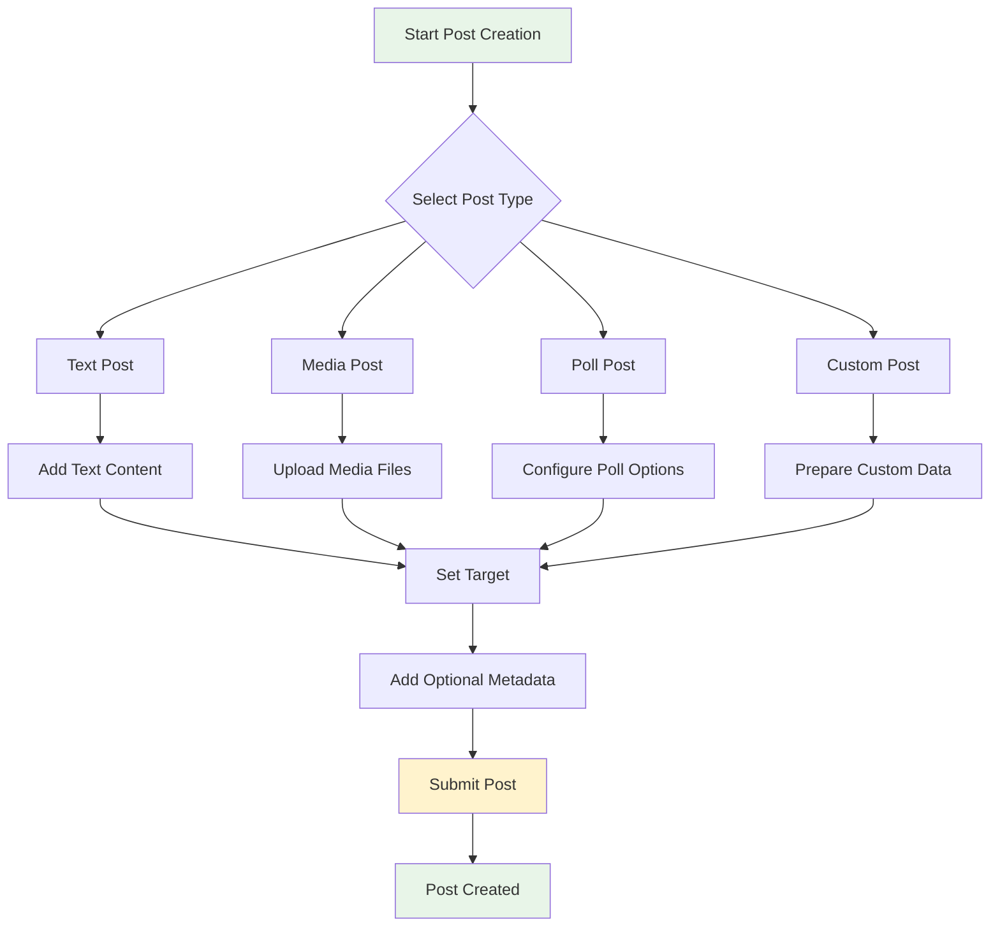

Create rich, interactive posts that engage your users with various content types. Support for multimedia, polls, live streams, and custom post formats enables diverse content creation.

## Post Types Overview

social.plus SDK supports comprehensive post creation with these content types:

<CardGroup cols={2}>
  <Card title="Text Posts" icon="type" href="/social-plus-sdk/social/posts/create-post/text-post">
    Create simple text posts with mentions and hashtags
  </Card>
  <Card title="Image Posts" icon="image" href="/social-plus-sdk/social/posts/create-post/image-post">
    Share single or multiple images with captions
  </Card>
  <Card title="Video Posts" icon="video" href="/social-plus-sdk/social/posts/create-post/video-post">
    Upload and share video content with thumbnails
  </Card>
  <Card title="File Posts" icon="file" href="/social-plus-sdk/social/posts/create-post/file-post">
    Share documents and other file types
  </Card>
  <Card title="Poll Posts" icon="poll" href="/social-plus-sdk/social/posts/create-post/poll-post">
    Create interactive polls and surveys
  </Card>
  <Card title="Live Stream Posts" icon="broadcast-tower" href="/social-plus-sdk/social/posts/create-post/live-stream-post">
    Broadcast live video streams to your audience
  </Card>
  <Card title="Custom Posts" icon="code" href="/social-plus-sdk/social/posts/create-post/custom-post">
    Build custom post types with structured data
  </Card>
</CardGroup>

## Target Types

Every post must specify where it will be published:

### User Targets
- **My Feed**: Leave `targetId` empty to post on your own feed
- **User Feed**: Set `targetId` to user ID and `targetType` to `"user"`

### Community Targets
- **Community Feed**: Set `targetId` to community ID and `targetType` to `"community"`

<Tabs>
  <Tab title="iOS">
    ```swift
    // Post to my feed
    let builder = AmityPostBuilder()
        .setText("Hello world!")
        .setTargetType(.user)
        // targetId is nil for my feed
    
    // Post to another user's feed
    let userBuilder = AmityPostBuilder()
        .setText("Hello!")
        .setTargetType(.user)
        .setTargetId("user_123")
    
    // Post to community
    let communityBuilder = AmityPostBuilder()
        .setText("Welcome to our community!")
        .setTargetType(.community)
        .setTargetId("community_456")
    ```
  </Tab>
  
  <Tab title="Android">
    ```kotlin
    // Post to my feed
    val builder = AmityPostBuilder()
        .setText("Hello world!")
        .setTargetType(AmityPostTargetType.USER)
        // targetId is null for my feed
    
    // Post to another user's feed
    val userBuilder = AmityPostBuilder()
        .setText("Hello!")
        .setTargetType(AmityPostTargetType.USER)
        .setTargetId("user_123")
    
    // Post to community
    val communityBuilder = AmityPostBuilder()
        .setText("Welcome to our community!")
        .setTargetType(AmityPostTargetType.COMMUNITY)
        .setTargetId("community_456")
    ```
  </Tab>
  
  <Tab title="TypeScript">
    ```typescript
    // Post to my feed
    const myFeedPost = await postRepository.createPost({
        dataType: 'text',
        targetType: 'user',
        // targetId is undefined for my feed
        data: { text: 'Hello world!' }
    });
    
    // Post to another user's feed
    const userPost = await postRepository.createPost({
        dataType: 'text',
        targetType: 'user',
        targetId: 'user_123',
        data: { text: 'Hello!' }
    });
    
    // Post to community
    const communityPost = await postRepository.createPost({
        dataType: 'text',
        targetType: 'community',
        targetId: 'community_456',
        data: { text: 'Welcome to our community!' }
    });
    ```
  </Tab>
  
  <Tab title="Flutter">
    ```dart
    // Post to my feed
    final myFeedBuilder = AmityPostBuilder()
        ..setText('Hello world!')
        ..setTargetType(AmityPostTargetType.USER);
        // targetId is null for my feed
    
    // Post to another user's feed  
    final userBuilder = AmityPostBuilder()
        ..setText('Hello!')
        ..setTargetType(AmityPostTargetType.USER)
        ..setTargetId('user_123');
    
    // Post to community
    final communityBuilder = AmityPostBuilder()
        ..setText('Welcome to our community!')
        ..setTargetType(AmityPostTargetType.COMMUNITY)
        ..setTargetId('community_456');
    ```
  </Tab>
</Tabs>

## Content Limits & Guidelines

| Content Type | Limit | Notes |
|--------------|-------|-------|
| Text Content | 20,000 characters | Includes mentions and hashtags |
| Custom Post Data | 100KB | Maximum JSON payload size |
| Image Files | Platform dependent | Based on upload service limits |
| Video Files | Platform dependent | Based on upload service limits |
| File Attachments | Platform dependent | Based on upload service limits |
| Poll Options | No fixed limit | Reasonable UI limits recommended |

## Post Creation Flow



## Best Practices

<AccordionGroup>
  <Accordion title="Content Strategy">
    - Choose appropriate post types for different content
    - Use parent-child structure for multi-media posts
    - Include relevant tags for better discoverability
    - Consider your target audience when selecting targets
  </Accordion>
  
  <Accordion title="Media Handling">
    - Optimize images and videos before upload
    - Provide fallback content for media-heavy posts
    - Handle upload failures gracefully
    - Implement progress indicators for large files
  </Accordion>
  
  <Accordion title="User Experience">
    - Provide clear feedback during post creation
    - Allow users to preview posts before publishing
    - Implement draft saving for complex posts
    - Handle network interruptions gracefully
  </Accordion>
</AccordionGroup>

## Common Use Cases

- **Social Sharing**: Users share personal updates and experiences
- **Community Engagement**: Foster discussions in community spaces
- **Content Distribution**: Share articles, documents, and media files
- **Real-time Updates**: Broadcast live events and announcements
- **Feedback Collection**: Gather opinions through polls and surveys
- **Custom Workflows**: Build specialized content types for specific needs
