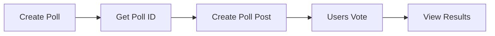

<Info>
**Quick Start:** Create a poll first using the Poll Repository, then create a post that references the poll ID.
</Info>

## Overview

Poll posts enable interactive community engagement by allowing users to vote on questions. Users can create multiple-choice polls with customizable time limits and voting restrictions.

### Architecture



## Parameters

| Parameter | Type | Required | Description |
|-----------|------|----------|-------------|
| `text` | String | Yes | Post content (max 20,000 characters) |
| `pollId` | String | Yes | ID of the created poll |
| `targetType` | Enum | Yes | Target destination (community or user feed) |
| `tags` | Array | No | Searchable tags (not available in Flutter) |
| `metadata` | Object | No | Custom fields for extended functionality |

## Poll Configuration

| Parameter | Type | Required | Description |
|-----------|------|----------|-------------|
| `question` | String | Yes | The poll question |
| `answers` | Array | Yes | Available answer options |
| `timeToClosePoll` | Number | No | Auto-close time in seconds |
| `multipleVoting` | Boolean | No | Allow multiple answer selection |

## Implementation

<Tabs>
<Tab title="iOS">
Create polls and poll posts using the Poll and Post repositories.

```swift
// Step 1: Create poll
let pollRepository = AmityPollRepository(client: client)
let pollBuilder = AmityPollCreationBuilder()
    .setQuestion("What's your favorite programming language?")
    .setAnswers(["Swift", "Kotlin", "TypeScript", "Dart"])
    .setTimeToClosePoll(86400) // 24 hours
    .setMultipleVoting(false)

pollRepository.createPoll(with: pollBuilder) { result in
    switch result {
    case .success(let poll):
        // Step 2: Create poll post
        let postRepository = AmityPostRepository(client: client)
        let postBuilder = AmityPostCreateBuilder()
            .setText("🗳️ Help us choose our next tech stack!")
            .setPollId(poll.pollId)
            .setTargetType(.community)
            .setTargetId("dev_community")
            .setTags(["poll", "tech", "discussion"])
            .setMetadata(["category": "development"])
        
        postRepository.createPost(with: postBuilder) { postResult in
            switch postResult {
            case .success(let post):
                print("Poll post created: \(post.postId)")
            case .failure(let error):
                print("Post error: \(error.localizedDescription)")
            }
        }
    case .failure(let error):
        print("Poll error: \(error.localizedDescription)")
    }
}
```
</Tab>

<Tab title="Android">
Create polls and poll posts using repository builders.

```kotlin
// Step 1: Create poll
val pollRepository = AmityPollRepository(client)
val pollBuilder = AmityPoll.PollCreateBuilder()
    .question("What's your favorite programming language?")
    .answers(listOf("Swift", "Kotlin", "TypeScript", "Dart"))
    .timeToClosePoll(86400) // 24 hours
    .isMultipleVoting(false)

pollRepository.createPoll(pollBuilder).subscribe { poll ->
    // Step 2: Create poll post
    val postRepository = AmityPostRepository(client)
    val postBuilder = AmityPost.PostCreateBuilder()
        .setText("🗳️ Help us choose our next tech stack!")
        .setPollId(poll.getPollId())
        .setTargetType(AmityPost.TargetType.COMMUNITY)
        .setTargetId("dev_community")
        .setTags(listOf("poll", "tech", "discussion"))
        .setMetadata(mapOf("category" to "development"))
    
    postRepository.createPost(postBuilder).subscribe(
        { post -> println("Poll post created: ${post.getPostId()}") },
        { error -> println("Post error: ${error.message}") }
    )
}
```
</Tab>

<Tab title="TypeScript">
Create polls and poll posts using async/await pattern.

```typescript
import { PollRepository, PostRepository } from '@amityco/ts-sdk';

// Step 1: Create poll
const pollRepository = new PollRepository(client);
const poll = await pollRepository.createPoll({
    question: "What's your favorite programming language?",
    answers: ["Swift", "Kotlin", "TypeScript", "Dart"],
    timeToClosePoll: 86400, // 24 hours
    multipleVoting: false
});

// Step 2: Create poll post
const postRepository = new PostRepository(client);
const post = await postRepository.createPost({
    dataType: 'poll',
    data: {
        text: '🗳️ Help us choose our next tech stack!',
        pollId: poll.pollId
    },
    targetType: 'community',
    targetId: 'dev_community',
    tags: ['poll', 'tech', 'discussion'],
    metadata: { category: 'development' }
});

console.log('Poll post created:', post.postId);
```
</Tab>

<Tab title="Flutter">
Create polls and poll posts using async/await with proper error handling.

```dart
// Step 1: Create poll
final pollRepository = AmityPollRepository(client: client);
final pollBuilder = AmityPollCreationBuilder()
    ..question = "What's your favorite programming language?"
    ..answers = ["Swift", "Kotlin", "TypeScript", "Dart"]
    ..timeToClosePoll = 86400 // 24 hours
    ..isMultipleVoting = false;

try {
    final poll = await pollRepository.createPoll(pollBuilder);
    
    // Step 2: Create poll post
    final postRepository = AmityPostRepository(client: client);
    final postBuilder = AmityPostCreateBuilder()
        ..text = '🗳️ Help us choose our next tech stack!'
        ..pollId = poll.pollId
        ..targetType = AmityPostTargetType.COMMUNITY
        ..targetId = 'dev_community'
        ..metadata = {'category': 'development'};
    
    final post = await postRepository.createPost(postBuilder);
    print('Poll post created: ${post.postId}');
} catch (error) {
    print('Error: $error');
}
```
</Tab>
</Tabs>

## Error Handling

<Tabs>
<Tab title="iOS">
```swift
// Comprehensive error handling
pollRepository.createPoll(with: pollBuilder) { result in
    switch result {
    case .success(let poll):
        // Create post
        postRepository.createPost(with: postBuilder) { postResult in
            switch postResult {
            case .success(let post):
                print("Success: \(post.postId)")
            case .failure(let error):
                handlePostError(error)
            }
        }
    case .failure(let error):
        handlePollError(error)
    }
}

func handlePollError(_ error: Error) {
    if let amityError = error as? AmityError {
        switch amityError {
        case .invalidPollQuestion:
            print("Poll question is invalid")
        case .tooManyAnswers:
            print("Too many answer options")
        case .invalidTimeLimit:
            print("Invalid time limit")
        default:
            print("Poll error: \(amityError.localizedDescription)")
        }
    }
}
```
</Tab>

<Tab title="Android">
```kotlin
// Comprehensive error handling
pollRepository.createPoll(pollBuilder).subscribe(
    { poll ->
        postRepository.createPost(postBuilder).subscribe(
            { post -> println("Success: ${post.getPostId()}") },
            { error -> handlePostError(error) }
        )
    },
    { error -> handlePollError(error) }
)

fun handlePollError(error: Throwable) {
    when (error) {
        is AmityException.InvalidPollQuestionException -> 
            println("Poll question is invalid")
        is AmityException.TooManyAnswersException -> 
            println("Too many answer options")
        is AmityException.InvalidTimeLimitException -> 
            println("Invalid time limit")
        else -> println("Poll error: ${error.message}")
    }
}
```
</Tab>

<Tab title="TypeScript">
```typescript
try {
    // Create poll
    const poll = await pollRepository.createPoll(pollData);
    
    // Create poll post
    const post = await postRepository.createPost(postData);
    console.log('Success:', post.postId);
} catch (error) {
    if (error.code === 'INVALID_POLL_QUESTION') {
        console.error('Poll question is invalid');
    } else if (error.code === 'TOO_MANY_ANSWERS') {
        console.error('Too many answer options');
    } else if (error.code === 'INVALID_TIME_LIMIT') {
        console.error('Invalid time limit');
    } else {
        console.error('Error:', error.message);
    }
}
```
</Tab>

<Tab title="Flutter">
```dart
try {
    // Create poll
    final poll = await pollRepository.createPoll(pollBuilder);
    
    // Create poll post
    final post = await postRepository.createPost(postBuilder);
    print('Success: ${post.postId}');
} catch (error) {
    if (error is AmityInvalidPollQuestionException) {
        print('Poll question is invalid');
    } else if (error is AmityTooManyAnswersException) {
        print('Too many answer options');
    } else if (error is AmityInvalidTimeLimitException) {
        print('Invalid time limit');
    } else {
        print('Error: $error');
    }
}
```
</Tab>
</Tabs>

## Best Practices

<CardGroup cols={2}>
<Card title="Poll Design" icon="chart-bar">
- Keep questions clear and concise
- Provide balanced answer options
- Set appropriate time limits
- Consider multiple voting when relevant
</Card>

<Card title="Engagement" icon="users">
- Use emojis to make polls more engaging
- Ask timely and relevant questions
- Encourage participation in post text
- Share results when polls close
</Card>
</CardGroup>

## Real-World Use Cases

<AccordionGroup>
<Accordion title="Community Decision Making">
```swift
// iOS: Team decision poll
let pollBuilder = AmityPollCreationBuilder()
    .setQuestion("Which meeting time works best for everyone?")
    .setAnswers(["9:00 AM", "1:00 PM", "3:00 PM", "5:00 PM"])
    .setTimeToClosePoll(172800) // 48 hours
    .setMultipleVoting(true) // Allow multiple selections

let postBuilder = AmityPostCreateBuilder()
    .setText("🕐 Let's find the perfect meeting time! Vote for all times that work for you.")
    .setTags(["meeting", "schedule", "team"])
```
</Accordion>

<Accordion title="Product Feedback Collection">
```kotlin
// Android: Feature priority poll
val pollBuilder = AmityPoll.PollCreateBuilder()
    .question("Which feature should we prioritize next?")
    .answers(listOf(
        "Dark mode theme",
        "Push notifications",
        "File sharing",
        "Video calls"
    ))
    .timeToClosePoll(604800) // 1 week
    .isMultipleVoting(false)

val postBuilder = AmityPost.PostCreateBuilder()
    .setText("🚀 Help shape our roadmap! Your vote matters.")
    .setTags(listOf("roadmap", "features", "feedback"))
```
</Accordion>

<Accordion title="Event Planning">
```typescript
// TypeScript: Event planning poll
const poll = await pollRepository.createPoll({
    question: "What type of team event would you prefer?",
    answers: ["Virtual game night", "Outdoor picnic", "Restaurant dinner", "Cooking class"],
    timeToClosePoll: 432000, // 5 days
    multipleVoting: false
});

const post = await postRepository.createPost({
    dataType: 'poll',
    data: {
        text: '🎉 Planning our next team event! Cast your vote.',
        pollId: poll.pollId
    },
    tags: ['event', 'team', 'planning']
});
```
</Accordion>
</AccordionGroup>

<Tip>
For polls with time limits, consider sending reminders as the deadline approaches to maximize participation.
</Tip>