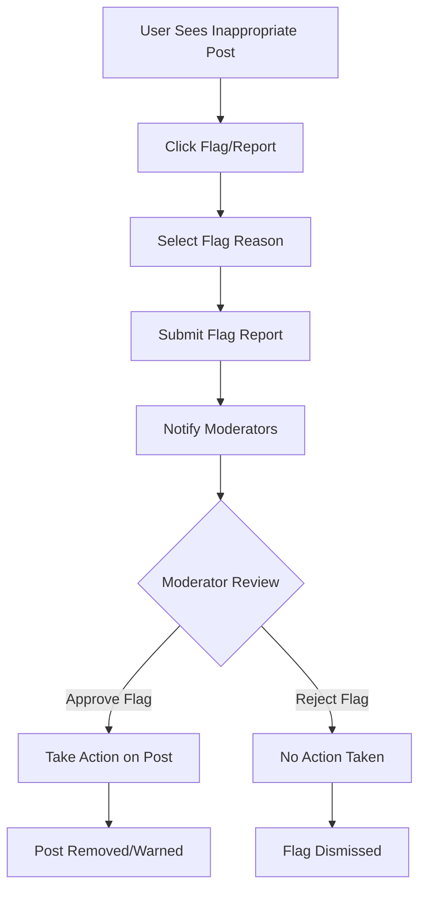

# Flag & Unflag Posts

The social.plus SDK provides robust content flagging functionality that enables users to report inappropriate posts and helps maintain safe, welcoming communities. The system supports detailed flag reasons, status tracking, and moderation workflows.

## Overview



<CardGroup cols={2}>
  <Card title="Community Safety" icon="shield-check">
    Enable users to report violations and maintain community guidelines
  </Card>
  <Card title="Moderation Tools" icon="gavel">
    Provide moderators with detailed context for content review decisions
  </Card>
</CardGroup>

## Flag Reasons

The SDK provides predefined flag reasons to help categorize reports effectively:

| Flag Reason | Description | Use Case |
|-------------|-------------|----------|
| `CommunityGuidelines` | Against community guidelines | General rule violations |
| `HarassmentOrBullying` | Harassment or bullying | Targeting individuals |
| `SelfHarmOrSuicide` | Self-harm or suicide content | Mental health concerns |
| `ViolenceOrThreateningContent` | Violence or threats | Safety-related content |
| `SellingRestrictedItems` | Restricted item sales | Illegal or prohibited goods |
| `SexualContentOrNudity` | Sexual or nude content | Adult content violations |
| `SpamOrScams` | Spam or scam content | Unwanted promotional content |
| `FalseInformation` | Misinformation | Fake news or misleading info |
| `Others` | Custom explanation | Other reasons (max 300 chars) |

<Note>
Flag reasons with detailed context are available in iOS, Android, and TypeScript SDKs. Other platforms support basic flagging functionality.
</Note>

## Flag a Post

Report inappropriate content with specific reasons and optional additional context.

<Tabs>
  <Tab title="iOS">
    ```swift
    import AmitySDK
    
    class PostFlaggingManager {
        private let client: AmityClient
        
        init(client: AmityClient) {
            self.client = client
        }
        
        // Flag post with specific reason
        func flagPost(
            postId: String,
            reason: AmityContentFlagReason,
            explanation: String? = nil,
            completion: @escaping (Result<Void, Error>) -> Void
        ) {
            let repository = AmityPostRepository(client: client)
            
            repository.flagPost(
                withId: postId,
                reason: reason,
                explanation: explanation
            ) { result in
                switch result {
                case .success:
                    print("Post flagged successfully")
                    completion(.success(()))
                    
                case .failure(let error):
                    print("Failed to flag post: \(error.localizedDescription)")
                    completion(.failure(error))
                }
            }
        }
        
        // Flag post with custom reason
        func flagPostWithCustomReason(
            postId: String,
            explanation: String,
            completion: @escaping (Result<Void, Error>) -> Void
        ) {
            flagPost(
                postId: postId,
                reason: .others,
                explanation: explanation,
                completion: completion
            )
        }
        
        // Check if current user has flagged the post
        func checkIfFlagged(
            postId: String,
            completion: @escaping (Result<Bool, Error>) -> Void
        ) {
            let repository = AmityPostRepository(client: client)
            
            repository.isFlaggedByMe(postId: postId) { result in
                switch result {
                case .success(let isFlagged):
                    print("Post flagged by current user: \(isFlagged)")
                    completion(.success(isFlagged))
                    
                case .failure(let error):
                    print("Error checking flag status: \(error)")
                    completion(.failure(error))
                }
            }
        }
        
        // Unflag a previously flagged post
        func unflagPost(
            postId: String,
            completion: @escaping (Result<Void, Error>) -> Void
        ) {
            let repository = AmityPostRepository(client: client)
            
            repository.unflagPost(withId: postId) { result in
                switch result {
                case .success:
                    print("Post unflagged successfully")
                    completion(.success(()))
                    
                case .failure(let error):
                    print("Failed to unflag post: \(error)")
                    completion(.failure(error))
                }
            }
        }
        
        // Comprehensive flag management
        func managePostFlag(
            postId: String,
            shouldFlag: Bool,
            reason: AmityContentFlagReason = .others,
            explanation: String? = nil
        ) {
            checkIfFlagged(postId: postId) { [weak self] result in
                switch result {
                case .success(let isFlagged):
                    if shouldFlag && !isFlagged {
                        self?.flagPost(
                            postId: postId,
                            reason: reason,
                            explanation: explanation
                        ) { _ in }
                    } else if !shouldFlag && isFlagged {
                        self?.unflagPost(postId: postId) { _ in }
                    }
                    
                case .failure(let error):
                    print("Error managing flag: \(error)")
                }
            }
        }
    }
    ```
  </Tab>
  
  <Tab title="Android">
    ```kotlin
    import co.amity.sdk.*
    
    class PostFlaggingManager {
        
        // Flag post with specific reason
        fun flagPost(
            postId: String,
            reason: AmityContentFlagReason,
            explanation: String? = null,
            callback: (Boolean, String?) -> Unit
        ) {
            AmityPostRepository.Builder()
                .build()
                .flagPost(postId)
                .reason(reason)
                .apply {
                    explanation?.let { explanation(it) }
                }
                .flag()
                .subscribe(
                    {
                        println("Post flagged successfully")
                        callback(true, null)
                    },
                    { error ->
                        println("Failed to flag post: ${error.message}")
                        callback(false, error.message)
                    }
                )
        }
        
        // Check flag status
        fun isFlaggedByMe(
            postId: String,
            callback: (Boolean?, String?) -> Unit
        ) {
            AmityPostRepository.Builder()
                .build()
                .isFlaggedByMe(postId)
                .subscribe(
                    { isFlagged ->
                        println("Post flagged by current user: $isFlagged")
                        callback(isFlagged, null)
                    },
                    { error ->
                        println("Error checking flag status: ${error.message}")
                        callback(null, error.message)
                    }
                )
        }
        
        // Unflag post
        fun unflagPost(
            postId: String,
            callback: (Boolean, String?) -> Unit
        ) {
            AmityPostRepository.Builder()
                .build()
                .unflagPost(postId)
                .subscribe(
                    {
                        println("Post unflagged successfully")
                        callback(true, null)
                    },
                    { error ->
                        println("Failed to unflag post: ${error.message}")
                        callback(false, error.message)
                    }
                )
        }
        
        // Comprehensive flag management
        fun managePostFlag(
            postId: String,
            shouldFlag: Boolean,
            reason: AmityContentFlagReason = AmityContentFlagReason.OTHERS,
            explanation: String? = null
        ) {
            isFlaggedByMe(postId) { isFlagged, error ->
                if (error != null) {
                    println("Error checking flag status: $error")
                    return@isFlaggedByMe
                }
                
                when {
                    shouldFlag && isFlagged == false -> {
                        flagPost(postId, reason, explanation) { success, err ->
                            if (!success) {
                                println("Failed to flag post: $err")
                            }
                        }
                    }
                    !shouldFlag && isFlagged == true -> {
                        unflagPost(postId) { success, err ->
                            if (!success) {
                                println("Failed to unflag post: $err")
                            }
                        }
                    }
                }
            }
        }
        
        // Batch flag operations
        fun flagMultiplePosts(
            postIds: List<String>,
            reason: AmityContentFlagReason,
            explanation: String? = null,
            onComplete: (Int, Int) -> Unit // success count, failure count
        ) {
            var successCount = 0
            var failureCount = 0
            var completedCount = 0
            
            postIds.forEach { postId ->
                flagPost(postId, reason, explanation) { success, _ ->
                    if (success) successCount++ else failureCount++
                    completedCount++
                    
                    if (completedCount == postIds.size) {
                        onComplete(successCount, failureCount)
                    }
                }
            }
        }
    }
    ```
  </Tab>
  
  <Tab title="TypeScript">
    ```typescript
    import { PostRepository, ContentFlagReason } from '@amityco/ts-sdk';
    
    class PostFlaggingManager {
      
      // Flag post with specific reason
      async flagPost(
        postId: string,
        reason: ContentFlagReason,
        explanation?: string
      ): Promise<boolean> {
        try {
          await PostRepository.flagPost({
            postId,
            reason,
            explanation
          });
          
          console.log('Post flagged successfully');
          return true;
        } catch (error) {
          console.error('Failed to flag post:', error);
          throw error;
        }
      }
      
      // Check if current user flagged the post
      async isFlaggedByMe(postId: string): Promise<boolean> {
        try {
          const isFlagged = await PostRepository.isFlaggedByMe(postId);
          console.log(`Post flagged by current user: ${isFlagged}`);
          return isFlagged;
        } catch (error) {
          console.error('Error checking flag status:', error);
          throw error;
        }
      }
      
      // Unflag a previously flagged post
      async unflagPost(postId: string): Promise<boolean> {
        try {
          await PostRepository.unflagPost(postId);
          console.log('Post unflagged successfully');
          return true;
        } catch (error) {
          console.error('Failed to unflag post:', error);
          throw error;
        }
      }
      
      // Toggle flag status
      async toggleFlag(
        postId: string,
        reason: ContentFlagReason = ContentFlagReason.Others,
        explanation?: string
      ): Promise<boolean> {
        const isFlagged = await this.isFlaggedByMe(postId);
        
        if (isFlagged) {
          return await this.unflagPost(postId);
        } else {
          return await this.flagPost(postId, reason, explanation);
        }
      }
      
      // Flag with validation
      async flagPostWithValidation(
        postId: string,
        reason: ContentFlagReason,
        explanation?: string
      ): Promise<{ success: boolean; message: string }> {
        try {
          // Validate explanation for custom reasons
          if (reason === ContentFlagReason.Others) {
            if (!explanation || explanation.trim().length === 0) {
              return {
                success: false,
                message: 'Explanation is required for custom flag reasons'
              };
            }
            
            if (explanation.length > 300) {
              return {
                success: false,
                message: 'Explanation must be 300 characters or less'
              };
            }
          }
          
          // Check if already flagged
          const alreadyFlagged = await this.isFlaggedByMe(postId);
          if (alreadyFlagged) {
            return {
              success: false,
              message: 'Post is already flagged by you'
            };
          }
          
          // Flag the post
          await this.flagPost(postId, reason, explanation);
          
          return {
            success: true,
            message: 'Post flagged successfully'
          };
        } catch (error) {
          return {
            success: false,
            message: `Failed to flag post: ${error.message}`
          };
        }
      }
      
      // Batch flagging operations
      async flagMultiplePosts(
        posts: Array<{
          postId: string;
          reason: ContentFlagReason;
          explanation?: string;
        }>
      ): Promise<{ success: number; failed: number; errors: string[] }> {
        const results = {
          success: 0,
          failed: 0,
          errors: []
        };
        
        await Promise.allSettled(
          posts.map(async ({ postId, reason, explanation }) => {
            try {
              await this.flagPost(postId, reason, explanation);
              results.success++;
            } catch (error) {
              results.failed++;
              results.errors.push(`${postId}: ${error.message}`);
            }
          })
        );
        
        return results;
      }
    }
    ```
  </Tab>
  
  <Tab title="Flutter">
    ```dart
    import 'package:amity_sdk/amity_sdk.dart';
    
    class PostFlaggingManager {
      
      // Flag post with reason
      Future<bool> flagPost(
        String postId, {
        String? explanation,
      }) async {
        try {
          await AmitySocialClient.newPostRepository()
              .flagPost(postId, explanation: explanation);
          
          print('Post flagged successfully');
          return true;
        } catch (error) {
          print('Failed to flag post: $error');
          return false;
        }
      }
      
      // Check if current user flagged the post
      Future<bool?> isFlaggedByMe(String postId) async {
        try {
          final isFlagged = await AmitySocialClient.newPostRepository()
              .isFlaggedByMe(postId);
          
          print('Post flagged by current user: $isFlagged');
          return isFlagged;
        } catch (error) {
          print('Error checking flag status: $error');
          return null;
        }
      }
      
      // Unflag a previously flagged post
      Future<bool> unflagPost(String postId) async {
        try {
          await AmitySocialClient.newPostRepository()
              .unflagPost(postId);
          
          print('Post unflagged successfully');
          return true;
        } catch (error) {
          print('Failed to unflag post: $error');
          return false;
        }
      }
      
      // Toggle flag status
      Future<bool> toggleFlag(String postId, {String? explanation}) async {
        final isFlagged = await isFlaggedByMe(postId);
        
        if (isFlagged == null) {
          print('Could not determine flag status');
          return false;
        }
        
        if (isFlagged) {
          return await unflagPost(postId);
        } else {
          return await flagPost(postId, explanation: explanation);
        }
      }
      
      // Comprehensive flag management
      Future<Map<String, dynamic>> managePostFlag(
        String postId, {
        bool shouldFlag = true,
        String? explanation,
      }) async {
        try {
          final currentStatus = await isFlaggedByMe(postId);
          
          if (currentStatus == null) {
            return {
              'success': false,
              'message': 'Could not determine current flag status'
            };
          }
          
          if (shouldFlag && !currentStatus) {
            final success = await flagPost(postId, explanation: explanation);
            return {
              'success': success,
              'message': success ? 'Post flagged successfully' : 'Failed to flag post',
              'action': 'flagged'
            };
          } else if (!shouldFlag && currentStatus) {
            final success = await unflagPost(postId);
            return {
              'success': success,
              'message': success ? 'Post unflagged successfully' : 'Failed to unflag post',
              'action': 'unflagged'
            };
          } else {
            return {
              'success': true,
              'message': 'No action needed - already in desired state',
              'action': 'none'
            };
          }
        } catch (error) {
          return {
            'success': false,
            'message': 'Error managing flag: $error',
            'action': 'error'
          };
        }
      }
      
      // Batch operations
      Future<Map<String, dynamic>> flagMultiplePosts(
        List<String> postIds, {
        String? explanation,
      }) async {
        int successCount = 0;
        int failureCount = 0;
        final errors = <String>[];
        
        for (final postId in postIds) {
          final success = await flagPost(postId, explanation: explanation);
          if (success) {
            successCount++;
          } else {
            failureCount++;
            errors.add(postId);
          }
        }
        
        return {
          'total': postIds.length,
          'success': successCount,
          'failed': failureCount,
          'errors': errors,
        };
      }
    }
    ```
  </Tab>
</Tabs>

## Check Flag Status

Determine whether the current user has previously flagged a specific post.

Use this functionality to show appropriate UI states and prevent duplicate flag submissions.

```swift
// iOS Example
flaggingManager.checkIfFlagged(postId: "post123") { result in
    switch result {
    case .success(let isFlagged):
        updateFlagButton(isFlagged: isFlagged)
    case .failure(let error):
        showError(error)
    }
}
```

## Unflag a Post

Remove a previously submitted flag if the user changes their mind or mistakenly reported the content.

This functionality helps reduce false positives and allows users to correct accidental flags.

```typescript
// TypeScript Example
const success = await flaggingManager.unflagPost('post123');
if (success) {
    updateUIToUnflagged();
}
```

## Best Practices

<AccordionGroup>
  <Accordion title="User Interface Design" icon="paintbrush">
    - Provide clear flag reason options with descriptions
    - Show confirmation dialogs before flagging
    - Display current flag status to prevent duplicate reports
    - Offer easy unflag functionality for mistakes
    - Use progressive disclosure for flag reason details
  </Accordion>
  
  <Accordion title="Content Moderation" icon="gavel">
    - Route flags to appropriate moderators based on severity
    - Implement automated actions for high-severity flags
    - Provide detailed flag context to moderators
    - Track flag accuracy to identify false reporting patterns
    - Maintain audit trails for all flagging actions
  </Accordion>
  
  <Accordion title="Community Guidelines" icon="book-open">
    - Clearly communicate what content is acceptable
    - Provide examples of flaggable content
    - Educate users on appropriate flag usage
    - Regular review and update of flag categories
    - Transparent communication about flag outcomes
  </Accordion>
  
  <Accordion title="Error Handling" icon="triangle-exclamation">
    - Handle network failures gracefully during flag operations
    - Provide clear feedback for successful/failed flag attempts
    - Implement retry mechanisms for failed flag submissions
    - Log flagging errors for system monitoring
    - Offer alternative reporting methods if flagging fails
  </Accordion>
</AccordionGroup>

## Advanced Features

<CardGroup cols={2}>
  <Card title="Batch Operations" icon="layer-group">
    Flag multiple posts simultaneously with comprehensive error handling and progress tracking.
  </Card>
  <Card title="Flag Analytics" icon="chart-line">
    Track flagging patterns to identify problematic content and improve community guidelines.
  </Card>
  <Card title="Automated Moderation" icon="robot">
    Integrate with AI moderation tools to pre-filter content before human review.
  </Card>
  <Card title="Appeal Process" icon="balance-scale">
    Provide users with appeal mechanisms for moderation decisions.
  </Card>
</CardGroup>

## Common Use Cases

<AccordionGroup>
  <Accordion title="Community Safety" icon="shield-heart">
    Enable users to report harassment, bullying, or threatening content to maintain a safe environment for all community members.
  </Accordion>
  
  <Accordion title="Content Quality" icon="star">
    Allow users to flag spam, misinformation, or low-quality content to improve overall community standards.
  </Accordion>
  
  <Accordion title="Legal Compliance" icon="scale-balanced">
    Provide mechanisms to report illegal content, copyright violations, or content that violates platform policies.
  </Accordion>
  
  <Accordion title="Cultural Sensitivity" icon="globe">
    Enable reporting of culturally insensitive or offensive content to maintain inclusive communities.
  </Accordion>
</AccordionGroup>

## Implementation Examples

<Tabs>
  <Tab title="Flag Button UI">
    ```swift
    class PostFlagButton: UIButton {
        private let flaggingManager = PostFlaggingManager()
        var postId: String?
        
        override func awakeFromNib() {
            super.awakeFromNib()
            addTarget(self, action: #selector(flagTapped), for: .touchUpInside)
        }
        
        @objc private func flagTapped() {
            guard let postId = postId else { return }
            
            let alertController = UIAlertController(
                title: "Report Post",
                message: "Why are you reporting this post?",
                preferredStyle: .actionSheet
            )
            
            // Add flag reason options
            let reasons: [(String, AmityContentFlagReason)] = [
                ("Spam or Scam", .spamOrScams),
                ("Harassment", .harassmentOrBullying),
                ("False Information", .falseInformation),
                ("Other", .others)
            ]
            
            for (title, reason) in reasons {
                alertController.addAction(UIAlertAction(title: title, style: .default) { _ in
                    self.flagPost(postId: postId, reason: reason)
                })
            }
            
            alertController.addAction(UIAlertAction(title: "Cancel", style: .cancel))
            
            // Present from appropriate view controller
            UIApplication.shared.windows.first?.rootViewController?.present(alertController, animated: true)
        }
        
        private func flagPost(postId: String, reason: AmityContentFlagReason) {
            flaggingManager.flagPost(postId: postId, reason: reason) { result in
                DispatchQueue.main.async {
                    switch result {
                    case .success:
                        self.showSuccessMessage()
                    case .failure(let error):
                        self.showError(error)
                    }
                }
            }
        }
    }
    ```
  </Tab>
  
  <Tab title="Moderation Dashboard">
    ```typescript
    class ModerationDashboard {
      private flaggingManager = new PostFlaggingManager();
      
      async getFlaggedPosts(): Promise<FlaggedPost[]> {
        // This would typically come from a moderation API
        const flaggedPosts = await ModerationAPI.getFlaggedPosts();
        
        return flaggedPosts.map(post => ({
          ...post,
          flagCount: post.flags.length,
          flagReasons: this.aggregateFlagReasons(post.flags)
        }));
      }
      
      private aggregateFlagReasons(flags: Flag[]): FlagReasonSummary {
        const summary: FlagReasonSummary = {};
        
        flags.forEach(flag => {
          summary[flag.reason] = (summary[flag.reason] || 0) + 1;
        });
        
        return summary;
      }
      
      async takeAction(postId: string, action: 'approve' | 'remove' | 'warn'): Promise<void> {
        switch (action) {
          case 'approve':
            await ModerationAPI.approvePost(postId);
            break;
          case 'remove':
            await PostRepository.deletePost(postId);
            break;
          case 'warn':
            await ModerationAPI.warnPostAuthor(postId);
            break;
        }
      }
    }
    ```
  </Tab>
</Tabs>

<Warning>
**Important**: Flagging should be used responsibly. False or malicious flagging can be as harmful as the content it's meant to address. Implement measures to detect and prevent flag abuse.
</Warning>

<Info>
**Moderation Integration**: Flag data integrates with moderation tools and admin consoles, providing context for content review decisions and community management.
</Info>