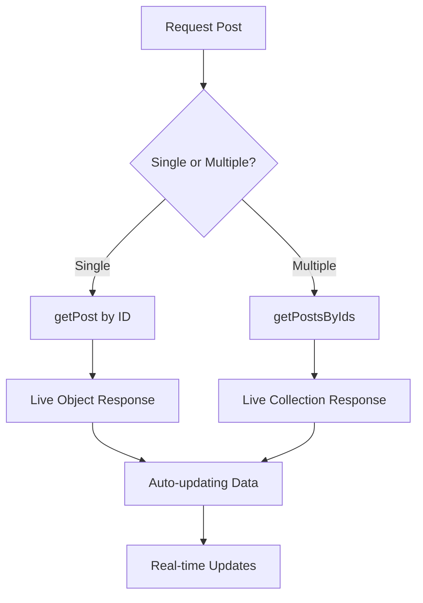

# Get Posts

The Social Plus SDK provides powerful functionality to retrieve posts from your application. Whether you need a single post or multiple posts, the SDK returns results as live objects that automatically update when the underlying data changes.

## Overview



<CardGroup cols={2}>
  <Card title="Live Objects" icon="broadcast-tower">
    Posts are returned as live objects that automatically update when data changes on the server
  </Card>
  <Card title="Comprehensive Data" icon="database">
    Retrieve complete post information including content, reactions, comments, and metadata
  </Card>
</CardGroup>

## Single Post Retrieval

Retrieve a specific post by its unique identifier with complete post information and real-time updates.

<Tabs>
  <Tab title="iOS">
    ```swift
    import AmitySDK

    class PostRetriever {
        private let client: AmityClient
        
        init(client: AmityClient) {
            self.client = client
        }
        
        func getPost(postId: String, completion: @escaping (Result<AmityPost, Error>) -> Void) {
            let repository = AmityPostRepository(client: client)
            let liveObject = repository.getPost(withId: postId)
            
            liveObject.observeOnce { result in
                switch result {
                case .success(let post):
                    print("Post retrieved: \(post.postId)")
                    print("Author: \(post.userId)")
                    print("Created: \(post.createdAt)")
                    print("Content type: \(post.dataType)")
                    completion(.success(post))
                    
                case .failure(let error):
                    print("Failed to get post: \(error.localizedDescription)")
                    completion(.failure(error))
                }
            }
        }
        
        // Get post with live updates
        func observePost(postId: String) -> AmityNotificationToken {
            let repository = AmityPostRepository(client: client)
            let liveObject = repository.getPost(withId: postId)
            
            return liveObject.observe { result in
                switch result {
                case .success(let post):
                    print("Post updated: \(post.postId)")
                    print("Edit timestamp: \(post.editedAt ?? 0)")
                    print("Reactions: \(post.reactionsCount)")
                    print("Comments: \(post.commentsCount)")
                    
                case .failure(let error):
                    print("Post observation failed: \(error)")
                }
            }
        }
        
        // Get post with children (for media posts)
        func getPostWithChildren(postId: String) {
            let repository = AmityPostRepository(client: client)
            let liveObject = repository.getPost(withId: postId)
            
            liveObject.observeOnce { result in
                switch result {
                case .success(let post):
                    print("Main post: \(post.postId)")
                    print("Child posts count: \(post.children.count)")
                    
                    // Process child posts (images, files, videos)
                    for childPost in post.children {
                        self.processChildPost(childPost)
                    }
                    
                case .failure(let error):
                    print("Error: \(error)")
                }
            }
        }
        
        private func processChildPost(_ childPost: AmityPost) {
            switch childPost.dataType {
            case .image:
                print("Image post: \(childPost.postId)")
                // Handle image specific data
            case .file:
                print("File post: \(childPost.postId)")
                // Handle file specific data
            case .video:
                print("Video post: \(childPost.postId)")
                // Handle video specific data
            default:
                print("Other post type: \(childPost.dataType)")
            }
        }
    }
    ```
  </Tab>
  
  <Tab title="Android">
    ```kotlin
    import co.amity.sdk.*
    
    class PostRetriever {
        
        fun getPost(postId: String): LiveData<AmityPost> {
            val repository = AmityPostRepository.Builder().build()
            return repository.getPost(postId)
        }
        
        // Get post with observer
        fun observePost(postId: String) {
            val repository = AmityPostRepository.Builder().build()
            val liveData = repository.getPost(postId)
            
            liveData.observeForever { post ->
                post?.let {
                    println("Post ID: ${it.postId}")
                    println("Author: ${it.userId}")
                    println("Content: ${it.data}")
                    println("Reactions: ${it.getReactionCount()}")
                    println("Comments: ${it.getCommentCount()}")
                    println("Created: ${it.createdAt}")
                    println("Edited: ${it.editedAt}")
                    
                    // Handle different post types
                    when (it.dataType) {
                        AmityDataType.TEXT -> handleTextPost(it)
                        AmityDataType.IMAGE -> handleImagePost(it)
                        AmityDataType.VIDEO -> handleVideoPost(it)
                        AmityDataType.FILE -> handleFilePost(it)
                        else -> println("Unknown post type")
                    }
                }
            }
        }
        
        // Get post with error handling
        fun getPostSafely(postId: String, callback: (AmityPost?) -> Unit) {
            try {
                val repository = AmityPostRepository.Builder().build()
                val liveData = repository.getPost(postId)
                
                liveData.observeForever { post ->
                    if (post != null) {
                        callback(post)
                    } else {
                        println("Post not found or error occurred")
                        callback(null)
                    }
                }
            } catch (e: Exception) {
                println("Error getting post: ${e.message}")
                callback(null)
            }
        }
        
        private fun handleTextPost(post: AmityPost) {
            val textData = post.data as? AmityPost.Data.TEXT
            textData?.let {
                println("Text content: ${it.text}")
            }
        }
        
        private fun handleImagePost(post: AmityPost) {
            println("Image post with ${post.children.size} images")
            post.children.forEach { childPost ->
                val imageData = childPost.data as? AmityPost.Data.IMAGE
                imageData?.let {
                    println("Image URL: ${it.image?.fileUrl}")
                    println("Image size: ${it.image?.fileSize}")
                }
            }
        }
        
        private fun handleVideoPost(post: AmityPost) {
            println("Video post with ${post.children.size} videos")
            post.children.forEach { childPost ->
                val videoData = childPost.data as? AmityPost.Data.VIDEO
                videoData?.let {
                    println("Video URL: ${it.video?.fileUrl}")
                    println("Video duration: ${it.video?.duration}")
                }
            }
        }
        
        private fun handleFilePost(post: AmityPost) {
            println("File post with ${post.children.size} files")
            post.children.forEach { childPost ->
                val fileData = childPost.data as? AmityPost.Data.FILE
                fileData?.let {
                    println("File name: ${it.file?.fileName}")
                    println("File size: ${it.file?.fileSize}")
                }
            }
        }
    }
    ```
  </Tab>
  
  <Tab title="TypeScript">
    ```typescript
    import { PostRepository, AmityPost, LiveObject } from '@amityco/ts-sdk';
    
    class PostRetriever {
      
      async getPost(postId: string): Promise<AmityPost> {
        try {
          const post = await PostRepository.getPost(postId);
          
          console.log('Post retrieved:', {
            id: post.postId,
            author: post.userId,
            content: post.data,
            reactions: post.reactionsCount,
            comments: post.commentsCount,
            created: post.createdAt,
            edited: post.editedAt
          });
          
          return post;
        } catch (error) {
          console.error('Failed to get post:', error);
          throw error;
        }
      }
      
      // Get post with live updates
      observePost(postId: string): LiveObject<AmityPost> {
        const liveObject = PostRepository.postForId(postId);
        
        liveObject.on('dataUpdated', (post: AmityPost) => {
          console.log('Post updated:', {
            id: post.postId,
            reactionsCount: post.reactionsCount,
            commentsCount: post.commentsCount,
            editedAt: post.editedAt
          });
          
          this.handlePostUpdate(post);
        });
        
        liveObject.on('dataError', (error: Error) => {
          console.error('Post observation error:', error);
        });
        
        return liveObject;
      }
      
      // Get post with children for media posts
      async getPostWithChildren(postId: string): Promise<{
        parent: AmityPost;
        children: AmityPost[];
      }> {
        const parentPost = await this.getPost(postId);
        
        if (parentPost.children && parentPost.children.length > 0) {
          const childPosts = await Promise.all(
            parentPost.children.map(childId => this.getPost(childId))
          );
          
          return {
            parent: parentPost,
            children: childPosts
          };
        }
        
        return {
          parent: parentPost,
          children: []
        };
      }
      
      // Get post with full metadata
      async getPostWithMetadata(postId: string): Promise<{
        post: AmityPost;
        community?: any;
        author?: any;
      }> {
        const post = await this.getPost(postId);
        
        // Get additional data based on post context
        let community, author;
        
        if (post.targetType === 'community') {
          community = await CommunityRepository.getCommunity(post.targetId);
        }
        
        if (post.userId) {
          author = await UserRepository.getUser(post.userId);
        }
        
        return { post, community, author };
      }
      
      private handlePostUpdate(post: AmityPost): void {
        switch (post.dataType) {
          case 'text':
            console.log('Text post updated:', post.data);
            break;
          case 'image':
            console.log('Image post updated, children:', post.children?.length);
            break;
          case 'video':
            console.log('Video post updated');
            break;
          case 'file':
            console.log('File post updated');
            break;
          default:
            console.log('Unknown post type updated');
        }
      }
    }
    ```
  </Tab>
  
  <Tab title="Flutter">
    ```dart
    import 'package:amity_sdk/amity_sdk.dart';
    
    class PostRetriever {
      
      Future<AmityPost?> getPost(String postId) async {
        try {
          final post = await AmitySocialClient.newPostRepository()
              .getPost(postId);
          
          print('Post retrieved: ${post.postId}');
          print('Author: ${post.userId}');
          print('Content: ${post.data}');
          print('Reactions: ${post.reactionsCount}');
          print('Comments: ${post.commentsCount}');
          print('Created: ${post.createdAt}');
          print('Edited: ${post.editedAt}');
          
          return post;
        } catch (error) {
          print('Failed to get post: $error');
          return null;
        }
      }
      
      // Get post with live updates
      Stream<AmityPost> observePost(String postId) {
        return AmitySocialClient.newPostRepository()
            .getPost(postId)
            .asStream()
            .map((post) {
              print('Post updated: ${post.postId}');
              _handlePostUpdate(post);
              return post;
            });
      }
      
      // Get post with comprehensive data
      Future<Map<String, dynamic>> getPostWithDetails(String postId) async {
        try {
          final post = await getPost(postId);
          if (post == null) return {};
          
          final result = <String, dynamic>{
            'post': post,
            'hasChildren': post.children.isNotEmpty,
            'childrenCount': post.children.length,
            'postType': _getPostTypeString(post.dataType),
            'isEdited': post.editedAt != null,
            'metadata': post.metadata,
          };
          
          // Get child posts for media content
          if (post.children.isNotEmpty) {
            final childPosts = <AmityPost>[];
            for (final childId in post.children) {
              final childPost = await getPost(childId);
              if (childPost != null) {
                childPosts.add(childPost);
              }
            }
            result['childPosts'] = childPosts;
          }
          
          return result;
        } catch (error) {
          print('Error getting post details: $error');
          return {};
        }
      }
      
      // Batch get posts with error handling
      Future<List<AmityPost>> getPostsBatch(List<String> postIds) async {
        final posts = <AmityPost>[];
        final errors = <String>[];
        
        await Future.wait(
          postIds.map((postId) async {
            try {
              final post = await getPost(postId);
              if (post != null) {
                posts.add(post);
              } else {
                errors.add(postId);
              }
            } catch (e) {
              errors.add(postId);
              print('Failed to get post $postId: $e');
            }
          }),
        );
        
        if (errors.isNotEmpty) {
          print('Failed to retrieve ${errors.length} posts: $errors');
        }
        
        print('Successfully retrieved ${posts.length} out of ${postIds.length} posts');
        return posts;
      }
      
      void _handlePostUpdate(AmityPost post) {
        switch (post.dataType) {
          case AmityDataType.TEXT:
            print('Text post updated: ${post.data}');
            break;
          case AmityDataType.IMAGE:
            print('Image post updated, children: ${post.children.length}');
            break;
          case AmityDataType.VIDEO:
            print('Video post updated');
            break;
          case AmityDataType.FILE:
            print('File post updated');
            break;
          default:
            print('Unknown post type updated');
        }
      }
      
      String _getPostTypeString(AmityDataType dataType) {
        switch (dataType) {
          case AmityDataType.TEXT:
            return 'text';
          case AmityDataType.IMAGE:
            return 'image';
          case AmityDataType.VIDEO:
            return 'video';
          case AmityDataType.FILE:
            return 'file';
          case AmityDataType.POLL:
            return 'poll';
          case AmityDataType.LIVESTREAM:
            return 'livestream';
          default:
            return 'unknown';
        }
      }
    }
    ```
  </Tab>
</Tabs>

## Multiple Posts Retrieval

Retrieve multiple posts by their IDs in a single operation with live collection updates.

<Tabs>
  <Tab title="iOS">
    ```swift
    func getMultiplePosts(postIds: [String]) {
        let repository = AmityPostRepository(client: client)
        let liveCollection = repository.getPosts(withIds: postIds)
        
        liveCollection.observe { result in
            switch result {
            case .success(let posts):
                print("Retrieved \(posts.count) posts")
                
                for post in posts {
                    print("Post: \(post.postId) - \(post.data)")
                }
                
            case .failure(let error):
                print("Failed to get posts: \(error)")
            }
        }
    }
    
    // Get posts with pagination
    func getPostsWithPagination(postIds: [String], pageSize: Int = 10) {
        let repository = AmityPostRepository(client: client)
        let liveCollection = repository.getPosts(withIds: postIds)
        
        liveCollection.observe { result in
            switch result {
            case .success(let posts):
                // Handle paginated results
                let totalPosts = posts.count
                let pages = (totalPosts + pageSize - 1) / pageSize
                
                print("Total posts: \(totalPosts), Pages: \(pages)")
                
                for page in 0..<pages {
                    let startIndex = page * pageSize
                    let endIndex = min(startIndex + pageSize, totalPosts)
                    let pagePosts = Array(posts[startIndex..<endIndex])
                    
                    print("Page \(page + 1): \(pagePosts.count) posts")
                }
                
            case .failure(let error):
                print("Pagination error: \(error)")
            }
        }
    }
    ```
  </Tab>
  
  <Tab title="Android">
    ```kotlin
    fun getMultiplePosts(postIds: List<String>): LiveData<List<AmityPost>> {
        val repository = AmityPostRepository.Builder().build()
        return repository.getPosts(postIds)
    }
    
    // Observe multiple posts with detailed handling
    fun observeMultiplePosts(postIds: List<String>) {
        val repository = AmityPostRepository.Builder().build()
        val liveData = repository.getPosts(postIds)
        
        liveData.observeForever { posts ->
            posts?.let { postList ->
                println("Retrieved ${postList.size} posts out of ${postIds.size} requested")
                
                postList.forEach { post ->
                    println("Post ${post.postId}:")
                    println("  Author: ${post.userId}")
                    println("  Type: ${post.dataType}")
                    println("  Reactions: ${post.getReactionCount()}")
                    println("  Comments: ${post.getCommentCount()}")
                    println("---")
                }
                
                // Check for missing posts
                val retrievedIds = postList.map { it.postId }
                val missingIds = postIds.filter { !retrievedIds.contains(it) }
                if (missingIds.isNotEmpty()) {
                    println("Missing posts: $missingIds")
                }
            }
        }
    }
    
    // Get posts with error handling and retry
    fun getPostsWithRetry(
        postIds: List<String>, 
        maxRetries: Int = 3,
        callback: (List<AmityPost>?) -> Unit
    ) {
        var attempts = 0
        
        fun attemptGet() {
            attempts++
            val repository = AmityPostRepository.Builder().build()
            val liveData = repository.getPosts(postIds)
            
            liveData.observeForever { posts ->
                if (posts != null && posts.isNotEmpty()) {
                    callback(posts)
                } else if (attempts < maxRetries) {
                    println("Attempt $attempts failed, retrying...")
                    Handler(Looper.getMainLooper()).postDelayed({
                        attemptGet()
                    }, 1000 * attempts) // Exponential backoff
                } else {
                    println("Max retries reached, giving up")
                    callback(null)
                }
            }
        }
        
        attemptGet()
    }
    ```
  </Tab>
  
  <Tab title="TypeScript">
    ```typescript
    async getMultiplePosts(postIds: string[]): Promise<AmityPost[]> {
      try {
        const posts = await Promise.all(
          postIds.map(id => PostRepository.getPost(id))
        );
        
        console.log(`Retrieved ${posts.length} posts`);
        
        posts.forEach(post => {
          console.log(`Post ${post.postId}:`, {
            author: post.userId,
            type: post.dataType,
            reactions: post.reactionsCount,
            comments: post.commentsCount
          });
        });
        
        return posts;
      } catch (error) {
        console.error('Failed to get multiple posts:', error);
        throw error;
      }
    }
    
    // Get posts with live collection
    observeMultiplePosts(postIds: string[]): LiveCollection<AmityPost> {
      const liveCollection = PostRepository.getPostsByIds(postIds);
      
      liveCollection.on('dataUpdated', (posts: AmityPost[]) => {
        console.log('Posts updated:', posts.length);
        
        posts.forEach(post => {
          console.log(`Updated post ${post.postId}:`, {
            editedAt: post.editedAt,
            reactionsCount: post.reactionsCount,
            commentsCount: post.commentsCount
          });
        });
      });
      
      liveCollection.on('dataError', (error: Error) => {
        console.error('Posts collection error:', error);
      });
      
      return liveCollection;
    }
    
    // Get posts with filtering and sorting
    async getPostsWithFiltering(
      postIds: string[],
      filters?: {
        dataType?: string;
        minReactions?: number;
        authorId?: string;
      }
    ): Promise<AmityPost[]> {
      const posts = await this.getMultiplePosts(postIds);
      
      let filteredPosts = posts;
      
      if (filters) {
        filteredPosts = posts.filter(post => {
          if (filters.dataType && post.dataType !== filters.dataType) {
            return false;
          }
          
          if (filters.minReactions && post.reactionsCount < filters.minReactions) {
            return false;
          }
          
          if (filters.authorId && post.userId !== filters.authorId) {
            return false;
          }
          
          return true;
        });
      }
      
      // Sort by creation date (newest first)
      filteredPosts.sort((a, b) => 
        new Date(b.createdAt).getTime() - new Date(a.createdAt).getTime()
      );
      
      return filteredPosts;
    }
    ```
  </Tab>
  
  <Tab title="Flutter">
    ```dart
    Future<List<AmityPost>> getMultiplePosts(List<String> postIds) async {
      final posts = <AmityPost>[];
      final errors = <String>[];
      
      await Future.wait(
        postIds.map((postId) async {
          try {
            final post = await AmitySocialClient.newPostRepository()
                .getPost(postId);
            posts.add(post);
          } catch (error) {
            errors.add(postId);
            print('Failed to get post $postId: $error');
          }
        }),
      );
      
      print('Successfully retrieved ${posts.length} out of ${postIds.length} posts');
      
      if (errors.isNotEmpty) {
        print('Failed posts: $errors');
      }
      
      return posts;
    }
    
    // Stream multiple posts with live updates
    Stream<List<AmityPost>> observeMultiplePosts(List<String> postIds) async* {
      final postStreams = postIds.map((postId) =>
          AmitySocialClient.newPostRepository()
              .getPost(postId)
              .asStream()
      ).toList();
      
      await for (final posts in Stream.fromFutures(
        postStreams.map((stream) => stream.first).toList()
      )) {
        yield posts.where((post) => post != null).cast<AmityPost>().toList();
      }
    }
    
    // Get posts with comprehensive error handling
    Future<Map<String, dynamic>> getPostsWithDetails(List<String> postIds) async {
      final result = <String, dynamic>{
        'posts': <AmityPost>[],
        'errors': <String>[],
        'summary': <String, int>{},
      };
      
      for (final postId in postIds) {
        try {
          final post = await AmitySocialClient.newPostRepository()
              .getPost(postId);
          
          result['posts'].add(post);
          
          // Track post types
          final postType = _getPostTypeString(post.dataType);
          result['summary'][postType] = (result['summary'][postType] ?? 0) + 1;
          
        } catch (error) {
          result['errors'].add(postId);
          print('Error getting post $postId: $error');
        }
      }
      
      final posts = result['posts'] as List<AmityPost>;
      print('Retrieved ${posts.length} posts');
      print('Post types: ${result['summary']}');
      
      return result;
    }
    
    String _getPostTypeString(AmityDataType dataType) {
      switch (dataType) {
        case AmityDataType.TEXT:
          return 'text';
        case AmityDataType.IMAGE:
          return 'image';
        case AmityDataType.VIDEO:
          return 'video';
        case AmityDataType.FILE:
          return 'file';
        case AmityDataType.POLL:
          return 'poll';
        case AmityDataType.LIVESTREAM:
          return 'livestream';
        default:
          return 'unknown';
      }
    }
    ```
  </Tab>
</Tabs>

## Advanced Features

<AccordionGroup>
  <Accordion title="Live Object Benefits" icon="broadcast-tower">
    - **Real-time Updates**: Posts automatically refresh when data changes
    - **Memory Efficiency**: Only loads data when observed
    - **Network Optimization**: Reduces unnecessary API calls
    - **Consistency**: Ensures UI reflects latest server state
  </Accordion>
  
  <Accordion title="Post Data Structure" icon="sitemap">
    - **Basic Info**: ID, author, timestamps, content type
    - **Content**: Text, media URLs, custom data
    - **Engagement**: Reaction counts, comment counts
    - **Metadata**: Tags, custom fields, edit history
    - **Relationships**: Parent-child structure for media posts
  </Accordion>
  
  <Accordion title="Error Handling" icon="shield-exclamation">
    - **Post Not Found**: Handle missing or deleted posts
    - **Permission Denied**: Manage private content access
    - **Network Issues**: Implement retry mechanisms
    - **Rate Limiting**: Handle API throttling gracefully
  </Accordion>
  
  <Accordion title="Performance Optimization" icon="gauge-high">
    - **Batch Requests**: Retrieve multiple posts efficiently
    - **Caching**: Store frequently accessed posts
    - **Pagination**: Load posts in manageable chunks
    - **Selective Loading**: Only load required data fields
  </Accordion>
</AccordionGroup>

## Best Practices

<CardGroup cols={2}>
  <Card title="Memory Management" icon="memory">
    Properly dispose of live objects when no longer needed to prevent memory leaks
  </Card>
  <Card title="Error Resilience" icon="shield-check">
    Always implement error handling for network failures and missing posts
  </Card>
  <Card title="UI Responsiveness" icon="bolt">
    Use loading states and skeleton screens while posts are being retrieved
  </Card>
  <Card title="Data Freshness" icon="refresh">
    Leverage live objects for real-time updates without manual refresh
  </Card>
</CardGroup>

## Common Use Cases

<AccordionGroup>
  <Accordion title="Post Detail View" icon="eye">
    Display comprehensive post information including content, reactions, and comments with real-time updates.
  </Accordion>
  
  <Accordion title="Feed Reconstruction" icon="list">
    Rebuild user feeds by retrieving specific posts based on user preferences or algorithms.
  </Accordion>
  
  <Accordion title="Content Moderation" icon="gavel">
    Retrieve posts for moderation review with complete context and metadata.
  </Accordion>
  
  <Accordion title="Analytics Dashboard" icon="chart-line">
    Gather post data for engagement analytics and performance metrics.
  </Accordion>
</AccordionGroup>

<Info>
**Live Objects**: All post retrieval methods return live objects that automatically update when the underlying data changes. This ensures your UI always displays the most current information without manual refresh calls.
</Info>

<Warning>
**Performance Consideration**: When retrieving multiple posts, consider implementing pagination or lazy loading for large datasets to maintain optimal performance.
</Warning>